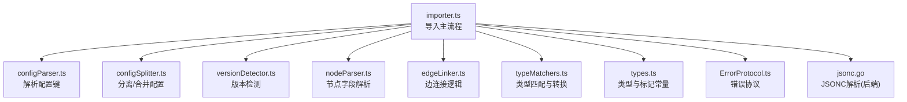
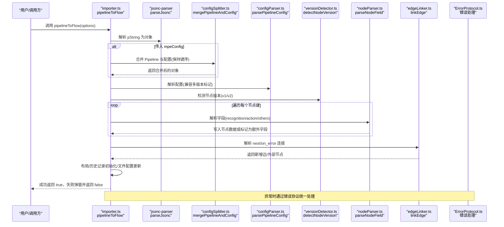
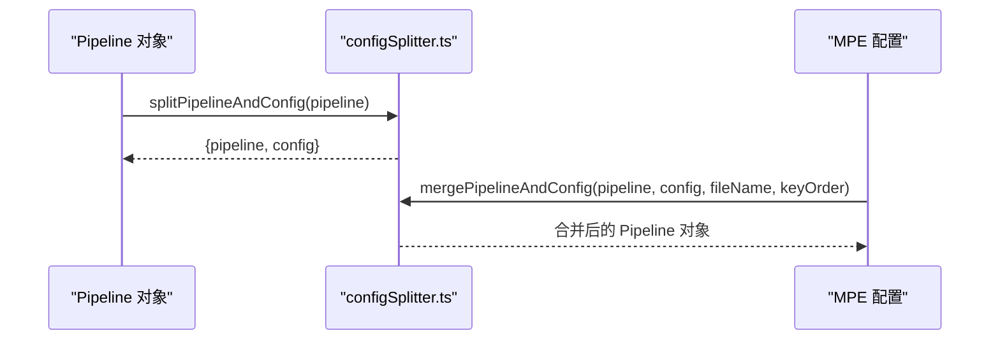
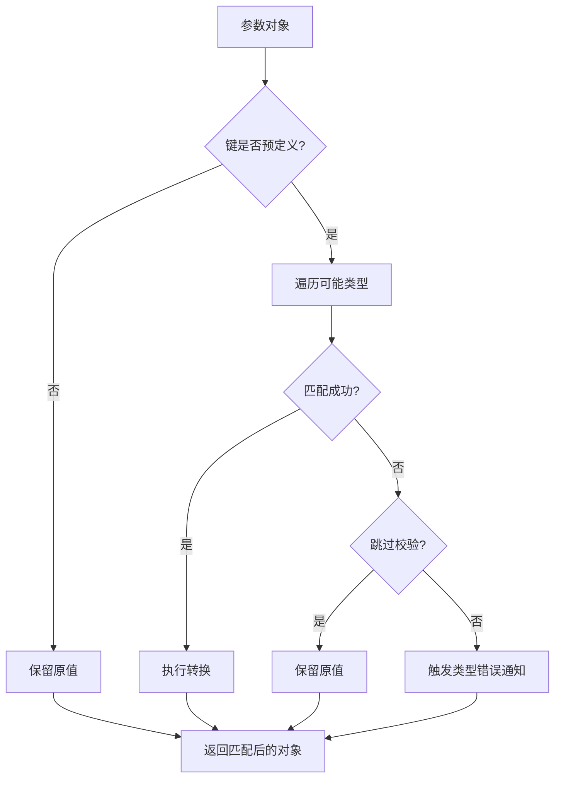
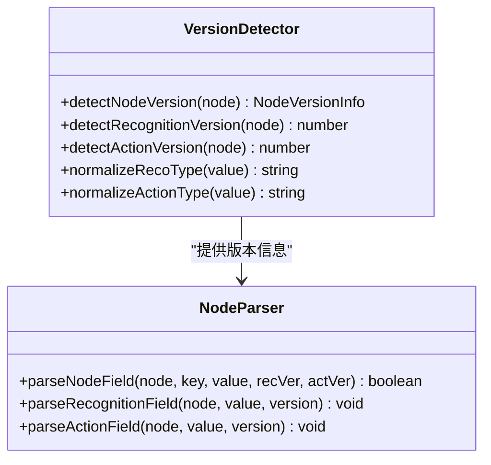
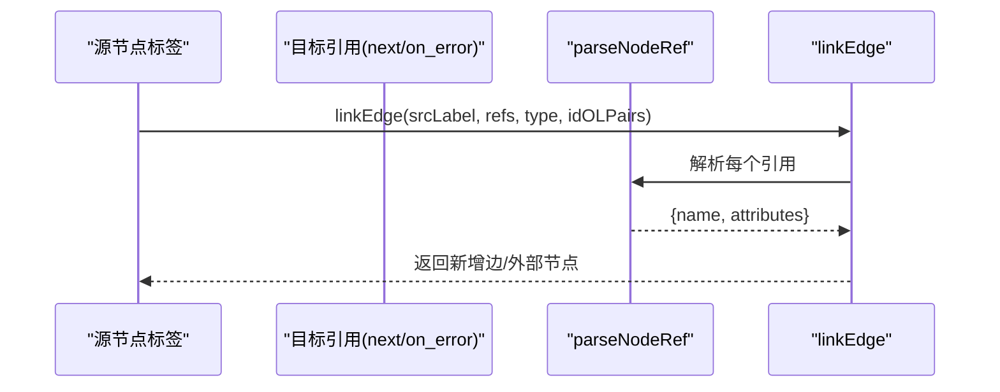
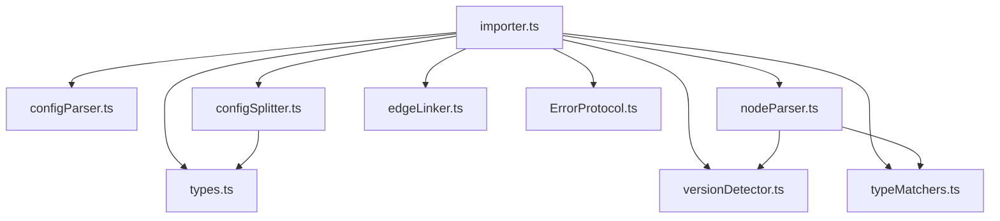

# 导入器模块

<cite>
**本文档引用的文件**
- [importer.ts](file://src/core/parser/importer.ts)
- [typeMatchers.ts](file://src/core/parser/typeMatchers.ts)
- [types.ts](file://src/core/parser/types.ts)
- [index.ts](file://src/core/parser/index.ts)
- [nodeParser.ts](file://src/core/parser/nodeParser.ts)
- [configSplitter.ts](file://src/core/parser/configSplitter.ts)
- [configParser.ts](file://src/core/parser/configParser.ts)
- [versionDetector.ts](file://src/core/parser/versionDetector.ts)
- [edgeLinker.ts](file://src/core/parser/edgeLinker.ts)
- [ErrorProtocol.ts](file://src/services/protocols/ErrorProtocol.ts)
- [jsonc.go](file://LocalBridge/internal/utils/jsonc.go)
</cite>

## 目录
1. [简介](#简介)
2. [项目结构](#项目结构)
3. [核心组件](#核心组件)
4. [架构总览](#架构总览)
5. [详细组件分析](#详细组件分析)
6. [依赖分析](#依赖分析)
7. [性能考虑](#性能考虑)
8. [故障排除指南](#故障排除指南)
9. [结论](#结论)
10. [附录](#附录)

## 简介
本文件面向导入器模块，系统性阐述 pipelineToFlow 函数的实现原理与工程实践，覆盖以下关键主题：
- Pipeline JSON 格式到 Flow 格式的转换流程
- JSON 解析与配置合并策略
- 数据验证与类型适配（类型匹配器）
- 错误处理与异常恢复
- 性能优化与内存管理最佳实践
- 常见问题与解决方案

## 项目结构
导入器模块位于前端核心解析层，围绕“解析器”子模块组织，主要文件职责如下：
- importer.ts：导入主流程，负责 JSON 解析、配置合并、节点与边解析、布局与历史记录初始化
- typeMatchers.ts：参数类型匹配与转换，支撑字段类型推断与格式适配
- nodeParser.ts：节点字段解析，将 Pipeline 字段映射到 Flow 节点数据结构
- configSplitter.ts：分离/合并配置与 Pipeline，支持 MPE 分离存储模式
- configParser.ts：解析配置键与标记字段，兼容多版本配置标记
- versionDetector.ts：检测节点版本（识别/动作），驱动字段解析分支
- edgeLinker.ts：边连接逻辑，支持外部节点/锚点/跳回等语义
- types.ts：类型定义与标记常量
- index.ts：导出入口与工具函数聚合
- ErrorProtocol.ts：错误协议，统一展示与处理各类错误
- jsonc.go：后端 JSONC 解析工具（Go），用于桥接场景下的 JSONC 解析



**图表来源**
- [importer.ts:157-546](file://src/core/parser/importer.ts#L157-L546)
- [configParser.ts:47-68](file://src/core/parser/configParser.ts#L47-L68)
- [configSplitter.ts:154-454](file://src/core/parser/configSplitter.ts#L154-L454)
- [versionDetector.ts:23-110](file://src/core/parser/versionDetector.ts#L23-L110)
- [nodeParser.ts:366-415](file://src/core/parser/nodeParser.ts#L366-L415)
- [edgeLinker.ts:91-161](file://src/core/parser/edgeLinker.ts#L91-L161)
- [typeMatchers.ts:292-339](file://src/core/parser/typeMatchers.ts#L292-L339)
- [types.ts:16-51](file://src/core/parser/types.ts#L16-L51)
- [ErrorProtocol.ts:27-79](file://src/services/protocols/ErrorProtocol.ts#L27-L79)
- [jsonc.go:14-29](file://LocalBridge/internal/utils/jsonc.go#L14-L29)

**章节来源**
- [index.ts:19-85](file://src/core/parser/index.ts#L19-L85)
- [types.ts:16-51](file://src/core/parser/types.ts#L16-L51)

## 核心组件
- pipelineToFlow：导入主函数，串联 JSON 解析、配置合并、节点/边解析、布局与历史记录初始化
- matchParamType/matchSingleType：类型匹配器，负责参数类型推断与格式适配
- parseNodeField：节点字段解析器，将 Pipeline 字段映射到 Flow 节点数据结构
- mergePipelineAndConfig/splitPipelineAndConfig：配置与 Pipeline 的分离/合并
- parsePipelineConfig：配置解析器，兼容多版本配置标记
- detectNodeVersion：版本检测器，区分 v1/v2 字段结构
- linkEdge/parseNodeRef：边连接与节点引用解析，支持外部节点/锚点/跳回
- ErrorProtocol：错误协议，统一错误展示与恢复

**章节来源**
- [importer.ts:157-546](file://src/core/parser/importer.ts#L157-L546)
- [typeMatchers.ts:292-339](file://src/core/parser/typeMatchers.ts#L292-L339)
- [nodeParser.ts:366-415](file://src/core/parser/nodeParser.ts#L366-L415)
- [configSplitter.ts:154-454](file://src/core/parser/configSplitter.ts#L154-L454)
- [configParser.ts:47-68](file://src/core/parser/configParser.ts#L47-L68)
- [versionDetector.ts:23-110](file://src/core/parser/versionDetector.ts#L23-L110)
- [edgeLinker.ts:91-161](file://src/core/parser/edgeLinker.ts#L91-L161)
- [ErrorProtocol.ts:27-79](file://src/services/protocols/ErrorProtocol.ts#L27-L79)

## 架构总览
下图展示了 pipelineToFlow 的端到端调用序列，涵盖 JSON 解析、配置合并、节点与边解析、布局与历史记录初始化。



**图表来源**
- [importer.ts:157-546](file://src/core/parser/importer.ts#L157-L546)
- [configSplitter.ts:154-454](file://src/core/parser/configSplitter.ts#L154-L454)
- [configParser.ts:47-68](file://src/core/parser/configParser.ts#L47-L68)
- [versionDetector.ts:23-110](file://src/core/parser/versionDetector.ts#L23-L110)
- [nodeParser.ts:366-415](file://src/core/parser/nodeParser.ts#L366-L415)
- [edgeLinker.ts:91-161](file://src/core/parser/edgeLinker.ts#L91-L161)
- [ErrorProtocol.ts:27-79](file://src/services/protocols/ErrorProtocol.ts#L27-L79)

## 详细组件分析

### pipelineToFlow 导入主流程
- 输入参数与来源：支持从 options.pString 或剪贴板读取；空字符串/“null”自动归一化为空对象
- 键顺序保留：使用 jsonc-parser.visit 在第一层收集键顺序，用于后续配置合并与输出顺序保持
- 配置合并：当传入 mpeConfig 时，先解析 pString，再调用 mergePipelineAndConfig，最后将合并结果转回字符串以便后续解析
- 配置解析：parsePipelineConfig 统一解析配置键，兼容 $__mpe_config_、__mpe_config_、__yamaape_config_ 等
- 节点解析：遍历对象键，识别便签/分组/外部/锚点/普通节点，创建 Flow 节点并解析字段
- 字段解析：parseNodeField 根据版本检测结果，将识别/动作参数映射到节点数据结构
- 连接解析：linkEdge 解析 next/on_error，支持外部节点/锚点/跳回等语义
- 布局与历史：normalizeImportedNodePosition、ensureGroupNodeOrder、LayoutHelper.auto；初始化历史记录
- 文件配置：更新文件名、前缀、坐标模式、节点顺序映射等

```mermaid
flowchart TD
Start(["开始"]) --> ReadInput["读取输入<br/>pString 或 剪贴板"]
ReadInput --> Normalize["规范化空值<br/>\"\"/\"null\" -> {}"]
Normalize --> VisitKeys["遍历键顺序<br/>jsonc-parser.visit"]
VisitKeys --> MergeCfg{"是否传入 mpeConfig?"}
MergeCfg --> |是| Merge["mergePipelineAndConfig"]
Merge --> ParseObj["parseJsonc 解析对象"]
MergeCfg --> |否| ParseObj
ParseObj --> ParseCfg["parsePipelineConfig 解析配置"]
ParseCfg --> DetectVer["detectNodeVersion 检测版本"]
DetectVer --> LoopNodes["遍历节点键"]
LoopNodes --> ParseField["parseNodeField 解析字段"]
ParseField --> NextConn["解析 next 连接"]
NextConn --> ErrorConn["解析 on_error 连接"]
ErrorConn --> Layout["布局/历史/文件配置"]
Layout --> Done(["完成"])
ParseObj --> Err["捕获异常并弹窗"]
Err --> Done
```

**图表来源**
- [importer.ts:157-546](file://src/core/parser/importer.ts#L157-L546)
- [configSplitter.ts:154-454](file://src/core/parser/configSplitter.ts#L154-L454)
- [configParser.ts:47-68](file://src/core/parser/configParser.ts#L47-L68)
- [versionDetector.ts:23-110](file://src/core/parser/versionDetector.ts#L23-L110)
- [nodeParser.ts:366-415](file://src/core/parser/nodeParser.ts#L366-L415)
- [edgeLinker.ts:91-161](file://src/core/parser/edgeLinker.ts#L91-L161)

**章节来源**
- [importer.ts:157-546](file://src/core/parser/importer.ts#L157-L546)

### JSON 解析与配置合并
- JSON 解析：使用 jsonc-parser.parse 解析 JSONC（支持尾随逗号、行/块注释），并结合 visit 保留原始键顺序
- 配置合并：mergePipelineAndConfig 将外部配置映射为 $__mpe_code 标记，支持键顺序保持与特殊节点（外部/锚点/便签/分组）映射
- 配置分离：splitPipelineAndConfig 将 $__mpe_code 与普通节点分离，生成纯 Pipeline 与 MPE 配置对象



**图表来源**
- [configSplitter.ts:21-144](file://src/core/parser/configSplitter.ts#L21-L144)
- [configSplitter.ts:154-454](file://src/core/parser/configSplitter.ts#L154-L454)

**章节来源**
- [configSplitter.ts:21-144](file://src/core/parser/configSplitter.ts#L21-L144)
- [configSplitter.ts:154-454](file://src/core/parser/configSplitter.ts#L154-L454)

### 数据验证与类型适配（类型匹配器）
- matchParamType：对参数对象逐键匹配，若未预定义则保留，否则尝试所有可能类型
- matchSingleType：针对具体 FieldTypeEnum 执行严格转换，如整型/浮点/布尔/数组/XYWH/位置数组/键值对等
- Any/ObjectList/StringOrObjectList：支持对象/字符串混合列表的解析与回退
- 错误处理：类型转换失败时静默警告或触发通知，支持跳过校验模式



**图表来源**
- [typeMatchers.ts:292-339](file://src/core/parser/typeMatchers.ts#L292-L339)
- [typeMatchers.ts:24-283](file://src/core/parser/typeMatchers.ts#L24-L283)

**章节来源**
- [typeMatchers.ts:292-339](file://src/core/parser/typeMatchers.ts#L292-L339)
- [typeMatchers.ts:24-283](file://src/core/parser/typeMatchers.ts#L24-L283)

### 字段映射与版本兼容
- 版本检测：detectNodeVersion/detectRecognitionVersion/detectActionVersion 根据字段结构判断 v1/v2
- 字段解析：parseNodeField 根据版本分支处理识别/动作类型与参数，同时兼容 v1 的平铺参数
- 类型标准化：normalizeRecoType/normalizeActionType 统一大小写与枚举值



**图表来源**
- [versionDetector.ts:23-110](file://src/core/parser/versionDetector.ts#L23-L110)
- [nodeParser.ts:366-415](file://src/core/parser/nodeParser.ts#L366-L415)

**章节来源**
- [versionDetector.ts:23-110](file://src/core/parser/versionDetector.ts#L23-L110)
- [nodeParser.ts:366-415](file://src/core/parser/nodeParser.ts#L366-L415)

### 边连接与引用解析
- linkEdge：根据源标签与目标引用数组创建边，必要时创建外部节点/锚点
- parseNodeRef：解析字符串/对象形式的节点引用，支持 [Anchor]/[JumpBack] 前缀
- 跳回与锚点：通过 attributes.jump_back/anchor 控制目标入口类型



**图表来源**
- [edgeLinker.ts:91-161](file://src/core/parser/edgeLinker.ts#L91-L161)
- [edgeLinker.ts:47-81](file://src/core/parser/edgeLinker.ts#L47-L81)

**章节来源**
- [edgeLinker.ts:91-161](file://src/core/parser/edgeLinker.ts#L91-L161)
- [edgeLinker.ts:47-81](file://src/core/parser/edgeLinker.ts#L47-L81)

### 配置解析与标记兼容
- isConfigKey/isMark：识别配置键与标记字段
- getConfigMark：兼容 $__mpe_code/__mpe_code/__yamaape 等标记
- parsePipelineConfig：统一解析配置对象，填充文件名、前缀、坐标模式等

**章节来源**
- [configParser.ts:9-68](file://src/core/parser/configParser.ts#L9-L68)

## 依赖分析
导入器模块内部依赖关系清晰，遵循“低耦合、高内聚”的设计原则：
- importer.ts 作为协调者，依赖 configParser/configSplitter/versionDetector/nodeParser/edgeLinker/typeMatchers/types
- nodeParser 依赖 typeMatchers 与 versionDetector，形成解析链路
- configSplitter 依赖 types 常量与标记，保证键前缀一致性
- ErrorProtocol 作为横切关注点，统一错误展示与恢复



**图表来源**
- [importer.ts:157-546](file://src/core/parser/importer.ts#L157-L546)
- [nodeParser.ts:366-415](file://src/core/parser/nodeParser.ts#L366-L415)
- [configSplitter.ts:154-454](file://src/core/parser/configSplitter.ts#L154-L454)
- [configParser.ts:47-68](file://src/core/parser/configParser.ts#L47-L68)
- [versionDetector.ts:23-110](file://src/core/parser/versionDetector.ts#L23-L110)
- [edgeLinker.ts:91-161](file://src/core/parser/edgeLinker.ts#L91-L161)
- [typeMatchers.ts:292-339](file://src/core/parser/typeMatchers.ts#L292-L339)
- [types.ts:16-51](file://src/core/parser/types.ts#L16-L51)
- [ErrorProtocol.ts:27-79](file://src/services/protocols/ErrorProtocol.ts#L27-L79)

**章节来源**
- [index.ts:19-85](file://src/core/parser/index.ts#L19-L85)

## 性能考虑
- JSON 解析与键顺序：使用 jsonc-parser.visit 在 O(n) 时间内收集第一层键顺序，避免二次遍历
- 类型匹配：matchParamType 对每个参数键逐一匹配，复杂度 O(k·m)，其中 k 为参数数量，m 为候选类型数；可通过缓存/预编译类型表进一步优化
- 边连接：linkEdge 与 parseNodeRef 采用线性扫描与哈希查找，确保大规模图的可扩展性
- 布局与历史：仅在无显式位置时自动布局，减少不必要的计算
- 内存管理：避免重复拷贝大对象，尽量就地更新；及时释放临时中间结构（如 Map/Set）

## 故障排除指南
- 导入失败弹窗：pipelineToFlow 捕获异常并弹出错误提示，建议检查 Pipeline 格式与版本一致性
- 类型错误通知：matchParamType 在类型不匹配时触发通知，提示检查字段类型
- 错误协议：ErrorProtocol 统一处理文件/OCR/MFW 相关错误，必要时清空控制器连接状态
- JSONC 解析：后端 JSONC 解析由 jsonc.go 提供，支持注释与尾随逗号，便于调试与分享

**章节来源**
- [importer.ts:537-545](file://src/core/parser/importer.ts#L537-L545)
- [typeMatchers.ts:328-334](file://src/core/parser/typeMatchers.ts#L328-L334)
- [ErrorProtocol.ts:27-79](file://src/services/protocols/ErrorProtocol.ts#L27-L79)
- [jsonc.go:14-29](file://LocalBridge/internal/utils/jsonc.go#L14-L29)

## 结论
导入器模块通过 pipelineToFlow 实现了从 Pipeline JSON 到 Flow 的高效转换，具备完善的配置合并、版本兼容、类型适配与错误处理能力。其模块化设计与清晰的依赖关系，使得扩展与维护更为便利。建议在实际应用中结合本文的性能与故障排除建议，持续优化导入体验。

## 附录
- 常见问题
  - Pipeline 格式错误：检查 JSON 语法与注释使用，必要时启用 JSONC 解析
  - 版本不一致：确认识别/动作字段结构是否符合 v1/v2 协议
  - 类型不匹配：根据类型错误通知修正字段类型或启用跳过校验模式
  - 外部节点/锚点缺失：linkEdge 会自动创建外部节点，确保引用格式正确