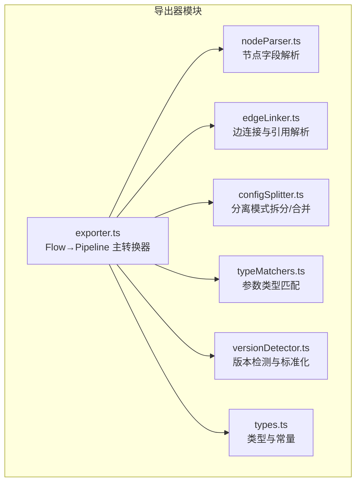
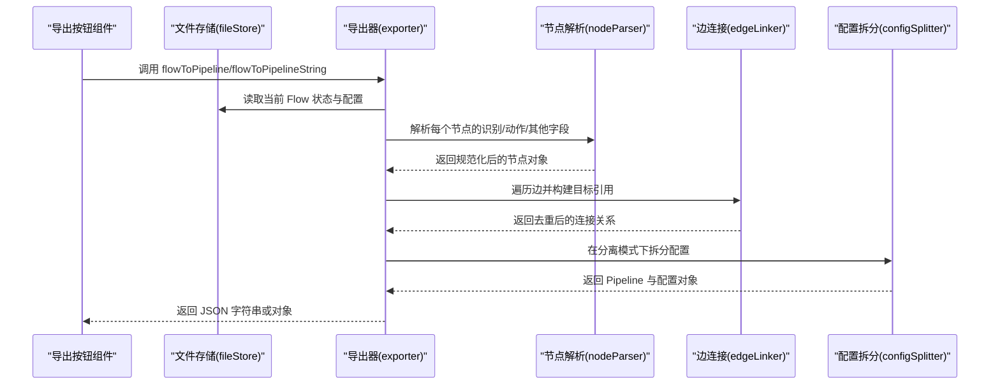
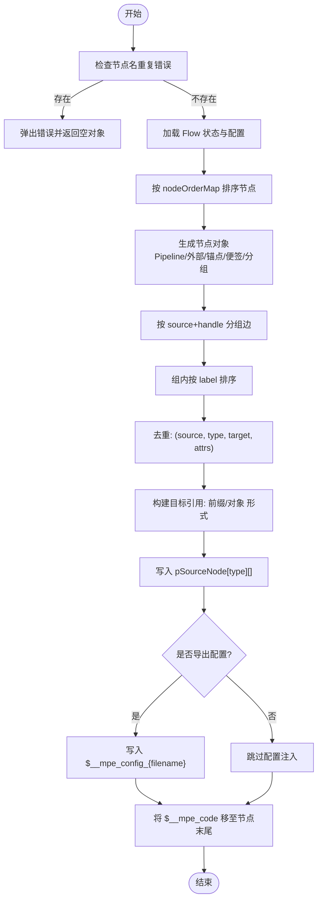
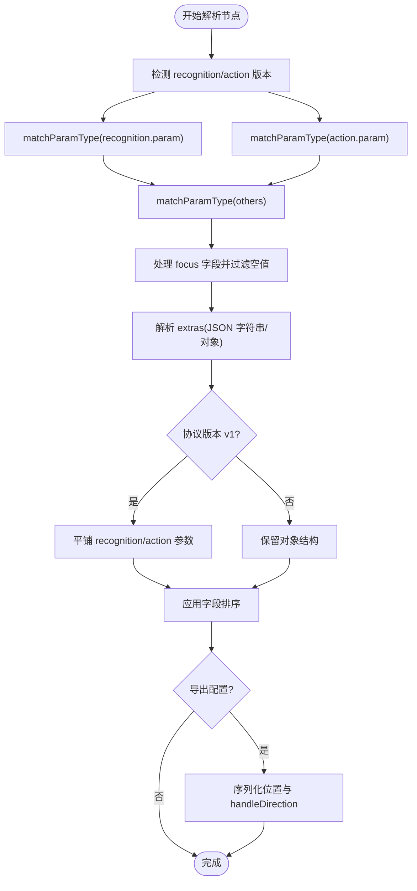
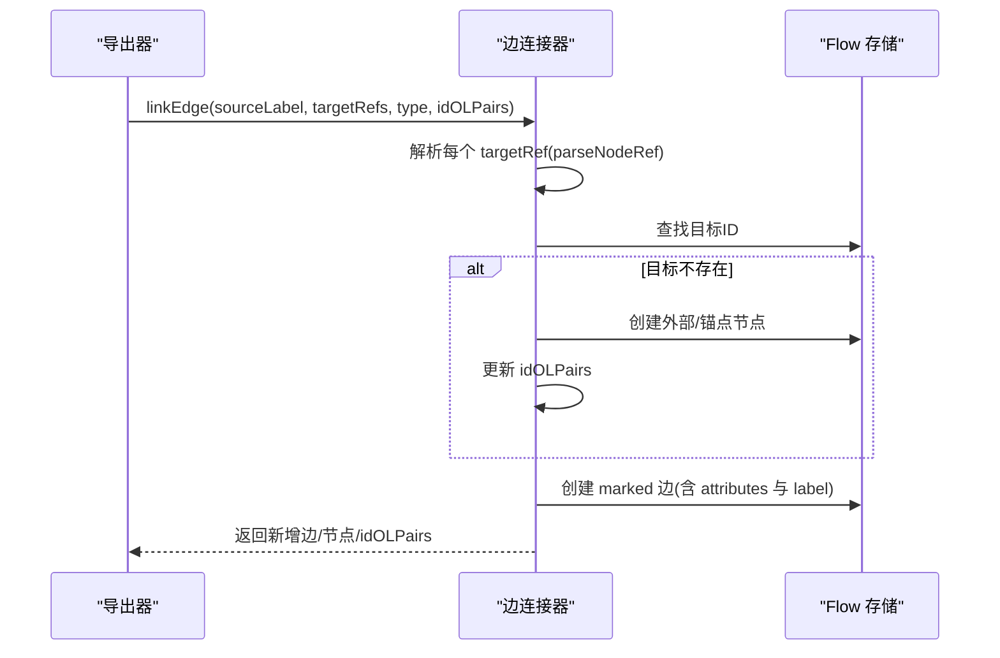
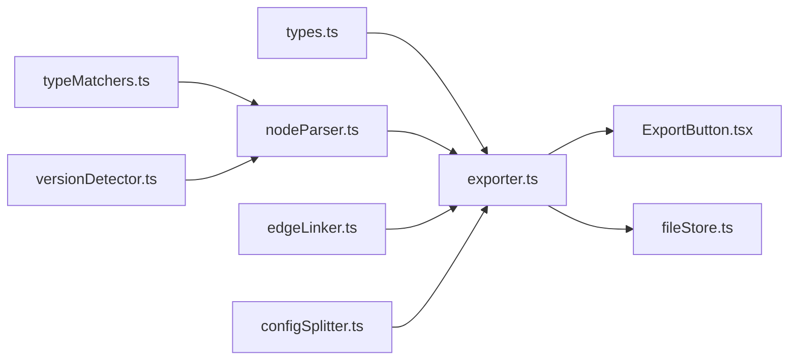

# 导出器模块

<cite>
**本文档引用的文件**
- [exporter.ts](file://src/core/parser/exporter.ts)
- [nodeParser.ts](file://src/core/parser/nodeParser.ts)
- [edgeLinker.ts](file://src/core/parser/edgeLinker.ts)
- [configSplitter.ts](file://src/core/parser/configSplitter.ts)
- [typeMatchers.ts](file://src/core/parser/typeMatchers.ts)
- [versionDetector.ts](file://src/core/parser/versionDetector.ts)
- [types.ts](file://src/core/parser/types.ts)
- [index.ts](file://src/core/parser/index.ts)
- [fileStore.ts](file://src/stores/fileStore.ts)
- [ExportButton.tsx](file://src/components/panels/toolbar/ExportButton.tsx)
</cite>

## 目录
1. [简介](#简介)
2. [项目结构](#项目结构)
3. [核心组件](#核心组件)
4. [架构总览](#架构总览)
5. [详细组件分析](#详细组件分析)
6. [依赖关系分析](#依赖关系分析)
7. [性能考虑](#性能考虑)
8. [故障排除指南](#故障排除指南)
9. [结论](#结论)

## 简介
本文件系统性梳理导出器模块的技术实现，重点覆盖以下方面：
- flowToPipeline 系列函数的实现机制与数据转换算法
- 节点解析器对识别字段、动作字段与通用字段的处理逻辑
- 边连接器在导出过程中的作用，包括ID生成、引用解析与关系建立
- 导出选项配置与格式化输出的实现细节
- 数据完整性保障与错误恢复机制
- 性能优化与大文件处理最佳实践

## 项目结构
导出器模块位于 src/core/parser 目录下，采用“功能域划分”的组织方式，将导出流程拆解为多个职责单一的子模块：
- exporter.ts：Flow 到 Pipeline 的主转换器
- nodeParser.ts：节点字段解析与序列化
- edgeLinker.ts：边连接与引用解析
- configSplitter.ts：分离模式的配置拆分与合并
- typeMatchers.ts：参数类型匹配与转换
- versionDetector.ts：节点版本检测与标准化
- types.ts：核心类型定义与常量
- index.ts：对外导出聚合入口

**图表来源**
- [exporter.ts:1-320](file://src/core/parser/exporter.ts#L1-L320)
- [nodeParser.ts:1-503](file://src/core/parser/nodeParser.ts#L1-L503)
- [edgeLinker.ts:1-162](file://src/core/parser/edgeLinker.ts#L1-L162)
- [configSplitter.ts:1-492](file://src/core/parser/configSplitter.ts#L1-L492)
- [typeMatchers.ts:1-340](file://src/core/parser/typeMatchers.ts#L1-L340)
- [versionDetector.ts:1-149](file://src/core/parser/versionDetector.ts#L1-L149)
- [types.ts:1-113](file://src/core/parser/types.ts#L1-L113)

**章节来源**
- [index.ts:1-84](file://src/core/parser/index.ts#L1-L84)

## 核心组件
- flowToPipeline：将 Flow 格式转换为 Pipeline JSON 对象，负责节点生成、边连接、配置注入与字段排序
- flowToPipelineString：将 Pipeline 对象序列化为 JSON 字符串，并应用缩进配置
- flowToSeparatedStrings：在分离模式下同时生成 Pipeline 与配置两份 JSON 字符串
- parsePipelineNodeForExport：解析识别/动作/其他字段，处理 focus/extras，默认值导出策略与协议版本差异
- linkEdge/parseNodeRef：解析边引用（字符串/对象），生成外部节点与锚点节点，建立连接关系
- splitPipelineAndConfig/mergePipelineAndConfig：分离与合并配置，支持键顺序保持与多态节点（外部/锚点/便签/分组）

**章节来源**
- [exporter.ts:44-319](file://src/core/parser/exporter.ts#L44-L319)
- [nodeParser.ts:39-184](file://src/core/parser/nodeParser.ts#L39-L184)
- [edgeLinker.ts:47-161](file://src/core/parser/edgeLinker.ts#L47-L161)
- [configSplitter.ts:21-144](file://src/core/parser/configSplitter.ts#L21-L144)

## 架构总览
导出流程的核心路径如下：

**图表来源**
- [ExportButton.tsx:109-160](file://src/components/panels/toolbar/ExportButton.tsx#L109-L160)
- [fileStore.ts:777-815](file://src/stores/fileStore.ts#L777-L815)
- [exporter.ts:44-319](file://src/core/parser/exporter.ts#L44-L319)
- [nodeParser.ts:39-184](file://src/core/parser/nodeParser.ts#L39-L184)
- [edgeLinker.ts:91-161](file://src/core/parser/edgeLinker.ts#L91-L161)
- [configSplitter.ts:21-144](file://src/core/parser/configSplitter.ts#L21-L144)

## 详细组件分析

### flowToPipeline 系列函数实现机制
- 输入数据来源：从 Flow 存储与文件状态读取节点、边、配置与文件名
- 节点排序：依据用户配置的 nodeOrderMap 对节点进行稳定排序，确保输出顺序一致
- 节点生成：
  - Pipeline 节点：通过 parsePipelineNodeForExport 生成识别/动作/其他字段，并处理 focus/extras
  - 外部/锚点/便签/分组节点：生成带 $__mpe_code 的配置节点，支持 extra_positions 记录视觉副本位置
- 边连接：
  - 按 source+sourceHandle 分组，组内按 label 排序，保证连接顺序稳定
  - 去重：基于 (source, linkType, targetLabel, attrs) 构造 dedupKey，避免重复引用
  - 引用形式：根据全局配置选择前缀形式（"[Anchor]"、"[JumpBack]"）或对象形式（name/jump_back/anchor）
- 配置注入：当 shouldExportConfig 为真时，将文件配置写入 $__mpe_config_{filename}，并标准化 viewport
- 字段重排：将 MPE 特色字段 $__mpe_code 移至节点末尾，保持输出整洁

**图表来源**
- [exporter.ts:44-286](file://src/core/parser/exporter.ts#L44-L286)

**章节来源**
- [exporter.ts:44-286](file://src/core/parser/exporter.ts#L44-L286)

### 节点解析器：识别/动作/通用字段处理
- 识别字段（recognition）：
  - 支持 v1/v2 协议差异：v1 直接导出字符串，v2 导出 {type, param}
  - 默认识别导出策略：由 exportDefaultRecoAction 控制
  - 参数类型匹配：通过 matchParamType 按预定义类型进行转换与校验
- 动作字段（action）：
  - 同识别字段的版本与默认导出策略
  - 参数类型匹配与空 param 处理（由 exportEmptyParam 决定）
- 其他字段（others）：
  - 统一通过 matchParamType 进行类型匹配
  - focus 字段单独处理并过滤空值
- extras 字段：
  - 从原始 extras 中解析 JSON 字符串，支持混合对象/字符串
- 位置信息与端点方向：
  - 当 isExportConfig 为真时，序列化节点位置与 handleDirection 至 $__mpe_code
- 字段排序：
  - 应用自定义排序规则，确保输出字段顺序可控

**图表来源**
- [nodeParser.ts:39-184](file://src/core/parser/nodeParser.ts#L39-L184)
- [typeMatchers.ts:292-339](file://src/core/parser/typeMatchers.ts#L292-L339)
- [versionDetector.ts:23-110](file://src/core/parser/versionDetector.ts#L23-L110)

**章节来源**
- [nodeParser.ts:39-184](file://src/core/parser/nodeParser.ts#L39-L184)
- [typeMatchers.ts:292-339](file://src/core/parser/typeMatchers.ts#L292-L339)
- [versionDetector.ts:23-110](file://src/core/parser/versionDetector.ts#L23-L110)

### 边连接器：ID 生成、引用解析与关系建立
- 引用解析：
  - 字符串形式：支持 "[Anchor][JumpBack]NodeName" 前缀解析
  - 对象形式：{ name, jump_back?, anchor? }
- 关系建立：
  - 若目标节点不存在，自动创建外部节点或锚点节点（ID 前缀区分）
  - 根据 jump_back 属性设置目标入口类型
  - 生成带索引 label 的 marked 边，确保连接顺序稳定
- ID 管理：
  - 全局计数器管理新节点 ID，resetIdCounter/getNextId 支持重置与递增

**图表来源**
- [edgeLinker.ts:91-161](file://src/core/parser/edgeLinker.ts#L91-L161)
- [edgeLinker.ts:47-81](file://src/core/parser/edgeLinker.ts#L47-L81)

**章节来源**
- [edgeLinker.ts:47-161](file://src/core/parser/edgeLinker.ts#L47-L161)

### 导出选项配置与格式化输出
- 导出模式：
  - 全部导出：生成完整对象，包含配置节点
  - 分离导出：强制导出配置，随后拆分为 Pipeline 与配置两份 JSON
  - 字符串导出：应用 JSON 缩进配置（来自全局配置）
- 配置处理：
  - 过滤运行时字段（nodeOrderMap、nextOrderNumber、savedViewport）
  - 标准化 viewport（normalizeViewport）
  - 注入版本号与文件名等元数据
- 键顺序保持：
  - 合并阶段支持按原始键顺序输出，确保跨版本兼容

**章节来源**
- [exporter.ts:293-319](file://src/core/parser/exporter.ts#L293-L319)
- [configSplitter.ts:154-454](file://src/core/parser/configSplitter.ts#L154-L454)
- [fileStore.ts:777-815](file://src/stores/fileStore.ts#L777-L815)

### 数据完整性保障与错误恢复
- 节点名重复检测：导出前扫描重复节点名并阻断导出，提示用户修改
- 类型匹配失败保护：matchParamType 在跳过校验时保留原始值，否则弹出错误通知
- 边去重：防止同一源节点多次指向相同目标导致的重复引用
- 异常兜底：try/catch 包裹整个导出流程，捕获异常并提示用户查看控制台
- 导入兼容：导入阶段对空字符串/空对象进行容错处理

**章节来源**
- [exporter.ts:46-57](file://src/core/parser/exporter.ts#L46-L57)
- [exporter.ts:277-285](file://src/core/parser/exporter.ts#L277-L285)
- [typeMatchers.ts:324-335](file://src/core/parser/typeMatchers.ts#L324-L335)
- [importer.ts:160-197](file://src/core/parser/importer.ts#L160-L197)

## 依赖关系分析

**图表来源**
- [types.ts:1-113](file://src/core/parser/types.ts#L1-L113)
- [exporter.ts:11-37](file://src/core/parser/exporter.ts#L11-L37)
- [nodeParser.ts:1-25](file://src/core/parser/nodeParser.ts#L1-L25)
- [edgeLinker.ts:1-11](file://src/core/parser/edgeLinker.ts#L1-L11)
- [configSplitter.ts:6-14](file://src/core/parser/configSplitter.ts#L6-L14)
- [ExportButton.tsx:109-160](file://src/components/panels/toolbar/ExportButton.tsx#L109-L160)
- [fileStore.ts:777-815](file://src/stores/fileStore.ts#L777-L815)

**章节来源**
- [index.ts:19-77](file://src/core/parser/index.ts#L19-L77)

## 性能考虑
- 时间复杂度
  - 节点遍历：O(N)，其中 N 为节点数量
  - 边分组与排序：O(E log E)，E 为边数量
  - 去重：Set 查询近似 O(1)，整体 O(E)
  - 类型匹配：对每个节点的参数键执行 O(T) 匹配，T 为预定义类型数
- 空间复杂度
  - 生成的中间对象与映射表（如 externalEntryByKey、anchorEntryByKey、linkSeen）空间与节点/边数量线性相关
- 优化建议
  - 大文件场景：启用分离模式，减少单次 JSON 字符串长度
  - 字段排序：合理配置 fieldSortConfig，避免过度复杂的排序规则
  - 类型匹配：在开发阶段开启严格校验，生产环境可按需开启跳过校验以提升吞吐
  - 缓存策略：对重复导出场景可缓存 matchParamType 结果（需注意字段变更时失效）

[本节为通用性能讨论，无需列出具体文件来源]

## 故障排除指南
- 导出失败且提示重复节点名
  - 现象：导出前检查发现重复节点名，阻断导出
  - 处理：修改重复节点名后重试
- 参数类型错误
  - 现象：matchParamType 报告类型不匹配
  - 处理：检查字段类型与取值范围，必要时开启跳过校验
- 导出内容缺少配置
  - 现象：shouldExportConfig 为假，未生成配置节点
  - 处理：调整 configHandlingMode 或使用 forceExportConfig
- 导入后边关系异常
  - 现象：引用解析失败或目标节点缺失
  - 处理：确认引用格式（字符串前缀或对象形式），确保目标节点存在或允许自动创建

**章节来源**
- [exporter.ts:46-57](file://src/core/parser/exporter.ts#L46-L57)
- [typeMatchers.ts:324-335](file://src/core/parser/typeMatchers.ts#L324-L335)
- [edgeLinker.ts:110-133](file://src/core/parser/edgeLinker.ts#L110-L133)

## 结论
导出器模块通过清晰的职责划分与稳健的错误处理机制，实现了从 Flow 到 Pipeline 的高保真转换。其核心优势在于：
- 可配置的导出策略（默认值导出、空 param 处理、协议版本适配）
- 完备的边连接与引用解析能力（支持前缀与对象两种形式）
- 分离模式下的配置拆分与合并，满足复杂工程化需求
- 严格的类型匹配与版本检测，保障数据一致性

在实际使用中，建议结合项目规模选择合适的导出模式（全部/分离），并针对字段类型与版本差异做好配置管理，以获得最佳的稳定性与可维护性。