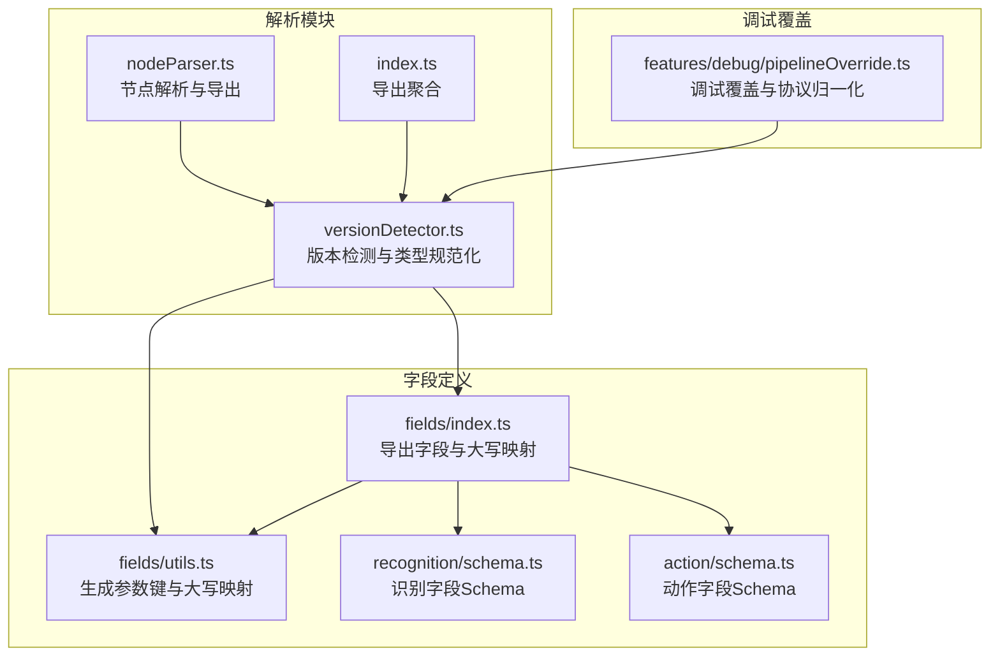
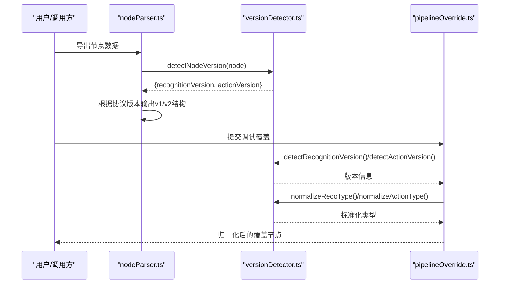
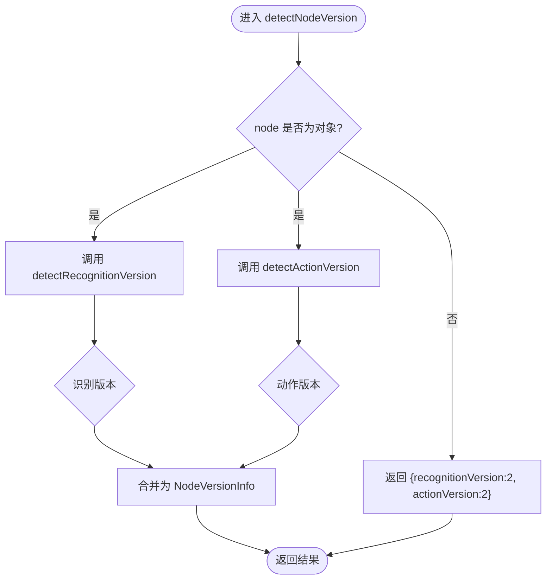
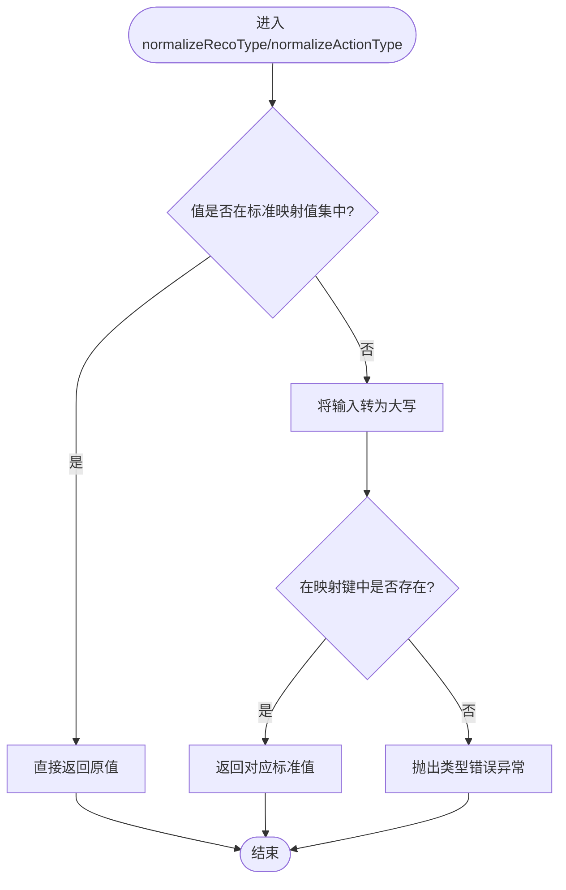
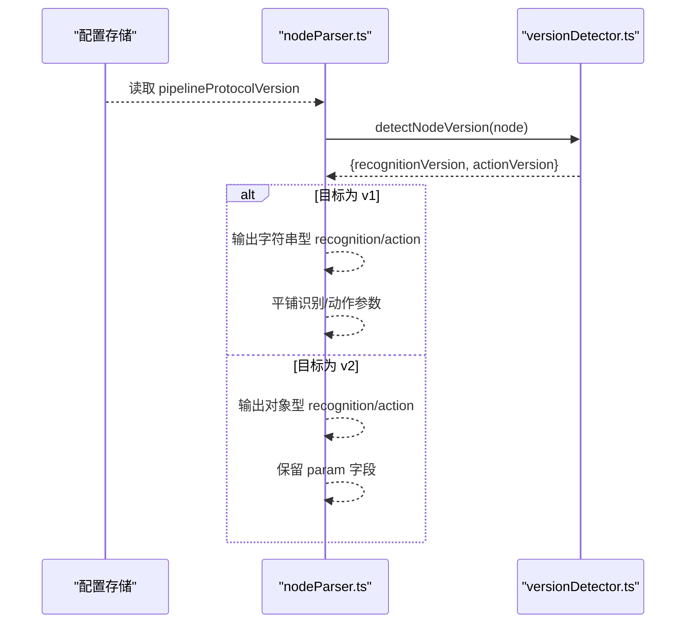
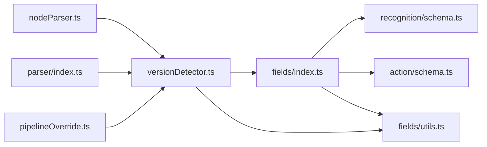

# 版本检测器

<cite>
**本文档引用的文件**
- [versionDetector.ts](file://src/core/parser/versionDetector.ts)
- [index.ts](file://src/core/parser/index.ts)
- [nodeParser.ts](file://src/core/parser/nodeParser.ts)
- [pipelineOverride.ts](file://src/features/debug/pipelineOverride.ts)
- [index.ts](file://src/core/fields/index.ts)
- [utils.ts](file://src/core/fields/utils.ts)
- [schema.ts](file://src/core/fields/recognition/schema.ts)
- [schema.ts](file://src/core/fields/action/schema.ts)
</cite>

## 目录
1. [简介](#简介)
2. [项目结构](#项目结构)
3. [核心组件](#核心组件)
4. [架构总览](#架构总览)
5. [详细组件分析](#详细组件分析)
6. [依赖关系分析](#依赖关系分析)
7. [性能考量](#性能考量)
8. [故障排查指南](#故障排查指南)
9. [结论](#结论)
10. [附录](#附录)

## 简介
本文件系统性地阐述“版本检测器”的设计与实现，覆盖以下主题：
- 节点版本检测算法：识别版本与动作版本的判定逻辑
- 版本规范化处理：识别类型与动作类型的标准化流程
- 向后兼容策略与版本升级路径：v1/v2 协议的兼容与转换
- 数据结构与存储格式：Pipeline 节点字段与协议版本的关系
- 冲突处理与降级策略：类型不匹配与未知类型的容错
- 最佳实践：新版本支持与旧版本兼容的工程化建议

## 项目结构
版本检测器位于解析模块的核心位置，围绕“节点版本检测”和“类型规范化”两大能力展开，并与字段定义、导出/导入流程以及调试覆盖功能紧密耦合。

图表来源
- [versionDetector.ts:1-149](file://src/core/parser/versionDetector.ts#L1-L149)
- [index.ts:1-85](file://src/core/parser/index.ts#L1-L85)
- [nodeParser.ts:1-200](file://src/core/parser/nodeParser.ts#L1-L200)
- [index.ts:1-46](file://src/core/fields/index.ts#L1-L46)
- [utils.ts:1-41](file://src/core/fields/utils.ts#L1-L41)
- [schema.ts:1-200](file://src/core/fields/recognition/schema.ts#L1-L200)
- [schema.ts:1-200](file://src/core/fields/action/schema.ts#L1-L200)
- [pipelineOverride.ts:1-200](file://src/features/debug/pipelineOverride.ts#L1-L200)

章节来源
- [versionDetector.ts:1-149](file://src/core/parser/versionDetector.ts#L1-L149)
- [index.ts:1-85](file://src/core/parser/index.ts#L1-L85)

## 核心组件
- 节点版本检测器：提供识别版本与动作版本的自动判定，支持 v1/v2 协议差异识别
- 类型规范化器：将识别/动作类型统一为标准大小写形式，确保跨版本一致性
- 字段定义与映射：通过字段 Schema 与大写映射表，支撑版本检测与类型归一化
- 导出/导入适配：在导出时根据目标协议版本输出 v1 或 v2 结构
- 调试覆盖：在调试模式下对覆盖的 Pipeline 进行协议版本归一化

章节来源
- [versionDetector.ts:11-149](file://src/core/parser/versionDetector.ts#L11-L149)
- [index.ts:1-46](file://src/core/fields/index.ts#L1-L46)
- [utils.ts:1-41](file://src/core/fields/utils.ts#L1-L41)
- [nodeParser.ts:39-184](file://src/core/parser/nodeParser.ts#L39-L184)
- [pipelineOverride.ts:1-200](file://src/features/debug/pipelineOverride.ts#L1-L200)

## 架构总览
版本检测器贯穿“解析—导出—调试覆盖”的关键链路，形成如下闭环：

图表来源
- [nodeParser.ts:39-184](file://src/core/parser/nodeParser.ts#L39-L184)
- [versionDetector.ts:23-110](file://src/core/parser/versionDetector.ts#L23-L110)
- [pipelineOverride.ts:110-191](file://src/features/debug/pipelineOverride.ts#L110-L191)

## 详细组件分析

### 节点版本检测算法
- 识别版本检测（v1/v2）
  - 若节点对象包含 recognition 字段：
    - recognition 为对象且包含 type：判定为 v2
    - recognition 为字符串：判定为 v1
  - 若不存在 recognition 字段，检查节点键是否包含 v1 特征参数（来自识别字段 Schema 的键列表）：
    - 若存在且 recognition.type 存在：判定为 v2
    - 否则：判定为 v1
  - 默认返回 v2（空对象或非对象）

- 动作版本检测（v1/v2）
  - 若节点对象包含 action 字段：
    - action 为对象且包含 type：判定为 v2
    - action 为字符串：判定为 v1
  - 若不存在 action 字段，检查节点键是否包含 v1 特征参数（来自动作字段 Schema 的键列表）：
    - 若存在且 action.type 存在：判定为 v2
    - 否则：判定为 v1
  - 默认返回 v2（空对象或非对象）

- 返回结构
  - NodeVersionInfo：包含 recognitionVersion 与 actionVersion 两个字段

图表来源
- [versionDetector.ts:23-32](file://src/core/parser/versionDetector.ts#L23-L32)
- [versionDetector.ts:39-71](file://src/core/parser/versionDetector.ts#L39-L71)
- [versionDetector.ts:78-110](file://src/core/parser/versionDetector.ts#L78-L110)

章节来源
- [versionDetector.ts:23-110](file://src/core/parser/versionDetector.ts#L23-L110)

### 类型规范化处理
- 识别类型规范化（normalizeRecoType）
  - 若传入类型已在大写映射值集中，直接返回
  - 否则尝试将输入转为大写后在映射键中查找，找到则返回对应的标准值
  - 仍找不到则抛出“识别算法类型错误”异常

- 动作类型规范化（normalizeActionType）
  - 逻辑与识别类型一致，针对动作类型映射表进行校验与归一化
  - 找不到则抛出“动作类型错误”异常

图表来源
- [versionDetector.ts:118-148](file://src/core/parser/versionDetector.ts#L118-L148)
- [utils.ts:30-40](file://src/core/fields/utils.ts#L30-L40)
- [index.ts:44-45](file://src/core/fields/index.ts#L44-L45)

章节来源
- [versionDetector.ts:118-148](file://src/core/parser/versionDetector.ts#L118-L148)
- [utils.ts:30-40](file://src/core/fields/utils.ts#L30-L40)
- [index.ts:44-45](file://src/core/fields/index.ts#L44-L45)

### 向后兼容性策略与版本升级路径
- 导出阶段的协议选择
  - 当目标协议为 v1：识别/动作字段直接输出类型字符串
  - 当目标协议为 v2：识别/动作字段输出包含 type 与 param 的对象结构
  - v1 平铺参数：当导出默认识别/动作时，将识别/动作的参数平铺到节点顶层键

- 调试覆盖的协议归一化
  - 根据配置决定目标协议版本（v1 或 v2）
  - 对识别/动作字段分别进行版本归一化与类型标准化
  - 保留非识别/动作的其他字段

图表来源
- [nodeParser.ts:103-138](file://src/core/parser/nodeParser.ts#L103-L138)
- [nodeParser.ts:172-181](file://src/core/parser/nodeParser.ts#L172-L181)
- [versionDetector.ts:23-32](file://src/core/parser/versionDetector.ts#L23-L32)

章节来源
- [nodeParser.ts:39-184](file://src/core/parser/nodeParser.ts#L39-L184)
- [pipelineOverride.ts:110-191](file://src/features/debug/pipelineOverride.ts#L110-L191)

### 数据结构与存储格式
- 节点版本信息（NodeVersionInfo）
  - recognitionVersion：识别字段版本（1 或 2）
  - actionVersion：动作字段版本（1 或 2）

- 字段 Schema 与参数键
  - 识别字段 Schema 与动作字段 Schema 定义了各类型可用参数
  - 通过 generateParamKeys 生成参数键集合，用于判断 v1 特征参数的存在
  - 通过 generateUpperValues 生成类型的大写映射，用于类型规范化

- 导出格式
  - v1：recognition 与 action 为字符串；参数平铺到节点顶层
  - v2：recognition 与 action 为对象，包含 type 与 param；param 为结构化参数

章节来源
- [versionDetector.ts:11-16](file://src/core/parser/versionDetector.ts#L11-L16)
- [utils.ts:6-25](file://src/core/fields/utils.ts#L6-L25)
- [utils.ts:30-40](file://src/core/fields/utils.ts#L30-L40)
- [schema.ts:1-200](file://src/core/fields/recognition/schema.ts#L1-L200)
- [schema.ts:1-200](file://src/core/fields/action/schema.ts#L1-L200)
- [nodeParser.ts:109-138](file://src/core/parser/nodeParser.ts#L109-L138)

### 冲突处理与降级策略
- 类型不匹配的容错
  - 类型规范化阶段若发现未知类型，立即抛出明确错误，避免静默失败
  - 调试覆盖解析阶段捕获异常并返回可读的错误信息，便于定位问题

- 版本冲突的处理
  - 通过 detectNodeVersion 自动判定节点版本，避免手动误判
  - 导出时严格遵循目标协议版本，防止混合格式导致的运行时错误

- 降级策略
  - 当节点缺少识别/动作字段或参数不完整时，采用默认行为（例如返回 v2 版本）以保证流程继续

章节来源
- [versionDetector.ts:118-148](file://src/core/parser/versionDetector.ts#L118-L148)
- [pipelineOverride.ts:26-82](file://src/features/debug/pipelineOverride.ts#L26-L82)

### 最佳实践
- 新版本支持
  - 使用 detectNodeVersion 自动识别节点版本，避免硬编码判断
  - 在导出前统一设置 pipelineProtocolVersion，确保输出格式一致
  - 对识别/动作类型调用 normalizeRecoType/normalizeActionType，保证大小写一致性

- 旧版本兼容
  - 优先使用 v2 结构（包含 type 与 param），并在必要时通过 detectRecognitionVersion/detectActionVersion 判定 v1 特征参数
  - 导出 v1 时注意平铺参数，避免遗漏关键字段

- 调试与验证
  - 使用调试覆盖功能时，先解析 JSON，再进行协议归一化与类型标准化，最后格式化输出
  - 对异常情况进行日志记录与错误提示，便于快速修复

章节来源
- [versionDetector.ts:23-110](file://src/core/parser/versionDetector.ts#L23-L110)
- [nodeParser.ts:103-138](file://src/core/parser/nodeParser.ts#L103-L138)
- [pipelineOverride.ts:110-191](file://src/features/debug/pipelineOverride.ts#L110-L191)

## 依赖关系分析
版本检测器与字段定义、解析器、调试覆盖之间的依赖关系如下：

图表来源
- [versionDetector.ts:1-6](file://src/core/parser/versionDetector.ts#L1-L6)
- [index.ts:1-46](file://src/core/fields/index.ts#L1-L46)
- [utils.ts:1-41](file://src/core/fields/utils.ts#L1-L41)
- [nodeParser.ts:1-26](file://src/core/parser/nodeParser.ts#L1-L26)
- [index.ts:59-64](file://src/core/parser/index.ts#L59-L64)
- [pipelineOverride.ts:1-13](file://src/features/debug/pipelineOverride.ts#L1-L13)

章节来源
- [index.ts:59-64](file://src/core/parser/index.ts#L59-L64)
- [index.ts:1-46](file://src/core/fields/index.ts#L1-L46)

## 性能考量
- 版本检测复杂度
  - detectRecognitionVersion/detectActionVersion 对节点键进行一次遍历，时间复杂度 O(n)，n 为节点键数量；空间复杂度 O(1)
- 类型规范化复杂度
  - normalizeRecoType/normalizeActionType 通过映射表查找，平均时间复杂度近似 O(1)，空间复杂度 O(k)，k 为类型总数
- 导出阶段
  - 导出时根据协议版本分支处理，整体复杂度与节点规模线性相关，建议在批量导出时复用配置与映射表以减少重复初始化

## 故障排查指南
- 常见错误
  - “识别算法类型错误”：检查类型是否在识别字段映射表中，或是否为正确的大小写
  - “动作类型错误”：检查类型是否在动作字段映射表中，或是否为正确的大小写
  - 调试覆盖 JSON 语法错误：确认覆盖对象结构正确，键名与值类型符合预期

- 排查步骤
  - 使用 detectNodeVersion 确认节点版本
  - 对识别/动作类型调用 normalizeRecoType/normalizeActionType
  - 检查导出配置（pipelineProtocolVersion）与字段 Schema 是否匹配
  - 在调试覆盖中逐步验证每一步归一化结果

章节来源
- [versionDetector.ts:118-148](file://src/core/parser/versionDetector.ts#L118-L148)
- [pipelineOverride.ts:26-82](file://src/features/debug/pipelineOverride.ts#L26-L82)

## 结论
版本检测器通过“自动版本判定 + 类型标准化 + 协议归一化”的组合，有效保障了 v1/v2 协议的兼容与升级路径的顺畅。配合字段 Schema 与导出/导入流程，能够在保证稳定性的同时，平滑过渡到新版本结构，并为调试与扩展提供清晰的接口与约束。

## 附录
- 关键函数与职责
  - detectNodeVersion：综合识别与动作版本检测
  - detectRecognitionVersion/detectActionVersion：单项版本检测
  - normalizeRecoType/normalizeActionType：类型标准化
  - generateParamKeys/generateUpperValues：参数键与类型映射生成
  - 导出控制：根据目标协议版本输出 v1/v2 结构

章节来源
- [versionDetector.ts:23-148](file://src/core/parser/versionDetector.ts#L23-L148)
- [utils.ts:6-40](file://src/core/fields/utils.ts#L6-L40)
- [nodeParser.ts:103-138](file://src/core/parser/nodeParser.ts#L103-L138)
- [pipelineOverride.ts:110-191](file://src/features/debug/pipelineOverride.ts#L110-L191)