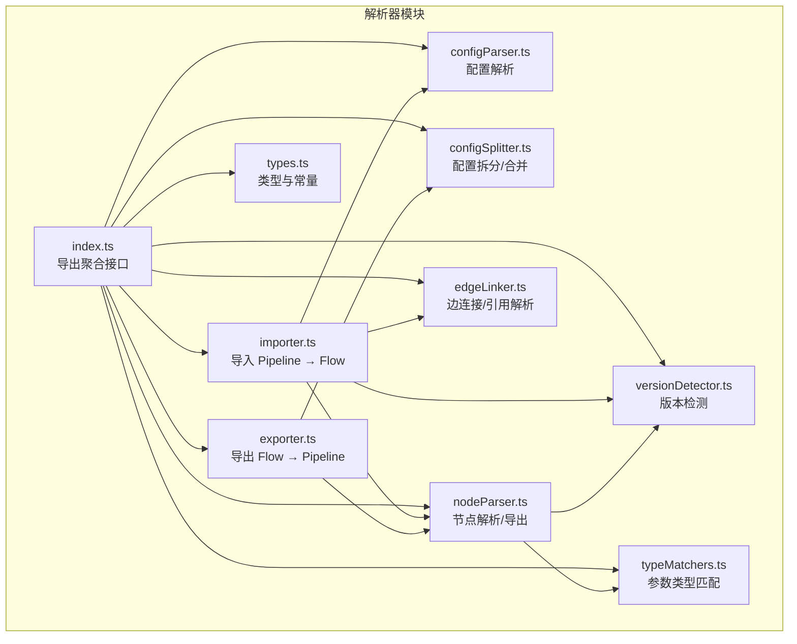
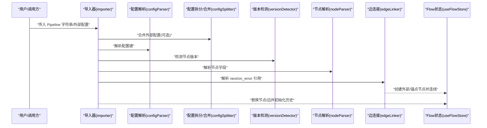
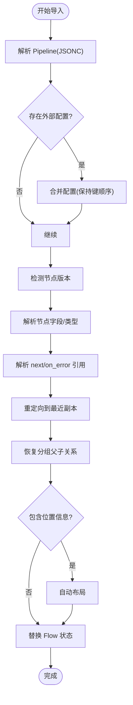
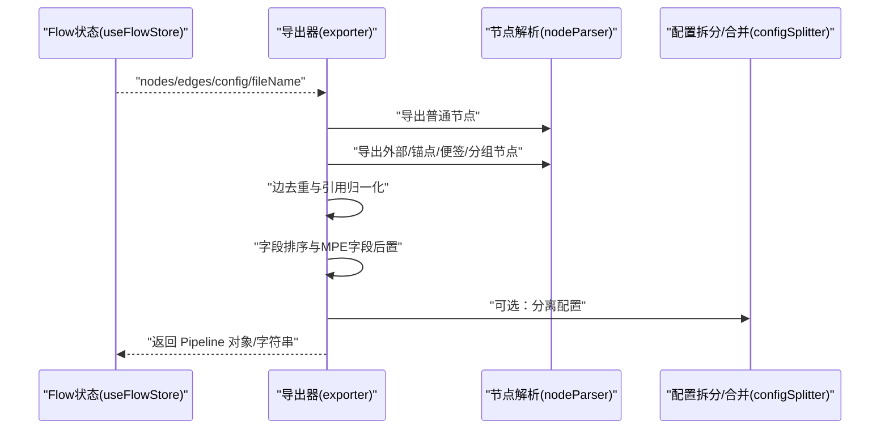
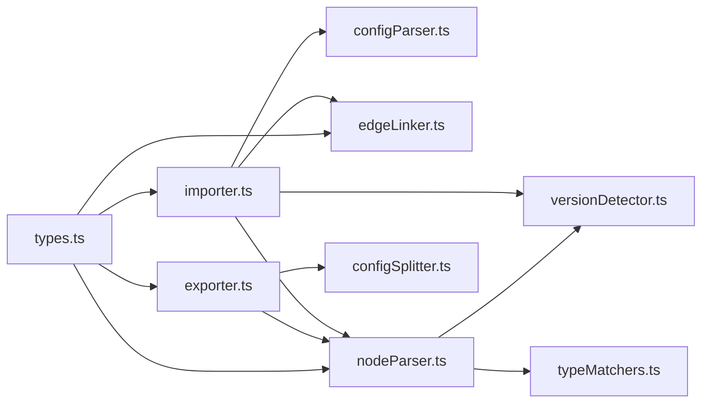

# 解析器系统

<cite>
**本文引用的文件**
- [src/core/parser/index.ts](file://src/core/parser/index.ts)
- [src/core/parser/importer.ts](file://src/core/parser/importer.ts)
- [src/core/parser/exporter.ts](file://src/core/parser/exporter.ts)
- [src/core/parser/types.ts](file://src/core/parser/types.ts)
- [src/core/parser/versionDetector.ts](file://src/core/parser/versionDetector.ts)
- [src/core/parser/configParser.ts](file://src/core/parser/configParser.ts)
- [src/core/parser/configSplitter.ts](file://src/core/parser/configSplitter.ts)
- [src/core/parser/nodeParser.ts](file://src/core/parser/nodeParser.ts)
- [src/core/parser/typeMatchers.ts](file://src/core/parser/typeMatchers.ts)
- [src/core/parser/edgeLinker.ts](file://src/core/parser/edgeLinker.ts)
- [src/stores/flow/index.ts](file://src/stores/flow/index.ts)
- [src/core/fields/index.ts](file://src/core/fields/index.ts)
- [README.md](file://README.md)
</cite>

## 目录
1. [简介](#简介)
2. [项目结构](#项目结构)
3. [核心组件](#核心组件)
4. [架构总览](#架构总览)
5. [详细组件分析](#详细组件分析)
6. [依赖分析](#依赖分析)
7. [性能考虑](#性能考虑)
8. [故障排查指南](#故障排查指南)
9. [结论](#结论)
10. [附录](#附录)

## 简介
本文件面向解析器系统，系统性阐述 Pipeline 格式与 Flow 格式之间的双向转换机制，涵盖导入器的 JSON 解析、格式验证与数据转换，导出器的数据序列化与格式输出，配置分离与合并算法，版本兼容与向后兼容策略，以及扩展与自定义格式支持的实践方法。文档同时提供错误处理、性能优化与内存管理的最佳实践，帮助开发者在不深入源码细节的情况下理解并高效使用解析器。

## 项目结构
解析器模块位于前端核心目录 src/core/parser 下，采用“功能域+职责分离”的组织方式，主要文件职责如下：
- 导入器：将 Pipeline JSON（含配置）解析为 Flow 可视化节点与边
- 导出器：将 Flow 节点与边序列化为 Pipeline JSON（可分离配置）
- 类型与常量：统一定义 Pipeline/Flow 节点类型、配置标记与前缀
- 版本检测：识别节点的 recognition/action 字段版本，驱动兼容与迁移
- 配置解析与拆分/合并：支持配置与节点数据的分离与还原
- 节点解析：将 Flow 节点转换为 Pipeline 节点，或反向解析
- 类型匹配：对参数进行严格类型转换与校验
- 边连接：解析 next/on_error 引用，创建外部/锚点节点并连线

**图表来源**
- [src/core/parser/index.ts:1-85](file://src/core/parser/index.ts#L1-L85)
- [src/core/parser/importer.ts:1-547](file://src/core/parser/importer.ts#L1-L547)
- [src/core/parser/exporter.ts:1-320](file://src/core/parser/exporter.ts#L1-L320)
- [src/core/parser/types.ts:1-113](file://src/core/parser/types.ts#L1-L113)
- [src/core/parser/versionDetector.ts:1-149](file://src/core/parser/versionDetector.ts#L1-L149)
- [src/core/parser/configParser.ts:1-69](file://src/core/parser/configParser.ts#L1-L69)
- [src/core/parser/configSplitter.ts:1-492](file://src/core/parser/configSplitter.ts#L1-L492)
- [src/core/parser/nodeParser.ts:1-503](file://src/core/parser/nodeParser.ts#L1-L503)
- [src/core/parser/typeMatchers.ts:1-340](file://src/core/parser/typeMatchers.ts#L1-L340)
- [src/core/parser/edgeLinker.ts:1-162](file://src/core/parser/edgeLinker.ts#L1-L162)

**章节来源**
- [src/core/parser/index.ts:1-85](file://src/core/parser/index.ts#L1-L85)
- [README.md:31-92](file://README.md#L31-L92)

## 核心组件
- 导入器 pipelineToFlow：负责解析 Pipeline JSON（支持外部配置合并）、迁移废弃字段、解析节点与边、恢复分组父子关系、自动布局与坐标系规范化。
- 导出器 flowToPipeline：负责将 Flow 节点与边序列化为 Pipeline 对象，支持配置分离导出、节点顺序与字段排序、边去重与引用归一化。
- 类型与常量 types：定义配置标记、节点/边类型、导入选/出选项、MPE 配置结构等。
- 版本检测 versionDetector：识别 recognition/action 字段版本，标准化类型值，提供迁移策略基础。
- 配置解析 configParser：判断键是否为配置键/标记键，兼容新旧配置标记。
- 配置拆分/合并 configSplitter：将完整对象拆分为 Pipeline 与 MPE 配置，或将配置合并回 Pipeline。
- 节点解析 nodeParser：将 Flow 节点导出为 Pipeline 结构，或解析 Pipeline 节点为 Flow 结构；支持 v1/v2 协议差异与字段迁移。
- 类型匹配 typeMatchers：对参数进行严格类型转换与校验，支持多种复杂类型（数组、XYWH、位置列表等）。
- 边连接 edgeLinker：解析 next/on_error 引用，支持字符串/对象两种形式，创建外部/锚点节点并连线。

**章节来源**
- [src/core/parser/importer.ts:157-547](file://src/core/parser/importer.ts#L157-L547)
- [src/core/parser/exporter.ts:44-320](file://src/core/parser/exporter.ts#L44-L320)
- [src/core/parser/types.ts:16-113](file://src/core/parser/types.ts#L16-L113)
- [src/core/parser/versionDetector.ts:23-149](file://src/core/parser/versionDetector.ts#L23-L149)
- [src/core/parser/configParser.ts:9-69](file://src/core/parser/configParser.ts#L9-L69)
- [src/core/parser/configSplitter.ts:21-492](file://src/core/parser/configSplitter.ts#L21-L492)
- [src/core/parser/nodeParser.ts:39-503](file://src/core/parser/nodeParser.ts#L39-L503)
- [src/core/parser/typeMatchers.ts:292-340](file://src/core/parser/typeMatchers.ts#L292-L340)
- [src/core/parser/edgeLinker.ts:91-162](file://src/core/parser/edgeLinker.ts#L91-L162)

## 架构总览
解析器系统围绕“导入/导出”两条主线展开，辅以版本检测、配置解析与拆分/合并、节点解析与类型匹配、边连接等子系统，形成闭环的数据流。

**图表来源**
- [src/core/parser/importer.ts:157-547](file://src/core/parser/importer.ts#L157-L547)
- [src/core/parser/configParser.ts:47-69](file://src/core/parser/configParser.ts#L47-L69)
- [src/core/parser/configSplitter.ts:154-454](file://src/core/parser/configSplitter.ts#L154-L454)
- [src/core/parser/versionDetector.ts:23-110](file://src/core/parser/versionDetector.ts#L23-L110)
- [src/core/parser/nodeParser.ts:366-415](file://src/core/parser/nodeParser.ts#L366-L415)
- [src/core/parser/edgeLinker.ts:91-161](file://src/core/parser/edgeLinker.ts#L91-L161)
- [src/stores/flow/index.ts:1-124](file://src/stores/flow/index.ts#L1-L124)

## 详细组件分析

### 导入器：Pipeline → Flow
- JSON 解析与健壮性
  - 使用 JSONC 解析器，支持尾随逗号与注释；当键顺序解析失败时降级为空对象，保证导入鲁棒性。
  - 支持空字符串/“null”输入的容错处理，确保空文件也能被解析为默认对象。
- 外部配置合并
  - 在存在外部 MPE 配置时，先解析 Pipeline 对象，再调用合并算法，保留原始键顺序，确保导出一致性。
- 配置解析与坐标系
  - 解析配置键，兼容新旧配置标记；根据坐标模式对节点位置进行归一化与相对/绝对坐标转换。
- 版本迁移与兼容
  - 针对 v5.1 的废弃字段进行迁移：将 interrupt 合并到 next，并为 sub 节点引用添加 JumpBack 前缀；删除 is_sub 字段。
- 节点解析
  - 支持普通节点、外部节点、锚点节点、便签节点、分组节点五种类型；为外部/锚点节点创建视觉副本并记录额外位置。
  - 识别节点版本，解析 recognition/action 字段，迁移 method 等字段；未识别字段进入 extras。
- 边解析与分组关系
  - 解析 next/on_error 引用，创建外部/锚点节点（如缺失），并建立边；随后将指向外部/锚点的边就近重定向到最近副本。
  - 恢复分组子节点关系，基于 label 匹配设置 parentId。
- 布局与历史
  - 根据是否包含位置信息决定是否自动布局；初始化历史记录；更新文件配置（前缀、坐标模式、节点顺序映射）。

**图表来源**
- [src/core/parser/importer.ts:157-547](file://src/core/parser/importer.ts#L157-L547)
- [src/core/parser/configSplitter.ts:154-454](file://src/core/parser/configSplitter.ts#L154-L454)
- [src/core/parser/versionDetector.ts:23-110](file://src/core/parser/versionDetector.ts#L23-L110)
- [src/core/parser/edgeLinker.ts:91-161](file://src/core/parser/edgeLinker.ts#L91-L161)

**章节来源**
- [src/core/parser/importer.ts:157-547](file://src/core/parser/importer.ts#L157-L547)

### 导出器：Flow → Pipeline
- 节点导出
  - 按顺序映射对节点进行排序；普通节点导出 recognition/action/others/focus/extras；外部/锚点/便签/分组节点导出配置标记与位置信息。
  - 视觉副本：主副本写入 position，后续副本追加到 extra_positions。
- 边导出
  - 按 source+handle 分组，组内按 label 排序；对多重副本引用进行去重；根据配置导出前缀风格或对象风格的引用。
- 配置导出
  - 可选择强制导出配置；过滤运行时字段；标准化视口；设置坐标模式为 absolute-v1；写入版本号。
- 字段顺序与排序
  - 将 MPE 特色字段移动到每个节点末尾；应用自定义字段排序规则；可选删除空 param。

**图表来源**
- [src/core/parser/exporter.ts:44-320](file://src/core/parser/exporter.ts#L44-L320)
- [src/core/parser/nodeParser.ts:39-301](file://src/core/parser/nodeParser.ts#L39-L301)
- [src/core/parser/configSplitter.ts:21-144](file://src/core/parser/configSplitter.ts#L21-L144)

**章节来源**
- [src/core/parser/exporter.ts:44-320](file://src/core/parser/exporter.ts#L44-L320)

### 类型与常量：统一契约
- 配置标记与前缀：定义 $__mpe_code、$__mpe_config_、$__mpe_external_、$__mpe_anchor_、$__mpe_sticker_、$__mpe_group_ 等常量，确保导入/导出一致性。
- 类型定义：统一 PipelineObjType、ParsedPipelineNodeType、PipelineConfigType、MpeConfigType、FlowToOptions、PipelineToFlowOptions 等，约束数据结构。
- 坐标模式：支持 relative-legacy 与 absolute-v1，导入时根据配置进行归一化。

**章节来源**
- [src/core/parser/types.ts:16-113](file://src/core/parser/types.ts#L16-L113)

### 版本检测与迁移
- 节点版本检测：分别检测 recognition 与 action 字段版本，若未显式声明则根据是否存在 type 字段或是否存在 v1 特征键判定。
- 类型标准化：对识别/动作类型进行大小写归一化与合法性校验，异常时抛出错误。
- v5.1 迁移：将 interrupt 合并到 next，并为 sub 节点引用添加 JumpBack 前缀；删除 is_sub 字段。

**章节来源**
- [src/core/parser/versionDetector.ts:23-149](file://src/core/parser/versionDetector.ts#L23-L149)
- [src/core/parser/importer.ts:49-151](file://src/core/parser/importer.ts#L49-L151)

### 配置解析与拆分/合并
- 配置解析：判断键是否为配置键/标记键，兼容 $__mpe_code、__mpe_code、__yamaape 等标记。
- 配置拆分：将完整对象拆分为 pipeline 与 MPE 配置，提取节点位置、handleDirection、extra_positions 等。
- 配置合并：将 MPE 配置合并回 Pipeline，支持键顺序保持；构建 $__mpe_code；兼容新旧格式。

**章节来源**
- [src/core/parser/configParser.ts:9-69](file://src/core/parser/configParser.ts#L9-L69)
- [src/core/parser/configSplitter.ts:21-492](file://src/core/parser/configSplitter.ts#L21-L492)

### 节点解析与类型匹配
- 导出解析：将 Flow 节点导出为 Pipeline 结构，支持 v1/v2 协议差异；识别/动作参数按字段表进行类型匹配与转换；支持导出默认识别/动作与空 param 控制。
- 导入解析：解析 recognition/action 字段，迁移 method 等字段；将 v1 平铺参数迁移到对象 param；未识别字段进入 extras。
- 类型匹配：支持整型/浮点/布尔/字符串/数组/XYWH/位置列表/键值对等多种类型，提供严格转换与错误提示。

**章节来源**
- [src/core/parser/nodeParser.ts:39-503](file://src/core/parser/nodeParser.ts#L39-L503)
- [src/core/parser/typeMatchers.ts:292-340](file://src/core/parser/typeMatchers.ts#L292-L340)

### 边连接与引用解析
- 引用解析：支持字符串与对象两种形式；字符串形式可带 [Anchor]/[JumpBack] 前缀；对象形式包含 name/jump_back/anchor 属性。
- 边创建：根据 sourceHandle 类型创建 next/on_error 边；为目标节点缺失时自动创建外部/锚点节点；设置目标入口类型与标签顺序。
- 副本重定向：将指向外部/锚点的边就近重定向到最近副本，提升可视化一致性。

**章节来源**
- [src/core/parser/edgeLinker.ts:47-161](file://src/core/parser/edgeLinker.ts#L47-L161)

## 依赖分析
- 模块内聚与耦合
  - 导入器依赖配置解析、版本检测、边连接、节点解析；导出器依赖节点解析与配置拆分；二者通过 types 与 configSplitter 协作。
  - 类型匹配独立于导入/导出，但被节点解析广泛使用。
- 外部依赖
  - JSONC 解析器用于健壮解析；Ant Design 通知与模态框用于错误提示；Lodash flatten 用于二维数组扁平化。
- 状态依赖
  - 导入/导出均依赖 Flow 状态存储与文件配置存储，确保 UI 与数据同步。

**图表来源**
- [src/core/parser/importer.ts:1-547](file://src/core/parser/importer.ts#L1-L547)
- [src/core/parser/exporter.ts:1-320](file://src/core/parser/exporter.ts#L1-L320)
- [src/core/parser/types.ts:1-113](file://src/core/parser/types.ts#L1-L113)
- [src/core/parser/nodeParser.ts:1-503](file://src/core/parser/nodeParser.ts#L1-L503)
- [src/core/parser/typeMatchers.ts:1-340](file://src/core/parser/typeMatchers.ts#L1-L340)
- [src/core/parser/edgeLinker.ts:1-162](file://src/core/parser/edgeLinker.ts#L1-L162)
- [src/core/parser/configParser.ts:1-69](file://src/core/parser/configParser.ts#L1-L69)
- [src/core/parser/configSplitter.ts:1-492](file://src/core/parser/configSplitter.ts#L1-L492)

**章节来源**
- [src/core/parser/index.ts:1-85](file://src/core/parser/index.ts#L1-L85)

## 性能考虑
- 解析阶段
  - 使用 JSONC 解析器替代原生 JSON，提升对注释与尾随逗号的兼容性；对键顺序解析失败进行降级处理，避免阻塞导入。
  - 在导入时对节点与边进行批量处理，减少多次遍历；边去重使用 Set 降低重复引用成本。
- 导出阶段
  - 通过顺序映射与分组排序减少边的二次处理；字段排序与 MPE 特色字段后置在一次遍历中完成。
  - 视觉副本的位置序列化与 extra_positions 追加在导出时一次性完成，避免重复计算。
- 内存管理
  - 避免在解析过程中创建大量中间对象；及时释放临时 Map/Set；导出时仅保留必要字段，减少序列化体积。
  - 对二维数组与位置列表进行扁平化处理，降低嵌套层级带来的内存占用。

[本节为通用性能建议，不直接分析具体文件，故无“章节来源”]

## 故障排查指南
- 导入失败
  - 检查 Pipeline 格式是否正确，确认是否包含废弃字段（如 interrupt/is_sub）；确认坐标模式与节点位置是否合理。
  - 若出现类型错误，检查识别/动作类型是否在预定义列表中，或尝试开启跳过校验选项（谨慎使用）。
- 导出失败
  - 若存在重复节点名，导出会触发错误提示；请修改节点名后重试。
  - 检查字段类型是否符合协议要求；确认是否启用了导出默认识别/动作与空 param 的控制选项。
- 版本兼容
  - 若从旧版本迁移，确认是否执行了 v5.1 迁移逻辑；检查 JumpBack 前缀与 anchor/jump_back 属性是否正确。
- 配置分离
  - 确认配置文件名与 Pipeline 文件名的映射关系；检查 $__mpe_code 位置与 extra_positions 是否正确。

**章节来源**
- [src/core/parser/importer.ts:537-545](file://src/core/parser/importer.ts#L537-L545)
- [src/core/parser/exporter.ts:46-57](file://src/core/parser/exporter.ts#L46-L57)
- [src/core/parser/versionDetector.ts:118-148](file://src/core/parser/versionDetector.ts#L118-L148)
- [src/core/parser/configSplitter.ts:477-491](file://src/core/parser/configSplitter.ts#L477-L491)

## 结论
解析器系统通过模块化的导入/导出管线、严格的类型匹配与版本检测、灵活的配置分离与合并机制，实现了 Pipeline 与 Flow 之间的双向转换与高度兼容。系统在健壮性、可扩展性与用户体验方面均具备良好表现，适合在复杂自动化流程的可视化编辑与协作场景中使用。

[本节为总结性内容，不直接分析具体文件，故无“章节来源”]

## 附录

### 扩展与自定义格式支持指南
- 新增字段类型
  - 在字段定义中注册新的字段类型与键列表；在类型匹配器中增加相应转换逻辑；在节点解析中处理新字段的导入/导出。
- 新增节点类型
  - 在导入器中识别新类型的前缀与标记；在导出器中生成对应的 $__mpe_* 标记与位置信息；在边连接中支持新类型的引用。
- 新增协议版本
  - 在版本检测中识别新版本字段结构；在迁移逻辑中处理从旧版本到新版本的字段映射；在导出器中根据协议版本调整输出结构。
- 配置扩展
  - 在 MpeConfigType 中扩展配置项；在配置拆分/合并中处理新增字段；在导出器中将配置写入 $__mpe_config_* 节点。

**章节来源**
- [src/core/parser/types.ts:71-85](file://src/core/parser/types.ts#L71-L85)
- [src/core/parser/configSplitter.ts:154-454](file://src/core/parser/configSplitter.ts#L154-L454)
- [src/core/parser/nodeParser.ts:39-301](file://src/core/parser/nodeParser.ts#L39-L301)
- [src/core/fields/index.ts:1-46](file://src/core/fields/index.ts#L1-L46)