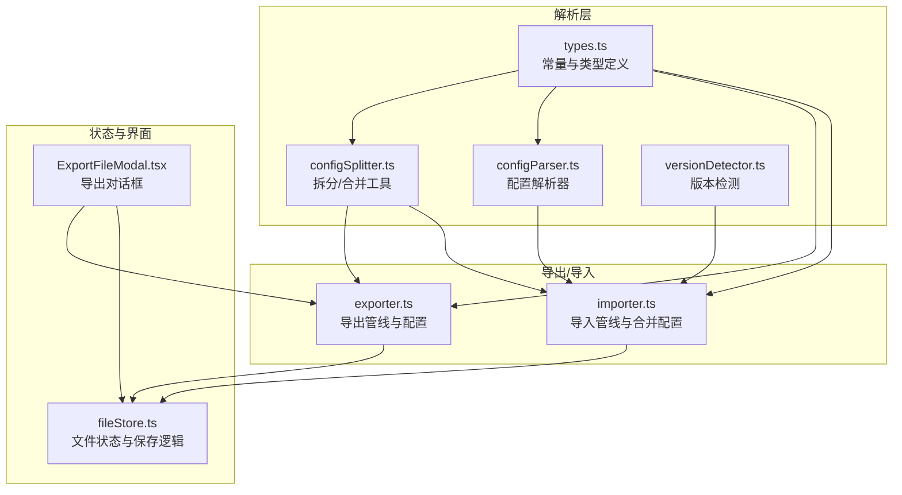
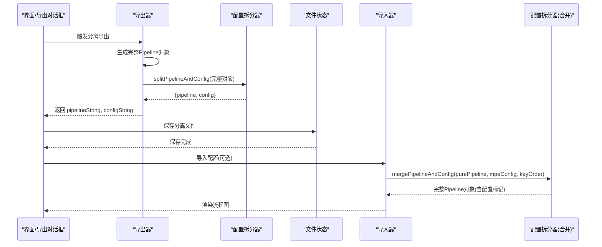
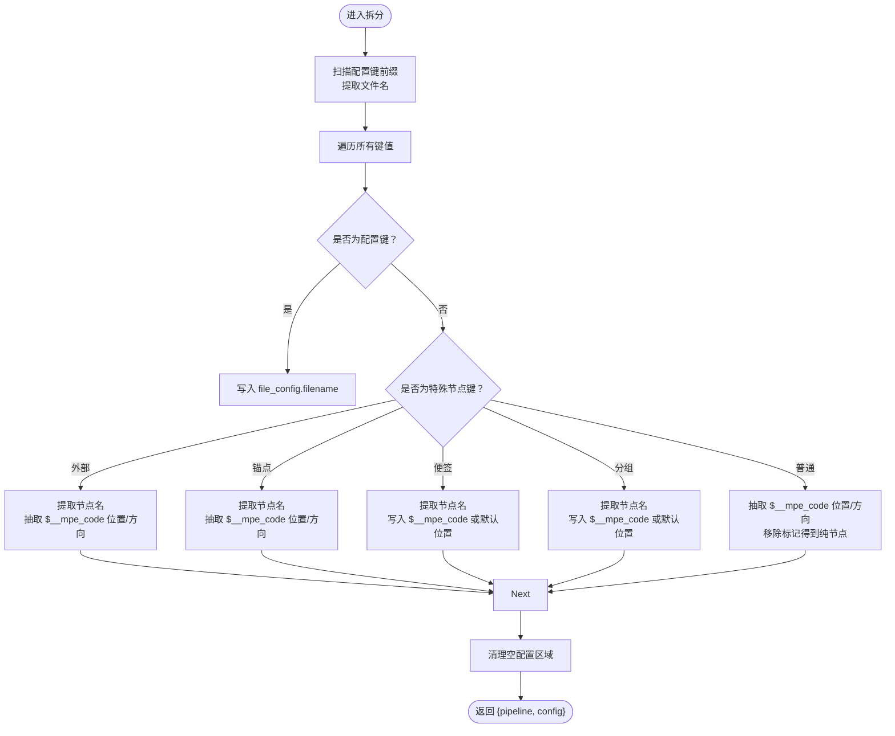
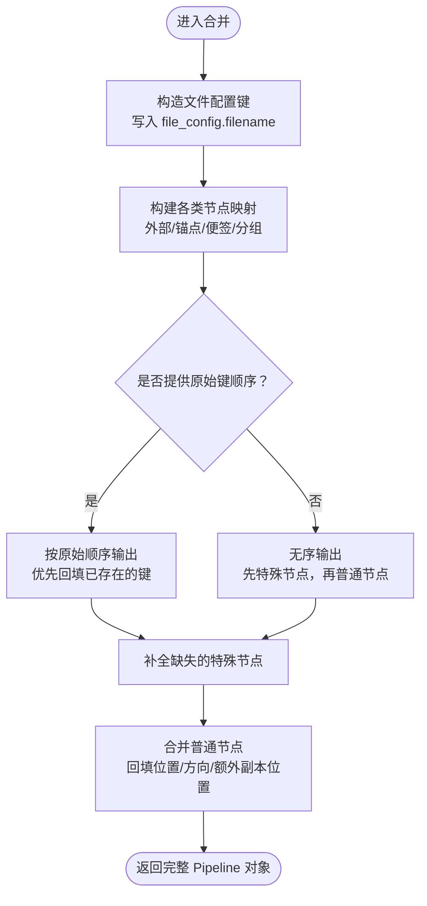
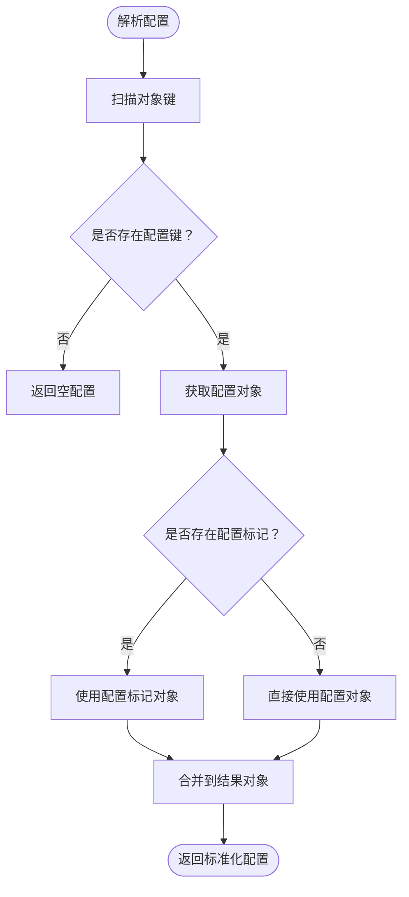
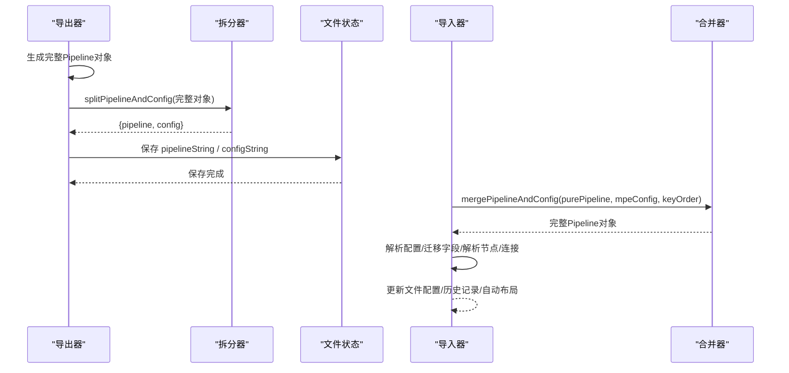
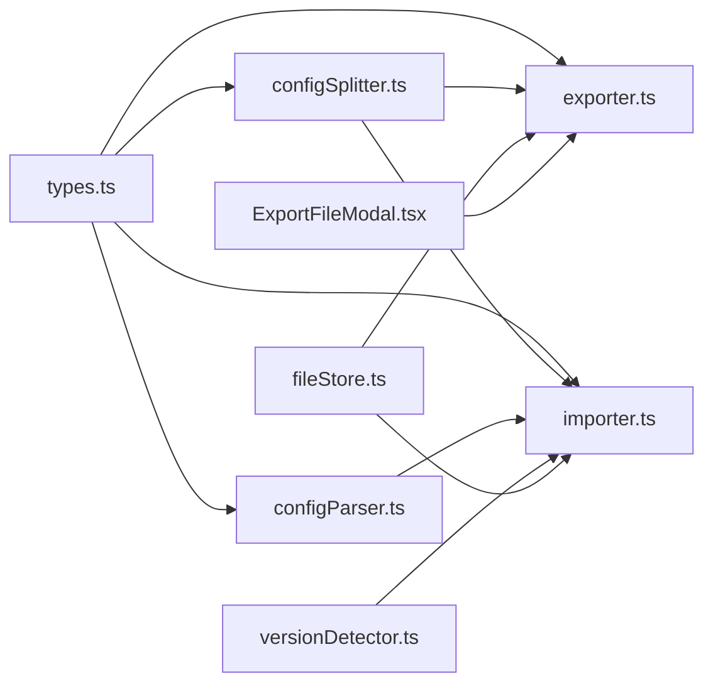

# 配置分离器

<cite>
**本文档引用的文件**
- [configSplitter.ts](file://src/core/parser/configSplitter.ts)
- [configParser.ts](file://src/core/parser/configParser.ts)
- [types.ts](file://src/core/parser/types.ts)
- [exporter.ts](file://src/core/parser/exporter.ts)
- [importer.ts](file://src/core/parser/importer.ts)
- [versionDetector.ts](file://src/core/parser/versionDetector.ts)
- [fileStore.ts](file://src/stores/fileStore.ts)
- [ExportFileModal.tsx](file://src/components/modals/ExportFileModal.tsx)
- [maa_pi_config.json](file://LocalBridge/test-json/config/maa_pi_config.json)
</cite>

## 目录
1. [简介](#简介)
2. [项目结构](#项目结构)
3. [核心组件](#核心组件)
4. [架构总览](#架构总览)
5. [详细组件分析](#详细组件分析)
6. [依赖分析](#依赖分析)
7. [性能考虑](#性能考虑)
8. [故障排除指南](#故障排除指南)
9. [结论](#结论)
10. [附录](#附录)

## 简介
本文件系统性阐述配置分离器的设计与实现，重点覆盖以下内容：
- splitPipelineAndConfig 与 mergePipelineAndConfig 的实现原理与交互流程
- 配置文件与 Pipeline 文件的分离策略：配置标记识别、文件命名规则、路径解析
- 配置解析器功能：配置键值提取、格式验证、默认值处理
- 配置文件的版本管理与兼容性处理机制
- 配置文件的组织结构建议与最佳实践
- 配置冲突解决与优先级处理的实现细节

## 项目结构
配置分离器位于前端解析层，围绕“分离存储模式”构建，涉及导出、导入、解析与合并等环节。

图表来源
- [types.ts:1-113](file://src/core/parser/types.ts#L1-L113)
- [configSplitter.ts:1-492](file://src/core/parser/configSplitter.ts#L1-L492)
- [configParser.ts:1-69](file://src/core/parser/configParser.ts#L1-L69)
- [exporter.ts:1-320](file://src/core/parser/exporter.ts#L1-L320)
- [importer.ts:1-547](file://src/core/parser/importer.ts#L1-L547)
- [fileStore.ts:777-815](file://src/stores/fileStore.ts#L777-L815)
- [ExportFileModal.tsx:93-133](file://src/components/modals/ExportFileModal.tsx#L93-L133)

章节来源
- [types.ts:1-113](file://src/core/parser/types.ts#L1-L113)
- [exporter.ts:304-319](file://src/core/parser/exporter.ts#L304-L319)
- [importer.ts:157-547](file://src/core/parser/importer.ts#L157-L547)

## 核心组件
- 配置标记与前缀常量：定义配置标记键、文件配置键前缀以及各类节点键前缀，确保识别与序列化一致性。
- 配置拆分器：将包含配置标记的完整 Pipeline 对象拆分为纯 Pipeline 与 MPE 配置对象；同时支持反向合并。
- 配置解析器：识别配置键、兼容新旧配置标记，解析并返回标准化的配置对象。
- 导出器：在分离模式下生成 Pipeline 与配置两份 JSON，并可选择仅导出其一。
- 导入器：在导入时根据外部配置进行合并，恢复节点位置与属性，并兼容旧版字段。

章节来源
- [types.ts:16-22](file://src/core/parser/types.ts#L16-L22)
- [configSplitter.ts:21-144](file://src/core/parser/configSplitter.ts#L21-L144)
- [configParser.ts:9-68](file://src/core/parser/configParser.ts#L9-L68)
- [exporter.ts:304-319](file://src/core/parser/exporter.ts#L304-L319)
- [importer.ts:157-547](file://src/core/parser/importer.ts#L157-L547)

## 架构总览
配置分离器贯穿导出与导入两条主线，形成“导出分离 → 保存分离 → 导入合并”的闭环。

图表来源
- [exporter.ts:304-319](file://src/core/parser/exporter.ts#L304-L319)
- [configSplitter.ts:21-144](file://src/core/parser/configSplitter.ts#L21-L144)
- [fileStore.ts:777-815](file://src/stores/fileStore.ts#L777-L815)
- [importer.ts:199-212](file://src/core/parser/importer.ts#L199-L212)
- [configSplitter.ts:154-454](file://src/core/parser/configSplitter.ts#L154-L454)

## 详细组件分析

### 组件A：配置拆分器（splitPipelineAndConfig / mergePipelineAndConfig）
- 拆分策略
  - 识别文件配置节点（以特定前缀开头），提取 filename 并填充到 MPE 配置的 file_config。
  - 识别特殊节点类型（外部节点、锚点节点、便签节点、分组节点）及其配置标记，分别归类到对应的配置区域。
  - 普通节点若带有配置标记，则抽取位置与方向信息，存入 node_configs；同时从节点对象中移除配置标记，得到纯 Pipeline。
  - 清理空配置区域，避免冗余字段。
- 合并与回填
  - 以实际文件名为基准，构造文件配置节点键（带前缀）并写入配置标记。
  - 将 MPE 配置中的节点位置与方向信息转换为配置标记对象，回填至对应节点。
  - 支持按原始键顺序输出，保证导出前后顺序一致。
  - 对于外部节点与锚点节点，支持“视觉副本”的额外位置数组 extra_positions，实现多副本位置同步。
- 文件命名与路径解析
  - 配置文件名生成规则：移除原文件扩展名，加上“.”前缀与“.mpe.json”后缀。
  - 从配置文件名反推 Pipeline 文件名：去除开头“.”与“.mpe.json”后缀。
- 关键实现要点
  - 节点名提取：优先按“文件名后缀”匹配，否则按“下划线分割并去最后一段”规则提取。
  - 配置标记兼容：支持新旧标记键，统一抽取到配置对象。
  - 顺序保持：通过键顺序映射与迭代，确保输出顺序稳定。

图表来源
- [configSplitter.ts:21-144](file://src/core/parser/configSplitter.ts#L21-L144)

图表来源
- [configSplitter.ts:154-454](file://src/core/parser/configSplitter.ts#L154-L454)

章节来源
- [configSplitter.ts:21-144](file://src/core/parser/configSplitter.ts#L21-L144)
- [configSplitter.ts:154-454](file://src/core/parser/configSplitter.ts#L154-L454)
- [configSplitter.ts:477-491](file://src/core/parser/configSplitter.ts#L477-L491)

### 组件B：配置解析器（parsePipelineConfig / isConfigKey / getConfigMark）
- 功能职责
  - isConfigKey：识别配置键（兼容新旧前缀）。
  - isMark：识别配置标记字段（含新旧标记键）。
  - getConfigMark：兼容新旧标记键，返回配置标记对象。
  - parsePipelineConfig：定位配置键，兼容标记包装，返回标准化配置对象。
- 默认值与格式验证
  - 默认坐标模式：当配置中未指定坐标模式时，导入器会回退到“相对传统模式”。
  - 其他字段如版本、前缀、保存视口等，由导出器写入并在导入时保留。
- 兼容性处理
  - 支持旧版标记键（如“__mpe_code”、“__yamaape”），自动降级提取配置内容。
  - 导入阶段对废弃字段进行迁移（例如将“interrupt”迁移到“next”并添加跳转前缀）。

图表来源
- [configParser.ts:47-68](file://src/core/parser/configParser.ts#L47-L68)

章节来源
- [configParser.ts:9-68](file://src/core/parser/configParser.ts#L9-L68)
- [importer.ts:49-151](file://src/core/parser/importer.ts#L49-L151)
- [importer.ts:224-227](file://src/core/parser/importer.ts#L224-L227)

### 组件C：导出与导入集成（exporter / importer）
- 导出（分离模式）
  - 生成完整 Pipeline 对象（包含配置标记）。
  - 调用拆分器将其拆分为 Pipeline 与配置两份 JSON。
  - 通过文件状态模块保存到不同路径，支持“全部保存/仅 Pipeline/仅配置”三种模式。
- 导入（合并模式）
  - 若提供外部 MPE 配置，先解析 Pipeline 纯对象，再调用合并函数恢复完整对象。
  - 解析配置键，兼容标记包装，确定坐标模式等。
  - 迁移旧版字段，解析节点与连接，恢复分组父子关系与视觉副本就近重定向。
  - 保持节点顺序映射，必要时自动布局。

图表来源
- [exporter.ts:304-319](file://src/core/parser/exporter.ts#L304-L319)
- [fileStore.ts:777-815](file://src/stores/fileStore.ts#L777-L815)
- [importer.ts:199-212](file://src/core/parser/importer.ts#L199-L212)
- [configSplitter.ts:154-454](file://src/core/parser/configSplitter.ts#L154-L454)

章节来源
- [exporter.ts:304-319](file://src/core/parser/exporter.ts#L304-L319)
- [importer.ts:157-547](file://src/core/parser/importer.ts#L157-L547)

## 依赖分析
- 类型与常量依赖
  - 所有解析与导出/导入模块均依赖 types.ts 中的标记常量与类型定义，确保键前缀与配置结构一致。
- 模块耦合
  - 导出器与导入器均依赖拆分器，形成“导出拆分—导入合并”的双向依赖。
  - 导入器依赖配置解析器与版本检测器，确保兼容性与字段迁移。
- 外部依赖
  - 导入器使用 JSONC 解析器进行解析，并通过访问器记录原始键顺序，保证导出顺序稳定。
  - 文件状态模块负责分离保存的具体实现，导出对话框触发保存流程。

图表来源
- [types.ts:16-22](file://src/core/parser/types.ts#L16-L22)
- [configSplitter.ts:6-14](file://src/core/parser/configSplitter.ts#L6-L14)
- [configParser.ts:1-2](file://src/core/parser/configParser.ts#L1-L2)
- [exporter.ts:18-25](file://src/core/parser/exporter.ts#L18-L25)
- [importer.ts:28-33](file://src/core/parser/importer.ts#L28-L33)
- [versionDetector.ts:1-6](file://src/core/parser/versionDetector.ts#L1-L6)
- [fileStore.ts:777-815](file://src/stores/fileStore.ts#L777-L815)
- [ExportFileModal.tsx:93-133](file://src/components/modals/ExportFileModal.tsx#L93-L133)

章节来源
- [types.ts:16-22](file://src/core/parser/types.ts#L16-L22)
- [exporter.ts:35](file://src/core/parser/exporter.ts#L35)
- [importer.ts:43](file://src/core/parser/importer.ts#L43)

## 性能考虑
- 键顺序解析：使用 JSONC 访问器记录原始键顺序，避免二次遍历，提升合并稳定性与性能。
- 映射与去重：在导出阶段使用 Map 与 Set 对外部/锚点节点与边进行去重与位置聚合，降低复杂度。
- 条件导出：仅在需要时导出配置，减少不必要的序列化与 IO。
- 顺序保持：通过键顺序映射与迭代，避免无谓的排序开销。

## 故障排除指南
- 导入失败提示
  - 导入器捕获异常并弹出错误提示，建议检查 Pipeline 格式与版本一致性。
- 坐标模式问题
  - 若配置中未指定坐标模式，导入器回退到“相对传统模式”，可手动调整文件配置以获得期望布局。
- 旧版字段迁移
  - 导入器会对废弃字段进行迁移（如 interrupt → next），若出现意外行为，请检查迁移逻辑与节点引用。
- 分离保存路径
  - 分离保存时需确保 Pipeline 与配置文件路径正确，保存完成后更新文件状态中的配置路径。

章节来源
- [importer.ts:537-545](file://src/core/parser/importer.ts#L537-L545)
- [importer.ts:224-227](file://src/core/parser/importer.ts#L224-L227)
- [importer.ts:49-151](file://src/core/parser/importer.ts#L49-L151)
- [fileStore.ts:777-815](file://src/stores/fileStore.ts#L777-L815)

## 结论
配置分离器通过明确的标记识别、稳定的文件命名规则与严格的合并/拆分流程，实现了配置与 Pipeline 的解耦。配合导入器的兼容性处理与导出器的顺序保持机制，能够在保证向后兼容的同时，提供灵活的分离存储与高效的工作流体验。

## 附录

### 配置文件命名与路径解析规则
- 生成配置文件名：移除原扩展名，加上“.”前缀与“.mpe.json”后缀。
- 从配置文件名推导 Pipeline 文件名：去除开头“.”与“.mpe.json”后缀。
- 分离保存：支持“全部保存/仅 Pipeline/仅配置”，分别发送到不同路径。

章节来源
- [configSplitter.ts:477-491](file://src/core/parser/configSplitter.ts#L477-L491)
- [fileStore.ts:777-815](file://src/stores/fileStore.ts#L777-L815)
- [ExportFileModal.tsx:109-127](file://src/components/modals/ExportFileModal.tsx#L109-L127)

### 配置键值提取与默认值处理
- 配置键识别：兼容新旧前缀，自动定位配置对象。
- 标记兼容：优先使用新标记键，其次尝试旧标记键。
- 默认值：坐标模式缺省时回退到“相对传统模式”。

章节来源
- [configParser.ts:9-15](file://src/core/parser/configParser.ts#L9-L15)
- [configParser.ts:31-40](file://src/core/parser/configParser.ts#L31-L40)
- [importer.ts:224-227](file://src/core/parser/importer.ts#L224-L227)

### 版本管理与兼容性处理
- 节点版本检测：识别 recognition 与 action 字段版本，支持 v1/v2 差异。
- 旧版字段迁移：将“interrupt”迁移到“next”，并添加跳转前缀；删除“is_sub”字段。
- 类型标准化：对识别算法与动作类型进行大小写标准化与校验。

章节来源
- [versionDetector.ts:23-110](file://src/core/parser/versionDetector.ts#L23-L110)
- [importer.ts:49-151](file://src/core/parser/importer.ts#L49-L151)
- [versionDetector.ts:118-148](file://src/core/parser/versionDetector.ts#L118-L148)

### 组织结构建议与最佳实践
- 文件命名
  - Pipeline 文件：标准 JSON/JSONC 格式，扩展名按需选择。
  - 配置文件：以“.{basename}.mpe.json”命名，便于关联与检索。
- 配置组织
  - 将文件级配置（如前缀、坐标模式、保存视口）集中于配置文件，便于跨项目复用。
  - 节点级配置（位置、方向、额外副本位置）按节点类型分类存放，保持清晰。
- 冲突解决与优先级
  - 导入时优先使用外部提供的 MPE 配置，回填到纯 Pipeline 对象。
  - 若节点同时存在旧标记与新标记，以新标记为准；旧标记作为兼容降级。
  - 顺序优先：原始键顺序 > 固定顺序 > 补充输出，确保导出一致性。

章节来源
- [configSplitter.ts:154-454](file://src/core/parser/configSplitter.ts#L154-L454)
- [configParser.ts:31-40](file://src/core/parser/configParser.ts#L31-L40)
- [exporter.ts:77-83](file://src/core/parser/exporter.ts#L77-L83)