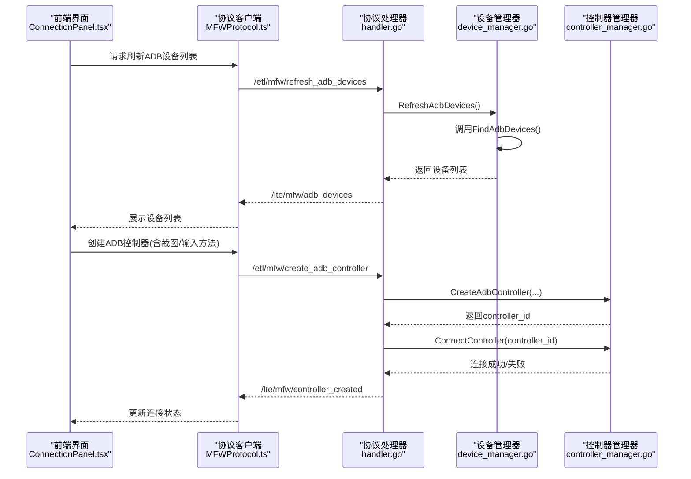
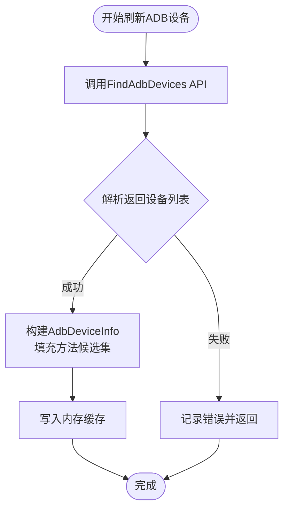
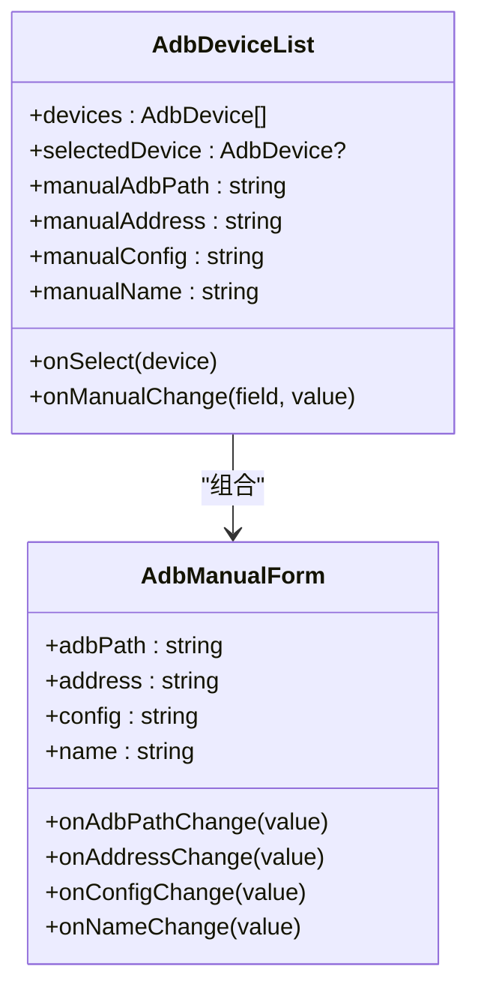
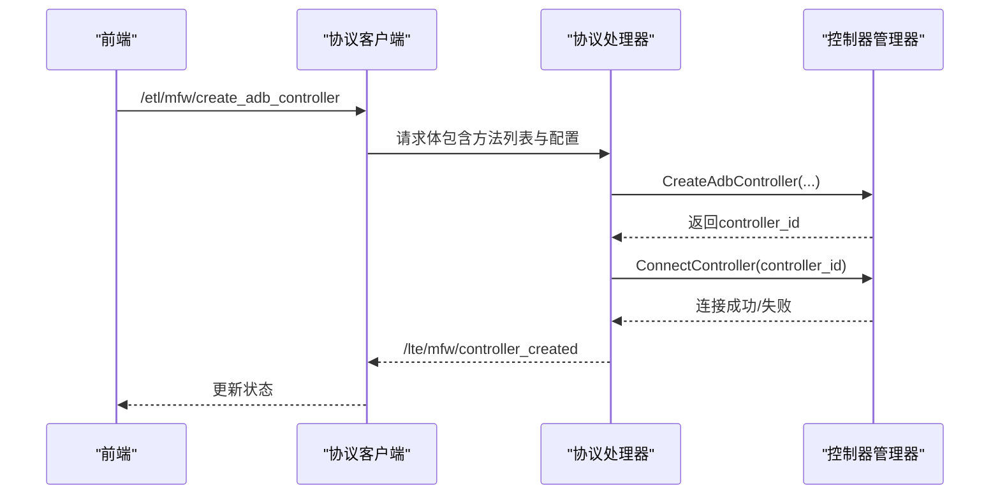
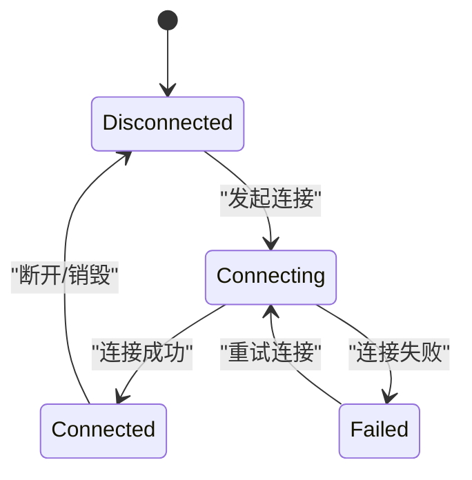
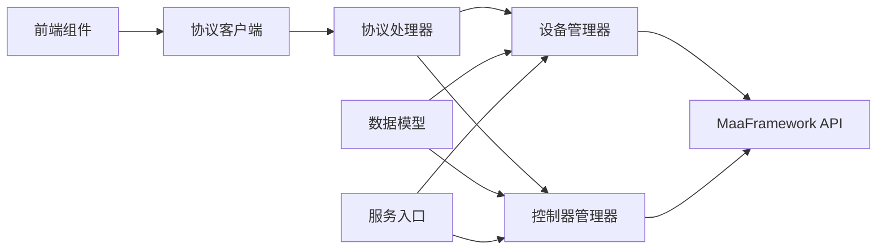

# ADB设备管理

<cite>
**本文档引用的文件**
- [device_manager.go](file://LocalBridge/internal/mfw/device_manager.go)
- [controller_manager.go](file://LocalBridge/internal/mfw/controller_manager.go)
- [types.go](file://LocalBridge/internal/mfw/types.go)
- [handler.go](file://LocalBridge/internal/protocol/mfw/handler.go)
- [service.go](file://LocalBridge/internal/mfw/service.go)
- [error.go](file://LocalBridge/internal/mfw/error.go)
- [AdbDeviceList.tsx](file://src/components/panels/main/connection/AdbDeviceList.tsx)
- [AdbManualForm.tsx](file://src/components/panels/main/connection/AdbManualForm.tsx)
- [ConnectionPanel.tsx](file://src/components/panels/main/ConnectionPanel.tsx)
- [mfwStore.ts](file://src/stores/mfwStore.ts)
- [MFWProtocol.ts](file://src/services/protocols/MFWProtocol.ts)
- [设备连接.md](file://docsite/docs/01.指南/20.本地服务/15.设备连接.md)
- [Device Discovery and Connection.md](file://dev/instructions/maafw-golang-binding/Device Discovery and Connection.md)
- [ControlMethods.md](file://dev/instructions/maafw-guide/2.4-ControlMethods.md)
</cite>

## 目录
1. [简介](#简介)
2. [项目结构](#项目结构)
3. [核心组件](#核心组件)
4. [架构总览](#架构总览)
5. [详细组件分析](#详细组件分析)
6. [依赖关系分析](#依赖关系分析)
7. [性能考虑](#性能考虑)
8. [故障排除指南](#故障排除指南)
9. [结论](#结论)

## 简介
本文件面向ADB设备管理功能，系统性阐述以下内容：
- ADB设备自动发现机制：FindAdbDevices API的调用与设备信息提取
- 截图方法选择策略：EncodeToFileAndPull、Encode、RawWithGzip、RawByNetcat、MinicapDirect、MinicapStream、EmulatorExtras
- 输入方法选择策略：AdbShell、MinitouchAndAdbKey、Maatouch、EmulatorExtras
- ADB设备配置表单设计：设备地址、名称、ADB路径等字段的验证与存储
- 连接状态监控、错误处理与重连机制
- 兼容性测试与常见问题排查

## 项目结构
ADB设备管理涉及前后端协作：
- 后端（Go）：设备发现、控制器创建与管理、协议处理、错误封装
- 前端（React + TypeScript）：设备列表展示、配置表单、状态管理与交互

```mermaid
graph TB
subgraph "前端"
UI_ADB["ADB设备列表<br/>AdbDeviceList.tsx"]
UI_Form["ADB手动表单<br/>AdbManualForm.tsx"]
UI_Panel["连接面板<br/>ConnectionPanel.tsx"]
Store["状态管理<br/>mfwStore.ts"]
Protocol["协议客户端<br/>MFWProtocol.ts"]
end
subgraph "后端"
Handler["协议处理器<br/>handler.go"]
DevMgr["设备管理器<br/>device_manager.go"]
CtrlMgr["控制器管理器<br/>controller_manager.go"]
Types["数据模型<br/>types.go"]
Service["服务入口<br/>service.go"]
Error["错误定义<br/>error.go"]
end
UI_Panel --> Protocol
Protocol --> Handler
Handler --> DevMgr
Handler --> CtrlMgr
DevMgr --> Types
CtrlMgr --> Types
Service --> DevMgr
Service --> CtrlMgr
Store --> UI_Panel
UI_ADB --> UI_Panel
UI_Form --> UI_Panel
```

**图表来源**
- [handler.go:1-128](file://LocalBridge/internal/protocol/mfw/handler.go#L1-L128)
- [device_manager.go:1-77](file://LocalBridge/internal/mfw/device_manager.go#L1-L77)
- [controller_manager.go:1-80](file://LocalBridge/internal/mfw/controller_manager.go#L1-L80)
- [types.go:1-129](file://LocalBridge/internal/mfw/types.go#L1-L129)
- [service.go:1-218](file://LocalBridge/internal/mfw/service.go#L1-L218)
- [error.go:1-53](file://LocalBridge/internal/mfw/error.go#L1-L53)
- [AdbDeviceList.tsx:1-180](file://src/components/panels/main/connection/AdbDeviceList.tsx#L1-L180)
- [AdbManualForm.tsx:1-104](file://src/components/panels/main/connection/AdbManualForm.tsx#L1-L104)
- [ConnectionPanel.tsx:1-718](file://src/components/panels/main/ConnectionPanel.tsx#L1-L718)
- [mfwStore.ts:1-195](file://src/stores/mfwStore.ts#L1-L195)
- [MFWProtocol.ts:190-234](file://src/services/protocols/MFWProtocol.ts#L190-L234)

**章节来源**
- [handler.go:1-128](file://LocalBridge/internal/protocol/mfw/handler.go#L1-L128)
- [device_manager.go:1-77](file://LocalBridge/internal/mfw/device_manager.go#L1-L77)
- [controller_manager.go:1-80](file://LocalBridge/internal/mfw/controller_manager.go#L1-L80)
- [types.go:1-129](file://LocalBridge/internal/mfw/types.go#L1-L129)
- [service.go:1-218](file://LocalBridge/internal/mfw/service.go#L1-L218)
- [error.go:1-53](file://LocalBridge/internal/mfw/error.go#L1-L53)
- [AdbDeviceList.tsx:1-180](file://src/components/panels/main/connection/AdbDeviceList.tsx#L1-L180)
- [AdbManualForm.tsx:1-104](file://src/components/panels/main/connection/AdbManualForm.tsx#L1-L104)
- [ConnectionPanel.tsx:1-718](file://src/components/panels/main/ConnectionPanel.tsx#L1-L718)
- [mfwStore.ts:1-195](file://src/stores/mfwStore.ts#L1-L195)
- [MFWProtocol.ts:190-234](file://src/services/protocols/MFWProtocol.ts#L190-L234)

## 核心组件
- 设备管理器（DeviceManager）：负责调用FindAdbDevices API，刷新ADB设备列表，并封装设备信息（含截图与输入方法候选集）
- 控制器管理器（ControllerManager）：负责创建ADB控制器、连接/断开、执行操作（点击、滑动、输入、截图等），并维护连接状态
- 协议处理器（MFWHandler）：接收前端请求，分发到设备/控制器管理器，返回统一消息格式
- 数据模型（types.go）：定义ADB设备信息、控制器信息、截图请求/结果等结构
- 服务入口（Service）：初始化MaaFramework，加载库与日志目录，提供设备/控制器管理器实例
- 错误定义（error.go）：统一错误码与错误类型，便于前端展示与处理

**章节来源**
- [device_manager.go:1-77](file://LocalBridge/internal/mfw/device_manager.go#L1-L77)
- [controller_manager.go:1-80](file://LocalBridge/internal/mfw/controller_manager.go#L1-L80)
- [handler.go:1-128](file://LocalBridge/internal/protocol/mfw/handler.go#L1-L128)
- [types.go:1-129](file://LocalBridge/internal/mfw/types.go#L1-L129)
- [service.go:1-218](file://LocalBridge/internal/mfw/service.go#L1-L218)
- [error.go:1-53](file://LocalBridge/internal/mfw/error.go#L1-L53)

## 架构总览
ADB设备管理采用“前端表单 + 后端协议 + 框架绑定”的分层架构。前端通过协议客户端向后端发送请求，后端调用MaaFramework Go绑定的FindAdbDevices与NewAdbController等API，完成设备发现与控制器创建。

**图表来源**
- [ConnectionPanel.tsx:344-355](file://src/components/panels/main/ConnectionPanel.tsx#L344-L355)
- [MFWProtocol.ts:190-234](file://src/services/protocols/MFWProtocol.ts#L190-L234)
- [handler.go:48-148](file://LocalBridge/internal/protocol/mfw/handler.go#L48-L148)
- [device_manager.go:27-61](file://LocalBridge/internal/mfw/device_manager.go#L27-L61)
- [controller_manager.go:33-75](file://LocalBridge/internal/mfw/controller_manager.go#L33-L75)

## 详细组件分析

### 设备自动发现机制
- 调用链路：前端触发刷新 → 协议处理器分发 → 设备管理器调用FindAdbDevices → 返回设备列表
- 设备信息封装：包含ADB路径、地址、名称、截图方法候选、输入方法候选、设备配置字符串
- 方法候选集：截图方法包含EncodeToFileAndPull、Encode、RawWithGzip、RawByNetcat、MinicapDirect、MinicapStream、EmulatorExtras；输入方法包含AdbShell、MinitouchAndAdbKey、Maatouch、EmulatorExtras

**图表来源**
- [device_manager.go:27-61](file://LocalBridge/internal/mfw/device_manager.go#L27-L61)
- [Device Discovery and Connection.md:52-67](file://dev/instructions/maafw-golang-binding/Device Discovery and Connection.md#L52-L67)

**章节来源**
- [device_manager.go:27-61](file://LocalBridge/internal/mfw/device_manager.go#L27-L61)
- [Device Discovery and Connection.md:52-67](file://dev/instructions/maafw-golang-binding/Device Discovery and Connection.md#L52-L67)

### 截图方法选择策略
- 默认策略：当未显式指定截图方法时，MaaFramework库会尝试除RawByNetcat、MinicapDirect、MinicapStream之外的方法
- 性能与兼容性权衡：
  - EncodeToFileAndPull/Encode/RawWithGzip：兼容性高，速度较慢，适合稳定场景
  - RawByNetcat：速度快但兼容性低
  - MinicapDirect/MinicapStream：速度极快但有损压缩，且兼容性低，不建议使用
  - EmulatorExtras：仅支持特定模拟器（MuMu 12、LDPlayer 9、AVD），速度极快
- 前端建议：优先使用默认策略；遇到黑屏或卡顿再切换到其他方法

**章节来源**
- [ControlMethods.md:35-71](file://dev/instructions/maafw-guide/2.4-ControlMethods.md#L35-L71)
- [device_manager.go:37-41](file://LocalBridge/internal/mfw/device_manager.go#L37-L41)

### 输入方法选择策略
- AdbShell：兼容性最好，适合通用场景
- MinitouchAndAdbKey：触控+按键组合，稳定性较好
- Maatouch：MaaTouch输入，推荐用于大多数情况
- EmulatorExtras：模拟器专用加速
- 前端建议：优先使用Maatouch；若输入无响应，回退到AdbShell

**章节来源**
- [device_manager.go:39-41](file://LocalBridge/internal/mfw/device_manager.go#L39-L41)
- [设备连接.md:57-68](file://docsite/docs/01.指南/20.本地服务/15.设备连接.md#L57-L68)

### ADB设备配置表单设计
- 字段定义：
  - 设备名称（可选）：用于友好显示
  - ADB路径：ADB可执行文件路径（留空则使用系统PATH中的adb）
  - 设备地址：serial地址（如127.0.0.1:5555、emulator-5554）
  - 额外配置（可选）：JSON字符串，传递给设备配置
- 表单交互：
  - 自动扫描设备列表与手动输入互斥，手动输入时清空列表选择
  - 选择列表项时清空手动输入，避免冲突
- 存储与传递：
  - 前端将表单数据打包为请求体，包含adb_path、address、screencap_methods、input_methods、config、agent_path等字段
  - 后端解析并创建ADB控制器

**图表来源**
- [AdbDeviceList.tsx:1-180](file://src/components/panels/main/connection/AdbDeviceList.tsx#L1-L180)
- [AdbManualForm.tsx:1-104](file://src/components/panels/main/connection/AdbManualForm.tsx#L1-L104)

**章节来源**
- [AdbDeviceList.tsx:1-180](file://src/components/panels/main/connection/AdbDeviceList.tsx#L1-L180)
- [AdbManualForm.tsx:1-104](file://src/components/panels/main/connection/AdbManualForm.tsx#L1-L104)
- [设备连接.md:38-44](file://docsite/docs/01.指南/20.本地服务/15.设备连接.md#L38-L44)

### 控制器创建与连接
- 创建流程：解析截图/输入方法 → 调用NewAdbController → 写入控制器表
- 连接流程：PostConnect异步发起 → 超时等待（10秒） → 检查Connected状态 → 记录UUID与最后活跃时间
- 断开流程：Destroy控制器实例 → 从表中删除

**图表来源**
- [handler.go:188-233](file://LocalBridge/internal/protocol/mfw/handler.go#L188-L233)
- [controller_manager.go:278-329](file://LocalBridge/internal/mfw/controller_manager.go#L278-L329)

**章节来源**
- [handler.go:188-233](file://LocalBridge/internal/protocol/mfw/handler.go#L188-L233)
- [controller_manager.go:278-329](file://LocalBridge/internal/mfw/controller_manager.go#L278-L329)

### 连接状态监控、错误处理与重连机制
- 状态管理：前端使用mfwStore维护连接状态（disconnected/connecting/connected/failed），并根据控制器创建/断开消息更新
- 错误处理：后端统一错误码与错误类型，前端根据错误码展示提示并清空设备信息
- 重连机制：当前实现未内置自动重连逻辑，建议在连接失败时提示用户检查设备/ADB路径/方法配置，必要时重新创建控制器

**图表来源**
- [mfwStore.ts:18-22](file://src/stores/mfwStore.ts#L18-L22)
- [MFWProtocol.ts:190-234](file://src/services/protocols/MFWProtocol.ts#L190-L234)
- [controller_manager.go:278-329](file://LocalBridge/internal/mfw/controller_manager.go#L278-L329)

**章节来源**
- [mfwStore.ts:18-22](file://src/stores/mfwStore.ts#L18-L22)
- [MFWProtocol.ts:190-234](file://src/services/protocols/MFWProtocol.ts#L190-L234)
- [controller_manager.go:278-329](file://LocalBridge/internal/mfw/controller_manager.go#L278-L329)

## 依赖关系分析
- 设备管理器依赖MaaFramework的FindAdbDevices API
- 控制器管理器依赖MaaFramework的NewAdbController与控制器操作API
- 协议处理器依赖设备/控制器管理器，负责消息路由与响应
- 前端通过协议客户端与后端通信，使用状态管理与UI组件展示设备与操作结果

**图表来源**
- [handler.go:1-128](file://LocalBridge/internal/protocol/mfw/handler.go#L1-L128)
- [device_manager.go:1-77](file://LocalBridge/internal/mfw/device_manager.go#L1-L77)
- [controller_manager.go:1-80](file://LocalBridge/internal/mfw/controller_manager.go#L1-L80)
- [types.go:1-129](file://LocalBridge/internal/mfw/types.go#L1-L129)
- [service.go:1-218](file://LocalBridge/internal/mfw/service.go#L1-L218)

**章节来源**
- [handler.go:1-128](file://LocalBridge/internal/protocol/mfw/handler.go#L1-L128)
- [device_manager.go:1-77](file://LocalBridge/internal/mfw/device_manager.go#L1-L77)
- [controller_manager.go:1-80](file://LocalBridge/internal/mfw/controller_manager.go#L1-L80)
- [types.go:1-129](file://LocalBridge/internal/mfw/types.go#L1-L129)
- [service.go:1-218](file://LocalBridge/internal/mfw/service.go#L1-L218)

## 性能考虑
- 截图方法选择：优先考虑兼容性而非速度；仅在确认无兼容问题时启用高速方法
- 输入方法选择：优先使用MaaTouch；若不稳定再回退到ADB Shell
- 连接超时：连接等待10秒，超时即判定失败，避免长时间阻塞
- 非活跃清理：可定期清理长时间未活跃的控制器以释放资源

[本节为通用指导，无需具体文件分析]

## 故障排除指南
- 无法发现设备
  - 检查ADB路径与设备地址是否正确
  - 确认设备已授权（USB调试/无线调试）
  - 尝试切换截图/输入方法
- 连接失败
  - 查看后端日志与错误码
  - 重新创建控制器，确保方法列表有效
- 截图黑屏或无响应
  - 切换到兼容性更高的截图方法（如EncodeToFileAndPull）
  - 检查设备权限与分辨率
- 输入无响应
  - 切换到AdbShell或MaaTouch
  - 确认设备无障碍服务/权限

**章节来源**
- [error.go:1-53](file://LocalBridge/internal/mfw/error.go#L1-L53)
- [ControlMethods.md:35-71](file://dev/instructions/maafw-guide/2.4-ControlMethods.md#L35-L71)
- [设备连接.md:30-68](file://docsite/docs/01.指南/20.本地服务/15.设备连接.md#L30-L68)

## 结论
ADB设备管理通过清晰的分层架构实现了设备自动发现、控制器创建与连接、以及稳定的错误处理。前端提供了直观的配置表单与状态反馈，后端基于MaaFramework Go绑定提供了可靠的底层能力。遵循本文的截图与输入方法选择策略，结合完善的错误处理与状态管理，可显著提升ADB设备使用的稳定性与效率。