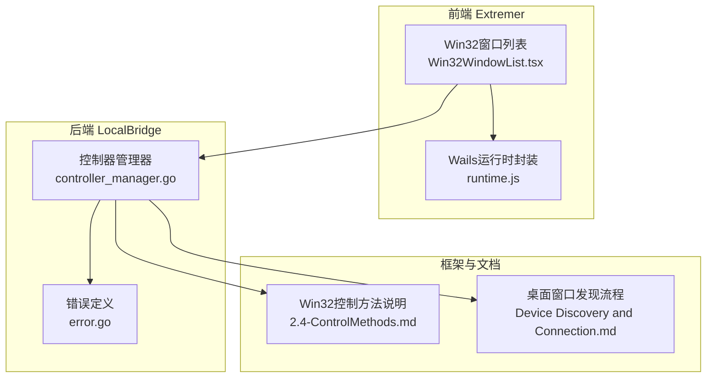
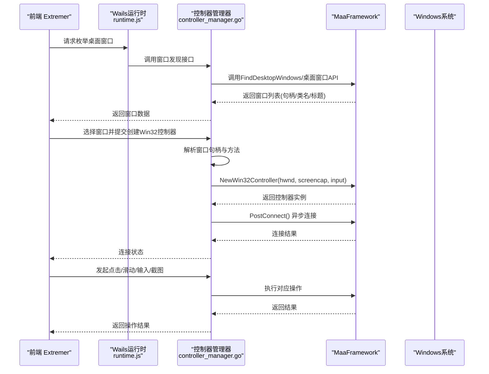
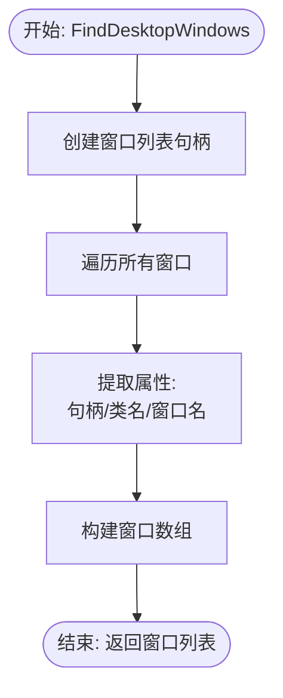
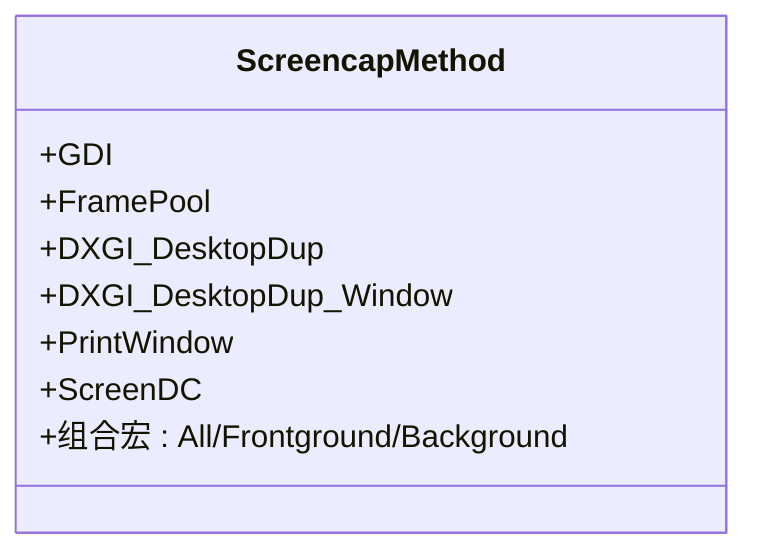
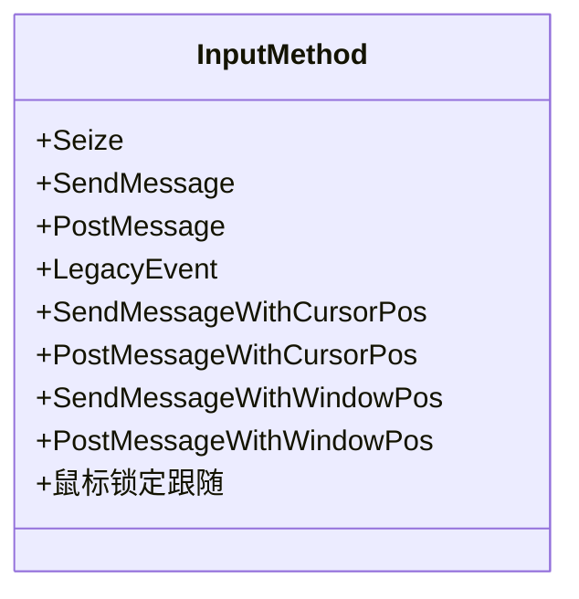
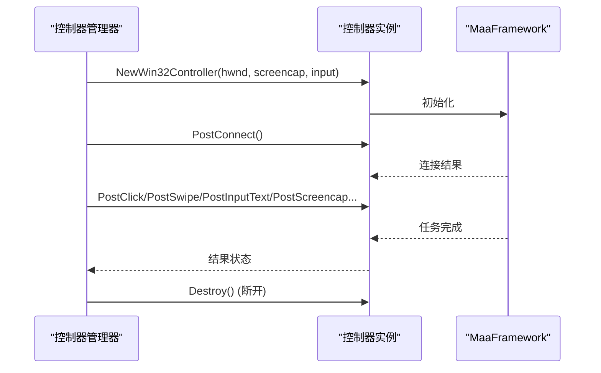
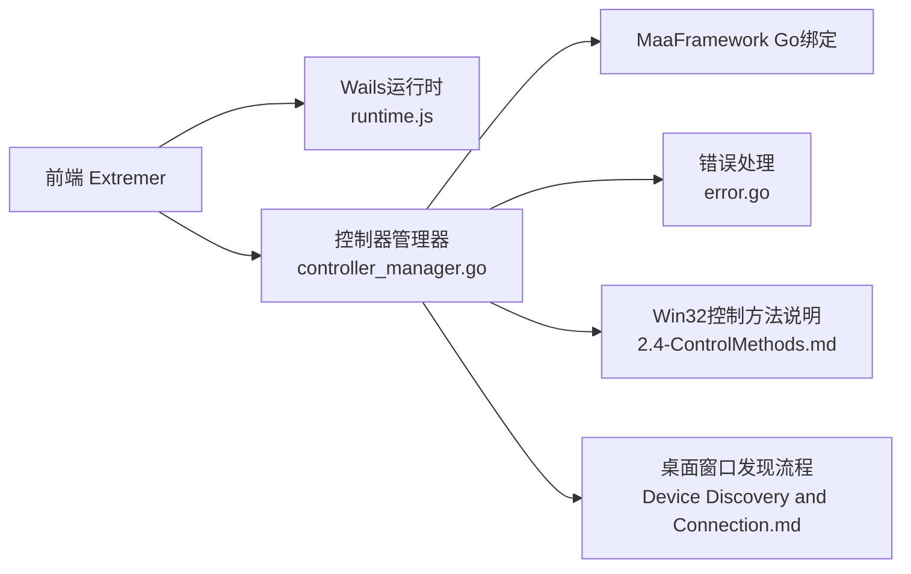

# Win32窗口管理

<cite>
**本文引用的文件**
- [controller_manager.go](file://LocalBridge/internal/mfw/controller_manager.go)
- [mfwStore.ts](file://src/stores/mfwStore.ts)
- [Win32WindowList.tsx](file://src/components/panels/main/connection/Win32WindowList.tsx)
- [2.4-ControlMethods.md](file://dev/instructions/maafw-guide/2.4-ControlMethods.md)
- [Device Discovery and Connection.md](file://dev/instructions/maafw-golang-binding/Device Discovery and Connection.md)
- [error.go](file://LocalBridge/internal/mfw/error.go)
- [runtime.js](file://Extremer/frontend/wailsjs/runtime/runtime.js)
- [splash_windows.go](file://Extremer/internal/splash/splash_windows.go)
</cite>

## 目录
1. [简介](#简介)
2. [项目结构](#项目结构)
3. [核心组件](#核心组件)
4. [架构总览](#架构总览)
5. [详细组件分析](#详细组件分析)
6. [依赖分析](#依赖分析)
7. [性能考虑](#性能考虑)
8. [故障排查指南](#故障排查指南)
9. [结论](#结论)
10. [附录](#附录)

## 简介
本文件面向Win32窗口管理功能，围绕以下目标展开：  
- 说明FindDesktopWindows API在MaaFramework中的使用方式与窗口信息提取机制  
- 深入解析Win32窗口截图方法（GDI、FramePool、FramePoolWithPseudoMinimize、DXGI_DesktopDup、DXGI_DesktopDup_Window、PrintWindow、PrintWindowWithPseudoMinimize、ScreenDC）与输入方法（Seize、SendMessage、PostMessage、LegacyEvent、带光标位置的消息、带窗口位置的消息）的技术原理与适用场景  
- 阐述窗口句柄管理、类名与窗口名的获取机制  
- 提供窗口状态监控、焦点管理与错误处理的实现指导  
- 给出Win32窗口兼容性测试与性能优化建议  

## 项目结构
本仓库中与Win32窗口管理相关的关键模块包括：  
- LocalBridge后端：负责创建与管理Win32控制器，解析窗口句柄、截图与输入方法，并通过MaaFramework Go绑定进行连接与操作  
- 前端Extremer：提供Win32窗口列表展示、窗口状态查询与基础窗口操作封装  
- 文档与规范：提供Win32截图与输入方法的官方说明，以及桌面窗口发现流程的架构说明  

**图表来源**
- [controller_manager.go](file://LocalBridge/internal/mfw/controller_manager.go)
- [Win32WindowList.tsx](file://src/components/panels/main/connection/Win32WindowList.tsx)
- [2.4-ControlMethods.md](file://dev/instructions/maafw-guide/2.4-ControlMethods.md)
- [Device Discovery and Connection.md](file://dev/instructions/maafw-golang-binding/Device Discovery and Connection.md)
- [error.go](file://LocalBridge/internal/mfw/error.go)
- [runtime.js](file://Extremer/frontend/wailsjs/runtime/runtime.js)

**章节来源**
- [controller_manager.go](file://LocalBridge/internal/mfw/controller_manager.go)
- [mfwStore.ts](file://src/stores/mfwStore.ts)
- [Win32WindowList.tsx](file://src/components/panels/main/connection/Win32WindowList.tsx)
- [2.4-ControlMethods.md](file://dev/instructions/maafw-guide/2.4-ControlMethods.md)
- [Device Discovery and Connection.md](file://dev/instructions/maafw-golang-binding/Device Discovery and Connection.md)
- [error.go](file://LocalBridge/internal/mfw/error.go)
- [runtime.js](file://Extremer/frontend/wailsjs/runtime/runtime.js)

## 核心组件
- 控制器管理器（ControllerManager）：负责Win32控制器的创建、连接、断开、截图与基本操作；解析窗口句柄与输入/截图方法；维护控制器生命周期与状态  
- Win32窗口数据模型：前端Store中定义Win32Window结构，包含句柄、类名、窗口名、支持的截图与输入方法  
- 前端窗口列表组件：展示可用Win32窗口，标注句柄与选择状态，辅助用户选择目标窗口  
- 错误处理：统一的错误码与错误类型，便于定位控制器创建、连接、操作失败等问题  
- 文档与规范：官方Win32控制方法说明与桌面窗口发现流程，指导方法选择与兼容性判断  

**章节来源**
- [controller_manager.go](file://LocalBridge/internal/mfw/controller_manager.go)
- [mfwStore.ts](file://src/stores/mfwStore.ts)
- [Win32WindowList.tsx](file://src/components/panels/main/connection/Win32WindowList.tsx)
- [error.go](file://LocalBridge/internal/mfw/error.go)

## 架构总览
Win32窗口管理的端到端流程如下：  
- 前端请求后端枚举桌面窗口（FindDesktopWindows），后端通过MaaFramework Go绑定调用原生接口，提取每个窗口的句柄、类名、窗口名  
- 用户在前端选择目标窗口，后端将句柄与所选截图/输入方法传递给控制器管理器  
- 控制器管理器解析句柄与方法，创建Win32控制器并异步连接  
- 连接成功后，前端可发起点击、滑动、输入文本等操作，后端通过MaaFramework执行相应输入方法  
- 截图通过控制器管理器统一调度，按配置的方法组合进行抓取并返回图像数据  

**图表来源**
- [Device Discovery and Connection.md](file://dev/instructions/maafw-golang-binding/Device Discovery and Connection.md)
- [controller_manager.go](file://LocalBridge/internal/mfw/controller_manager.go)
- [2.4-ControlMethods.md](file://dev/instructions/maafw-guide/2.4-ControlMethods.md)
- [runtime.js](file://Extremer/frontend/wailsjs/runtime/runtime.js)

## 详细组件分析

### FindDesktopWindows与窗口信息提取机制
- 接口与流程：FindDesktopWindows通过MaaFramework Go绑定调用底层实现，创建窗口列表句柄，遍历所有可见桌面窗口，逐个提取句柄、类名与窗口名，最终构造窗口数组返回  
- 数据结构：每条记录包含句柄（HWND）、类名（ClassName）、窗口名（WindowName），句柄是后续创建Win32控制器的必需参数  
- 兼容性：该流程在Windows平台使用Win32 API枚举窗口，在macOS/Linux使用平台特定API，但本文聚焦Windows平台的实现细节  

**图表来源**
- [Device Discovery and Connection.md](file://dev/instructions/maafw-golang-binding/Device Discovery and Connection.md)

**章节来源**
- [Device Discovery and Connection.md](file://dev/instructions/maafw-golang-binding/Device Discovery and Connection.md)

### 窗口句柄管理与类名/窗口名获取
- 句柄解析：后端在创建Win32控制器前，对传入的十六进制字符串句柄进行去前缀处理与解析，转换为unsafe.Pointer类型的HWND  
- 属性获取：通过MaaFramework提供的接口分别获取句柄、类名与窗口名，前端以“窗口名或类名”作为展示优先级  
- 前端展示：Win32窗口列表组件以图标、标题与句柄形式呈现，支持选择与高亮显示  

**章节来源**
- [controller_manager.go](file://LocalBridge/internal/mfw/controller_manager.go)
- [mfwStore.ts](file://src/stores/mfwStore.ts)
- [Win32WindowList.tsx](file://src/components/panels/main/connection/Win32WindowList.tsx)

### 截图方法详解与适用场景
- GDI：速度较快，兼容性中等，不支持后台截图  
- FramePool：非常快，兼容性中等，需Windows 10 1903+，支持后台截图；内置伪最小化支持（透明且点击穿透，恢复时不激活）  
- DXGI_DesktopDup：非常快，兼容性低，全屏输出复制  
- DXGI_DesktopDup_Window：非常快，兼容性低，裁剪到窗口区域  
- PrintWindow：中等速度，兼容性中等，支持后台截图；内置伪最小化支持  
- ScreenDC：速度较快，兼容性高，不支持后台截图  
- 方法组合宏：All、Foreground（DXGI_DesktopDup_Window|ScreenDC）、Background（FramePool|PrintWindow）  
- 伪最小化：FramePool与PrintWindow在目标窗口最小化时，通过临时透明与点击穿透策略，恢复后无需激活即可继续截图，避免打扰用户  

**图表来源**
- [2.4-ControlMethods.md](file://dev/instructions/maafw-guide/2.4-ControlMethods.md)

**章节来源**
- [2.4-ControlMethods.md](file://dev/instructions/maafw-guide/2.4-ControlMethods.md)
- [controller_manager.go](file://LocalBridge/internal/mfw/controller_manager.go)

### 输入方法详解与适用场景
- Seize：高兼容，无需管理员，会捕获光标，不支持后台  
- SendMessage/PostMessage：中等兼容，可能需要管理员，不捕获光标，支持后台  
- LegacyEvent：低兼容，无需管理员，会捕获光标，不支持后台  
- SendMessageWithCursorPos/PostMessageWithCursorPos：中等兼容，可能需要管理员，短暂移动光标至目标位置再恢复，适合检测真实光标位置的应用  
- SendMessageWithWindowPos/PostMessageWithWindowPos：中等兼容，可能需要管理员，短暂移动窗口使目标位置与当前光标对齐再恢复，不捕获鼠标，窗口可能短暂闪烁  
- 鼠标锁定跟随：启用后窗口持续跟随鼠标，配合相对移动注入用于FPS/TPS游戏的视角控制（仅适用于基于消息的输入方法）  

**图表来源**
- [2.4-ControlMethods.md](file://dev/instructions/maafw-guide/2.4-ControlMethods.md)

**章节来源**
- [2.4-ControlMethods.md](file://dev/instructions/maafw-guide/2.4-ControlMethods.md)
- [controller_manager.go](file://LocalBridge/internal/mfw/controller_manager.go)

### 控制器生命周期与操作执行
- 创建：解析句柄与方法，调用NewWin32Controller创建控制器实例  
- 连接：异步PostConnect，设置超时与状态检查，获取UUID并更新连接状态  
- 操作：点击、滑动、输入文本、启动/停止应用、截图等，均通过PostXxx提交任务并等待完成  
- 断开：销毁控制器实例并清理内存  

**图表来源**
- [controller_manager.go](file://LocalBridge/internal/mfw/controller_manager.go)

**章节来源**
- [controller_manager.go](file://LocalBridge/internal/mfw/controller_manager.go)

### 前端窗口列表与状态展示
- 权限提示：在列表上方提示以管理员模式运行以提升兼容性  
- 列表渲染：展示窗口名或类名、句柄，支持悬停与选中态样式  
- 交互：点击选择目标窗口，触发后端创建控制器流程  

**章节来源**
- [Win32WindowList.tsx](file://src/components/panels/main/connection/Win32WindowList.tsx)
- [mfwStore.ts](file://src/stores/mfwStore.ts)

## 依赖分析
- 控制器管理器依赖MaaFramework Go绑定，负责Win32控制器的创建、连接与操作  
- 前端通过Wails运行时封装调用后端能力，同时提供窗口状态查询与基础窗口操作  
- 文档与规范为方法选择与兼容性判断提供依据  
- 错误处理模块提供统一错误码与错误类型，便于前端展示与日志追踪  

**图表来源**
- [controller_manager.go](file://LocalBridge/internal/mfw/controller_manager.go)
- [error.go](file://LocalBridge/internal/mfw/error.go)
- [2.4-ControlMethods.md](file://dev/instructions/maafw-guide/2.4-ControlMethods.md)
- [Device Discovery and Connection.md](file://dev/instructions/maafw-golang-binding/Device Discovery and Connection.md)
- [runtime.js](file://Extremer/frontend/wailsjs/runtime/runtime.js)

**章节来源**
- [controller_manager.go](file://LocalBridge/internal/mfw/controller_manager.go)
- [error.go](file://LocalBridge/internal/mfw/error.go)
- [2.4-ControlMethods.md](file://dev/instructions/maafw-guide/2.4-ControlMethods.md)
- [Device Discovery and Connection.md](file://dev/instructions/maafw-golang-binding/Device Discovery and Connection.md)
- [runtime.js](file://Extremer/frontend/wailsjs/runtime/runtime.js)

## 性能考虑
- 优先选择FramePool或DXGI_DesktopDup_Window：在支持的系统上具备“非常快”的性能，且后者可裁剪到窗口区域减少数据量  
- 避免在窗口最小化时使用不支持伪最小化的截图方法（如GDI、ScreenDC等），否则会失败  
- 在需要后台截图的场景优先选择支持后台的方案（FramePool、PrintWindow、ScreenDC）  
- 对于需要实时反馈的输入（如FPS/TPS游戏），启用“鼠标锁定跟随”模式并结合相对移动注入，减少硬件鼠标感知差异  
- 合理设置截图目标尺寸（长边/短边/原始尺寸），避免不必要的缩放与编码开销  

[本节为通用性能建议，不直接分析具体文件]

## 故障排查指南
- 连接失败：检查是否以管理员权限运行后端或前端；确认句柄格式正确（十六进制字符串，可含0x前缀）  
- 控制无响应：尝试切换输入方法（如从SendMessage切换到SendMessageWithCursorPos）；确认目标程序权限级别（若目标程序以管理员运行，需以管理员运行）  
- 截图失败：若使用GDI或ScreenDC且窗口处于最小化状态，改用FramePool或PrintWindow；或使用带伪最小化的变体  
- 错误码参考：控制器创建失败、控制器不存在、连接失败、截图失败、操作失败、资源加载失败、参数无效、设备未找到、未初始化、OCR资源未配置等  
- 日志与状态：后端在关键步骤记录调试日志，前端根据连接状态与错误信息进行提示  

**章节来源**
- [error.go](file://LocalBridge/internal/mfw/error.go)
- [controller_manager.go](file://LocalBridge/internal/mfw/controller_manager.go)
- [2.4-ControlMethods.md](file://dev/instructions/maafw-guide/2.4-ControlMethods.md)

## 结论
本项目通过MaaFramework Go绑定实现了Win32窗口的发现、句柄解析、控制器创建与连接、输入与截图操作的完整链路。结合官方文档与规范，用户可根据目标应用的兼容性与性能需求选择合适的截图与输入方法，并通过伪最小化策略与后台截图能力提升自动化稳定性与用户体验。

[本节为总结性内容，不直接分析具体文件]

## 附录

### Win32窗口兼容性测试清单
- 管理员权限：以管理员运行后端与目标应用，验证输入与截图是否生效  
- 窗口状态：最小化、最大化、普通状态下的截图与输入行为  
- 输入方法对比：在不同应用中测试SendMessage、PostMessage、SendMessageWithCursorPos、SendMessageWithWindowPos的效果  
- 截图方法对比：在不同应用中测试GDI、FramePool、DXGI_DesktopDup_Window、PrintWindow、ScreenDC的稳定性与性能  
- 伪最小化验证：FramePool与PrintWindow在最小化窗口下的截图可用性  

[本节为通用测试建议，不直接分析具体文件]

### 常见问题速查
- 问：为什么某些应用无法输入？  
  答：尝试切换输入方法，必要时使用带光标位置或带窗口位置的消息方法；若目标程序以管理员运行，需以管理员运行后端  
- 问：为什么截图在窗口最小化时失败？  
  答：改用支持伪最小化的FramePool或PrintWindow，或使用其带伪最小化的变体  
- 问：如何查看窗口句柄与类名？  
  答：通过FindDesktopWindows获取窗口列表，后端返回句柄、类名与窗口名，前端以列表形式展示  

[本节为通用问题解答，不直接分析具体文件]