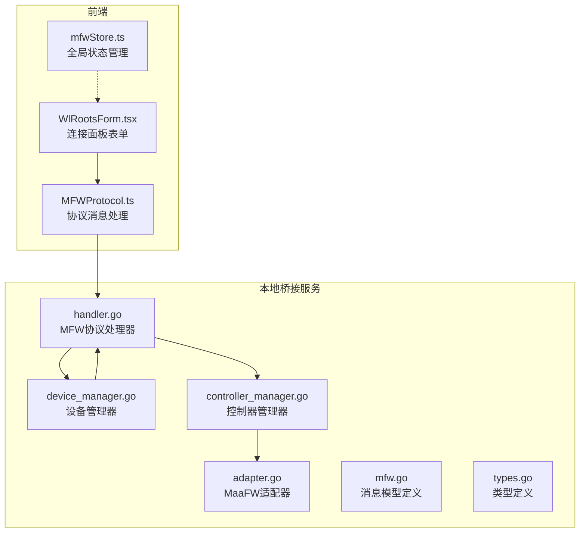
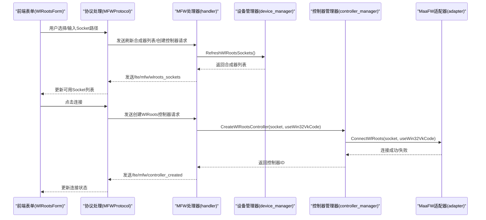
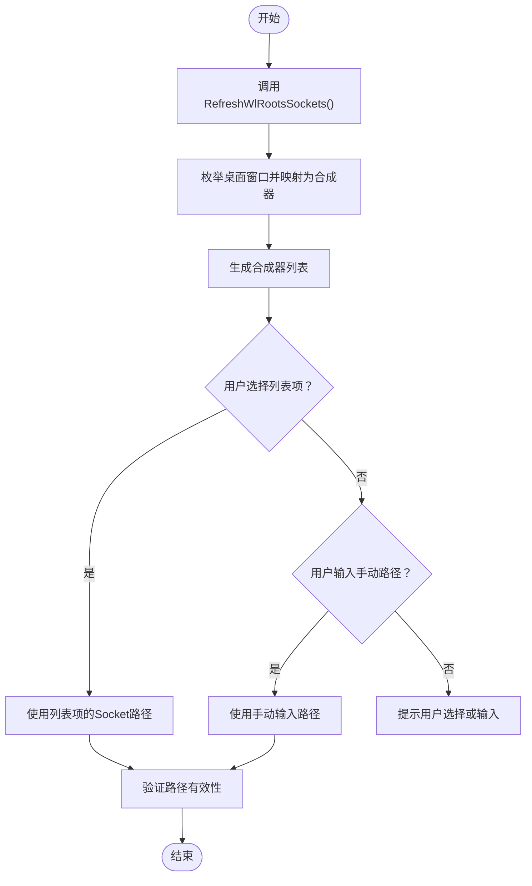
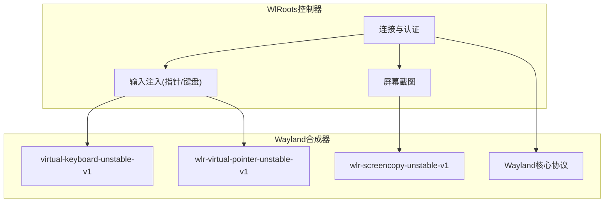
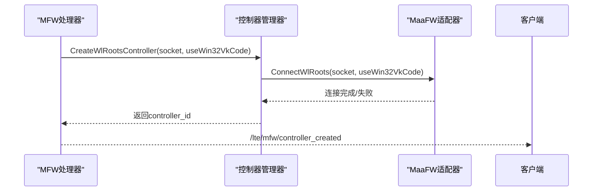
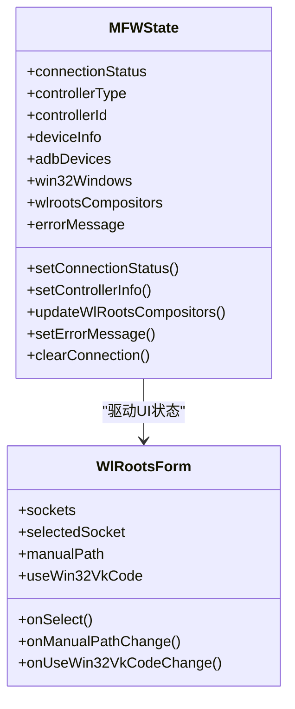
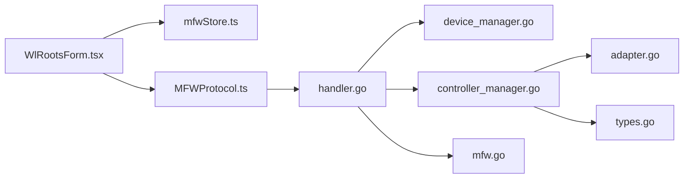

# WlRoots合成器管理

<cite>
**本文档引用的文件**
- [WlRootsForm.tsx](file://src/components/panels/main/connection/WlRootsForm.tsx)
- [device_manager.go](file://LocalBridge/internal/mfw/device_manager.go)
- [controller_manager.go](file://LocalBridge/internal/mfw/controller_manager.go)
- [handler.go](file://LocalBridge/internal/protocol/mfw/handler.go)
- [mfw.go](file://LocalBridge/pkg/models/mfw.go)
- [mfwStore.ts](file://src/stores/mfwStore.ts)
- [MFWProtocol.ts](file://src/services/protocols/MFWProtocol.ts)
- [adapter.go](file://LocalBridge/internal/mfw/adapter.go)
- [types.go](file://LocalBridge/internal/mfw/types.go)
- [2.4-ControlMethods.md](file://dev/instructions/maafw-guide/2.4-ControlMethods.md)
- [2.2-IntegratedInterfaceOverview.md](file://dev/instructions/maafw-guide/2.2-IntegratedInterfaceOverview.md)
- [设备连接.md](file://docsite/docs/01.指南/20.本地服务/15.设备连接.md)
</cite>

## 目录
1. [简介](#简介)
2. [项目结构](#项目结构)
3. [核心组件](#核心组件)
4. [架构总览](#架构总览)
5. [详细组件分析](#详细组件分析)
6. [依赖关系分析](#依赖关系分析)
7. [性能考虑](#性能考虑)
8. [故障排除指南](#故障排除指南)
9. [结论](#结论)
10. [附录](#附录)

## 简介
本技术文档聚焦于WlRoots合成器管理功能，系统阐述其在Linux桌面环境中对基于WlRoots的Wayland合成器进行发现、连接与控制的完整流程。文档涵盖以下要点：
- WlRoots合成器的发现机制与Socket路径管理
- Wayland显示服务器的连接与通信协议要求
- 在Linux桌面环境中的应用场景与优势
- 合成器配置与连接状态监控的实现指导
- 兼容性测试与故障排除方法
- 与其他显示系统的差异与选择策略

## 项目结构
WlRoots相关能力由前端UI、协议层、本地桥接服务与MaaFramework适配层协同实现，形成“前端配置 → 协议消息 → 本地服务 → 控制器管理 → MaaFW适配”的闭环。

**图表来源**
- [WlRootsForm.tsx:1-188](file://src/components/panels/main/connection/WlRootsForm.tsx#L1-L188)
- [MFWProtocol.ts:165-180](file://src/services/protocols/MFWProtocol.ts#L165-L180)
- [handler.go:169-186](file://LocalBridge/internal/protocol/mfw/handler.go#L169-L186)
- [device_manager.go:98-121](file://LocalBridge/internal/mfw/device_manager.go#L98-L121)
- [controller_manager.go:249-276](file://LocalBridge/internal/mfw/controller_manager.go#L249-L276)
- [adapter.go:172-212](file://LocalBridge/internal/mfw/adapter.go#L172-L212)
- [mfw.go:29-33](file://LocalBridge/pkg/models/mfw.go#L29-L33)
- [types.go:40-43](file://LocalBridge/internal/mfw/types.go#L40-L43)

**章节来源**
- [WlRootsForm.tsx:1-188](file://src/components/panels/main/connection/WlRootsForm.tsx#L1-L188)
- [MFWProtocol.ts:165-180](file://src/services/protocols/MFWProtocol.ts#L165-L180)
- [handler.go:169-186](file://LocalBridge/internal/protocol/mfw/handler.go#L169-L186)
- [device_manager.go:98-121](file://LocalBridge/internal/mfw/device_manager.go#L98-L121)
- [controller_manager.go:249-276](file://LocalBridge/internal/mfw/controller_manager.go#L249-L276)
- [adapter.go:172-212](file://LocalBridge/internal/mfw/adapter.go#L172-L212)
- [mfw.go:29-33](file://LocalBridge/pkg/models/mfw.go#L29-L33)
- [types.go:40-43](file://LocalBridge/internal/mfw/types.go#L40-L43)

## 核心组件
- 前端连接表单：提供WlRoots Socket路径选择与手动输入、Win32虚拟键码映射开关，并展示提示信息。
- 协议处理器：接收刷新合成器列表与创建WlRoots控制器的请求，封装响应消息。
- 设备管理器：扫描并返回可用的WlRoots合成器列表（当前实现基于桌面窗口枚举的变体）。
- 控制器管理器：创建WlRoots控制器实例、异步连接、状态查询与资源清理。
- MaaFW适配器：封装底层MaaFramework的WlRoots控制器创建与连接逻辑。
- 状态存储：维护连接状态、控制器类型与设备信息，驱动UI交互。

**章节来源**
- [WlRootsForm.tsx:19-187](file://src/components/panels/main/connection/WlRootsForm.tsx#L19-L187)
- [handler.go:169-186](file://LocalBridge/internal/protocol/mfw/handler.go#L169-L186)
- [device_manager.go:98-121](file://LocalBridge/internal/mfw/device_manager.go#L98-L121)
- [controller_manager.go:249-276](file://LocalBridge/internal/mfw/controller_manager.go#L249-L276)
- [adapter.go:172-212](file://LocalBridge/internal/mfw/adapter.go#L172-L212)
- [mfwStore.ts:100-127](file://src/stores/mfwStore.ts#L100-L127)

## 架构总览
下图展示了WlRoots连接的端到端流程：前端表单触发协议消息，后端处理器调用设备与控制器管理器，最终通过MaaFW适配器建立Wayland连接。

**图表来源**
- [WlRootsForm.tsx:30-40](file://src/components/panels/main/connection/WlRootsForm.tsx#L30-L40)
- [MFWProtocol.ts:165-180](file://src/services/protocols/MFWProtocol.ts#L165-L180)
- [handler.go:169-186](file://LocalBridge/internal/protocol/mfw/handler.go#L169-L186)
- [handler.go:351-384](file://LocalBridge/internal/protocol/mfw/handler.go#L351-L384)
- [device_manager.go:98-121](file://LocalBridge/internal/mfw/device_manager.go#L98-L121)
- [controller_manager.go:249-276](file://LocalBridge/internal/mfw/controller_manager.go#L249-L276)
- [adapter.go:172-212](file://LocalBridge/internal/mfw/adapter.go#L172-L212)

## 详细组件分析

### WlRoots合成器发现机制与Socket路径管理
- 发现流程：后端通过设备管理器的刷新接口返回WlRoots合成器列表。当前实现以桌面窗口枚举为基础，将窗口信息映射为合成器条目，其中Socket路径来自窗口类名字段。
- Socket路径来源：前端表单默认提示路径格式为/run/user/$UID/wayland-0，实际使用时应优先从刷新列表中选择，或手动输入有效路径。
- 路径校验与优先级：当同时存在列表选择与手动输入时，系统采用手动输入路径，列表选择会被忽略；建议优先使用嵌套合成器会话，避免控制当前桌面合成器。

**图表来源**
- [device_manager.go:98-121](file://LocalBridge/internal/mfw/device_manager.go#L98-L121)
- [WlRootsForm.tsx:30-40](file://src/components/panels/main/connection/WlRootsForm.tsx#L30-L40)
- [WlRootsForm.tsx:132-154](file://src/components/panels/main/connection/WlRootsForm.tsx#L132-L154)

**章节来源**
- [device_manager.go:98-121](file://LocalBridge/internal/mfw/device_manager.go#L98-L121)
- [WlRootsForm.tsx:19-187](file://src/components/panels/main/connection/WlRootsForm.tsx#L19-L187)
- [设备连接.md:118-126](file://docsite/docs/01.指南/20.本地服务/15.设备连接.md#L118-L126)

### Wayland显示服务器连接与通信协议
- 协议要求：被控制的wlroots合成器需支持以下协议：
  - Wayland核心协议
  - virtual-keyboard-unstable-v1
  - wlr-screencopy-unstable-v1
  - wlr-virtual-pointer-unstable-v1
- 建议实践：推荐在嵌套合成器会话中使用该控制器，避免直接控制当前桌面合成器，以减少意外行为。
- 键盘输入：默认使用evdev键码；若启用Win32虚拟键码映射，则将Win32 VK码转换为evdev码。

**图表来源**
- [2.4-ControlMethods.md:260-279](file://dev/instructions/maafw-guide/2.4-ControlMethods.md#L260-L279)

**章节来源**
- [2.4-ControlMethods.md:260-279](file://dev/instructions/maafw-guide/2.4-ControlMethods.md#L260-L279)
- [2.2-IntegratedInterfaceOverview.md:302-307](file://dev/instructions/maafw-guide/2.2-IntegratedInterfaceOverview.md#L302-L307)

### WlRoots控制器创建与连接
- 创建流程：协议处理器接收请求后，调用控制器管理器创建WlRoots控制器，传入Socket路径与Win32虚拟键码映射标志。
- 连接流程：控制器管理器异步发起连接，等待完成后检查连接状态，记录UUID并更新状态。
- 自动连接：创建请求成功后立即自动连接，简化用户操作。

**图表来源**
- [handler.go:351-384](file://LocalBridge/internal/protocol/mfw/handler.go#L351-L384)
- [controller_manager.go:249-276](file://LocalBridge/internal/mfw/controller_manager.go#L249-L276)
- [adapter.go:172-212](file://LocalBridge/internal/mfw/adapter.go#L172-L212)

**章节来源**
- [handler.go:351-384](file://LocalBridge/internal/protocol/mfw/handler.go#L351-L384)
- [controller_manager.go:278-329](file://LocalBridge/internal/mfw/controller_manager.go#L278-L329)
- [adapter.go:172-212](file://LocalBridge/internal/mfw/adapter.go#L172-L212)

### 连接状态监控与UI反馈
- 状态存储：全局状态管理器维护连接状态、控制器类型、控制器ID与设备信息。
- UI联动：连接面板根据状态更新按钮颜色与设备信息展示；错误信息会在失败时显示。
- 协议响应：后端通过/lte/mfw/controller_created与/lte/mfw/wlroots_sockets推送状态变更。

**图表来源**
- [mfwStore.ts:100-194](file://src/stores/mfwStore.ts#L100-L194)
- [WlRootsForm.tsx:8-17](file://src/components/panels/main/connection/WlRootsForm.tsx#L8-L17)

**章节来源**
- [mfwStore.ts:100-194](file://src/stores/mfwStore.ts#L100-L194)
- [MFWProtocol.ts:165-180](file://src/services/protocols/MFWProtocol.ts#L165-L180)
- [设备连接.md:127-139](file://docsite/docs/01.指南/20.本地服务/15.设备连接.md#L127-L139)

### 数据模型与消息协议
- 请求模型：CreateWlRootsControllerRequest包含socket_path与use_win32_vk_code两个字段。
- 响应模型：WlRootsCompositorsResponse包含compositors数组，每项为WlRootsCompositorsData，包含socket_path。
- 协议路由：刷新合成器列表使用/lte/mfw/wlroots_sockets，创建控制器使用/lte/mfw/controller_created。

**章节来源**
- [mfw.go:29-33](file://LocalBridge/pkg/models/mfw.go#L29-L33)
- [mfw.go:233-241](file://LocalBridge/pkg/models/mfw.go#L233-L241)
- [handler.go:169-186](file://LocalBridge/internal/protocol/mfw/handler.go#L169-L186)
- [handler.go:351-384](file://LocalBridge/internal/protocol/mfw/handler.go#L351-L384)

## 依赖关系分析
- 前端依赖：WlRootsForm依赖mfwStore提供的状态与更新方法；MFWProtocol负责解析后端消息并更新状态。
- 后端依赖：MFW处理器依赖设备管理器与控制器管理器；控制器管理器依赖MaaFW适配器；类型与消息模型定义位于独立包中。
- 外部依赖：MaaFramework提供WlRoots控制器创建与连接能力。

**图表来源**
- [WlRootsForm.tsx:1-188](file://src/components/panels/main/connection/WlRootsForm.tsx#L1-L188)
- [mfwStore.ts:100-194](file://src/stores/mfwStore.ts#L100-L194)
- [MFWProtocol.ts:165-180](file://src/services/protocols/MFWProtocol.ts#L165-L180)
- [handler.go:169-186](file://LocalBridge/internal/protocol/mfw/handler.go#L169-L186)
- [device_manager.go:98-121](file://LocalBridge/internal/mfw/device_manager.go#L98-L121)
- [controller_manager.go:249-276](file://LocalBridge/internal/mfw/controller_manager.go#L249-L276)
- [adapter.go:172-212](file://LocalBridge/internal/mfw/adapter.go#L172-L212)
- [mfw.go:29-33](file://LocalBridge/pkg/models/mfw.go#L29-L33)
- [types.go:40-43](file://LocalBridge/internal/mfw/types.go#L40-L43)

**章节来源**
- [handler.go:169-186](file://LocalBridge/internal/protocol/mfw/handler.go#L169-L186)
- [controller_manager.go:249-276](file://LocalBridge/internal/mfw/controller_manager.go#L249-L276)
- [adapter.go:172-212](file://LocalBridge/internal/mfw/adapter.go#L172-L212)

## 性能考虑
- 连接超时：控制器连接过程包含超时机制（默认10秒），避免长时间阻塞。
- 资源清理：非活跃控制器具备定时清理机制，降低内存占用。
- 截图优化：截图前可设置目标长/短边或使用原始尺寸，减少不必要的缩放开销。

**章节来源**
- [controller_manager.go:294-329](file://LocalBridge/internal/mfw/controller_manager.go#L294-L329)
- [controller_manager.go:650-666](file://LocalBridge/internal/mfw/controller_manager.go#L650-L666)
- [controller_manager.go:564-574](file://LocalBridge/internal/mfw/controller_manager.go#L564-L574)

## 故障排除指南
- 合成器列表为空
  - 确认系统中存在基于WlRoots的Wayland会话。
  - 检查是否处于嵌套合成器会话中。
- 连接后截图黑屏
  - 尝试切换截图方式（如从Encode切换到EncodeToFileAndPull）。
  - 确认目标应用画面正常显示。
  - 部分模拟器需要使用特定截图方式。
- 键盘输入异常
  - 若使用Win32 VK码，请确保在创建控制器时启用use_win32_vk_code。
  - 默认情况下使用evdev键码，需参考linux/input-event-codes.h。
- 协议不兼容
  - 确保目标合成器支持virtual-keyboard-unstable-v1、wlr-screencopy-unstable-v1与wlr-virtual-pointer-unstable-v1。

**章节来源**
- [设备连接.md:141-159](file://docsite/docs/01.指南/20.本地服务/15.设备连接.md#L141-L159)
- [2.4-ControlMethods.md:260-279](file://dev/instructions/maafw-guide/2.4-ControlMethods.md#L260-L279)
- [2.2-IntegratedInterfaceOverview.md:302-307](file://dev/instructions/maafw-guide/2.2-IntegratedInterfaceOverview.md#L302-L307)

## 结论
WlRoots合成器管理通过清晰的前后端分工与协议抽象，实现了对Linux Wayland合成器的稳定发现、配置与控制。其优势在于：
- 与MaaFramework深度集成，提供统一的控制器生命周期管理。
- 支持嵌套合成器会话，降低对当前桌面的影响。
- 通过协议要求与键码映射策略，兼顾跨平台输入一致性。

在实际部署中，建议优先使用嵌套合成器会话，合理配置截图与输入方法，并结合状态监控与错误处理提升稳定性。

## 附录

### 与其他显示系统的区别与选择策略
- ADB控制器：适用于Android设备，适合移动应用自动化。
- Win32控制器：适用于Windows桌面应用，支持多种输入与截图方法。
- WlRoots控制器：专用于Linux Wayland合成器，需满足特定协议要求，适合Linux桌面自动化与嵌套会话场景。
- 选择策略：
  - 目标平台为Linux且使用WlRoots合成器时，优先选择WlRoots控制器。
  - 需要控制当前桌面合成器时，务必谨慎，建议使用嵌套会话。
  - 跨平台需求可结合ADB与Win32控制器，配合WlRoots控制器实现多平台覆盖。

**章节来源**
- [2.4-ControlMethods.md:260-279](file://dev/instructions/maafw-guide/2.4-ControlMethods.md#L260-L279)
- [设备连接.md:118-126](file://docsite/docs/01.指南/20.本地服务/15.设备连接.md#L118-L126)