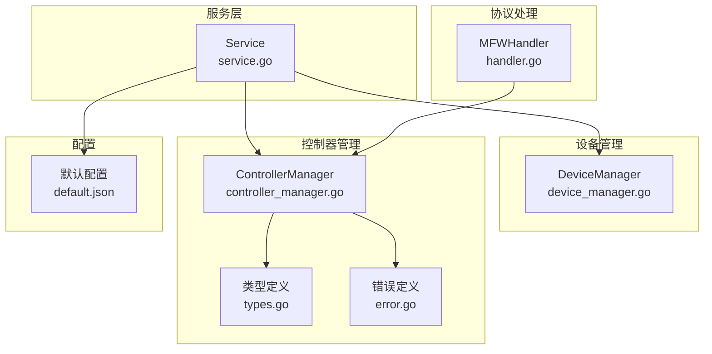
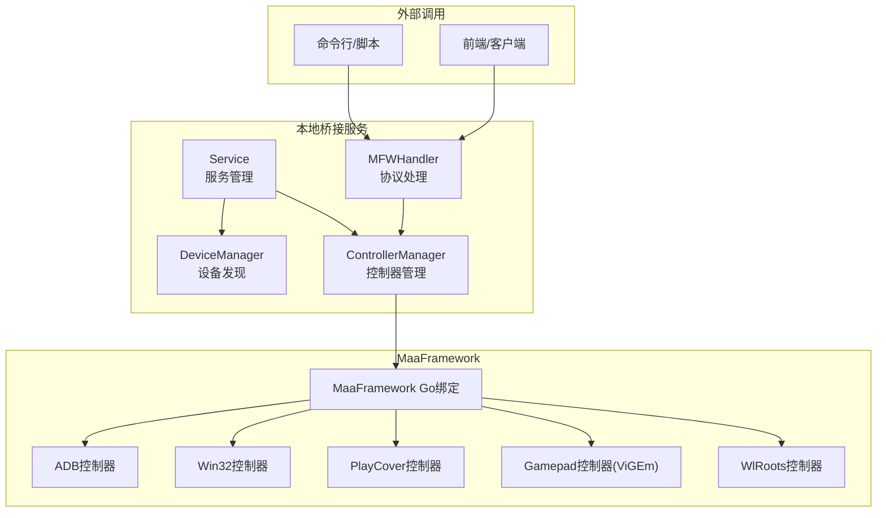
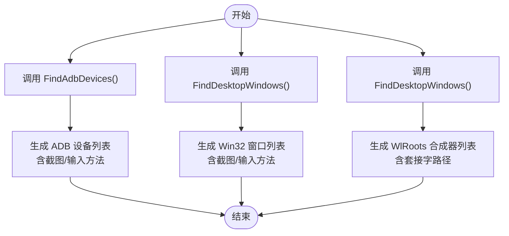
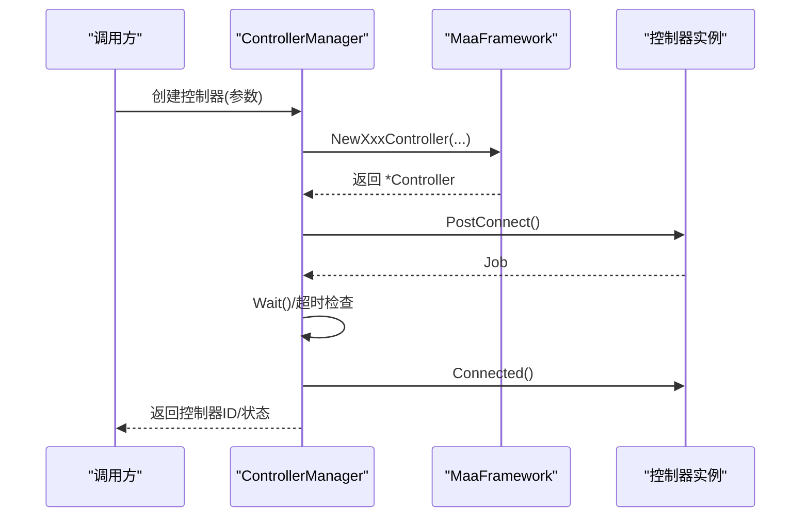
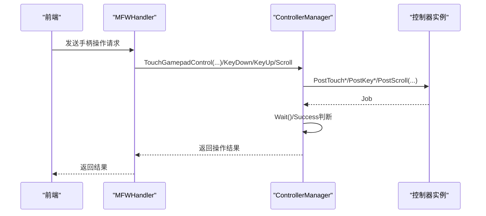
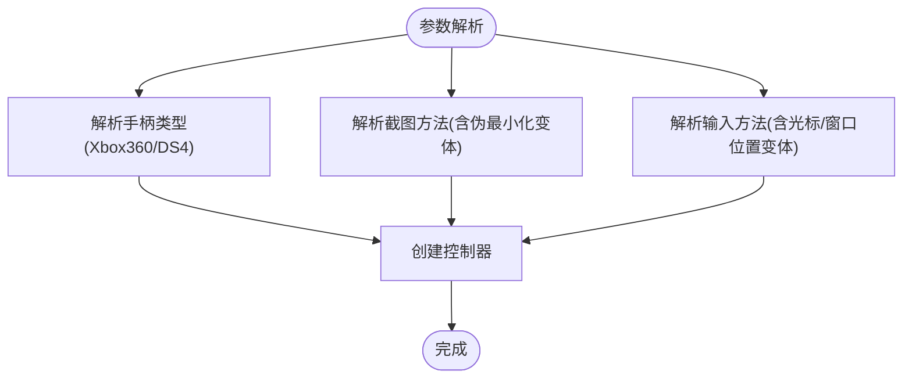
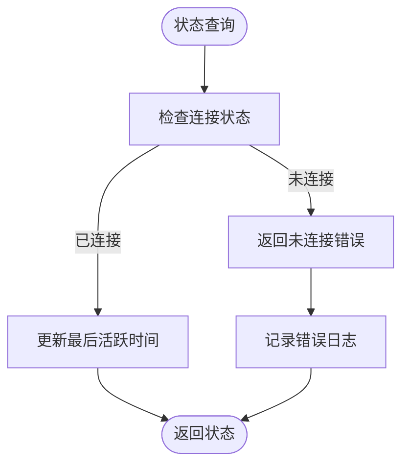
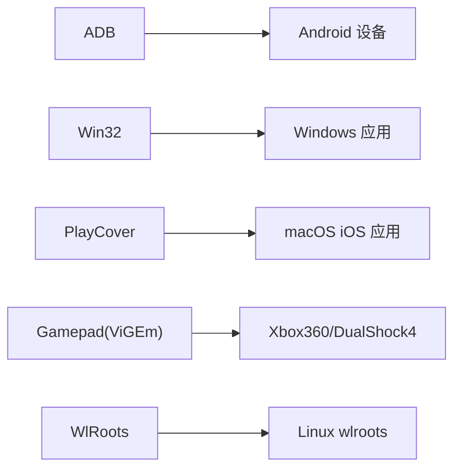
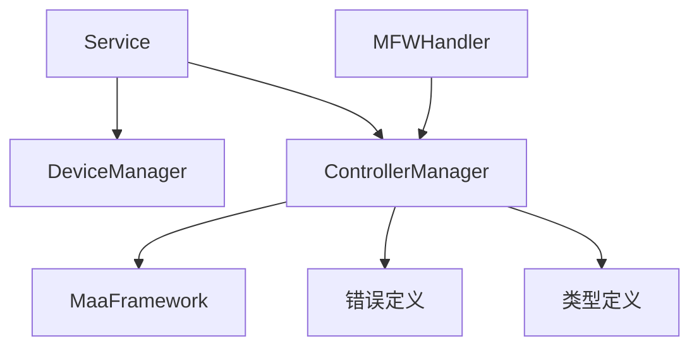

# 手柄控制器管理

<cite>
**本文档引用的文件**
- [controller_manager.go](file://LocalBridge/internal/mfw/controller_manager.go)
- [device_manager.go](file://LocalBridge/internal/mfw/device_manager.go)
- [types.go](file://LocalBridge/internal/mfw/types.go)
- [error.go](file://LocalBridge/internal/mfw/error.go)
- [service.go](file://LocalBridge/internal/mfw/service.go)
- [handler.go](file://LocalBridge/internal/protocol/mfw/handler.go)
- [default.json](file://LocalBridge/config/default.json)
- [Device Discovery and Connection.md](file://dev/instructions/maafw-golang-binding/Device Discovery and Connection.md)
- [Controller.md](file://dev/instructions/maafw-golang-binding/Controller.md)
- [2.4-ControlMethods.md](file://dev/instructions/maafw-guide/2.4-ControlMethods.md)
</cite>

## 目录
1. [简介](#简介)
2. [项目结构](#项目结构)
3. [核心组件](#核心组件)
4. [架构总览](#架构总览)
5. [详细组件分析](#详细组件分析)
6. [依赖关系分析](#依赖关系分析)
7. [性能考虑](#性能考虑)
8. [故障排除指南](#故障排除指南)
9. [结论](#结论)
10. [附录](#附录)

## 简介
本文件面向手柄控制器管理功能，系统性阐述以下方面：
- 手柄设备的发现与枚举机制
- 手柄输入事件的捕获与处理流程
- 手柄配置参数的设置与校准方法
- 手柄状态监控、连接状态跟踪与错误处理
- 不同品牌手柄的兼容性与驱动支持
- 手柄输入与游戏控制的集成方式与最佳实践

该实现基于 MaaFramework 的 Go 绑定，提供 ADB、Win32、PlayCover、虚拟手柄（ViGEm）及 WlRoots 等多种控制器类型，并通过本地桥接服务统一管理。

## 项目结构
围绕手柄控制器管理的核心代码位于 LocalBridge 内部模块，主要由以下层次构成：
- 服务层：负责框架初始化、生命周期管理与全局状态
- 设备管理层：封装设备发现与可用方法枚举
- 控制器管理层：负责控制器创建、连接、操作与状态维护
- 类型与错误定义：统一的数据模型与错误码体系
- 协议处理器：接收前端或外部调用，转发至控制器管理器

**图表来源**
- [service.go:15-34](file://LocalBridge/internal/mfw/service.go#L15-L34)
- [device_manager.go:11-25](file://LocalBridge/internal/mfw/device_manager.go#L11-L25)
- [controller_manager.go:20-31](file://LocalBridge/internal/mfw/controller_manager.go#L20-L31)
- [types.go:7-54](file://LocalBridge/internal/mfw/types.go#L7-L54)
- [error.go:5-31](file://LocalBridge/internal/mfw/error.go#L5-L31)
- [handler.go:572-610](file://LocalBridge/internal/protocol/mfw/handler.go#L572-L610)
- [default.json:23-28](file://LocalBridge/config/default.json#L23-L28)

**章节来源**
- [service.go:15-34](file://LocalBridge/internal/mfw/service.go#L15-L34)
- [device_manager.go:11-25](file://LocalBridge/internal/mfw/device_manager.go#L11-L25)
- [controller_manager.go:20-31](file://LocalBridge/internal/mfw/controller_manager.go#L20-L31)
- [types.go:7-54](file://LocalBridge/internal/mfw/types.go#L7-L54)
- [error.go:5-31](file://LocalBridge/internal/mfw/error.go#L5-L31)
- [handler.go:572-610](file://LocalBridge/internal/protocol/mfw/handler.go#L572-L610)
- [default.json:23-28](file://LocalBridge/config/default.json#L23-L28)

## 核心组件
- 服务管理器（Service）：负责 MaaFramework 初始化、日志目录处理、资源释放与服务重载；提供设备、控制器、资源、任务管理器的访问入口。
- 设备管理器（DeviceManager）：封装 ADB 设备、Win32 窗口与 WlRoots 合成器的发现逻辑，并提供可用截图与输入方法列表。
- 控制器管理器（ControllerManager）：统一创建与管理各类控制器（ADB、Win32、PlayCover、Gamepad、WlRoots），提供连接、断开、操作（点击、滑动、输入文本、按键、滚动、截图等）与状态查询。
- 类型定义（types.go）：定义设备信息、控制器信息、操作类型与结果、截图请求/响应等数据结构。
- 错误定义（error.go）：集中定义错误码与通用错误类型，便于统一处理与上报。
- 协议处理器（handler.go）：接收外部请求，调用控制器管理器执行具体操作，并返回结果。

**章节来源**
- [service.go:15-34](file://LocalBridge/internal/mfw/service.go#L15-L34)
- [device_manager.go:11-25](file://LocalBridge/internal/mfw/device_manager.go#L11-L25)
- [controller_manager.go:20-31](file://LocalBridge/internal/mfw/controller_manager.go#L20-L31)
- [types.go:7-54](file://LocalBridge/internal/mfw/types.go#L7-L54)
- [error.go:5-31](file://LocalBridge/internal/mfw/error.go#L5-L31)
- [handler.go:572-610](file://LocalBridge/internal/protocol/mfw/handler.go#L572-L610)

## 架构总览
下图展示手柄控制器管理在系统中的整体交互关系：

**图表来源**
- [handler.go:572-610](file://LocalBridge/internal/protocol/mfw/handler.go#L572-L610)
- [service.go:15-34](file://LocalBridge/internal/mfw/service.go#L15-L34)
- [device_manager.go:11-25](file://LocalBridge/internal/mfw/device_manager.go#L11-L25)
- [controller_manager.go:20-31](file://LocalBridge/internal/mfw/controller_manager.go#L20-L31)
- [Controller.md:33-114](file://dev/instructions/maafw-golang-binding/Controller.md#L33-L114)

## 详细组件分析

### 设备发现与枚举
- ADB 设备发现：通过封装的发现函数获取设备列表，同时提供截图与输入方法的完整选项集合，便于用户选择合适的策略组合。
- Win32 窗口发现：列举桌面窗口，输出窗口句柄、类名、标题及可用的截图与输入方法，用于后续控制器创建。
- WlRoots 合成器发现：在 Linux 场景下，通过窗口枚举推导可用套接字路径，用于 WlRoots 控制器的创建。

**图表来源**
- [device_manager.go:27-61](file://LocalBridge/internal/mfw/device_manager.go#L27-L61)
- [device_manager.go:63-96](file://LocalBridge/internal/mfw/device_manager.go#L63-L96)
- [device_manager.go:98-121](file://LocalBridge/internal/mfw/device_manager.go#L98-L121)

**章节来源**
- [device_manager.go:27-61](file://LocalBridge/internal/mfw/device_manager.go#L27-L61)
- [device_manager.go:63-96](file://LocalBridge/internal/mfw/device_manager.go#L63-L96)
- [device_manager.go:98-121](file://LocalBridge/internal/mfw/device_manager.go#L98-L121)

### 控制器创建与连接
- 控制器类型与创建函数：
  - ADB：基于设备地址与方法集合创建控制器
  - Win32：基于窗口句柄与截图/输入方法创建控制器
  - PlayCover：基于服务器地址与设备 UUID 创建控制器
  - Gamepad：基于窗口句柄、手柄类型（Xbox360/DualShock4）与截图方法创建虚拟手柄控制器（需 ViGEm 驱动）
  - WlRoots：基于套接字路径与键码映射策略创建控制器
- 连接流程：创建控制器后异步发起连接，等待作业完成并检查连接状态，记录 UUID 与最后活跃时间。

**图表来源**
- [controller_manager.go:33-75](file://LocalBridge/internal/mfw/controller_manager.go#L33-L75)
- [controller_manager.go:106-162](file://LocalBridge/internal/mfw/controller_manager.go#L106-L162)
- [controller_manager.go:164-192](file://LocalBridge/internal/mfw/controller_manager.go#L164-L192)
- [controller_manager.go:194-247](file://LocalBridge/internal/mfw/controller_manager.go#L194-L247)
- [controller_manager.go:249-276](file://LocalBridge/internal/mfw/controller_manager.go#L249-L276)
- [controller_manager.go:278-329](file://LocalBridge/internal/mfw/controller_manager.go#L278-L329)

**章节来源**
- [controller_manager.go:33-75](file://LocalBridge/internal/mfw/controller_manager.go#L33-L75)
- [controller_manager.go:106-162](file://LocalBridge/internal/mfw/controller_manager.go#L106-L162)
- [controller_manager.go:164-192](file://LocalBridge/internal/mfw/controller_manager.go#L164-L192)
- [controller_manager.go:194-247](file://LocalBridge/internal/mfw/controller_manager.go#L194-L247)
- [controller_manager.go:249-276](file://LocalBridge/internal/mfw/controller_manager.go#L249-L276)
- [controller_manager.go:278-329](file://LocalBridge/internal/mfw/controller_manager.go#L278-L329)

### 手柄输入事件捕获与处理
- 数字按键事件：支持点击、按下、抬起操作，按键值参考手柄常量映射（Xbox360/DualShock4）。
- 模拟输入事件：支持触摸按下/移动/抬起，参数包括接触点、坐标与压力，用于摇杆与扳机的模拟。
- 滚动事件：提供滚轮/轴向滚动操作。
- 协议处理：协议处理器接收前端请求，调用控制器管理器执行对应操作并返回结果。

**图表来源**
- [handler.go:572-610](file://LocalBridge/internal/protocol/mfw/handler.go#L572-L610)
- [controller_manager.go:686-774](file://LocalBridge/internal/mfw/controller_manager.go#L686-L774)
- [controller_manager.go:812-882](file://LocalBridge/internal/mfw/controller_manager.go#L812-L882)
- [controller_manager.go:776-810](file://LocalBridge/internal/mfw/controller_manager.go#L776-L810)

**章节来源**
- [handler.go:572-610](file://LocalBridge/internal/protocol/mfw/handler.go#L572-L610)
- [controller_manager.go:686-774](file://LocalBridge/internal/mfw/controller_manager.go#L686-L774)
- [controller_manager.go:812-882](file://LocalBridge/internal/mfw/controller_manager.go#L812-L882)
- [controller_manager.go:776-810](file://LocalBridge/internal/mfw/controller_manager.go#L776-L810)

### 配置参数设置与校准
- Win32 控制器参数映射：
  - 截图方法：支持多种变体（含“伪最小化”），并提供默认回退策略
  - 输入方法：支持多种消息派发方式，包含带光标位置/窗口位置的变体
- Gamepad 控制器参数：
  - 手柄类型：Xbox360 或 DualShock4
  - 截图方法：可选，当需要屏幕截图时生效
- ADB 控制器参数：
  - 截图与输入方法集合：由发现阶段提供，便于用户选择最优组合
- WlRoots 控制器参数：
  - 套接字路径与键码映射策略

**图表来源**
- [controller_manager.go:98-104](file://LocalBridge/internal/mfw/controller_manager.go#L98-L104)
- [controller_manager.go:77-89](file://LocalBridge/internal/mfw/controller_manager.go#L77-L89)
- [controller_manager.go:194-247](file://LocalBridge/internal/mfw/controller_manager.go#L194-L247)
- [controller_manager.go:106-162](file://LocalBridge/internal/mfw/controller_manager.go#L106-L162)

**章节来源**
- [controller_manager.go:98-104](file://LocalBridge/internal/mfw/controller_manager.go#L98-L104)
- [controller_manager.go:77-89](file://LocalBridge/internal/mfw/controller_manager.go#L77-L89)
- [controller_manager.go:194-247](file://LocalBridge/internal/mfw/controller_manager.go#L194-L247)
- [controller_manager.go:106-162](file://LocalBridge/internal/mfw/controller_manager.go#L106-L162)

### 状态监控、连接跟踪与错误处理
- 状态监控：控制器信息包含连接状态、UUID、创建与最后活跃时间，支持查询与清理非活跃控制器
- 连接跟踪：连接过程采用作业等待与超时机制，确保及时反馈连接结果
- 错误处理：统一错误码与错误类型，结合日志记录，便于定位问题

**图表来源**
- [controller_manager.go:624-635](file://LocalBridge/internal/mfw/controller_manager.go#L624-L635)
- [controller_manager.go:650-666](file://LocalBridge/internal/mfw/controller_manager.go#L650-L666)
- [error.go:5-31](file://LocalBridge/internal/mfw/error.go#L5-L31)

**章节来源**
- [controller_manager.go:624-635](file://LocalBridge/internal/mfw/controller_manager.go#L624-L635)
- [controller_manager.go:650-666](file://LocalBridge/internal/mfw/controller_manager.go#L650-L666)
- [error.go:5-31](file://LocalBridge/internal/mfw/error.go#L5-L31)

### 兼容性测试与驱动支持
- ADB：跨平台，依赖 ADB 工具链与设备支持
- Win32：依赖窗口句柄与系统输入/截图能力
- PlayCover：依赖 macOS 上 PlayCover 服务与应用 UUID
- Gamepad：依赖 ViGEm Bus Driver，支持 Xbox360 与 DualShock4
- WlRoots：依赖 Linux wlroots 合成器与套接字路径

**图表来源**
- [Device Discovery and Connection.md:376-453](file://dev/instructions/maafw-golang-binding/Device Discovery and Connection.md#L376-L453)
- [Controller.md:33-114](file://dev/instructions/maafw-golang-binding/Controller.md#L33-L114)

**章节来源**
- [Device Discovery and Connection.md:376-453](file://dev/instructions/maafw-golang-binding/Device Discovery and Connection.md#L376-L453)
- [Controller.md:33-114](file://dev/instructions/maafw-golang-binding/Controller.md#L33-L114)

### 输入与游戏控制集成与最佳实践
- 按键映射：Xbox360 常用按键值用于通用场景；DS4 面按键自动映射到 Xbox 对应值
- 模拟输入：使用接触点区分左摇杆、右摇杆、左右扳机，配合压力值实现更精细控制
- 操作序列：建议在流水线中组合点击、滑动、按键与滚动，以满足复杂交互需求
- 性能与稳定性：合理设置截图目标尺寸与缓存策略，避免频繁截图造成性能瓶颈

**章节来源**
- [2.4-ControlMethods.md:217-258](file://dev/instructions/maafw-guide/2.4-ControlMethods.md#L217-L258)
- [controller_manager.go:545-622](file://LocalBridge/internal/mfw/controller_manager.go#L545-L622)

## 依赖关系分析
- 组件耦合：
  - Service 作为门面，聚合 DeviceManager 与 ControllerManager
  - ControllerManager 依赖 MaaFramework 的控制器构造与作业模型
  - Handler 通过 Service 访问 ControllerManager，实现外部调用到内部操作的解耦
- 外部依赖：
  - MaaFramework Go 绑定库
  - ViGEm 驱动（Gamepad 控制器）
  - 系统输入/截图 API（Win32）

**图表来源**
- [service.go:15-34](file://LocalBridge/internal/mfw/service.go#L15-L34)
- [controller_manager.go:20-31](file://LocalBridge/internal/mfw/controller_manager.go#L20-L31)
- [handler.go:572-610](file://LocalBridge/internal/protocol/mfw/handler.go#L572-L610)
- [error.go:5-31](file://LocalBridge/internal/mfw/error.go#L5-L31)
- [types.go:7-54](file://LocalBridge/internal/mfw/types.go#L7-L54)

**章节来源**
- [service.go:15-34](file://LocalBridge/internal/mfw/service.go#L15-L34)
- [controller_manager.go:20-31](file://LocalBridge/internal/mfw/controller_manager.go#L20-L31)
- [handler.go:572-610](file://LocalBridge/internal/protocol/mfw/handler.go#L572-L610)
- [error.go:5-31](file://LocalBridge/internal/mfw/error.go#L5-L31)
- [types.go:7-54](file://LocalBridge/internal/mfw/types.go#L7-L54)

## 性能考虑
- 截图优化：根据目标长边/短边或原始尺寸进行裁剪，减少传输与处理开销
- 作业并发：连接与操作均采用异步作业与超时控制，避免阻塞主线程
- 非活跃清理：定期清理长时间未活跃的控制器，释放系统资源
- 参数选择：优先选择高效的截图与输入方法组合，降低延迟与 CPU 占用

## 故障排除指南
- 初始化失败：检查 MaaFramework 库路径配置，确保路径不含非 ASCII 字符或使用工作目录切换方案
- 连接失败：确认目标设备可达、权限充足；对 Gamepad 控制器检查 ViGEm 驱动是否正确安装
- 操作失败：核对控制器 ID、连接状态与参数合法性；查看日志中的错误码与详细信息
- 资源释放：服务关闭时会自动停止任务、断开控制器与卸载资源，确保框架安全释放

**章节来源**
- [service.go:36-138](file://LocalBridge/internal/mfw/service.go#L36-L138)
- [controller_manager.go:278-329](file://LocalBridge/internal/mfw/controller_manager.go#L278-L329)
- [error.go:5-31](file://LocalBridge/internal/mfw/error.go#L5-L31)

## 结论
手柄控制器管理通过清晰的服务分层与统一的错误处理机制，实现了多平台、多类型的控制器统一接入与高效管理。结合设备发现、参数映射与作业驱动的操作模型，能够稳定支撑复杂的自动化与游戏控制场景。建议在生产环境中严格遵循参数校准与驱动支持要求，并利用状态监控与日志体系进行持续运维。

## 附录
- 配置项说明：库目录、资源目录、日志级别与推送策略等
- 常用错误码：控制器创建失败、连接失败、操作失败、参数非法等

**章节来源**
- [default.json:23-28](file://LocalBridge/config/default.json#L23-L28)
- [error.go:5-31](file://LocalBridge/internal/mfw/error.go#L5-L31)