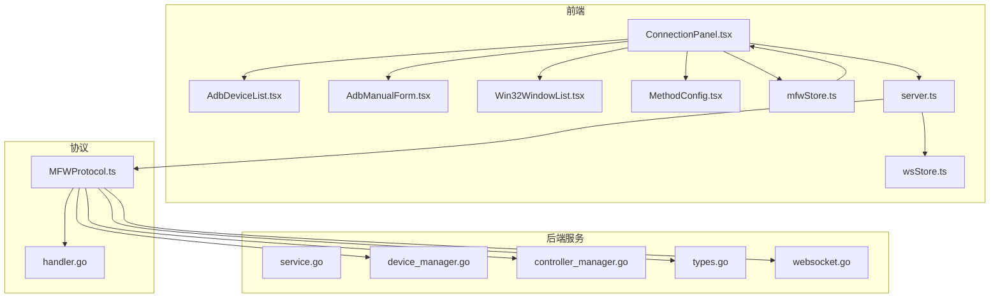
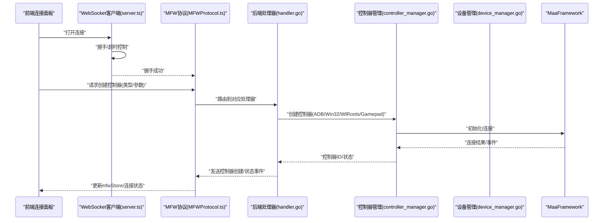
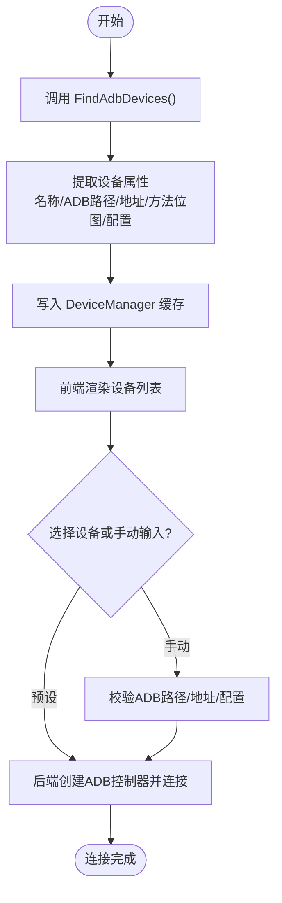
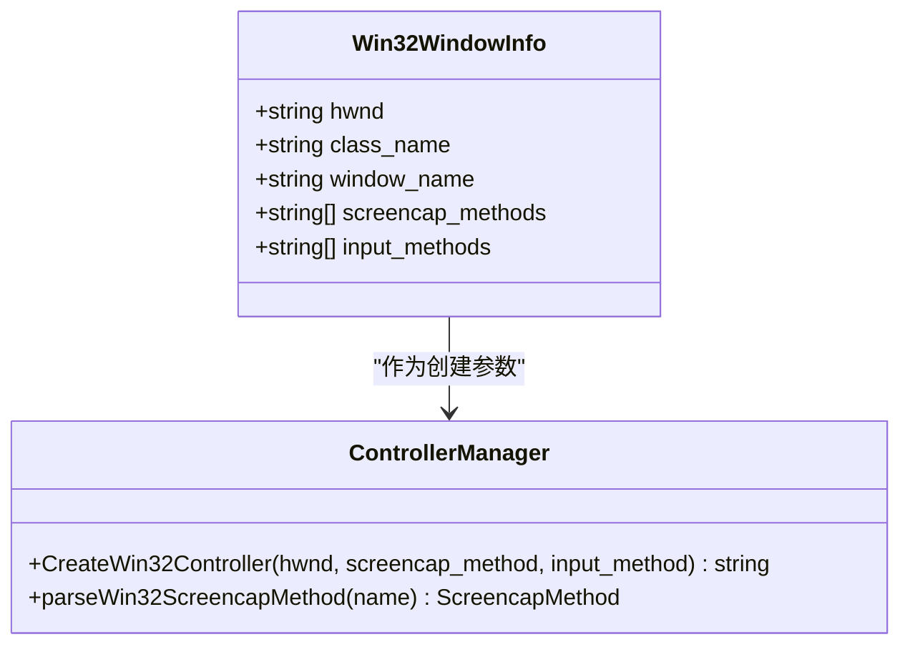
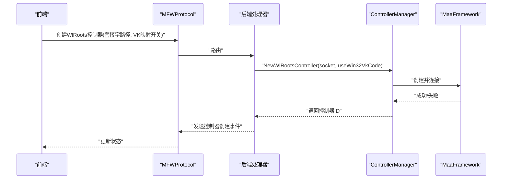
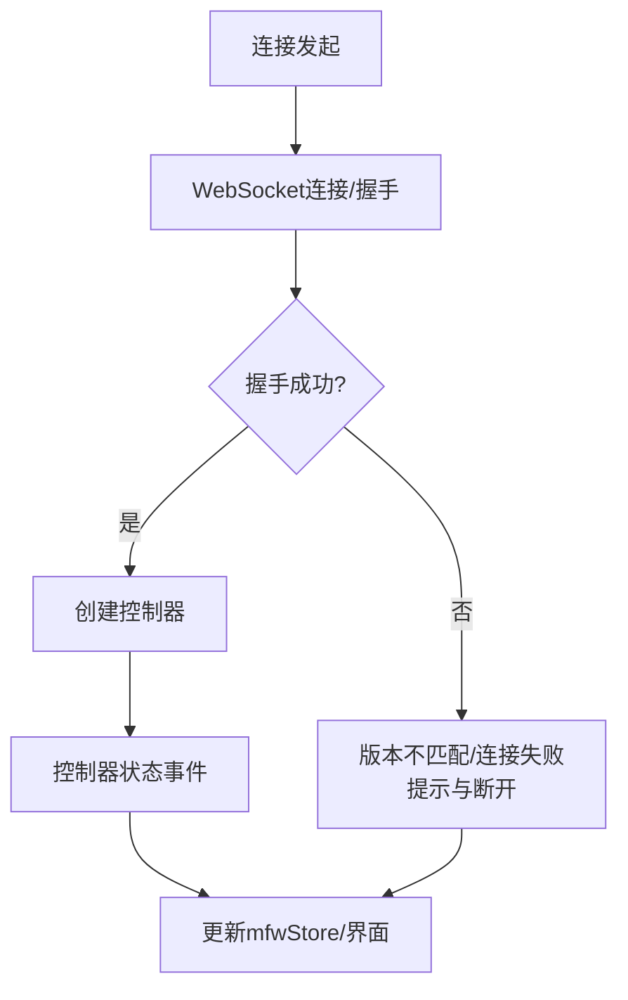
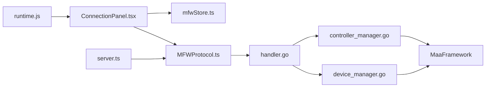

# 设备管理

<cite>
**本文引用的文件**
- [ConnectionPanel.tsx](file://src/components/panels/main/ConnectionPanel.tsx)
- [AdbDeviceList.tsx](file://src/components/panels/main/connection/AdbDeviceList.tsx)
- [AdbManualForm.tsx](file://src/components/panels/main/connection/AdbManualForm.tsx)
- [Win32WindowList.tsx](file://src/components/panels/main/connection/Win32WindowList.tsx)
- [MethodConfig.tsx](file://src/components/panels/main/connection/MethodConfig.tsx)
- [mfwStore.ts](file://src/stores/mfwStore.ts)
- [server.ts](file://src/services/server.ts)
- [wsStore.ts](file://src/stores/wsStore.ts)
- [MFWProtocol.ts](file://src/services/protocols/MFWProtocol.ts)
- [service.go](file://LocalBridge/internal/mfw/service.go)
- [device_manager.go](file://LocalBridge/internal/mfw/device_manager.go)
- [types.go](file://LocalBridge/internal/mfw/types.go)
- [controller_manager.go](file://LocalBridge/internal/mfw/controller_manager.go)
- [handler.go](file://LocalBridge/internal/protocol/mfw/handler.go)
- [websocket.go](file://LocalBridge/internal/server/websocket.go)
- [runtime.js](file://Extremer/frontend/wailsjs/runtime/runtime.js)
- [splash_windows.go](file://Extremer/internal/splash/splash_windows.go)
- [Device Discovery and Connection.md](file://dev/instructions/maafw-golang-binding/Device Discovery and Connection.md)
- [2.4-ControlMethods.md](file://dev/instructions/maafw-guide/2.4-ControlMethods.md)
- [2.2-IntegratedInterfaceOverview.md](file://dev/instructions/maafw-guide/2.2-IntegratedInterfaceOverview.md)
</cite>

## 目录
1. [简介](#简介)
2. [项目结构](#项目结构)
3. [核心组件](#核心组件)
4. [架构总览](#架构总览)
5. [详细组件分析](#详细组件分析)
6. [依赖分析](#依赖分析)
7. [性能考虑](#性能考虑)
8. [故障排除指南](#故障排除指南)
9. [结论](#结论)
10. [附录](#附录)

## 简介
本文件面向“设备管理”功能，系统化梳理多平台设备支持、ADB设备连接与自动发现、Win32窗口管理与进程控制、WlRoots Wayland支持与手柄输入、设备配置表单设计与验证、连接状态监控与错误处理、以及兼容性测试与故障排除方法。文档既覆盖前端UI交互与状态管理，也深入到后端Go服务层对MaaFramework的封装与桥接。

## 项目结构
设备管理功能横跨前端React组件、状态存储、协议通信与后端Go服务四层：
- 前端层：连接面板、设备列表、手动配置表单、方法配置、状态展示与错误提示
- 状态层：设备类型与连接状态、ADB/Win32/WlRoots设备列表、控制器信息
- 协议层：WebSocket消息路由、MFW协议处理控制器生命周期与状态
- 服务层：Go后端封装MaaFramework，负责设备发现、控制器创建与连接、事件分发

**图表来源**
- [ConnectionPanel.tsx:271-718](file://src/components/panels/main/ConnectionPanel.tsx#L271-L718)
- [AdbDeviceList.tsx:1-135](file://src/components/panels/main/connection/AdbDeviceList.tsx#L1-L135)
- [AdbManualForm.tsx:1-104](file://src/components/panels/main/connection/AdbManualForm.tsx#L1-L104)
- [Win32WindowList.tsx:1-85](file://src/components/panels/main/connection/Win32WindowList.tsx#L1-L85)
- [MethodConfig.tsx:53-111](file://src/components/panels/main/connection/MethodConfig.tsx#L53-L111)
- [mfwStore.ts:1-195](file://src/stores/mfwStore.ts#L1-L195)
- [server.ts:1-388](file://src/services/server.ts#L1-L388)
- [wsStore.ts:1-23](file://src/stores/wsStore.ts#L1-L23)
- [MFWProtocol.ts:190-234](file://src/services/protocols/MFWProtocol.ts#L190-L234)
- [handler.go:319-401](file://LocalBridge/internal/protocol/mfw/handler.go#L319-L401)
- [service.go:1-218](file://LocalBridge/internal/mfw/service.go#L1-L218)
- [device_manager.go:1-136](file://LocalBridge/internal/mfw/device_manager.go#L1-L136)
- [controller_manager.go:91-124](file://LocalBridge/internal/mfw/controller_manager.go#L91-L124)
- [types.go:1-129](file://LocalBridge/internal/mfw/types.go#L1-L129)
- [websocket.go:1-179](file://LocalBridge/internal/server/websocket.go#L1-L179)

**章节来源**
- [ConnectionPanel.tsx:271-718](file://src/components/panels/main/ConnectionPanel.tsx#L271-L718)
- [mfwStore.ts:1-195](file://src/stores/mfwStore.ts#L1-L195)
- [server.ts:1-388](file://src/services/server.ts#L1-L388)
- [MFWProtocol.ts:190-234](file://src/services/protocols/MFWProtocol.ts#L190-L234)
- [service.go:1-218](file://LocalBridge/internal/mfw/service.go#L1-L218)

## 核心组件
- 设备发现与列表
  - ADB设备：通过MaaFramework的FindAdbDevices扫描，返回设备名、ADB路径、地址、截图与输入方法位图、设备配置
  - Win32窗口：通过FindDesktopWindows扫描，返回窗口句柄、类名、标题、截图与输入方法列表
  - WlRoots合成器：基于桌面窗口扫描推导套接字路径
- 控制器创建与连接
  - 支持ADB、Win32、WlRoots、Gamepad等控制器类型；自动选择最优截图与输入方法
  - 支持自动连接与断开，事件回调用于状态同步
- 前端连接面板
  - 分Tab展示不同设备类型，支持手动输入ADB参数与方法选择
  - 展示连接状态卡片与错误提示
- 状态与协议
  - mfwStore集中管理连接状态、控制器类型与ID、设备信息、错误消息
  - MFWProtocol处理控制器创建/连接/状态事件，统一回传前端并更新状态

**章节来源**
- [device_manager.go:27-121](file://LocalBridge/internal/mfw/device_manager.go#L27-L121)
- [controller_manager.go:91-124](file://LocalBridge/internal/mfw/controller_manager.go#L91-L124)
- [controller_manager.go:214-259](file://LocalBridge/internal/mfw/controller_manager.go#L214-L259)
- [handler.go:319-401](file://LocalBridge/internal/protocol/mfw/handler.go#L319-L401)
- [mfwStore.ts:1-195](file://src/stores/mfwStore.ts#L1-L195)
- [ConnectionPanel.tsx:271-718](file://src/components/panels/main/ConnectionPanel.tsx#L271-L718)

## 架构总览
设备管理采用前后端分离的WebSocket协议，前端负责UI与状态，后端负责设备发现与控制器生命周期管理，并通过事件总线与协议路由进行解耦。

**图表来源**
- [server.ts:108-255](file://src/services/server.ts#L108-L255)
- [MFWProtocol.ts:190-234](file://src/services/protocols/MFWProtocol.ts#L190-L234)
- [handler.go:319-401](file://LocalBridge/internal/protocol/mfw/handler.go#L319-L401)
- [controller_manager.go:214-259](file://LocalBridge/internal/mfw/controller_manager.go#L214-L259)
- [device_manager.go:27-121](file://LocalBridge/internal/mfw/device_manager.go#L27-L121)

## 详细组件分析

### ADB设备连接与自动发现
- 自动发现流程
  - 调用MaaFramework的FindAdbDevices，遍历设备属性提取名称、ADB路径、地址、截图/输入方法位图、配置字符串
  - 将结果缓存至DeviceManager并暴露Refresh接口
- 前端展示与选择
  - AdbDeviceList列出设备，支持预设选择与手动清空
  - AdbManualForm允许手动输入ADB路径、设备地址、额外配置与设备名称
  - MethodConfig根据ADB设备或手动模式动态提供截图/输入方法列表
- 连接与配置
  - 选择设备后，前端构造控制器创建消息，后端通过ControllerManager创建ADB控制器并自动连接
  - 若存在设备配置字符串，可作为控制器初始化参数注入

**图表来源**
- [device_manager.go:27-61](file://LocalBridge/internal/mfw/device_manager.go#L27-L61)
- [AdbDeviceList.tsx:24-46](file://src/components/panels/main/connection/AdbDeviceList.tsx#L24-L46)
- [AdbManualForm.tsx:22-104](file://src/components/panels/main/connection/AdbManualForm.tsx#L22-L104)
- [MethodConfig.tsx:53-111](file://src/components/panels/main/connection/MethodConfig.tsx#L53-L111)
- [handler.go:319-349](file://LocalBridge/internal/protocol/mfw/handler.go#L319-L349)

**章节来源**
- [device_manager.go:27-61](file://LocalBridge/internal/mfw/device_manager.go#L27-L61)
- [AdbDeviceList.tsx:1-135](file://src/components/panels/main/connection/AdbDeviceList.tsx#L1-L135)
- [AdbManualForm.tsx:1-104](file://src/components/panels/main/connection/AdbManualForm.tsx#L1-L104)
- [MethodConfig.tsx:53-111](file://src/components/panels/main/connection/MethodConfig.tsx#L53-L111)
- [Device Discovery and Connection.md:23-135](file://dev/instructions/maafw-golang-binding/Device Discovery and Connection.md#L23-L135)

### Win32窗口管理与进程控制
- 设备发现
  - 通过FindDesktopWindows扫描桌面窗口，返回句柄、类名、标题及可用截图/输入方法列表
- 控制器创建
  - 支持多种输入方法（Seize、SendMessage、PostMessage、LegacyEvent等）与截图方法（GDI、FramePool、DXGI、PrintWindow、ScreenDC等）
  - 支持伪最小化变体以提升兼容性
- 权限与兼容性
  - 大多数Win32控制需管理员权限；前端提供权限提示与错误引导
- 前端交互
  - Win32WindowList展示窗口列表，点击选择后进入控制器创建流程

**图表来源**
- [types.go:17-24](file://LocalBridge/internal/mfw/types.go#L17-L24)
- [controller_manager.go:91-124](file://LocalBridge/internal/mfw/controller_manager.go#L91-L124)
- [controller_manager.go:107-124](file://LocalBridge/internal/mfw/controller_manager.go#L107-L124)
- [Win32WindowList.tsx:1-85](file://src/components/panels/main/connection/Win32WindowList.tsx#L1-L85)

**章节来源**
- [device_manager.go:63-96](file://LocalBridge/internal/mfw/device_manager.go#L63-L96)
- [controller_manager.go:91-124](file://LocalBridge/internal/mfw/controller_manager.go#L91-L124)
- [controller_manager.go:107-124](file://LocalBridge/internal/mfw/controller_manager.go#L107-L124)
- [2.4-ControlMethods.md:72-94](file://dev/instructions/maafw-guide/2.4-ControlMethods.md#L72-L94)
- [Win32WindowList.tsx:18-24](file://src/components/panels/main/connection/Win32WindowList.tsx#L18-L24)

### WlRoots Wayland支持与手柄输入处理
- WlRoots控制器
  - 通过套接字路径创建控制器，支持将Win32虚拟键码映射为evdev键码
  - 需要wlroots合成器支持virtual-keyboard、wlr-screencopy、wlr-virtual-pointer协议
- 手柄输入
  - Gamepad控制器支持Xbox 360与DualShock 4类型，依赖ViGEm驱动
  - 支持与Win32截图方法组合，用于手柄控制时的屏幕捕获

**图表来源**
- [handler.go:351-384](file://LocalBridge/internal/protocol/mfw/handler.go#L351-L384)
- [controller_manager.go:249-259](file://LocalBridge/internal/mfw/controller_manager.go#L249-L259)
- [2.2-IntegratedInterfaceOverview.md:302-316](file://dev/instructions/maafw-guide/2.2-IntegratedInterfaceOverview.md#L302-L316)
- [2.4-ControlMethods.md:260-279](file://dev/instructions/maafw-guide/2.4-ControlMethods.md#L260-L279)

**章节来源**
- [handler.go:351-384](file://LocalBridge/internal/protocol/mfw/handler.go#L351-L384)
- [controller_manager.go:249-259](file://LocalBridge/internal/mfw/controller_manager.go#L249-L259)
- [2.2-IntegratedInterfaceOverview.md:302-316](file://dev/instructions/maafw-guide/2.2-IntegratedInterfaceOverview.md#L302-L316)
- [2.4-ControlMethods.md:260-279](file://dev/instructions/maafw-guide/2.4-ControlMethods.md#L260-L279)

### 设备配置表单设计与验证机制
- ADB手动表单
  - 字段：设备名称（可选）、ADB路径、设备地址、额外配置（JSON字符串）
  - 前端提供占位符与图标，便于用户快速填写
- 方法配置
  - 根据当前激活Tab与设备类型动态生成截图/输入方法列表
  - PlayCover、Gamepad、WlRoots、macOS不显示方法配置
- 验证建议
  - ADB路径存在性与可执行性校验
  - 地址格式合法性（主机:端口或序列号）
  - 额外配置JSON有效性
  - Win32权限提示与管理员模式要求

**章节来源**
- [AdbManualForm.tsx:1-104](file://src/components/panels/main/connection/AdbManualForm.tsx#L1-L104)
- [MethodConfig.tsx:53-111](file://src/components/panels/main/connection/MethodConfig.tsx#L53-L111)
- [2.4-ControlMethods.md:72-94](file://dev/instructions/maafw-guide/2.4-ControlMethods.md#L72-L94)

### 设备连接状态监控与错误处理
- 前端状态
  - mfwStore集中维护连接状态、控制器类型与ID、设备信息、错误消息
  - 连接成功/失败分别设置状态与错误提示
- WebSocket连接
  - server.ts内置连接超时、握手版本校验、错误通知与断开处理
  - wsStore独立维护WebSocket连接状态
- 后端事件
  - MFWProtocol接收控制器状态事件，更新前端Store并反馈用户

**图表来源**
- [server.ts:108-255](file://src/services/server.ts#L108-L255)
- [MFWProtocol.ts:190-234](file://src/services/protocols/MFWProtocol.ts#L190-L234)
- [mfwStore.ts:143-194](file://src/stores/mfwStore.ts#L143-L194)

**章节来源**
- [mfwStore.ts:1-195](file://src/stores/mfwStore.ts#L1-L195)
- [server.ts:108-255](file://src/services/server.ts#L108-L255)
- [MFWProtocol.ts:190-234](file://src/services/protocols/MFWProtocol.ts#L190-L234)

## 依赖分析
- 组件内聚与耦合
  - 前端连接面板高度依赖mfwStore与MFWProtocol；后端通过handler与各管理器解耦
  - WebSocket客户端与协议层松耦合，便于扩展新路由
- 外部依赖
  - MaaFramework提供跨平台设备发现与控制器能力
  - Wails运行时提供窗口管理API（如窗口置顶、尺寸、主题等）

**图表来源**
- [ConnectionPanel.tsx:271-718](file://src/components/panels/main/ConnectionPanel.tsx#L271-L718)
- [mfwStore.ts:1-195](file://src/stores/mfwStore.ts#L1-L195)
- [MFWProtocol.ts:190-234](file://src/services/protocols/MFWProtocol.ts#L190-L234)
- [handler.go:319-401](file://LocalBridge/internal/protocol/mfw/handler.go#L319-L401)
- [controller_manager.go:214-259](file://LocalBridge/internal/mfw/controller_manager.go#L214-L259)
- [device_manager.go:27-121](file://LocalBridge/internal/mfw/device_manager.go#L27-L121)
- [runtime.js:59-186](file://Extremer/frontend/wailsjs/runtime/runtime.js#L59-L186)

**章节来源**
- [runtime.js:59-186](file://Extremer/frontend/wailsjs/runtime/runtime.js#L59-L186)

## 性能考虑
- 设备扫描频率控制：避免频繁刷新导致CPU占用，建议在用户显式点击“刷新”或首次进入页面时触发
- 控制器连接优化：优先选择兼容性高且性能好的截图/输入方法组合
- WebSocket长连接：保持连接复用，减少握手与重建成本
- 日志与截图：生产环境关闭冗余日志，必要时仅在错误时保存截图

## 故障排除指南
- ADB连接失败
  - 检查ADB路径与设备地址是否正确
  - 确认设备已授权、USB调试开启
  - 尝试更换截图/输入方法（如从Minicap切换到Encode）
- Win32控制无响应
  - 以管理员身份启动应用
  - 更换输入方法（如从Seize改为SendMessage）
  - 检查目标窗口是否被UAC遮挡或处于不可交互状态
- WlRoots无法控制
  - 确认合成器支持所需协议
  - 使用嵌套会话而非桌面会话
  - 如启用Win32 VK映射，确保键码转换逻辑一致
- Gamepad手柄未识别
  - 安装ViGEm驱动并重启系统
  - 选择正确的手柄类型（Xbox 360/DualShock 4）
- WebSocket连接问题
  - 检查本地服务端口占用与防火墙
  - 查看协议版本是否匹配
  - 观察连接超时与错误通知

**章节来源**
- [Win32WindowList.tsx:18-24](file://src/components/panels/main/connection/Win32WindowList.tsx#L18-L24)
- [2.4-ControlMethods.md:260-279](file://dev/instructions/maafw-guide/2.4-ControlMethods.md#L260-L279)
- [2.2-IntegratedInterfaceOverview.md:317-320](file://dev/instructions/maafw-guide/2.2-IntegratedInterfaceOverview.md#L317-L320)
- [server.ts:131-163](file://src/services/server.ts#L131-L163)

## 结论
该设备管理功能通过清晰的前后端分层与协议路由，实现了多平台设备的自动发现、灵活配置与稳定连接。ADB、Win32、WlRoots与Gamepad等控制器类型均得到良好支持，配合完善的错误处理与状态监控，能够满足复杂自动化场景下的设备接入需求。

## 附录
- 开发与调试
  - 使用MFW提供的测试控制器（CarouselImageController、BlankController）进行无设备依赖的逻辑验证
- 文档与参考
  - 设备发现与连接说明、控制方法与协议要求详见指引文档

**章节来源**
- [Device Discovery and Connection.md:23-135](file://dev/instructions/maafw-golang-binding/Device Discovery and Connection.md#L23-L135)
- [Testing Utilities.md:51-60](file://dev/instructions/maafw-golang-binding/Testing Utilities.md#L51-L60)