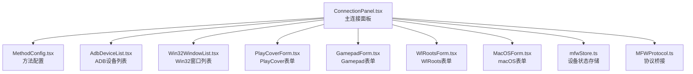
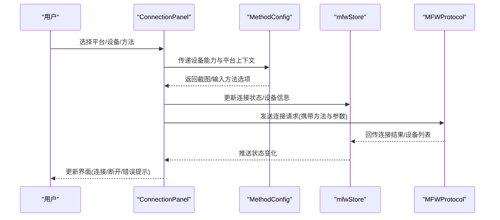
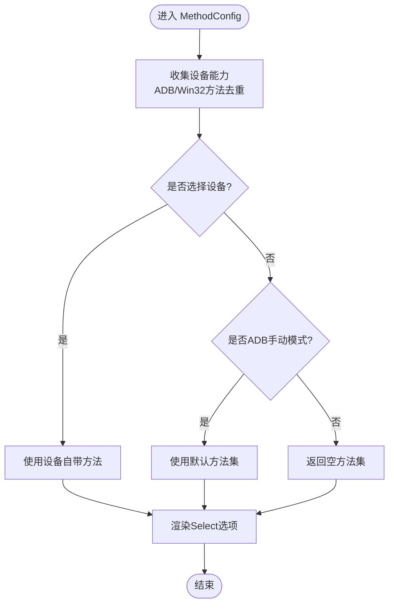
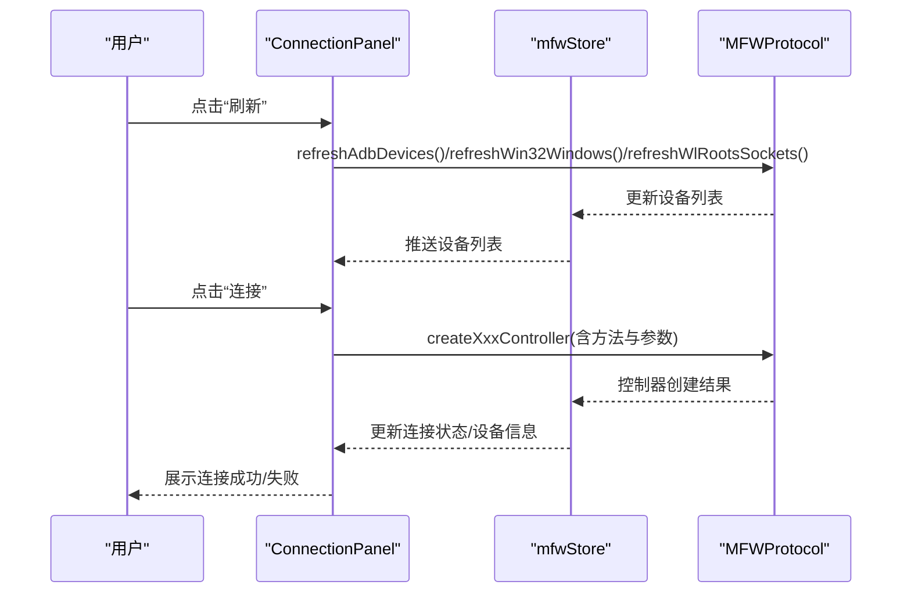
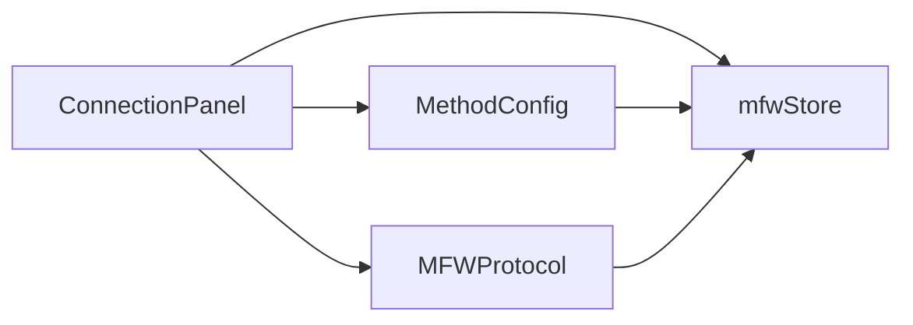

# 设备连接表单

<cite>
**本文引用的文件**   
- [ConnectionPanel.tsx](file://src/components/panels/main/ConnectionPanel.tsx)
- [MethodConfig.tsx](file://src/components/panels/main/connection/MethodConfig.tsx)
- [mfwStore.ts](file://src/stores/mfwStore.ts)
- [MFWProtocol.ts](file://src/services/protocols/MFWProtocol.ts)
- [AdbDeviceList.tsx](file://src/components/panels/main/connection/AdbDeviceList.tsx)
- [Win32WindowList.tsx](file://src/components/panels/main/connection/Win32WindowList.tsx)
- [PlayCoverForm.tsx](file://src/components/panels/main/connection/PlayCoverForm.tsx)
- [GamepadForm.tsx](file://src/components/panels/main/connection/GamepadForm.tsx)
- [WlRootsForm.tsx](file://src/components/panels/main/connection/WlRootsForm.tsx)
- [MacOSForm.tsx](file://src/components/panels/main/connection/MacOSForm.tsx)
- [form-names.zh-CN.md](file://dev/instructions/ant-design/blog/form-names.zh-CN.md)
</cite>

## 目录
1. [引言](#引言)
2. [项目结构](#项目结构)
3. [核心组件](#核心组件)
4. [架构总览](#架构总览)
5. [组件详解](#组件详解)
6. [依赖关系分析](#依赖关系分析)
7. [性能考量](#性能考量)
8. [故障排查指南](#故障排查指南)
9. [结论](#结论)
10. [附录](#附录)

## 引言
本文件面向设备连接表单系统，围绕“连接配置抽屉”展开，系统性说明其设计模式、组件架构、配置管理与动态表单生成机制、表单验证与状态管理、设备连接参数配置要点（含截图方法与输入方法）、组件复用与扩展策略，以及表单与设备管理器之间的交互与数据流转。

## 项目结构
设备连接表单位于主面板右侧抽屉中，采用“主面板 + 方法配置 + 平台专用表单”的分层组织方式：
- 主面板：负责连接状态、设备列表刷新、连接/断开控制、平台标签页切换与参数持久化
- 方法配置：根据所选平台与设备动态生成截图/输入方法的选择项
- 平台专用表单：按平台提供具体参数输入（ADB、Win32、PlayCover、Gamepad、WlRoots、macOS）

图表来源
- [ConnectionPanel.tsx:1-954](file://src/components/panels/main/ConnectionPanel.tsx#L1-L954)
- [MethodConfig.tsx:1-189](file://src/components/panels/main/connection/MethodConfig.tsx#L1-L189)
- [mfwStore.ts:1-195](file://src/stores/mfwStore.ts#L1-L195)
- [MFWProtocol.ts:140-234](file://src/services/protocols/MFWProtocol.ts#L140-L234)

章节来源
- [ConnectionPanel.tsx:1-954](file://src/components/panels/main/ConnectionPanel.tsx#L1-L954)
- [MethodConfig.tsx:1-189](file://src/components/panels/main/connection/MethodConfig.tsx#L1-L189)
- [mfwStore.ts:1-195](file://src/stores/mfwStore.ts#L1-L195)
- [MFWProtocol.ts:140-234](file://src/services/protocols/MFWProtocol.ts#L140-L234)

## 核心组件
- 主连接面板（ConnectionPanel）：集中管理连接状态、设备列表、平台切换、参数持久化、连接/断开逻辑与方法配置联动
- 方法配置（MethodConfig）：基于设备能力与平台特性动态生成截图/输入方法选项，并支持ADB多选
- 平台专用表单：按平台封装参数输入，如ADB手动模式、Win32窗口选择、PlayCover地址与UUID、Gamepad类型与句柄、WlRoots套接字路径、macOS PID与方法
- 状态存储（mfwStore）：统一维护连接状态、控制器类型/ID、设备信息、设备列表与错误消息
- 协议桥接（MFWProtocol）：负责与后端设备管理器通信，下发连接指令、接收设备列表与连接结果

章节来源
- [ConnectionPanel.tsx:1-954](file://src/components/panels/main/ConnectionPanel.tsx#L1-L954)
- [MethodConfig.tsx:1-189](file://src/components/panels/main/connection/MethodConfig.tsx#L1-L189)
- [mfwStore.ts:1-195](file://src/stores/mfwStore.ts#L1-L195)
- [MFWProtocol.ts:140-234](file://src/services/protocols/MFWProtocol.ts#L140-L234)

## 架构总览
设备连接表单采用“视图-状态-协议”三层架构：
- 视图层：ConnectionPanel与各平台表单组件，负责渲染与用户交互
- 状态层：mfwStore，集中管理连接状态、设备信息与设备列表
- 协议层：MFWProtocol，封装与后端的通信协议，负责刷新设备列表与创建控制器

图表来源
- [ConnectionPanel.tsx:358-511](file://src/components/panels/main/ConnectionPanel.tsx#L358-L511)
- [MethodConfig.tsx:33-101](file://src/components/panels/main/connection/MethodConfig.tsx#L33-L101)
- [mfwStore.ts:100-194](file://src/stores/mfwStore.ts#L100-L194)
- [MFWProtocol.ts:140-234](file://src/services/protocols/MFWProtocol.ts#L140-L234)

## 组件详解

### MethodConfig 组件：配置管理与动态表单生成
- 动态方法收集：遍历ADB/Win32设备的能力列表，汇总所有可用截图与输入方法，形成全局候选集
- 设备方法选择：根据当前平台与设备选择，优先使用设备自带方法；若无设备或为空，则回退到默认方法集
- ADB多选支持：当处于ADB模式且非手动模式时，截图/输入方法支持多选；手动模式下提供默认候选集
- 平台过滤：PlayCover、Gamepad、WlRoots、macOS不显示方法配置区域，避免无效交互

图表来源
- [MethodConfig.tsx:33-101](file://src/components/panels/main/connection/MethodConfig.tsx#L33-L101)

章节来源
- [MethodConfig.tsx:1-189](file://src/components/panels/main/connection/MethodConfig.tsx#L1-L189)

### ConnectionPanel：连接生命周期与状态管理
- 平台检测与标签页：根据当前宿主平台动态启用可用标签页
- 设备列表刷新：按平台调用协议刷新ADB/Win32/WlRoots列表
- 参数持久化：使用持久化状态保存ADB路径/地址/配置、PlayCover地址/UUID、Gamepad类型/句柄/截图方法、WlRoots按键映射开关、macOS PID/方法等
- 连接/断开：根据平台与参数组装控制器创建请求；断开时先断开再延迟连接新设备
- 状态徽章：根据连接状态渲染不同颜色与文案

图表来源
- [ConnectionPanel.tsx:344-511](file://src/components/panels/main/ConnectionPanel.tsx#L344-L511)
- [mfwStore.ts:100-194](file://src/stores/mfwStore.ts#L100-L194)
- [MFWProtocol.ts:140-234](file://src/services/protocols/MFWProtocol.ts#L140-L234)

章节来源
- [ConnectionPanel.tsx:1-954](file://src/components/panels/main/ConnectionPanel.tsx#L1-L954)

### 平台专用表单：参数与验证
- ADB设备列表与手动模式：支持从列表选择或手动填写ADB路径与设备地址；手动模式下过滤不兼容方法
- Win32窗口：单选截图/输入方法，默认优先选择常用方法
- PlayCover：要求地址与UUID，提供可选名称
- Gamepad：可选窗口句柄、手柄类型、截图方法
- WlRoots：要求套接字路径或从列表选择，支持按键码映射开关
- macOS：要求PID与截图/输入方法

章节来源
- [ConnectionPanel.tsx:88-177](file://src/components/panels/main/ConnectionPanel.tsx#L88-L177)
- [ConnectionPanel.tsx:412-485](file://src/components/panels/main/ConnectionPanel.tsx#L412-L485)

### 表单验证与数据绑定
- 数据绑定：通过受控组件与状态钩子实现双向绑定，参数变更即时更新内部状态
- 验证规则：
  - 设备选择：ADB/Win32需选中有效设备；PlayCover需地址与UUID；macOS需PID
  - 方法选择：ADB可多选但至少一项；Win32单选且均存在
  - 连接前置条件：仅当满足“已选设备+有效方法+非连接中”才允许连接
- 聚合字段与转换：参考“封装 Form.Item 实现数组转对象”的思路，可在需要时将多个字段聚合为数组或对象，配合 getValueProps/getValueFromEvent/transform 完成值的读取与校验

章节来源
- [ConnectionPanel.tsx:547-595](file://src/components/panels/main/ConnectionPanel.tsx#L547-L595)
- [form-names.zh-CN.md:44-182](file://dev/instructions/ant-design/blog/form-names.zh-CN.md#L44-L182)

### 组件复用与扩展
- 复用模式：
  - MethodConfig 作为通用方法选择器，通过 props 注入平台与设备上下文即可复用
  - 平台表单组件按平台拆分，便于独立维护与扩展
- 扩展方法：
  - 新增平台时，在主面板标签页与参数持久化处新增对应字段
  - 在协议层新增对应创建控制器的请求与回调处理
  - 在状态层补充相应设备类型与默认方法集

章节来源
- [ConnectionPanel.tsx:790-800](file://src/components/panels/main/ConnectionPanel.tsx#L790-L800)
- [MFWProtocol.ts:140-234](file://src/services/protocols/MFWProtocol.ts#L140-L234)

## 依赖关系分析
- 组件耦合：
  - ConnectionPanel 依赖 mfwStore 与 MFWProtocol，承担协调者角色
  - MethodConfig 依赖设备能力与平台上下文，保持纯展示逻辑
- 外部依赖：
  - Ant Design Select 组件用于方法选择
  - Zustand 状态管理用于跨组件共享设备状态

图表来源
- [ConnectionPanel.tsx:1-954](file://src/components/panels/main/ConnectionPanel.tsx#L1-L954)
- [MethodConfig.tsx:1-189](file://src/components/panels/main/connection/MethodConfig.tsx#L1-L189)
- [mfwStore.ts:1-195](file://src/stores/mfwStore.ts#L1-L195)
- [MFWProtocol.ts:140-234](file://src/services/protocols/MFWProtocol.ts#L140-L234)

章节来源
- [ConnectionPanel.tsx:1-954](file://src/components/panels/main/ConnectionPanel.tsx#L1-L954)
- [MethodConfig.tsx:1-189](file://src/components/panels/main/connection/MethodConfig.tsx#L1-L189)
- [mfwStore.ts:1-195](file://src/stores/mfwStore.ts#L1-L195)
- [MFWProtocol.ts:140-234](file://src/services/protocols/MFWProtocol.ts#L140-L234)

## 性能考量
- 渲染优化：MethodConfig 使用 useMemo 缓存方法集合与设备方法，减少不必要的重渲染
- 状态粒度：mfwStore 将连接状态、设备列表与错误信息分离，降低无关状态变更带来的重渲染
- 异步刷新：设备列表刷新采用延时与加载状态，避免频繁刷新导致的抖动
- 连接串行：断开旧连接后延迟连接新设备，确保状态一致

章节来源
- [MethodConfig.tsx:33-51](file://src/components/panels/main/connection/MethodConfig.tsx#L33-L51)
- [ConnectionPanel.tsx:344-355](file://src/components/panels/main/ConnectionPanel.tsx#L344-L355)
- [ConnectionPanel.tsx:634-645](file://src/components/panels/main/ConnectionPanel.tsx#L634-L645)

## 故障排查指南
- 连接失败：
  - 检查设备是否被正确识别（ADB/Win32/WlRoots列表）
  - 确认方法选择是否有效（ADB至少一项；Win32截图与输入均存在）
  - 查看错误提示与日志输出
- 设备列表为空：
  - 点击“刷新”重新拉取设备列表
  - 确认平台权限与驱动安装情况
- 方法不可用：
  - ADB手动模式下过滤不兼容方法，建议使用默认候选集
  - macOS/Win32优先选择常用方法（如FramePool、SendMessageWithCursorPos）

章节来源
- [ConnectionPanel.tsx:547-595](file://src/components/panels/main/ConnectionPanel.tsx#L547-L595)
- [MFWProtocol.ts:186-224](file://src/services/protocols/MFWProtocol.ts#L186-L224)

## 结论
设备连接表单通过“主面板 + 方法配置 + 平台专用表单”的分层设计，实现了跨平台、可扩展的设备连接体验。MethodConfig 的动态方法生成与 ConnectionPanel 的状态/协议协调，保证了在不同平台与设备下的灵活性与一致性。结合持久化参数与严格的验证规则，系统在易用性与可靠性之间取得良好平衡。

## 附录

### 设备连接参数配置指导
- ADB
  - 列表模式：从设备列表选择设备，自动填充可用方法
  - 手动模式：填写ADB路径与设备地址，系统提供默认方法候选集（自动过滤不兼容方法）
- Win32
  - 从窗口列表选择目标窗口，自动选择常用截图与输入方法
- PlayCover
  - 填写iOS设备地址与UUID，可选设备名称
- Gamepad
  - 选择手柄类型，可选窗口句柄与截图方法
- WlRoots
  - 选择或输入套接字路径，可选按键码映射开关
- macOS
  - 填写应用PID，选择截图与输入方法

章节来源
- [ConnectionPanel.tsx:88-177](file://src/components/panels/main/ConnectionPanel.tsx#L88-L177)
- [ConnectionPanel.tsx:412-485](file://src/components/panels/main/ConnectionPanel.tsx#L412-L485)