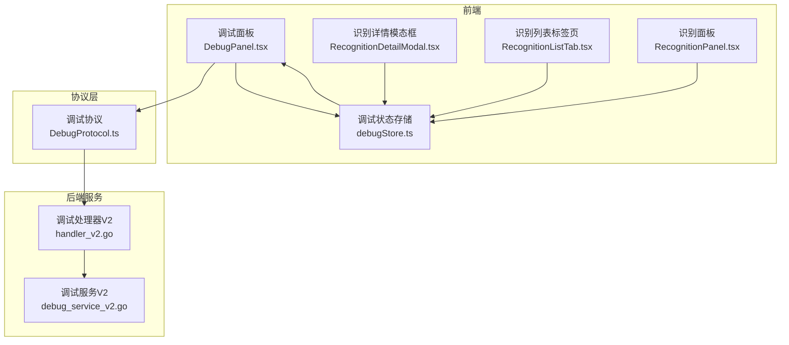
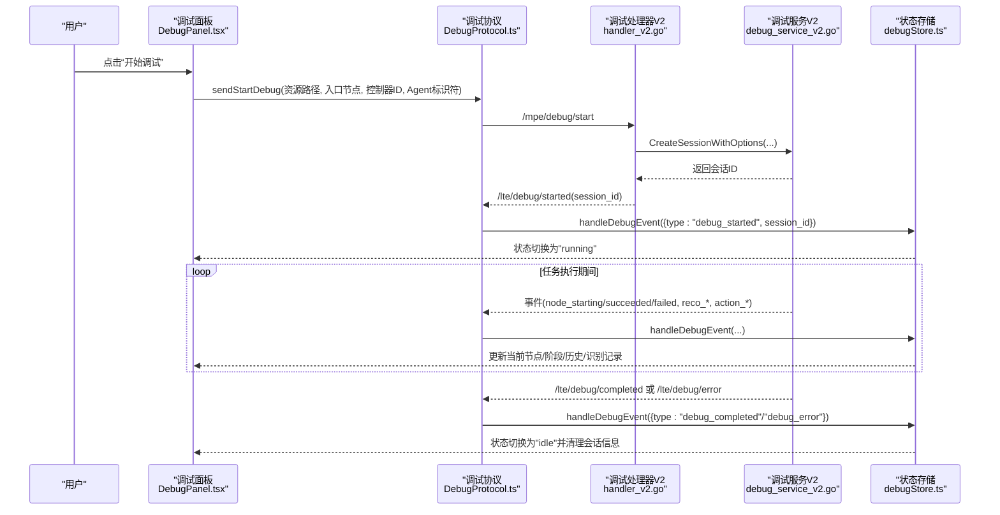
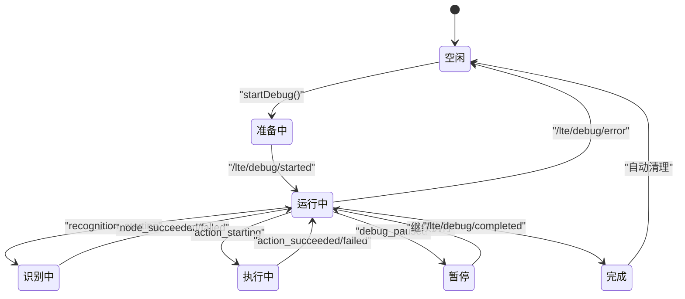
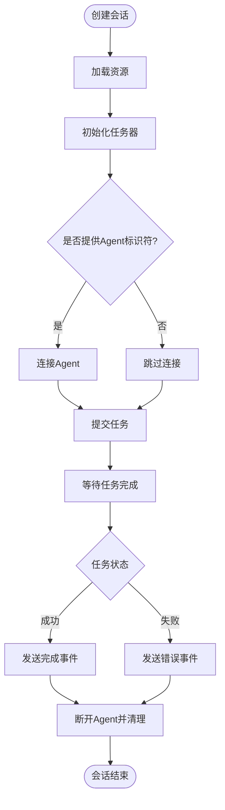
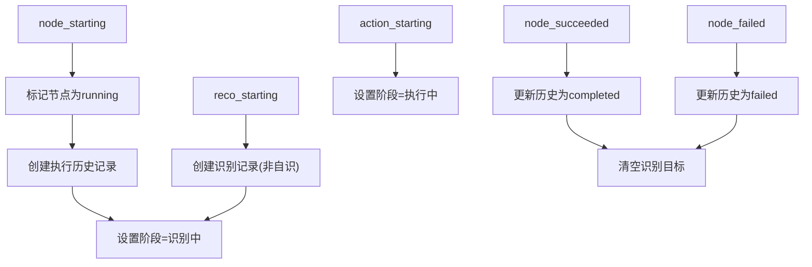
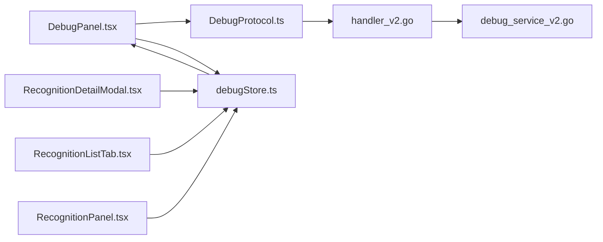

# 实时调试

<cite>
**本文引用的文件**
- [DebugPanel.tsx](file://src/components/panels/tools/DebugPanel.tsx)
- [debugStore.ts](file://src/stores/debugStore.ts)
- [DebugProtocol.ts](file://src/services/protocols/DebugProtocol.ts)
- [handler_v2.go](file://LocalBridge/internal/protocol/debug/handler_v2.go)
- [debug_service_v2.go](file://LocalBridge/internal/mfw/debug_service_v2.go)
- [RecognitionDetailModal.tsx](file://src/components/panels/tools/RecognitionDetailModal.tsx)
- [RecognitionListTab.tsx](file://src/components/panels/tools/RecognitionListTab.tsx)
- [RecognitionPanel.tsx](file://src/components/panels/main/RecognitionPanel.tsx)
- [nodeContextMenu.tsx](file://src/components/flow/nodeContextMenu.tsx)
</cite>

## 目录
1. [简介](#简介)
2. [项目结构](#项目结构)
3. [核心组件](#核心组件)
4. [架构总览](#架构总览)
5. [详细组件分析](#详细组件分析)
6. [依赖关系分析](#依赖关系分析)
7. [性能考量](#性能考量)
8. [故障排查指南](#故障排查指南)
9. [结论](#结论)
10. [附录](#附录)

## 简介
本文件面向 MaaPipelineEditor 的“实时调试”能力，系统性阐述调试状态管理、会话生命周期、节点执行监控、调试配置、调试按钮功能、错误处理与状态回滚，以及实际使用示例与最佳实践。目标读者既包括一线开发者，也包括需要高效定位流程问题的业务用户。

## 项目结构
实时调试涉及前端 UI、状态存储、协议层与后端服务四部分协同：
- 前端工具栏与面板：负责配置输入、按钮交互、状态展示与识别记录查看
- 状态存储：集中管理调试状态、会话信息、执行历史与识别记录
- 协议层：封装 WebSocket 事件路由与消息编排
- 后端服务：会话创建、任务运行、事件回调与资源管理

图表来源
- [DebugPanel.tsx:1-493](file://src/components/panels/tools/DebugPanel.tsx#L1-L493)
- [debugStore.ts:1-200](file://src/stores/debugStore.ts#L1-L200)
- [DebugProtocol.ts:1-200](file://src/services/protocols/DebugProtocol.ts#L1-L200)
- [handler_v2.go:82-117](file://LocalBridge/internal/protocol/debug/handler_v2.go#L82-L117)
- [debug_service_v2.go:61-171](file://LocalBridge/internal/mfw/debug_service_v2.go#L61-L171)

章节来源
- [DebugPanel.tsx:1-493](file://src/components/panels/tools/DebugPanel.tsx#L1-L493)
- [debugStore.ts:1-200](file://src/stores/debugStore.ts#L1-L200)
- [DebugProtocol.ts:1-200](file://src/services/protocols/DebugProtocol.ts#L1-L200)
- [handler_v2.go:82-117](file://LocalBridge/internal/protocol/debug/handler_v2.go#L82-L117)
- [debug_service_v2.go:61-171](file://LocalBridge/internal/mfw/debug_service_v2.go#L61-L171)

## 核心组件
- 调试面板与按钮：提供“开始调试/停止调试/打开日志/显示识别记录”等交互入口，动态展示状态与耗时
- 调试状态存储：统一维护调试状态机、会话ID、当前节点、执行阶段、执行历史、识别记录与详情缓存
- 调试协议：负责 WebSocket 路由注册、事件分发与跨层状态同步
- 调试服务V2：负责会话创建、任务运行、事件回调转发与资源清理

章节来源
- [DebugPanel.tsx:272-377](file://src/components/panels/tools/DebugPanel.tsx#L272-L377)
- [debugStore.ts:227-400](file://src/stores/debugStore.ts#L227-L400)
- [DebugProtocol.ts:136-232](file://src/services/protocols/DebugProtocol.ts#L136-L232)
- [debug_service_v2.go:61-171](file://LocalBridge/internal/mfw/debug_service_v2.go#L61-L171)

## 架构总览
实时调试采用“前端驱动 + 协议桥接 + 后端服务”的分层设计。前端通过调试协议向后端发起“创建会话/启动调试/停止调试”，后端服务在本地 MaaFW 上运行任务并以事件形式回传，前端协议层解析事件并写入状态存储，UI 实时刷新。

图表来源
- [DebugPanel.tsx:289-332](file://src/components/panels/tools/DebugPanel.tsx#L289-L332)
- [DebugProtocol.ts:536-572](file://src/services/protocols/DebugProtocol.ts#L536-L572)
- [handler_v2.go:240-282](file://LocalBridge/internal/protocol/debug/handler_v2.go#L240-L282)
- [debug_service_v2.go:220-277](file://LocalBridge/internal/mfw/debug_service_v2.go#L220-L277)
- [debugStore.ts:735-786](file://src/stores/debugStore.ts#L735-L786)

## 详细组件分析

### 调试状态管理机制
- 状态枚举与转换
  - 空闲(idle)：初始态，可创建会话
  - 准备中(preparing)：前端准备阶段，校验资源路径、控制器、入口节点等
  - 运行中(running)：任务执行中，显示“识别中/执行中/运行中”与耗时
  - 暂停(paused)：调试被暂停，保留最后节点信息
  - 完成(completed)：任务自然结束，自动回滚至空闲
- 转换触发点
  - 开始调试：前端校验通过后进入 preparing，后端返回 started 后进入 running
  - 识别事件：进入 recognition 阶段；动作事件：进入 action 阶段
  - 暂停事件：进入 paused 并清空识别目标
  - 完成/错误事件：进入 completed/idle 并清理会话信息

图表来源
- [debugStore.ts:225-31](file://src/stores/debugStore.ts#L225-L31)
- [DebugProtocol.ts:136-232](file://src/services/protocols/DebugProtocol.ts#L136-L232)
- [debugStore.ts:724-786](file://src/stores/debugStore.ts#L724-L786)

章节来源
- [debugStore.ts:225-31](file://src/stores/debugStore.ts#L225-L31)
- [DebugProtocol.ts:136-232](file://src/services/protocols/DebugProtocol.ts#L136-L232)
- [debugStore.ts:724-786](file://src/stores/debugStore.ts#L724-L786)

### 调试会话管理
- 会话创建
  - 输入：资源路径数组、控制器ID、Agent标识符、事件回调
  - 生成：唯一会话ID（含纳秒时间戳），注册事件上下文，加载资源并初始化任务器
  - 连接：按需连接 Agent
- 任务运行
  - 校验入口节点是否存在
  - 提交任务并异步等待完成，期间持续转发事件
- 停止与销毁
  - 停止：发送停止指令，断开 Agent，状态回到空闲
  - 销毁：移除会话并释放适配器资源

图表来源
- [debug_service_v2.go:88-171](file://LocalBridge/internal/mfw/debug_service_v2.go#L88-L171)
- [debug_service_v2.go:220-277](file://LocalBridge/internal/mfw/debug_service_v2.go#L220-L277)
- [debug_service_v2.go:280-299](file://LocalBridge/internal/mfw/debug_service_v2.go#L280-L299)
- [debug_service_v2.go:440-472](file://LocalBridge/internal/mfw/debug_service_v2.go#L440-L472)

章节来源
- [debug_service_v2.go:88-171](file://LocalBridge/internal/mfw/debug_service_v2.go#L88-L171)
- [debug_service_v2.go:220-277](file://LocalBridge/internal/mfw/debug_service_v2.go#L220-L277)
- [debug_service_v2.go:280-299](file://LocalBridge/internal/mfw/debug_service_v2.go#L280-L299)
- [debug_service_v2.go:440-472](file://LocalBridge/internal/mfw/debug_service_v2.go#L440-L472)

### 节点执行监控
- 当前节点与阶段
  - 通过事件更新当前节点与执行阶段（识别/动作/null）
  - 识别阶段显示目标节点名称，动作阶段清空识别目标
- 执行历史
  - 记录每个节点的运行次数、起止时间、延迟与最终状态
  - 超限时进行分批清理，避免内存膨胀
- 识别记录
  - 识别开始：创建记录并关联父节点（非自识则记录）
  - 识别成功/失败：更新状态、命中与否、缓存识别详情
  - 支持分页与详情模态框查看

图表来源
- [debugStore.ts:449-534](file://src/stores/debugStore.ts#L449-L534)
- [debugStore.ts:550-685](file://src/stores/debugStore.ts#L550-L685)
- [debugStore.ts:687-722](file://src/stores/debugStore.ts#L687-L722)

章节来源
- [debugStore.ts:449-534](file://src/stores/debugStore.ts#L449-L534)
- [debugStore.ts:550-685](file://src/stores/debugStore.ts#L550-L685)
- [debugStore.ts:687-722](file://src/stores/debugStore.ts#L687-L722)

### 调试配置系统
- 资源路径配置
  - 支持多路径（后覆盖前），启动前过滤空路径
  - 首次连接后自动拉取后端配置填充默认资源根目录
- Agent 标识符
  - 可选，用于连接远端 Agent；未提供则不连接
- 入口节点选择
  - 下拉选择，支持搜索；启动时转换为完整节点名再下发
- 调试设置
  - 调试前保存所有文件（可选）

章节来源
- [DebugPanel.tsx:178-270](file://src/components/panels/tools/DebugPanel.tsx#L178-L270)
- [DebugPanel.tsx:272-377](file://src/components/panels/tools/DebugPanel.tsx#L272-L377)
- [DebugProtocol.ts:88-120](file://src/services/protocols/DebugProtocol.ts#L88-L120)

### 调试按钮功能
- 开始调试
  - 校验资源路径、入口节点、控制器ID
  - 触发 startDebug() 进入准备态，随后下发启动请求
  - 若失败，调用 stopDebug() 回滚状态
- 停止调试
  - 发送停止请求并调用 stopDebug()，提示“调试已停止”
- 打开日志
  - 请求后端打开 maa.log
- 显示/隐藏识别记录
  - 切换识别面板可见性

章节来源
- [DebugPanel.tsx:289-351](file://src/components/panels/tools/DebugPanel.tsx#L289-L351)
- [DebugPanel.tsx:352-377](file://src/components/panels/tools/DebugPanel.tsx#L352-L377)

### 单节点测试与上下文菜单
- 单节点测试
  - 仅运行当前节点，禁用 next 与 on_error，便于快速验证节点行为
- 识别测试
  - 仅识别一次，禁用动作，超时设为0
- 上下文菜单集成
  - 在节点右键菜单中提供“测试此节点/测试识别”入口，自动构造 override 并发起调试

章节来源
- [nodeContextMenu.tsx:244-275](file://src/components/flow/nodeContextMenu.tsx#L244-L275)

### 错误处理与状态回滚
- 事件级校验
  - 会话ID不匹配时忽略事件
  - 暂停态忽略事件
- 协议层错误
  - 解析错误时记录日志并忽略无效事件
  - 资源加载失败等特定错误进行提示
- 存储层回滚
  - 完成/错误事件后自动将 running 历史标记为 completed/failed，并重置会话相关字段
  - WebSocket 断开时自动 stopDebug()

章节来源
- [DebugProtocol.ts:136-232](file://src/services/protocols/DebugProtocol.ts#L136-L232)
- [DebugProtocol.ts:444-471](file://src/services/protocols/DebugProtocol.ts#L444-L471)
- [debugStore.ts:735-786](file://src/stores/debugStore.ts#L735-L786)

## 依赖关系分析
- 前端依赖
  - 调试面板依赖调试协议与状态存储
  - 识别详情依赖状态存储中的识别记录与详情缓存
- 协议层依赖
  - 调试协议依赖 WebSocket 客户端与后端路由
- 后端依赖
  - 调试处理器依赖调试服务V2
  - 调试服务V2 依赖 MaaFW 适配器与设备管理器

图表来源
- [DebugPanel.tsx:1-493](file://src/components/panels/tools/DebugPanel.tsx#L1-L493)
- [DebugProtocol.ts:1-200](file://src/services/protocols/DebugProtocol.ts#L1-L200)
- [handler_v2.go:82-117](file://LocalBridge/internal/protocol/debug/handler_v2.go#L82-L117)
- [debug_service_v2.go:61-171](file://LocalBridge/internal/mfw/debug_service_v2.go#L61-L171)
- [debugStore.ts:1-200](file://src/stores/debugStore.ts#L1-L200)
- [RecognitionDetailModal.tsx:1-200](file://src/components/panels/tools/RecognitionDetailModal.tsx#L1-L200)
- [RecognitionListTab.tsx:261-290](file://src/components/panels/tools/RecognitionListTab.tsx#L261-L290)
- [RecognitionPanel.tsx:304-330](file://src/components/panels/main/RecognitionPanel.tsx#L304-L330)

## 性能考量
- 内存限制与清理
  - 执行历史与识别记录均设置上限，超过阈值按比例批量清理
  - 识别详情缓存按条目上限控制，避免大图 Base64 占用过多内存
- 事件处理
  - 事件解析与状态更新在单线程存储中进行，避免并发冲突
  - 识别详情按需缓存，减少重复请求
- UI 渲染
  - 识别列表与详情模态框支持分页与懒加载，降低渲染压力

章节来源
- [debugStore.ts:10-21](file://src/stores/debugStore.ts#L10-L21)
- [debugStore.ts:576-595](file://src/stores/debugStore.ts#L576-L595)
- [RecognitionDetailModal.tsx:1-200](file://src/components/panels/tools/RecognitionDetailModal.tsx#L1-L200)

## 故障排查指南
- 启动失败
  - 检查资源路径是否为空或无效
  - 确认控制器已连接
  - 查看后端日志与“打开日志”按钮反馈
- 事件不生效
  - 确认会话ID一致，暂停态不会接收事件
  - 检查节点名称是否正确（含前缀）
- 识别记录缺失
  - 自我识别（节点自身识别目标）不会记录到卡片中
  - 确认识别事件已到达且未被清理
- 详情为空
  - 详情为懒加载，确认识别事件已到达并缓存
  - 检查后端是否返回完整详情数据

章节来源
- [DebugPanel.tsx:289-351](file://src/components/panels/tools/DebugPanel.tsx#L289-L351)
- [DebugProtocol.ts:136-232](file://src/services/protocols/DebugProtocol.ts#L136-L232)
- [debugStore.ts:550-685](file://src/stores/debugStore.ts#L550-L685)
- [RecognitionDetailModal.tsx:1-200](file://src/components/panels/tools/RecognitionDetailModal.tsx#L1-L200)

## 结论
MaaPipelineEditor 的实时调试以清晰的状态机、完善的事件驱动与严格的回滚机制为核心，结合前后端协作与可视化面板，实现了从“配置—启动—监控—收尾”的闭环调试体验。通过合理的内存控制与错误处理策略，既能满足日常高频调试需求，也能在复杂场景下保持稳定与可观测性。

## 附录

### 实际使用示例
- 快速开始
  - 在调试面板配置资源路径与入口节点，点击“开始调试”
  - 观察状态标签与识别记录，必要时打开日志定位问题
- 单节点验证
  - 在节点右键菜单选择“测试此节点”或“测试识别”，快速验证局部逻辑
- 停止与复盘
  - 调试完成后自动回滚；若中途异常，点击“停止调试”并查看识别详情

章节来源
- [DebugPanel.tsx:272-377](file://src/components/panels/tools/DebugPanel.tsx#L272-L377)
- [nodeContextMenu.tsx:244-275](file://src/components/flow/nodeContextMenu.tsx#L244-L275)