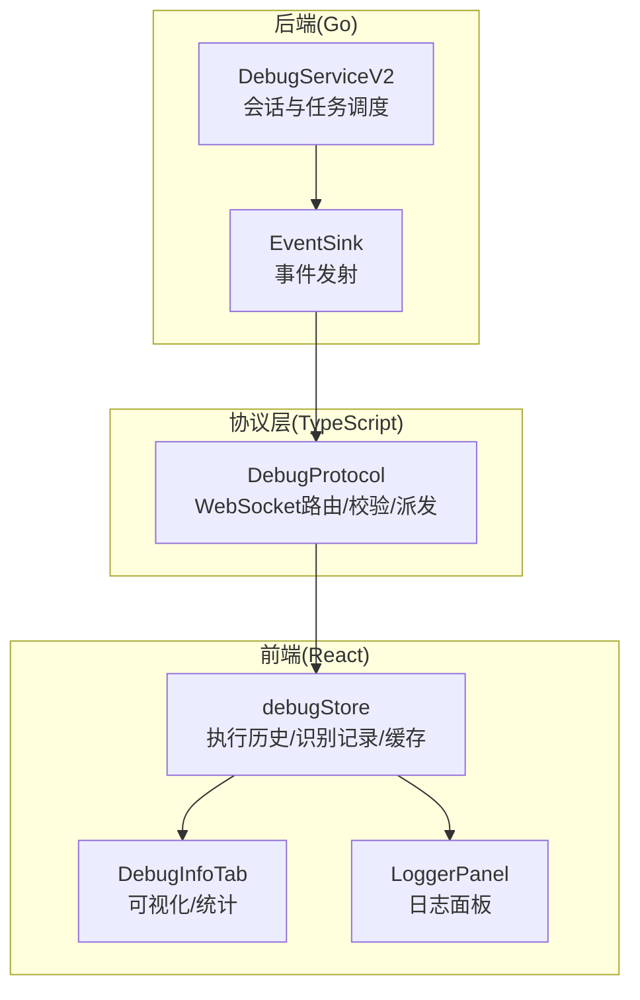
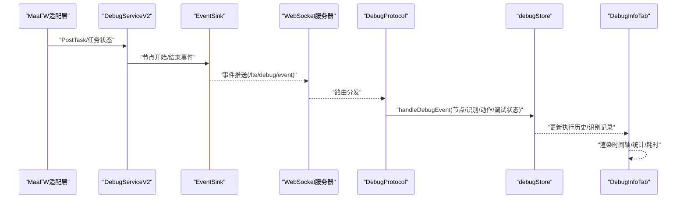
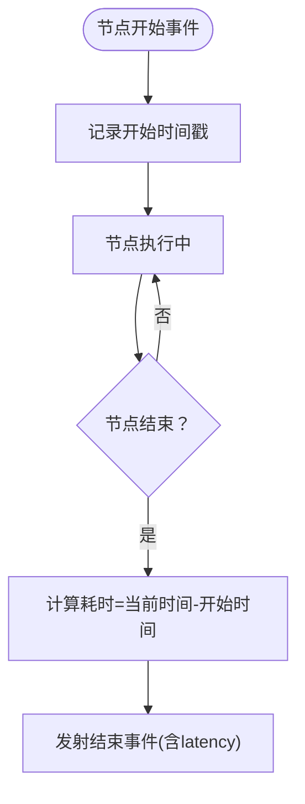
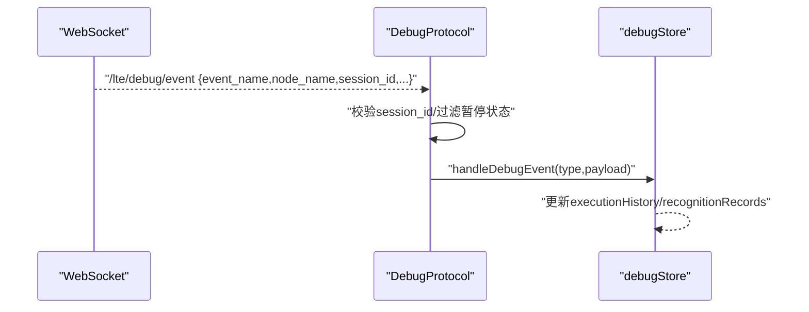
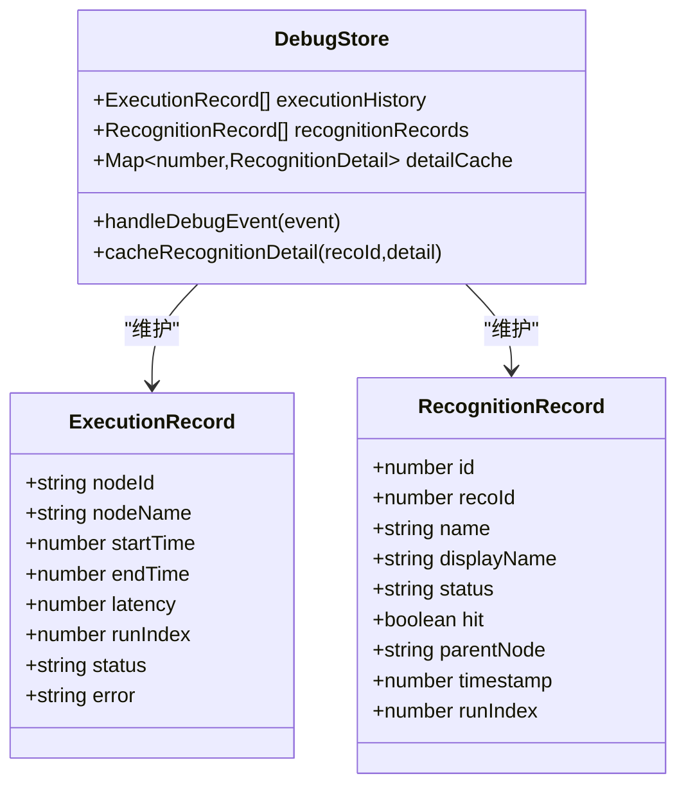
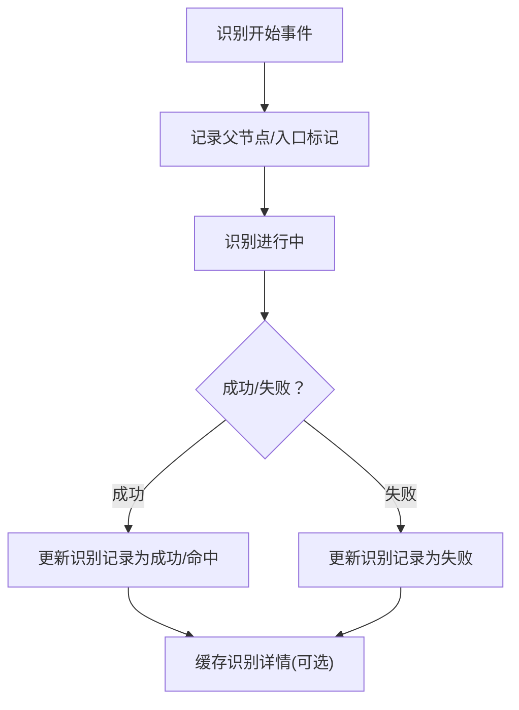

# 性能监控

<cite>
**本文引用的文件**
- [debug_service_v2.go](file://LocalBridge/internal/mfw/debug_service_v2.go)
- [event_sink.go](file://LocalBridge/internal/mfw/event_sink.go)
- [debugStore.ts](file://src/stores/debugStore.ts)
- [DebugProtocol.ts](file://src/services/protocols/DebugProtocol.ts)
- [DebugInfoTab.tsx](file://src/components/panels/tools/DebugInfoTab.tsx)
- [LoggerPanel.tsx](file://src/components/panels/tools/LoggerPanel.tsx)
- [default.json](file://Extremer/config/default.json)
- [default_pipeline.json](file://LocalBridge/test-json/base/default_pipeline.json)
</cite>

## 目录
1. [简介](#简介)
2. [项目结构](#项目结构)
3. [核心组件](#核心组件)
4. [架构总览](#架构总览)
5. [详细组件分析](#详细组件分析)
6. [依赖分析](#依赖分析)
7. [性能考虑](#性能考虑)
8. [故障排查指南](#故障排查指南)
9. [结论](#结论)
10. [附录](#附录)

## 简介
本文件面向MaaPipelineEditor（MPE）的性能监控体系，围绕“执行时间统计、内存使用监控、CPU占用率跟踪、数据分析与可视化、实时监控界面、优化建议与实践、历史数据与回归检测、诊断与配置”等方面进行系统化梳理与说明。当前代码库已具备完善的节点级执行事件采集、延迟计算与前端可视化能力，并通过调试协议与前端Store实现事件分发与状态持久化，为后续扩展内存/CPU指标与趋势分析提供了清晰的落点。

## 项目结构
MPE的性能监控涉及三层协作：
- 后端（Go）：通过MaaFW适配层产生节点执行事件，记录节点开始/结束时间并计算延迟，同时转发事件给前端。
- 协议层（TypeScript）：负责WebSocket事件路由、会话校验、事件解耦与派发。
- 前端（React + Zustand）：维护执行历史、识别记录、详情缓存与UI状态，提供可视化与交互。

**图表来源**
- [debug_service_v2.go:1-472](file://LocalBridge/internal/mfw/debug_service_v2.go#L1-L472)
- [event_sink.go:189-228](file://LocalBridge/internal/mfw/event_sink.go#L189-L228)
- [DebugProtocol.ts:1-232](file://src/services/protocols/DebugProtocol.ts#L1-L232)
- [debugStore.ts:1-897](file://src/stores/debugStore.ts#L1-L897)
- [DebugInfoTab.tsx:1-375](file://src/components/panels/tools/DebugInfoTab.tsx#L1-L375)
- [LoggerPanel.tsx:1-182](file://src/components/panels/tools/LoggerPanel.tsx#L1-L182)

**章节来源**
- [debug_service_v2.go:1-472](file://LocalBridge/internal/mfw/debug_service_v2.go#L1-L472)
- [DebugProtocol.ts:1-232](file://src/services/protocols/DebugProtocol.ts#L1-L232)
- [debugStore.ts:1-897](file://src/stores/debugStore.ts#L1-L897)
- [DebugInfoTab.tsx:1-375](file://src/components/panels/tools/DebugInfoTab.tsx#L1-L375)
- [LoggerPanel.tsx:1-182](file://src/components/panels/tools/LoggerPanel.tsx#L1-L182)

## 核心组件
- 调试会话与事件采集（后端）
  - DebugSessionV2：创建/销毁会话、任务提交、状态机、节点开始/结束事件处理与延迟计算。
  - EventSink：将识别/动作/调试状态等事件封装为统一格式并发射。
- 调试协议（协议层）
  - DebugProtocol：WebSocket路由注册、事件分发、会话ID校验、错误处理与提示。
- 调试状态与可视化（前端）
  - debugStore：执行历史、识别记录、详情缓存、内存限制与清理策略、单节点测试结果生成。
  - DebugInfoTab：节点执行历史时间轴、统计信息（执行次数、执行时间）、耗时展示。
  - LoggerPanel：后端日志接入与可视化，辅助定位性能相关问题。

**章节来源**
- [debug_service_v2.go:440-471](file://LocalBridge/internal/mfw/debug_service_v2.go#L440-L471)
- [event_sink.go:189-228](file://LocalBridge/internal/mfw/event_sink.go#L189-L228)
- [DebugProtocol.ts:136-232](file://src/services/protocols/DebugProtocol.ts#L136-L232)
- [debugStore.ts:800-897](file://src/stores/debugStore.ts#L800-L897)
- [DebugInfoTab.tsx:55-63](file://src/components/panels/tools/DebugInfoTab.tsx#L55-L63)
- [LoggerPanel.tsx:55-182](file://src/components/panels/tools/LoggerPanel.tsx#L55-L182)

## 架构总览
下图展示了从后端事件到前端可视化的完整链路，以及会话生命周期与事件类型映射。

**图表来源**
- [debug_service_v2.go:220-277](file://LocalBridge/internal/mfw/debug_service_v2.go#L220-L277)
- [event_sink.go:189-228](file://LocalBridge/internal/mfw/event_sink.go#L189-L228)
- [DebugProtocol.ts:47-75](file://src/services/protocols/DebugProtocol.ts#L47-L75)
- [debugStore.ts:437-795](file://src/stores/debugStore.ts#L437-L795)
- [DebugInfoTab.tsx:66-173](file://src/components/panels/tools/DebugInfoTab.tsx#L66-L173)

## 详细组件分析

### 后端：执行时间统计与事件采集
- 节点开始时间记录：在节点开始事件发生时记录毫秒级时间戳。
- 节点结束时延计算：在节点成功/失败事件发生时，以当前时间减去开始时间得到latency（毫秒）。
- 事件发射：通过EventSink统一发射事件，包含节点名、任务ID、延迟等信息。

**图表来源**
- [debug_service_v2.go:440-471](file://LocalBridge/internal/mfw/debug_service_v2.go#L440-L471)

**章节来源**
- [debug_service_v2.go:440-471](file://LocalBridge/internal/mfw/debug_service_v2.go#L440-L471)

### 协议层：事件路由与会话校验
- 路由注册：对/debug/event、/debug/error、/debug/completed等路径进行注册。
- 会话校验：比较event中的session_id与前端store中的session_id，不一致则忽略。
- 事件派发：根据事件类型调用debugStore对应处理逻辑，支持节点/识别/动作/调试状态。

**图表来源**
- [DebugProtocol.ts:47-75](file://src/services/protocols/DebugProtocol.ts#L47-L75)
- [DebugProtocol.ts:136-232](file://src/services/protocols/DebugProtocol.ts#L136-L232)

**章节来源**
- [DebugProtocol.ts:136-232](file://src/services/protocols/DebugProtocol.ts#L136-L232)

### 前端：执行历史与可视化
- 执行历史（executionHistory）：记录每个节点的开始/结束时间、耗时、状态与运行序号。
- 识别记录（recognitionRecords）：记录识别开始/成功/失败、命中情况、父节点等。
- 详情缓存（detailCache）：按recoId缓存识别详情，避免重复请求，带容量限制与清理策略。
- 可视化：
  - DebugInfoTab：节点执行历史时间轴、执行次数统计、执行时间（从会话开始到现在）、每条记录耗时（ms或s）。
  - LoggerPanel：后端日志接入，便于定位资源加载、识别失败等性能相关问题。

**图表来源**
- [debugStore.ts:84-137](file://src/stores/debugStore.ts#L84-L137)
- [debugStore.ts:143-221](file://src/stores/debugStore.ts#L143-L221)

**章节来源**
- [debugStore.ts:84-137](file://src/stores/debugStore.ts#L84-L137)
- [debugStore.ts:437-795](file://src/stores/debugStore.ts#L437-L795)
- [DebugInfoTab.tsx:55-63](file://src/components/panels/tools/DebugInfoTab.tsx#L55-L63)
- [DebugInfoTab.tsx:66-173](file://src/components/panels/tools/DebugInfoTab.tsx#L66-L173)

### 识别事件与上下文
- 识别开始事件：记录父节点（parentNode），用于构建识别上下文；入口节点识别会标注为入口。
- 识别成功/失败：更新识别记录状态、命中情况、recoId，并缓存识别详情。

**图表来源**
- [event_sink.go:189-228](file://LocalBridge/internal/mfw/event_sink.go#L189-L228)
- [debugStore.ts:621-684](file://src/stores/debugStore.ts#L621-L684)

**章节来源**
- [event_sink.go:189-228](file://LocalBridge/internal/mfw/event_sink.go#L189-L228)
- [debugStore.ts:621-684](file://src/stores/debugStore.ts#L621-L684)

## 依赖分析
- 后端依赖MaaFW适配层，通过ContextSink接收节点/识别/动作事件，再由DebugServiceV2统一处理并计算延迟。
- 协议层依赖WebSocket服务器，负责路由与会话一致性校验。
- 前端依赖Zustand状态管理，将事件转化为可渲染的数据结构，并通过组件进行可视化。

**图表来源**
- [debug_service_v2.go:115-164](file://LocalBridge/internal/mfw/debug_service_v2.go#L115-L164)
- [DebugProtocol.ts:25-75](file://src/services/protocols/DebugProtocol.ts#L25-L75)
- [debugStore.ts:143-221](file://src/stores/debugStore.ts#L143-L221)

**章节来源**
- [debug_service_v2.go:115-164](file://LocalBridge/internal/mfw/debug_service_v2.go#L115-L164)
- [DebugProtocol.ts:25-75](file://src/services/protocols/DebugProtocol.ts#L25-L75)
- [debugStore.ts:143-221](file://src/stores/debugStore.ts#L143-L221)

## 性能考虑
- 执行时间统计
  - 后端以毫秒级时间戳计算节点耗时，前端以ms或秒展示，支持运行中/已完成/失败三种状态的耗时呈现。
  - 建议：在节点配置中增加“预等待冻结”等参数，有助于减少无效重试与重复识别，从而降低整体耗时波动。
- 内存使用监控
  - 前端Store对识别详情采用缓存策略，并设定最大缓存条数与清理比例，避免内存膨胀。
  - 建议：引入浏览器performance.memory（若可用）或后端上报内存指标，结合UI进行阈值告警。
- CPU占用率跟踪
  - 当前未直接采集CPU指标；建议通过浏览器performance接口或后端进程指标上报，配合阈值告警。
- 数据清理与容量控制
  - 执行历史与识别记录均设有上限与清理比例，防止长时间调试导致内存压力。
- 可视化与交互
  - DebugInfoTab提供时间轴与统计信息，便于快速定位耗时节点与异常状态。
  - LoggerPanel提供后端日志，辅助定位资源加载、识别失败等性能瓶颈。

**章节来源**
- [debugStore.ts:10-21](file://src/stores/debugStore.ts#L10-L21)
- [debugStore.ts:878-891](file://src/stores/debugStore.ts#L878-L891)
- [DebugInfoTab.tsx:55-63](file://src/components/panels/tools/DebugInfoTab.tsx#L55-L63)
- [LoggerPanel.tsx:55-182](file://src/components/panels/tools/LoggerPanel.tsx#L55-L182)

## 故障排查指南
- 资源加载失败
  - 协议层在收到资源加载失败错误时，弹窗提示并给出路径检查建议。
- 会话ID不匹配
  - 协议层在事件与当前会话ID不一致时会忽略事件，需检查前端会话状态与后端会话生命周期。
- 调试暂停/完成状态
  - 前端在暂停状态下忽略事件，调试完成后自动清理状态；若长时间无响应，检查后端任务状态与WebSocket连接。
- 识别记录缺失
  - 若识别事件未携带父节点信息，不会写入识别记录卡片；需确认节点自身识别与父子关系配置。

**章节来源**
- [DebugProtocol.ts:444-540](file://src/services/protocols/DebugProtocol.ts#L444-L540)
- [DebugProtocol.ts:156-158](file://src/services/protocols/DebugProtocol.ts#L156-L158)
- [debugStore.ts:724-795](file://src/stores/debugStore.ts#L724-L795)
- [event_sink.go:192-206](file://LocalBridge/internal/mfw/event_sink.go#L192-L206)

## 结论
MPE的性能监控体系以“节点级事件采集+前端可视化”为核心，已具备执行时间统计、识别上下文与详情缓存、调试状态与错误提示等能力。建议下一步扩展内存/CPU指标采集、阈值告警与趋势分析，并完善历史数据对比与回归检测机制，以形成闭环的性能治理方案。

## 附录

### 配置选项与使用技巧
- 后端配置
  - Extremer默认配置包含服务端口、日志级别、MaaFW启用与资源目录等，确保资源路径正确指向包含pipeline的目录。
- 调试配置
  - 资源路径优先级：命令行root参数 > 配置文件resource_dir > 用户手动填写。
  - 建议在调试前保存文件，避免资源加载路径问题。
- 节点参数
  - 默认管道配置包含超时与前置延迟，可根据场景调整以平衡稳定性与性能。

**章节来源**
- [default.json:1-33](file://Extremer/config/default.json#L1-L33)
- [DebugProtocol.ts:88-120](file://src/services/protocols/DebugProtocol.ts#L88-L120)
- [default_pipeline.json:1-6](file://LocalBridge/test-json/base/default_pipeline.json#L1-L6)