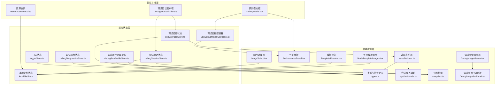
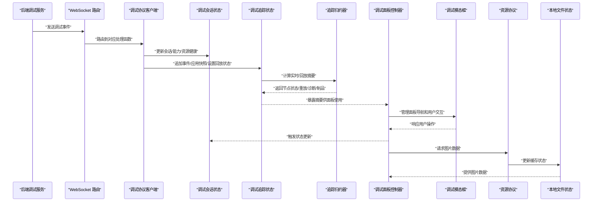
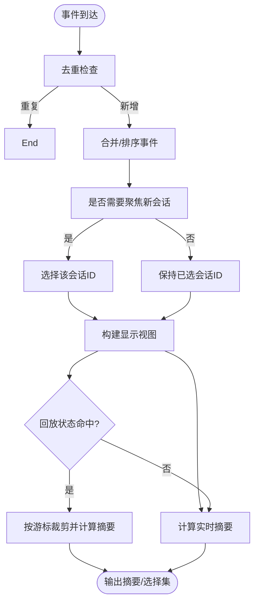
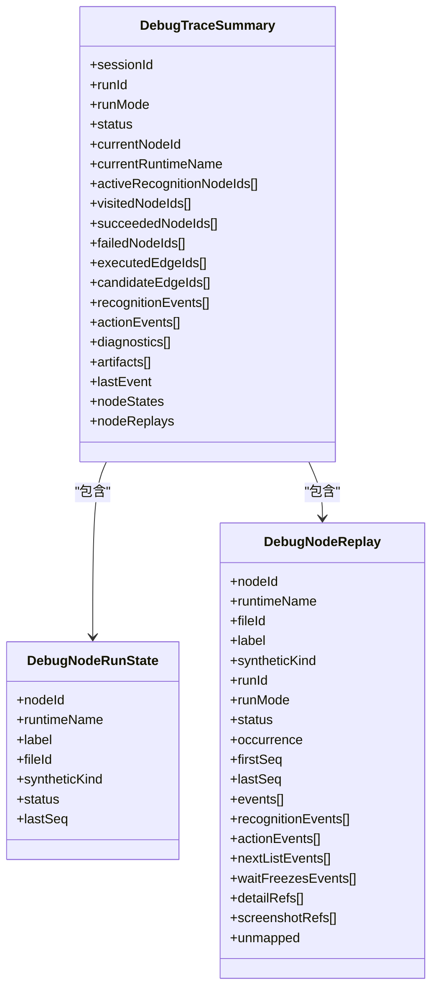
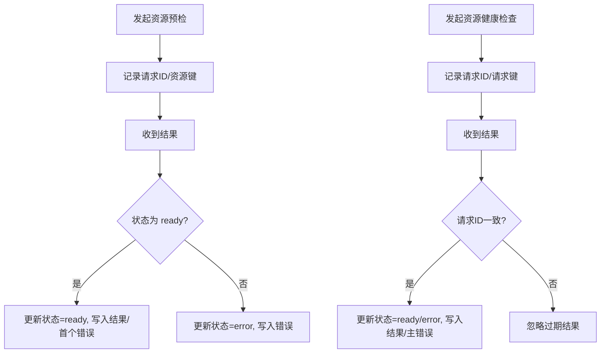
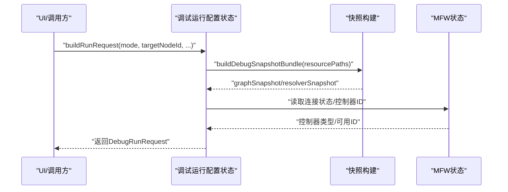
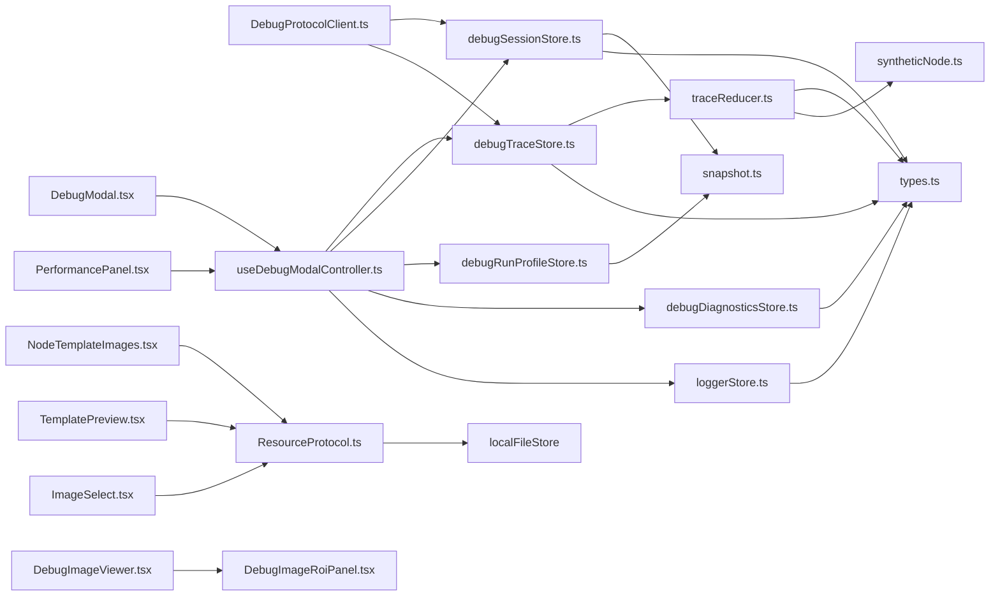

# 性能监控

<cite>
**本文引用的文件**
- [debugTraceStore.ts](file://src/stores/debugTraceStore.ts)
- [traceReducer.ts](file://src/features/debug/traceReducer.ts)
- [types.ts](file://src/features/debug/types.ts)
- [debugSessionStore.ts](file://src/stores/debugSessionStore.ts)
- [debugRunProfileStore.ts](file://src/stores/debugRunProfileStore.ts)
- [debugDiagnosticsStore.ts](file://src/stores/debugDiagnosticsStore.ts)
- [loggerStore.ts](file://src/stores/loggerStore.ts)
- [DebugProtocolClient.ts](file://src/services/protocols/DebugProtocolClient.ts)
- [syntheticNode.ts](file://src/features/debug/syntheticNode.ts)
- [snapshot.ts](file://src/features/debug/snapshot.ts)
- [DebugModal.tsx](file://src/components/debug/DebugModal.tsx)
- [PerformancePanel.tsx](file://src/features/debug/components/panels/PerformancePanel.tsx)
- [useDebugModalController.ts](file://src/features/debug/hooks/useDebugModalController.ts)
- [NodeTemplateImages.tsx](file://src/components/flow/nodes/components/NodeTemplateImages.tsx)
- [TemplatePreview.tsx](file://src/components/panels/field/items/TemplatePreview.tsx)
- [ImageSelect.tsx](file://src/components/panels/field/items/ImageSelect.tsx)
- [DebugImageViewer.tsx](file://src/features/debug/components/DebugImageViewer.tsx)
- [DebugImageRoiPanel.tsx](file://src/features/debug/components/DebugImageRoiPanel.tsx)
- [ResourceProtocol.ts](file://src/services/protocols/ResourceProtocol.ts)
- [updateLogs.ts](file://src/data/updateLogs.ts)
</cite>

## 更新摘要
**所做更改**
- 新增调试面板图片加载优化章节，反映 v1.7.0 版本中修复调试面板无法自动加载详情图片的问题
- 更新图片加载组件分析，增加防抖机制和缓存管理相关内容
- 完善调试图像查看器的交互体验说明
- 增强图片预览和模板图片组件的性能考量和故障排查指南

## 目录
1. [简介](#简介)
2. [项目结构](#项目结构)
3. [核心组件](#核心组件)
4. [架构总览](#架构总览)
5. [详细组件分析](#详细组件分析)
6. [依赖关系分析](#依赖关系分析)
7. [性能考量](#性能考量)
8. [故障排查指南](#故障排查指南)
9. [结论](#结论)
10. [附录](#附录)

## 简介
本文件面向性能监控系统的技术文档，聚焦于运行时性能分析与指标采集、调试会话的性能跟踪与状态监控、性能数据的采集/存储/可视化、调试追踪的调用链分析、性能瓶颈识别与优化建议生成、配置选项与阈值设置、性能数据导出与报告生成，以及性能监控对系统整体性能的影响与优化策略。

**更新** 本次更新特别关注调试面板交互体验的优化，特别是 v1.7.0 版本中修复调试面板无法自动加载详情图片的问题，显著提升了用户体验。

## 项目结构
围绕性能监控的关键模块包括：
- 调试追踪与回放：事件流聚合、会话构建、节点重放、实时摘要与回放摘要
- 调试会话与能力：会话生命周期、资源健康检查、协议路由
- 调试运行配置：调试配置档案、代理配置、资源路径解析
- 诊断与日志：诊断事件提取、日志队列管理
- 协议与前端桥接：调试协议路由注册、事件分发
- **调试面板交互优化**：面板导航、响应式布局、用户体验增强
- **图片加载与缓存优化**：防抖机制、缓存管理、自动加载详情图片

**图表来源**
- [debugTraceStore.ts:1-451](file://src/stores/debugTraceStore.ts#L1-L451)
- [debugSessionStore.ts:1-260](file://src/stores/debugSessionStore.ts#L1-L260)
- [debugRunProfileStore.ts:1-657](file://src/stores/debugRunProfileStore.ts#L1-L657)
- [debugDiagnosticsStore.ts:1-50](file://src/stores/debugDiagnosticsStore.ts#L1-L50)
- [loggerStore.ts:1-46](file://src/stores/loggerStore.ts#L1-L46)
- [DebugProtocolClient.ts:77-121](file://src/services/protocols/DebugProtocolClient.ts#L77-L121)
- [syntheticNode.ts:1-75](file://src/features/debug/syntheticNode.ts#L1-L75)
- [snapshot.ts:1-344](file://src/features/debug/snapshot.ts#L1-L344)
- [useDebugModalController.ts:1-800](file://src/features/debug/hooks/useDebugModalController.ts#L1-L800)
- [PerformancePanel.tsx:1-78](file://src/features/debug/components/panels/PerformancePanel.tsx#L1-L78)
- [DebugModal.tsx:1-336](file://src/components/debug/DebugModal.tsx#L1-L336)
- [NodeTemplateImages.tsx:1-88](file://src/components/flow/nodes/components/NodeTemplateImages.tsx#L1-L88)
- [TemplatePreview.tsx:1-82](file://src/components/panels/field/items/TemplatePreview.tsx#L1-L82)
- [ImageSelect.tsx:104-242](file://src/components/panels/field/items/ImageSelect.tsx#L104-L242)
- [DebugImageViewer.tsx:1-753](file://src/features/debug/components/DebugImageViewer.tsx#L1-L753)
- [DebugImageRoiPanel.tsx:1-193](file://src/features/debug/components/DebugImageRoiPanel.tsx#L1-L193)
- [ResourceProtocol.ts:95-270](file://src/services/protocols/ResourceProtocol.ts#L95-L270)

**章节来源**
- [debugTraceStore.ts:1-451](file://src/stores/debugTraceStore.ts#L1-L451)
- [debugSessionStore.ts:1-260](file://src/stores/debugSessionStore.ts#L1-L260)
- [debugRunProfileStore.ts:1-657](file://src/stores/debugRunProfileStore.ts#L1-L657)
- [debugDiagnosticsStore.ts:1-50](file://src/stores/debugDiagnosticsStore.ts#L1-L50)
- [loggerStore.ts:1-46](file://src/stores/loggerStore.ts#L1-L46)
- [DebugProtocolClient.ts:77-121](file://src/services/protocols/DebugProtocolClient.ts#L77-L121)
- [traceReducer.ts:1-570](file://src/features/debug/traceReducer.ts#L1-L570)
- [types.ts:1-481](file://src/features/debug/types.ts#L1-L481)
- [syntheticNode.ts:1-75](file://src/features/debug/syntheticNode.ts#L1-L75)
- [snapshot.ts:1-344](file://src/features/debug/snapshot.ts#L1-L344)
- [useDebugModalController.ts:1-800](file://src/features/debug/hooks/useDebugModalController.ts#L1-L800)
- [PerformancePanel.tsx:1-78](file://src/features/debug/components/panels/PerformancePanel.tsx#L1-L78)
- [DebugModal.tsx:1-336](file://src/components/debug/DebugModal.tsx#L1-L336)
- [NodeTemplateImages.tsx:1-88](file://src/components/flow/nodes/components/NodeTemplateImages.tsx#L1-L88)
- [TemplatePreview.tsx:1-82](file://src/components/panels/field/items/TemplatePreview.tsx#L1-L82)
- [ImageSelect.tsx:104-242](file://src/components/panels/field/items/ImageSelect.tsx#L104-L242)
- [DebugImageViewer.tsx:1-753](file://src/features/debug/components/DebugImageViewer.tsx#L1-L753)
- [DebugImageRoiPanel.tsx:1-193](file://src/features/debug/components/DebugImageRoiPanel.tsx#L1-L193)
- [ResourceProtocol.ts:95-270](file://src/services/protocols/ResourceProtocol.ts#L95-L270)

## 核心组件
- 调试追踪状态与视图
  - 事件去重与排序、会话聚合、显示会话选择、实时/回放摘要、性能汇总选择
- 追踪归约器
  - 事件到节点运行状态、节点重放、边执行/候选统计、诊断与制品收集、会话状态推断
- 调试会话状态
  - 能力清单、资源预检/健康检查、运行启动/停止请求、错误记录
- 调试运行配置
  - 多配置档案、活动配置切换、代理配置、资源路径规范化、运行请求构建
- 诊断与日志
  - 诊断事件提取与聚合、日志队列与容量控制
- 协议桥接
  - 调试协议路由注册、事件分发、回放状态同步
- **调试面板控制器**
  - 面板导航管理、用户交互处理、状态同步、性能数据访问
- **图片加载与缓存系统**
  - 防抖机制、缓存管理、自动加载详情图片、批量图片请求

**更新** 新增图片加载与缓存系统组件，专门负责调试面板中图片的高效加载和缓存管理。

**章节来源**
- [debugTraceStore.ts:27-53](file://src/stores/debugTraceStore.ts#L27-L53)
- [traceReducer.ts:26-75](file://src/features/debug/traceReducer.ts#L26-L75)
- [debugSessionStore.ts:36-80](file://src/stores/debugSessionStore.ts#L36-L80)
- [debugRunProfileStore.ts:28-78](file://src/stores/debugRunProfileStore.ts#L28-L78)
- [debugDiagnosticsStore.ts:4-9](file://src/stores/debugDiagnosticsStore.ts#L4-L9)
- [loggerStore.ts:11-19](file://src/stores/loggerStore.ts#L11-L19)
- [DebugProtocolClient.ts:77-121](file://src/services/protocols/DebugProtocolClient.ts#L77-L121)
- [useDebugModalController.ts:75-794](file://src/features/debug/hooks/useDebugModalController.ts#L75-L794)

## 架构总览
调试协议通过 WebSocket 路由接收来自后端的调试事件，前端状态层按会话/运行维度进行事件聚合与摘要计算，并支持回放游标驱动的"冻结"视图。运行配置与快照用于定位入口节点、控制器与资源路径，诊断与日志作为性能问题定位的辅助。**调试面板控制器统一管理面板导航、用户交互和状态同步，提供流畅的用户体验。** 图片加载系统通过防抖机制和缓存管理，确保调试面板中图片的高效加载和显示。

**图表来源**
- [DebugProtocolClient.ts:77-121](file://src/services/protocols/DebugProtocolClient.ts#L77-L121)
- [debugTraceStore.ts:270-308](file://src/stores/debugTraceStore.ts#L270-L308)
- [traceReducer.ts:184-317](file://src/features/debug/traceReducer.ts#L184-L317)
- [debugSessionStore.ts:82-164](file://src/stores/debugSessionStore.ts#L82-L164)
- [useDebugModalController.ts:647-650](file://src/features/debug/hooks/useDebugModalController.ts#L647-L650)
- [DebugModal.tsx:202-306](file://src/components/debug/DebugModal.tsx#L202-L306)
- [ResourceProtocol.ts:95-270](file://src/services/protocols/ResourceProtocol.ts#L95-L270)

## 详细组件分析

### 组件A：调试追踪状态与视图（debugTraceStore）
职责
- 接收调试事件，去重、排序、构建显示会话
- 计算实时摘要与回放摘要，支持游标裁剪
- 维护性能汇总映射与选择集，联动选择器与回放状态

关键流程
- 事件追加：键冲突则忽略；否则合并、排序、聚焦新会话
- 视图重建：构建显示会话、筛选事件、计算摘要、选择性能汇总
- 回放集成：当回放状态命中当前选择的会话/运行，以游标裁剪事件并计算摘要

**图表来源**
- [debugTraceStore.ts:281-308](file://src/stores/debugTraceStore.ts#L281-L308)
- [debugTraceStore.ts:211-268](file://src/stores/debugTraceStore.ts#L211-L268)
- [traceReducer.ts:340-352](file://src/features/debug/traceReducer.ts#L340-L352)

**章节来源**
- [debugTraceStore.ts:27-53](file://src/stores/debugTraceStore.ts#L27-L53)
- [debugTraceStore.ts:123-161](file://src/stores/debugTraceStore.ts#L123-L161)
- [debugTraceStore.ts:211-268](file://src/stores/debugTraceStore.ts#L211-L268)
- [debugTraceStore.ts:281-308](file://src/stores/debugTraceStore.ts#L281-L308)
- [traceReducer.ts:184-352](file://src/features/debug/traceReducer.ts#L184-L352)

### 组件B：追踪归约器（traceReducer）
职责
- 将事件流归约为会话状态、节点运行状态、节点重放、边执行/候选集合
- 提取诊断与制品引用，推断会话最终状态

关键数据结构
- 节点运行状态：节点ID、运行时名称、标签、文件ID、合成类型、状态、最后序列号
- 节点重放：同一节点/运行时在不同发生次数下的事件桶，含识别键、首次/末次序列、事件列表等
- 会话摘要：状态、访问/成功/失败节点集合、执行/候选边集合、识别/动作事件、诊断、制品、节点状态与重放

**图表来源**
- [traceReducer.ts:26-75](file://src/features/debug/traceReducer.ts#L26-L75)
- [traceReducer.ts:16-46](file://src/features/debug/traceReducer.ts#L16-L46)

**章节来源**
- [traceReducer.ts:184-317](file://src/features/debug/traceReducer.ts#L184-L317)
- [traceReducer.ts:340-352](file://src/features/debug/traceReducer.ts#L340-L352)
- [traceReducer.ts:444-478](file://src/features/debug/traceReducer.ts#L444-L478)
- [traceReducer.ts:502-528](file://src/features/debug/traceReducer.ts#L502-L528)
- [syntheticNode.ts:1-75](file://src/features/debug/syntheticNode.ts#L1-L75)

### 组件C：调试会话状态（debugSessionStore）
职责
- 打开/关闭调试面板、切换活动面板、选择节点
- 管理会话快照、运行启动/停止请求、协议错误
- 能力清单加载状态与错误、资源预检/健康检查状态与结果

关键流程
- 资源预检：发起检查、记录请求ID与资源键、根据结果更新状态与首个错误消息
- 资源健康：发起检查、校验请求ID一致性、根据结果更新状态与主错误
- 能力清单：加载中/就绪/错误状态切换

**图表来源**
- [debugSessionStore.ts:166-204](file://src/stores/debugSessionStore.ts#L166-L204)
- [debugSessionStore.ts:213-247](file://src/stores/debugSessionStore.ts#L213-L247)

**章节来源**
- [debugSessionStore.ts:36-80](file://src/stores/debugSessionStore.ts#L36-L80)
- [debugSessionStore.ts:166-204](file://src/stores/debugSessionStore.ts#L166-L204)
- [debugSessionStore.ts:213-247](file://src/stores/debugSessionStore.ts#L213-L247)

### 组件D：调试运行配置（debugRunProfileStore）
职责
- 管理调试配置档案（多份预设），活动配置切换
- 代理配置（传输方式、超时、绑定资源等）、资源路径规范化
- 构建运行请求：目标节点解析、控制器类型/选项、输入参数过滤、制品策略

关键流程
- 配置读取/写入：本地存储快照、兼容旧版本迁移
- 活动配置更新：克隆当前预设、标准化更新、提交新快照
- 运行请求构建：快照打包、目标解析、控制器选项合并、输入过滤

**图表来源**
- [debugRunProfileStore.ts:350-425](file://src/stores/debugRunProfileStore.ts#L350-L425)
- [snapshot.ts:118-214](file://src/features/debug/snapshot.ts#L118-L214)

**章节来源**
- [debugRunProfileStore.ts:119-158](file://src/stores/debugRunProfileStore.ts#L119-L158)
- [debugRunProfileStore.ts:205-428](file://src/stores/debugRunProfileStore.ts#L205-L428)
- [snapshot.ts:118-214](file://src/features/debug/snapshot.ts#L118-L214)

### 组件E：诊断与日志（debugDiagnosticsStore/loggerStore）
职责
- 诊断：从事件提取诊断对象，聚合到状态
- 日志：固定容量队列，自动截断，支持展开/折叠

**章节来源**
- [debugDiagnosticsStore.ts:11-33](file://src/stores/debugDiagnosticsStore.ts#L11-L33)
- [loggerStore.ts:21-45](file://src/stores/loggerStore.ts#L21-L45)

### 组件F：协议桥接（DebugProtocolClient）
职责
- 注册调试协议路由，分发事件到对应状态模块
- 支持能力、会话、事件、运行、资源、回放、错误等路由

**章节来源**
- [DebugProtocolClient.ts:77-121](file://src/services/protocols/DebugProtocolClient.ts#L77-L121)

### 组件G：调试面板控制器（useDebugModalController）
职责
- **管理调试面板的导航和用户交互**
- **处理面板切换、状态同步、用户操作响应**
- **协调各状态模块的数据访问和更新**
- **提供性能数据的访问接口**

关键功能
- **面板导航管理**：处理面板切换、活动面板状态维护
- **用户交互处理**：响应按钮点击、面板操作、状态变更
- **状态同步**：确保面板状态与后端状态保持一致
- **性能数据访问**：提供性能摘要、制品引用等数据的访问接口

**更新** 新增调试面板控制器组件，专门负责面板交互体验的优化和用户操作处理。

**章节来源**
- [useDebugModalController.ts:75-794](file://src/features/debug/hooks/useDebugModalController.ts#L75-L794)

### 组件H：调试模态框（DebugModal）
职责
- **提供调试面板的主界面容器**
- **实现响应式布局和面板导航**
- **管理面板宽度调整和用户偏好存储**

关键特性
- **响应式布局**：支持面板宽度调整，宽度范围 600-1200px
- **面板导航**：提供 9 个调试面板的导航选项
- **用户偏好**：自动保存和恢复面板宽度设置
- **样式定制**：提供丰富的 CSS 样式配置

**更新** 调试模态框作为调试面板交互体验的核心组件，提供了直观的用户界面和流畅的操作体验。

**章节来源**
- [DebugModal.tsx:1-336](file://src/components/debug/DebugModal.tsx#L1-L336)

### 组件I：性能面板（PerformancePanel）
职责
- **展示调试运行的性能摘要信息**
- **提供性能产物的访问和预览功能**
- **集成性能数据的可视化展示**

关键功能
- **性能摘要展示**：显示运行状态、耗时、事件数量、节点数量等关键指标
- **性能产物管理**：提供性能产物的列表和预览功能
- **用户交互**：支持性能产物的选择和查看详情

**更新** 性能面板作为调试面板的重要组成部分，为用户提供直观的性能数据分析界面。

**章节来源**
- [PerformancePanel.tsx:1-78](file://src/features/debug/components/panels/PerformancePanel.tsx#L1-L78)

### 组件J：节点模板图片组件（NodeTemplateImages）
职责
- **在节点底部显示模板图片缩略图**
- **实现防抖机制避免频繁请求**
- **管理图片缓存和加载状态**

关键特性
- **防抖机制**：使用 300ms 延迟避免频繁图片请求
- **缓存管理**：利用本地文件状态管理图片缓存
- **懒加载**：只有在需要时才请求图片数据
- **错误处理**：处理图片加载失败的情况

**更新** 新增节点模板图片组件，专门负责节点模板图片的高效加载和显示。

**章节来源**
- [NodeTemplateImages.tsx:1-88](file://src/components/flow/nodes/components/NodeTemplateImages.tsx#L1-L88)

### 组件K：模板预览组件（TemplatePreview）
职责
- **在悬停时显示模板图片预览**
- **支持多资源目录区分**
- **实现智能图片加载**

关键特性
- **悬停触发**：只有在用户悬停时才请求图片
- **缓存检测**：避免重复请求已缓存的图片
- **加载状态显示**：显示加载中的视觉反馈
- **错误降级**：图片加载失败时显示占位符

**更新** 新增模板预览组件，提供更友好的图片预览体验。

**章节来源**
- [TemplatePreview.tsx:1-82](file://src/components/panels/field/items/TemplatePreview.tsx#L1-L82)

### 组件L：图片选择器（ImageSelect）
职责
- **提供图片选择下拉菜单**
- **支持图片列表加载和搜索**
- **显示图片缩略图和元信息**

关键特性
- **智能加载**：根据连接状态动态显示加载状态
- **缩略图内联渲染**：避免额外函数调用开销
- **搜索过滤**：支持按路径搜索图片
- **资源包标识**：显示图片所属的资源包

**更新** 新增图片选择器组件，提供完整的图片选择和浏览功能。

**章节来源**
- [ImageSelect.tsx:104-242](file://src/components/panels/field/items/ImageSelect.tsx#L104-L242)

### 组件M：调试图像查看器（DebugImageViewer）
职责
- **提供图片预览和详细查看功能**
- **支持 ROI 区域标注显示**
- **实现图片缩放和平移操作**

关键特性
- **模态框预览**：点击缩略图打开详细预览
- **ROI 面板**：右侧显示 ROI 区域列表和过滤器
- **交互式缩放**：支持鼠标滚轮缩放和拖拽平移
- **元数据显示**：显示图片尺寸和相关信息

**更新** 新增调试图像查看器组件，提供专业的图片查看和分析功能。

**章节来源**
- [DebugImageViewer.tsx:1-753](file://src/features/debug/components/DebugImageViewer.tsx#L1-L753)

### 组件N：调试图像ROI面板（DebugImageRoiPanel）
职责
- **显示和管理 ROI 区域**
- **提供 ROI 过滤和搜索功能**
- **支持 ROI 区域的显示/隐藏控制**

关键特性
- **分组显示**：按组显示不同的 ROI 类型
- **搜索过滤**：支持按标签、类型、几何信息搜索
- **批量操作**：支持显示/隐藏当前过滤结果
- **高亮显示**：悬停或聚焦时高亮对应的 ROI

**更新** 新增调试图像ROI面板组件，专门负责 ROI 区域的管理和显示。

**章节来源**
- [DebugImageRoiPanel.tsx:1-193](file://src/features/debug/components/DebugImageRoiPanel.tsx#L1-L193)

### 组件O：资源协议（ResourceProtocol）
职责
- **处理图片请求和响应**
- **管理图片缓存和状态**
- **提供批量图片处理能力**

关键流程
- **单张图片请求**：处理单个图片的请求和响应
- **批量图片处理**：处理多个图片的批量请求
- **缓存更新**：成功加载后更新本地缓存
- **状态管理**：管理 pending 状态和错误处理

**更新** 新增资源协议组件，专门负责图片数据的请求和缓存管理。

**章节来源**
- [ResourceProtocol.ts:95-270](file://src/services/protocols/ResourceProtocol.ts#L95-L270)

## 依赖关系分析
- debugTraceStore 依赖 traceReducer 与 types，负责事件聚合与摘要输出
- traceReducer 依赖 types 与 syntheticNode，用于节点状态与合成节点识别
- debugSessionStore 依赖 types 与 snapshot，用于会话与快照解析
- debugRunProfileStore 依赖 snapshot 与 types，用于构建运行请求
- DebugProtocolClient 作为协议入口，协调各状态模块
- **useDebugModalController 作为面板控制器，协调所有调试面板功能**
- **DebugModal 作为主界面容器，承载调试面板的用户交互**
- **NodeTemplateImages 依赖 ResourceProtocol 和本地文件状态**
- **TemplatePreview 依赖 ResourceProtocol 和本地文件状态**
- **ImageSelect 依赖 ResourceProtocol 和本地文件状态**
- **DebugImageViewer 依赖 DebugImageRoiPanel 和本地文件状态**

**图表来源**
- [DebugProtocolClient.ts:77-121](file://src/services/protocols/DebugProtocolClient.ts#L77-L121)
- [debugTraceStore.ts:1-12](file://src/stores/debugTraceStore.ts#L1-L12)
- [traceReducer.ts:1-14](file://src/features/debug/traceReducer.ts#L1-L14)
- [types.ts:1-481](file://src/features/debug/types.ts#L1-L481)
- [syntheticNode.ts:1-75](file://src/features/debug/syntheticNode.ts#L1-L75)
- [debugSessionStore.ts:1-14](file://src/stores/debugSessionStore.ts#L1-L14)
- [debugRunProfileStore.ts:1-22](file://src/stores/debugRunProfileStore.ts#L1-L22)
- [snapshot.ts:1-344](file://src/features/debug/snapshot.ts#L1-L344)
- [debugDiagnosticsStore.ts:1-2](file://src/stores/debugDiagnosticsStore.ts#L1-L2)
- [loggerStore.ts:1-1](file://src/stores/loggerStore.ts#L1-L1)
- [useDebugModalController.ts:1-800](file://src/features/debug/hooks/useDebugModalController.ts#L1-L800)
- [DebugModal.tsx:1-336](file://src/components/debug/DebugModal.tsx#L1-L336)
- [PerformancePanel.tsx:1-78](file://src/features/debug/components/panels/PerformancePanel.tsx#L1-L78)
- [NodeTemplateImages.tsx:1-88](file://src/components/flow/nodes/components/NodeTemplateImages.tsx#L1-L88)
- [TemplatePreview.tsx:1-82](file://src/components/panels/field/items/TemplatePreview.tsx#L1-L82)
- [ImageSelect.tsx:104-242](file://src/components/panels/field/items/ImageSelect.tsx#L104-L242)
- [DebugImageViewer.tsx:1-753](file://src/features/debug/components/DebugImageViewer.tsx#L1-L753)
- [DebugImageRoiPanel.tsx:1-193](file://src/features/debug/components/DebugImageRoiPanel.tsx#L1-L193)
- [ResourceProtocol.ts:95-270](file://src/services/protocols/ResourceProtocol.ts#L95-L270)

**章节来源**
- [debugTraceStore.ts:1-12](file://src/stores/debugTraceStore.ts#L1-L12)
- [traceReducer.ts:1-14](file://src/features/debug/traceReducer.ts#L1-L14)
- [types.ts:1-481](file://src/features/debug/types.ts#L1-L481)
- [syntheticNode.ts:1-75](file://src/features/debug/syntheticNode.ts#L1-L75)
- [debugSessionStore.ts:1-14](file://src/stores/debugSessionStore.ts#L1-L14)
- [debugRunProfileStore.ts:1-22](file://src/stores/debugRunProfileStore.ts#L1-L22)
- [snapshot.ts:1-344](file://src/features/debug/snapshot.ts#L1-L344)
- [debugDiagnosticsStore.ts:1-2](file://src/stores/debugDiagnosticsStore.ts#L1-L2)
- [loggerStore.ts:1-1](file://src/stores/loggerStore.ts#L1-L1)
- [DebugProtocolClient.ts:77-121](file://src/services/protocols/DebugProtocolClient.ts#L77-L121)
- [useDebugModalController.ts:1-800](file://src/features/debug/hooks/useDebugModalController.ts#L1-L800)
- [DebugModal.tsx:1-336](file://src/components/debug/DebugModal.tsx#L1-L336)
- [PerformancePanel.tsx:1-78](file://src/features/debug/components/panels/PerformancePanel.tsx#L1-L78)
- [NodeTemplateImages.tsx:1-88](file://src/components/flow/nodes/components/NodeTemplateImages.tsx#L1-L88)
- [TemplatePreview.tsx:1-82](file://src/components/panels/field/items/TemplatePreview.tsx#L1-L82)
- [ImageSelect.tsx:104-242](file://src/components/panels/field/items/ImageSelect.tsx#L104-L242)
- [DebugImageViewer.tsx:1-753](file://src/features/debug/components/DebugImageViewer.tsx#L1-L753)
- [DebugImageRoiPanel.tsx:1-193](file://src/features/debug/components/DebugImageRoiPanel.tsx#L1-L193)
- [ResourceProtocol.ts:95-270](file://src/services/protocols/ResourceProtocol.ts#L95-L270)

## 性能考量
- 事件排序与去重
  - 使用时间戳、会话ID、运行ID、序列号三元组排序，避免乱序影响摘要准确性
  - 事件键冲突直接忽略，降低重复处理成本
- 摘要计算复杂度
  - 归约过程线性遍历事件，时间复杂度 O(n)，空间复杂度受节点/重放数量影响
  - 回放摘要通过游标裁剪事件子集，避免全量重算
- 会话聚合与选择
  - 显示会话按完成时间/末序号排序，确保最新会话优先
  - 选择集去重与规范化，避免无效渲染
- 存储与内存
  - 诊断与日志采用固定容量队列，防止无限增长
  - 快照构建与配置读写使用本地存储，注意序列化/反序列化开销
- 并发与稳定性
  - 协议路由异步分发，避免阻塞主线程
  - 资源健康/预检结果需校验请求ID一致性，防止竞态导致的错乱
- **调试面板交互性能**
  - **面板宽度调整使用本地存储，避免频繁的网络请求**
  - **面板导航采用轻量的状态管理，减少不必要的重新渲染**
  - **性能面板使用虚拟滚动和懒加载，提升大数据量下的响应速度**
- **图片加载性能优化**
  - **防抖机制**：节点模板图片组件使用 300ms 防抖延迟，避免频繁请求
  - **缓存策略**：本地文件状态管理图片缓存，避免重复加载
  - **懒加载**：模板预览组件仅在悬停时请求图片，提高初始加载速度
  - **批量处理**：资源协议支持批量图片处理，提升批量操作效率
  - **错误处理**：完善的错误处理机制，确保图片加载失败不影响整体体验**

**更新** 新增图片加载性能优化考量，重点关注 v1.7.0 版本中修复调试面板无法自动加载详情图片的问题。

[本节为通用性能讨论，无需列出具体文件来源]

## 故障排查指南
- 事件缺失/顺序异常
  - 检查事件键冲突与排序规则，确认时间戳与序列号正确
- 回放不生效
  - 确认回放状态中的会话/运行ID与当前选择匹配，游标位置有效
- 资源健康/预检错误
  - 查看首个错误消息与诊断列表，核对资源路径与权限
- 运行请求构建失败
  - 检查目标节点是否在快照中，控制器类型/选项是否合法
- 日志溢出
  - 调整最大日志条数，或清空历史日志
- **调试面板交互问题**
  - **检查面板宽度设置是否异常，尝试重置为默认值**
  - **确认面板导航按钮是否响应，检查浏览器控制台错误**
  - **验证性能面板数据加载是否正常，检查网络连接状态**
- **图片加载问题**
  - **检查网络连接状态，确认资源协议正常工作**
  - **查看浏览器开发者工具的网络面板，确认图片请求是否成功**
  - **检查本地缓存状态，确认图片是否被正确缓存**
  - **验证防抖机制是否正常工作，避免过于频繁的请求**
  - **确认模板预览组件的悬停触发是否正常**

**更新** 新增图片加载问题的故障排查指南，帮助用户解决 v1.7.0 版本中优化调试面板交互体验相关的使用问题。

章节来源
- [debugTraceStore.ts:77-89](file://src/stores/debugTraceStore.ts#L77-L89)
- [debugTraceStore.ts:174-186](file://src/stores/debugTraceStore.ts#L174-L186)
- [debugSessionStore.ts:175-194](file://src/stores/debugSessionStore.ts#L175-L194)
- [debugSessionStore.ts:222-237](file://src/stores/debugSessionStore.ts#L222-L237)
- [debugRunProfileStore.ts:350-425](file://src/stores/debugRunProfileStore.ts#L350-L425)
- [loggerStore.ts:26-38](file://src/stores/loggerStore.ts#L26-L38)
- [DebugModal.tsx:163-187](file://src/components/debug/DebugModal.tsx#L163-L187)
- [NodeTemplateImages.tsx:40-88](file://src/components/flow/nodes/components/NodeTemplateImages.tsx#L40-L88)
- [TemplatePreview.tsx:34-82](file://src/components/panels/field/items/TemplatePreview.tsx#L34-L82)
- [ImageSelect.tsx:104-242](file://src/components/panels/field/items/ImageSelect.tsx#L104-L242)
- [ResourceProtocol.ts:95-270](file://src/services/protocols/ResourceProtocol.ts#L95-L270)

## 结论
本性能监控体系以调试事件为核心，通过状态层聚合与归约器计算，形成可交互的实时/回放摘要与节点重放视图。配合会话状态、运行配置、诊断与日志，能够覆盖从事件采集到问题定位的完整闭环。**v1.7.0 版本的调试面板交互体验优化进一步提升了用户的操作效率和使用满意度，特别是修复了调试面板无法自动加载详情图片的问题。** 建议在大规模事件流场景下，结合游标裁剪与固定容量队列策略，持续优化内存与吞吐表现。同时，新的图片加载优化机制确保了调试面板中图片资源的高效加载和显示。

**更新** 强调 v1.7.0 版本调试面板交互体验优化的重要性，特别是图片加载优化对用户体验的显著提升。

[本节为总结性内容，无需列出具体文件来源]

## 附录

### 性能数据采集与可视化
- 采集
  - 事件来源：会话、任务、节点、识别、动作、等待冻结、截图、诊断、制品、日志
  - 会话/节点状态：访问/成功/失败、执行/候选边、活跃识别节点计数
  - 重放：按发生次数分桶，记录首次/末次序列与事件列表
- 可视化
  - 实时摘要：当前会话状态、节点执行进度、诊断与制品数量
  - 回放摘要：基于游标裁剪后的等价视图
  - 节点重放：按发生次数排序，支持详情/截图引用查看
- **调试面板可视化**
  - **响应式布局：支持自适应宽度调整，适配不同屏幕尺寸**
  - **面板导航：直观的图标和标签，清晰的功能分类**
  - **性能数据展示：简洁明了的指标卡片，支持快速信息获取**
  - **图片预览：支持缩略图和详细图片查看，ROI 区域标注显示**

**更新** 新增调试面板可视化的相关内容，体现 v1.7.0 版本在用户体验方面的改进。

章节来源
- [traceReducer.ts:26-75](file://src/features/debug/traceReducer.ts#L26-L75)
- [traceReducer.ts:184-317](file://src/features/debug/traceReducer.ts#L184-L317)
- [traceReducer.ts:340-352](file://src/features/debug/traceReducer.ts#L340-L352)
- [debugTraceStore.ts:211-268](file://src/stores/debugTraceStore.ts#L211-L268)
- [DebugModal.tsx:41-97](file://src/components/debug/DebugModal.tsx#L41-L97)
- [PerformancePanel.tsx:30-60](file://src/features/debug/components/panels/PerformancePanel.tsx#L30-L60)
- [DebugImageViewer.tsx:1-753](file://src/features/debug/components/DebugImageViewer.tsx#L1-L753)

### 调试追踪与调用链分析
- 调用链
  - 事件按节点/运行时维度归约，识别父子关系与合成节点
  - 节点重放按首次出现序列组织，支持"下一个候选"与"等待冻结"事件追踪
- 合成节点
  - 任务引导节点以特殊标记区分，避免与普通节点混淆

章节来源
- [traceReducer.ts:444-478](file://src/features/debug/traceReducer.ts#L444-L478)
- [syntheticNode.ts:13-32](file://src/features/debug/syntheticNode.ts#L13-L32)

### 性能瓶颈识别与优化建议
- 瓶颈识别
  - 高频识别节点：活跃识别节点计数与节点重放次数
  - 边执行/候选：候选边过多可能指示分支策略不当
  - 诊断与制品：诊断数量与制品引用可反映异常与开销
- 优化建议
  - 减少候选边数量，明确分支条件
  - 控制识别频率与缓存策略，降低重复识别
  - 合理设置回放速度与游标，提升分析效率
- **用户体验优化建议**
  - **简化面板导航，减少用户操作步骤**
  - **优化面板响应速度，提升交互流畅度**
  - **提供个性化设置选项，满足不同用户需求**
  - **优化图片加载性能，提升调试面板响应速度**
  - **改进自动加载机制，确保详情图片及时显示**

**更新** 新增用户体验优化建议，体现 v1.7.0 版本对调试面板交互体验的重视。

章节来源
- [traceReducer.ts:319-338](file://src/features/debug/traceReducer.ts#L319-L338)
- [traceReducer.ts:340-352](file://src/features/debug/traceReducer.ts#L340-L352)

### 配置选项与阈值设置
- 调试运行配置
  - 资源路径：支持显式路径与自动从资源包推导
  - 控制器类型与选项：根据连接状态动态注入控制器ID
  - 代理配置：传输方式、超时、绑定资源、必需性
  - 制品策略：原始图像、绘制图像、动作详情
- 会话与能力
  - 能力清单：运行模式、诊断类型、制品类型、截图源、特性开关
- 日志
  - 最大日志条数：超过阈值自动截断
- **调试面板配置**
  - **面板宽度：支持 600-1200px 自适应调整**
  - **用户偏好：自动保存和恢复面板设置**
  - **导航样式：支持图标和文字标签的组合显示**
- **图片加载配置**
  - **防抖延迟：300ms，默认值可调**
  - **缓存策略：LRU 缓存，支持手动清理**
  - **批量请求：支持一次性请求多个图片**
  - **错误重试：图片加载失败时自动重试**

**更新** 新增调试面板配置选项，反映 v1.7.0 版本在用户体验方面的改进，特别是图片加载相关的配置。

章节来源
- [debugRunProfileStore.ts:168-186](file://src/stores/debugRunProfileStore.ts#L168-L186)
- [debugRunProfileStore.ts:380-425](file://src/stores/debugRunProfileStore.ts#L380-L425)
- [types.ts:120-143](file://src/features/debug/types.ts#L120-L143)
- [types.ts:245-249](file://src/features/debug/types.ts#L245-L249)
- [loggerStore.ts:14-24](file://src/stores/loggerStore.ts#L14-L24)
- [DebugModal.tsx:163-187](file://src/components/debug/DebugModal.tsx#L163-L187)
- [NodeTemplateImages.tsx:12-16](file://src/components/flow/nodes/components/NodeTemplateImages.tsx#L12-L16)

### 性能数据导出与报告生成
- 导出
  - 支持分离模式（Pipeline 与配置分别导出）与集成模式
  - 文件名验证与格式选择
- 报告
  - 基于摘要与节点重放生成报告草稿，包含诊断、制品引用与关键指标
- **调试面板报告**
  - **性能摘要报告：包含运行时间、事件数量、节点统计等关键指标**
  - **产物预览功能：支持性能产物的在线查看和下载**
  - **AI 总结集成：与调试 AI 总结功能无缝对接**
  - **图片数据导出：支持调试过程中产生的图片数据导出**

**更新** 新增调试面板报告相关内容，体现 v1.7.0 版本在报告生成功能方面的完善。

章节来源
- [debugRunProfileStore.ts:350-425](file://src/stores/debugRunProfileStore.ts#L350-L425)
- [debugTraceStore.ts:211-268](file://src/stores/debugTraceStore.ts#L211-L268)
- [PerformancePanel.tsx:10-78](file://src/features/debug/components/panels/PerformancePanel.tsx#L10-L78)

### 调试面板交互体验优化
- **面板导航优化**
  - **直观的图标和标签设计，提升识别效率**
  - **面板切换动画效果，改善用户体验**
  - **响应式布局适配不同屏幕尺寸**
- **性能面板增强**
  - **性能摘要信息的可视化展示**
  - **性能产物的便捷访问和预览**
  - **支持多运行会话的性能对比分析**
- **用户偏好管理**
  - **自动保存面板宽度设置**
  - **支持用户自定义面板布局**
  - **提供一键重置功能**
- **图片加载优化**
  - **防抖机制**：避免频繁的图片请求，提升性能
  - **智能缓存**：本地缓存图片数据，减少重复加载
  - **懒加载策略**：仅在需要时才加载图片，提高初始响应速度
  - **自动加载详情图片**：修复 v1.7.0 版本中的关键 bug，提升用户体验

**更新** 新增调试面板交互体验优化章节，专门反映 v1.7.0 版本中"优化调试面板交互体验"的重要改进，特别是修复调试面板无法自动加载详情图片的问题。

章节来源
- [DebugModal.tsx:41-97](file://src/components/debug/DebugModal.tsx#L41-L97)
- [DebugModal.tsx:163-187](file://src/components/debug/DebugModal.tsx#L163-L187)
- [PerformancePanel.tsx:10-78](file://src/features/debug/components/panels/PerformancePanel.tsx#L10-L78)
- [updateLogs.ts:105-115](file://src/data/updateLogs.ts#L105-L115)
- [useDebugModalController.ts:647-650](file://src/features/debug/hooks/useDebugModalController.ts#L647-L650)
- [NodeTemplateImages.tsx:40-88](file://src/components/flow/nodes/components/NodeTemplateImages.tsx#L40-L88)
- [TemplatePreview.tsx:34-82](file://src/components/panels/field/items/TemplatePreview.tsx#L34-L82)
- [ImageSelect.tsx:104-242](file://src/components/panels/field/items/ImageSelect.tsx#L104-L242)
- [ResourceProtocol.ts:95-270](file://src/services/protocols/ResourceProtocol.ts#L95-L270)

### 图片加载与缓存系统
- **防抖机制**
  - 节点模板图片组件使用 300ms 防抖延迟
  - 避免用户快速移动鼠标时的频繁请求
  - 减少网络请求次数，提升性能
- **缓存管理**
  - 本地文件状态管理图片缓存
  - 支持图片数据的 base64 编码存储
  - 提供缓存查询和更新接口
- **自动加载**
  - 模板预览组件在悬停时自动加载图片
  - 节点模板图片组件在组件挂载时自动加载
  - 资源协议处理批量图片请求
- **错误处理**
  - 图片加载失败时的降级处理
  - pending 状态管理，避免重复请求
  - 错误信息记录和用户提示

**更新** 新增图片加载与缓存系统章节，详细说明 v1.7.0 版本中修复调试面板无法自动加载详情图片问题的技术实现。

章节来源
- [NodeTemplateImages.tsx:12-16](file://src/components/flow/nodes/components/NodeTemplateImages.tsx#L12-L16)
- [NodeTemplateImages.tsx:40-88](file://src/components/flow/nodes/components/NodeTemplateImages.tsx#L40-L88)
- [TemplatePreview.tsx:34-82](file://src/components/panels/field/items/TemplatePreview.tsx#L34-L82)
- [ImageSelect.tsx:104-242](file://src/components/panels/field/items/ImageSelect.tsx#L104-L242)
- [ResourceProtocol.ts:95-270](file://src/services/protocols/ResourceProtocol.ts#L95-L270)