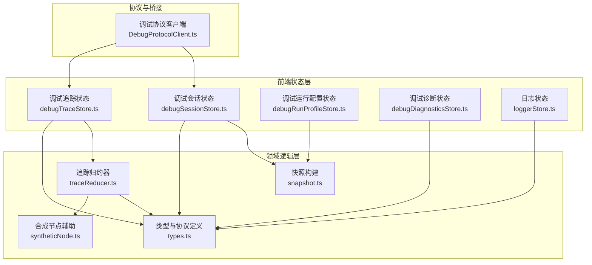
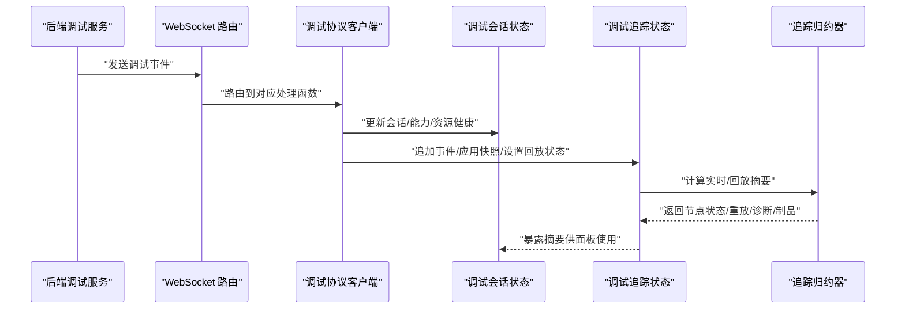
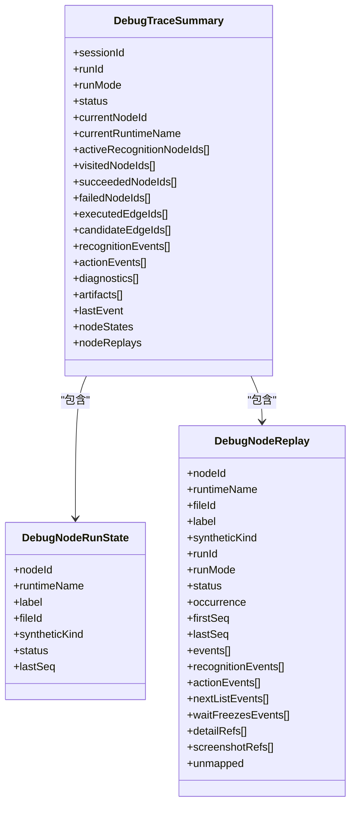
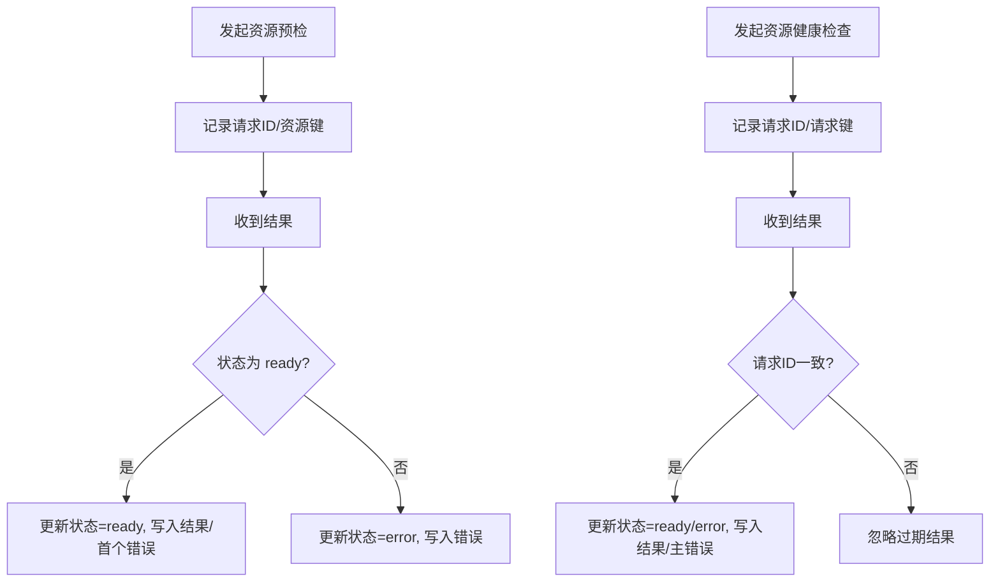
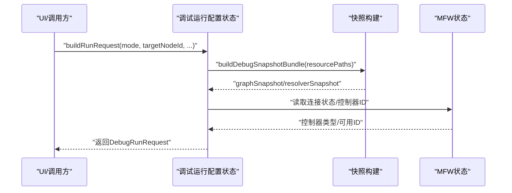
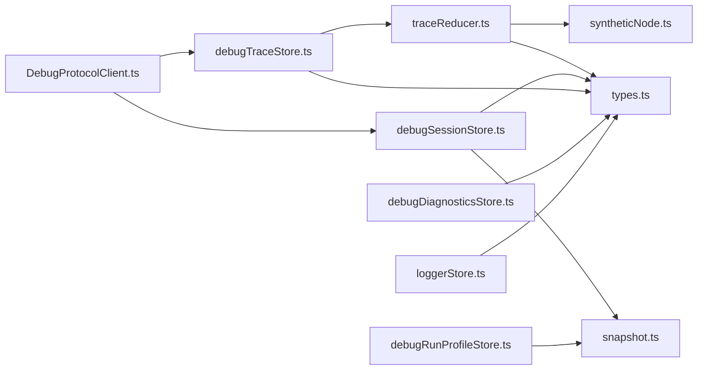

# 性能监控

<cite>
**本文引用的文件**
- [debugTraceStore.ts](file://src/stores/debugTraceStore.ts)
- [traceReducer.ts](file://src/features/debug/traceReducer.ts)
- [types.ts](file://src/features/debug/types.ts)
- [debugSessionStore.ts](file://src/stores/debugSessionStore.ts)
- [debugRunProfileStore.ts](file://src/stores/debugRunProfileStore.ts)
- [debugDiagnosticsStore.ts](file://src/stores/debugDiagnosticsStore.ts)
- [loggerStore.ts](file://src/stores/loggerStore.ts)
- [DebugProtocolClient.ts](file://src/services/protocols/DebugProtocolClient.ts)
- [syntheticNode.ts](file://src/features/debug/syntheticNode.ts)
- [snapshot.ts](file://src/features/debug/snapshot.ts)
</cite>

## 目录
1. [简介](#简介)
2. [项目结构](#项目结构)
3. [核心组件](#核心组件)
4. [架构总览](#架构总览)
5. [详细组件分析](#详细组件分析)
6. [依赖关系分析](#依赖关系分析)
7. [性能考量](#性能考量)
8. [故障排查指南](#故障排查指南)
9. [结论](#结论)
10. [附录](#附录)

## 简介
本文件面向性能监控系统的技术文档，聚焦于运行时性能分析与指标采集、调试会话的性能跟踪与状态监控、性能数据的采集/存储/可视化、调试追踪的调用链分析、性能瓶颈识别与优化建议生成、配置选项与阈值设置、性能数据导出与报告生成，以及性能监控对系统整体性能的影响与优化策略。

## 项目结构
围绕性能监控的关键模块包括：
- 调试追踪与回放：事件流聚合、会话构建、节点重放、实时摘要与回放摘要
- 调试会话与能力：会话生命周期、资源健康检查、协议路由
- 调试运行配置：调试配置档案、代理配置、资源路径解析
- 诊断与日志：诊断事件提取、日志队列管理
- 协议与前端桥接：调试协议路由注册、事件分发

图表来源
- [debugTraceStore.ts:1-451](file://src/stores/debugTraceStore.ts#L1-L451)
- [traceReducer.ts:1-570](file://src/features/debug/traceReducer.ts#L1-L570)
- [types.ts:1-481](file://src/features/debug/types.ts#L1-L481)
- [debugSessionStore.ts:1-260](file://src/stores/debugSessionStore.ts#L1-L260)
- [debugRunProfileStore.ts:1-657](file://src/stores/debugRunProfileStore.ts#L1-L657)
- [debugDiagnosticsStore.ts:1-50](file://src/stores/debugDiagnosticsStore.ts#L1-L50)
- [loggerStore.ts:1-46](file://src/stores/loggerStore.ts#L1-L46)
- [DebugProtocolClient.ts:77-121](file://src/services/protocols/DebugProtocolClient.ts#L77-L121)
- [syntheticNode.ts:1-75](file://src/features/debug/syntheticNode.ts#L1-L75)
- [snapshot.ts:1-344](file://src/features/debug/snapshot.ts#L1-L344)

章节来源
- [debugTraceStore.ts:1-451](file://src/stores/debugTraceStore.ts#L1-L451)
- [debugSessionStore.ts:1-260](file://src/stores/debugSessionStore.ts#L1-L260)
- [debugRunProfileStore.ts:1-657](file://src/stores/debugRunProfileStore.ts#L1-L657)
- [debugDiagnosticsStore.ts:1-50](file://src/stores/debugDiagnosticsStore.ts#L1-L50)
- [loggerStore.ts:1-46](file://src/stores/loggerStore.ts#L1-L46)
- [DebugProtocolClient.ts:77-121](file://src/services/protocols/DebugProtocolClient.ts#L77-L121)
- [traceReducer.ts:1-570](file://src/features/debug/traceReducer.ts#L1-L570)
- [types.ts:1-481](file://src/features/debug/types.ts#L1-L481)
- [syntheticNode.ts:1-75](file://src/features/debug/syntheticNode.ts#L1-L75)
- [snapshot.ts:1-344](file://src/features/debug/snapshot.ts#L1-L344)

## 核心组件
- 调试追踪状态与视图
  - 事件去重与排序、会话聚合、显示会话选择、实时/回放摘要、性能汇总选择
- 追踪归约器
  - 事件到节点运行状态、节点重放、边执行/候选统计、诊断与制品收集、会话状态推断
- 调试会话状态
  - 能力清单、资源预检/健康检查、运行启动/停止请求、错误记录
- 调试运行配置
  - 多配置档案、活动配置切换、代理配置、资源路径规范化、运行请求构建
- 诊断与日志
  - 诊断事件提取与聚合、日志队列与容量控制
- 协议桥接
  - 调试协议路由注册、事件分发、回放状态同步

章节来源
- [debugTraceStore.ts:27-53](file://src/stores/debugTraceStore.ts#L27-L53)
- [traceReducer.ts:26-75](file://src/features/debug/traceReducer.ts#L26-L75)
- [debugSessionStore.ts:36-80](file://src/stores/debugSessionStore.ts#L36-L80)
- [debugRunProfileStore.ts:28-78](file://src/stores/debugRunProfileStore.ts#L28-L78)
- [debugDiagnosticsStore.ts:4-9](file://src/stores/debugDiagnosticsStore.ts#L4-L9)
- [loggerStore.ts:11-19](file://src/stores/loggerStore.ts#L11-L19)
- [DebugProtocolClient.ts:77-121](file://src/services/protocols/DebugProtocolClient.ts#L77-L121)

## 架构总览
调试协议通过 WebSocket 路由接收来自后端的调试事件，前端状态层按会话/运行维度进行事件聚合与摘要计算，并支持回放游标驱动的“冻结”视图。运行配置与快照用于定位入口节点、控制器与资源路径，诊断与日志作为性能问题定位的辅助。

图表来源
- [DebugProtocolClient.ts:77-121](file://src/services/protocols/DebugProtocolClient.ts#L77-L121)
- [debugTraceStore.ts:270-308](file://src/stores/debugTraceStore.ts#L270-L308)
- [traceReducer.ts:184-317](file://src/features/debug/traceReducer.ts#L184-L317)
- [debugSessionStore.ts:82-164](file://src/stores/debugSessionStore.ts#L82-L164)

## 详细组件分析

### 组件A：调试追踪状态与视图（debugTraceStore）
职责
- 接收调试事件，去重、排序、构建显示会话
- 计算实时摘要与回放摘要，支持游标裁剪
- 维护性能汇总映射与选择集，联动选择器与回放状态

关键流程
- 事件追加：键冲突则忽略；否则合并、排序、聚焦新会话
- 视图重建：构建显示会话、筛选事件、计算摘要、选择性能汇总
- 回放集成：当回放状态命中当前选择的会话/运行，以游标裁剪事件并计算摘要

图表来源
- [debugTraceStore.ts:281-308](file://src/stores/debugTraceStore.ts#L281-L308)
- [debugTraceStore.ts:211-268](file://src/stores/debugTraceStore.ts#L211-L268)
- [traceReducer.ts:340-352](file://src/features/debug/traceReducer.ts#L340-L352)

章节来源
- [debugTraceStore.ts:27-53](file://src/stores/debugTraceStore.ts#L27-L53)
- [debugTraceStore.ts:123-161](file://src/stores/debugTraceStore.ts#L123-L161)
- [debugTraceStore.ts:211-268](file://src/stores/debugTraceStore.ts#L211-L268)
- [debugTraceStore.ts:281-308](file://src/stores/debugTraceStore.ts#L281-L308)
- [traceReducer.ts:184-352](file://src/features/debug/traceReducer.ts#L184-L352)

### 组件B：追踪归约器（traceReducer）
职责
- 将事件流归约为会话状态、节点运行状态、节点重放、边执行/候选集合
- 提取诊断与制品引用，推断会话最终状态

关键数据结构
- 节点运行状态：节点ID、运行时名称、标签、文件ID、合成类型、状态、最后序列号
- 节点重放：同一节点/运行时在不同发生次数下的事件桶，含识别键、首次/末次序列、事件列表等
- 会话摘要：状态、访问/成功/失败节点集合、执行/候选边集合、识别/动作事件、诊断、制品、节点状态与重放

图表来源
- [traceReducer.ts:26-75](file://src/features/debug/traceReducer.ts#L26-L75)
- [traceReducer.ts:16-46](file://src/features/debug/traceReducer.ts#L16-L46)

章节来源
- [traceReducer.ts:184-317](file://src/features/debug/traceReducer.ts#L184-L317)
- [traceReducer.ts:340-352](file://src/features/debug/traceReducer.ts#L340-L352)
- [traceReducer.ts:444-478](file://src/features/debug/traceReducer.ts#L444-L478)
- [traceReducer.ts:502-528](file://src/features/debug/traceReducer.ts#L502-L528)
- [syntheticNode.ts:1-75](file://src/features/debug/syntheticNode.ts#L1-L75)

### 组件C：调试会话状态（debugSessionStore）
职责
- 打开/关闭调试面板、切换活动面板、选择节点
- 管理会话快照、运行启动/停止请求、协议错误
- 能力清单加载状态与错误、资源预检/健康检查状态与结果

关键流程
- 资源预检：发起检查、记录请求ID与资源键、根据结果更新状态与首个错误消息
- 资源健康：发起检查、校验请求ID一致性、根据结果更新状态与主错误
- 能力清单：加载中/就绪/错误状态切换

图表来源
- [debugSessionStore.ts:166-204](file://src/stores/debugSessionStore.ts#L166-L204)
- [debugSessionStore.ts:213-247](file://src/stores/debugSessionStore.ts#L213-L247)

章节来源
- [debugSessionStore.ts:36-80](file://src/stores/debugSessionStore.ts#L36-L80)
- [debugSessionStore.ts:166-204](file://src/stores/debugSessionStore.ts#L166-L204)
- [debugSessionStore.ts:213-247](file://src/stores/debugSessionStore.ts#L213-L247)

### 组件D：调试运行配置（debugRunProfileStore）
职责
- 管理调试配置档案（多份预设），活动配置切换
- 代理配置（传输方式、超时、绑定资源等）、资源路径规范化
- 构建运行请求：目标节点解析、控制器类型/选项、输入参数过滤、制品策略

关键流程
- 配置读取/写入：本地存储快照、兼容旧版本迁移
- 活动配置更新：克隆当前预设、标准化更新、提交新快照
- 运行请求构建：快照打包、目标解析、控制器选项合并、输入过滤

图表来源
- [debugRunProfileStore.ts:350-425](file://src/stores/debugRunProfileStore.ts#L350-L425)
- [snapshot.ts:118-214](file://src/features/debug/snapshot.ts#L118-L214)

章节来源
- [debugRunProfileStore.ts:119-158](file://src/stores/debugRunProfileStore.ts#L119-L158)
- [debugRunProfileStore.ts:205-428](file://src/stores/debugRunProfileStore.ts#L205-L428)
- [snapshot.ts:118-214](file://src/features/debug/snapshot.ts#L118-L214)

### 组件E：诊断与日志（debugDiagnosticsStore/loggerStore）
职责
- 诊断：从事件提取诊断对象，聚合到状态
- 日志：固定容量队列，自动截断，支持展开/折叠

章节来源
- [debugDiagnosticsStore.ts:11-33](file://src/stores/debugDiagnosticsStore.ts#L11-L33)
- [loggerStore.ts:21-45](file://src/stores/loggerStore.ts#L21-L45)

### 组件F：协议桥接（DebugProtocolClient）
职责
- 注册调试协议路由，分发事件到对应状态模块
- 支持能力、会话、事件、运行、资源、回放、错误等路由

章节来源
- [DebugProtocolClient.ts:77-121](file://src/services/protocols/DebugProtocolClient.ts#L77-L121)

## 依赖关系分析
- debugTraceStore 依赖 traceReducer 与 types，负责事件聚合与摘要输出
- traceReducer 依赖 types 与 syntheticNode，用于节点状态与合成节点识别
- debugSessionStore 依赖 types 与 snapshot，用于会话与快照解析
- debugRunProfileStore 依赖 snapshot 与 types，用于构建运行请求
- DebugProtocolClient 作为协议入口，协调各状态模块

图表来源
- [DebugProtocolClient.ts:77-121](file://src/services/protocols/DebugProtocolClient.ts#L77-L121)
- [debugTraceStore.ts:1-12](file://src/stores/debugTraceStore.ts#L1-L12)
- [traceReducer.ts:1-14](file://src/features/debug/traceReducer.ts#L1-L14)
- [types.ts:1-481](file://src/features/debug/types.ts#L1-L481)
- [syntheticNode.ts:1-75](file://src/features/debug/syntheticNode.ts#L1-L75)
- [debugSessionStore.ts:1-14](file://src/stores/debugSessionStore.ts#L1-L14)
- [debugRunProfileStore.ts:1-22](file://src/stores/debugRunProfileStore.ts#L1-L22)
- [snapshot.ts:1-344](file://src/features/debug/snapshot.ts#L1-L344)
- [debugDiagnosticsStore.ts:1-2](file://src/stores/debugDiagnosticsStore.ts#L1-L2)
- [loggerStore.ts:1-1](file://src/stores/loggerStore.ts#L1-L1)

章节来源
- [debugTraceStore.ts:1-12](file://src/stores/debugTraceStore.ts#L1-L12)
- [traceReducer.ts:1-14](file://src/features/debug/traceReducer.ts#L1-L14)
- [types.ts:1-481](file://src/features/debug/types.ts#L1-L481)
- [syntheticNode.ts:1-75](file://src/features/debug/syntheticNode.ts#L1-L75)
- [debugSessionStore.ts:1-14](file://src/stores/debugSessionStore.ts#L1-L14)
- [debugRunProfileStore.ts:1-22](file://src/stores/debugRunProfileStore.ts#L1-L22)
- [snapshot.ts:1-344](file://src/features/debug/snapshot.ts#L1-L344)
- [debugDiagnosticsStore.ts:1-2](file://src/stores/debugDiagnosticsStore.ts#L1-L2)
- [loggerStore.ts:1-1](file://src/stores/loggerStore.ts#L1-L1)
- [DebugProtocolClient.ts:77-121](file://src/services/protocols/DebugProtocolClient.ts#L77-L121)

## 性能考量
- 事件排序与去重
  - 使用时间戳、会话ID、运行ID、序列号三元组排序，避免乱序影响摘要准确性
  - 事件键冲突直接忽略，降低重复处理成本
- 摘要计算复杂度
  - 归约过程线性遍历事件，时间复杂度 O(n)，空间复杂度受节点/重放数量影响
  - 回放摘要通过游标裁剪事件子集，避免全量重算
- 会话聚合与选择
  - 显示会话按完成时间/末序号排序，确保最新会话优先
  - 选择集去重与规范化，避免无效渲染
- 存储与内存
  - 诊断与日志采用固定容量队列，防止无限增长
  - 快照构建与配置读写使用本地存储，注意序列化/反序列化开销
- 并发与稳定性
  - 协议路由异步分发，避免阻塞主线程
  - 资源健康/预检结果需校验请求ID一致性，防止竞态导致的错乱

[本节为通用性能讨论，无需列出具体文件来源]

## 故障排查指南
- 事件缺失/顺序异常
  - 检查事件键冲突与排序规则，确认时间戳与序列号正确
- 回放不生效
  - 确认回放状态中的会话/运行ID与当前选择匹配，游标位置有效
- 资源健康/预检错误
  - 查看首个错误消息与诊断列表，核对资源路径与权限
- 运行请求构建失败
  - 检查目标节点是否在快照中，控制器类型/选项是否合法
- 日志溢出
  - 调整最大日志条数，或清空历史日志

章节来源
- [debugTraceStore.ts:77-89](file://src/stores/debugTraceStore.ts#L77-L89)
- [debugTraceStore.ts:174-186](file://src/stores/debugTraceStore.ts#L174-L186)
- [debugSessionStore.ts:175-194](file://src/stores/debugSessionStore.ts#L175-L194)
- [debugSessionStore.ts:222-237](file://src/stores/debugSessionStore.ts#L222-L237)
- [debugRunProfileStore.ts:350-425](file://src/stores/debugRunProfileStore.ts#L350-L425)
- [loggerStore.ts:26-38](file://src/stores/loggerStore.ts#L26-L38)

## 结论
本性能监控体系以调试事件为核心，通过状态层聚合与归约器计算，形成可交互的实时/回放摘要与节点重放视图。配合会话状态、运行配置、诊断与日志，能够覆盖从事件采集到问题定位的完整闭环。建议在大规模事件流场景下，结合游标裁剪与固定容量队列策略，持续优化内存与吞吐表现。

[本节为总结性内容，无需列出具体文件来源]

## 附录

### 性能数据采集与可视化
- 采集
  - 事件来源：会话、任务、节点、识别、动作、等待冻结、截图、诊断、制品、日志
  - 会话/节点状态：访问/成功/失败、执行/候选边、活跃识别节点计数
  - 重放：按发生次数分桶，记录首次/末次序列与事件列表
- 可视化
  - 实时摘要：当前会话状态、节点执行进度、诊断与制品数量
  - 回放摘要：基于游标裁剪后的等价视图
  - 节点重放：按发生次数排序，支持详情/截图引用查看

章节来源
- [traceReducer.ts:26-75](file://src/features/debug/traceReducer.ts#L26-L75)
- [traceReducer.ts:184-317](file://src/features/debug/traceReducer.ts#L184-L317)
- [traceReducer.ts:340-352](file://src/features/debug/traceReducer.ts#L340-L352)
- [debugTraceStore.ts:211-268](file://src/stores/debugTraceStore.ts#L211-L268)

### 调试追踪与调用链分析
- 调用链
  - 事件按节点/运行时维度归约，识别父子关系与合成节点
  - 节点重放按首次出现序列组织，支持“下一个候选”与“等待冻结”事件追踪
- 合成节点
  - 任务引导节点以特殊标记区分，避免与普通节点混淆

章节来源
- [traceReducer.ts:444-478](file://src/features/debug/traceReducer.ts#L444-L478)
- [syntheticNode.ts:13-32](file://src/features/debug/syntheticNode.ts#L13-L32)

### 性能瓶颈识别与优化建议
- 瓶颈识别
  - 高频识别节点：活跃识别节点计数与节点重放次数
  - 边执行/候选：候选边过多可能指示分支策略不当
  - 诊断与制品：诊断数量与制品引用可反映异常与开销
- 优化建议
  - 减少候选边数量，明确分支条件
  - 控制识别频率与缓存策略，降低重复识别
  - 合理设置回放速度与游标，提升分析效率

章节来源
- [traceReducer.ts:319-338](file://src/features/debug/traceReducer.ts#L319-L338)
- [traceReducer.ts:340-352](file://src/features/debug/traceReducer.ts#L340-L352)

### 配置选项与阈值设置
- 调试运行配置
  - 资源路径：支持显式路径与自动从资源包推导
  - 控制器类型与选项：根据连接状态动态注入控制器ID
  - 代理配置：传输方式、超时、绑定资源、必需性
  - 制品策略：原始图像、绘制图像、动作详情
- 会话与能力
  - 能力清单：运行模式、诊断类型、制品类型、截图源、特性开关
- 日志
  - 最大日志条数：超过阈值自动截断

章节来源
- [debugRunProfileStore.ts:168-186](file://src/stores/debugRunProfileStore.ts#L168-L186)
- [debugRunProfileStore.ts:380-425](file://src/stores/debugRunProfileStore.ts#L380-L425)
- [types.ts:120-143](file://src/features/debug/types.ts#L120-L143)
- [types.ts:245-249](file://src/features/debug/types.ts#L245-L249)
- [loggerStore.ts:14-24](file://src/stores/loggerStore.ts#L14-L24)

### 性能数据导出与报告生成
- 导出
  - 支持分离模式（Pipeline 与配置分别导出）与集成模式
  - 文件名验证与格式选择
- 报告
  - 基于摘要与节点重放生成报告草稿，包含诊断、制品引用与关键指标

章节来源
- [debugRunProfileStore.ts:350-425](file://src/stores/debugRunProfileStore.ts#L350-L425)
- [debugTraceStore.ts:211-268](file://src/stores/debugTraceStore.ts#L211-L268)