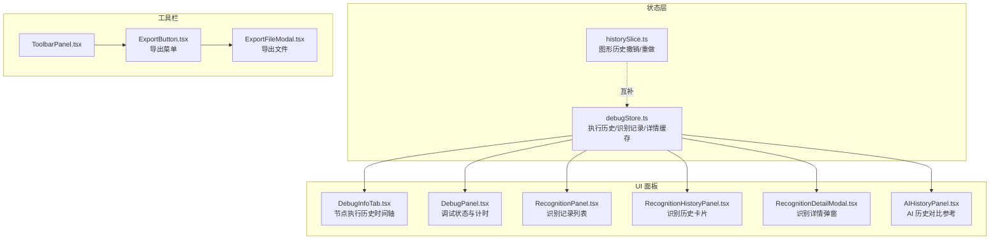
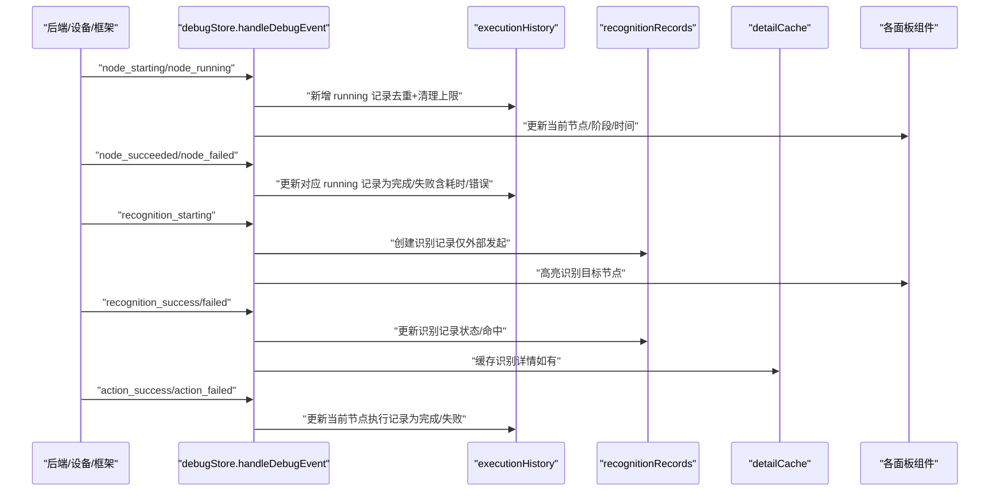
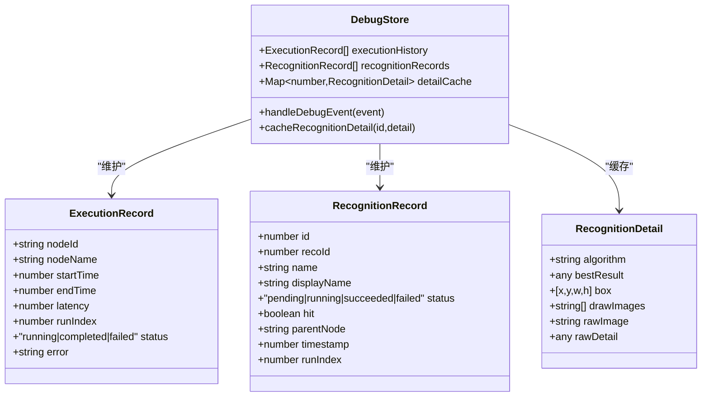
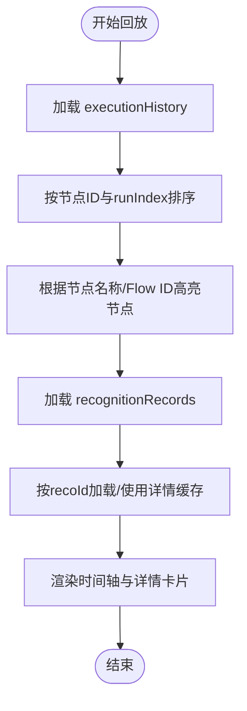
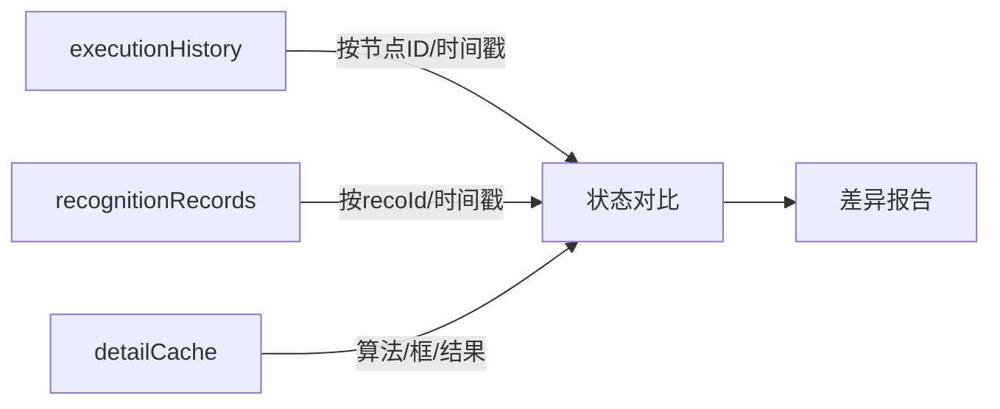
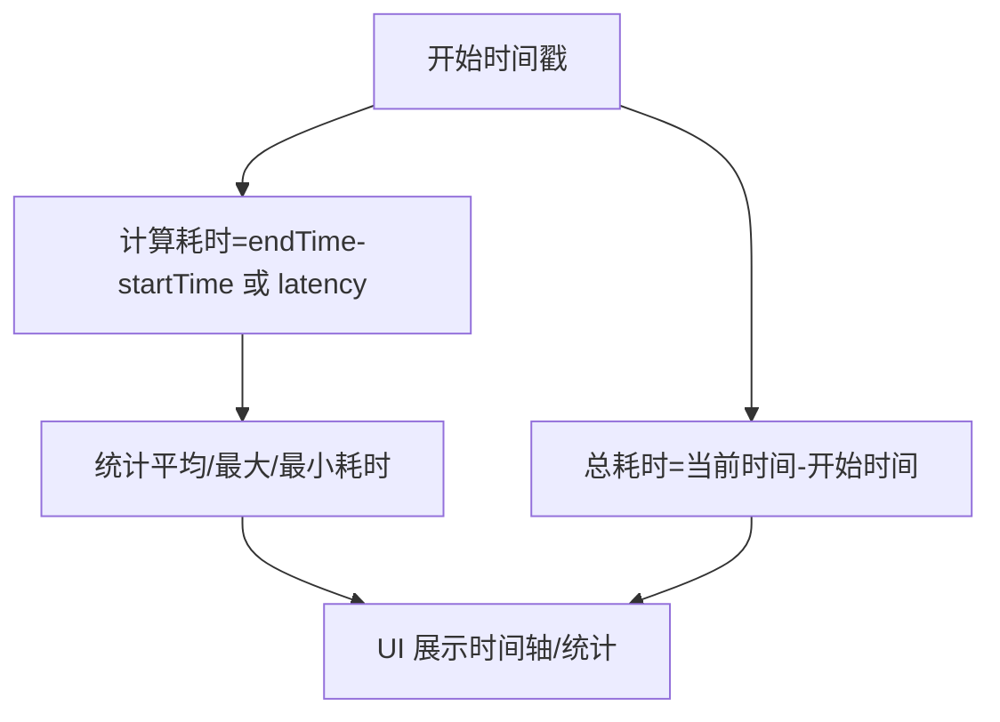
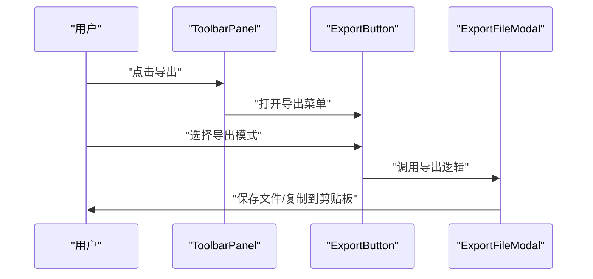
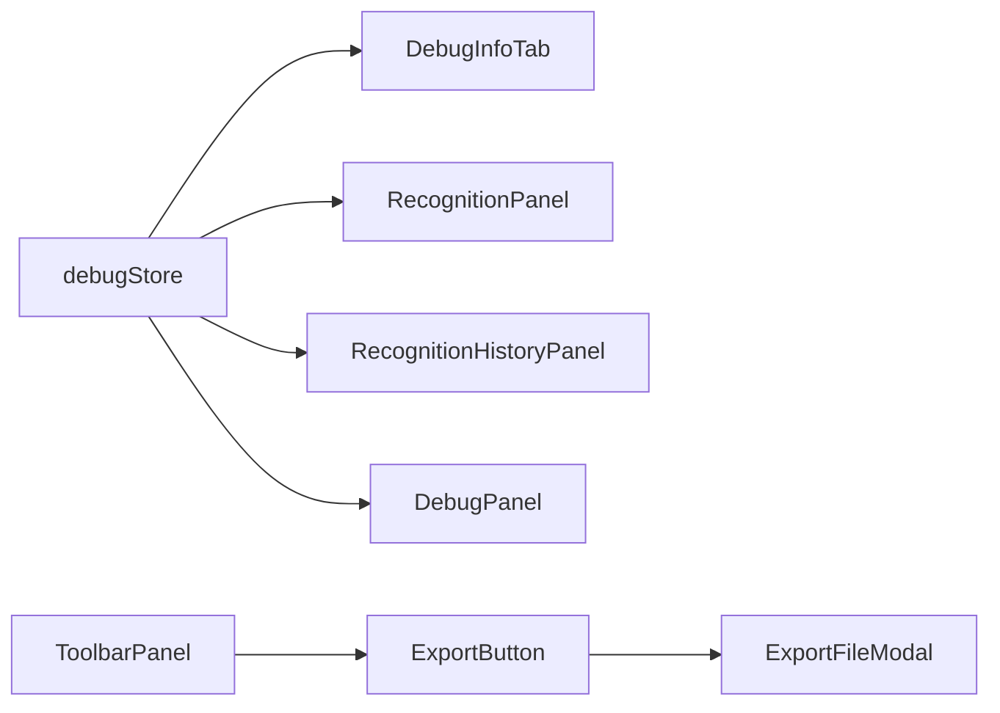

# 执行历史

<cite>
**本文引用的文件**
- [debugStore.ts](file://src/stores/debugStore.ts)
- [DebugInfoTab.tsx](file://src/components/panels/tools/DebugInfoTab.tsx)
- [DebugPanel.tsx](file://src/components/panels/tools/DebugPanel.tsx)
- [RecognitionPanel.tsx](file://src/components/panels/main/RecognitionPanel.tsx)
- [RecognitionHistoryPanel.tsx](file://src/components/panels/main/RecognitionHistoryPanel.tsx)
- [RecognitionDetailModal.tsx](file://src/components/panels/tools/RecognitionDetailModal.tsx)
- [ExportButton.tsx](file://src/components/panels/toolbar/ExportButton.tsx)
- [ExportFileModal.tsx](file://src/components/modals/ExportFileModal.tsx)
- [historySlice.ts](file://src/stores/flow/slices/historySlice.ts)
- [ToolbarPanel.tsx](file://src/components/panels/main/ToolbarPanel.tsx)
- [AIHistoryPanel.tsx](file://src/components/panels/main/AIHistoryPanel.tsx)
</cite>

## 目录
1. [简介](#简介)
2. [项目结构](#项目结构)
3. [核心组件](#核心组件)
4. [架构总览](#架构总览)
5. [详细组件分析](#详细组件分析)
6. [依赖关系分析](#依赖关系分析)
7. [性能考量](#性能考量)
8. [故障排查指南](#故障排查指南)
9. [结论](#结论)
10. [附录](#附录)

## 简介
本文件系统性梳理 MaaPipelineEditor 的“执行历史”体系，覆盖以下主题：
- 历史记录的数据结构与存储机制：节点执行顺序、时间戳、结果与错误、识别记录与详情缓存
- 历史回放与状态恢复：基于执行历史的时间轴与统计，辅助定位问题与复盘
- 状态对比与差异追踪：通过节点执行历史与识别记录的组合，分析节点状态变化
- 性能分析：执行时间统计、节点耗时分析、整体流程耗时评估
- 查询与筛选：按节点、状态、时间范围等维度的过滤能力
- 导出与导入：导出执行历史与识别记录，以及导入导出的整体流程
- 最佳实践与注意事项：内存限制、清理策略、UI 展示与交互建议

## 项目结构
执行历史相关的核心实现分布在以下模块：
- 状态层（Zustand Store）：负责事件驱动的执行历史记录、识别记录与详情缓存
- UI 面板：提供调试信息面板、识别记录面板、识别历史面板与导出工具
- 历史切片：流程图编辑器的图形历史（撤销/重做），与执行历史互补
- 工具栏：统一的导出入口，支持多种导出模式

图表来源
- [debugStore.ts:128-137](file://src/stores/debugStore.ts#L128-L137)
- [historySlice.ts:48-101](file://src/stores/flow/slices/historySlice.ts#L48-L101)
- [DebugInfoTab.tsx:32-175](file://src/components/panels/tools/DebugInfoTab.tsx#L32-L175)
- [DebugPanel.tsx:147-186](file://src/components/panels/tools/DebugPanel.tsx#L147-L186)
- [RecognitionPanel.tsx:1-183](file://src/components/panels/main/RecognitionPanel.tsx#L1-183)
- [RecognitionHistoryPanel.tsx:1-289](file://src/components/panels/main/RecognitionHistoryPanel.tsx#L1-289)
- [RecognitionDetailModal.tsx:1-37](file://src/components/panels/tools/RecognitionDetailModal.tsx#L1-L37)
- [ToolbarPanel.tsx:1-21](file://src/components/panels/main/ToolbarPanel.tsx#L1-L21)
- [ExportButton.tsx:127-315](file://src/components/panels/toolbar/ExportButton.tsx#L127-L315)
- [ExportFileModal.tsx:120-214](file://src/components/modals/ExportFileModal.tsx#L120-L214)

章节来源
- [debugStore.ts:128-137](file://src/stores/debugStore.ts#L128-L137)
- [historySlice.ts:48-101](file://src/stores/flow/slices/historySlice.ts#L48-L101)
- [DebugInfoTab.tsx:32-175](file://src/components/panels/tools/DebugInfoTab.tsx#L32-L175)
- [DebugPanel.tsx:147-186](file://src/components/panels/tools/DebugPanel.tsx#L147-L186)
- [RecognitionPanel.tsx:1-183](file://src/components/panels/main/RecognitionPanel.tsx#L1-L183)
- [RecognitionHistoryPanel.tsx:1-289](file://src/components/panels/main/RecognitionHistoryPanel.tsx#L1-L289)
- [RecognitionDetailModal.tsx:1-37](file://src/components/panels/tools/RecognitionDetailModal.tsx#L1-L37)
- [ToolbarPanel.tsx:1-21](file://src/components/panels/main/ToolbarPanel.tsx#L1-L21)
- [ExportButton.tsx:127-315](file://src/components/panels/toolbar/ExportButton.tsx#L127-L315)
- [ExportFileModal.tsx:120-214](file://src/components/modals/ExportFileModal.tsx#L120-L214)

## 核心组件
- 执行历史（ExecutionRecord）
  - 字段：节点 ID、节点名称、开始时间、结束时间、延迟（latency）、运行索引、状态（running/completed/failed）、错误信息
  - 来源：节点级事件（starting/running/succeeded/failed）与动作事件（action_success/action_failed）
  - 存储：debugStore.executionHistory，带内存上限与清理策略
- 识别记录（RecognitionRecord）
  - 字段：自增 ID、识别 ID、目标节点名、显示名、状态、是否命中、父节点、时间戳、运行索引
  - 来源：识别事件（starting/success/failed），仅记录“外部发起”的识别
  - 存储：debugStore.recognitionRecords，带内存上限与清理策略
- 识别详情缓存（RecognitionDetail）
  - 字段：算法、最佳结果、框、绘制图、原始截图、原始详情
  - 来源：识别成功事件携带的详情，懒加载缓存
  - 存储：debugStore.detailCache，带容量限制与清理策略
- 图形历史（撤销/重做）
  - 字段：nodes/edges 快照堆栈、当前索引、快照序列串
  - 来源：flow/historySlice 的 saveHistory
  - 存储：flowStore.historyStack/historyIndex/lastSnapshot
- 导出与导入
  - 导出：工具栏导出按钮，支持粘贴板、文件、本地服务创建、分离导出等
  - 导入：工具栏导入按钮，支持从剪贴板或文件导入

章节来源
- [debugStore.ts:128-137](file://src/stores/debugStore.ts#L128-L137)
- [debugStore.ts:84-122](file://src/stores/debugStore.ts#L84-L122)
- [debugStore.ts:879-895](file://src/stores/debugStore.ts#L879-L895)
- [historySlice.ts:48-101](file://src/stores/flow/slices/historySlice.ts#L48-L101)
- [ExportButton.tsx:127-315](file://src/components/panels/toolbar/ExportButton.tsx#L127-L315)
- [ExportFileModal.tsx:120-214](file://src/components/modals/ExportFileModal.tsx#L120-L214)

## 架构总览
执行历史系统围绕“事件驱动 + 状态管理 + UI 展示”的闭环构建：

图表来源
- [debugStore.ts:437-794](file://src/stores/debugStore.ts#L437-L794)
- [DebugInfoTab.tsx:32-175](file://src/components/panels/tools/DebugInfoTab.tsx#L32-L175)
- [RecognitionPanel.tsx:1-183](file://src/components/panels/main/RecognitionPanel.tsx#L1-L183)
- [RecognitionDetailModal.tsx:1-37](file://src/components/panels/tools/RecognitionDetailModal.tsx#L1-L37)

## 详细组件分析

### 执行历史数据结构与存储机制
- 数据结构
  - ExecutionRecord：记录单节点一次执行的完整生命周期，包含时间戳、状态、耗时与错误
  - RecognitionRecord：记录一次识别尝试，区分“自我识别”与“外部发起”
  - RecognitionDetail：识别详情的懒加载缓存，避免重复请求与大对象占用
- 存储与清理
  - 执行历史上限与清理比例：超过上限时按比例丢弃最旧记录
  - 识别记录与详情缓存同样具备上限与清理策略
- 事件驱动更新
  - 节点事件：starting/running/succeeded/failed
  - 动作事件：action_success/action_failed
  - 识别事件：starting/success/failed
  - 调试控制事件：paused/completed/error/completed

图表来源
- [debugStore.ts:128-137](file://src/stores/debugStore.ts#L128-L137)
- [debugStore.ts:84-122](file://src/stores/debugStore.ts#L84-L122)
- [debugStore.ts:109-122](file://src/stores/debugStore.ts#L109-L122)
- [debugStore.ts:879-895](file://src/stores/debugStore.ts#L879-L895)

章节来源
- [debugStore.ts:128-137](file://src/stores/debugStore.ts#L128-L137)
- [debugStore.ts:84-122](file://src/stores/debugStore.ts#L84-L122)
- [debugStore.ts:879-895](file://src/stores/debugStore.ts#L879-L895)

### 历史回放与状态恢复
- 回放思路
  - 以 executionHistory 为依据，按节点 ID 与 runIndex 组合，重建节点执行顺序
  - 通过节点名称与 Flow ID 的映射，恢复节点高亮与识别目标
  - 利用 DebugInfoTab 的时间轴展示，结合识别记录与详情，还原识别过程
- 状态恢复要点
  - 识别记录的命中状态与识别详情缓存，有助于回放时判断识别是否成功
  - 调试完成事件触发后，running 状态会被统一标记为 completed，便于一致性回放

图表来源
- [debugStore.ts:437-794](file://src/stores/debugStore.ts#L437-L794)
- [DebugInfoTab.tsx:32-175](file://src/components/panels/tools/DebugInfoTab.tsx#L32-L175)
- [RecognitionDetailModal.tsx:1-37](file://src/components/panels/tools/RecognitionDetailModal.tsx#L1-L37)

章节来源
- [debugStore.ts:437-794](file://src/stores/debugStore.ts#L437-L794)
- [DebugInfoTab.tsx:32-175](file://src/components/panels/tools/DebugInfoTab.tsx#L32-L175)
- [RecognitionDetailModal.tsx:1-37](file://src/components/panels/tools/RecognitionDetailModal.tsx#L1-L37)

### 状态对比与差异追踪
- 节点状态对比
  - 通过 DebugInfoTab 的时间轴，对比同一节点不同 runIndex 的状态、耗时与错误
  - 识别记录与识别详情的组合，可用于对比识别命中与算法差异
- 差异追踪
  - executionHistory 与 recognitionRecords 的时间戳对齐，定位异常发生的时间窗口
  - 识别详情缓存可帮助快速比对前后两次识别的算法与结果差异

图表来源
- [debugStore.ts:437-794](file://src/stores/debugStore.ts#L437-L794)
- [DebugInfoTab.tsx:32-175](file://src/components/panels/tools/DebugInfoTab.tsx#L32-L175)
- [RecognitionPanel.tsx:1-183](file://src/components/panels/main/RecognitionPanel.tsx#L1-L183)

章节来源
- [debugStore.ts:437-794](file://src/stores/debugStore.ts#L437-L794)
- [DebugInfoTab.tsx:32-175](file://src/components/panels/tools/DebugInfoTab.tsx#L32-L175)
- [RecognitionPanel.tsx:1-183](file://src/components/panels/main/RecognitionPanel.tsx#L1-L183)

### 性能分析
- 节点耗时分析
  - 优先使用 latency 字段；若缺失，则 endTime - startTime 作为耗时
  - DebugInfoTab 的时间轴项展示每个 runIndex 的耗时
- 整体流程耗时
  - DebugPanel 提供调试会话总时长统计
  - executionStartTime 与当前时间差值用于实时计时
- 识别性能
  - recognitionRecords 的 runIndex 与 hit 状态，配合识别详情，评估识别效率与稳定性

图表来源
- [DebugInfoTab.tsx:66-90](file://src/components/panels/tools/DebugInfoTab.tsx#L66-L90)
- [DebugPanel.tsx:147-186](file://src/components/panels/tools/DebugPanel.tsx#L147-L186)

章节来源
- [DebugInfoTab.tsx:66-90](file://src/components/panels/tools/DebugInfoTab.tsx#L66-L90)
- [DebugPanel.tsx:147-186](file://src/components/panels/tools/DebugPanel.tsx#L147-L186)

### 查询与筛选
- 节点级筛选
  - DebugInfoTab 支持按选中节点过滤执行历史，聚焦单一节点的多次运行
- 识别记录筛选
  - RecognitionPanel 与 RecognitionHistoryPanel 支持分页与倒序展示
  - 可按状态（pending/running/succeeded/failed）与命中情况筛选
- 识别详情查看
  - RecognitionDetailModal 通过 selectedRecoId 与 detailCache 提供识别详情查看

章节来源
- [DebugInfoTab.tsx:32-53](file://src/components/panels/tools/DebugInfoTab.tsx#L32-L53)
- [RecognitionPanel.tsx:140-183](file://src/components/panels/main/RecognitionPanel.tsx#L140-L183)
- [RecognitionHistoryPanel.tsx:170-289](file://src/components/panels/main/RecognitionHistoryPanel.tsx#L170-L289)
- [RecognitionDetailModal.tsx:1-37](file://src/components/panels/tools/RecognitionDetailModal.tsx#L1-L37)

### 导出与导入
- 导出
  - 工具栏 ExportButton 提供多种导出模式：粘贴板、文件、本地服务创建、分离导出（Pipeline/Config）
  - ExportFileModal 支持 File System Access API 与传统下载两种方式
- 导入
  - 工具栏 ImportButton 提供从剪贴板或文件导入的功能入口（具体实现位于导入相关文件）

图表来源
- [ToolbarPanel.tsx:1-21](file://src/components/panels/main/ToolbarPanel.tsx#L1-L21)
- [ExportButton.tsx:127-315](file://src/components/panels/toolbar/ExportButton.tsx#L127-L315)
- [ExportFileModal.tsx:120-214](file://src/components/modals/ExportFileModal.tsx#L120-L214)

章节来源
- [ToolbarPanel.tsx:1-21](file://src/components/panels/main/ToolbarPanel.tsx#L1-L21)
- [ExportButton.tsx:127-315](file://src/components/panels/toolbar/ExportButton.tsx#L127-L315)
- [ExportFileModal.tsx:120-214](file://src/components/modals/ExportFileModal.tsx#L120-L214)

### 图形历史（撤销/重做）与执行历史的关系
- 图形历史（historySlice）
  - 保存 nodes/edges 快照，支持撤销/重做
  - 与执行历史互补：前者关注“结构变化”，后者关注“执行行为”
- 使用建议
  - 在调试过程中，图形历史用于回退结构修改；执行历史用于回溯执行过程

章节来源
- [historySlice.ts:48-101](file://src/stores/flow/slices/historySlice.ts#L48-L101)

## 依赖关系分析
- debugStore 与各 UI 组件的依赖
  - DebugInfoTab 依赖 executionHistory、executionStartTime、recognitionRecords
  - RecognitionPanel/RecognitionHistoryPanel 依赖 recognitionRecords 与 detailCache
  - DebugPanel 依赖 executionStartTime 与调试状态
- 导出链路
  - ToolbarPanel -> ExportButton -> ExportFileModal
  - 导出内容与当前工作区状态相关，执行历史与识别记录可作为导出对象之一

图表来源
- [debugStore.ts:437-794](file://src/stores/debugStore.ts#L437-L794)
- [DebugInfoTab.tsx:32-175](file://src/components/panels/tools/DebugInfoTab.tsx#L32-L175)
- [RecognitionPanel.tsx:1-183](file://src/components/panels/main/RecognitionPanel.tsx#L1-L183)
- [RecognitionHistoryPanel.tsx:1-289](file://src/components/panels/main/RecognitionHistoryPanel.tsx#L1-L289)
- [DebugPanel.tsx:147-186](file://src/components/panels/tools/DebugPanel.tsx#L147-L186)
- [ToolbarPanel.tsx:1-21](file://src/components/panels/main/ToolbarPanel.tsx#L1-L21)
- [ExportButton.tsx:127-315](file://src/components/panels/toolbar/ExportButton.tsx#L127-L315)
- [ExportFileModal.tsx:120-214](file://src/components/modals/ExportFileModal.tsx#L120-L214)

章节来源
- [debugStore.ts:437-794](file://src/stores/debugStore.ts#L437-L794)
- [DebugInfoTab.tsx:32-175](file://src/components/panels/tools/DebugInfoTab.tsx#L32-L175)
- [RecognitionPanel.tsx:1-183](file://src/components/panels/main/RecognitionPanel.tsx#L1-L183)
- [RecognitionHistoryPanel.tsx:1-289](file://src/components/panels/main/RecognitionHistoryPanel.tsx#L1-L289)
- [DebugPanel.tsx:147-186](file://src/components/panels/tools/DebugPanel.tsx#L147-L186)
- [ToolbarPanel.tsx:1-21](file://src/components/panels/main/ToolbarPanel.tsx#L1-L21)
- [ExportButton.tsx:127-315](file://src/components/panels/toolbar/ExportButton.tsx#L127-L315)
- [ExportFileModal.tsx:120-214](file://src/components/modals/ExportFileModal.tsx#L120-L214)

## 性能考量
- 内存限制与清理
  - 执行历史、识别记录、详情缓存均设置上限与清理比例，避免内存膨胀
  - 建议在长时间调试或高频识别场景下，适当降低日志级别或减少识别频率
- UI 渲染优化
  - 时间轴与列表采用分页与倒序展示，提升大数据量下的交互流畅度
- 导出性能
  - 导出文件采用二进制或压缩策略（如可用）可降低体积与传输时间

## 故障排查指南
- 执行历史为空
  - 确认已开始调试且收到节点事件；检查 handleDebugEvent 的分支是否正确处理
- 识别记录不显示
  - 仅“外部发起”的识别会被记录；确认识别事件携带了父节点信息
- 识别详情缺失
  - 检查识别详情缓存是否命中；必要时重新触发识别或清理缓存
- 导出失败
  - 若 File System Access API 失败，系统会回退到传统下载；检查浏览器兼容性与权限

章节来源
- [debugStore.ts:437-794](file://src/stores/debugStore.ts#L437-L794)
- [RecognitionDetailModal.tsx:1-37](file://src/components/panels/tools/RecognitionDetailModal.tsx#L1-L37)
- [ExportFileModal.tsx:120-214](file://src/components/modals/ExportFileModal.tsx#L120-L214)

## 结论
执行历史系统通过清晰的数据结构与严格的事件驱动机制，实现了对节点执行过程的完整记录与高效回放。配合识别记录与详情缓存，能够满足状态对比、差异追踪与性能分析的需求。在实际使用中，建议结合图形历史进行结构与行为的双重回溯，并利用导出能力沉淀分析结果。

## 附录
- 术语
  - 执行历史：节点执行记录集合
  - 识别记录：识别尝试记录集合
  - 识别详情：识别算法与结果的缓存
  - 图形历史：节点/边结构变更的历史快照
- 相关面板与组件
  - DebugInfoTab：节点执行历史时间轴与统计
  - RecognitionPanel/RecognitionHistoryPanel：识别记录与历史
  - RecognitionDetailModal：识别详情查看
  - DebugPanel：调试状态与计时
  - ToolbarPanel/ExportButton/ExportFileModal：导出能力