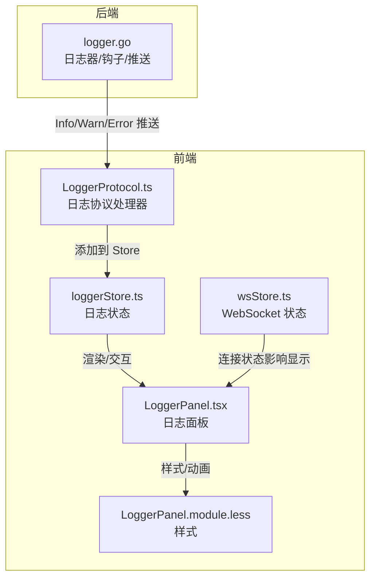
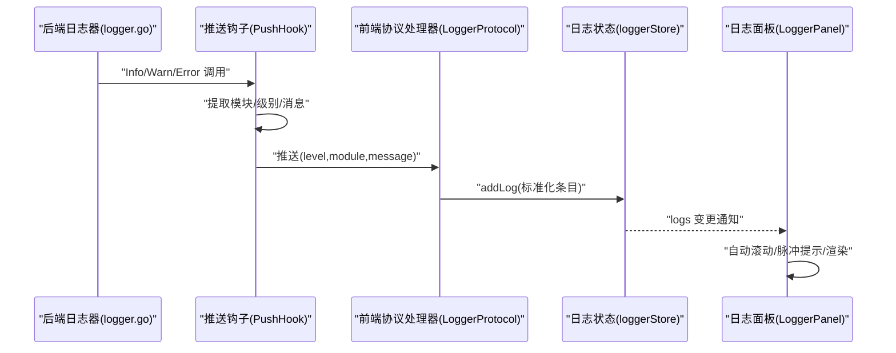
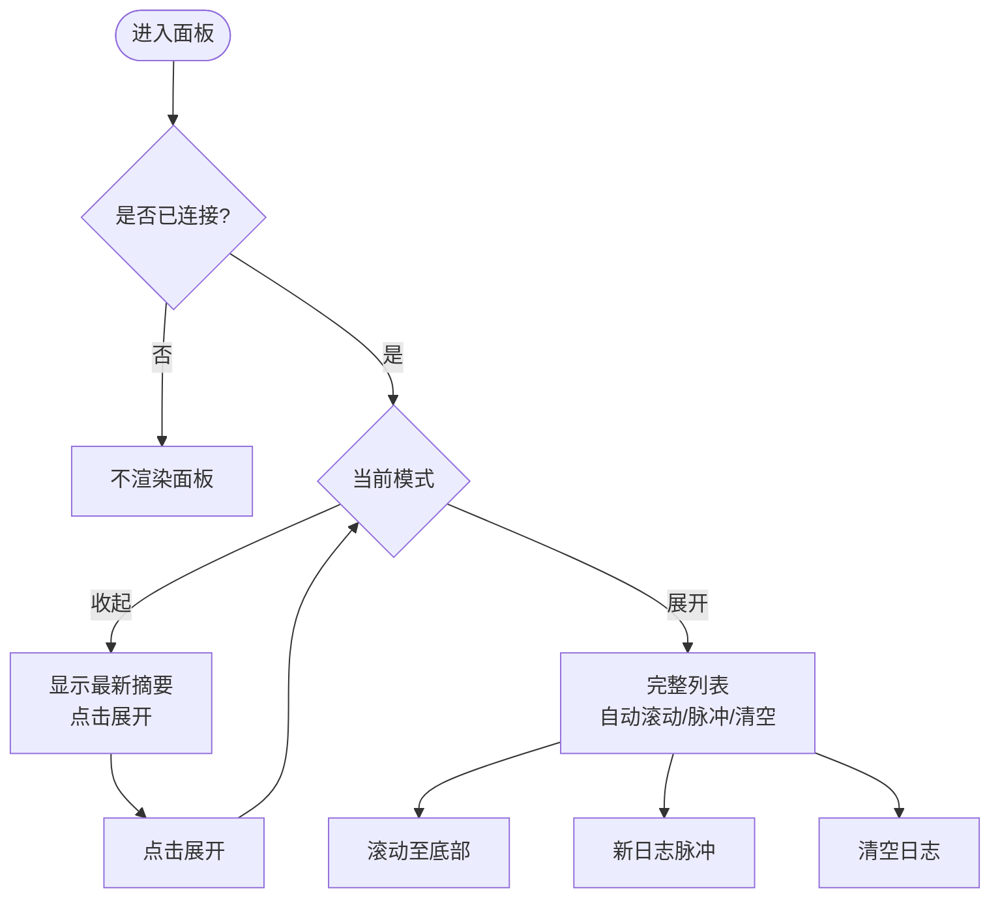
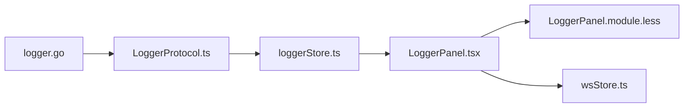
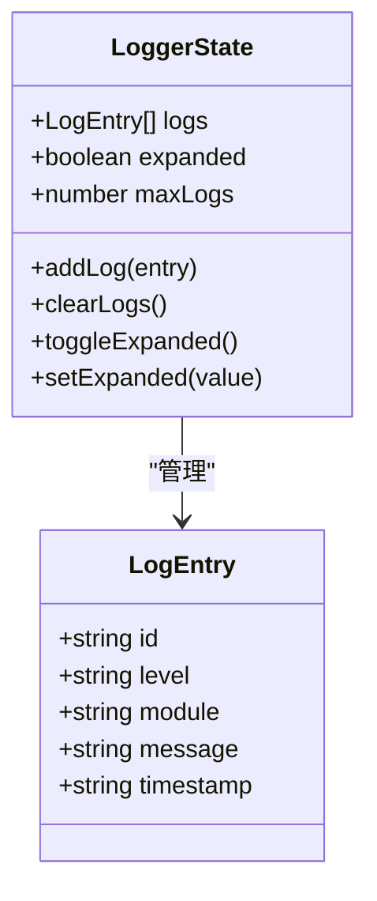

# 日志系统

<cite>
**本文引用的文件**
- [loggerStore.ts](file://src/stores/loggerStore.ts)
- [LoggerPanel.tsx](file://src/components/panels/tools/LoggerPanel.tsx)
- [LoggerPanel.module.less](file://src/styles/LoggerPanel.module.less)
- [LoggerProtocol.ts](file://src/services/protocols/LoggerProtocol.ts)
- [wsStore.ts](file://src/stores/wsStore.ts)
- [logger.go](file://LocalBridge/internal/logger/logger.go)
- [ExportFileModal.tsx](file://src/components/modals/ExportFileModal.tsx)
</cite>

## 目录
1. [简介](#简介)
2. [项目结构](#项目结构)
3. [核心组件](#核心组件)
4. [架构总览](#架构总览)
5. [详细组件分析](#详细组件分析)
6. [依赖分析](#依赖分析)
7. [性能考量](#性能考量)
8. [故障排查指南](#故障排查指南)
9. [结论](#结论)
10. [附录](#附录)

## 简介
本文件系统性梳理 MaaPipelineEditor 的日志系统，覆盖日志级别体系、采集机制、实时传输、过滤与搜索、展示界面、导出能力、分析技巧、配置项与性能优化，以及最佳实践与故障排查建议。目标是帮助开发者与用户高效理解与使用日志系统。

## 项目结构
日志系统由前端 Store、协议处理器、WebSocket 状态、后端日志器与样式模块共同组成，形成“后端产生 -> 前端接收 -> 前端展示”的闭环。

图表来源
- [loggerStore.ts:1-46](file://src/stores/loggerStore.ts#L1-L46)
- [LoggerPanel.tsx:1-182](file://src/components/panels/tools/LoggerPanel.tsx#L1-L182)
- [LoggerPanel.module.less:1-272](file://src/styles/LoggerPanel.module.less#L1-L272)
- [LoggerProtocol.ts:1-58](file://src/services/protocols/LoggerProtocol.ts#L1-L58)
- [wsStore.ts:1-24](file://src/stores/wsStore.ts#L1-L24)
- [logger.go:1-251](file://LocalBridge/internal/logger/logger.go#L1-L251)

章节来源
- [loggerStore.ts:1-46](file://src/stores/loggerStore.ts#L1-L46)
- [LoggerPanel.tsx:1-182](file://src/components/panels/tools/LoggerPanel.tsx#L1-L182)
- [LoggerPanel.module.less:1-272](file://src/styles/LoggerPanel.module.less#L1-L272)
- [LoggerProtocol.ts:1-58](file://src/services/protocols/LoggerProtocol.ts#L1-L58)
- [wsStore.ts:1-24](file://src/stores/wsStore.ts#L1-L24)
- [logger.go:1-251](file://LocalBridge/internal/logger/logger.go#L1-L251)

## 核心组件
- 日志状态与数据模型：前端通过 Zustand 管理日志列表、展开状态与容量上限，统一存储日志条目。
- 协议处理器：负责接收后端推送的日志消息，标准化级别与字段，并写入前端 Store。
- 日志面板：提供收起/展开两种形态，支持自动滚动、脉冲提示、清空日志等交互。
- WebSocket 状态：控制日志面板在未连接时隐藏，保证只在有效会话中展示。
- 后端日志器：基于 logrus 构建，支持模块字段、级别过滤、历史缓存、文件落盘与旧日志清理。

章节来源
- [loggerStore.ts:1-46](file://src/stores/loggerStore.ts#L1-L46)
- [LoggerPanel.tsx:1-182](file://src/components/panels/tools/LoggerPanel.tsx#L1-L182)
- [LoggerProtocol.ts:1-58](file://src/services/protocols/LoggerProtocol.ts#L1-L58)
- [wsStore.ts:1-24](file://src/stores/wsStore.ts#L1-L24)
- [logger.go:1-251](file://LocalBridge/internal/logger/logger.go#L1-L251)

## 架构总览
后端日志器通过钩子将 Info/Warn/Error 级别日志推送到前端；前端协议处理器解析并写入 Store；日志面板订阅 Store 并渲染；WebSocket 状态决定面板可见性。

图表来源
- [logger.go:136-162](file://LocalBridge/internal/logger/logger.go#L136-L162)
- [LoggerProtocol.ts:25-56](file://src/services/protocols/LoggerProtocol.ts#L25-L56)
- [loggerStore.ts:21-45](file://src/stores/loggerStore.ts#L21-L45)
- [LoggerPanel.tsx:55-181](file://src/components/panels/tools/LoggerPanel.tsx#L55-L181)

## 详细组件分析

### 日志级别体系
- 支持级别：INFO、WARN、ERROR（后端还具备 DEBUG/TRACE，但仅推送 INFO/WARN/ERROR 到前端）。
- 使用场景：
  - INFO：常规流程提示、状态变更、成功结果。
  - WARN：潜在风险或异常但可恢复的情况。
  - ERROR：失败、异常、不可恢复问题。
- 前端标准化：协议处理器将收到的级别转为大写并限定在上述集合内，非预期值被忽略。

章节来源
- [logger.go:164-201](file://LocalBridge/internal/logger/logger.go#L164-L201)
- [LoggerProtocol.ts:43-47](file://src/services/protocols/LoggerProtocol.ts#L43-L47)

### 日志收集机制
- 后端采集：
  - 控制台日志器：按配置级别输出，启用推送钩子时将日志推送到前端。
  - 文件日志器：按日期生成文件，保留 Trace 级别，便于离线分析。
  - 历史缓存：维护固定长度的内存缓冲，避免丢失最近日志。
  - 旧日志清理：按天数策略清理过期日志文件。
- 前端接收：
  - 协议处理器注册路由，接收后端推送，标准化后写入 Store。
- 实时流处理：
  - Store 以固定上限截断日志队列，避免内存膨胀。
  - 面板监听 logs 变化，自动滚动至底部，保持最新日志可视。

章节来源
- [logger.go:43-100](file://LocalBridge/internal/logger/logger.go#L43-L100)
- [logger.go:107-134](file://LocalBridge/internal/logger/logger.go#L107-L134)
- [logger.go:208-250](file://LocalBridge/internal/logger/logger.go#L208-L250)
- [LoggerProtocol.ts:25-56](file://src/services/protocols/LoggerProtocol.ts#L25-L56)
- [loggerStore.ts:26-38](file://src/stores/loggerStore.ts#L26-L38)
- [LoggerPanel.tsx:63-68](file://src/components/panels/tools/LoggerPanel.tsx#L63-L68)

### 日志过滤与搜索
- 当前实现：
  - 按级别过滤：前端未内置按级别筛选 UI，但可通过模块字段进行逻辑分组查看。
  - 关键字搜索：未提供专用搜索框；可结合浏览器查找或外部工具。
  - 时间范围筛选：未提供时间控件。
- 建议扩展：
  - 在面板顶部增加下拉选择“全部/仅 INFO/WARN/ERROR”。
  - 增加文本搜索框，支持模块与消息字段模糊匹配。
  - 提供时间范围选择器，配合后端日志时间戳进行过滤。

章节来源
- [LoggerPanel.tsx:55-181](file://src/components/panels/tools/LoggerPanel.tsx#L55-L181)
- [loggerStore.ts:3-9](file://src/stores/loggerStore.ts#L3-L9)

### 日志展示界面
- 形态切换：
  - 收起态：仅显示最新一条日志摘要（图标、模块、简短消息），点击展开。
  - 展开态：完整列表，支持清空、收起。
- 交互细节：
  - 自动滚动：展开且处于底部时自动滚动至最新日志。
  - 脉冲提示：新日志到达且面板收起时，触发短暂脉冲动画提醒。
  - 滚动控制：手动滚动至顶部时暂停自动滚动，回到底部时恢复。
- 视觉设计：
  - 不同级别使用统一色系标识，模块与消息字体分级，空状态友好提示。
  - 收起态圆角卡片、阴影与悬停效果，提升可用性。

图表来源
- [LoggerPanel.tsx:55-181](file://src/components/panels/tools/LoggerPanel.tsx#L55-L181)
- [wsStore.ts:18-23](file://src/stores/wsStore.ts#L18-L23)

章节来源
- [LoggerPanel.tsx:55-181](file://src/components/panels/tools/LoggerPanel.tsx#L55-L181)
- [LoggerPanel.module.less:1-272](file://src/styles/LoggerPanel.module.less#L1-L272)
- [wsStore.ts:18-23](file://src/stores/wsStore.ts#L18-L23)

### 日志导出功能
- 现状：
  - 导出文件模态框支持 JSON 格式，提供文件名预览与下载。
  - 采用现代文件系统 API 写入优先，失败回退到传统下载。
- 适配建议：
  - 扩展日志导出：支持将当前 Store 中的日志导出为 JSON 或纯文本。
  - 增加时间范围选择：导出指定时间段内的日志。
  - 增加按级别过滤：仅导出 INFO/WARN/ERROR。
  - 增加文件命名规则：包含时间戳、模块前缀等。

章节来源
- [ExportFileModal.tsx:163-188](file://src/components/modals/ExportFileModal.tsx#L163-L188)
- [ExportFileModal.tsx:248-254](file://src/components/modals/ExportFileModal.tsx#L248-L254)

### 日志分析技巧
- 关键信息提取：
  - 依据模块字段快速定位来源模块，结合消息内容判断业务阶段。
  - 使用级别区分：ERROR 优先处理，WARN 跟踪趋势，INFO 辅助复盘。
- 问题定位方法：
  - 串联时间线：利用时间戳与模块组合定位问题链路。
  - 结合后端日志文件：DEBUG/TRACE 有助于深入分析。
- 性能分析要点：
  - 观察日志密度与面板滚动性能，必要时降低日志量或提高 maxLogs 截断阈值。
  - 在高频场景下，优先关注 ERROR/WARN，减少 INFO 干扰。

章节来源
- [logger.go:189-201](file://LocalBridge/internal/logger/logger.go#L189-L201)
- [loggerStore.ts:22-24](file://src/stores/loggerStore.ts#L22-L24)

### 配置选项与性能考虑
- 后端配置：
  - 日志级别：控制台输出级别，影响推送频率与体积。
  - 日志目录：开启文件落盘，按日期生成日志文件，保留 Trace 级别。
  - 历史缓存：固定长度缓冲，避免内存无限增长。
  - 旧日志清理：按天数策略清理过期文件，默认保留 3 天。
- 前端配置：
  - 最大日志数：默认 100 条，超出则截断保留尾部。
  - 展示形态：收起态轻量化，展开态完整信息。
- 性能建议：
  - 在调试阶段可临时提高日志级别以获取更多信息，发布版本建议回归 INFO/WARN/ERROR。
  - 高频日志场景下，建议在后端按模块限流或合并重复日志。

章节来源
- [logger.go:43-100](file://LocalBridge/internal/logger/logger.go#L43-L100)
- [logger.go:107-134](file://LocalBridge/internal/logger/logger.go#L107-L134)
- [logger.go:208-250](file://LocalBridge/internal/logger/logger.go#L208-L250)
- [loggerStore.ts:22-24](file://src/stores/loggerStore.ts#L22-L24)

## 依赖分析
- 组件耦合：
  - LoggerProtocol 依赖 WebSocket 服务器与 loggerStore。
  - LoggerPanel 依赖 loggerStore 与 wsStore，样式独立。
  - 后端 logger.go 依赖 logrus，提供推送钩子与历史缓存。
- 可能的循环依赖：
  - 当前文件间无直接循环依赖，协议与 Store 通过消息解耦。
- 外部依赖：
  - logrus：日志格式化与级别控制。
  - Ant Design Icons：图标渲染。
  - Less：样式模块化。

图表来源
- [logger.go:1-251](file://LocalBridge/internal/logger/logger.go#L1-L251)
- [LoggerProtocol.ts:1-58](file://src/services/protocols/LoggerProtocol.ts#L1-L58)
- [loggerStore.ts:1-46](file://src/stores/loggerStore.ts#L1-L46)
- [LoggerPanel.tsx:1-182](file://src/components/panels/tools/LoggerPanel.tsx#L1-L182)
- [LoggerPanel.module.less:1-272](file://src/styles/LoggerPanel.module.less#L1-L272)
- [wsStore.ts:1-24](file://src/stores/wsStore.ts#L1-L24)

章节来源
- [logger.go:1-251](file://LocalBridge/internal/logger/logger.go#L1-L251)
- [LoggerProtocol.ts:1-58](file://src/services/protocols/LoggerProtocol.ts#L1-L58)
- [loggerStore.ts:1-46](file://src/stores/loggerStore.ts#L1-L46)
- [LoggerPanel.tsx:1-182](file://src/components/panels/tools/LoggerPanel.tsx#L1-L182)
- [LoggerPanel.module.less:1-272](file://src/styles/LoggerPanel.module.less#L1-L272)
- [wsStore.ts:1-24](file://src/stores/wsStore.ts#L1-L24)

## 性能考量
- 后端侧：
  - 推送钩子仅对 INFO/WARN/ERROR 推送，降低前端压力。
  - 历史缓冲固定长度，避免内存泄漏。
  - 文件落盘 Trace 级别，便于离线分析但需注意磁盘占用。
- 前端侧：
  - Store 截断策略限制日志数量，避免 DOM 过大。
  - 自动滚动仅在展开且处于底部时生效，减少不必要的重排。
  - 收起态轻量渲染，适合长时间驻留。

章节来源
- [logger.go:136-162](file://LocalBridge/internal/logger/logger.go#L136-L162)
- [logger.go:107-134](file://LocalBridge/internal/logger/logger.go#L107-L134)
- [loggerStore.ts:26-38](file://src/stores/loggerStore.ts#L26-L38)
- [LoggerPanel.tsx:63-68](file://src/components/panels/tools/LoggerPanel.tsx#L63-L68)

## 故障排查指南
- 面板不显示日志：
  - 检查 WebSocket 是否连接（未连接时面板隐藏）。
  - 确认后端是否启用推送钩子与正确的日志级别。
- 日志过多导致卡顿：
  - 降低日志级别或在后端按模块限流。
  - 调整前端 maxLogs，或暂时收起面板减少渲染。
- 日志缺失：
  - 检查后端文件日志是否正常生成与旧日志清理策略。
  - 确认协议处理器是否正确注册路由与标准化级别。
- 导出失败：
  - 若现代文件系统 API 失败，回退到传统下载方式。
  - 检查文件名合法性与目标路径权限。

章节来源
- [wsStore.ts:18-23](file://src/stores/wsStore.ts#L18-L23)
- [LoggerPanel.tsx:95-98](file://src/components/panels/tools/LoggerPanel.tsx#L95-L98)
- [logger.go:60-63](file://LocalBridge/internal/logger/logger.go#L60-L63)
- [LoggerProtocol.ts:25-30](file://src/services/protocols/LoggerProtocol.ts#L25-L30)
- [ExportFileModal.tsx:168-188](file://src/components/modals/ExportFileModal.tsx#L168-L188)

## 结论
该日志系统以“后端产生 + 前端接收 + 前端展示”为核心，具备清晰的级别体系、稳定的实时传输与简洁的交互体验。建议后续增强前端过滤与搜索能力、完善日志导出格式与范围选择，并持续优化性能与可维护性。

## 附录
- 数据模型（前端 Store）

图表来源
- [loggerStore.ts:3-19](file://src/stores/loggerStore.ts#L3-L19)