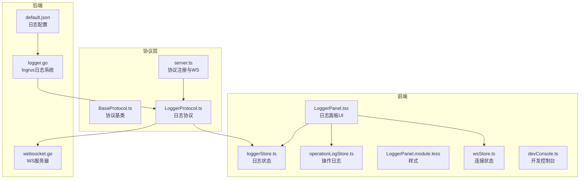
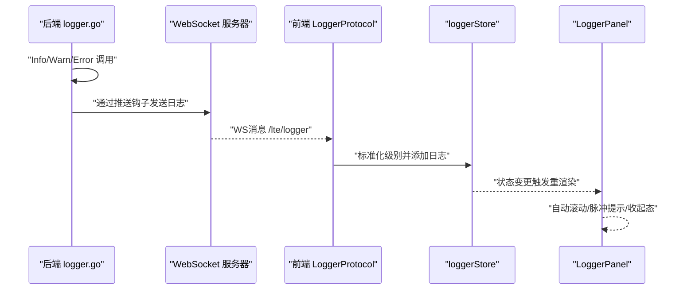
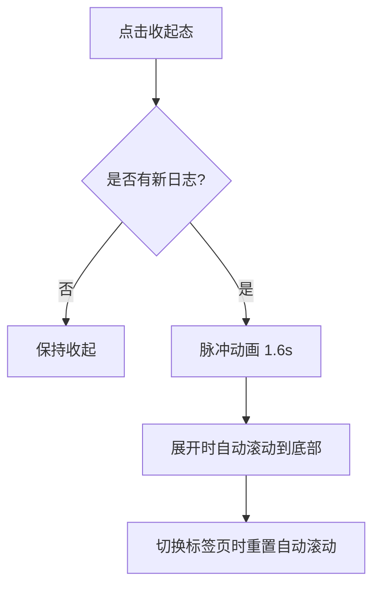
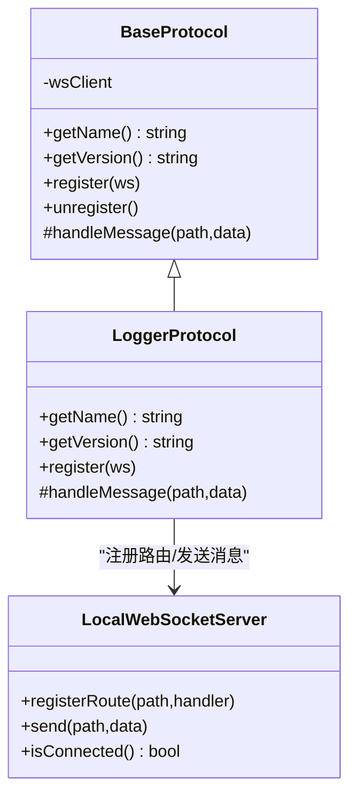
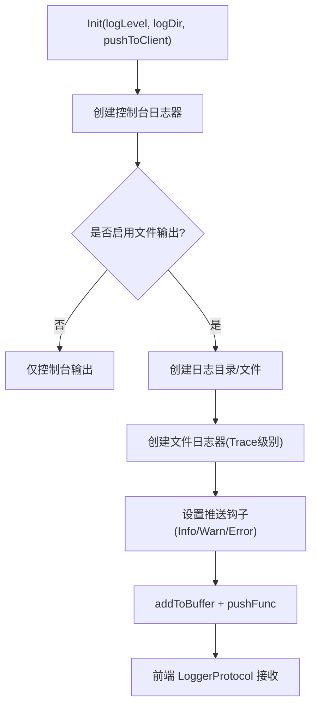
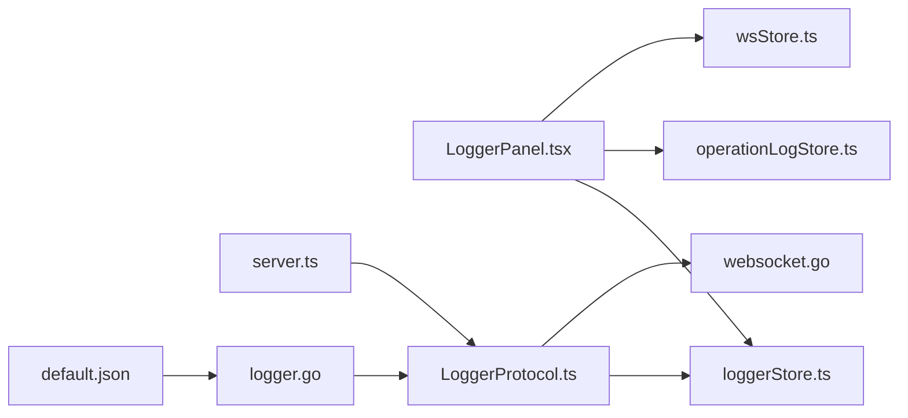

# 日志系统

<cite>
**本文引用的文件**
- [loggerStore.ts](file://src/stores/loggerStore.ts)
- [LoggerPanel.tsx](file://src/components/panels/tools/LoggerPanel.tsx)
- [LoggerProtocol.ts](file://src/services/protocols/LoggerProtocol.ts)
- [server.ts](file://src/services/server.ts)
- [operationLogStore.ts](file://src/stores/operationLogStore.ts)
- [wsStore.ts](file://src/stores/wsStore.ts)
- [LoggerPanel.module.less](file://src/styles/panels/LoggerPanel.module.less)
- [devConsole.ts](file://src/utils/devConsole.ts)
- [logger.go](file://LocalBridge/internal/logger/logger.go)
- [default.json](file://LocalBridge/config/default.json)
- [websocket.go](file://LocalBridge/internal/server/websocket.go)
- [BaseProtocol.ts](file://src/services/protocols/BaseProtocol.ts)
</cite>

## 目录
1. [简介](#简介)
2. [项目结构](#项目结构)
3. [核心组件](#核心组件)
4. [架构总览](#架构总览)
5. [组件详解](#组件详解)
6. [依赖关系分析](#依赖关系分析)
7. [性能与内存优化](#性能与内存优化)
8. [故障排查指南](#故障排查指南)
9. [结论](#结论)
10. [附录](#附录)

## 简介
本文件为“日志系统”的完整技术文档，围绕前端日志面板、后端日志推送与持久化、协议集成与调试控制台展开，系统性说明多级别日志记录机制的设计与实现，涵盖日志存储、过滤与检索思路、UI 交互逻辑、开发控制台调试输出、日志级别分类与应用场景、配置项与自定义格式化建议，以及性能优化与内存管理策略，并阐明日志系统与调试协议的集成关系。

## 项目结构
日志系统由三部分组成：
- 前端：日志状态管理、日志面板 UI、操作日志与后端日志双标签页、自动滚动与脉冲提示等交互逻辑
- 协议层：基于 WebSocket 的日志协议，负责接收后端推送的日志并注入前端状态
- 后端：基于 logrus 的日志系统，支持控制台输出、文件落盘、历史缓冲与推送钩子

图表来源
- [loggerStore.ts:1-46](file://src/stores/loggerStore.ts#L1-L46)
- [LoggerPanel.tsx:1-316](file://src/components/panels/tools/LoggerPanel.tsx#L1-L316)
- [LoggerProtocol.ts:1-58](file://src/services/protocols/LoggerProtocol.ts#L1-L58)
- [server.ts:344-387](file://src/services/server.ts#L344-L387)
- [operationLogStore.ts:1-52](file://src/stores/operationLogStore.ts#L1-L52)
- [wsStore.ts:1-24](file://src/stores/wsStore.ts#L1-L24)
- [devConsole.ts:1-52](file://src/utils/devConsole.ts#L1-L52)
- [logger.go:1-237](file://LocalBridge/internal/logger/logger.go#L1-L237)
- [default.json:1-29](file://LocalBridge/config/default.json#L1-L29)
- [websocket.go:1-58](file://LocalBridge/internal/server/websocket.go#L1-L58)
- [BaseProtocol.ts:1-39](file://src/services/protocols/BaseProtocol.ts#L1-L39)

章节来源
- [loggerStore.ts:1-46](file://src/stores/loggerStore.ts#L1-L46)
- [LoggerPanel.tsx:1-316](file://src/components/panels/tools/LoggerPanel.tsx#L1-L316)
- [LoggerProtocol.ts:1-58](file://src/services/protocols/LoggerProtocol.ts#L1-L58)
- [server.ts:344-387](file://src/services/server.ts#L344-L387)
- [operationLogStore.ts:1-52](file://src/stores/operationLogStore.ts#L1-L52)
- [wsStore.ts:1-24](file://src/stores/wsStore.ts#L1-L24)
- [devConsole.ts:1-52](file://src/utils/devConsole.ts#L1-L52)
- [logger.go:1-237](file://LocalBridge/internal/logger/logger.go#L1-L237)
- [default.json:1-29](file://LocalBridge/config/default.json#L1-L29)
- [websocket.go:1-58](file://LocalBridge/internal/server/websocket.go#L1-L58)
- [BaseProtocol.ts:1-39](file://src/services/protocols/BaseProtocol.ts#L1-L39)

## 核心组件
- 前端日志状态与面板
  - 日志状态：统一管理日志列表、展开/收起状态、最大条数限制
  - 日志面板：双标签页（操作日志/后端日志），自动滚动、脉冲提示、清空、点击跳转
- 协议与连接
  - LoggerProtocol：接收后端推送的日志，标准化级别并写入前端状态
  - WebSocket：协议注册、握手、发送消息、连接状态监听
- 后端日志系统
  - logrus：控制台与文件双通道，模块字段注入，历史缓冲与推送钩子
  - 配置：日志级别、输出目录、是否推送客户端

章节来源
- [loggerStore.ts:1-46](file://src/stores/loggerStore.ts#L1-L46)
- [LoggerPanel.tsx:113-255](file://src/components/panels/tools/LoggerPanel.tsx#L113-L255)
- [LoggerProtocol.ts:1-58](file://src/services/protocols/LoggerProtocol.ts#L1-L58)
- [server.ts:344-387](file://src/services/server.ts#L344-L387)
- [logger.go:1-237](file://LocalBridge/internal/logger/logger.go#L1-L237)
- [default.json:18-22](file://LocalBridge/config/default.json#L18-L22)

## 架构总览
日志系统采用“后端产生 -> 协议推送 -> 前端存储 -> 面板渲染”的链路，同时保留操作日志作为前端行为轨迹，二者共用同一日志面板的双标签页。

图表来源
- [logger.go:137-162](file://LocalBridge/internal/logger/logger.go#L137-L162)
- [websocket.go:1-58](file://LocalBridge/internal/server/websocket.go#L1-L58)
- [LoggerProtocol.ts:25-56](file://src/services/protocols/LoggerProtocol.ts#L25-L56)
- [loggerStore.ts:21-45](file://src/stores/loggerStore.ts#L21-L45)
- [LoggerPanel.tsx:113-157](file://src/components/panels/tools/LoggerPanel.tsx#L113-L157)

## 组件详解

### 前端日志状态与面板
- 状态模型
  - 日志条目：包含级别、模块、消息、时间戳
  - 面板状态：展开/收起、最大日志条数、清空、切换展开
- 面板交互
  - 双标签页：操作日志（前端行为）、后端日志（来自 WS）
  - 自动滚动：展开且处于底部时自动滚动
  - 脉冲提示：收起态新日志到达时的视觉反馈
  - 清空按钮：按标签页清空对应日志
  - 后端标签禁用：未连接 LocalBridge 时禁用
  - 点击跳转：操作日志可定位到流程图节点
- 样式与主题
  - 级别颜色：信息/警告/错误三色区分
  - 分类颜色：节点/边/图/组四类操作日志颜色
  - 动画：滑入与脉冲动画提升交互体验

图表来源
- [LoggerPanel.tsx:134-157](file://src/components/panels/tools/LoggerPanel.tsx#L134-L157)
- [LoggerPanel.module.less:18-37](file://src/styles/panels/LoggerPanel.module.less#L18-L37)

章节来源
- [loggerStore.ts:1-46](file://src/stores/loggerStore.ts#L1-L46)
- [LoggerPanel.tsx:1-316](file://src/components/panels/tools/LoggerPanel.tsx#L1-L316)
- [LoggerPanel.module.less:1-345](file://src/styles/panels/LoggerPanel.module.less#L1-L345)
- [operationLogStore.ts:1-52](file://src/stores/operationLogStore.ts#L1-L52)
- [wsStore.ts:1-24](file://src/stores/wsStore.ts#L1-L24)

### 协议与连接
- 协议基类
  - 提供协议名、版本、注册路由、注销、消息入口等通用能力
- LoggerProtocol
  - 路由：/lte/logger
  - 校验：级别、模块、消息、时间戳
  - 标准化：大写 INFO/WARN/ERROR
  - 写入：调用前端状态 addLog
- WebSocket 初始化
  - 注册多个协议（含 LoggerProtocol）
  - 握手、发送消息、连接状态监听

图表来源
- [BaseProtocol.ts:1-39](file://src/services/protocols/BaseProtocol.ts#L1-L39)
- [LoggerProtocol.ts:1-58](file://src/services/protocols/LoggerProtocol.ts#L1-L58)
- [server.ts:344-387](file://src/services/server.ts#L344-L387)

章节来源
- [BaseProtocol.ts:1-39](file://src/services/protocols/BaseProtocol.ts#L1-L39)
- [LoggerProtocol.ts:1-58](file://src/services/protocols/LoggerProtocol.ts#L1-L58)
- [server.ts:344-387](file://src/services/server.ts#L344-L387)

### 后端日志系统
- 输出通道
  - 控制台：彩色输出（Windows 兼容），级别可配置
  - 文件：按日期生成日志文件，全量级别落盘
- 历史与推送
  - 历史缓冲：固定大小环形缓冲，避免内存无限增长
  - 推送钩子：仅推送 INFO/WARN/ERROR，同时写入缓冲
- 配置
  - 默认配置：日志级别、输出目录、是否推送客户端
  - 命令行覆盖：根目录、日志目录、日志级别、端口

图表来源
- [logger.go:43-100](file://LocalBridge/internal/logger/logger.go#L43-L100)
- [logger.go:137-162](file://LocalBridge/internal/logger/logger.go#L137-L162)
- [default.json:18-22](file://LocalBridge/config/default.json#L18-L22)

章节来源
- [logger.go:1-237](file://LocalBridge/internal/logger/logger.go#L1-L237)
- [default.json:1-29](file://LocalBridge/config/default.json#L1-L29)

### 开发控制台与调试输出
- mpedev 命令系统
  - 注册命令处理器，统一入口 mpedev(field, value)
  - 错误捕获与结果打印，便于快速验证与调试
- 初始化
  - 将 mpedev 挂载到 window，生产环境不输出冗余提示
- 应用场景
  - 快速执行内置调试命令、查看可用命令、临时开关调试标志

章节来源
- [devConsole.ts:1-52](file://src/utils/devConsole.ts#L1-L52)

## 依赖关系分析
- 前端
  - LoggerPanel 依赖 loggerStore、operationLogStore、wsStore
  - LoggerProtocol 依赖 LocalWebSocketServer 与 loggerStore
  - server.ts 在应用启动时集中注册各协议
- 后端
  - logger.go 通过推送钩子与 WS 通信
  - websocket.go 提供协议版本与握手常量

图表来源
- [LoggerPanel.tsx:1-316](file://src/components/panels/tools/LoggerPanel.tsx#L1-L316)
- [loggerStore.ts:1-46](file://src/stores/loggerStore.ts#L1-L46)
- [operationLogStore.ts:1-52](file://src/stores/operationLogStore.ts#L1-L52)
- [wsStore.ts:1-24](file://src/stores/wsStore.ts#L1-L24)
- [LoggerProtocol.ts:1-58](file://src/services/protocols/LoggerProtocol.ts#L1-L58)
- [server.ts:344-387](file://src/services/server.ts#L344-L387)
- [logger.go:1-237](file://LocalBridge/internal/logger/logger.go#L1-L237)
- [default.json:1-29](file://LocalBridge/config/default.json#L1-L29)
- [websocket.go:1-58](file://LocalBridge/internal/server/websocket.go#L1-L58)

章节来源
- [LoggerPanel.tsx:1-316](file://src/components/panels/tools/LoggerPanel.tsx#L1-L316)
- [LoggerProtocol.ts:1-58](file://src/services/protocols/LoggerProtocol.ts#L1-L58)
- [server.ts:344-387](file://src/services/server.ts#L344-L387)
- [logger.go:1-237](file://LocalBridge/internal/logger/logger.go#L1-L237)
- [default.json:1-29](file://LocalBridge/config/default.json#L1-L29)
- [websocket.go:1-58](file://LocalBridge/internal/server/websocket.go#L1-L58)

## 性能与内存优化
- 前端
  - 状态队列截断：超过最大条数时仅保留尾部窗口，避免 DOM 与内存膨胀
  - 自动滚动优化：仅在展开且处于底部时滚动，减少不必要的重排
  - 脉冲动画：收起态新日志到达时短时动画，避免频繁渲染
- 后端
  - 历史缓冲：固定大小环形缓冲，避免无限增长
  - 文件落盘：Trace 级别全量写入，控制台仅推送必要级别，降低 IO 压力
  - 日志轮转：按天生成文件，定期清理旧日志（默认保留 N 天）

章节来源
- [loggerStore.ts:21-45](file://src/stores/loggerStore.ts#L21-L45)
- [LoggerPanel.tsx:127-157](file://src/components/panels/tools/LoggerPanel.tsx#L127-L157)
- [logger.go:35-40](file://LocalBridge/internal/logger/logger.go#L35-L40)
- [logger.go:107-115](file://LocalBridge/internal/logger/logger.go#L107-L115)
- [logger.go:208-237](file://LocalBridge/internal/logger/logger.go#L208-L237)

## 故障排查指南
- 无法看到后端日志
  - 检查 LocalBridge 是否启动、端口是否正确
  - 确认 LoggerProtocol 已注册，且 WS 连接状态为已连接
  - 查看 WS 连接状态与握手流程
- 日志级别不生效
  - 检查后端配置中的日志级别与输出目录
  - 确认推送钩子是否启用（push_to_client）
- 日志过多导致卡顿
  - 调整前端最大日志条数或收起面板
  - 后端调整日志级别，减少高频日志输出
- 开发控制台不可用
  - 确认初始化是否完成，生产环境不会输出提示信息

章节来源
- [server.ts:344-387](file://src/services/server.ts#L344-L387)
- [wsStore.ts:1-24](file://src/stores/wsStore.ts#L1-L24)
- [default.json:18-22](file://LocalBridge/config/default.json#L18-L22)
- [devConsole.ts:42-51](file://src/utils/devConsole.ts#L42-L51)

## 结论
该日志系统以“后端产生、前端消费”为核心，结合协议层的标准化消息与前端的状态管理与 UI 交互，实现了多级别、可扩展、低开销的日志记录与展示方案。通过历史缓冲、队列截断与条件推送，兼顾了实时性与性能；通过双标签页与脉冲提示，提升了可观测性与调试效率。配合开发控制台与调试协议，进一步完善了整体调试与诊断能力。

## 附录

### 日志级别与应用场景
- INFO：常规运行信息、流程节点完成、资源加载成功
- WARN：潜在问题、异常分支但可恢复、配置项被覆盖
- ERROR：严重错误、任务失败、外部依赖异常

章节来源
- [LoggerProtocol.ts:44-47](file://src/services/protocols/LoggerProtocol.ts#L44-L47)

### 日志配置选项与自定义格式化
- 后端配置
  - 日志级别：控制台输出级别
  - 输出目录：日志文件存放路径
  - 推送客户端：是否将日志推送到前端
- 前端配置
  - 最大日志条数：超出截断保留尾部
  - 展开/收起：面板尺寸与交互模式
- 自定义格式化建议
  - 后端：可通过 logrus Formatter 自定义时间戳、字段顺序与颜色策略
  - 前端：可在 LoggerProtocol 中增加字段映射或过滤规则

章节来源
- [default.json:18-22](file://LocalBridge/config/default.json#L18-L22)
- [loggerStore.ts:21-24](file://src/stores/loggerStore.ts#L21-L24)
- [logger.go:54-58](file://LocalBridge/internal/logger/logger.go#L54-L58)
- [LoggerPanel.module.less:235-250](file://src/styles/panels/LoggerPanel.module.less#L235-L250)