# 诊断工具

<cite>
**本文档引用的文件**
- [src/stores/debugDiagnosticsStore.ts](file://src/stores/debugDiagnosticsStore.ts)
- [src/stores/debugArtifactStore.ts](file://src/stores/debugArtifactStore.ts)
- [src/stores/debugModalMemoryStore.ts](file://src/stores/debugModalMemoryStore.ts)
- [src/stores/debugAiSummaryStore.ts](file://src/stores/debugAiSummaryStore.ts)
- [src/services/protocols/DebugProtocolClient.ts](file://src/services/protocols/DebugProtocolClient.ts)
- [src/features/debug/types.ts](file://src/features/debug/types.ts)
- [src/utils/ai/aiClient.ts](file://src/utils/ai/aiClient.ts)
- [src/utils/ai/aiPredictor.ts](file://src/utils/ai/aiPredictor.ts)
- [src/utils/ai/aiPrompts.ts](file://src/utils/ai/aiPrompts.ts)
- [src/components/panels/main/AIHistoryPanel.tsx](file://src/components/panels/main/AIHistoryPanel.tsx)
- [src/services/server.ts](file://src/services/server.ts)
- [src/features/debug/registerProtocolListeners.ts](file://src/features/debug/registerProtocolListeners.ts)
</cite>

## 更新摘要
**变更内容**
- 更新调试模态记忆存储章节，反映其简化后的架构
- 移除关于复杂自动行为配置的描述
- 强调当前仅保留基本的偏好设置功能
- 更新相关配置选项和使用指南

## 目录
1. [简介](#简介)
2. [项目结构](#项目结构)
3. [核心组件](#核心组件)
4. [架构总览](#架构总览)
5. [详细组件分析](#详细组件分析)
6. [依赖分析](#依赖分析)
7. [性能考虑](#性能考虑)
8. [故障排查指南](#故障排查指南)
9. [结论](#结论)
10. [附录](#附录)

## 简介
本文件面向"诊断工具集"的技术文档，系统阐述其设计架构、功能模块与实现细节，覆盖以下主题：
- 调试工件的收集、存储与分析机制
- 调试模态记忆存储的实现原理与使用场景
- AI诊断摘要生成的技术实现与应用场景
- 诊断工具的扩展接口与自定义能力
- 诊断工具的配置选项与使用指南
- 诊断数据的可视化展示与报告生成
- 诊断工具与调试协议的集成关系与数据流转过程

## 项目结构
诊断工具集围绕"前端状态管理 + 协议客户端 + 本地服务桥接 + AI能力"四层组织：
- 前端状态层：以 zustand store 管理诊断、工件、模态记忆、AI摘要等状态
- 协议层：DebugProtocolClient 封装调试协议的请求/订阅
- 本地服务桥接：LocalWebSocketServer 与各协议服务注册，负责消息路由与握手
- AI能力：AIClient、aiPredictor、aiPrompts 提供统一的多厂商AI接入与提示词工程

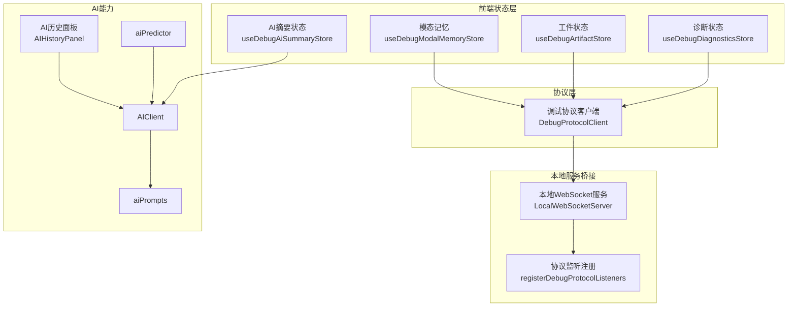

**图表来源**
- [src/stores/debugDiagnosticsStore.ts:1-50](file://src/stores/debugDiagnosticsStore.ts#L1-L50)
- [src/stores/debugArtifactStore.ts:1-115](file://src/stores/debugArtifactStore.ts#L1-L115)
- [src/stores/debugModalMemoryStore.ts:1-251](file://src/stores/debugModalMemoryStore.ts#L1-L251)
- [src/stores/debugAiSummaryStore.ts:1-101](file://src/stores/debugAiSummaryStore.ts#L1-L101)
- [src/services/protocols/DebugProtocolClient.ts:1-353](file://src/services/protocols/DebugProtocolClient.ts#L1-L353)
- [src/services/server.ts:1-388](file://src/services/server.ts#L1-L388)
- [src/features/debug/registerProtocolListeners.ts:1-189](file://src/features/debug/registerProtocolListeners.ts#L1-L189)
- [src/utils/ai/aiClient.ts:1-520](file://src/utils/ai/aiClient.ts#L1-L520)
- [src/utils/ai/aiPredictor.ts:1-583](file://src/utils/ai/aiPredictor.ts#L1-L583)
- [src/utils/ai/aiPrompts.ts:1-445](file://src/utils/ai/aiPrompts.ts#L1-L445)
- [src/components/panels/main/AIHistoryPanel.tsx:1-256](file://src/components/panels/main/AIHistoryPanel.tsx#L1-L256)

**章节来源**
- [src/services/server.ts:1-388](file://src/services/server.ts#L1-L388)
- [src/features/debug/registerProtocolListeners.ts:1-189](file://src/features/debug/registerProtocolListeners.ts#L1-L189)

## 核心组件
- 诊断状态管理：将调试事件转换为诊断条目，支持预检诊断注入与清空
- 工件状态管理：以引用为中心的工件生命周期管理，支持加载、就绪、错误状态与选择
- 模态记忆存储：**已简化**：仅持久化调试面板与运行模式偏好，支持过滤、排序、详情模式等基础配置
- AI摘要状态管理：统一管理生成状态、活动报告、错误与自动请求标记
- 调试协议客户端：封装调试协议的请求与事件订阅，负责与本地服务通信
- AI客户端与提示词：统一多厂商AI接入、历史记录、流式/非流式响应、代理转发与错误格式化

**章节来源**
- [src/stores/debugDiagnosticsStore.ts:1-50](file://src/stores/debugDiagnosticsStore.ts#L1-L50)
- [src/stores/debugArtifactStore.ts:1-115](file://src/stores/debugArtifactStore.ts#L1-L115)
- [src/stores/debugModalMemoryStore.ts:1-251](file://src/stores/debugModalMemoryStore.ts#L1-L251)
- [src/stores/debugAiSummaryStore.ts:1-101](file://src/stores/debugAiSummaryStore.ts#L1-L101)
- [src/services/protocols/DebugProtocolClient.ts:1-353](file://src/services/protocols/DebugProtocolClient.ts#L1-L353)
- [src/utils/ai/aiClient.ts:1-520](file://src/utils/ai/aiClient.ts#L1-L520)
- [src/utils/ai/aiPrompts.ts:1-445](file://src/utils/ai/aiPrompts.ts#L1-L445)

## 架构总览
诊断工具集采用"协议驱动 + 状态分层 + AI增强"的架构：
- 协议驱动：前端通过 DebugProtocolClient 与本地服务建立双向通信，订阅调试事件、资源健康、工件等
- 状态分层：诊断、工件、模态记忆、AI摘要分别由独立 store 管理，降低耦合
- AI增强：AI摘要与节点智能预测通过 AIClient 与提示词工程实现，支持历史记录与可视化

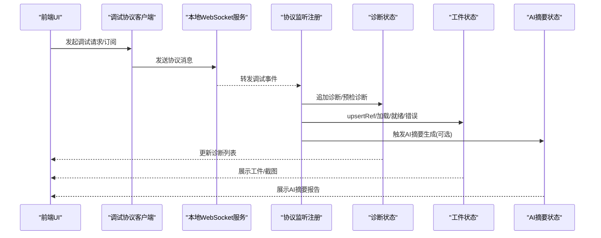

**图表来源**
- [src/services/protocols/DebugProtocolClient.ts:1-353](file://src/services/protocols/DebugProtocolClient.ts#L1-L353)
- [src/features/debug/registerProtocolListeners.ts:1-189](file://src/features/debug/registerProtocolListeners.ts#L1-L189)
- [src/stores/debugDiagnosticsStore.ts:1-50](file://src/stores/debugDiagnosticsStore.ts#L1-L50)
- [src/stores/debugArtifactStore.ts:1-115](file://src/stores/debugArtifactStore.ts#L1-L115)
- [src/stores/debugAiSummaryStore.ts:1-101](file://src/stores/debugAiSummaryStore.ts#L1-L101)

## 详细组件分析

### 诊断状态管理（DebugDiagnosticsStore）
- 职责：接收调试事件，提取诊断信息，维护诊断列表；支持预检诊断注入与清空
- 关键点：
  - 诊断字段包含严重级别、代码、消息、文件/节点/字段路径、原始数据
  - 从事件中提取诊断，若事件种类非诊断则忽略
  - 提供批量设置与追加方法，保证不可变更新

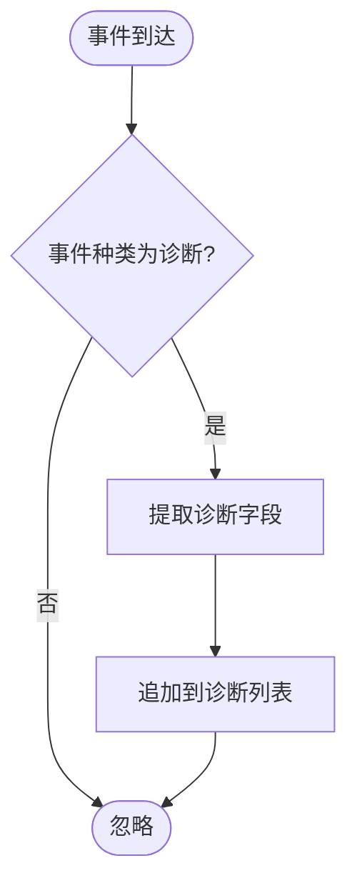

**图表来源**
- [src/stores/debugDiagnosticsStore.ts:11-46](file://src/stores/debugDiagnosticsStore.ts#L11-L46)
- [src/features/debug/types.ts:430-468](file://src/features/debug/types.ts#L430-L468)

**章节来源**
- [src/stores/debugDiagnosticsStore.ts:1-50](file://src/stores/debugDiagnosticsStore.ts#L1-L50)
- [src/features/debug/types.ts:430-468](file://src/features/debug/types.ts#L430-L468)

### 工件状态管理（DebugArtifactStore）
- 职责：以引用为中心管理工件生命周期，支持 upsert、加载、就绪、错误、选择与按会话清理
- 关键点：
  - 工件条目包含引用、状态、载荷与错误信息
  - upsertRef 合并现有引用与新引用，维持状态一致性
  - setPayload 将载荷写入对应工件，标记为就绪
  - resetArtifacts 支持按会话清理，避免跨会话污染

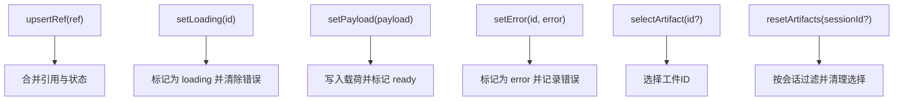

**图表来源**
- [src/stores/debugArtifactStore.ts:27-114](file://src/stores/debugArtifactStore.ts#L27-L114)

**章节来源**
- [src/stores/debugArtifactStore.ts:1-115](file://src/stores/debugArtifactStore.ts#L1-L115)

### 调试模态记忆存储（DebugModalMemoryStore）
- 职责：**已简化**：仅持久化调试面板偏好、运行模式、过滤器、排序与详情模式等基础配置
- 关键点：
  - 读取/写入 localStorage，键名稳定，支持默认值回退
  - 对外暴露 setter 方法，内部统一归一化与校验
  - **简化后仅持久化必要字段**：运行模式、入口节点ID、AI摘要生成开关、节点执行过滤器、归属模式、详情模式
  - `lastPanel` 字段仅在当前页面生命周期内有效，刷新后重置为默认值

**更新** 调试模态记忆存储已简化，移除了复杂的自动行为配置，仅保留基本的偏好设置功能

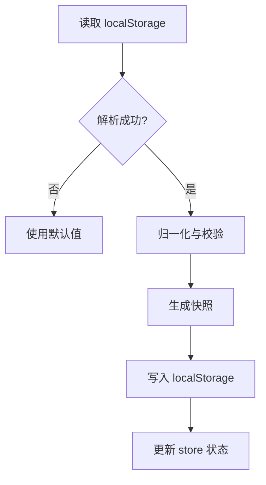

**图表来源**
- [src/stores/debugModalMemoryStore.ts:160-202](file://src/stores/debugModalMemoryStore.ts#L160-L202)

**章节来源**
- [src/stores/debugModalMemoryStore.ts:1-251](file://src/stores/debugModalMemoryStore.ts#L1-L251)

### AI摘要状态管理（DebugAiSummaryStore）
- 职责：管理AI摘要生成状态、活动报告、错误与自动请求标记
- 关键点：
  - 生成状态包括 idle/generating/ready/error
  - 生成中创建占位报告，完成后替换为正式报告
  - 支持标记自动请求目标，便于去重与追踪

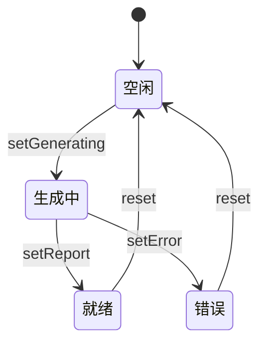

**图表来源**
- [src/stores/debugAiSummaryStore.ts:52-100](file://src/stores/debugAiSummaryStore.ts#L52-L100)

**章节来源**
- [src/stores/debugAiSummaryStore.ts:1-101](file://src/stores/debugAiSummaryStore.ts#L1-L101)

### 调试协议客户端（DebugProtocolClient）
- 职责：封装调试协议的请求与事件订阅，负责与本地服务通信
- 关键点：
  - 注册路由与事件监听器集合，支持 capabilities/session/event/artifact 等
  - 提供请求方法：capabilities、session、run、resource、artifact、screenshot、agent、trace 等
  - 统一错误处理与广播

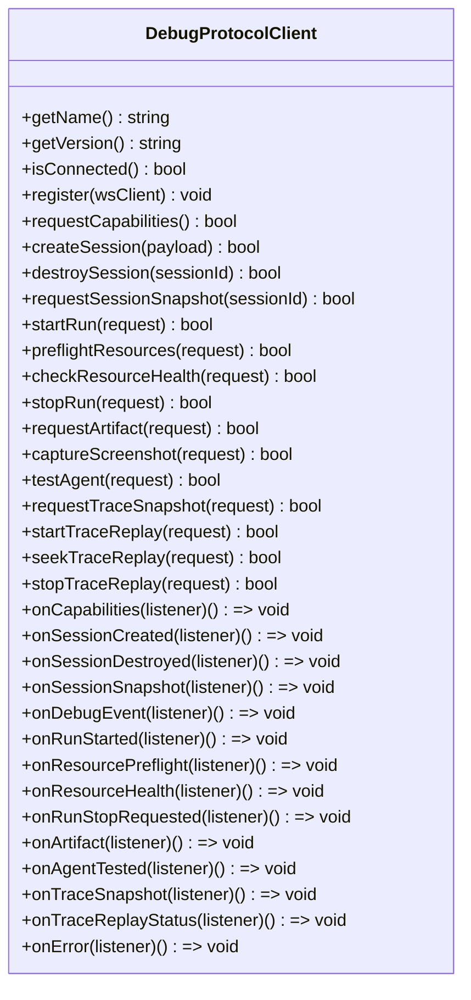

**图表来源**
- [src/services/protocols/DebugProtocolClient.ts:31-353](file://src/services/protocols/DebugProtocolClient.ts#L31-L353)

**章节来源**
- [src/services/protocols/DebugProtocolClient.ts:1-353](file://src/services/protocols/DebugProtocolClient.ts#L1-L353)

### 协议监听注册（registerDebugProtocolListeners）
- 职责：将协议事件映射到各状态 store，完成数据落地与 UI 更新
- 关键点：
  - capabilities/session/session_snapshot/run_started/resource_* 等事件映射
  - 诊断与轨迹同步更新，终端会话事件触发覆盖层清理
  - 工件引用与载荷联动，识别详情工件触发二次抓取

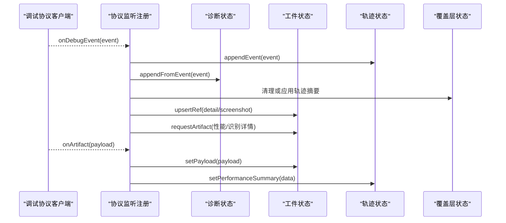

**图表来源**
- [src/features/debug/registerProtocolListeners.ts:59-122](file://src/features/debug/registerProtocolListeners.ts#L59-L122)

**章节来源**
- [src/features/debug/registerProtocolListeners.ts:1-189](file://src/features/debug/registerProtocolListeners.ts#L1-L189)

### 本地WebSocket服务（LocalWebSocketServer）
- 职责：建立与本地服务的 WebSocket 连接，注册系统路由与业务协议，处理握手与错误
- 关键点：
  - 连接超时、错误提示、状态变更通知
  - 握手阶段校验协议版本，不匹配则断开并提示
  - 统一消息发送与路由分发

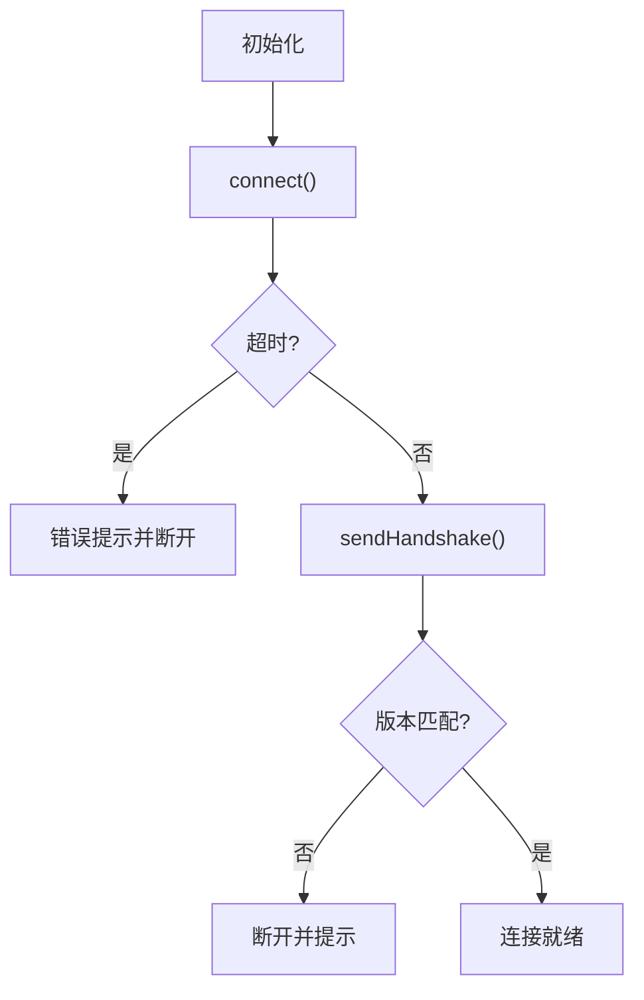

**图表来源**
- [src/services/server.ts:109-274](file://src/services/server.ts#L109-L274)

**章节来源**
- [src/services/server.ts:1-388](file://src/services/server.ts#L1-L388)

### AI能力：AIClient、aiPredictor、aiPrompts
- AIClient：统一多厂商AI接入，支持直连/代理、流式/非流式、历史记录、重试与错误格式化
- aiPredictor：基于截图与节点上下文，构建提示词并调用AI生成节点配置预测，支持验证与应用
- aiPrompts：集中管理提示词模板与示例，确保输出格式与约束一致

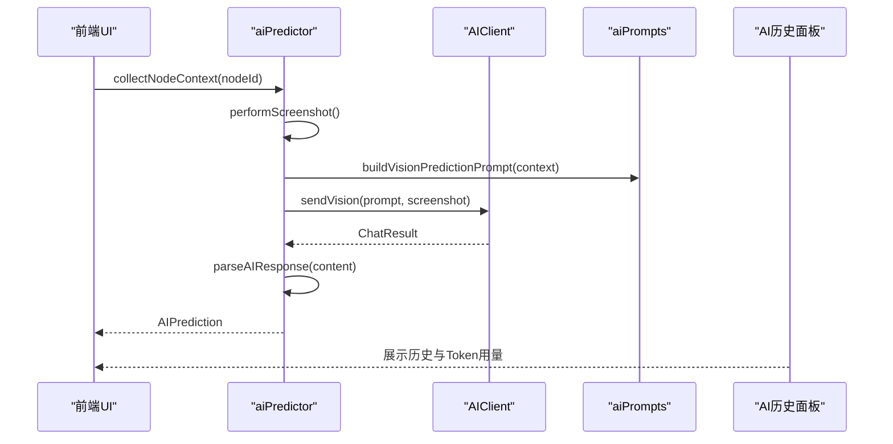

**图表来源**
- [src/utils/ai/aiPredictor.ts:311-342](file://src/utils/ai/aiPredictor.ts#L311-L342)
- [src/utils/ai/aiClient.ts:203-282](file://src/utils/ai/aiClient.ts#L203-L282)
- [src/utils/ai/aiPrompts.ts:402-410](file://src/utils/ai/aiPrompts.ts#L402-L410)
- [src/components/panels/main/AIHistoryPanel.tsx:1-256](file://src/components/panels/main/AIHistoryPanel.tsx#L1-L256)

**章节来源**
- [src/utils/ai/aiClient.ts:1-520](file://src/utils/ai/aiClient.ts#L1-L520)
- [src/utils/ai/aiPredictor.ts:1-583](file://src/utils/ai/aiPredictor.ts#L1-L583)
- [src/utils/ai/aiPrompts.ts:1-445](file://src/utils/ai/aiPrompts.ts#L1-L445)
- [src/components/panels/main/AIHistoryPanel.tsx:1-256](file://src/components/panels/main/AIHistoryPanel.tsx#L1-L256)

## 依赖分析
- 组件耦合：
  - 协议客户端与本地服务强耦合，通过路由与握手协议绑定
  - 协议监听注册作为粘合层，将协议事件映射到各状态 store
  - AI能力与协议解耦，通过状态 store 触发生成
- 外部依赖：
  - 本地服务（WebSocket）与协议版本控制
  - 多厂商AI服务（通过配置与代理转发）

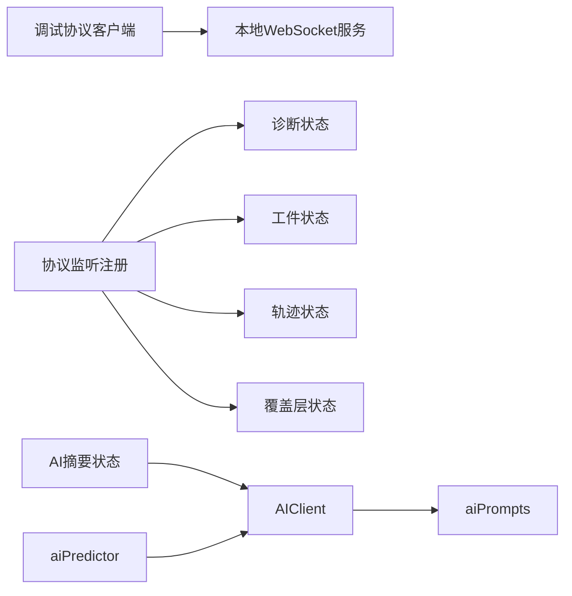

**图表来源**
- [src/services/protocols/DebugProtocolClient.ts:1-353](file://src/services/protocols/DebugProtocolClient.ts#L1-L353)
- [src/features/debug/registerProtocolListeners.ts:1-189](file://src/features/debug/registerProtocolListeners.ts#L1-L189)
- [src/stores/debugDiagnosticsStore.ts:1-50](file://src/stores/debugDiagnosticsStore.ts#L1-L50)
- [src/stores/debugArtifactStore.ts:1-115](file://src/stores/debugArtifactStore.ts#L1-L115)
- [src/stores/debugAiSummaryStore.ts:1-101](file://src/stores/debugAiSummaryStore.ts#L1-L101)
- [src/utils/ai/aiClient.ts:1-520](file://src/utils/ai/aiClient.ts#L1-L520)
- [src/utils/ai/aiPredictor.ts:1-583](file://src/utils/ai/aiPredictor.ts#L1-L583)
- [src/utils/ai/aiPrompts.ts:1-445](file://src/utils/ai/aiPrompts.ts#L1-L445)

**章节来源**
- [src/services/protocols/DebugProtocolClient.ts:1-353](file://src/services/protocols/DebugProtocolClient.ts#L1-L353)
- [src/features/debug/registerProtocolListeners.ts:1-189](file://src/features/debug/registerProtocolListeners.ts#L1-L189)

## 性能考虑
- 状态更新：
  - 采用不可变更新策略，避免深层拷贝带来的开销
  - 诊断与工件按事件增量追加，避免全量重绘
- 通信优化：
  - 本地服务连接超时与错误提示，减少无效等待
  - 工件按会话清理，避免长期累积导致内存压力
- AI调用：
  - 历史记录限制与Token估算，避免过长上下文
  - 流式响应支持中断与取消，提升交互体验

## 故障排查指南
- 协议版本不匹配：
  - 现象：握手失败，提示版本不兼容
  - 排查：核对前端协议版本与本地服务版本，按提示升级
- 连接超时/失败：
  - 现象：连接超时或连接失败提示
  - 排查：确认本地服务已启动、端口可用、网络策略允许
- CORS错误：
  - 现象：浏览器跨域限制导致请求失败
  - 排查：启用 LocalBridge 代理或调整服务端跨域策略
- 工件加载失败：
  - 现象：工件状态停留在 loading 或报错
  - 排查：检查工件引用与事件序列，确认本地服务可访问资源

**章节来源**
- [src/services/server.ts:131-163](file://src/services/server.ts#L131-L163)
- [src/utils/ai/aiClient.ts:113-133](file://src/utils/ai/aiClient.ts#L113-L133)
- [src/stores/debugArtifactStore.ts:74-88](file://src/stores/debugArtifactStore.ts#L74-L88)

## 结论
诊断工具集通过协议驱动与状态分层，实现了从事件采集、工件管理、AI摘要到可视化的完整闭环。其设计强调：
- 可扩展：协议客户端与监听注册解耦，易于新增事件与状态
- 可靠：本地服务握手与错误处理，保障通信稳定性
- 友好：AI历史与Token统计、流式响应与代理转发，提升用户体验
- **简洁**：调试模态记忆存储经过简化，专注于核心偏好设置，提升维护性

## 附录

### 诊断数据可视化与报告生成
- 可视化：
  - 诊断列表按严重级别与来源路径聚合展示
  - 工件选择器支持截图与识别详情图像浏览
  - AI历史面板展示对话记录、Token用量与错误信息
- 报告生成：
  - AI摘要状态管理生成结构化报告，包含简要总结、详细报告、提示词与上下文文本

**章节来源**
- [src/stores/debugDiagnosticsStore.ts:1-50](file://src/stores/debugDiagnosticsStore.ts#L1-L50)
- [src/stores/debugArtifactStore.ts:1-115](file://src/stores/debugArtifactStore.ts#L1-L115)
- [src/stores/debugAiSummaryStore.ts:1-101](file://src/stores/debugAiSummaryStore.ts#L1-L101)
- [src/components/panels/main/AIHistoryPanel.tsx:1-256](file://src/components/panels/main/AIHistoryPanel.tsx#L1-L256)

### 配置选项与使用指南
- 本地服务连接：
  - 端口设置、握手版本、连接状态监听
- AI配置：
  - 提供者类型、API地址、API Key、模型、温度、代理开关、历史轮数、重试次数与延迟
- 调试模态偏好：
  - **已简化**：仅包含面板切换、运行模式、自动AI摘要、过滤器与排序、详情模式等基础配置
  - **注意**：`lastPanel` 仅在当前页面生命周期内有效，刷新后重置为默认值

**章节来源**
- [src/services/server.ts:69-76](file://src/services/server.ts#L69-L76)
- [src/utils/ai/aiClient.ts:65-76](file://src/utils/ai/aiClient.ts#L65-L76)
- [src/stores/debugModalMemoryStore.ts:160-202](file://src/stores/debugModalMemoryStore.ts#L160-L202)