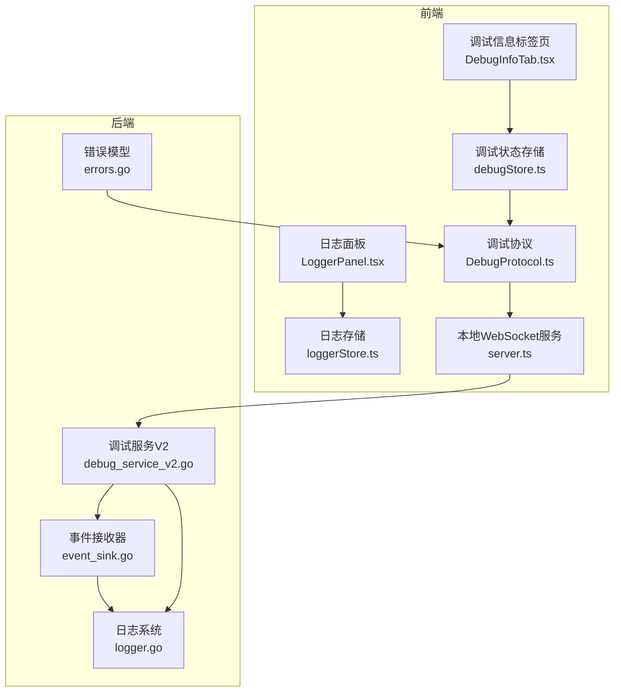
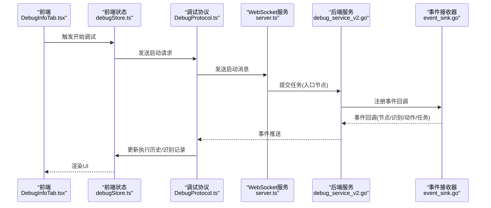
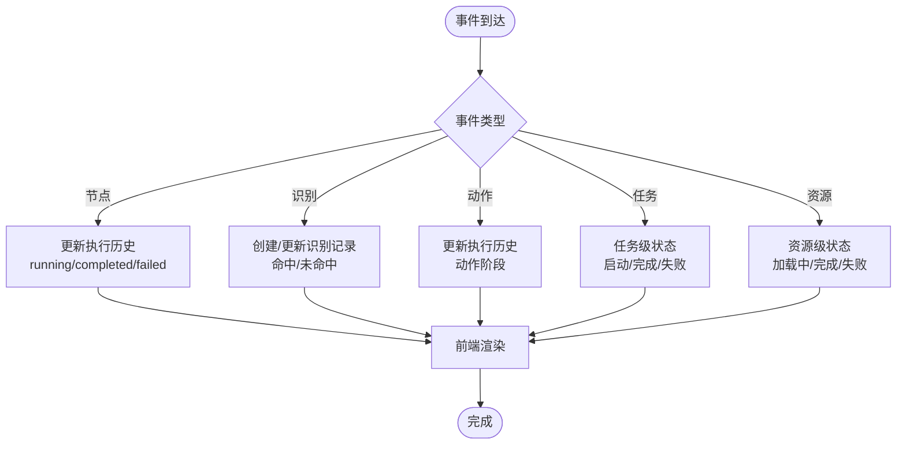
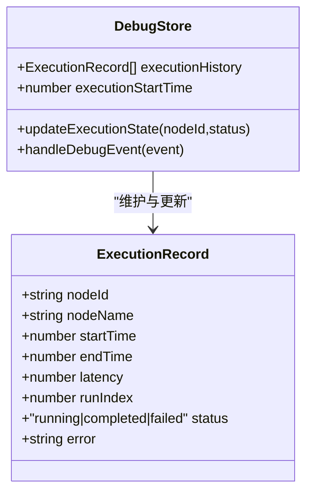
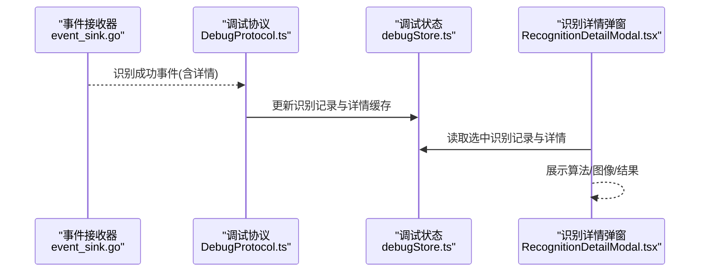
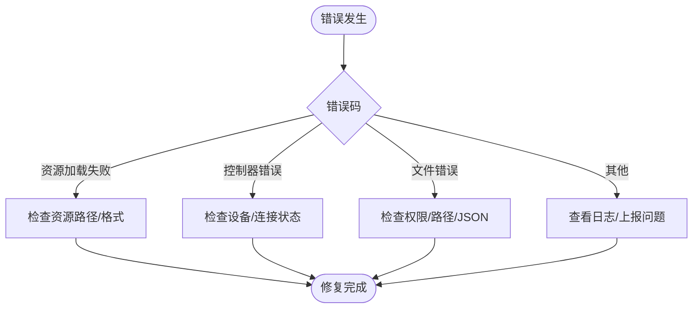
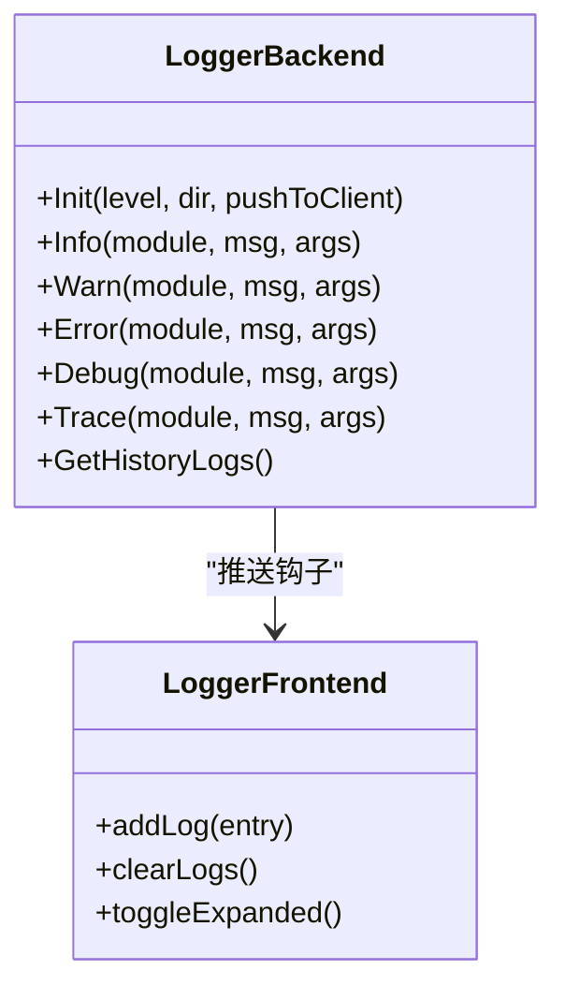
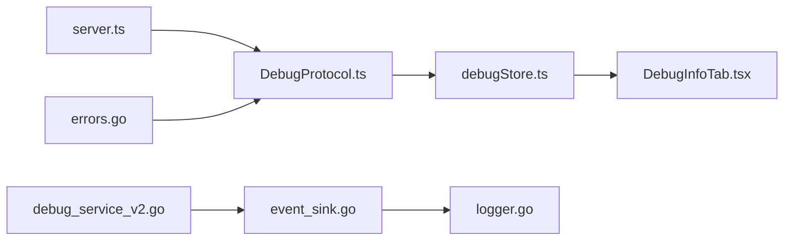

# 调试与诊断

<cite>
**本文引用的文件**
- [debug_service_v2.go](file://LocalBridge/internal/mfw/debug_service_v2.go)
- [event_sink.go](file://LocalBridge/internal/mfw/event_sink.go)
- [logger.go](file://LocalBridge/internal/logger/logger.go)
- [debugStore.ts](file://src/stores/debugStore.ts)
- [DebugProtocol.ts](file://src/services/protocols/DebugProtocol.ts)
- [server.ts](file://src/services/server.ts)
- [DebugInfoTab.tsx](file://src/components/panels/tools/DebugInfoTab.tsx)
- [RecognitionDetailModal.tsx](file://src/components/panels/tools/RecognitionDetailModal.tsx)
- [loggerStore.ts](file://src/stores/loggerStore.ts)
- [ErrorProtocol.ts](file://src/services/protocols/ErrorProtocol.ts)
- [errors.go](file://LocalBridge/internal/errors/errors.go)
- [errorStore.ts](file://src/stores/errorStore.ts)
</cite>

## 目录
1. [简介](#简介)
2. [项目结构](#项目结构)
3. [核心组件](#核心组件)
4. [架构总览](#架构总览)
5. [组件详解](#组件详解)
6. [依赖关系分析](#依赖关系分析)
7. [性能考量](#性能考量)
8. [故障排查指南](#故障排查指南)
9. [结论](#结论)
10. [附录](#附录)

## 简介
本文件面向MaaPipelineEditor的“调试与诊断”能力，系统性阐述实时调试系统的工作原理、执行历史记录管理、错误诊断机制、日志系统设计、性能监控与瓶颈识别，并提供工具使用指南与最佳实践，帮助开发者与使用者高效定位问题、优化流程。

## 项目结构
调试与诊断涉及前后端协同：
- 前端负责UI交互、事件聚合、历史记录与日志展示、单节点测试与结果呈现。
- 后端负责会话管理、事件采集、资源加载、任务执行与错误上报。
- 前后端通过WebSocket协议进行消息传递，协议层统一处理握手、路由与错误分发。

**图表来源**
- [DebugInfoTab.tsx](file://src/components/panels/tools/DebugInfoTab.tsx)
- [loggerStore.ts](file://src/stores/loggerStore.ts)
- [debugStore.ts](file://src/stores/debugStore.ts)
- [DebugProtocol.ts](file://src/services/protocols/DebugProtocol.ts)
- [server.ts](file://src/services/server.ts)
- [debug_service_v2.go](file://LocalBridge/internal/mfw/debug_service_v2.go)
- [event_sink.go](file://LocalBridge/internal/mfw/event_sink.go)
- [logger.go](file://LocalBridge/internal/logger/logger.go)
- [errors.go](file://LocalBridge/internal/errors/errors.go)

**章节来源**
- [server.ts:20-373](file://src/services/server.ts#L20-L373)
- [DebugProtocol.ts:16-75](file://src/services/protocols/DebugProtocol.ts#L16-L75)
- [debugStore.ts:143-221](file://src/stores/debugStore.ts#L143-L221)

## 核心组件
- 调试服务V2（后端）：负责会话生命周期、任务提交、事件回调、状态跟踪与资源管理。
- 事件接收器（后端）：从MaaFW上下文捕获节点/识别/动作/任务级事件，构建统一事件数据。
- 调试协议（前端）：解析后端事件，桥接至前端状态存储，驱动UI更新与交互。
- 调试状态存储（前端）：维护执行历史、识别记录、当前节点、日志级别、测试模式等。
- 日志系统（前后端）：控制台与文件双通道，支持推送钩子、历史缓存与清理。
- 错误协议与错误模型：统一错误码与提示，联动UI与后端状态清理。

**章节来源**
- [debug_service_v2.go:60-73](file://LocalBridge/internal/mfw/debug_service_v2.go#L60-L73)
- [event_sink.go:61-81](file://LocalBridge/internal/mfw/event_sink.go#L61-L81)
- [DebugProtocol.ts:16-75](file://src/services/protocols/DebugProtocol.ts#L16-L75)
- [debugStore.ts:143-221](file://src/stores/debugStore.ts#L143-L221)
- [logger.go:43-100](file://LocalBridge/internal/logger/logger.go#L43-L100)
- [ErrorProtocol.ts:10-24](file://src/services/protocols/ErrorProtocol.ts#L10-L24)
- [errors.go:9-20](file://LocalBridge/internal/errors/errors.go#L9-L20)

## 架构总览
整体采用“前端协议层 + 状态存储 + 后端服务层”的分层设计。前端通过协议层订阅后端事件，后端通过事件接收器将MaaFW事件转化为统一格式并推送至前端。

**图表来源**
- [DebugInfoTab.tsx](file://src/components/panels/tools/DebugInfoTab.tsx)
- [debugStore.ts:227-415](file://src/stores/debugStore.ts#L227-L415)
- [DebugProtocol.ts:136-232](file://src/services/protocols/DebugProtocol.ts#L136-L232)
- [server.ts:285-300](file://src/services/server.ts#L285-L300)
- [debug_service_v2.go:220-277](file://LocalBridge/internal/mfw/debug_service_v2.go#L220-L277)
- [event_sink.go:108-167](file://LocalBridge/internal/mfw/event_sink.go#L108-L167)

## 组件详解

### 实时调试系统与事件流
- 事件类型覆盖：节点执行（开始/成功/失败）、识别（开始/成功/失败）、动作（开始/成功/失败）、任务（开始/成功/失败）、资源（加载中/完成/失败）。
- 事件采集：后端事件接收器基于MaaFW上下文事件回调，构建统一事件数据并触发前端回调。
- 事件分发：前端协议层根据事件类型映射到调试状态存储，分别更新执行历史与识别记录；同时驱动UI高亮、断点与阶段切换。

**图表来源**
- [event_sink.go:18-39](file://LocalBridge/internal/mfw/event_sink.go#L18-L39)
- [DebugProtocol.ts:185-228](file://src/services/protocols/DebugProtocol.ts#L185-L228)
- [debugStore.ts:437-795](file://src/stores/debugStore.ts#L437-L795)

**章节来源**
- [event_sink.go:108-167](file://LocalBridge/internal/mfw/event_sink.go#L108-L167)
- [DebugProtocol.ts:136-232](file://src/services/protocols/DebugProtocol.ts#L136-L232)
- [debugStore.ts:437-795](file://src/stores/debugStore.ts#L437-L795)

### 执行历史记录管理
- 记录维度：节点级执行记录包含节点ID、名称、开始/结束时间、耗时、运行索引、状态与错误信息。
- 历史聚合：前端按节点ID聚合多次运行，支持时间轴展示与统计信息（执行次数、累计耗时）。
- 回放与对比：通过选择节点与运行索引，可在时间轴中查看单次运行的详细阶段与耗时，便于对比不同运行表现。
- 性能分析：结合节点耗时与识别命中率，定位慢节点与低效识别策略。

**图表来源**
- [debugStore.ts:128-137](file://src/stores/debugStore.ts#L128-L137)
- [debugStore.ts:417-428](file://src/stores/debugStore.ts#L417-L428)

**章节来源**
- [debugStore.ts:128-137](file://src/stores/debugStore.ts#L128-L137)
- [debugStore.ts:417-547](file://src/stores/debugStore.ts#L417-L547)
- [DebugInfoTab.tsx:66-173](file://src/components/panels/tools/DebugInfoTab.tsx#L66-L173)

### 识别记录与详情缓存
- 识别记录：区分“节点自我识别”与“父节点发起的识别”，后者进入识别记录卡片；前者用于内部逻辑但不展示为卡片。
- 详情缓存：识别成功后，若后端事件携带识别详情（算法、最佳结果、绘制图像、原始图像等），前端缓存以供查看详情弹窗使用。
- 详情弹窗：支持查看命中状态、识别框、最佳结果与原始图像，便于快速定位视觉问题。

**图表来源**
- [event_sink.go:216-320](file://LocalBridge/internal/mfw/event_sink.go#L216-L320)
- [DebugProtocol.ts:306-337](file://src/services/protocols/DebugProtocol.ts#L306-L337)
- [debugStore.ts:618-684](file://src/stores/debugStore.ts#L618-L684)
- [RecognitionDetailModal.tsx:34-62](file://src/components/panels/tools/RecognitionDetailModal.tsx#L34-L62)

**章节来源**
- [event_sink.go:169-320](file://LocalBridge/internal/mfw/event_sink.go#L169-L320)
- [debugStore.ts:550-684](file://src/stores/debugStore.ts#L550-L684)
- [RecognitionDetailModal.tsx:12-261](file://src/components/panels/tools/RecognitionDetailModal.tsx#L12-L261)

### 错误诊断机制
- 错误分类：资源加载失败、控制器连接失败、MaaFramework初始化失败、文件读写错误、JSON格式错误等。
- 诊断流程：后端错误模型统一编码，前端错误协议根据错误码映射人性化提示，并在必要时清理控制器连接状态。
- 修复建议：针对资源加载失败，提示检查资源路径与文件格式；针对控制器错误，引导确认设备与连接状态。

**图表来源**
- [ErrorProtocol.ts:26-66](file://src/services/protocols/ErrorProtocol.ts#L26-L66)
- [errors.go:10-20](file://LocalBridge/internal/errors/errors.go#L10-L20)

**章节来源**
- [ErrorProtocol.ts:26-66](file://src/services/protocols/ErrorProtocol.ts#L26-L66)
- [errors.go:52-140](file://LocalBridge/internal/errors/errors.go#L52-L140)
- [errorStore.ts:17-38](file://src/stores/errorStore.ts#L17-L38)

### 日志系统设计
- 日志级别：支持Info/Warn/Error/Debug/Trace，前端默认“普通”级别，可通过配置切换“详细”级别查看更多细节。
- 输出与推送：控制台输出彩色时间戳，文件输出全级别并保留历史；后端提供推送钩子，将日志推送到前端存储。
- 历史与清理：前端日志存储限制最大条数，超过阈值按比例清理；后端日志文件按天清理旧文件。

**图表来源**
- [logger.go:43-100](file://LocalBridge/internal/logger/logger.go#L43-L100)
- [logger.go:164-201](file://LocalBridge/internal/logger/logger.go#L164-L201)
- [loggerStore.ts:21-45](file://src/stores/loggerStore.ts#L21-L45)

**章节来源**
- [logger.go:43-100](file://LocalBridge/internal/logger/logger.go#L43-L100)
- [logger.go:107-134](file://LocalBridge/internal/logger/logger.go#L107-L134)
- [loggerStore.ts:11-19](file://src/stores/loggerStore.ts#L11-L19)

### 性能监控与瓶颈识别
- 执行时间统计：节点/动作阶段均记录开始/结束时间与耗时，前端时间轴直观展示。
- 节点级指标：执行历史包含节点名称、运行索引、状态与耗时，便于横向对比不同运行。
- 识别效率：识别记录包含命中状态与算法信息，辅助评估识别策略有效性。
- 建议：优先优化耗时长的节点与低命中率的识别策略；关注重复识别导致的性能损耗。

**章节来源**
- [debugStore.ts:128-137](file://src/stores/debugStore.ts#L128-L137)
- [debugStore.ts:474-514](file://src/stores/debugStore.ts#L474-L514)
- [event_sink.go:134-166](file://LocalBridge/internal/mfw/event_sink.go#L134-L166)

### 调试工具使用指南与最佳实践
- 启动调试：配置资源路径与控制器，设置入口节点，点击开始；前端自动保存必要文件并创建会话。
- 实时观察：执行历史时间轴与识别记录卡片实时更新；通过节点选择器聚焦特定节点。
- 详情查看：识别详情弹窗支持查看算法、最佳结果、绘制图像与原始图像，辅助定位视觉问题。
- 日志查看：在日志面板中筛选级别与模块，结合时间轴定位异常时段。
- 最佳实践：
  - 优先从入口节点开始调试，逐步缩小范围。
  - 关注识别命中率与重复识别次数，避免不必要的循环。
  - 使用“详细”日志级别排查底层框架问题。
  - 定期清理旧日志与识别详情缓存，避免内存占用过高。

**章节来源**
- [debugStore.ts:295-398](file://src/stores/debugStore.ts#L295-L398)
- [DebugInfoTab.tsx:18-63](file://src/components/panels/tools/DebugInfoTab.tsx#L18-L63)
- [RecognitionDetailModal.tsx:64-257](file://src/components/panels/tools/RecognitionDetailModal.tsx#L64-L257)
- [loggerStore.ts:21-45](file://src/stores/loggerStore.ts#L21-L45)

## 依赖关系分析
- 前端协议依赖WebSocket服务，协议层负责路由与事件分发。
- 调试状态存储依赖协议层推送的数据，驱动UI渲染。
- 后端调试服务依赖事件接收器与日志系统，向上游提供统一事件与状态。
- 错误协议依赖错误模型，统一前端提示与状态清理。

**图表来源**
- [server.ts:333-373](file://src/services/server.ts#L333-L373)
- [DebugProtocol.ts:16-75](file://src/services/protocols/DebugProtocol.ts#L16-L75)
- [debugStore.ts:227-255](file://src/stores/debugStore.ts#L227-L255)
- [debug_service_v2.go:60-73](file://LocalBridge/internal/mfw/debug_service_v2.go#L60-L73)
- [event_sink.go:61-81](file://LocalBridge/internal/mfw/event_sink.go#L61-L81)
- [logger.go:43-100](file://LocalBridge/internal/logger/logger.go#L43-L100)
- [errors.go:9-20](file://LocalBridge/internal/errors/errors.go#L9-L20)

**章节来源**
- [server.ts:333-373](file://src/services/server.ts#L333-L373)
- [DebugProtocol.ts:16-75](file://src/services/protocols/DebugProtocol.ts#L16-L75)
- [debugStore.ts:227-255](file://src/stores/debugStore.ts#L227-L255)

## 性能考量
- 内存与存储：前端对执行历史与识别记录设置上限与清理比例，避免无限增长；识别详情缓存按条目上限清理。
- 事件风暴：后端事件接收器仅转发关键事件，前端按类型独立更新，降低UI重绘压力。
- 日志成本：文件日志全级别输出，前端仅保留有限历史；后端定期清理旧日志文件。
- 建议：在复杂流程中开启“详细”日志级别进行短期排查，结束后恢复默认级别以降低开销。

**章节来源**
- [debugStore.ts:10-21](file://src/stores/debugStore.ts#L10-L21)
- [logger.go:209-249](file://LocalBridge/internal/logger/logger.go#L209-L249)

## 故障排查指南
- 无法连接本地服务：检查端口占用与服务状态，查看连接超时与错误提示。
- 资源加载失败：核对资源路径是否指向包含pipeline的目录，检查文件命名与格式。
- 控制器连接失败：确认设备可用与连接状态，必要时重新选择控制器。
- 调试卡住或无响应：查看执行历史与识别记录，定位最后一个运行节点；检查日志中错误码。
- 识别命中率低：在识别详情弹窗中查看算法与绘制图像，调整ROI或算法参数。

**章节来源**
- [server.ts:104-251](file://src/services/server.ts#L104-L251)
- [DebugProtocol.ts:444-540](file://src/services/protocols/DebugProtocol.ts#L444-L540)
- [ErrorProtocol.ts:26-66](file://src/services/protocols/ErrorProtocol.ts#L26-L66)
- [RecognitionDetailModal.tsx:132-247](file://src/components/panels/tools/RecognitionDetailModal.tsx#L132-L247)

## 结论
MaaPipelineEditor的调试与诊断体系通过前后端协作，实现了从事件采集、状态聚合到可视化呈现的闭环。借助执行历史、识别记录与日志系统，用户可以快速定位问题、优化性能并提升流程稳定性。建议在日常开发中结合最佳实践，持续迭代调试策略与资源配置，以获得更高效的调试体验。

## 附录
- 常用术语
  - 会话：一次调试任务的生命周期，包含资源、入口节点与状态。
  - 节点：流程中的执行单元，包含识别与动作两个阶段。
  - 识别：对屏幕区域进行特征匹配或OCR等操作，返回命中与否与结果。
  - 详情缓存：识别成功后缓存的算法、图像与结果，供弹窗查看。
- 常见问题速查
  - 资源路径错误：检查路径是否包含pipeline目录与合法文件名。
  - 控制器不可用：确认设备驱动与连接状态。
  - 日志过多影响性能：切换日志级别或清理历史。