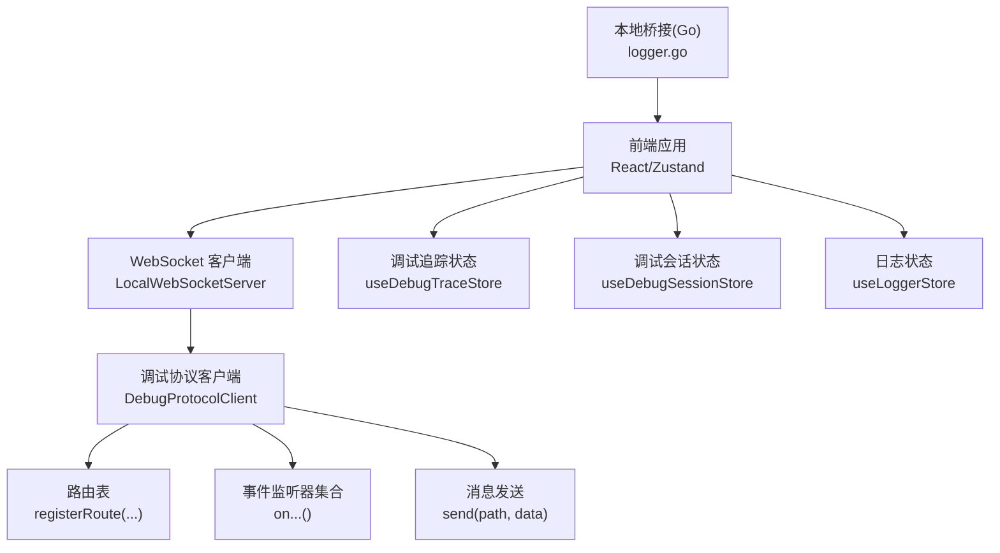
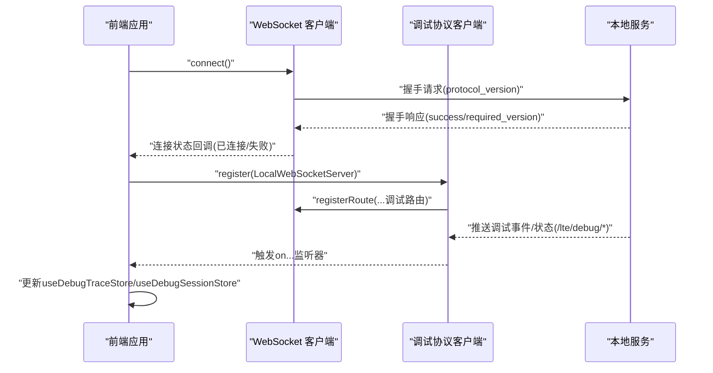
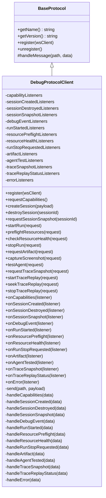
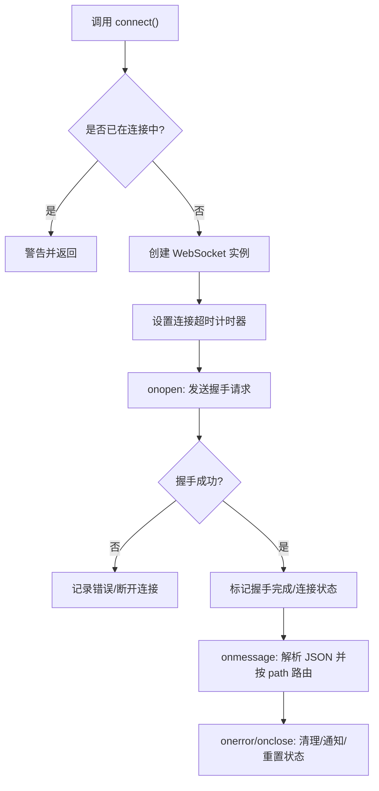
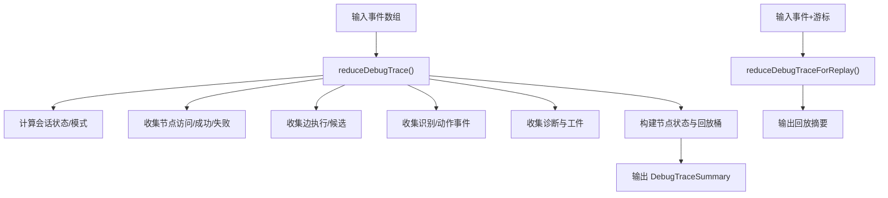
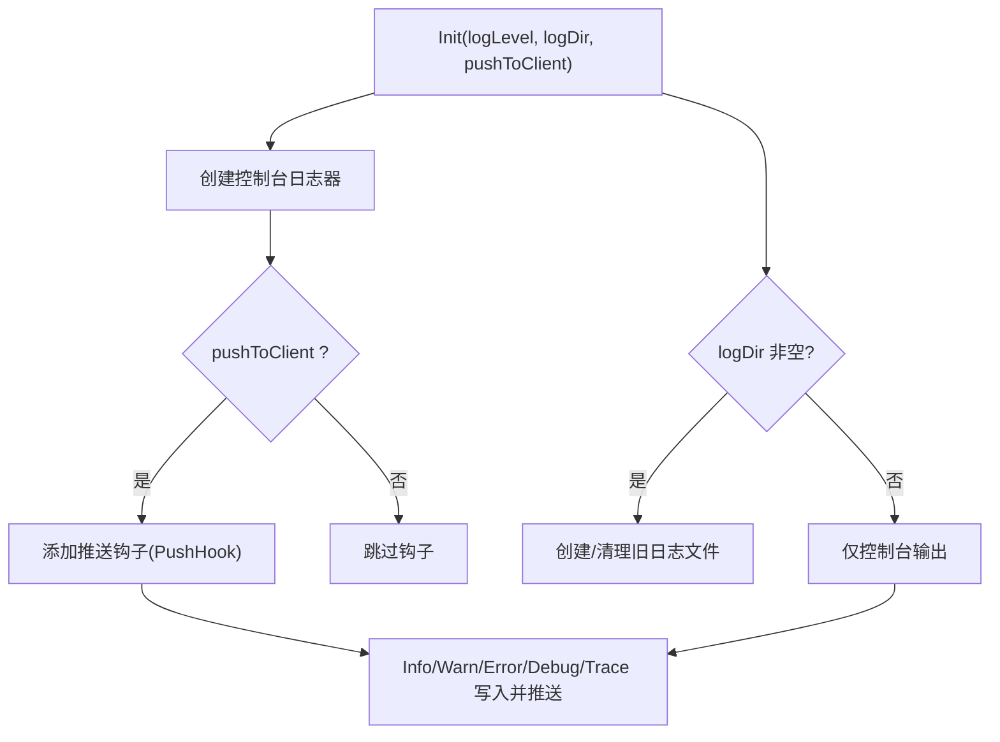
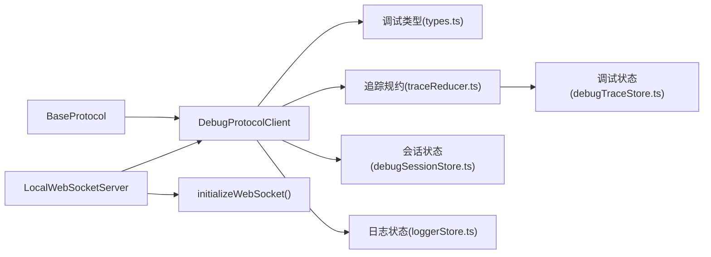

# 调试与诊断

<cite>
**本文引用的文件**
- [DebugProtocolClient.ts](file://src/services/protocols/DebugProtocolClient.ts)
- [BaseProtocol.ts](file://src/services/protocols/BaseProtocol.ts)
- [server.ts](file://src/services/server.ts)
- [types.ts](file://src/features/debug/types.ts)
- [traceReducer.ts](file://src/features/debug/traceReducer.ts)
- [debugTraceStore.ts](file://src/stores/debugTraceStore.ts)
- [debugSessionStore.ts](file://src/stores/debugSessionStore.ts)
- [loggerStore.ts](file://src/stores/loggerStore.ts)
- [logger.go](file://LocalBridge/internal/logger/logger.go)
- [errors.go](file://LocalBridge/internal/errors/errors.go)
</cite>

## 目录
1. [引言](#引言)
2. [项目结构](#项目结构)
3. [核心组件](#核心组件)
4. [架构总览](#架构总览)
5. [详细组件分析](#详细组件分析)
6. [依赖分析](#依赖分析)
7. [性能考虑](#性能考虑)
8. [故障排除指南](#故障排除指南)
9. [结论](#结论)
10. [附录](#附录)

## 引言
本文件面向“调试与诊断”主题，系统化梳理前端调试协议、日志系统、性能监控与分析、错误处理与异常恢复、调试会话管理与状态跟踪，并给出扩展与自定义实现建议及最佳实践与排障方法。内容以仓库现有实现为依据，结合可视化图示帮助读者快速理解与落地。

## 项目结构
围绕调试与诊断的关键代码分布在以下区域：
- 协议层：前端通过 WebSocket 与本地服务交互，调试协议客户端封装路由与事件分发
- 数据层：调试事件、性能摘要、会话快照等类型定义与状态存储
- 日志层：前端日志存储与渲染，以及本地桥接（Go）侧日志初始化与推送
- 错误层：统一错误模型与错误码，便于跨协议传递与前端展示

图表来源
- [server.ts:345-387](file://src/services/server.ts#L345-L387)
- [DebugProtocolClient.ts:77-121](file://src/services/protocols/DebugProtocolClient.ts#L77-L121)
- [debugTraceStore.ts:270-451](file://src/stores/debugTraceStore.ts#L270-L451)
- [debugSessionStore.ts:82-260](file://src/stores/debugSessionStore.ts#L82-L260)
- [loggerStore.ts:21-46](file://src/stores/loggerStore.ts#L21-L46)
- [logger.go:43-100](file://LocalBridge/internal/logger/logger.go#L43-L100)

章节来源
- [server.ts:22-343](file://src/services/server.ts#L22-L343)
- [DebugProtocolClient.ts:31-353](file://src/services/protocols/DebugProtocolClient.ts#L31-L353)

## 核心组件
- 调试协议客户端：负责注册调试相关路由、发送请求、分发事件给订阅者
- WebSocket 服务器：负责握手、连接生命周期、消息路由与错误提示
- 调试事件与类型：统一的事件结构、运行模式、诊断与工件类型
- 追踪与性能摘要：将事件流规约为可交互的摘要与回放游标
- 会话与状态：调试会话、运行状态、资源健康与能力清单
- 日志系统：前端日志存储与渲染；本地桥接日志初始化与推送
- 错误模型：统一错误码与包装，便于跨层传递

章节来源
- [DebugProtocolClient.ts:128-188](file://src/services/protocols/DebugProtocolClient.ts#L128-L188)
- [server.ts:22-343](file://src/services/server.ts#L22-L343)
- [types.ts:441-481](file://src/features/debug/types.ts#L441-L481)
- [traceReducer.ts:184-317](file://src/features/debug/traceReducer.ts#L184-L317)
- [debugTraceStore.ts:270-451](file://src/stores/debugTraceStore.ts#L270-L451)
- [debugSessionStore.ts:82-260](file://src/stores/debugSessionStore.ts#L82-L260)
- [loggerStore.ts:21-46](file://src/stores/loggerStore.ts#L21-L46)
- [logger.go:43-100](file://LocalBridge/internal/logger/logger.go#L43-L100)
- [errors.go:23-74](file://LocalBridge/internal/errors/errors.go#L23-L74)

## 架构总览
调试与诊断的整体链路如下：
- 前端通过 LocalWebSocketServer 建立与本地服务的 WebSocket 连接
- 在握手成功后，注册各类协议（含调试协议）
- 调试协议客户端订阅后端推送的调试事件与状态变更
- 前端状态存储根据事件进行聚合与展示（追踪、性能、会话、日志）

图表来源
- [server.ts:108-255](file://src/services/server.ts#L108-L255)
- [DebugProtocolClient.ts:77-121](file://src/services/protocols/DebugProtocolClient.ts#L77-L121)
- [server.ts:361-387](file://src/services/server.ts#L361-L387)

## 详细组件分析

### 调试协议与消息格式
- 路由注册：调试协议客户端在注册阶段一次性绑定所有后端推送路由，包括能力清单、会话创建/销毁/快照、事件、运行开始、资源预检/健康、停止请求、工件、代理测试、追踪快照与回放状态、错误等
- 请求接口：提供创建会话、销毁会话、请求会话快照、启动/停止运行、资源预检/健康、抓取截图、代理测试、请求追踪快照、启动/跳转/停止回放等方法
- 事件分发：收到后端推送后，按事件类型分发至对应监听器集合，供状态存储与 UI 使用

图表来源
- [BaseProtocol.ts:7-39](file://src/services/protocols/BaseProtocol.ts#L7-L39)
- [DebugProtocolClient.ts:31-353](file://src/services/protocols/DebugProtocolClient.ts#L31-L353)

章节来源
- [DebugProtocolClient.ts:77-121](file://src/services/protocols/DebugProtocolClient.ts#L77-L121)
- [DebugProtocolClient.ts:128-188](file://src/services/protocols/DebugProtocolClient.ts#L128-L188)
- [DebugProtocolClient.ts:276-351](file://src/services/protocols/DebugProtocolClient.ts#L276-L351)

### WebSocket 连接与握手
- 连接管理：支持设置端口、连接/断开、连接超时、状态与连接中回调
- 握手流程：连接成功后发送协议版本握手请求，若版本不匹配则断开并提示
- 消息路由：解析 JSON 后按 path 分派到已注册处理器

图表来源
- [server.ts:108-255](file://src/services/server.ts#L108-L255)

章节来源
- [server.ts:22-343](file://src/services/server.ts#L22-L343)

### 调试事件与类型体系
- 事件结构：包含会话标识、运行标识、序列号、时间戳、来源、种类、阶段/状态、节点/边上下文、详情/截图引用、附加数据等
- 运行模式：支持从节点运行、单节点运行、仅识别、仅动作、回放等
- 诊断与工件：诊断包含严重性、代码、消息、文件/节点/字段路径等；工件包含类型、MIME、创建时间等
- 回放状态：包含活动、播放、游标序列、节点、速度、起止时间等

章节来源
- [types.ts:441-481](file://src/features/debug/types.ts#L441-L481)
- [types.ts:8-13](file://src/features/debug/types.ts#L8-L13)
- [types.ts:430-440](file://src/features/debug/types.ts#L430-L440)
- [types.ts:338-352](file://src/features/debug/types.ts#L338-L352)

### 追踪与性能摘要
- 规约函数：将事件流规约为摘要，统计会话状态、节点访问/成功/失败、执行/候选边、识别/动作事件、诊断、工件、节点运行状态与回放桶
- 回放游标：支持基于序列号、运行标识、节点过滤的回放摘要生成
- 状态存储：维护事件列表、显示会话、选择的会话、性能汇总、回放状态，并提供追加、快照应用、选择、重置等操作

图表来源
- [traceReducer.ts:184-317](file://src/features/debug/traceReducer.ts#L184-L317)
- [traceReducer.ts:340-352](file://src/features/debug/traceReducer.ts#L340-L352)
- [debugTraceStore.ts:270-451](file://src/stores/debugTraceStore.ts#L270-L451)

章节来源
- [traceReducer.ts:184-317](file://src/features/debug/traceReducer.ts#L184-L317)
- [traceReducer.ts:340-352](file://src/features/debug/traceReducer.ts#L340-L352)
- [debugTraceStore.ts:270-451](file://src/stores/debugTraceStore.ts#L270-L451)

### 会话管理与状态跟踪
- 能力清单：加载/错误状态管理，结果缓存
- 资源预检/健康：检查状态、请求键、结果与首个错误提取
- 会话与运行：保存当前会话、运行、停止请求、代理测试结果、协议错误
- 面板与选择：模态面板切换、节点选择、面板记忆

章节来源
- [debugSessionStore.ts:82-260](file://src/stores/debugSessionStore.ts#L82-L260)

### 日志系统
- 前端日志存储：固定容量队列、展开/收起、最大条数限制
- 本地桥接日志：初始化控制台与文件日志器、钩子推送、历史日志缓存、清理旧日志

图表来源
- [logger.go:43-100](file://LocalBridge/internal/logger/logger.go#L43-L100)
- [logger.go:137-162](file://LocalBridge/internal/logger/logger.go#L137-L162)
- [logger.go:209-250](file://LocalBridge/internal/logger/logger.go#L209-L250)
- [loggerStore.ts:21-46](file://src/stores/loggerStore.ts#L21-L46)

章节来源
- [logger.go:43-100](file://LocalBridge/internal/logger/logger.go#L43-L100)
- [logger.go:137-162](file://LocalBridge/internal/logger/logger.go#L137-L162)
- [logger.go:209-250](file://LocalBridge/internal/logger/logger.go#L209-L250)
- [loggerStore.ts:21-46](file://src/stores/loggerStore.ts#L21-L46)

### 错误处理与异常恢复
- 统一错误模型：包含错误码、消息、可选细节
- 预定义错误构造：文件、JSON、权限、请求无效、内部错误等
- 协议错误：调试协议错误结构用于跨层传递

章节来源
- [errors.go:23-74](file://LocalBridge/internal/errors/errors.go#L23-L74)
- [errors.go:77-141](file://LocalBridge/internal/errors/errors.go#L77-L141)
- [types.ts:470-474](file://src/features/debug/types.ts#L470-L474)

## 依赖分析
- 协议抽象：BaseProtocol 作为协议基类，约束命名、版本、注册与消息处理
- 协议实现：DebugProtocolClient 实现具体路由与事件分发
- 服务集成：LocalWebSocketServer 负责连接与路由分发，initializeWebSocket 中集中注册各协议
- 类型与状态：调试类型定义与状态存储相互配合，驱动 UI 展示与交互

图表来源
- [BaseProtocol.ts:7-39](file://src/services/protocols/BaseProtocol.ts#L7-L39)
- [DebugProtocolClient.ts:31-353](file://src/services/protocols/DebugProtocolClient.ts#L31-L353)
- [server.ts:345-387](file://src/services/server.ts#L345-L387)
- [types.ts:120-143](file://src/features/debug/types.ts#L120-L143)
- [traceReducer.ts:184-317](file://src/features/debug/traceReducer.ts#L184-L317)
- [debugTraceStore.ts:270-451](file://src/stores/debugTraceStore.ts#L270-L451)
- [debugSessionStore.ts:82-260](file://src/stores/debugSessionStore.ts#L82-L260)
- [loggerStore.ts:21-46](file://src/stores/loggerStore.ts#L21-L46)

章节来源
- [server.ts:345-387](file://src/services/server.ts#L345-L387)
- [DebugProtocolClient.ts:31-353](file://src/services/protocols/DebugProtocolClient.ts#L31-L353)

## 性能考虑
- 事件规约复杂度：规约过程对事件数组线性扫描，时间复杂度 O(n)，空间复杂度 O(n)
- 回放裁剪：回放摘要按游标与运行/节点过滤，避免全量事件处理
- 存储上限：前端日志与事件队列采用固定上限，防止内存膨胀
- I/O 优化：本地日志文件按天轮换与清理，减少磁盘占用

章节来源
- [traceReducer.ts:184-317](file://src/features/debug/traceReducer.ts#L184-L317)
- [traceReducer.ts:340-352](file://src/features/debug/traceReducer.ts#L340-L352)
- [logger.go:209-250](file://LocalBridge/internal/logger/logger.go#L209-L250)
- [loggerStore.ts:21-46](file://src/stores/loggerStore.ts#L21-L46)

## 故障排除指南
- 连接失败/超时
  - 现象：连接超时或 onerror/onclose 触发
  - 排查：确认本地服务已启动、端口可用、协议版本匹配
  - 处理：重试连接、查看网络与防火墙、核对版本要求
- 协议版本不匹配
  - 现象：握手响应失败，提示前端所需版本与后端版本不一致
  - 排查：升级前端或后端至兼容版本
  - 处理：按提示更新，确保版本一致
- 调试事件缺失
  - 现象：UI 未显示预期事件
  - 排查：确认路由已注册、监听器已绑定、会话/运行状态正常
  - 处理：重新创建会话、检查资源健康与预检结果
- 日志异常
  - 现象：前端日志为空或本地日志未落盘
  - 排查：检查日志目录权限、文件打开/写入错误、钩子是否启用
  - 处理：修正目录权限、开启推送钩子、清理旧日志

章节来源
- [server.ts:108-255](file://src/services/server.ts#L108-L255)
- [server.ts:40-66](file://src/services/server.ts#L40-L66)
- [logger.go:60-100](file://LocalBridge/internal/logger/logger.go#L60-L100)
- [logger.go:137-162](file://LocalBridge/internal/logger/logger.go#L137-L162)

## 结论
本系统通过协议抽象与 WebSocket 通道，实现了调试事件的实时采集与可视化；通过规约与状态存储，提供了可交互的追踪与性能分析；通过统一的日志与错误模型，保障了可观测性与可维护性。建议在实际使用中关注协议版本一致性、事件流的完整性与性能摘要的准确性，并结合本文提供的扩展与排障建议持续优化。

## 附录

### 调试协议消息清单（节选）
- 请求
  - 创建会话：/mpe/debug/session/create
  - 销毁会话：/mpe/debug/session/destroy
  - 请求会话快照：/mpe/debug/session/snapshot
  - 启动运行：/mpe/debug/run/start
  - 停止运行：/mpe/debug/run/stop
  - 资源预检：/mpe/debug/resource/preflight
  - 资源健康：/mpe/debug/resource/health
  - 抓取截图：/mpe/debug/screenshot/capture
  - 代理测试：/mpe/debug/agent/test
  - 请求追踪快照：/mpe/debug/trace/snapshot
  - 启动回放：/mpe/debug/trace/replay/start
  - 回放跳转：/mpe/debug/trace/replay/seek
  - 停止回放：/mpe/debug/trace/replay/stop
- 通知
  - 能力清单：/lte/debug/capabilities
  - 会话创建：/lte/debug/session_created
  - 会话销毁：/lte/debug/session_destroyed
  - 会话快照：/lte/debug/session_snapshot
  - 调试事件：/lte/debug/event
  - 运行开始：/lte/debug/run_started
  - 资源预检结果：/lte/debug/resource_preflight
  - 资源健康结果：/lte/debug/resource_health
  - 停止请求：/lte/debug/run_stop_requested
  - 工件：/lte/debug/artifact
  - 代理测试结果：/lte/debug/agent_tested
  - 追踪快照：/lte/debug/trace_snapshot
  - 回放状态：/lte/debug/trace_replay_status
  - 错误：/lte/debug/error

章节来源
- [DebugProtocolClient.ts:77-121](file://src/services/protocols/DebugProtocolClient.ts#L77-L121)
- [DebugProtocolClient.ts:128-188](file://src/services/protocols/DebugProtocolClient.ts#L128-L188)