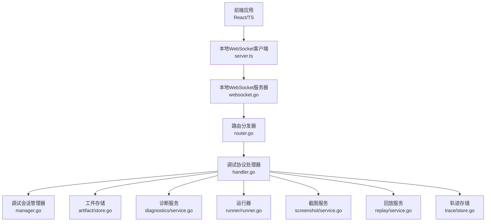
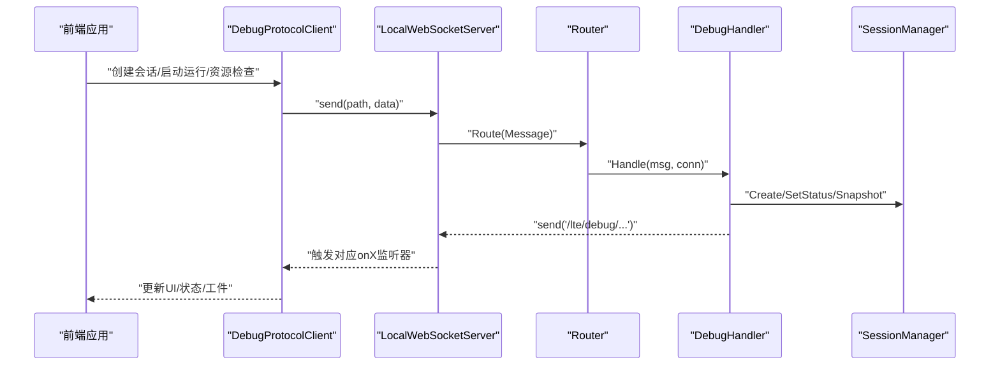
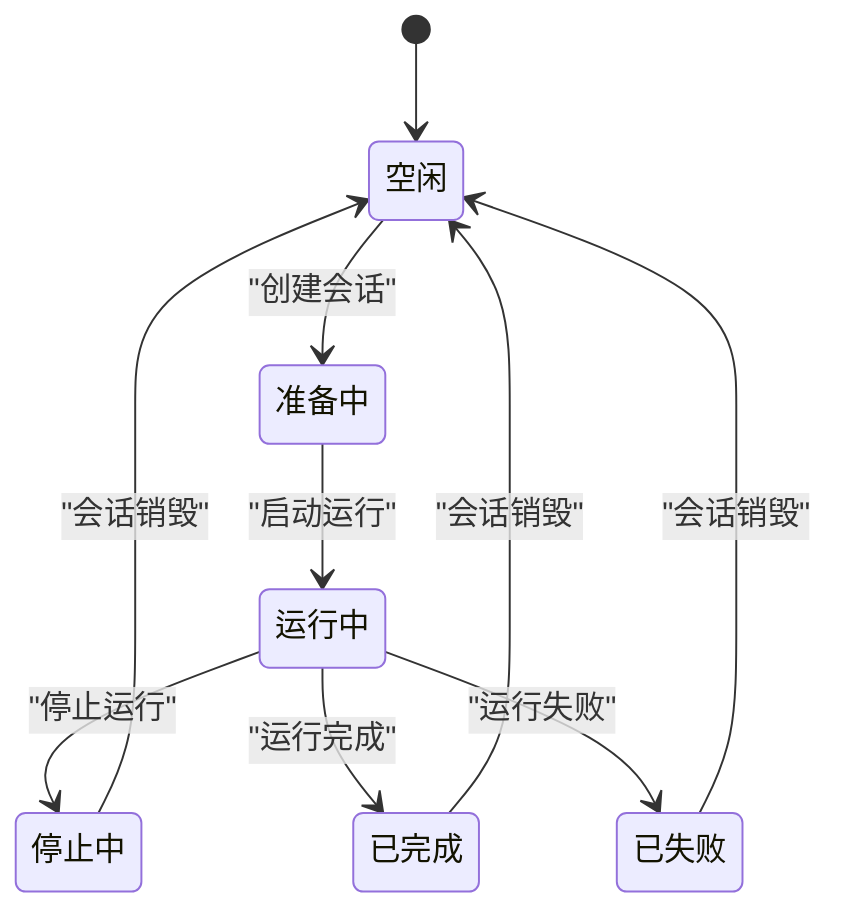
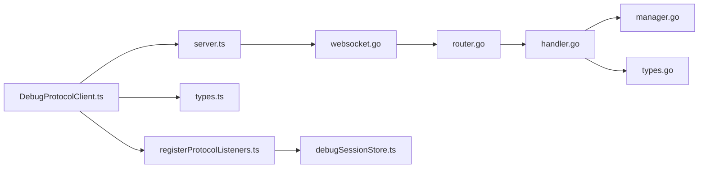

# 调试协议

<cite>
**本文引用的文件**
- [DebugProtocolClient.ts](file://src/services/protocols/DebugProtocolClient.ts)
- [server.ts](file://src/services/server.ts)
- [websocket.go](file://LocalBridge/internal/server/websocket.go)
- [router.go](file://LocalBridge/internal/router/router.go)
- [message.go](file://LocalBridge/pkg/models/message.go)
- [types.ts](file://src/features/debug/types.ts)
- [types.go](file://LocalBridge/internal/debug/protocol/types.go)
- [manager.go](file://LocalBridge/internal/debug/session/manager.go)
- [handler.go](file://LocalBridge/internal/debug/api/handler.go)
- [registry.go](file://LocalBridge/internal/debug/registry/registry.go)
- [registerProtocolListeners.ts](file://src/features/debug/registerProtocolListeners.ts)
- [debugSessionStore.ts](file://src/stores/debugSessionStore.ts)
</cite>

## 目录
1. [引言](#引言)
2. [项目结构](#项目结构)
3. [核心组件](#核心组件)
4. [架构总览](#架构总览)
5. [详细组件分析](#详细组件分析)
6. [依赖关系分析](#依赖关系分析)
7. [性能考虑](#性能考虑)
8. [故障排查指南](#故障排查指南)
9. [结论](#结论)
10. [附录](#附录)

## 引言
本文件系统性地阐述“调试协议”的设计架构、消息格式规范、会话生命周期、消息路由机制、事件订阅与发布模式、客户端实现与使用示例、版本管理与向后兼容策略，以及其在整个系统中的作用与与其他组件的交互关系。目标读者包括前端开发者、后端工程师与测试工程师。

## 项目结构
调试协议位于前端与本地服务之间，采用 WebSocket 作为传输层，基于统一的消息模型进行双向通信。前端通过本地 WebSocket 服务器封装与本地服务交互；本地服务负责路由分发、协议版本校验、调试会话管理与业务处理。

图示来源
- [server.ts:22-343](file://src/services/server.ts#L22-L343)
- [websocket.go:36-179](file://LocalBridge/internal/server/websocket.go#L36-L179)
- [router.go:29-161](file://LocalBridge/internal/router/router.go#L29-L161)
- [handler.go:27-107](file://LocalBridge/internal/debug/api/handler.go#L27-L107)
- [manager.go:41-146](file://LocalBridge/internal/debug/session/manager.go#L41-L146)

章节来源
- [server.ts:22-343](file://src/services/server.ts#L22-L343)
- [websocket.go:36-179](file://LocalBridge/internal/server/websocket.go#L36-L179)
- [router.go:29-161](file://LocalBridge/internal/router/router.go#L29-L161)

## 核心组件
- 本地 WebSocket 客户端：负责连接、握手、消息收发与路由注册，桥接前端与本地服务。
- 本地 WebSocket 服务器：管理连接生命周期、广播消息、暴露系统级路由。
- 路由分发器：根据消息路径精确或前缀匹配处理器，执行协议版本校验与错误处理。
- 调试协议处理器：实现 debug-vNext 的所有请求路由，协调会话、运行、诊断、工件、截图、回放等子系统。
- 调试会话管理器：维护会话状态机与快照，支撑调试会话的创建、销毁与查询。
- 数据模型：前后端共享的调试消息与领域模型定义，确保协议一致性。

章节来源
- [DebugProtocolClient.ts:31-353](file://src/services/protocols/DebugProtocolClient.ts#L31-L353)
- [server.ts:22-343](file://src/services/server.ts#L22-L343)
- [websocket.go:36-179](file://LocalBridge/internal/server/websocket.go#L36-L179)
- [router.go:29-161](file://LocalBridge/internal/router/router.go#L29-L161)
- [handler.go:27-107](file://LocalBridge/internal/debug/api/handler.go#L27-L107)
- [manager.go:41-146](file://LocalBridge/internal/debug/session/manager.go#L41-L146)
- [types.ts:120-481](file://src/features/debug/types.ts#L120-L481)
- [types.go:21-384](file://LocalBridge/internal/debug/protocol/types.go#L21-L384)

## 架构总览
调试协议采用“前端协议客户端 + 本地服务处理器”的双层架构。前端通过 DebugProtocolClient 统一发起请求与订阅事件；本地服务通过 Router 将消息路由至对应的 Handler；Handler 负责业务逻辑与状态变更，并通过事件通道向前端推送调试事件与结果。

图示来源
- [DebugProtocolClient.ts:77-121](file://src/services/protocols/DebugProtocolClient.ts#L77-L121)
- [server.ts:97-106](file://src/services/server.ts#L97-L106)
- [router.go:57-83](file://LocalBridge/internal/router/router.go#L57-L83)
- [handler.go:62-107](file://LocalBridge/internal/debug/api/handler.go#L62-L107)
- [manager.go:52-115](file://LocalBridge/internal/debug/session/manager.go#L52-L115)

## 详细组件分析

### 消息格式与协议版本
- 通用消息结构：包含 path（路由路径）与 data（载荷），用于请求与响应。
- 协议版本：本地服务固定协议版本常量；前端通过握手请求携带自身协议版本，若不一致则拒绝连接并提示更新。
- 错误消息：统一以 /error 或特定错误事件路径返回，包含 code、message、detail 字段。

章节来源
- [message.go:4-15](file://LocalBridge/pkg/models/message.go#L4-L15)
- [websocket.go:15-22](file://LocalBridge/internal/server/websocket.go#L15-L22)
- [router.go:115-160](file://LocalBridge/internal/router/router.go#L115-L160)
- [server.ts:42-66](file://src/services/server.ts#L42-L66)

### 会话生命周期
- 创建：前端请求 /mpe/debug/session/create，后端创建会话并返回 /lte/debug/session_created 快照。
- 查询：前端请求 /mpe/debug/session/snapshot，后端返回当前会话快照。
- 销毁：前端请求 /mpe/debug/session/destroy，后端清理回放与运行上下文并返回 /lte/debug/session_destroyed。

图示来源
- [manager.go:14-22](file://LocalBridge/internal/debug/session/manager.go#L14-L22)
- [manager.go:52-115](file://LocalBridge/internal/debug/session/manager.go#L52-L115)
- [handler.go:109-141](file://LocalBridge/internal/debug/api/handler.go#L109-L141)

章节来源
- [manager.go:41-146](file://LocalBridge/internal/debug/session/manager.go#L41-L146)
- [handler.go:109-141](file://LocalBridge/internal/debug/api/handler.go#L109-L141)

### 请求与事件路由
- 前端请求路由前缀：/mpe/debug/*
- 本地事件路由前缀：/lte/debug/*
- 典型请求：capabilities、session/*、run/*、resource/*、artifact/get、screenshot/capture、agent/test、trace/*
- 典型事件：capabilities、session_created、session_destroyed、session_snapshot、event、run_started、run_stop_requested、resource_preflight、resource_health、artifact、agent_tested、trace_snapshot、trace_replay_status、error

章节来源
- [DebugProtocolClient.ts:77-121](file://src/services/protocols/DebugProtocolClient.ts#L77-L121)
- [handler.go:58-107](file://LocalBridge/internal/debug/api/handler.go#L58-L107)

### 事件订阅与发布模式
- 前端通过 DebugProtocolClient.onX 注册事件监听器，处理器内部将后端推送的事件分发给各监听集合。
- 本地服务在处理过程中通过事件通道向前端推送实时事件，前端 Store 根据事件类型更新 UI 与工件缓存。

章节来源
- [DebugProtocolClient.ts:190-266](file://src/services/protocols/DebugProtocolClient.ts#L190-L266)
- [registerProtocolListeners.ts:15-154](file://src/features/debug/registerProtocolListeners.ts#L15-L154)

### 客户端实现与使用示例
- 初始化：在应用启动时调用 initializeWebSocket，注册各类协议客户端（含 DebugProtocolClient）。
- 订阅事件：通过 DebugProtocolClient.onCapabilities/onSessionCreated/onDebugEvent 等方法订阅感兴趣事件。
- 发起请求：调用 createSession/requestCapabilities/startRun 等方法发起调试操作。
- 示例路径参考：
  - [server.ts:361-387](file://src/services/server.ts#L361-L387)
  - [DebugProtocolClient.ts:128-188](file://src/services/protocols/DebugProtocolClient.ts#L128-L188)
  - [registerProtocolListeners.ts:21-154](file://src/features/debug/registerProtocolListeners.ts#L21-L154)

章节来源
- [server.ts:361-387](file://src/services/server.ts#L361-L387)
- [DebugProtocolClient.ts:128-188](file://src/services/protocols/DebugProtocolClient.ts#L128-L188)
- [registerProtocolListeners.ts:21-154](file://src/features/debug/registerProtocolListeners.ts#L21-L154)

### 版本管理与向后兼容
- 协议版本：本地服务固定版本常量；前端通过握手请求携带自身版本，不匹配时拒绝连接并提示更新。
- 能力清单：后端通过默认能力清单声明支持的运行模式、诊断项、工件类型、控制器与代理传输方式等。
- 兼容策略：当本地服务发现旧路由（如 debug/start）时，明确返回错误并指引使用 debug-vNext 契约。

章节来源
- [websocket.go:15-16](file://LocalBridge/internal/server/websocket.go#L15-L16)
- [router.go:115-160](file://LocalBridge/internal/router/router.go#L115-L160)
- [registry.go:5-83](file://LocalBridge/internal/debug/registry/registry.go#L5-L83)
- [handler.go:96-104](file://LocalBridge/internal/debug/api/handler.go#L96-L104)

### 与其他组件的交互关系
- 本地服务：WebSocket 服务器负责连接管理与消息分发；路由分发器负责协议版本校验与错误处理。
- 调试会话：会话管理器提供状态机与快照，供运行器、回放器、诊断服务等复用。
- 事件总线：本地服务在连接建立/断开时发布系统级事件，供其他模块感知。
- 前端 Store：调试会话 Store、工件 Store、轨迹 Store、覆盖层 Store 等接收事件并驱动 UI 更新。

章节来源
- [websocket.go:115-142](file://LocalBridge/internal/server/websocket.go#L115-L142)
- [manager.go:41-146](file://LocalBridge/internal/debug/session/manager.go#L41-L146)
- [debugSessionStore.ts:36-255](file://src/stores/debugSessionStore.ts#L36-L255)

## 依赖关系分析

图示来源
- [DebugProtocolClient.ts:1-27](file://src/services/protocols/DebugProtocolClient.ts#L1-L27)
- [server.ts:1-18](file://src/services/server.ts#L1-L18)
- [websocket.go:1-13](file://LocalBridge/internal/server/websocket.go#L1-L13)
- [router.go:1-11](file://LocalBridge/internal/router/router.go#L1-L11)
- [handler.go:1-25](file://LocalBridge/internal/debug/api/handler.go#L1-L25)
- [manager.go:1-10](file://LocalBridge/internal/debug/session/manager.go#L1-L10)
- [types.go:1-10](file://LocalBridge/internal/debug/protocol/types.go#L1-L10)
- [types.ts:1-27](file://src/features/debug/types.ts#L1-L27)
- [registerProtocolListeners.ts:1-7](file://src/features/debug/registerProtocolListeners.ts#L1-L7)
- [debugSessionStore.ts:1-14](file://src/stores/debugSessionStore.ts#L1-L14)

## 性能考虑
- 连接池与并发：本地服务通过 goroutine 管理读写循环与连接注册/注销，避免阻塞主流程。
- 消息路由：前缀匹配与精确匹配结合，减少查找成本；错误路径统一返回，便于快速定位问题。
- 事件流控：前端 Store 对事件进行去重与增量更新，降低渲染压力；工件与截图按需拉取，避免一次性传输大体积数据。
- 超时与重连：前端 WebSocket 客户端具备连接超时与重连策略，提升稳定性。

## 故障排查指南
- 协议版本不匹配：握手阶段若版本不一致，前端会收到错误提示并断开连接；应按提示更新本地服务或前端版本。
- 会话不存在：销毁或查询会话时若 ID 无效，后端返回相应错误；请先确认会话已创建且未被销毁。
- 请求参数错误：运行启动、资源检查等请求若参数缺失或非法，后端返回详细错误信息；请对照类型定义补齐必填字段。
- 代理连接异常：Agent 测试失败可能由于资源路径未配置、MaaFramework 未初始化或代理不可达；请检查资源与网络配置。
- 事件丢失：若前端未收到事件，检查路由注册与监听器绑定是否正确；确认本地服务事件通道未被阻塞。

章节来源
- [router.go:115-160](file://LocalBridge/internal/router/router.go#L115-L160)
- [handler.go:119-141](file://LocalBridge/internal/debug/api/handler.go#L119-L141)
- [handler.go:164-209](file://LocalBridge/internal/debug/api/handler.go#L164-L209)
- [handler.go:211-290](file://LocalBridge/internal/debug/api/handler.go#L211-L290)
- [handler.go:403-477](file://LocalBridge/internal/debug/api/handler.go#L403-L477)

## 结论
调试协议通过清晰的请求/事件模型、严格的版本控制与完善的会话管理，为前端提供了稳定可靠的调试能力。其模块化设计便于扩展新功能（如新的运行模式、诊断项与工件类型），同时保证了与本地服务的高效协作与良好的用户体验。

## 附录

### 调试消息类型与字段速查
- 能力清单：generation、runModes、diagnostics、artifacts、screenshotSources、profileFeatures、debugFeatures、maa.*。
- 会话快照：sessionId、status、createdAt、updatedAt、capabilities。
- 运行事件：sessionId、runId、seq、timestamp、source、kind、phase、status、node、edge、detailRef、screenshotRef、data。
- 资源预检/健康：requestId、resourcePaths、status、hash、checkedAt、durationMs、diagnostics。
- 工件：ref(id、sessionId、type、mime、size、createdAt、eventSeq)、encoding、content、data。
- 回放：active、playing、cursorSeq、minSeq、maxSeq、nodeId、speed、startedAt、updatedAt、stoppedAt、reason。
- 错误：code、message、detail。

章节来源
- [types.ts:120-481](file://src/features/debug/types.ts#L120-L481)
- [types.go:21-384](file://LocalBridge/internal/debug/protocol/types.go#L21-L384)