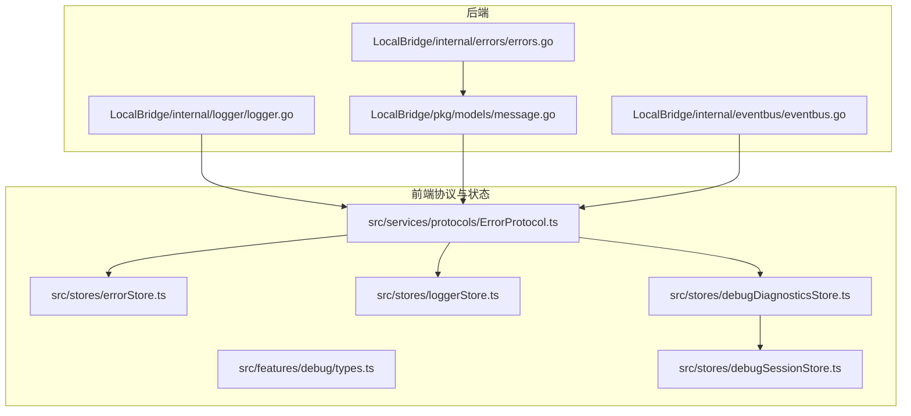
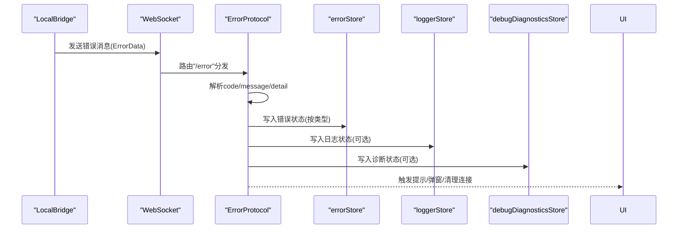
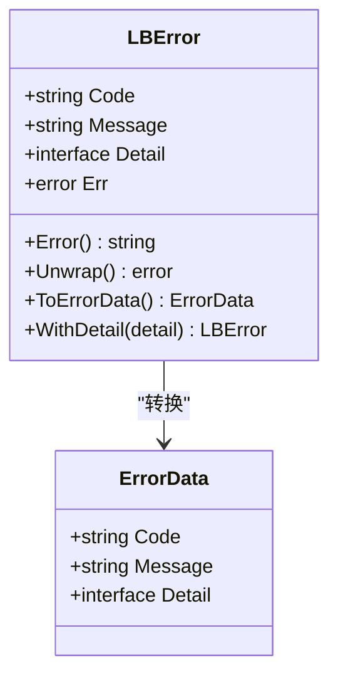
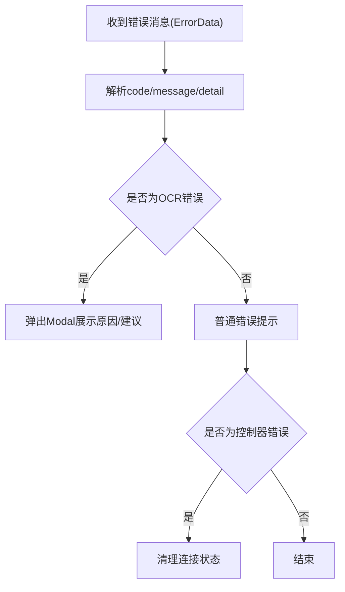
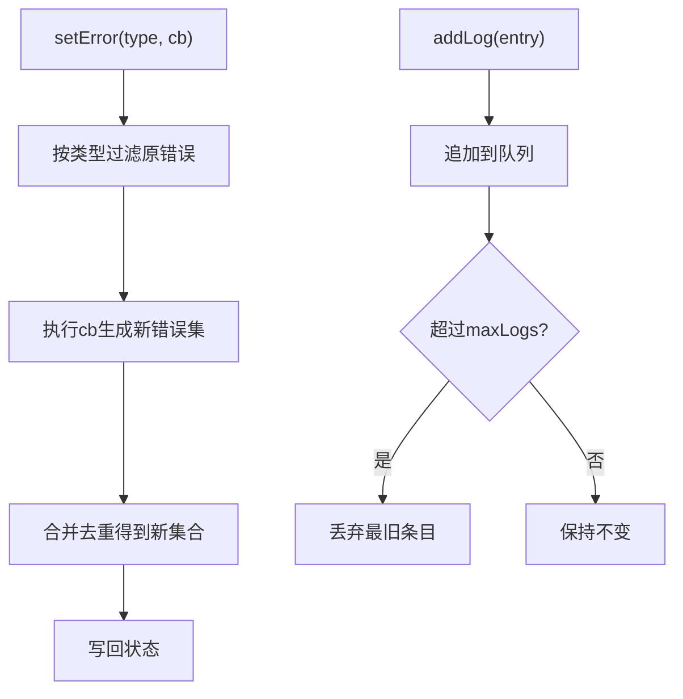
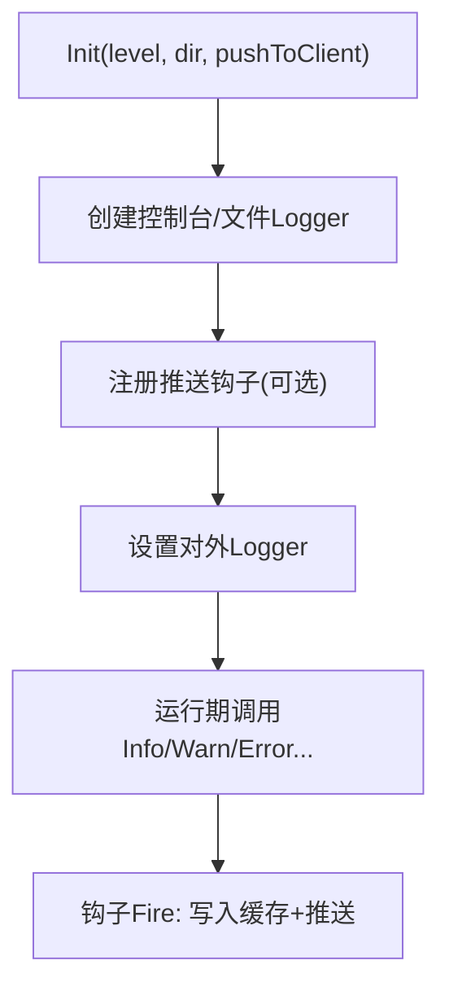
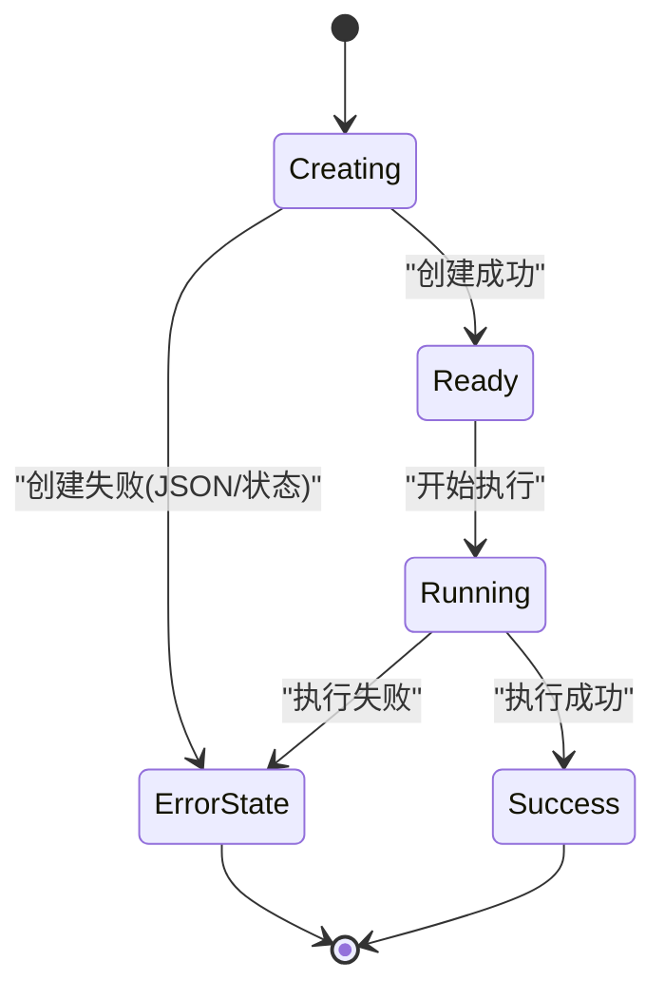
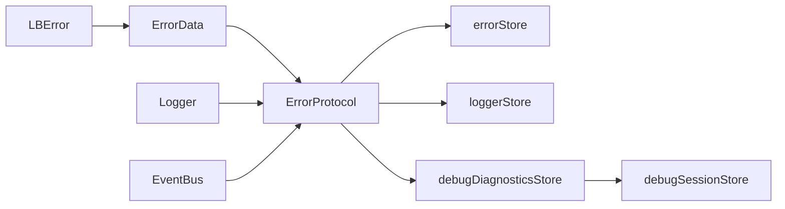

# 错误处理

<cite>
**本文引用的文件**
- [LocalBridge/internal/errors/errors.go](file://LocalBridge/internal/errors/errors.go)
- [LocalBridge/pkg/models/message.go](file://LocalBridge/pkg/models/message.go)
- [src/services/protocols/ErrorProtocol.ts](file://src/services/protocols/ErrorProtocol.ts)
- [src/stores/errorStore.ts](file://src/stores/errorStore.ts)
- [src/stores/loggerStore.ts](file://src/stores/loggerStore.ts)
- [LocalBridge/internal/logger/logger.go](file://LocalBridge/internal/logger/logger.go)
- [LocalBridge/internal/eventbus/eventbus.go](file://LocalBridge/internal/eventbus/eventbus.go)
- [src/stores/debugDiagnosticsStore.ts](file://src/stores/debugDiagnosticsStore.ts)
- [src/features/debug/types.ts](file://src/features/debug/types.ts)
- [src/stores/debugSessionStore.ts](file://src/stores/debugSessionStore.ts)
- [dev/instructions/maafw-golang-binding/Error Handling.md](file://dev/instructions/maafw-golang-binding/Error Handling.md)
</cite>

## 目录
1. [简介](#简介)
2. [项目结构](#项目结构)
3. [核心组件](#核心组件)
4. [架构总览](#架构总览)
5. [详细组件分析](#详细组件分析)
6. [依赖关系分析](#依赖关系分析)
7. [性能考量](#性能考量)
8. [故障排查指南](#故障排查指南)
9. [结论](#结论)
10. [附录](#附录)

## 简介
本文件系统性梳理并阐述本项目的错误处理体系，覆盖错误捕获与分类、错误存储与状态管理、错误协议的消息格式与处理流程、错误恢复策略与异常处理逻辑、错误诊断信息的采集与分析、错误日志的格式化与展示机制，并总结错误预防与容错设计的最佳实践，以及错误处理系统与调试系统的协同工作机制。

## 项目结构
围绕错误处理的关键文件分布如下：
- 后端桥接层（LocalBridge）负责业务错误封装与日志输出，并通过统一消息模型进行传输。
- 前端协议层（ErrorProtocol）接收后端错误消息，进行分类与用户提示，并在必要时触发状态清理。
- 前端状态层（Zustand stores）维护错误与日志、诊断等状态，支撑 UI 展示与交互。
- 事件总线（EventBus）用于跨模块解耦的事件传播，辅助错误与诊断信息的分发。
- 调试类型与会话状态（debug types & stores）承载诊断事件与协议错误，形成闭环的诊断与恢复。

**图示来源**
- [LocalBridge/internal/errors/errors.go:1-141](file://LocalBridge/internal/errors/errors.go#L1-L141)
- [LocalBridge/internal/logger/logger.go:1-251](file://LocalBridge/internal/logger/logger.go#L1-L251)
- [LocalBridge/pkg/models/message.go:1-129](file://LocalBridge/pkg/models/message.go#L1-L129)
- [src/services/protocols/ErrorProtocol.ts:1-121](file://src/services/protocols/ErrorProtocol.ts#L1-L121)
- [src/stores/errorStore.ts:1-39](file://src/stores/errorStore.ts#L1-L39)
- [src/stores/loggerStore.ts:1-46](file://src/stores/loggerStore.ts#L1-L46)
- [src/stores/debugDiagnosticsStore.ts:1-50](file://src/stores/debugDiagnosticsStore.ts#L1-L50)
- [src/features/debug/types.ts:430-481](file://src/features/debug/types.ts#L430-L481)
- [src/stores/debugSessionStore.ts:1-260](file://src/stores/debugSessionStore.ts#L1-L260)

**章节来源**
- [LocalBridge/internal/errors/errors.go:1-141](file://LocalBridge/internal/errors/errors.go#L1-L141)
- [LocalBridge/internal/logger/logger.go:1-251](file://LocalBridge/internal/logger/logger.go#L1-L251)
- [LocalBridge/pkg/models/message.go:1-129](file://LocalBridge/pkg/models/message.go#L1-L129)
- [src/services/protocols/ErrorProtocol.ts:1-121](file://src/services/protocols/ErrorProtocol.ts#L1-L121)
- [src/stores/errorStore.ts:1-39](file://src/stores/errorStore.ts#L1-L39)
- [src/stores/loggerStore.ts:1-46](file://src/stores/loggerStore.ts#L1-L46)
- [src/stores/debugDiagnosticsStore.ts:1-50](file://src/stores/debugDiagnosticsStore.ts#L1-L50)
- [src/features/debug/types.ts:430-481](file://src/features/debug/types.ts#L430-L481)
- [src/stores/debugSessionStore.ts:1-260](file://src/stores/debugSessionStore.ts#L1-L260)

## 核心组件
- 业务错误模型与工厂
  - 定义统一错误码与错误结构体，支持包装原始错误、追加详情、转换为传输模型。
  - 提供常用错误构造函数，便于在各业务场景快速生成标准化错误。
- 错误协议处理器
  - 注册路由“/error”，解析后端错误消息，按错误码映射用户提示，必要时弹出 Modal 并清理控制器连接状态。
- 前端错误与日志状态
  - 错误状态：按类型聚合与更新，支持回调式合并策略，避免重复与遗漏。
  - 日志状态：维护滚动日志列表，支持展开/收起与最大容量限制。
- 诊断与会话状态
  - 将调试事件中的诊断信息抽取为结构化对象，支持预加载、追加与清空；协议错误也纳入会话状态以便统一展示与清理。
- 日志系统
  - 支持控制台与文件双通道输出，具备钩子推送至前端、历史日志缓存与自动清理能力。
- 事件总线
  - 提供订阅/发布/异步发布机制，作为错误与诊断信息跨模块传递的基础设施。

**章节来源**
- [LocalBridge/internal/errors/errors.go:9-141](file://LocalBridge/internal/errors/errors.go#L9-L141)
- [src/services/protocols/ErrorProtocol.ts:11-121](file://src/services/protocols/ErrorProtocol.ts#L11-L121)
- [src/stores/errorStore.ts:3-39](file://src/stores/errorStore.ts#L3-L39)
- [src/stores/loggerStore.ts:1-46](file://src/stores/loggerStore.ts#L1-L46)
- [src/stores/debugDiagnosticsStore.ts:1-50](file://src/stores/debugDiagnosticsStore.ts#L1-L50)
- [src/stores/debugSessionStore.ts:1-260](file://src/stores/debugSessionStore.ts#L1-L260)
- [LocalBridge/internal/logger/logger.go:1-251](file://LocalBridge/internal/logger/logger.go#L1-L251)
- [LocalBridge/internal/eventbus/eventbus.go:1-83](file://LocalBridge/internal/eventbus/eventbus.go#L1-L83)

## 架构总览
后端通过统一消息模型发送错误数据，前端协议层解析并分类，随后写入错误与日志状态，最终由 UI 展示；同时，调试事件中的诊断信息被抽取并写入诊断状态，与协议错误共同构成完整的诊断闭环。

**图示来源**
- [LocalBridge/pkg/models/message.go:9-14](file://LocalBridge/pkg/models/message.go#L9-L14)
- [src/services/protocols/ErrorProtocol.ts:20-79](file://src/services/protocols/ErrorProtocol.ts#L20-L79)
- [src/stores/errorStore.ts:17-38](file://src/stores/errorStore.ts#L17-L38)
- [src/stores/loggerStore.ts:11-45](file://src/stores/loggerStore.ts#L11-L45)
- [src/stores/debugDiagnosticsStore.ts:4-49](file://src/stores/debugDiagnosticsStore.ts#L4-L49)

## 详细组件分析

### 业务错误模型与工厂
- 错误码集中定义，覆盖文件系统、JSON 校验、权限、请求参数、连接失败、内部错误等常见场景。
- 错误结构体包含 Code、Message、Detail、Err 字段，支持 Wrap 原始错误与 ToErrorData 转换，便于前后端一致传输。
- 预定义构造函数提供路径、原因等上下文细节，提升可诊断性。

**图示来源**
- [LocalBridge/internal/errors/errors.go:23-50](file://LocalBridge/internal/errors/errors.go#L23-L50)
- [LocalBridge/pkg/models/message.go:9-14](file://LocalBridge/pkg/models/message.go#L9-L14)

**章节来源**
- [LocalBridge/internal/errors/errors.go:9-141](file://LocalBridge/internal/errors/errors.go#L9-L141)
- [LocalBridge/pkg/models/message.go:9-14](file://LocalBridge/pkg/models/message.go#L9-L14)

### 错误协议的消息格式与处理流程
- 消息结构：包含 path 与 data，其中 data 为 ErrorData。
- 处理流程：
  - 解析 code/message/detail；
  - 按错误码映射用户提示文本；
  - 对特定 OCR 类错误弹出 Modal，展示原因、资源目录与排查建议；
  - 对控制器类错误清理连接状态；
  - 使用动态导入避免循环依赖，统一错误提示。

**图示来源**
- [src/services/protocols/ErrorProtocol.ts:27-79](file://src/services/protocols/ErrorProtocol.ts#L27-L79)
- [LocalBridge/pkg/models/message.go:3-7](file://LocalBridge/pkg/models/message.go#L3-L7)

**章节来源**
- [src/services/protocols/ErrorProtocol.ts:11-121](file://src/services/protocols/ErrorProtocol.ts#L11-L121)
- [LocalBridge/pkg/models/message.go:3-14](file://LocalBridge/pkg/models/message.go#L3-L14)

### 错误存储与状态管理
- 错误状态
  - 类型化错误集合，按 type 过滤与合并，支持回调式更新，确保幂等与一致性。
- 日志状态
  - 固定容量队列，自动丢弃最旧条目，支持展开/收起切换，便于 UI 性能与体验平衡。
- 诊断与会话状态
  - 从调试事件中提取诊断信息，统一为结构化对象；协议错误写入会话状态，便于统一展示与清理。

**图示来源**
- [src/stores/errorStore.ts:13-38](file://src/stores/errorStore.ts#L13-L38)
- [src/stores/loggerStore.ts:26-45](file://src/stores/loggerStore.ts#L26-L45)
- [src/stores/debugDiagnosticsStore.ts:40-49](file://src/stores/debugDiagnosticsStore.ts#L40-L49)
- [src/stores/debugSessionStore.ts:143-145](file://src/stores/debugSessionStore.ts#L143-L145)

**章节来源**
- [src/stores/errorStore.ts:3-39](file://src/stores/errorStore.ts#L3-L39)
- [src/stores/loggerStore.ts:1-46](file://src/stores/loggerStore.ts#L1-L46)
- [src/stores/debugDiagnosticsStore.ts:1-50](file://src/stores/debugDiagnosticsStore.ts#L1-L50)
- [src/stores/debugSessionStore.ts:1-260](file://src/stores/debugSessionStore.ts#L1-L260)

### 日志系统与历史缓存
- 控制台与文件双通道输出，支持钩子推送至前端，历史日志缓存上限固定，自动清理过期日志文件。
- 提供便捷方法与模块化入口，便于在各子系统中统一注入模块标识。

**图示来源**
- [LocalBridge/internal/logger/logger.go:43-100](file://LocalBridge/internal/logger/logger.go#L43-L100)
- [LocalBridge/internal/logger/logger.go:137-162](file://LocalBridge/internal/logger/logger.go#L137-L162)

**章节来源**
- [LocalBridge/internal/logger/logger.go:1-251](file://LocalBridge/internal/logger/logger.go#L1-L251)

### 事件总线与跨模块协作
- 提供同步/异步发布与订阅，支持取消订阅，作为错误与诊断信息跨模块传递的基础设施。
- 在错误处理与调试诊断场景中，事件总线可作为补充通道，降低耦合度。

**章节来源**
- [LocalBridge/internal/eventbus/eventbus.go:1-83](file://LocalBridge/internal/eventbus/eventbus.go#L1-L83)

### 诊断信息采集与分析
- 从调试事件中抽取诊断对象，包含严重程度、代码、消息、文件/节点/字段路径等元信息。
- 诊断状态支持预加载、追加与清空，配合会话状态统一呈现。

**章节来源**
- [src/stores/debugDiagnosticsStore.ts:1-50](file://src/stores/debugDiagnosticsStore.ts#L1-L50)
- [src/features/debug/types.ts:430-468](file://src/features/debug/types.ts#L430-L468)

### 错误恢复策略与异常处理逻辑
- 即时失败与显式检查：遵循 Go 语言标准模式，操作失败立即返回错误，调用方必须显式检查。
- 任务作业错误状态：任务创建阶段的错误（如 JSON 序列化失败）会被保存并在后续查询中返回，保证错误可见性。
- 控制器错误清理：当出现控制器未找到、未连接或连接失败等错误时，协议层主动清理连接状态，避免后续误用。
- 任务执行超时与回退：框架层面支持节点超时与 onError 列表回退，结合错误处理形成稳健的执行链路。

**图示来源**
- [dev/instructions/maafw-golang-binding/Error Handling.md:389-591](file://dev/instructions/maafw-golang-binding/Error Handling.md#L389-L591)

**章节来源**
- [dev/instructions/maafw-golang-binding/Error Handling.md:19-82](file://dev/instructions/maafw-golang-binding/Error Handling.md#L19-L82)
- [dev/instructions/maafw-golang-binding/Error Handling.md:389-591](file://dev/instructions/maafw-golang-binding/Error Handling.md#L389-L591)

## 依赖关系分析
- 错误模型与消息模型
  - 后端错误对象经 ToErrorData 转换为传输模型，前端协议层以 ErrorData 为输入进行处理。
- 协议与状态
  - ErrorProtocol 依赖前端状态（errorStore、loggerStore、debugDiagnosticsStore），并通过会话状态（debugSessionStore）统一展示协议错误。
- 日志与事件
  - 后端日志系统通过钩子推送至前端，事件总线为跨模块传递提供补充通道。

**图示来源**
- [LocalBridge/internal/errors/errors.go:44-50](file://LocalBridge/internal/errors/errors.go#L44-L50)
- [LocalBridge/pkg/models/message.go:9-14](file://LocalBridge/pkg/models/message.go#L9-L14)
- [src/services/protocols/ErrorProtocol.ts:20-79](file://src/services/protocols/ErrorProtocol.ts#L20-L79)
- [src/stores/errorStore.ts:17-38](file://src/stores/errorStore.ts#L17-L38)
- [src/stores/loggerStore.ts:11-45](file://src/stores/loggerStore.ts#L11-L45)
- [src/stores/debugDiagnosticsStore.ts:4-49](file://src/stores/debugDiagnosticsStore.ts#L4-L49)
- [src/stores/debugSessionStore.ts:143-145](file://src/stores/debugSessionStore.ts#L143-L145)
- [LocalBridge/internal/logger/logger.go:137-162](file://LocalBridge/internal/logger/logger.go#L137-L162)
- [LocalBridge/internal/eventbus/eventbus.go:29-64](file://LocalBridge/internal/eventbus/eventbus.go#L29-L64)

**章节来源**
- [LocalBridge/internal/errors/errors.go:44-50](file://LocalBridge/internal/errors/errors.go#L44-L50)
- [src/services/protocols/ErrorProtocol.ts:20-79](file://src/services/protocols/ErrorProtocol.ts#L20-L79)
- [src/stores/errorStore.ts:17-38](file://src/stores/errorStore.ts#L17-L38)
- [src/stores/loggerStore.ts:11-45](file://src/stores/loggerStore.ts#L11-L45)
- [src/stores/debugDiagnosticsStore.ts:4-49](file://src/stores/debugDiagnosticsStore.ts#L4-L49)
- [src/stores/debugSessionStore.ts:143-145](file://src/stores/debugSessionStore.ts#L143-L145)
- [LocalBridge/internal/logger/logger.go:137-162](file://LocalBridge/internal/logger/logger.go#L137-L162)
- [LocalBridge/internal/eventbus/eventbus.go:29-64](file://LocalBridge/internal/eventbus/eventbus.go#L29-L64)

## 性能考量
- 日志缓存与容量控制：前端日志状态采用固定容量队列，避免无限增长导致内存压力；后端日志缓存同样有上限，且自动清理旧日志文件。
- 推送钩子与异步：日志钩子仅推送 Info/Warn/Error 至前端，避免高频 Trace 导致 UI 抖动；事件总线支持异步发布，降低阻塞风险。
- 错误提示动态导入：前端错误提示使用动态导入，避免协议层与 UI 组件的直接循环依赖，提升启动性能与模块化程度。

[本节为通用指导，无需列出具体文件来源]

## 故障排查指南
- 快速定位
  - 查看前端日志状态与错误状态，确认最近一次错误码与消息。
  - 若为控制器类错误，检查连接状态是否已被清理。
- 诊断信息
  - 通过调试诊断状态查看诊断事件，核对严重程度、代码与上下文信息。
- 日志分析
  - 后端日志文件按日期命名，自动清理过期文件；可在问题复现时对比时间戳与模块字段。
- 协议错误
  - 会话状态中的协议错误可用于统一展示与清理，避免分散处理。

**章节来源**
- [src/stores/loggerStore.ts:1-46](file://src/stores/loggerStore.ts#L1-L46)
- [src/stores/errorStore.ts:1-39](file://src/stores/errorStore.ts#L1-L39)
- [src/stores/debugDiagnosticsStore.ts:1-50](file://src/stores/debugDiagnosticsStore.ts#L1-L50)
- [src/stores/debugSessionStore.ts:1-260](file://src/stores/debugSessionStore.ts#L1-L260)
- [LocalBridge/internal/logger/logger.go:209-250](file://LocalBridge/internal/logger/logger.go#L209-L250)

## 结论
本项目通过“后端统一错误封装 + 前端协议分类处理 + 状态驱动展示”的架构，实现了从错误捕获、分类、存储到诊断与恢复的闭环。配合日志系统与事件总线，既保证了可观测性，又兼顾了性能与用户体验。建议在后续迭代中持续完善错误码覆盖、增强自动化诊断与恢复策略，并加强跨模块的错误传播与一致性校验。

[本节为总结性内容，无需列出具体文件来源]

## 附录

### 错误码与类别对照（节选）
- 文件相关：FILE_NOT_FOUND、FILE_READ_ERROR、FILE_WRITE_ERROR、FILE_NAME_CONFLICT、INVALID_JSON、PERMISSION_DENIED
- MFW 相关：MFW_NOT_INITIALIZED、MFW_CONTROLLER_CREATE_FAIL、MFW_CONTROLLER_NOT_FOUND、MFW_CONTROLLER_CONNECT_FAIL、MFW_CONTROLLER_NOT_CONNECTED、MFW_DEVICE_NOT_FOUND、MFW_OCR_RESOURCE_NOT_CONFIGURED、MFW_RESOURCE_LOAD_FAILED、MFW_TASK_SUBMIT_FAILED

**章节来源**
- [LocalBridge/internal/errors/errors.go:10-20](file://LocalBridge/internal/errors/errors.go#L10-L20)
- [src/services/protocols/ErrorProtocol.ts:31-51](file://src/services/protocols/ErrorProtocol.ts#L31-L51)