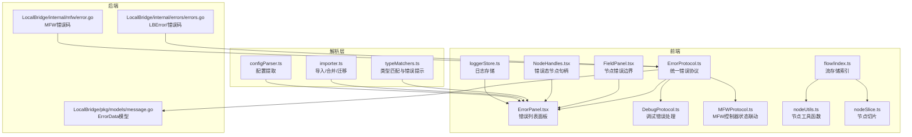
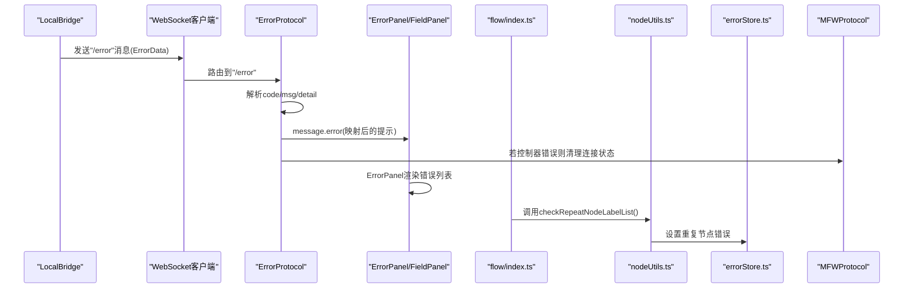
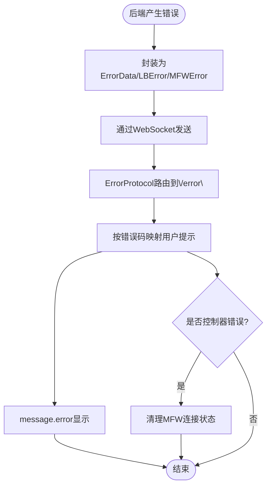
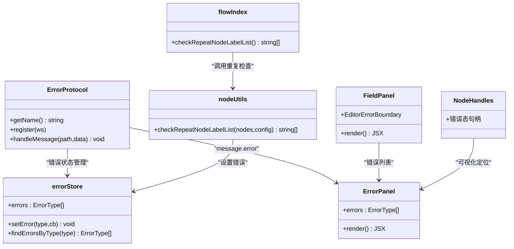
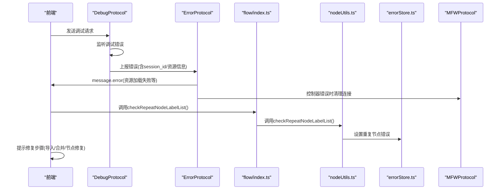
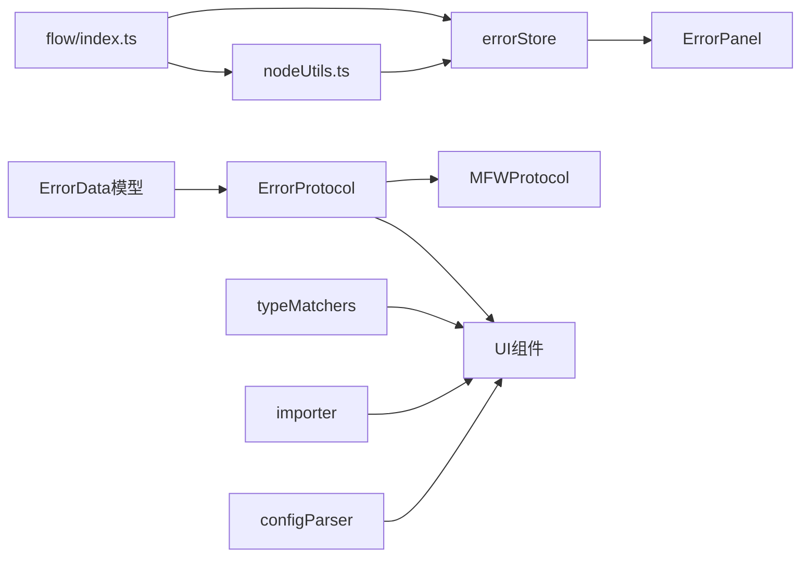

# 错误诊断

<cite>
**本文引用的文件**
- [LocalBridge/internal/errors/errors.go](file://LocalBridge/internal/errors/errors.go)
- [LocalBridge/internal/mfw/error.go](file://LocalBridge/internal/mfw/error.go)
- [LocalBridge/pkg/models/message.go](file://LocalBridge/pkg/models/message.go)
- [src/services/protocols/ErrorProtocol.ts](file://src/services/protocols/ErrorProtocol.ts)
- [src/stores/errorStore.ts](file://src/stores/errorStore.ts)
- [src/components/panels/main/ErrorPanel.tsx](file://src/components/panels/main/ErrorPanel.tsx)
- [src/components/panels/main/FieldPanel.tsx](file://src/components/panels/main/FieldPanel.tsx)
- [src/components/flow/nodes/components/NodeHandles.tsx](file://src/components/flow/nodes/components/NodeHandles.tsx)
- [src/services/protocols/DebugProtocol.ts](file://src/services/protocols/DebugProtocol.ts)
- [src/services/protocols/MFWProtocol.ts](file://src/services/protocols/MFWProtocol.ts)
- [src/stores/loggerStore.ts](file://src/stores/loggerStore.ts)
- [src/core/parser/typeMatchers.ts](file://src/core/parser/typeMatchers.ts)
- [src/core/parser/importer.ts](file://src/core/parser/importer.ts)
- [src/core/parser/configParser.ts](file://src/core/parser/configParser.ts)
- [src/stores/flow/index.ts](file://src/stores/flow/index.ts)
- [src/stores/flow/utils/nodeUtils.ts](file://src/stores/flow/utils/nodeUtils.ts)
- [src/stores/flow/slices/nodeSlice.ts](file://src/stores/flow/slices/nodeSlice.ts)
</cite>

## 更新摘要
**所做更改**
- 更新了重复节点名检查功能的实现位置，从节点切片存储迁移到流存储索引中
- 增强了错误检测的集中化管理，提升了系统的整体一致性
- 完善了错误检测机制的架构描述，反映了最新的代码组织方式

## 目录
1. [引言](#引言)
2. [项目结构](#项目结构)
3. [核心组件](#核心组件)
4. [架构总览](#架构总览)
5. [详细组件分析](#详细组件分析)
6. [依赖分析](#依赖分析)
7. [性能考虑](#性能考虑)
8. [故障排查指南](#故障排查指南)
9. [结论](#结论)
10. [附录](#附录)

## 引言
本文件面向MaaPipelineEditor的错误诊断系统，系统性梳理错误类型分类、检测机制、信息展示、诊断流程、预防与最佳实践，并结合代码实现给出可操作的排障建议与常见案例。

## 项目结构
围绕错误诊断的关键模块分布如下：
- 后端错误模型与错误码：LocalBridge内部错误封装与MFW错误码
- 前端错误协议与展示：统一错误协议、错误面板、错误边界
- 流存储索引与节点检查：集中化的重复节点名检查功能
- 调试与MFW协议：调试错误处理、控制器状态联动
- 解析层校验：类型匹配与导入过程中的错误提示
- 日志与持久化：日志存储与展示

**图表来源**
- [src/services/protocols/ErrorProtocol.ts:1-68](file://src/services/protocols/ErrorProtocol.ts#L1-L68)
- [src/components/panels/main/ErrorPanel.tsx:1-38](file://src/components/panels/main/ErrorPanel.tsx#L1-L38)
- [src/components/panels/main/FieldPanel.tsx:121-182](file://src/components/panels/main/FieldPanel.tsx#L121-L182)
- [src/components/flow/nodes/components/NodeHandles.tsx:78-133](file://src/components/flow/nodes/components/NodeHandles.tsx#L78-L133)
- [src/services/protocols/DebugProtocol.ts:444-471](file://src/services/protocols/DebugProtocol.ts#L444-L471)
- [src/services/protocols/MFWProtocol.ts:130-226](file://src/services/protocols/MFWProtocol.ts#L130-L226)
- [src/stores/loggerStore.ts:1-46](file://src/stores/loggerStore.ts#L1-L46)
- [src/stores/flow/index.ts:1-109](file://src/stores/flow/index.ts#L1-L109)
- [src/stores/flow/utils/nodeUtils.ts:248-275](file://src/stores/flow/utils/nodeUtils.ts#L248-L275)
- [src/stores/flow/slices/nodeSlice.ts:32-32](file://src/stores/flow/slices/nodeSlice.ts#L32-L32)
- [LocalBridge/internal/errors/errors.go:1-141](file://LocalBridge/internal/errors/errors.go#L1-L141)
- [LocalBridge/internal/mfw/error.go:1-53](file://LocalBridge/internal/mfw/error.go#L1-L53)
- [LocalBridge/pkg/models/message.go:1-126](file://LocalBridge/pkg/models/message.go#L1-L126)
- [src/core/parser/typeMatchers.ts:300-340](file://src/core/parser/typeMatchers.ts#L300-L340)
- [src/core/parser/importer.ts:155-249](file://src/core/parser/importer.ts#L155-L249)
- [src/core/parser/configParser.ts:49-68](file://src/core/parser/configParser.ts#L49-L68)

**章节来源**
- [src/services/protocols/ErrorProtocol.ts:1-68](file://src/services/protocols/ErrorProtocol.ts#L1-L68)
- [src/components/panels/main/ErrorPanel.tsx:1-38](file://src/components/panels/main/ErrorPanel.tsx#L1-L38)
- [src/components/panels/main/FieldPanel.tsx:121-182](file://src/components/panels/main/FieldPanel.tsx#L121-L182)
- [src/components/flow/nodes/components/NodeHandles.tsx:78-133](file://src/components/flow/nodes/components/NodeHandles.tsx#L78-L133)
- [src/services/protocols/DebugProtocol.ts:444-471](file://src/services/protocols/DebugProtocol.ts#L444-L471)
- [src/services/protocols/MFWProtocol.ts:130-226](file://src/services/protocols/MFWProtocol.ts#L130-L226)
- [src/stores/loggerStore.ts:1-46](file://src/stores/loggerStore.ts#L1-L46)
- [src/stores/flow/index.ts:1-109](file://src/stores/flow/index.ts#L1-L109)
- [src/stores/flow/utils/nodeUtils.ts:248-275](file://src/stores/flow/utils/nodeUtils.ts#L248-L275)
- [src/stores/flow/slices/nodeSlice.ts:32-32](file://src/stores/flow/slices/nodeSlice.ts#L32-L32)
- [LocalBridge/internal/errors/errors.go:1-141](file://LocalBridge/internal/errors/errors.go#L1-L141)
- [LocalBridge/internal/mfw/error.go:1-53](file://LocalBridge/internal/mfw/error.go#L1-L53)
- [LocalBridge/pkg/models/message.go:1-126](file://LocalBridge/pkg/models/message.go#L1-L126)
- [src/core/parser/typeMatchers.ts:300-340](file://src/core/parser/typeMatchers.ts#L300-L340)
- [src/core/parser/importer.ts:155-249](file://src/core/parser/importer.ts#L155-L249)
- [src/core/parser/configParser.ts:49-68](file://src/core/parser/configParser.ts#L49-L68)

## 核心组件
- 错误模型与错误码
  - 后端定义了统一的LBError结构与常用错误码，便于跨协议传递与前端展示。
  - MFW侧定义了控制器、连接、资源等专用错误码，用于设备与框架交互错误。
- 错误协议与展示
  - ErrorProtocol统一接收后端错误消息，按错误码映射为用户可读提示，并在特定控制器错误时清理连接状态。
  - ErrorPanel负责在UI侧聚合展示错误列表；FieldPanel提供节点级错误边界与修复引导。
- 流存储索引与节点检查
  - **更新** 重复节点名检查功能已迁移到流存储索引中，通过`checkRepeatNodeLabelList()`函数统一管理，实现了错误检测的集中化。
  - 节点工具函数提供底层的重复检查逻辑，支持前缀处理和不同节点类型的过滤。
- 调试与MFW协议
  - DebugProtocol在调试过程中捕获并上报错误，辅助定位资源加载与执行问题。
  - MFWProtocol在控制器状态变化时联动UI提示与状态清理。
- 解析层校验
  - typeMatchers在参数类型不匹配时发出错误通知；importer在导入/合并/迁移过程中进行兼容与提示。
- 日志与持久化
  - loggerStore维护日志队列，支持展开/收起与上限控制，便于排障与回溯。

**章节来源**
- [LocalBridge/internal/errors/errors.go:10-141](file://LocalBridge/internal/errors/errors.go#L10-L141)
- [LocalBridge/internal/mfw/error.go:5-53](file://LocalBridge/internal/mfw/error.go#L5-L53)
- [LocalBridge/pkg/models/message.go:9-14](file://LocalBridge/pkg/models/message.go#L9-L14)
- [src/services/protocols/ErrorProtocol.ts:26-66](file://src/services/protocols/ErrorProtocol.ts#L26-L66)
- [src/components/panels/main/ErrorPanel.tsx:8-35](file://src/components/panels/main/ErrorPanel.tsx#L8-L35)
- [src/components/panels/main/FieldPanel.tsx:121-182](file://src/components/panels/main/FieldPanel.tsx#L121-L182)
- [src/stores/flow/index.ts:69-89](file://src/stores/flow/index.ts#L69-L89)
- [src/stores/flow/utils/nodeUtils.ts:248-275](file://src/stores/flow/utils/nodeUtils.ts#L248-L275)
- [src/services/protocols/DebugProtocol.ts:444-471](file://src/services/protocols/DebugProtocol.ts#L444-L471)
- [src/services/protocols/MFWProtocol.ts:130-226](file://src/services/protocols/MFWProtocol.ts#L130-L226)
- [src/core/parser/typeMatchers.ts:300-340](file://src/core/parser/typeMatchers.ts#L300-L340)
- [src/core/parser/importer.ts:155-249](file://src/core/parser/importer.ts#L155-L249)
- [src/stores/loggerStore.ts:21-45](file://src/stores/loggerStore.ts#L21-L45)

## 架构总览
错误诊断系统采用"后端产生错误 -> 协议转发 -> 前端统一展示/联动"的分层设计，解析层与调试链路提供前置校验与上下文信息，日志系统提供持久化记录。**更新** 重复节点名检查现已集中到流存储索引中，通过单一入口管理所有节点相关的错误检测。

**图表来源**
- [LocalBridge/pkg/models/message.go:9-14](file://LocalBridge/pkg/models/message.go#L9-L14)
- [src/services/protocols/ErrorProtocol.ts:19-66](file://src/services/protocols/ErrorProtocol.ts#L19-L66)
- [src/components/panels/main/ErrorPanel.tsx:8-35](file://src/components/panels/main/ErrorPanel.tsx#L8-L35)
- [src/stores/flow/index.ts:69-89](file://src/stores/flow/index.ts#L69-L89)
- [src/stores/flow/utils/nodeUtils.ts:248-275](file://src/stores/flow/utils/nodeUtils.ts#L248-L275)
- [src/stores/errorStore.ts:24-38](file://src/stores/errorStore.ts#L24-L38)
- [src/services/protocols/MFWProtocol.ts:191-205](file://src/services/protocols/MFWProtocol.ts#L191-L205)

## 详细组件分析

### 错误类型分类体系
- 配置错误
  - 表现：JSON格式无效、配置键缺失或标记不正确、参数类型不匹配。
  - 触发点：导入/合并/迁移、类型匹配、配置提取。
- 连接错误
  - 表现：控制器不存在/未连接、连接失败、设备刷新失败。
  - 触发点：MFW控制器创建/连接、状态更新。
- 执行错误
  - 表现：调试阶段节点执行失败、资源加载失败、操作失败。
  - 触发点：调试协议、MFW操作结果。
- 资源错误
  - 表现：OCR资源未配置、资源加载失败、截图失败。
  - 触发点：MFW资源/截图处理。
- 文件/权限错误
  - 表现：文件不存在、读写失败、权限不足、文件名冲突。
  - 触发点：文件操作与后端错误封装。
- **新增** 节点命名错误
  - 表现：重复的节点名称，影响导出配置的唯一性要求。
  - 触发点：节点添加、编辑、删除操作后的统一检查。

**章节来源**
- [src/core/parser/typeMatchers.ts:300-340](file://src/core/parser/typeMatchers.ts#L300-L340)
- [src/core/parser/importer.ts:155-249](file://src/core/parser/importer.ts#L155-L249)
- [src/services/protocols/DebugProtocol.ts:444-471](file://src/services/protocols/DebugProtocol.ts#L444-L471)
- [LocalBridge/internal/mfw/error.go:5-21](file://LocalBridge/internal/mfw/error.go#L5-L21)
- [LocalBridge/internal/errors/errors.go:10-20](file://LocalBridge/internal/errors/errors.go#L10-L20)
- [src/stores/errorStore.ts:3-5](file://src/stores/errorStore.ts#L3-L5)

### 错误检测机制
- 自动错误捕获
  - 后端通过LBError/MFWError统一包装错误，前端ErrorProtocol集中处理。
- 异常状态识别
  - 控制器类错误码触发连接状态清理，避免误导性状态。
- 错误传播路径追踪
  - 通过ErrorData携带code/msg/detail，前端按码映射提示并记录日志。
- **更新** 集中式重复节点检查
  - 重复节点名检查现已迁移到流存储索引中，通过`checkRepeatNodeLabelList()`函数统一管理。
  - 节点工具函数提供底层的重复检查逻辑，支持前缀处理和不同节点类型的过滤。
  - 节点切片在关键操作后自动调用检查函数，确保状态一致性。

**图表来源**
- [LocalBridge/pkg/models/message.go:9-14](file://LocalBridge/pkg/models/message.go#L9-L14)
- [LocalBridge/internal/errors/errors.go:44-50](file://LocalBridge/internal/errors/errors.go#L44-L50)
- [LocalBridge/internal/mfw/error.go:34-52](file://LocalBridge/internal/mfw/error.go#L34-L52)
- [src/services/protocols/ErrorProtocol.ts:26-66](file://src/services/protocols/ErrorProtocol.ts#L26-L66)

### 错误信息展示系统
- 错误详情显示
  - ErrorProtocol根据code映射为用户可读提示，优先使用detail或msg。
- 错误级别标识
  - 使用Ant Design的message.error统一呈现，配合日志store持久化记录。
- 错误位置定位
  - FieldPanel提供节点级错误边界，渲染失败时提示可能原因并提供修复按钮。
  - NodeHandles在节点上提供错误态句柄，便于视觉定位。
- **更新** 集中式错误管理
  - 错误存储通过`setError()`方法统一管理，支持按错误类型过滤和更新。
  - 错误面板实时响应错误状态变化，提供完整的错误列表展示。

**图表来源**
- [src/services/protocols/ErrorProtocol.ts:10-66](file://src/services/protocols/ErrorProtocol.ts#L10-L66)
- [src/components/panels/main/ErrorPanel.tsx:8-35](file://src/components/panels/main/ErrorPanel.tsx#L8-L35)
- [src/components/panels/main/FieldPanel.tsx:121-182](file://src/components/panels/main/FieldPanel.tsx#L121-L182)
- [src/components/flow/nodes/components/NodeHandles.tsx:78-133](file://src/components/flow/nodes/components/NodeHandles.tsx#L78-L133)
- [src/stores/errorStore.ts:17-38](file://src/stores/errorStore.ts#L17-L38)
- [src/stores/flow/index.ts:69-89](file://src/stores/flow/index.ts#L69-L89)
- [src/stores/flow/utils/nodeUtils.ts:248-275](file://src/stores/flow/utils/nodeUtils.ts#L248-L275)

### 错误诊断流程
- 错误原因分析
  - 依据错误码映射与上下文（如调试session_id、资源路径）判断来源。
- 可能解决方案推荐
  - 控制器类错误：检查设备/连接状态；资源类错误：检查资源配置与路径。
  - **更新** 节点命名错误：修改重复的节点名称，确保唯一性。
- 修复步骤指导
  - FieldPanel提供"尝试修复节点"入口；导入/合并流程提示检查键顺序与配置标记。
  - **更新** 重复节点名：通过错误面板查看具体重复的节点名称，逐一修改。

**图表来源**
- [src/services/protocols/DebugProtocol.ts:444-471](file://src/services/protocols/DebugProtocol.ts#L444-L471)
- [src/services/protocols/ErrorProtocol.ts:26-66](file://src/services/protocols/ErrorProtocol.ts#L26-L66)
- [src/stores/flow/index.ts:69-89](file://src/stores/flow/index.ts#L69-L89)
- [src/stores/flow/utils/nodeUtils.ts:248-275](file://src/stores/flow/utils/nodeUtils.ts#L248-L275)
- [src/stores/errorStore.ts:24-38](file://src/stores/errorStore.ts#L24-L38)
- [src/services/protocols/MFWProtocol.ts:191-205](file://src/services/protocols/MFWProtocol.ts#L191-L205)

### 错误预防机制
- 配置验证
  - typeMatchers在类型不匹配时发出错误通知，避免错误参数进入执行阶段。
- 连接状态检查
  - MFWProtocol在控制器断开时主动清理连接状态，防止误判。
- 资源可用性检测
  - MFW侧在截图/资源操作失败时返回错误码，前端统一提示。
- **更新** 集中式重复节点预防
  - 节点切片在节点添加、编辑、删除等关键操作后自动调用重复检查。
  - 节点工具函数提供底层的重复检查逻辑，支持前缀处理和不同节点类型的过滤。
  - 错误存储统一管理重复节点错误，确保状态一致性。

**章节来源**
- [src/core/parser/typeMatchers.ts:300-340](file://src/core/parser/typeMatchers.ts#L300-L340)
- [src/services/protocols/MFWProtocol.ts:191-205](file://src/services/protocols/MFWProtocol.ts#L191-L205)
- [LocalBridge/internal/mfw/error.go:11-21](file://LocalBridge/internal/mfw/error.go#L11-L21)
- [src/stores/flow/slices/nodeSlice.ts:123-129](file://src/stores/flow/slices/nodeSlice.ts#L123-L129)
- [src/stores/flow/index.ts:69-89](file://src/stores/flow/index.ts#L69-L89)
- [src/stores/flow/utils/nodeUtils.ts:248-275](file://src/stores/flow/utils/nodeUtils.ts#L248-L275)

### 错误处理最佳实践
- 错误恢复策略
  - 控制器错误时清理连接状态，避免后续误用；资源错误时提示检查路径与配置。
  - **更新** 重复节点错误：提供自动修复建议，修改重复名称或删除多余节点。
- 降级处理方案
  - 导入/合并失败时回退为空对象并提示；类型不匹配时跳过校验（若允许）保留原始值。
- 用户友好的错误提示
  - 使用ErrorProtocol按码映射提示；在调试错误中区分资源加载失败场景并给出修复建议。
  - **更新** 错误面板提供详细的重复节点列表，支持快速定位和修复。

**章节来源**
- [src/services/protocols/ErrorProtocol.ts:26-66](file://src/services/protocols/ErrorProtocol.ts#L26-L66)
- [src/services/protocols/DebugProtocol.ts:444-471](file://src/services/protocols/DebugProtocol.ts#L444-L471)
- [src/core/parser/importer.ts:155-249](file://src/core/parser/importer.ts#L155-L249)
- [src/stores/flow/index.ts:69-89](file://src/stores/flow/index.ts#L69-L89)

## 依赖分析
- 组件耦合
  - ErrorProtocol依赖ErrorData模型与MFWStore；ErrorPanel依赖errorStore；FieldPanel依赖ErrorPanel与节点数据。
  - **更新** 流存储索引依赖节点工具函数和错误存储，形成清晰的依赖层次。
- 外部依赖
  - Ant Design message用于错误提示；Zustand用于状态管理；WebSocket用于前后端通信。

**图表来源**
- [LocalBridge/pkg/models/message.go:9-14](file://LocalBridge/pkg/models/message.go#L9-L14)
- [src/services/protocols/ErrorProtocol.ts:1-68](file://src/services/protocols/ErrorProtocol.ts#L1-L68)
- [src/stores/errorStore.ts:1-39](file://src/stores/errorStore.ts#L1-L39)
- [src/components/panels/main/ErrorPanel.tsx:1-38](file://src/components/panels/main/ErrorPanel.tsx#L1-L38)
- [src/stores/flow/index.ts:1-109](file://src/stores/flow/index.ts#L1-L109)
- [src/stores/flow/utils/nodeUtils.ts:248-275](file://src/stores/flow/utils/nodeUtils.ts#L248-L275)
- [src/core/parser/typeMatchers.ts:300-340](file://src/core/parser/typeMatchers.ts#L300-L340)
- [src/core/parser/importer.ts:155-249](file://src/core/parser/importer.ts#L155-L249)
- [src/core/parser/configParser.ts:49-68](file://src/core/parser/configParser.ts#L49-L68)

## 性能考虑
- 错误提示频率控制：避免在高频事件中重复弹窗，可通过节流/去抖减少UI压力。
- 日志上限：loggerStore限制最大日志条数，避免内存膨胀。
- 错误码映射缓存：前端可对常见错误码映射做缓存以降低计算成本。
- **更新** 集中式检查优化：重复节点检查通过流存储索引统一管理，减少了重复计算和状态不一致的风险。

## 故障排查指南
- 常见错误与定位
  - 控制器类错误：检查设备/连接状态；必要时重新创建控制器。
  - 资源类错误：核对资源路径与配置，确保OCR等资源已正确加载。
  - 导入/合并失败：检查JSON格式、键顺序与配置标记；必要时选择"分离导出/集成导出"策略。
  - **新增** 重复节点名错误：通过错误面板查看具体的重复节点名称列表。
- 修复步骤
  - 使用FieldPanel的"尝试修复节点"按钮；在调试面板中修正资源路径；在配置面板中调整导出策略。
  - **更新** 重复节点名修复：修改重复的节点名称，确保每个节点都有唯一的标签。
- 日志与回溯
  - 打开LoggerPanel查看日志；关注ErrorProtocol与MFWProtocol的日志输出。
  - **更新** 错误存储日志：通过errorStore的状态变化监控错误检测过程。

**章节来源**
- [src/services/protocols/ErrorProtocol.ts:26-66](file://src/services/protocols/ErrorProtocol.ts#L26-L66)
- [src/services/protocols/MFWProtocol.ts:130-226](file://src/services/protocols/MFWProtocol.ts#L130-L226)
- [src/components/panels/main/FieldPanel.tsx:140-182](file://src/components/panels/main/FieldPanel.tsx#L140-L182)
- [src/stores/loggerStore.ts:21-45](file://src/stores/loggerStore.ts#L21-L45)
- [src/stores/flow/index.ts:69-89](file://src/stores/flow/index.ts#L69-L89)

## 结论
本系统通过后端统一错误封装、前端协议集中处理与可视化展示，形成了覆盖配置、连接、执行、资源与文件权限的完整错误诊断闭环。**更新** 重复节点名检查功能的集中化管理进一步提升了系统的整体一致性和可维护性。结合解析层前置校验与调试链路上下文信息，能够有效提升问题定位效率与用户体验。

## 附录
- 错误码速览
  - 文件/权限：FILE_NOT_FOUND、FILE_READ_ERROR、FILE_WRITE_ERROR、FILE_NAME_CONFLICT、INVALID_JSON、PERMISSION_DENIED
  - MFW：MFW_NOT_INITIALIZED、MFW_CONTROLLER_CREATE_FAIL、MFW_CONTROLLER_NOT_FOUND、MFW_CONTROLLER_CONNECT_FAIL、MFW_CONTROLLER_NOT_CONNECTED、MFW_DEVICE_NOT_FOUND、MFW_OCR_RESOURCE_NOT_CONFIGURED、MFW_SCREENCAP_FAILED、MFW_OPERATION_FAILED/FAIL、MFW_TASK_SUBMIT_FAILED、MFW_RESOURCE_LOAD_FAILED、MFW_INVALID_PARAMETER、MFW_CONNECTION_FAILED
  - **新增** 节点命名：NODE_NAME_REPEAT

**章节来源**
- [LocalBridge/internal/errors/errors.go:10-20](file://LocalBridge/internal/errors/errors.go#L10-L20)
- [LocalBridge/internal/mfw/error.go:6-21](file://LocalBridge/internal/mfw/error.go#L6-L21)
- [src/stores/errorStore.ts:3-5](file://src/stores/errorStore.ts#L3-L5)