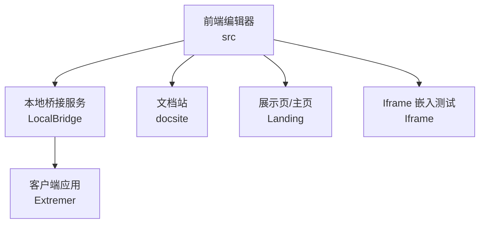
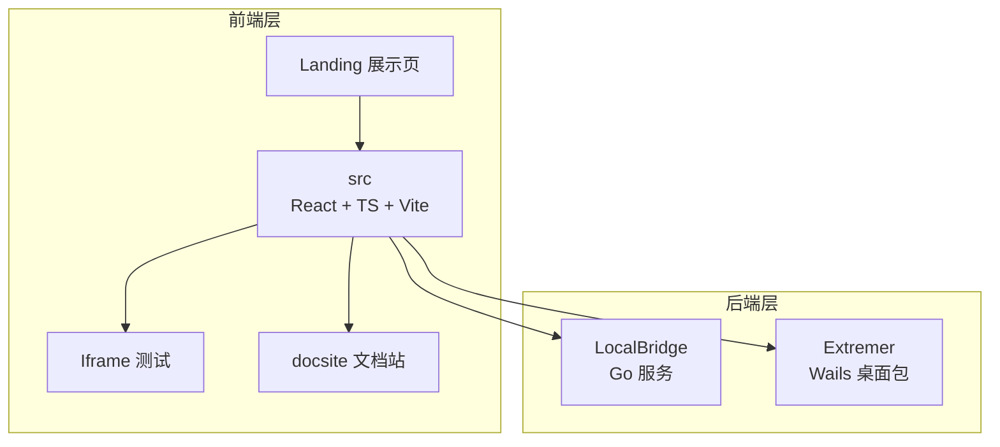
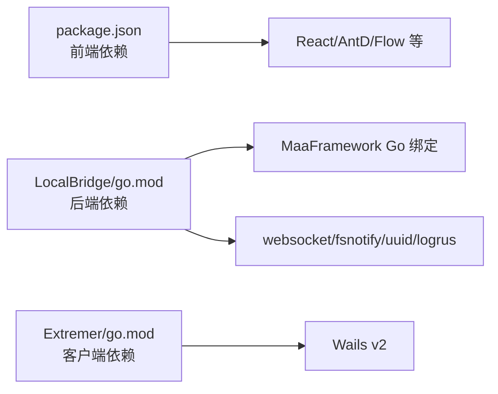

# 贡献指南

<cite>
**本文引用的文件**
- [README.md](file://README.md)
- [AGENTS.md](file://AGENTS.md)
- [package.json](file://package.json)
- [eslint.config.js](file://eslint.config.js)
- [vite.config.ts](file://vite.config.ts)
- [tsconfig.json](file://tsconfig.json)
- [tsconfig.app.json](file://tsconfig.app.json)
- [tsconfig.node.json](file://tsconfig.node.json)
- [LocalBridge/go.mod](file://LocalBridge/go.mod)
- [Extremer/go.mod](file://Extremer/go.mod)
- [docsite/docs/指南/95.开发与调试/01.参与贡献.md](file://docsite/docs/指南/95.开发与调试/01.参与贡献.md)
</cite>

## 目录
1. [简介](#简介)
2. [项目结构](#项目结构)
3. [核心组件](#核心组件)
4. [架构总览](#架构总览)
5. [详细组件分析](#详细组件分析)
6. [依赖分析](#依赖分析)
7. [性能考量](#性能考量)
8. [故障排查指南](#故障排查指南)
9. [结论](#结论)
10. [附录](#附录)

## 简介
本指南面向希望参与 MaaPipelineEditor（MPE）项目的贡献者，覆盖开发环境搭建、代码规范、提交流程与 Pull Request 规范、测试与质量保证、社区沟通、文档与翻译规范、新贡献者入门以及项目治理与决策流程。请在开始前通读本指南，并结合项目根目录与各子模块的配置文件与文档进行实践。

## 项目结构
MPE 采用前后端分离架构，主要包含以下子系统：
- 前端编辑器（src）：基于 React 19 与 TypeScript，使用 Vite 构建与测试。
- 本地桥接服务（LocalBridge）：Go 语言实现，提供文件、资源、设备与 MaaFramework 能力的本地桥接。
- 客户端应用（Extremer）：基于 Wails，打包为桌面客户端。
- 展示页/主页（Landing）：Astro + Playwright 测试。
- 文档站（docsite）：VitePress 文档站点。
- Iframe 嵌入测试（Iframe）：用于嵌入式场景的页面与测试脚本。
- 开发资料（dev/instructions）：官方参考文档与临时 Wiki 资料。

**图表来源**
- [AGENTS.md:45-55](file://AGENTS.md#L45-L55)

**章节来源**
- [AGENTS.md:45-55](file://AGENTS.md#L45-L55)

## 核心组件
- 包管理与脚本：统一使用 yarn 作为包管理器，提供开发、构建、文档、服务启动等脚本。
- 代码规范：ESLint + TypeScript ESLint，结合 React Hooks 与 React Refresh 规则，强调严格模式与未使用变量/表达式的警告级别。
- 构建与测试：Vite 作为构建工具，Vitest + happy-dom 作为测试环境，覆盖率报告按需配置。
- 类型系统：双 tsconfig 引用（app/node），确保严格的类型检查与模块解析策略。
- 后端依赖：LocalBridge 使用 MaaFramework Go 绑定与相关生态库；Extremer 使用 Wails v2。

**章节来源**
- [package.json:6-23](file://package.json#L6-L23)
- [eslint.config.js:8-40](file://eslint.config.js#L8-L40)
- [vite.config.ts:47-63](file://vite.config.ts#L47-L63)
- [tsconfig.json:1-8](file://tsconfig.json#L1-L8)
- [tsconfig.app.json:18-23](file://tsconfig.app.json#L18-L23)
- [tsconfig.node.json:16-22](file://tsconfig.node.json#L16-L22)
- [LocalBridge/go.mod:1-38](file://LocalBridge/go.mod#L1-L38)
- [Extremer/go.mod:1-39](file://Extremer/go.mod#L1-L39)

## 架构总览
MPE 的整体架构围绕“前端编辑器 + 本地桥接服务 + 客户端应用”的组合展开，前端负责可视化编辑与交互，LocalBridge 提供资源、文件与设备能力，Extremer 将前端与本地服务打包为桌面应用。文档站与展示页分别服务于用户文档与社区推广。

**图表来源**
- [AGENTS.md:45-55](file://AGENTS.md#L45-L55)
- [LocalBridge/go.mod:1-38](file://LocalBridge/go.mod#L1-L38)
- [Extremer/go.mod:1-39](file://Extremer/go.mod#L1-L39)

## 详细组件分析

### 开发环境搭建
- 前端
  - 使用 yarn 安装依赖，启动开发服务器与文档站。
  - 构建产物可通过不同模式（stable、preview、extremer 等）输出，路径与基础路径由 Vite 配置决定。
- 本地桥接服务（LocalBridge）
  - 使用 Go 1.26+，依赖 MaaFramework Go 绑定与相关库，按需启用文件扫描、资源管理、WebSocket 通信等能力。
- 客户端应用（Extremer）
  - 基于 Wails v2，构建后将前端静态资源复制到指定目录以便打包。
- 展示页与文档站
  - Landing 使用 Astro，提供开发、构建、预览与测试流程；docsite 使用 VitePress，支持本地开发与构建。

**章节来源**
- [package.json:6-23](file://package.json#L6-L23)
- [vite.config.ts:5-13](file://vite.config.ts#L5-L13)
- [LocalBridge/go.mod:1-38](file://LocalBridge/go.mod#L1-L38)
- [Extremer/go.mod:1-39](file://Extremer/go.mod#L1-L39)
- [docsite/docs/指南/95.开发与调试/01.参与贡献.md:10-16](file://docsite/docs/指南/95.开发与调试/01.参与贡献.md#L10-L16)

### 代码规范与质量
- ESLint 规则
  - 推荐使用 TypeScript ESLint 与 React Hooks、React Refresh 规则集，忽略特定目录（如生成的 JS、文档缓存、图标字体等）。
  - 对未使用变量/表达式等给出警告级别，避免默认关闭严格规则影响代码质量。
- TypeScript 严格模式
  - app 与 node 两套 tsconfig 均启用严格模式，包括未使用局部变量/参数、switch 覆盖、副作用导入等检查。
- 代码风格与安全
  - 禁止在代码字符串中使用中文引号，避免解析器误判。
  - 建议单文件不超过 800 行，必要时拆分模块并重构。

**章节来源**
- [eslint.config.js:8-40](file://eslint.config.js#L8-L40)
- [tsconfig.app.json:18-23](file://tsconfig.app.json#L18-L23)
- [tsconfig.node.json:16-22](file://tsconfig.node.json#L16-L22)
- [AGENTS.md:3-11](file://AGENTS.md#L3-L11)
- [AGENTS.md:13-16](file://AGENTS.md#L13-L16)

### 提交流程与 PR 规范
- 分支与提交
  - 使用 Git 进行版本控制，遵循项目既定分支策略（建议在 fork 后创建功能分支）。
  - 提交信息应清晰描述变更目的与范围，避免无关提交。
- Pull Request
  - PR 描述需包含变更动机、改动范围、测试情况与风险评估。
  - 保持 PR 粒度合理，避免一次提交过大导致审查困难。
- 代码评审
  - 遵循团队评审流程，及时响应评审意见并补充测试与文档。

**章节来源**
- [README.md:124-126](file://README.md#L124-L126)
- [AGENTS.md:3-11](file://AGENTS.md#L3-L11)

### 测试要求与质量保证
- 前端测试
  - 使用 Vitest + happy-dom，开启全局测试配置与覆盖率报告（支持多种格式），排除 node_modules、tests、配置文件与 dist 等目录。
- 文档与展示页测试
  - Landing 使用 Playwright，提供 verify 命令进行端到端校验。
- 本地桥接服务
  - 建议在需要时进行功能测试与回归测试，关注文件扫描、资源加载与 WebSocket 通信等关键链路。
- 质量门禁
  - 代码需通过 ESLint 与 TypeScript 严格检查；新增功能需补充单元/集成测试；文档与注释同步更新。

**章节来源**
- [vite.config.ts:47-63](file://vite.config.ts#L47-L63)
- [package.json:9-11](file://package.json#L9-L11)
- [AGENTS.md:21-23](file://AGENTS.md#L21-L23)

### 社区参与与沟通
- 交流渠道
  - 建议在 MaaFramework 集成/开发交流 QQ 群（595990173）进行技术讨论与问题反馈。
- 文档与 AI 辅助
  - 可参考 DeepWiki 自动生成的文档以快速了解架构与文件结构。

**章节来源**
- [README.md:124-126](file://README.md#L124-L126)
- [docsite/docs/指南/95.开发与调试/01.参与贡献.md:10-16](file://docsite/docs/指南/95.开发与调试/01.参与贡献.md#L10-L16)

### 文档贡献与翻译规范
- 文档位置
  - 文档站位于 docsite，采用 VitePress，支持本地开发与构建。
- 贡献方式
  - 新增或修订文档时，遵循现有目录结构与命名规范；保持内容简洁、条理清晰。
- 翻译与本地化
  - 若涉及多语言内容，建议在目录层级中明确区分语言版本，并维护一致性。

**章节来源**
- [docsite/docs/指南/95.开发与调试/01.参与贡献.md:10-16](file://docsite/docs/指南/95.开发与调试/01.参与贡献.md#L10-L16)

### 新贡献者入门指导
- 环境准备
  - 安装 yarn、Node.js 与 Go 环境，克隆仓库后安装依赖。
- 快速起步
  - 使用 yarn dev 启动前端，yarn server 启动 LocalBridge，yarn doc 启动文档站。
- 学习资料
  - 参考 AGENTS.md 中的本地文档路径，结合 dev/instructions 下的官方文档与临时 Wiki。
- 问题求助
  - 在 QQ 群中提问，或在 GitHub 提交 Issue 描述问题与复现步骤。

**章节来源**
- [package.json:6-23](file://package.json#L6-L23)
- [AGENTS.md:27-38](file://AGENTS.md#L27-L38)
- [README.md:124-126](file://README.md#L124-L126)

### 项目治理与决策流程
- 开发规则
  - 使用 yarn 作为包管理器；新功能需参考官方文档，避免凭空生成无据函数；鼓励复用现有函数并进行封装。
  - 禁止行为包括：不考虑旧版本兼容性、不使用浏览器测试、不自动生成测试脚本等。
- 参考指南
  - AGENTS.md 提供本地文档路径清单与项目结构说明，便于快速定位学习资源。
- 项目上下文
  - 明确前端（editor）、后端（localbridge/LB）、客户端（extremer）、嵌入测试（iframe）、文档站（docsite）、展示页（landing）的职责划分。

**章节来源**
- [AGENTS.md:3-24](file://AGENTS.md#L3-L24)
- [AGENTS.md:25-55](file://AGENTS.md#L25-L55)

## 依赖分析
- 前端依赖
  - React 19、Ant Design 6、React Flow、Monaco Editor、Tesseract.js 等，满足编辑器、可视化与 OCR 等核心能力。
- 后端依赖
  - MaaFramework Go 绑定、websocket、fsnotify、uuid、logrus、viper、purego 等，支撑资源管理、文件监听与日志记录。
- 客户端依赖
  - Wails v2 及相关依赖，用于桌面应用打包与运行时支持。

**图表来源**
- [package.json:24-49](file://package.json#L24-L49)
- [LocalBridge/go.mod:5-16](file://LocalBridge/go.mod#L5-L16)
- [Extremer/go.mod:5-8](file://Extremer/go.mod#L5-L8)

**章节来源**
- [package.json:24-49](file://package.json#L24-L49)
- [LocalBridge/go.mod:1-38](file://LocalBridge/go.mod#L1-L38)
- [Extremer/go.mod:1-39](file://Extremer/go.mod#L1-L39)

## 性能考量
- 构建优化
  - Vite Rollup 手动分包策略将 Monaco Editor、Tesseract.js、react-json-view 等大依赖独立打包，降低首屏加载压力。
- 类型检查
  - 严格的 tsconfig 设置有助于在编译期发现潜在性能与内存问题。
- 测试与覆盖率
  - Vitest + happy-dom 的测试环境与覆盖率报告有助于持续发现性能退化与回归问题。

**章节来源**
- [vite.config.ts:22-39](file://vite.config.ts#L22-L39)
- [tsconfig.app.json:18-23](file://tsconfig.app.json#L18-L23)
- [vite.config.ts:47-63](file://vite.config.ts#L47-L63)

## 故障排查指南
- 环境与依赖
  - 确认 yarn、Node.js 与 Go 版本满足要求；清理缓存后重新安装依赖。
- 构建与运行
  - 使用 yarn dev/serve/doc/build 等脚本验证本地环境；检查 Vite 模式与基础路径配置。
- 代码检查
  - 运行 ESLint 与 TypeScript 检查，修复未使用变量/表达式等警告。
- 测试失败
  - 查看 Vitest 覆盖率报告与测试日志，定位失败用例；必要时在 CI 环境复现。
- 文档与展示页
  - Landing 使用 Playwright，verify 命令可进行端到端验证；若失败，检查测试主机与页面元素。

**章节来源**
- [package.json:6-23](file://package.json#L6-L23)
- [eslint.config.js:29-38](file://eslint.config.js#L29-L38)
- [vite.config.ts:47-63](file://vite.config.ts#L47-L63)
- [package.json:9-11](file://package.json#L9-L11)

## 结论
本指南提供了 MPE 项目的开发环境、代码规范、提交与评审流程、测试与质量保证、社区沟通、文档与翻译规范、新贡献者入门以及项目治理的系统性说明。请在实践中结合各子模块的配置文件与官方文档，确保贡献过程高效、规范、可持续。

## 附录
- 快速命令索引
  - 前端开发：yarn dev
  - 文档站：yarn doc
  - 本地服务：yarn server
  - Landing 开发/构建/预览/测试：yarn landing / yarn landing:build / yarn landing:preview / yarn landing:test
  - 代码检查：yarn lint
  - 构建：yarn build / yarn build-past / yarn build:extremer
- 参考资源
  - AGENTS.md 中的本地文档路径清单与项目结构说明

**章节来源**
- [package.json:6-23](file://package.json#L6-L23)
- [AGENTS.md:27-55](file://AGENTS.md#L27-L55)