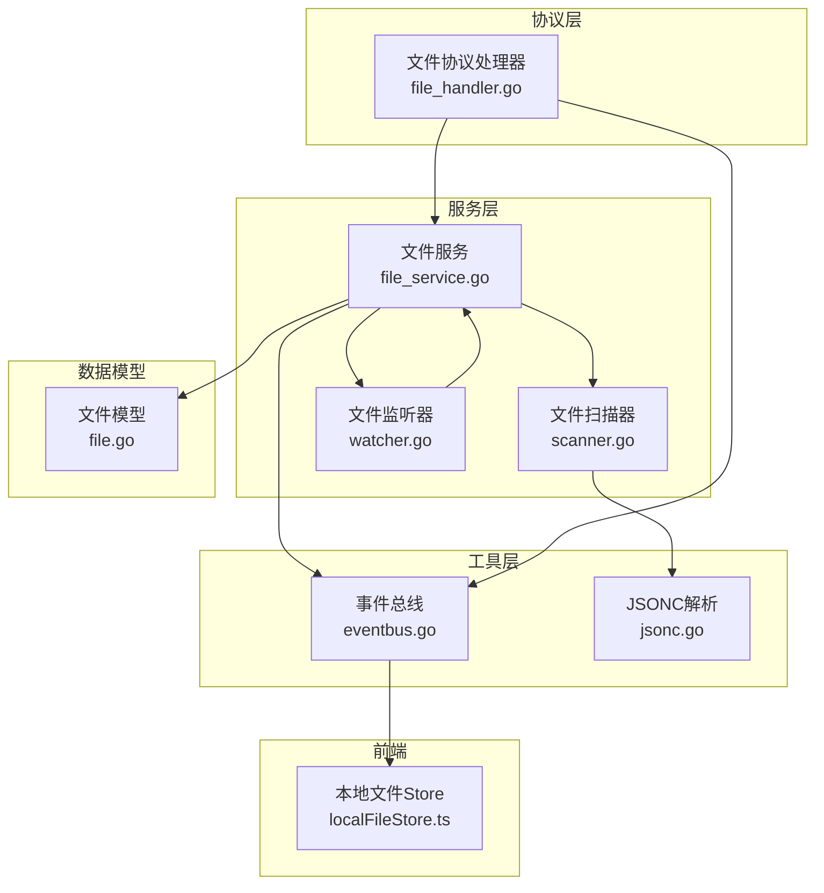
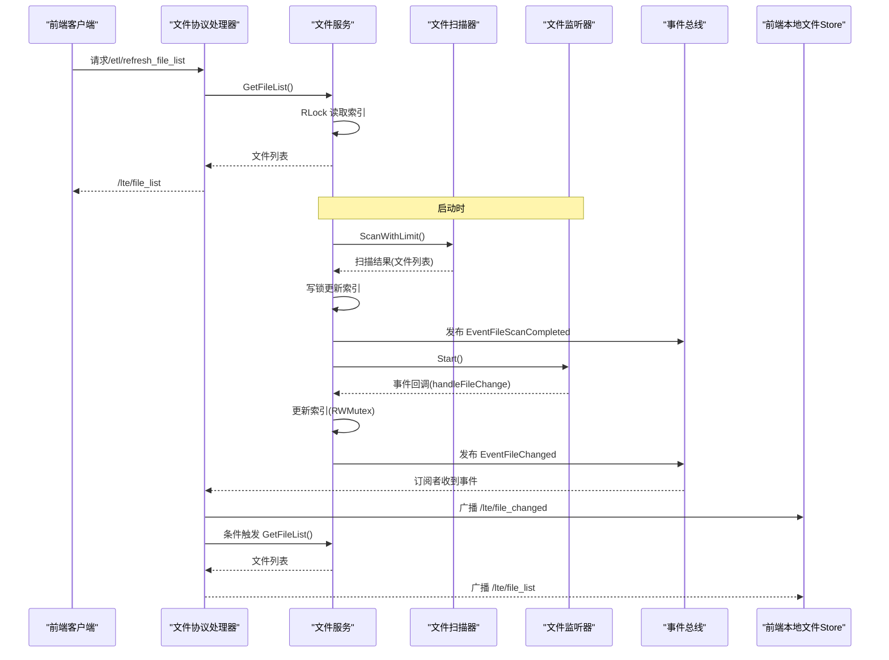
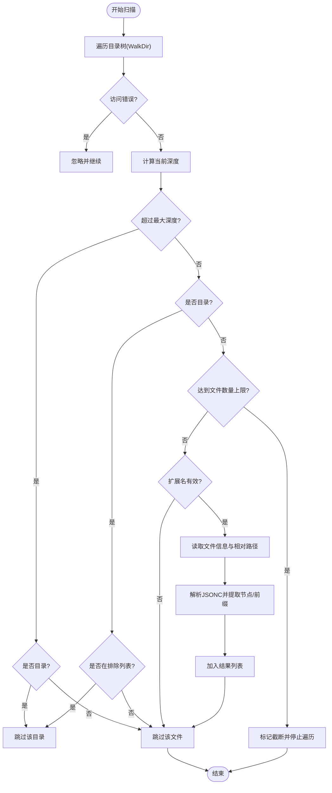
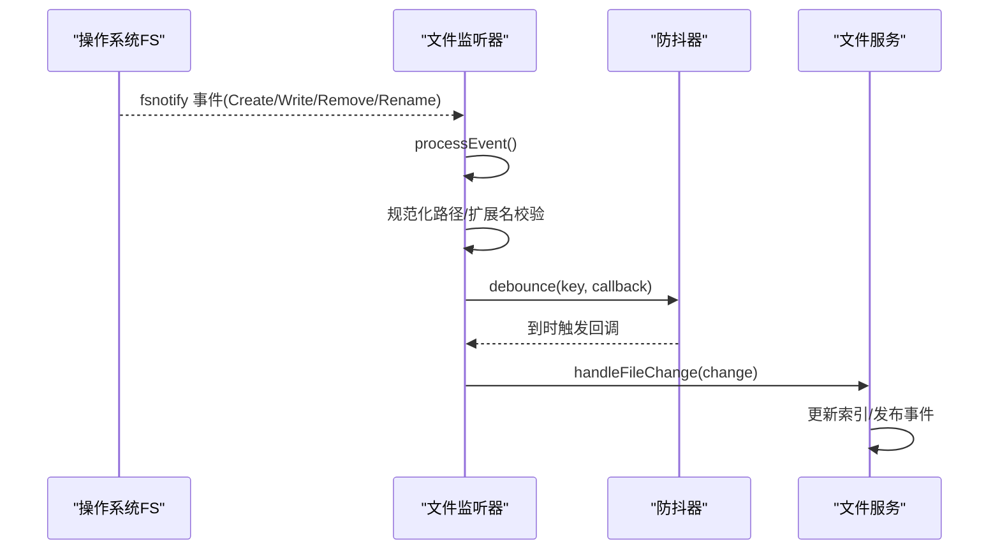
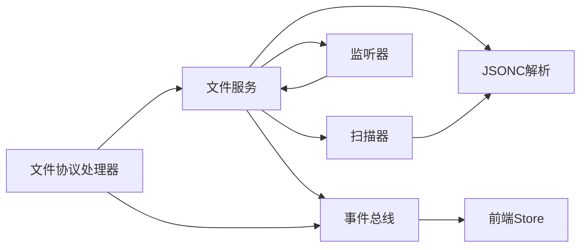

# 文件服务

<cite>
**本文档引用的文件**
- [file_service.go](file://LocalBridge/internal/service/file/file_service.go)
- [scanner.go](file://LocalBridge/internal/service/file/scanner.go)
- [watcher.go](file://LocalBridge/internal/service/file/watcher.go)
- [file.go](file://LocalBridge/pkg/models/file.go)
- [jsonc.go](file://LocalBridge/internal/utils/jsonc.go)
- [eventbus.go](file://LocalBridge/internal/eventbus/eventbus.go)
- [file_handler.go](file://LocalBridge/internal/protocol/file/file_handler.go)
- [paths.go](file://LocalBridge/internal/paths/paths.go)
- [localFileStore.ts](file://src/stores/localFileStore.ts)
</cite>

## 目录
1. [简介](#简介)
2. [项目结构](#项目结构)
3. [核心组件](#核心组件)
4. [架构总览](#架构总览)
5. [详细组件分析](#详细组件分析)
6. [依赖关系分析](#依赖关系分析)
7. [性能考量](#性能考量)
8. [故障排查指南](#故障排查指南)
9. [结论](#结论)
10. [附录](#附录)

## 简介
本文件服务模块负责对本地资源目录进行文件扫描、索引构建、文件系统事件监听与热重载、以及文件读写操作。其核心目标是：
- 递归扫描指定根目录，按扩展名过滤，构建内存索引
- 监听文件系统事件，进行去抖处理，避免重复触发
- 在文件被外部修改或删除时，及时更新索引并广播事件
- 提供安全的文件读写接口，支持 JSONC 解析与缩进控制
- 通过事件总线与前端 Store 协作，实现文件列表的实时刷新与 UI 响应

## 项目结构
文件服务位于 LocalBridge 子项目中，采用分层设计：
- 协议层：对外提供 WebSocket 路由，处理打开/保存/创建/刷新等请求
- 服务层：封装文件扫描、监听、索引与事件处理
- 数据模型层：定义文件与节点信息结构
- 工具层：JSONC 解析与事件总线
- 前端 Store：维护本地文件列表与图片缓存，响应后端推送



图表来源
- [file_handler.go:14-35](file://LocalBridge/internal/protocol/file/file_handler.go#L14-L35)
- [file_service.go:19-35](file://LocalBridge/internal/service/file/file_service.go#L19-L35)
- [scanner.go:20-27](file://LocalBridge/internal/service/file/scanner.go#L20-L27)
- [watcher.go:34-41](file://LocalBridge/internal/service/file/watcher.go#L34-L41)
- [file.go:3-29](file://LocalBridge/pkg/models/file.go#L3-L29)
- [eventbus.go:16-27](file://LocalBridge/internal/eventbus/eventbus.go#L16-L27)
- [jsonc.go:9-23](file://LocalBridge/internal/utils/jsonc.go#L9-L23)
- [localFileStore.ts:125-123](file://src/stores/localFileStore.ts#L125-L123)

章节来源
- [file_handler.go:14-35](file://LocalBridge/internal/protocol/file/file_handler.go#L14-L35)
- [file_service.go:19-35](file://LocalBridge/internal/service/file/file_service.go#L19-L35)
- [scanner.go:20-27](file://LocalBridge/internal/service/file/scanner.go#L20-L27)
- [watcher.go:34-41](file://LocalBridge/internal/service/file/watcher.go#L34-L41)
- [file.go:3-29](file://LocalBridge/pkg/models/file.go#L3-L29)
- [eventbus.go:16-27](file://LocalBridge/internal/eventbus/eventbus.go#L16-L27)
- [jsonc.go:9-23](file://LocalBridge/internal/utils/jsonc.go#L9-L23)
- [localFileStore.ts:125-123](file://src/stores/localFileStore.ts#L125-L123)

## 核心组件
- 文件服务 Service：聚合扫描器、监听器、索引与事件总线，提供启动、停止、读取、保存、创建、文件列表查询等能力，并内置“自身写入忽略窗口”避免重复事件
- 文件扫描器 Scanner：递归遍历根目录，按排除列表与扩展名过滤，统计文件数量与深度限制，解析文件节点与前缀
- 文件监听器 Watcher：基于 fsnotify 监听文件系统事件，对重命名、创建、删除、修改进行分类，使用防抖器降低高频事件影响
- 事件总线 EventBus：提供订阅/发布机制，事件类型包括扫描完成与文件变化
- JSONC 工具：解析带注释的 JSON（JSONC），支持行注释、块注释与尾随逗号
- 前端 Store：维护文件列表、资源包、图片缓存与请求状态，响应后端推送

章节来源
- [file_service.go:19-102](file://LocalBridge/internal/service/file/file_service.go#L19-L102)
- [scanner.go:20-147](file://LocalBridge/internal/service/file/scanner.go#L20-L147)
- [watcher.go:34-92](file://LocalBridge/internal/service/file/watcher.go#L34-L92)
- [eventbus.go:16-51](file://LocalBridge/internal/eventbus/eventbus.go#L16-L51)
- [jsonc.go:9-23](file://LocalBridge/internal/utils/jsonc.go#L9-L23)
- [localFileStore.ts:61-123](file://src/stores/localFileStore.ts#L61-L123)

## 架构总览
文件服务的控制流如下：
- 启动阶段：初始化扫描器与监听器，执行一次性扫描并构建索引，发布扫描完成事件；随后启动监听
- 运行阶段：监听器捕获文件系统事件，经防抖与过滤后交由服务处理；服务根据事件类型更新索引并发布文件变化事件
- 前端交互：协议处理器订阅事件并通过 WebSocket 广播；前端 Store 增量更新文件列表与图片缓存



图表来源
- [file_handler.go:273-330](file://LocalBridge/internal/protocol/file/file_handler.go#L273-L330)
- [file_service.go:65-94](file://LocalBridge/internal/service/file/file_service.go#L65-L94)
- [scanner.go:64-147](file://LocalBridge/internal/service/file/scanner.go#L64-L147)
- [watcher.go:62-83](file://LocalBridge/internal/service/file/watcher.go#L62-L83)
- [eventbus.go:38-51](file://LocalBridge/internal/eventbus/eventbus.go#L38-L51)
- [localFileStore.ts:149-156](file://src/stores/localFileStore.ts#L149-L156)

## 详细组件分析

### 文件服务 Service
职责与关键点：
- 索引与并发：使用读写锁保护文件索引，保证读多写少场景下的高并发读取性能
- 自身写入忽略：记录最近写入时间戳，窗口期内忽略自身触发的文件变化事件，避免死循环
- 安全路径校验：统一将输入路径规范化并检查是否位于根目录范围内
- JSONC 解析：读取文件时使用 JSONC 解析器，兼容注释与尾随逗号
- 事件发布：扫描完成与文件变化均通过事件总线广播，供协议层推送至前端

```mermaid
classDiagram
class Service {
-string root
-Scanner scanner
-Watcher watcher
-map~string,*File~ fileIndex
-RWMutex mu
-EventBus eventBus
-int maxDepth
-int maxFiles
-map~string,int64~ recentlyWrittenFiles
-RWMutex writtenMu
-duration selfWriteIgnoreWindow
+Start() error
+Stop() void
+GetFileList() []FileInfo
+ReadFile(path) interface{}
+SaveFile(path, content, indent) error
+SaveFileWithOrder(path, content, indent, keepOrder) error
+CreateFile(dir, name, content) (string, error)
-validatePath(path) error
-marshalJSON(content, indent) ([]byte, error)
-handleFileChange(change)
}
class Scanner {
-string root
-[]string exclude
-[]string extensions
-int maxDepth
-int maxFiles
+ScanWithLimit() ScanResult
+ScanSingle(absPath) *File
-hasValidExtension(path) bool
-parseFileNodes(path) ([]FileNode, string)
-extractAnchors(nodeData) []string
}
class Watcher {
-fsnotify.Watcher watcher
-string root
-[]string extensions
-ChangeHandler handler
-debouncer debouncer
+Start() error
+Stop() void
+ClearDebounce(path)
-processEvent(event)
-hasValidExtension(path) bool
}
class EventBus {
-map~string,[]EventHandler~ handlers
+Subscribe(type, handler)
+Publish(type, data)
+PublishAsync(type, data)
+Unsubscribe(type)
}
class File {
+string AbsPath
+string RelPath
+string Name
+int64 LastModified
+[]FileNode Nodes
+string Prefix
+ToFileInfo() FileInfo
}
Service --> Scanner : "使用"
Service --> Watcher : "使用"
Service --> EventBus : "发布/订阅"
Service --> File : "索引"
Scanner --> File : "构建"
```

图表来源
- [file_service.go:19-406](file://LocalBridge/internal/service/file/file_service.go#L19-L406)
- [scanner.go:20-301](file://LocalBridge/internal/service/file/scanner.go#L20-L301)
- [watcher.go:34-261](file://LocalBridge/internal/service/file/watcher.go#L34-L261)
- [eventbus.go:16-83](file://LocalBridge/internal/eventbus/eventbus.go#L16-L83)
- [file.go:10-29](file://LocalBridge/pkg/models/file.go#L10-L29)

章节来源
- [file_service.go:19-406](file://LocalBridge/internal/service/file/file_service.go#L19-L406)
- [scanner.go:20-301](file://LocalBridge/internal/service/file/scanner.go#L20-L301)
- [watcher.go:34-261](file://LocalBridge/internal/service/file/watcher.go#L34-L261)
- [file.go:10-29](file://LocalBridge/pkg/models/file.go#L10-L29)

### 文件扫描器 Scanner
递归扫描与过滤逻辑：
- 深度限制：通过计算相对深度，超过阈值的目录跳过
- 排除列表：遇到排除目录直接 SkipDir
- 文件数量限制：达到上限后提前终止遍历
- 扩展名过滤：仅保留配置中的扩展名；特殊处理以“.”开头且以“.mpe.json”结尾的配置文件不计入索引
- 节点解析：读取文件内容，解析 JSONC，提取前缀与节点列表，节点锚点支持多种格式



图表来源
- [scanner.go:64-147](file://LocalBridge/internal/service/file/scanner.go#L64-L147)
- [scanner.go:150-174](file://LocalBridge/internal/service/file/scanner.go#L150-L174)
- [scanner.go:212-254](file://LocalBridge/internal/service/file/scanner.go#L212-L254)

章节来源
- [scanner.go:64-147](file://LocalBridge/internal/service/file/scanner.go#L64-L147)
- [scanner.go:150-174](file://LocalBridge/internal/service/file/scanner.go#L150-L174)
- [scanner.go:212-254](file://LocalBridge/internal/service/file/scanner.go#L212-L254)

### 文件监听器 Watcher
事件监听与防抖：
- 目录监听：启动时递归添加所有子目录到 fsnotify
- 事件分类：区分创建、修改、删除、重命名；目录删除通过扩展名判断
- 防抖策略：同一路径在短时间内多次事件合并为一次处理，重命名事件使用专用键
- 自身写入忽略：配合服务侧的写入时间戳，避免重复触发



图表来源
- [watcher.go:95-191](file://LocalBridge/internal/service/file/watcher.go#L95-L191)
- [watcher.go:204-261](file://LocalBridge/internal/service/file/watcher.go#L204-L261)
- [file_service.go:299-388](file://LocalBridge/internal/service/file/file_service.go#L299-L388)

章节来源
- [watcher.go:95-191](file://LocalBridge/internal/service/file/watcher.go#L95-L191)
- [watcher.go:204-261](file://LocalBridge/internal/service/file/watcher.go#L204-L261)
- [file_service.go:299-388](file://LocalBridge/internal/service/file/file_service.go#L299-L388)

### 事件总线 EventBus
- 订阅/发布：支持同步与异步发布，事件类型包括文件扫描完成与文件变化
- 全局实例：提供全局事件总线，便于跨模块解耦通信

章节来源
- [eventbus.go:16-83](file://LocalBridge/internal/eventbus/eventbus.go#L16-L83)

### JSONC 解析
- 标准化：使用 hujson 标准化 JSONC，再交由标准 JSON 解析器
- 有效性检查：提供 IsValidJSONC 辅助函数

章节来源
- [jsonc.go:9-29](file://LocalBridge/internal/utils/jsonc.go#L9-L29)

### 前端 Store 与文件协议
- Store：维护文件列表、资源包、图片缓存与请求状态，支持增量增删改与批量清理
- 协议：订阅文件变化事件，向前端推送文件列表与文件变化通知；连接建立时主动推送文件列表

章节来源
- [localFileStore.ts:61-123](file://src/stores/localFileStore.ts#L61-L123)
- [file_handler.go:279-330](file://LocalBridge/internal/protocol/file/file_handler.go#L279-L330)

## 依赖关系分析
- 组件耦合
  - Service 依赖 Scanner、Watcher、EventBus、File 模型与 JSONC 工具
  - Watcher 依赖 fsnotify，内部包含防抖器
  - Handler 依赖 Service、EventBus 与 WebSocket 服务器
- 外部依赖
  - fsnotify：文件系统事件监听
  - hujson：JSONC 标准化
- 循环依赖
  - 未发现循环依赖；各模块职责清晰，通过事件总线解耦



图表来源
- [file_service.go:19-406](file://LocalBridge/internal/service/file/file_service.go#L19-L406)
- [scanner.go:20-301](file://LocalBridge/internal/service/file/scanner.go#L20-L301)
- [watcher.go:34-261](file://LocalBridge/internal/service/file/watcher.go#L34-L261)
- [eventbus.go:16-83](file://LocalBridge/internal/eventbus/eventbus.go#L16-L83)
- [jsonc.go:9-29](file://LocalBridge/internal/utils/jsonc.go#L9-L29)
- [file_handler.go:14-35](file://LocalBridge/internal/protocol/file/file_handler.go#L14-L35)
- [localFileStore.ts:125-123](file://src/stores/localFileStore.ts#L125-L123)

章节来源
- [file_service.go:19-406](file://LocalBridge/internal/service/file/file_service.go#L19-L406)
- [scanner.go:20-301](file://LocalBridge/internal/service/file/scanner.go#L20-L301)
- [watcher.go:34-261](file://LocalBridge/internal/service/file/watcher.go#L34-L261)
- [eventbus.go:16-83](file://LocalBridge/internal/eventbus/eventbus.go#L16-L83)
- [jsonc.go:9-29](file://LocalBridge/internal/utils/jsonc.go#L9-L29)
- [file_handler.go:14-35](file://LocalBridge/internal/protocol/file/file_handler.go#L14-L35)
- [localFileStore.ts:125-123](file://src/stores/localFileStore.ts#L125-L123)

## 性能考量
- 并发安全
  - 读多写少场景：使用 RWMutex，读取时共享锁，写入时独占锁，减少锁竞争
  - 写入忽略窗口：避免自身写入触发的事件风暴
- I/O 与解析
  - JSONC 解析：仅在读取文件时进行，避免频繁解析
  - 扫描限制：通过 maxDepth 与 maxFiles 控制遍历规模，防止大规模目录导致性能问题
- 事件处理
  - 防抖：对高频事件进行去抖，降低重复处理成本
  - 目录监听：启动时一次性递归添加，后续动态新增目录即时加入监听
- 前端缓存
  - Store 使用 Map/Set 结构管理图片缓存与请求状态，避免重复请求

章节来源
- [file_service.go:24-35](file://LocalBridge/internal/service/file/file_service.go#L24-L35)
- [file_service.go:158-215](file://LocalBridge/internal/service/file/file_service.go#L158-L215)
- [scanner.go:40-48](file://LocalBridge/internal/service/file/scanner.go#L40-L48)
- [watcher.go:204-235](file://LocalBridge/internal/service/file/watcher.go#L204-L235)
- [localFileStore.ts:139-140](file://src/stores/localFileStore.ts#L139-L140)

## 故障排查指南
- 路径越界/权限问题
  - 现象：读取/保存文件时报错
  - 排查：确认路径是否在根目录范围内；检查文件权限
  - 参考：路径校验逻辑与错误类型
- JSONC 解析失败
  - 现象：读取文件报无效 JSON
  - 排查：检查文件是否符合 JSONC 规范；使用 IsValidJSONC 辅助验证
- 事件风暴/重复触发
  - 现象：保存后频繁收到文件变化事件
  - 排查：确认是否处于自身写入忽略窗口内；检查防抖器是否正常工作
- 目录监听异常
  - 现象：新增目录未被监听
  - 排查：确认监听器已启动；检查目录权限；查看错误通道日志

章节来源
- [file_service.go:390-405](file://LocalBridge/internal/service/file/file_service.go#L390-L405)
- [jsonc.go:25-29](file://LocalBridge/internal/utils/jsonc.go#L25-L29)
- [watcher.go:113-191](file://LocalBridge/internal/service/file/watcher.go#L113-L191)
- [watcher.go:85-92](file://LocalBridge/internal/service/file/watcher.go#L85-L92)

## 结论
文件服务模块通过“扫描+索引+监听+事件”的组合，实现了对本地资源目录的高效管理与实时响应。其设计重点在于：
- 明确的职责划分与解耦（协议层、服务层、工具层）
- 并发安全与性能优化（读写锁、防抖、扫描限制）
- 事件驱动的前端协作（事件总线+Store）
- 对 JSONC 的良好支持与路径安全校验

## 附录

### 扩展与自定义文件类型支持
- 扩展名配置
  - 在配置中设置 file.extensions，重启服务后生效
  - 扫描器与监听器均依据扩展名过滤
- 自定义解析
  - 若需解析非 JSONC 的自定义格式，可在扫描器的节点解析处增加分支，读取并解析相应格式
  - 注意：扫描器会解析文件内容以提取节点与前缀，自定义格式需保证可被正确解析
- 配置文件分离
  - 以“.”开头且以“.mpe.json”结尾的配置文件不会被索引，但可被读取

章节来源
- [paths.go:199-205](file://LocalBridge/internal/paths/paths.go#L199-L205)
- [scanner.go:160-174](file://LocalBridge/internal/service/file/scanner.go#L160-L174)
- [file_handler.go:112-125](file://LocalBridge/internal/protocol/file/file_handler.go#L112-L125)

### 备份、同步与版本管理最佳实践
- 备份策略
  - 建议在外部使用 Git 或云盘同步工具进行版本化备份
  - 本地服务不内置备份功能，建议结合外部工具实现
- 同步与热重载
  - 服务已具备文件系统事件监听与热重载能力；避免在编辑器中同时进行大量写入，以免触发防抖与忽略窗口
- 版本管理
  - 建议将配置文件与业务文件分开管理，利用扩展名过滤与前缀提取机制，便于版本控制与回滚

章节来源
- [file_service.go:65-94](file://LocalBridge/internal/service/file/file_service.go#L65-L94)
- [watcher.go:62-83](file://LocalBridge/internal/service/file/watcher.go#L62-L83)