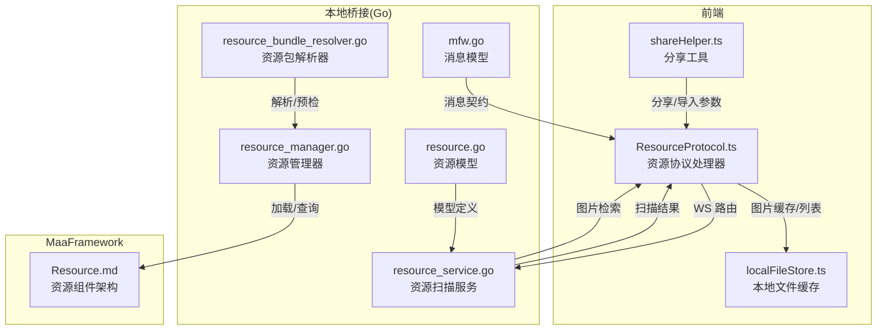
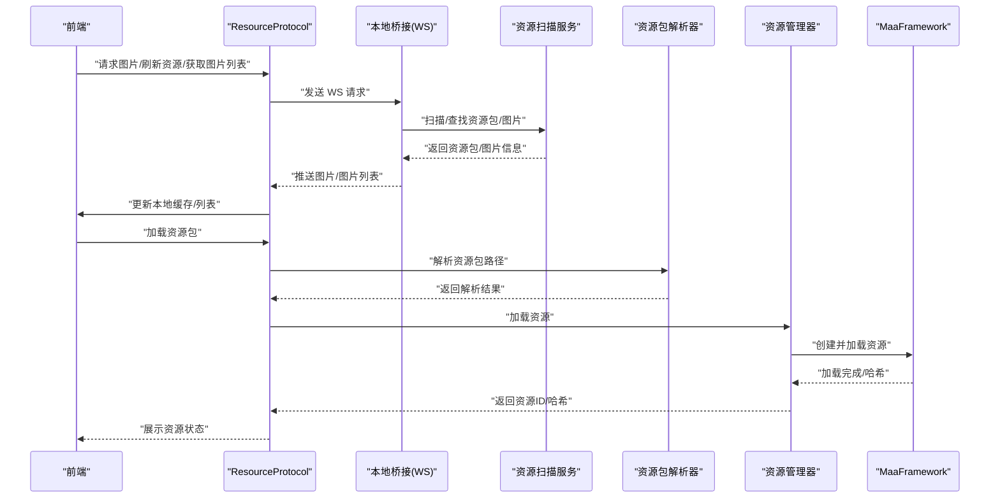
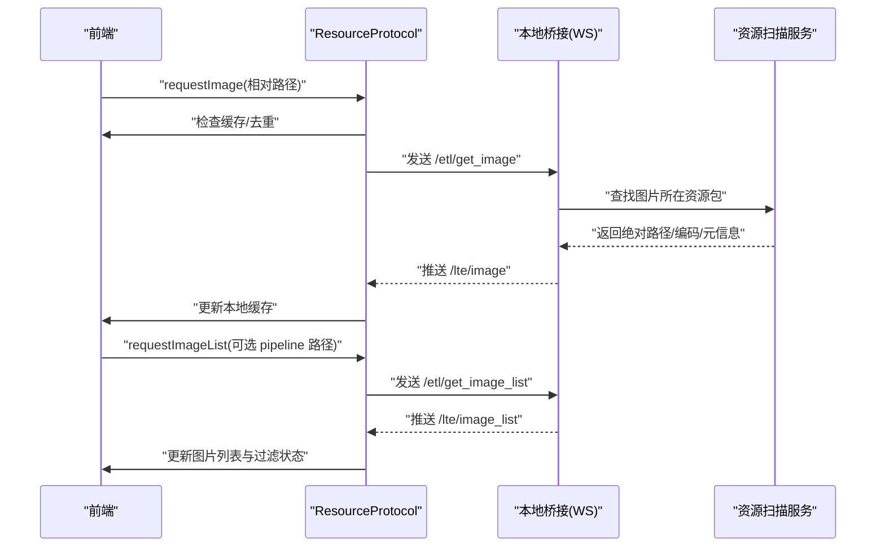
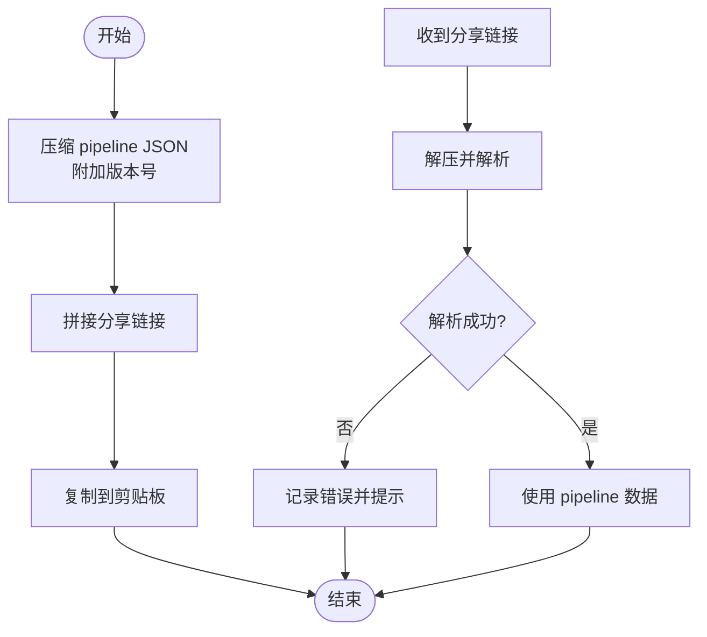
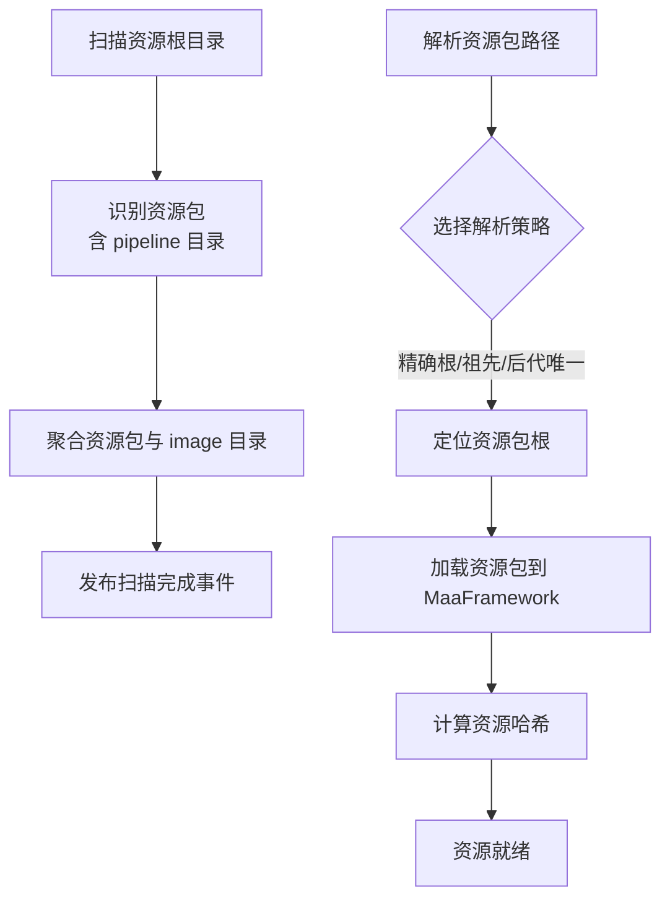
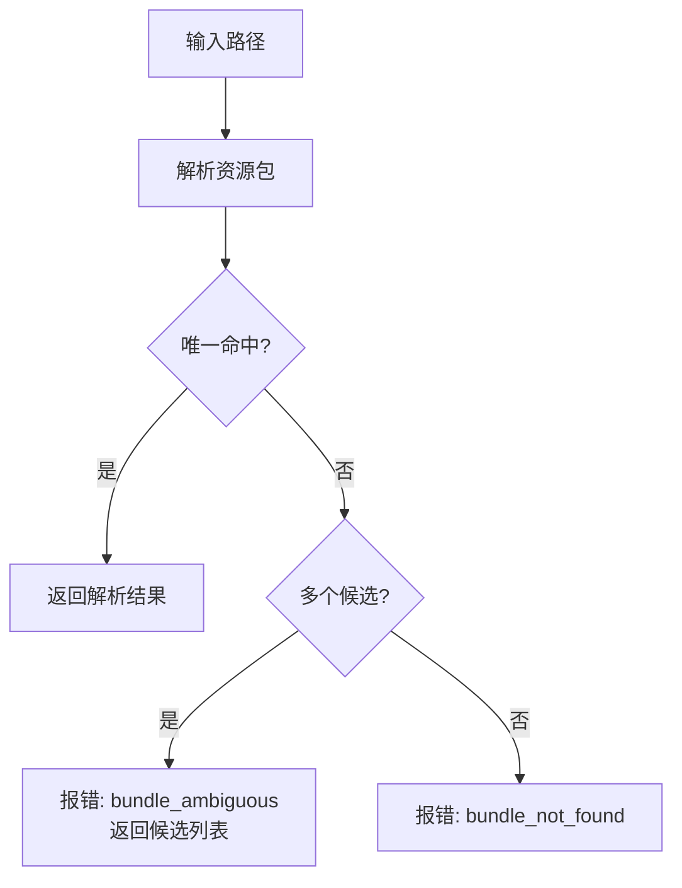
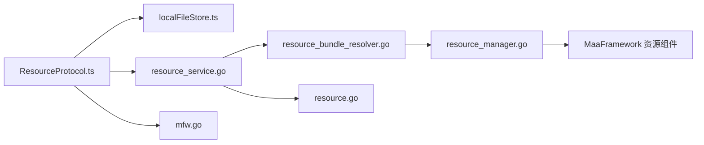

# 资源共享

<cite>
**本文档引用的文件**
- [ResourceProtocol.ts](file://src/services/protocols/ResourceProtocol.ts)
- [index.ts](file://src/services/protocols/index.ts)
- [localFileStore.ts](file://src/stores/localFileStore.ts)
- [shareHelper.ts](file://src/utils/data/shareHelper.ts)
- [resource_bundle_resolver.go](file://LocalBridge/internal/mfw/resource_bundle_resolver.go)
- [resource_bundle_resolver_test.go](file://LocalBridge/internal/mfw/resource_bundle_resolver_test.go)
- [resource_manager.go](file://LocalBridge/internal/mfw/resource_manager.go)
- [resource_service.go](file://LocalBridge/internal/service/resource/resource_service.go)
- [mfw.go](file://LocalBridge/pkg/models/mfw.go)
- [resource.go](file://LocalBridge/pkg/models/resource.go)
- [3.3-ProjectInterfaceV2.md](file://dev/instructions/maafw-guide/3.3-ProjectInterfaceV2.md)
- [Resource.md](file://dev/instructions/maafw-golang-binding/Resource.md)
- [Extension System.md](file://dev/instructions/maafw-golang-binding/Extension System.md)
- [debugSessionStore.ts](file://src/stores/debugSessionStore.ts)
</cite>

## 目录
1. [引言](#引言)
2. [项目结构](#项目结构)
3. [核心组件](#核心组件)
4. [架构总览](#架构总览)
5. [详细组件分析](#详细组件分析)
6. [依赖分析](#依赖分析)
7. [性能考虑](#性能考虑)
8. [故障排查指南](#故障排查指南)
9. [结论](#结论)
10. [附录](#附录)

## 引言
本文件面向“资源共享系统”的设计与实现，围绕资源分享协议、数据传输机制、资源导入导出格式规范与兼容性、资源包打包与解包流程、权限控制与访问限制、冲突检测与解决策略、扩展与自定义分享格式、以及版本同步与一致性校验等主题，提供系统化、可操作的技术文档。读者无需深入底层即可理解整体运作方式，并能据此进行二次开发与集成。

## 项目结构
资源共享系统由前端协议层、本地桥接层（Go）、MaaFramework 资源组件与本地文件缓存共同构成。前端通过 WebSocket 与本地桥接交互，本地桥接负责资源包解析、扫描、图片传输与资源加载；MaaFramework 负责资源的加载与运行时能力。

图示来源
- [ResourceProtocol.ts:1-271](file://src/services/protocols/ResourceProtocol.ts#L1-L271)
- [localFileStore.ts:1-339](file://src/stores/localFileStore.ts#L1-L339)
- [shareHelper.ts:1-157](file://src/utils/data/shareHelper.ts#L1-L157)
- [resource_service.go:1-359](file://LocalBridge/internal/service/resource/resource_service.go#L1-L359)
- [resource_bundle_resolver.go:1-368](file://LocalBridge/internal/mfw/resource_bundle_resolver.go#L1-L368)
- [resource_manager.go:1-118](file://LocalBridge/internal/mfw/resource_manager.go#L1-L118)
- [mfw.go:153-193](file://LocalBridge/pkg/models/mfw.go#L153-L193)
- [resource.go:1-67](file://LocalBridge/pkg/models/resource.go#L1-L67)
- [Resource.md:28-115](file://dev/instructions/maafw-golang-binding/Resource.md#L28-L115)

章节来源
- [ResourceProtocol.ts:1-271](file://src/services/protocols/ResourceProtocol.ts#L1-L271)
- [localFileStore.ts:1-339](file://src/stores/localFileStore.ts#L1-L339)
- [shareHelper.ts:1-157](file://src/utils/data/shareHelper.ts#L1-L157)
- [resource_service.go:1-359](file://LocalBridge/internal/service/resource/resource_service.go#L1-L359)
- [resource_bundle_resolver.go:1-368](file://LocalBridge/internal/mfw/resource_bundle_resolver.go#L1-L368)
- [resource_manager.go:1-118](file://LocalBridge/internal/mfw/resource_manager.go#L1-L118)
- [mfw.go:153-193](file://LocalBridge/pkg/models/mfw.go#L153-L193)
- [resource.go:1-67](file://LocalBridge/pkg/models/resource.go#L1-L67)
- [Resource.md:28-115](file://dev/instructions/maafw-golang-binding/Resource.md#L28-L115)

## 核心组件
- 资源协议处理器（前端）：负责注册/处理 WebSocket 路由，下发图片请求、刷新资源列表、接收图片与图片列表推送，并维护本地图片缓存。
- 本地文件缓存（前端）：集中管理资源包、图片缓存、图片列表与加载状态，避免重复请求与提升渲染性能。
- 资源扫描服务（Go）：扫描资源根目录，识别资源包、聚合 image 目录、支持按 pipeline 定位资源包并列出图片。
- 资源包解析器（Go）：从任意路径解析到资源包根目录，支持多种策略（精确根、祖先目录、后代唯一），并提供诊断信息。
- 资源管理器（Go）：封装资源生命周期（加载/查询/卸载），并生成资源哈希用于一致性校验。
- 分享工具（前端）：基于 LZ-String 压缩 pipeline JSON，通过 URL 参数分享与导入，支持起始目录与期望文件名参数。
- MaaFramework 资源组件：提供资源加载、节点查询、覆盖注入、扩展注册等能力，支撑运行时资源管理。

章节来源
- [ResourceProtocol.ts:1-271](file://src/services/protocols/ResourceProtocol.ts#L1-L271)
- [localFileStore.ts:1-339](file://src/stores/localFileStore.ts#L1-L339)
- [resource_service.go:1-359](file://LocalBridge/internal/service/resource/resource_service.go#L1-L359)
- [resource_bundle_resolver.go:1-368](file://LocalBridge/internal/mfw/resource_bundle_resolver.go#L1-L368)
- [resource_manager.go:1-118](file://LocalBridge/internal/mfw/resource_manager.go#L1-L118)
- [shareHelper.ts:1-157](file://src/utils/data/shareHelper.ts#L1-L157)
- [Resource.md:28-115](file://dev/instructions/maafw-golang-binding/Resource.md#L28-L115)

## 架构总览
资源共享系统采用“前端协议 + 本地桥接 + MaaFramework”的分层架构。前端通过 ResourceProtocol 与本地桥接建立双向通信，本地桥接负责资源包解析、扫描与图片检索，同时将资源包信息与图片数据回传前端；MaaFramework 负责资源加载与运行时能力。

图示来源
- [ResourceProtocol.ts:1-271](file://src/services/protocols/ResourceProtocol.ts#L1-L271)
- [resource_service.go:1-359](file://LocalBridge/internal/service/resource/resource_service.go#L1-L359)
- [resource_bundle_resolver.go:1-368](file://LocalBridge/internal/mfw/resource_bundle_resolver.go#L1-L368)
- [resource_manager.go:1-118](file://LocalBridge/internal/mfw/resource_manager.go#L1-L118)
- [Resource.md:28-115](file://dev/instructions/maafw-golang-binding/Resource.md#L28-L115)

## 详细组件分析

### 资源分享协议与数据传输机制
- 前端协议路由
  - 接收路由：/lte/resource_bundles、/lte/image、/lte/images、/lte/image_list
  - 发送路由：/etl/get_image、/etl/get_images、/etl/refresh_resources、/etl/get_image_list
- 图片传输
  - 本地缓存：以相对路径为键缓存 base64、MIME、尺寸、资源包名与绝对路径，避免重复请求
  - 批量处理：支持批量图片请求与推送，逐条处理并更新缓存
- 图片列表
  - 可按当前 pipeline 文件定位所属资源包，支持“过滤”模式仅显示当前包图片
  - 列表加载状态与错误处理，确保 UI 体验一致

图示来源
- [ResourceProtocol.ts:1-271](file://src/services/protocols/ResourceProtocol.ts#L1-L271)
- [resource_service.go:1-359](file://LocalBridge/internal/service/resource/resource_service.go#L1-L359)
- [localFileStore.ts:1-339](file://src/stores/localFileStore.ts#L1-L339)

章节来源
- [ResourceProtocol.ts:1-271](file://src/services/protocols/ResourceProtocol.ts#L1-L271)
- [localFileStore.ts:1-339](file://src/stores/localFileStore.ts#L1-L339)

### 资源导入导出格式规范与兼容性
- 分享格式
  - 使用 LZ-String 压缩 pipeline JSON，携带版本号 v 字段，便于未来演进
  - 导入参数支持起始目录与期望文件名，提升用户体验
- 兼容性
  - 压缩/解压失败时返回 null 并记录错误日志
  - URL 参数校验，非法值忽略并提示

图示来源
- [shareHelper.ts:1-157](file://src/utils/data/shareHelper.ts#L1-L157)

章节来源
- [shareHelper.ts:1-157](file://src/utils/data/shareHelper.ts#L1-L157)

### 资源包的打包与解包流程
- 打包
  - 资源包以包含 pipeline 目录为标志；可选 image/model 目录与 default_pipeline.json
  - 本地桥接扫描根目录及其子目录，最多两层，聚合资源包与 image 目录
- 解包与加载
  - 资源包解析器支持多种解析策略：精确根、祖先（pipeline/image/model）、后代唯一
  - 资源管理器创建 MaaFramework 资源实例，加载并生成哈希，供后续一致性校验
  - 预检加载：对多包路径进行逐一加载与状态校验，失败时返回诊断信息

图示来源
- [resource_service.go:1-359](file://LocalBridge/internal/service/resource/resource_service.go#L1-L359)
- [resource_bundle_resolver.go:1-368](file://LocalBridge/internal/mfw/resource_bundle_resolver.go#L1-L368)
- [resource_manager.go:1-118](file://LocalBridge/internal/mfw/resource_manager.go#L1-L118)

章节来源
- [resource_service.go:1-359](file://LocalBridge/internal/service/resource/resource_service.go#L1-L359)
- [resource_bundle_resolver.go:1-368](file://LocalBridge/internal/mfw/resource_bundle_resolver.go#L1-L368)
- [resource_manager.go:1-118](file://LocalBridge/internal/mfw/resource_manager.go#L1-L118)

### 权限控制与访问限制机制
- 控制器与资源选择
  - 通过 Project Interface V2 的 controller 与 resource 字段声明控制器类型与资源包支持范围
  - 资源包可指定支持的控制器类型，UI 仅展示匹配的资源包，避免不兼容资源被误用
- 权限要求
  - 控制器可声明需要管理员权限，应用可在执行任务前提示并尝试以提升权限重启
- 资源覆盖与参数传递
  - 支持在 controller/resource 层级配置选项，参与 pipeline 覆盖，避免越权参数注入

章节来源
- [3.3-ProjectInterfaceV2.md:38-285](file://dev/instructions/maafw-guide/3.3-ProjectInterfaceV2.md#L38-L285)

### 冲突检测与解决策略
- 资源包解析冲突
  - 当某路径命中多个资源包候选时，抛出“模糊”错误并返回候选列表，引导用户明确选择
  - 提供诊断数据（输入路径、候选列表、原因），便于问题定位
- 资源加载冲突
  - 预检加载过程中任一资源包加载失败即终止，返回首个失败的诊断信息
  - 资源哈希可用于跨会话一致性校验，若不一致则触发重新加载或提示

图示来源
- [resource_bundle_resolver.go:1-368](file://LocalBridge/internal/mfw/resource_bundle_resolver.go#L1-L368)
- [resource_bundle_resolver_test.go:1-127](file://LocalBridge/internal/mfw/resource_bundle_resolver_test.go#L1-L127)

章节来源
- [resource_bundle_resolver.go:1-368](file://LocalBridge/internal/mfw/resource_bundle_resolver.go#L1-L368)
- [resource_bundle_resolver_test.go:1-127](file://LocalBridge/internal/mfw/resource_bundle_resolver_test.go#L1-L127)

### 共享资源扩展与自定义分享格式实现指导
- 自定义分享格式
  - 在分享工具中新增版本号字段与压缩算法，保持与现有 v=1 的兼容
  - 导入参数扩展：支持更多上下文参数（如语言、平台、控制器类型）
- 扩展注册
  - 通过 MaaFramework 的扩展系统注册自定义动作/识别器/控制器，运行时按名称引用
  - 资源组件支持覆盖注入（覆盖 pipeline、next、图片等），满足复杂场景

章节来源
- [shareHelper.ts:1-157](file://src/utils/data/shareHelper.ts#L1-L157)
- [Extension System.md:24-78](file://dev/instructions/maafw-golang-binding/Extension System.md#L24-L78)
- [Resource.md:28-115](file://dev/instructions/maafw-golang-binding/Resource.md#L28-L115)

### 版本同步与一致性校验最佳实践
- 版本号与兼容性
  - 分享格式携带版本号，未来升级时可保留旧版本解析逻辑
- 资源哈希
  - 加载完成后获取资源哈希，作为一致性校验依据
  - 健康检查流程：记录请求 ID 与诊断信息，错误时提取主错误并提示
- 预检加载
  - 多资源包加载前先逐一预检，失败即停止，减少运行时异常

章节来源
- [shareHelper.ts:1-157](file://src/utils/data/shareHelper.ts#L1-L157)
- [resource_manager.go:1-118](file://LocalBridge/internal/mfw/resource_manager.go#L1-L118)
- [debugSessionStore.ts:196-259](file://src/stores/debugSessionStore.ts#L196-L259)

## 依赖分析
- 前端协议依赖本地文件缓存与 WebSocket 通道，负责 UI 与后端的数据交换
- 本地桥接依赖资源扫描服务与资源包解析器，负责文件系统与资源包语义解析
- 资源管理器依赖 MaaFramework 资源组件，负责资源生命周期与一致性校验
- 模型层（pkg/models）提供前后端统一的消息契约与资源模型

图示来源
- [ResourceProtocol.ts:1-271](file://src/services/protocols/ResourceProtocol.ts#L1-L271)
- [localFileStore.ts:1-339](file://src/stores/localFileStore.ts#L1-L339)
- [resource_service.go:1-359](file://LocalBridge/internal/service/resource/resource_service.go#L1-L359)
- [resource_bundle_resolver.go:1-368](file://LocalBridge/internal/mfw/resource_bundle_resolver.go#L1-L368)
- [resource_manager.go:1-118](file://LocalBridge/internal/mfw/resource_manager.go#L1-L118)
- [mfw.go:153-193](file://LocalBridge/pkg/models/mfw.go#L153-L193)
- [resource.go:1-67](file://LocalBridge/pkg/models/resource.go#L1-L67)

章节来源
- [index.ts:1-5](file://src/services/protocols/index.ts#L1-L5)

## 性能考虑
- 图片缓存与去重
  - 以相对路径为键缓存 base64，避免重复请求；批量请求前过滤已缓存与待请求项
- 扫描深度与跳过目录
  - 限定扫描深度与跳过常见非资源目录，降低 IO 压力
- 预检加载与哈希
  - 多包加载前预检，失败即停；加载后计算哈希，减少后续一致性开销

## 故障排查指南
- 图片请求失败
  - 检查前端缓存标记与错误日志；确认本地桥接是否正确推送 /lte/image
- 资源包解析失败
  - 查看解析错误码（bundle_ambiguous/bundle_not_found）与候选列表
  - 确认路径是否包含 pipeline 目录，或是否位于唯一子目录
- 资源加载失败
  - 检查预检加载日志与首个失败的诊断信息
  - 核对资源哈希是否变化，必要时重新加载
- 健康检查
  - 使用调试会话 Store 记录请求 ID 与诊断，错误时提取主错误并提示

章节来源
- [ResourceProtocol.ts:1-271](file://src/services/protocols/ResourceProtocol.ts#L1-L271)
- [resource_bundle_resolver.go:1-368](file://LocalBridge/internal/mfw/resource_bundle_resolver.go#L1-L368)
- [resource_manager.go:1-118](file://LocalBridge/internal/mfw/resource_manager.go#L1-L118)
- [debugSessionStore.ts:196-259](file://src/stores/debugSessionStore.ts#L196-L259)

## 结论
本资源共享系统通过清晰的协议与分层架构，实现了资源包的自动解析、扫描与加载，配合前端缓存与健康检查机制，保障了性能与稳定性。结合 Project Interface V2 的控制器与资源约束、MaaFramework 的扩展与覆盖能力，系统具备良好的扩展性与兼容性，适合在多平台与多控制器环境下进行资源管理与分发。

## 附录
- 关键模型与消息契约
  - 资源包模型：包含绝对/相对路径、名称、目录标志与 image 目录
  - 图片请求/响应：支持批量与单张，携带 base64、MIME、尺寸与资源包名
  - 任务/资源加载请求：统一的 JSON 消息结构，便于前后端协作

章节来源
- [resource.go:1-67](file://LocalBridge/pkg/models/resource.go#L1-L67)
- [mfw.go:153-193](file://LocalBridge/pkg/models/mfw.go#L153-L193)