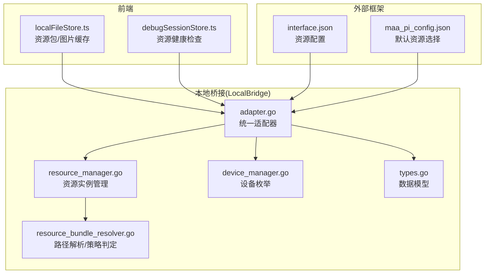
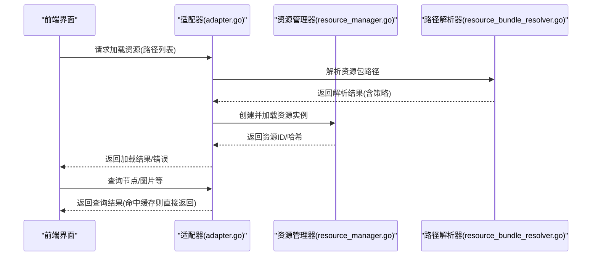
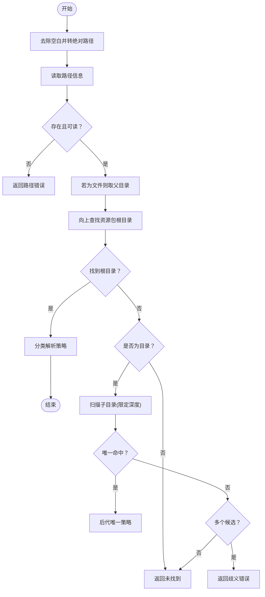
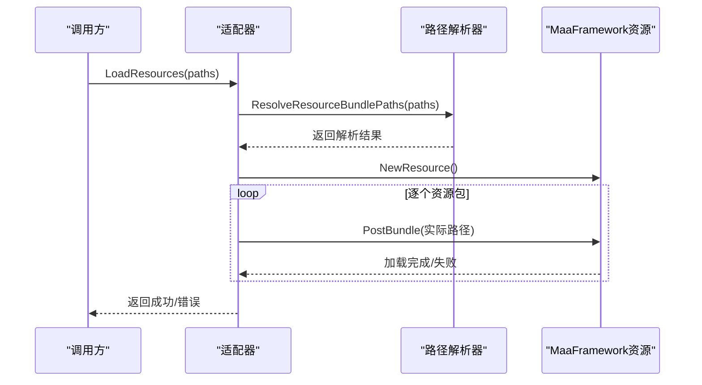
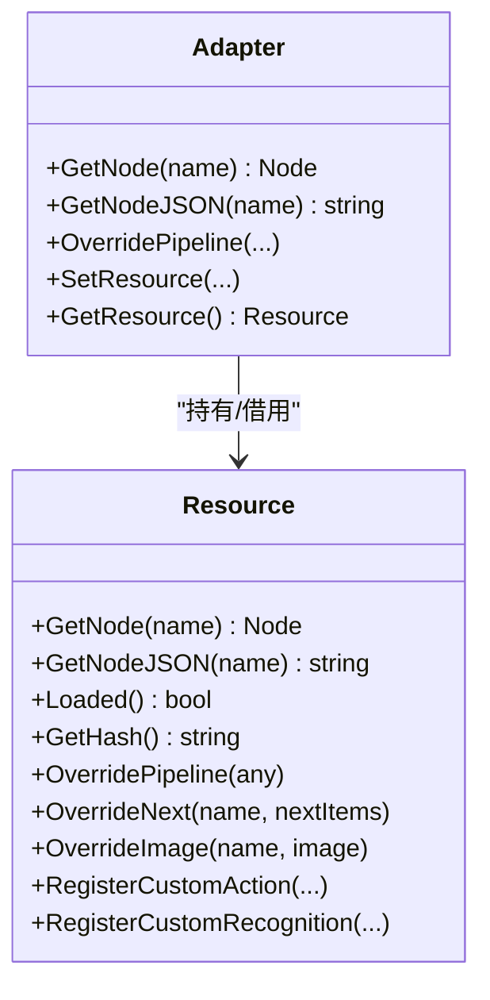
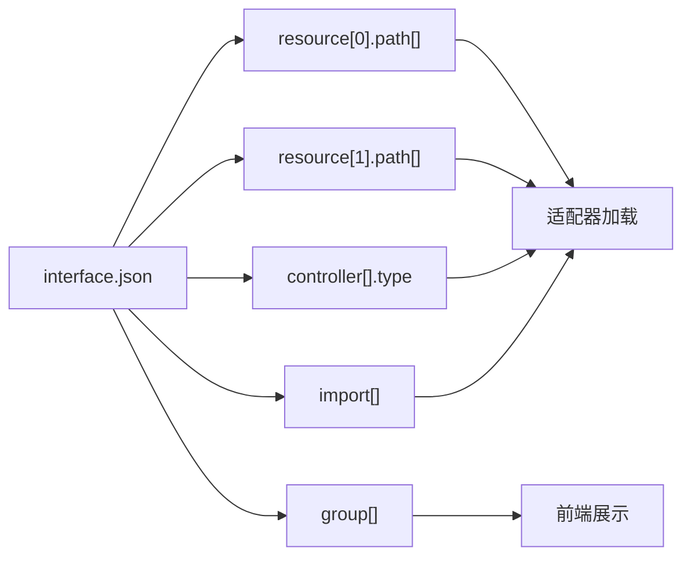
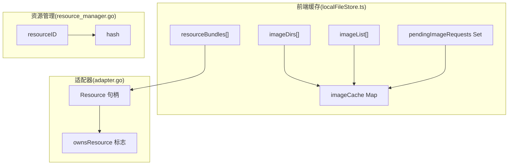
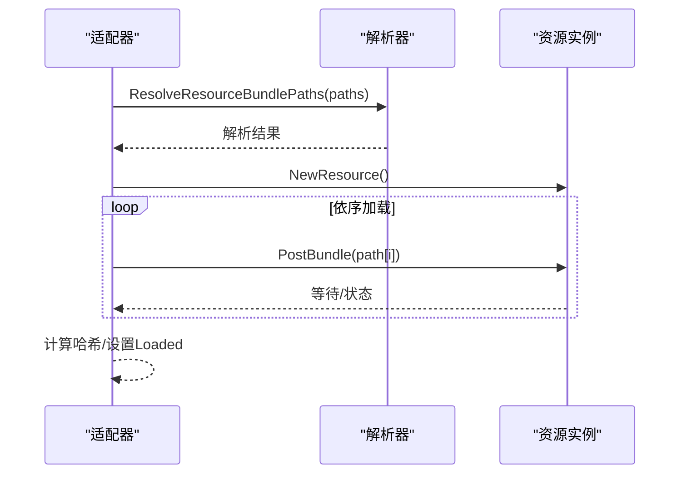
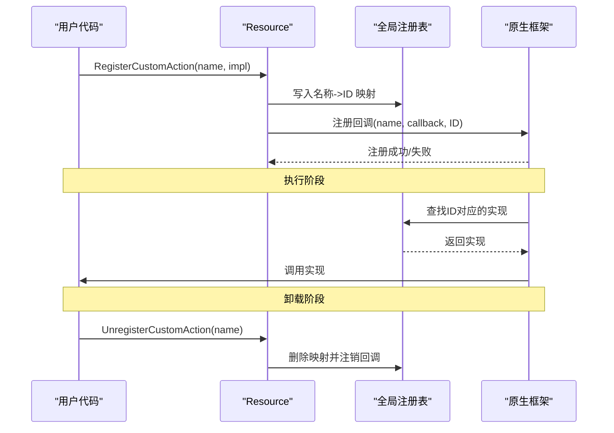
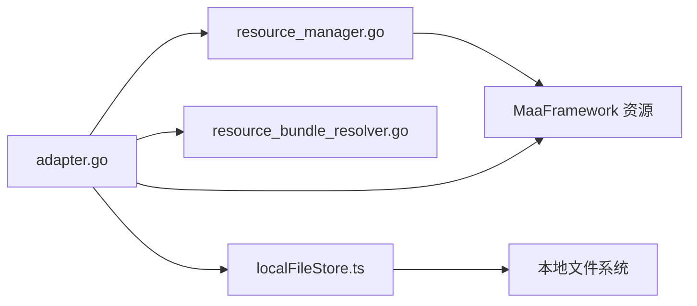

# 资源服务

<cite>
**本文引用的文件**
- [resource_bundle_resolver.go](file://LocalBridge/internal/mfw/resource_bundle_resolver.go)
- [resource_manager.go](file://LocalBridge/internal/mfw/resource_manager.go)
- [adapter.go](file://LocalBridge/internal/mfw/adapter.go)
- [types.go](file://LocalBridge/internal/mfw/types.go)
- [device_manager.go](file://LocalBridge/internal/mfw/device_manager.go)
- [localFileStore.ts](file://src/stores/localFileStore.ts)
- [debugSessionStore.ts](file://src/stores/debugSessionStore.ts)
- [interface.json](file://LocalBridge/test-json/interface.json)
- [maa_pi_config.json](file://LocalBridge/test-json/config/maa_pi_config.json)
- [Resource.md](file://dev/instructions/maafw-golang-binding/Resource.md)
- [Extension System.md](file://dev/instructions/maafw-golang-binding/Extension System.md)
- [Custom Actions.md](file://dev/instructions/maafw-golang-binding/Custom Actions.md)
- [3.3-ProjectInterfaceV2.md](file://dev/instructions/maafw-guide/3.3-ProjectInterfaceV2.md)
</cite>

## 目录
1. [简介](#简介)
2. [项目结构](#项目结构)
3. [核心组件](#核心组件)
4. [架构总览](#架构总览)
5. [详细组件分析](#详细组件分析)
6. [依赖关系分析](#依赖关系分析)
7. [性能考量](#性能考量)
8. [故障排查指南](#故障排查指南)
9. [结论](#结论)
10. [附录](#附录)

## 简介
本文件聚焦于资源服务模块的技术实现，围绕资源索引与查询机制、资源分类与标签体系、资源路径解析与别名映射、资源缓存策略与内存管理、资源依赖关系与加载顺序、资源扩展与自定义资源类型以及版本控制与向后兼容性进行系统化说明。文档以代码为依据，结合可视化图表与分层讲解，帮助读者快速理解并高效使用该模块。

## 项目结构
资源服务位于 LocalBridge 内部，采用“适配器 + 管理器 + 解析器”的分层设计：
- 路径解析层：负责将用户提供的资源路径解析为实际的资源包根目录，并判定解析策略。
- 资源管理层：负责资源实例的创建、加载、缓存与销毁。
- 适配器层：对外暴露统一接口，协调控制器、资源、任务器与代理客户端。
- 前端缓存层：在前端侧维护资源包、图片列表与图片缓存，提升交互体验。

**图表来源**
- [resource_bundle_resolver.go:1-368](file://LocalBridge/internal/mfw/resource_bundle_resolver.go#L1-L368)
- [resource_manager.go:1-118](file://LocalBridge/internal/mfw/resource_manager.go#L1-L118)
- [adapter.go:1-999](file://LocalBridge/internal/mfw/adapter.go#L1-L999)
- [device_manager.go:1-136](file://LocalBridge/internal/mfw/device_manager.go#L1-L136)
- [types.go:1-129](file://LocalBridge/internal/mfw/types.go#L1-L129)
- [localFileStore.ts:58-338](file://src/stores/localFileStore.ts#L58-L338)
- [debugSessionStore.ts:196-259](file://src/stores/debugSessionStore.ts#L196-L259)
- [interface.json:1-92](file://LocalBridge/test-json/interface.json#L1-L92)
- [maa_pi_config.json:1-3](file://LocalBridge/test-json/config/maa_pi_config.json#L1-L3)

**章节来源**
- [resource_bundle_resolver.go:1-368](file://LocalBridge/internal/mfw/resource_bundle_resolver.go#L1-L368)
- [resource_manager.go:1-118](file://LocalBridge/internal/mfw/resource_manager.go#L1-L118)
- [adapter.go:1-999](file://LocalBridge/internal/mfw/adapter.go#L1-L999)
- [device_manager.go:1-136](file://LocalBridge/internal/mfw/device_manager.go#L1-L136)
- [types.go:1-129](file://LocalBridge/internal/mfw/types.go#L1-L129)
- [localFileStore.ts:58-338](file://src/stores/localFileStore.ts#L58-L338)
- [debugSessionStore.ts:196-259](file://src/stores/debugSessionStore.ts#L196-L259)
- [interface.json:1-92](file://LocalBridge/test-json/interface.json#L1-L92)
- [maa_pi_config.json:1-3](file://LocalBridge/test-json/config/maa_pi_config.json#L1-L3)

## 核心组件
- 资源包路径解析器：根据输入路径自动判定资源包根目录，支持多种解析策略（精确根、祖先路径、后代唯一）。
- 资源管理器：负责资源实例的生命周期管理、哈希计算与缓存。
- 适配器：封装控制器、资源、任务器与代理客户端，提供统一的加载与查询接口。
- 前端缓存：维护资源包列表、图片目录、图片缓存与图片列表，优化渲染与交互。
- 接口配置：通过 interface.json 定义资源包路径、控制器约束与选项参数，支撑资源分类与标签。

**章节来源**
- [resource_bundle_resolver.go:105-205](file://LocalBridge/internal/mfw/resource_bundle_resolver.go#L105-L205)
- [resource_manager.go:24-65](file://LocalBridge/internal/mfw/resource_manager.go#L24-L65)
- [adapter.go:249-328](file://LocalBridge/internal/mfw/adapter.go#L249-L328)
- [localFileStore.ts:58-338](file://src/stores/localFileStore.ts#L58-L338)
- [interface.json:29-36](file://LocalBridge/test-json/interface.json#L29-L36)

## 架构总览
资源服务的整体流程包括：路径解析、资源预检、资源加载、查询接口与缓存更新。前端通过适配器与资源管理器协作，实现资源包的健康检查与图片缓存。

**图表来源**
- [adapter.go:257-328](file://LocalBridge/internal/mfw/adapter.go#L257-L328)
- [resource_manager.go:24-65](file://LocalBridge/internal/mfw/resource_manager.go#L24-L65)
- [resource_bundle_resolver.go:105-205](file://LocalBridge/internal/mfw/resource_bundle_resolver.go#L105-L205)

## 详细组件分析

### 资源包路径解析与策略判定
- 支持的解析策略
  - 精确根：输入即为资源包根目录
  - 祖先路径：从 pipeline/image/model 或其子路径向上回溯至根目录
  - 后代唯一：在子目录中唯一命中资源包根目录
- 解析流程
  - 去除空白字符并转为绝对路径
  - 若为文件则取其父目录作为起始搜索点
  - 优先在搜索起点向上查找资源包根目录
  - 若起点为目录，则在限定深度内扫描子目录，若命中唯一则按“后代唯一”策略处理；若命中多个则报歧义错误
  - 若未找到则报“未找到”错误
- 错误类型
  - 空路径、无效路径、路径不存在、命中多个候选、未找到资源包根

**图表来源**
- [resource_bundle_resolver.go:131-205](file://LocalBridge/internal/mfw/resource_bundle_resolver.go#L131-L205)

**章节来源**
- [resource_bundle_resolver.go:16-66](file://LocalBridge/internal/mfw/resource_bundle_resolver.go#L16-L66)
- [resource_bundle_resolver.go:131-205](file://LocalBridge/internal/mfw/resource_bundle_resolver.go#L131-L205)
- [resource_bundle_resolver_test.go:10-119](file://LocalBridge/internal/mfw/resource_bundle_resolver_test.go#L10-L119)

### 资源加载与生命周期管理
- 资源加载
  - 通过适配器加载多个资源路径，按顺序依次加载并合并
  - 对每个资源包进行预检加载，确保资源处于 Loaded 状态并计算哈希
  - 在 Windows 上对包含非 ASCII 字符的路径进行短路径或工作目录切换处理
- 资源管理
  - 资源管理器为每个资源分配唯一 ID，记录路径、加载状态与哈希
  - 支持按 ID 获取资源、卸载单个资源与全部卸载
- 适配器职责
  - 提供 LoadResources/LoadResolvedResources 接口
  - 维护资源所有权标志，避免重复销毁
  - 提供查询接口（如 GetNode、GetNodeJSON）

**图表来源**
- [adapter.go:257-328](file://LocalBridge/internal/mfw/adapter.go#L257-L328)
- [resource_bundle_resolver.go:207-234](file://LocalBridge/internal/mfw/resource_bundle_resolver.go#L207-L234)
- [resource_manager.go:24-65](file://LocalBridge/internal/mfw/resource_manager.go#L24-L65)

**章节来源**
- [adapter.go:257-328](file://LocalBridge/internal/mfw/adapter.go#L257-L328)
- [adapter.go:343-365](file://LocalBridge/internal/mfw/adapter.go#L343-L365)
- [resource_manager.go:24-65](file://LocalBridge/internal/mfw/resource_manager.go#L24-L65)

### 资源查询接口与覆盖机制
- 查询接口
  - GetNode/GetNodeJSON：基于资源句柄查询节点与节点 JSON
  - Loaded/GetHash：查询资源加载状态与哈希
- 覆盖机制
  - 支持覆盖管道、下一步与图片资源，便于调试与定制
- 自定义扩展
  - 支持注册/注销自定义动作与识别器，形成可扩展的资源生态

**图表来源**
- [Resource.md:28-115](file://dev/instructions/maafw-golang-binding/Resource.md#L28-L115)
- [adapter.go:406-450](file://LocalBridge/internal/mfw/adapter.go#L406-L450)

**章节来源**
- [adapter.go:406-450](file://LocalBridge/internal/mfw/adapter.go#L406-L450)
- [Resource.md:28-115](file://dev/instructions/maafw-golang-binding/Resource.md#L28-L115)
- [Extension System.md:168-205](file://dev/instructions/maafw-golang-binding/Extension System.md#L168-L205)
- [Custom Actions.md:19-856](file://dev/instructions/maafw-golang-binding/Custom Actions.md#L19-L856)

### 资源分类与标签系统
- 资源分类
  - 通过 interface.json 的 resource 数组定义资源包集合，每个资源包包含名称、路径数组与可选的控制器支持列表
  - 路径数组按顺序加载，后加载的资源会覆盖先前资源
- 标签与分组
  - 通过 group 字段定义任务分组，便于 UI 展示与组织
  - 通过 import 字段聚合任务文件，简化资源组织
- 控制器约束
  - controller 字段可限制资源包支持的控制器类型，实现多控制器场景下的资源隔离

**图表来源**
- [interface.json:29-36](file://LocalBridge/test-json/interface.json#L29-L36)
- [interface.json:14-28](file://LocalBridge/test-json/interface.json#L14-L28)
- [interface.json:44-63](file://LocalBridge/test-json/interface.json#L44-L63)
- [interface.json:64-88](file://LocalBridge/test-json/interface.json#L64-L88)

**章节来源**
- [interface.json:1-92](file://LocalBridge/test-json/interface.json#L1-L92)
- [3.3-ProjectInterfaceV2.md:201-244](file://dev/instructions/maafw-guide/3.3-ProjectInterfaceV2.md#L201-L244)

### 资源缓存策略与内存管理
- 前端缓存
  - localFileStore.ts 维护资源包列表、图片目录、图片缓存与图片列表，支持增量更新与清空
  - 提供图片请求去重（pendingImageRequests），避免重复请求
- 适配器与资源管理
  - 适配器持有资源句柄，支持设置借用资源（不拥有所有权）
  - 资源管理器为每个资源生成唯一 ID 并记录哈希，便于缓存命中与校验
- 内存管理
  - 适配器在替换资源时会销毁旧资源
  - 资源管理器提供卸载接口，确保资源释放

**图表来源**
- [localFileStore.ts:58-338](file://src/stores/localFileStore.ts#L58-L338)
- [adapter.go:367-397](file://LocalBridge/internal/mfw/adapter.go#L367-L397)
- [resource_manager.go:51-64](file://LocalBridge/internal/mfw/resource_manager.go#L51-L64)

**章节来源**
- [localFileStore.ts:58-338](file://src/stores/localFileStore.ts#L58-L338)
- [adapter.go:367-397](file://LocalBridge/internal/mfw/adapter.go#L367-L397)
- [resource_manager.go:51-64](file://LocalBridge/internal/mfw/resource_manager.go#L51-L64)

### 资源依赖关系与加载顺序
- 顺序加载
  - 资源路径数组按顺序加载，后加载的资源覆盖先前资源
- 预检加载
  - CheckResourceBundlesDetailed 对资源包进行预检，确保加载后处于 Loaded 状态并计算哈希
- 适配器加载
  - 适配器在加载过程中维护进度回调，支持失败回滚与错误上报

**图表来源**
- [adapter.go:257-328](file://LocalBridge/internal/mfw/adapter.go#L257-L328)
- [resource_bundle_resolver.go:207-234](file://LocalBridge/internal/mfw/resource_bundle_resolver.go#L207-L234)

**章节来源**
- [adapter.go:257-328](file://LocalBridge/internal/mfw/adapter.go#L257-L328)
- [resource_bundle_resolver.go:207-234](file://LocalBridge/internal/mfw/resource_bundle_resolver.go#L207-L234)

### 资源扩展与自定义资源类型
- 自定义动作与识别器
  - 通过 Resource.RegisterCustomAction/UnregisterCustomAction 与 Resource.RegisterCustomRecognition/UnregisterCustomRecognition 实现动态注册与注销
  - 回调代理通过全局映射表定位实现，保证线程安全与生命周期管理
- 执行流程
  - 注册阶段建立名称到 ID 的映射，并在原生层注册回调
  - 执行阶段由原生引擎触发回调，再调用用户实现
  - 卸载阶段清理映射与原生注册

**图表来源**
- [Extension System.md:168-205](file://dev/instructions/maafw-golang-binding/Extension System.md#L168-L205)
- [Custom Actions.md:195-230](file://dev/instructions/maafw-golang-binding/Custom Actions.md#L195-L230)

**章节来源**
- [Extension System.md:168-205](file://dev/instructions/maafw-golang-binding/Extension System.md#L168-L205)
- [Custom Actions.md:195-230](file://dev/instructions/maafw-golang-binding/Custom Actions.md#L195-L230)

### 版本控制与向后兼容
- 接口版本
  - interface.json 的 interface_version 字段标识主版本号，当前为 2
  - 文档版本与接口版本相互独立，便于迭代演进
- 软件更新约定
  - UI 仅提供针对发布版本的更新功能，避免 UI/MaaFW 与资源版本混用导致的问题
- 选项与覆盖
  - v2.3.0 引入全局/资源/控制器级选项，配合 pipeline_override 实现参数传递与过滤
  - v2.5.0 起，启动 Agent 子进程时注入 PI_ 前缀环境变量，增强跨平台一致性

**章节来源**
- [3.3-ProjectInterfaceV2.md:38-99](file://dev/instructions/maafw-guide/3.3-ProjectInterfaceV2.md#L38-L99)
- [3.3-ProjectInterfaceV2.md:201-244](file://dev/instructions/maafw-guide/3.3-ProjectInterfaceV2.md#L201-L244)
- [3.3-ProjectInterfaceV2.md:246-285](file://dev/instructions/maafw-guide/3.3-ProjectInterfaceV2.md#L246-L285)

## 依赖关系分析
- 组件耦合
  - 适配器依赖资源管理器与路径解析器，同时与前端缓存交互
  - 资源管理器依赖 MaaFramework 资源句柄与 UUID 生成
  - 前端缓存依赖本地文件系统与图片缓存键值
- 外部依赖
  - MaaFramework Go 绑定（控制器、资源、任务器、代理）
  - 前端状态管理（Zustand）

**图表来源**
- [adapter.go:1-999](file://LocalBridge/internal/mfw/adapter.go#L1-L999)
- [resource_manager.go:1-118](file://LocalBridge/internal/mfw/resource_manager.go#L1-L118)
- [resource_bundle_resolver.go:1-368](file://LocalBridge/internal/mfw/resource_bundle_resolver.go#L1-L368)
- [localFileStore.ts:58-338](file://src/stores/localFileStore.ts#L58-L338)

**章节来源**
- [adapter.go:1-999](file://LocalBridge/internal/mfw/adapter.go#L1-L999)
- [resource_manager.go:1-118](file://LocalBridge/internal/mfw/resource_manager.go#L1-L118)
- [resource_bundle_resolver.go:1-368](file://LocalBridge/internal/mfw/resource_bundle_resolver.go#L1-L368)
- [localFileStore.ts:58-338](file://src/stores/localFileStore.ts#L58-L338)

## 性能考量
- 路径解析
  - 限定扫描深度，避免深层递归带来的性能问题
  - 对 Windows 非 ASCII 路径进行短路径或工作目录切换，减少路径解析开销
- 资源加载
  - 顺序加载与预检加载相结合，尽早发现错误
  - 通过哈希与 Loaded 状态快速判断资源有效性
- 前端缓存
  - 使用 Map/Set 结构存储图片缓存与请求状态，降低查找与去重成本
  - 图片列表加载状态与清空接口，避免冗余渲染

[本节为通用建议，不直接分析具体文件]

## 故障排查指南
- 路径解析错误
  - 空路径、无效路径、路径不存在、命中多个候选、未找到资源包根
  - 建议：检查输入路径、确认资源包根目录包含 pipeline 子目录
- 资源加载失败
  - 新建资源失败、加载作业失败、加载后未处于 Loaded 状态
  - 建议：查看日志输出、确认资源包完整性与权限
- 前端缓存异常
  - 图片缓存未命中、请求重复、图片列表为空
  - 建议：检查 pendingImageRequests、清空缓存后重试

**章节来源**
- [resource_bundle_resolver.go:68-103](file://LocalBridge/internal/mfw/resource_bundle_resolver.go#L68-L103)
- [resource_bundle_resolver.go:207-234](file://LocalBridge/internal/mfw/resource_bundle_resolver.go#L207-L234)
- [localFileStore.ts:259-294](file://src/stores/localFileStore.ts#L259-L294)
- [debugSessionStore.ts:196-259](file://src/stores/debugSessionStore.ts#L196-L259)

## 结论
资源服务模块通过清晰的分层设计与完善的错误处理，实现了资源包路径解析、顺序加载、查询接口与缓存管理的闭环。结合 interface.json 的资源分类与标签体系，以及自定义扩展能力，能够满足复杂场景下的资源组织与运行需求。遵循版本控制与向后兼容约定，有助于长期演进与团队协作。

## 附录
- 关键接口与数据结构
  - 资源包解析：ResourceBundleResolution、ResourceBundleResolveStrategy
  - 资源管理：ResourceManager、ResourceInfo
  - 适配器：MaaFWAdapter、ResourceLoadProgressFunc
  - 前端缓存：LocalFileState、ImageCacheItem
- 配置参考
  - interface.json 中的 resource、controller、group、import 字段
  - maa_pi_config.json 中的默认资源选择

**章节来源**
- [types.go:56-129](file://LocalBridge/internal/mfw/types.go#L56-L129)
- [interface.json:1-92](file://LocalBridge/test-json/interface.json#L1-L92)
- [maa_pi_config.json:1-3](file://LocalBridge/test-json/config/maa_pi_config.json#L1-L3)