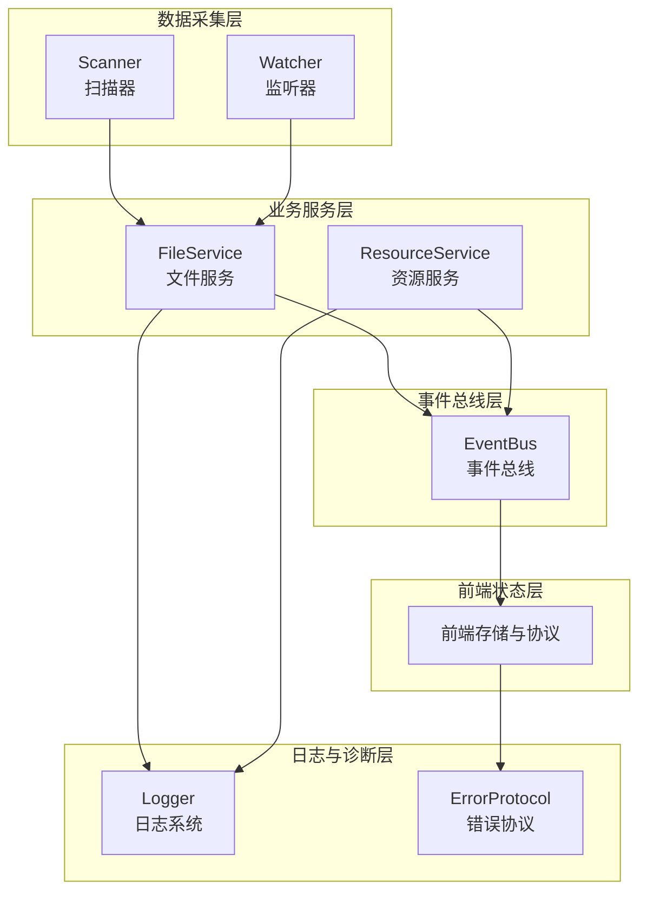
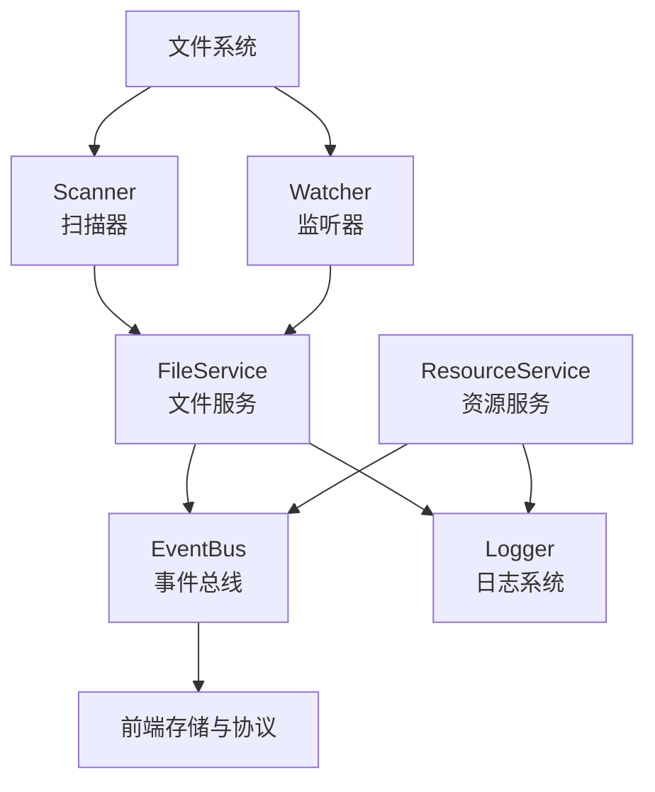
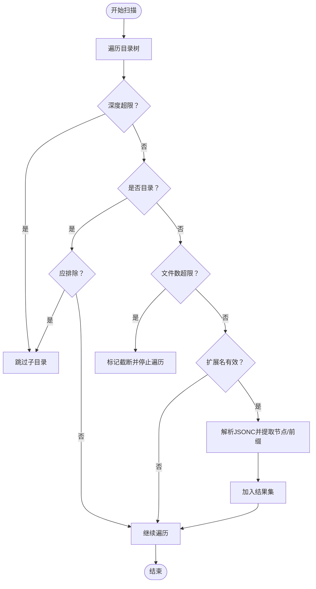
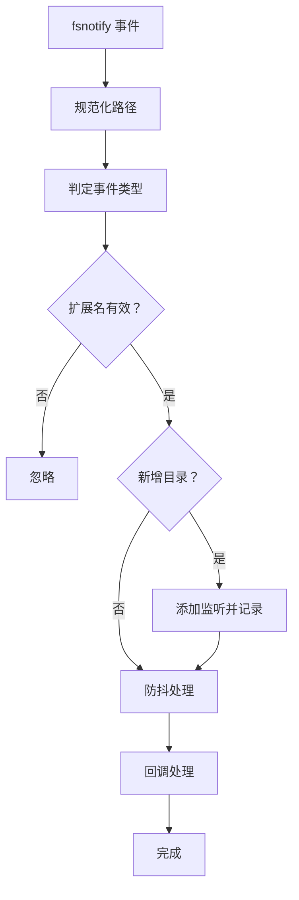
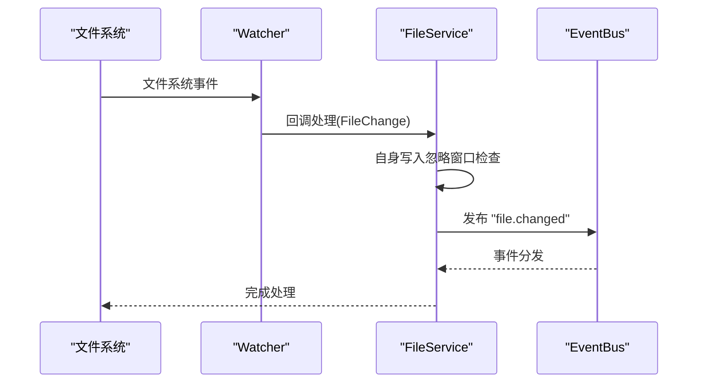
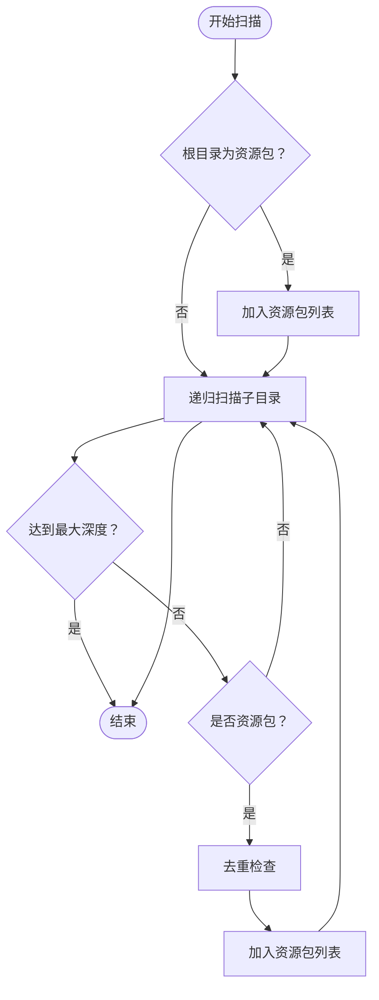
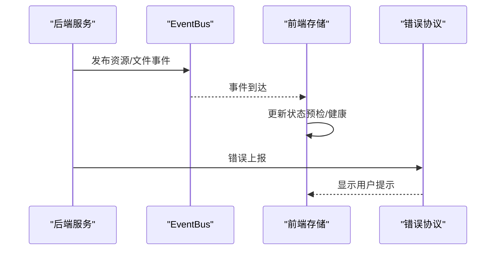
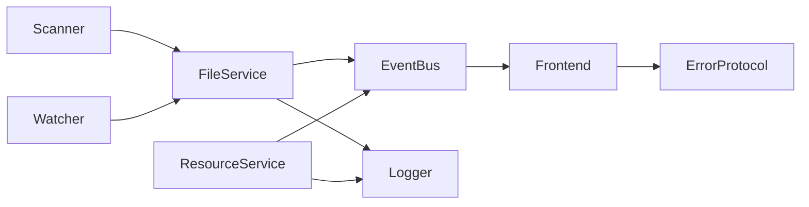

# 资源监控

<cite>
**本文档引用的文件**
- [LocalBridge/internal/service/file/watcher.go](file://LocalBridge/internal/service/file/watcher.go)
- [LocalBridge/internal/service/file/scanner.go](file://LocalBridge/internal/service/file/scanner.go)
- [LocalBridge/internal/service/file/file_service.go](file://LocalBridge/internal/service/file/file_service.go)
- [LocalBridge/internal/service/resource/resource_service.go](file://LocalBridge/internal/service/resource/resource_service.go)
- [LocalBridge/internal/eventbus/eventbus.go](file://LocalBridge/internal/eventbus/eventbus.go)
- [LocalBridge/pkg/models/file.go](file://LocalBridge/pkg/models/file.go)
- [LocalBridge/pkg/models/resource.go](file://LocalBridge/pkg/models/resource.go)
- [LocalBridge/internal/logger/logger.go](file://LocalBridge/internal/logger/logger.go)
- [src/stores/debugSessionStore.ts](file://src/stores/debugSessionStore.ts)
- [src/services/protocols/ErrorProtocol.ts](file://src/services/protocols/ErrorProtocol.ts)
- [dev/instructions/.tmp/MaaDebugger-wiki/ResourceService  Pipeline Checker.md](file://dev/instructions/.tmp/MaaDebugger-wiki/ResourceService  Pipeline Checker.md)
- [dev/instructions/wails/reference/runtime/events.mdx](file://dev/instructions/wails/reference/runtime/events.mdx)
</cite>

## 目录
1. [简介](#简介)
2. [项目结构](#项目结构)
3. [核心组件](#核心组件)
4. [架构总览](#架构总览)
5. [详细组件分析](#详细组件分析)
6. [依赖关系分析](#依赖关系分析)
7. [性能考量](#性能考量)
8. [故障排查指南](#故障排查指南)
9. [结论](#结论)
10. [附录](#附录)

## 简介
本文件面向资源监控系统的技术文档，聚焦于文件系统事件的捕获与处理、资源变更通知的发布订阅模式、监控器的性能优化与事件去重策略、资源状态监控与诊断信息收集、监控数据的存储与查询接口、扩展与自定义监控指标的实现指导，以及监控告警与异常处理的最佳实践。文档基于仓库中的实际代码实现进行分析，并提供可视化图示帮助理解。

## 项目结构
资源监控系统主要由以下层次构成：
- 数据采集层：文件扫描器与文件监听器，负责扫描与实时监听文件系统变更
- 业务服务层：文件服务与资源服务，负责构建索引、维护状态、触发事件
- 事件总线层：统一的事件发布/订阅机制，解耦各模块
- 前端状态层：前端存储与协议，负责接收事件并驱动UI更新
- 日志与诊断层：日志系统与错误协议，提供可观测性与告警



**图表来源**
- [LocalBridge/internal/service/file/scanner.go:1-301](file://LocalBridge/internal/service/file/scanner.go#L1-L301)
- [LocalBridge/internal/service/file/watcher.go:1-261](file://LocalBridge/internal/service/file/watcher.go#L1-L261)
- [LocalBridge/internal/service/file/file_service.go:1-87](file://LocalBridge/internal/service/file/file_service.go#L1-L87)
- [LocalBridge/internal/service/resource/resource_service.go:1-359](file://LocalBridge/internal/service/resource/resource_service.go#L1-L359)
- [LocalBridge/internal/eventbus/eventbus.go:1-83](file://LocalBridge/internal/eventbus/eventbus.go#L1-L83)
- [LocalBridge/internal/logger/logger.go:1-251](file://LocalBridge/internal/logger/logger.go#L1-L251)
- [src/stores/debugSessionStore.ts:1-259](file://src/stores/debugSessionStore.ts#L1-L259)
- [src/services/protocols/ErrorProtocol.ts:27-53](file://src/services/protocols/ErrorProtocol.ts#L27-L53)

**章节来源**
- [LocalBridge/internal/service/file/scanner.go:1-301](file://LocalBridge/internal/service/file/scanner.go#L1-L301)
- [LocalBridge/internal/service/file/watcher.go:1-261](file://LocalBridge/internal/service/file/watcher.go#L1-L261)
- [LocalBridge/internal/service/file/file_service.go:1-87](file://LocalBridge/internal/service/file/file_service.go#L1-L87)
- [LocalBridge/internal/service/resource/resource_service.go:1-359](file://LocalBridge/internal/service/resource/resource_service.go#L1-L359)
- [LocalBridge/internal/eventbus/eventbus.go:1-83](file://LocalBridge/internal/eventbus/eventbus.go#L1-L83)
- [LocalBridge/internal/logger/logger.go:1-251](file://LocalBridge/internal/logger/logger.go#L1-L251)
- [src/stores/debugSessionStore.ts:1-259](file://src/stores/debugSessionStore.ts#L1-L259)
- [src/services/protocols/ErrorProtocol.ts:27-53](file://src/services/protocols/ErrorProtocol.ts#L27-L53)

## 核心组件
- 文件扫描器（Scanner）：递归扫描根目录，支持深度与文件数量限制，过滤排除目录与无效扩展名，解析文件节点与前缀，生成扫描结果
- 文件监听器（Watcher）：基于 fsnotify 递归监听目录树，过滤无关目录与扩展名，采用防抖机制减少重复处理
- 文件服务（FileService）：整合扫描与监听，构建文件索引，发布“扫描完成”与“文件变更”事件，内置自身写入忽略窗口
- 资源服务（ResourceService）：扫描资源包与图像目录，发布“资源扫描完成”事件，支持重载与查询
- 事件总线（EventBus）：提供同步/异步发布与订阅，支持全局事件类型常量
- 日志系统（Logger）：多通道日志输出，支持推送至前端与历史日志缓存
- 前端存储与协议：前端状态管理与错误协议，用于展示资源健康状态与错误提示

**章节来源**
- [LocalBridge/internal/service/file/scanner.go:1-301](file://LocalBridge/internal/service/file/scanner.go#L1-L301)
- [LocalBridge/internal/service/file/watcher.go:1-261](file://LocalBridge/internal/service/file/watcher.go#L1-L261)
- [LocalBridge/internal/service/file/file_service.go:1-87](file://LocalBridge/internal/service/file/file_service.go#L1-L87)
- [LocalBridge/internal/service/resource/resource_service.go:1-359](file://LocalBridge/internal/service/resource/resource_service.go#L1-L359)
- [LocalBridge/internal/eventbus/eventbus.go:1-83](file://LocalBridge/internal/eventbus/eventbus.go#L1-L83)
- [LocalBridge/internal/logger/logger.go:1-251](file://LocalBridge/internal/logger/logger.go#L1-L251)
- [src/stores/debugSessionStore.ts:1-259](file://src/stores/debugSessionStore.ts#L1-L259)
- [src/services/protocols/ErrorProtocol.ts:27-53](file://src/services/protocols/ErrorProtocol.ts#L27-L53)

## 架构总览
资源监控系统采用“扫描/监听 + 事件总线 + 前端状态”的分层架构。文件服务负责采集与索引，资源服务负责资源包识别与图像目录管理；两者通过事件总线向前端推送状态变更；日志系统贯穿全链路提供可观测性；错误协议负责错误语义化展示。



**图表来源**
- [LocalBridge/internal/service/file/scanner.go:1-301](file://LocalBridge/internal/service/file/scanner.go#L1-L301)
- [LocalBridge/internal/service/file/watcher.go:1-261](file://LocalBridge/internal/service/file/watcher.go#L1-L261)
- [LocalBridge/internal/service/file/file_service.go:1-87](file://LocalBridge/internal/service/file/file_service.go#L1-L87)
- [LocalBridge/internal/service/resource/resource_service.go:1-359](file://LocalBridge/internal/service/resource/resource_service.go#L1-L359)
- [LocalBridge/internal/eventbus/eventbus.go:1-83](file://LocalBridge/internal/eventbus/eventbus.go#L1-L83)
- [LocalBridge/internal/logger/logger.go:1-251](file://LocalBridge/internal/logger/logger.go#L1-L251)
- [src/stores/debugSessionStore.ts:1-259](file://src/stores/debugSessionStore.ts#L1-L259)

## 详细组件分析

### 文件扫描器（Scanner）
- 功能要点
  - 递归遍历根目录，支持最大深度与最大文件数限制，遇限制即截断
  - 排除常见目录（如隐藏目录、缓存目录等），避免噪声
  - 过滤扩展名，支持特殊配置文件的排除逻辑
  - 解析文件内容（JSONC），提取节点与前缀，构建文件节点信息
- 性能特征
  - 使用 WalkDir 与 SkipDir 控制遍历深度与剪枝
  - 通过“stop”错误提前终止遍历，降低不必要开销
- 数据结构
  - ScanResult：包含文件列表、总数、截断标记与原因
  - FileNode：节点标签、前缀、锚点引用列表
  - File：文件绝对路径、相对路径、名称、最后修改时间、节点与前缀



**图表来源**
- [LocalBridge/internal/service/file/scanner.go:64-147](file://LocalBridge/internal/service/file/scanner.go#L64-L147)

**章节来源**
- [LocalBridge/internal/service/file/scanner.go:1-301](file://LocalBridge/internal/service/file/scanner.go#L1-L301)
- [LocalBridge/pkg/models/file.go:1-30](file://LocalBridge/pkg/models/file.go#L1-L30)

### 文件监听器（Watcher）
- 功能要点
  - 基于 fsnotify 递归添加子目录监听
  - 识别创建、修改、删除、重命名事件，规范化路径
  - 过滤无效扩展名与目录变更，仅对文件有效事件处理
  - 防抖机制：同一路径事件在设定延迟内合并，避免频繁回调
- 性能特征
  - 防抖器使用 map + time.AfterFunc 实现，键为文件路径或重命名组合
  - 停止时清空定时器，防止泄漏
- 数据结构
  - FileChange：变更类型、文件路径、是否目录、旧路径（重命名）



**图表来源**
- [LocalBridge/internal/service/file/watcher.go:95-191](file://LocalBridge/internal/service/file/watcher.go#L95-L191)

**章节来源**
- [LocalBridge/internal/service/file/watcher.go:1-261](file://LocalBridge/internal/service/file/watcher.go#L1-L261)

### 文件服务（FileService）
- 功能要点
  - 启动时执行扫描并构建文件索引，发布“扫描完成”事件
  - 启动监听器，处理文件变更事件，发布“文件变更”事件
  - 自身写入忽略窗口：在设定时间内忽略自身触发的写入事件，减少抖动
- 事件与状态
  - 发布事件类型：扫描完成、文件变更
  - 前端可通过事件驱动 UI 更新与诊断展示



**图表来源**
- [LocalBridge/internal/service/file/file_service.go:64-87](file://LocalBridge/internal/service/file/file_service.go#L64-L87)
- [LocalBridge/internal/service/file/watcher.go:95-191](file://LocalBridge/internal/service/file/watcher.go#L95-L191)
- [LocalBridge/internal/eventbus/eventbus.go:38-51](file://LocalBridge/internal/eventbus/eventbus.go#L38-L51)

**章节来源**
- [LocalBridge/internal/service/file/file_service.go:1-87](file://LocalBridge/internal/service/file/file_service.go#L1-L87)
- [LocalBridge/internal/eventbus/eventbus.go:1-83](file://LocalBridge/internal/eventbus/eventbus.go#L1-L83)

### 资源服务（ResourceService）
- 功能要点
  - 扫描资源包：识别包含 pipeline/image/model/default_pipeline.json 的目录
  - 支持跳过常见非资源目录，递归扫描限定层级
  - 提供图片列表查询、根据 pipeline 路径定位资源包、发布“资源扫描完成”事件
  - 支持重载：更新根目录并重新扫描，发布事件
- 数据结构
  - ResourceBundle：资源包元信息
  - ResourceBundleListData：资源包列表与图像目录列表
  - ImageFileInfo：图片文件信息



**图表来源**
- [LocalBridge/internal/service/resource/resource_service.go:48-119](file://LocalBridge/internal/service/resource/resource_service.go#L48-L119)

**章节来源**
- [LocalBridge/internal/service/resource/resource_service.go:1-359](file://LocalBridge/internal/service/resource/resource_service.go#L1-L359)
- [LocalBridge/pkg/models/resource.go:1-67](file://LocalBridge/pkg/models/resource.go#L1-L67)

### 事件总线（EventBus）
- 功能要点
  - 订阅/发布：支持同步与异步发布，提供全局实例
  - 事件类型常量：包括文件扫描完成、文件变更、连接建立/关闭、资源扫描完成、配置重载等
- 使用建议
  - 业务模块通过事件总线解耦，前端通过事件驱动状态更新

```mermaid
classDiagram
class EventBus {
-handlers : map[string][]EventHandler
-mu : RWMutex
+Subscribe(eventType, handler)
+Publish(eventType, data)
+PublishAsync(eventType, data)
+Unsubscribe(eventType)
}
class Event {
+Type : string
+Data : interface{}
}
EventBus --> Event : "封装"
```

**图表来源**
- [LocalBridge/internal/eventbus/eventbus.go:1-83](file://LocalBridge/internal/eventbus/eventbus.go#L1-L83)

**章节来源**
- [LocalBridge/internal/eventbus/eventbus.go:1-83](file://LocalBridge/internal/eventbus/eventbus.go#L1-L83)

### 前端状态与协议
- 前端存储（debugSessionStore）
  - 维护资源预检与健康状态，支持设置检查中、结果与错误状态，提供主错误提取
- 错误协议（ErrorProtocol）
  - 将后端错误码映射为用户可读提示，便于前端展示与引导修复



**图表来源**
- [src/stores/debugSessionStore.ts:20-80](file://src/stores/debugSessionStore.ts#L20-L80)
- [src/services/protocols/ErrorProtocol.ts:27-53](file://src/services/protocols/ErrorProtocol.ts#L27-L53)

**章节来源**
- [src/stores/debugSessionStore.ts:1-259](file://src/stores/debugSessionStore.ts#L1-L259)
- [src/services/protocols/ErrorProtocol.ts:27-53](file://src/services/protocols/ErrorProtocol.ts#L27-L53)

## 依赖关系分析
- 组件耦合
  - FileService 依赖 Scanner 与 Watcher，同时依赖 EventBus 发布事件
  - ResourceService 依赖 EventBus 发布资源扫描完成事件
  - Logger 为各服务提供日志能力，贯穿全链路
  - 前端通过事件与协议消费后端状态与错误
- 外部依赖
  - fsnotify：文件系统事件监听
  - logrus：日志输出与格式化
  - JSONC 解析：扫描器解析文件内容



**图表来源**
- [LocalBridge/internal/service/file/scanner.go:1-301](file://LocalBridge/internal/service/file/scanner.go#L1-L301)
- [LocalBridge/internal/service/file/watcher.go:1-261](file://LocalBridge/internal/service/file/watcher.go#L1-L261)
- [LocalBridge/internal/service/file/file_service.go:1-87](file://LocalBridge/internal/service/file/file_service.go#L1-L87)
- [LocalBridge/internal/service/resource/resource_service.go:1-359](file://LocalBridge/internal/service/resource/resource_service.go#L1-L359)
- [LocalBridge/internal/eventbus/eventbus.go:1-83](file://LocalBridge/internal/eventbus/eventbus.go#L1-L83)
- [LocalBridge/internal/logger/logger.go:1-251](file://LocalBridge/internal/logger/logger.go#L1-L251)
- [src/stores/debugSessionStore.ts:1-259](file://src/stores/debugSessionStore.ts#L1-L259)
- [src/services/protocols/ErrorProtocol.ts:27-53](file://src/services/protocols/ErrorProtocol.ts#L27-L53)

**章节来源**
- [LocalBridge/internal/service/file/scanner.go:1-301](file://LocalBridge/internal/service/file/scanner.go#L1-L301)
- [LocalBridge/internal/service/file/watcher.go:1-261](file://LocalBridge/internal/service/file/watcher.go#L1-L261)
- [LocalBridge/internal/service/file/file_service.go:1-87](file://LocalBridge/internal/service/file/file_service.go#L1-L87)
- [LocalBridge/internal/service/resource/resource_service.go:1-359](file://LocalBridge/internal/service/resource/resource_service.go#L1-L359)
- [LocalBridge/internal/eventbus/eventbus.go:1-83](file://LocalBridge/internal/eventbus/eventbus.go#L1-L83)
- [LocalBridge/internal/logger/logger.go:1-251](file://LocalBridge/internal/logger/logger.go#L1-L251)
- [src/stores/debugSessionStore.ts:1-259](file://src/stores/debugSessionStore.ts#L1-L259)
- [src/services/protocols/ErrorProtocol.ts:27-53](file://src/services/protocols/ErrorProtocol.ts#L27-L53)

## 性能考量
- 扫描与遍历
  - 使用 WalkDir + SkipDir 控制深度与剪枝，避免无效遍历
  - 通过“stop”错误提前终止，减少后续开销
- 监听与事件
  - 递归添加目录监听，新增目录自动加入监听，保证覆盖范围
  - 防抖机制（默认延迟）合并高频事件，降低回调频率
- 内存与并发
  - 读写锁保护文件索引与资源包列表，减少锁竞争
  - 异步发布事件，避免阻塞事件循环
- I/O 与磁盘
  - 排除常见非资源目录，减少无效 I/O
  - 日志文件轮转与历史缓存，平衡可观测性与存储占用

**章节来源**
- [LocalBridge/internal/service/file/scanner.go:64-147](file://LocalBridge/internal/service/file/scanner.go#L64-L147)
- [LocalBridge/internal/service/file/watcher.go:62-83](file://LocalBridge/internal/service/file/watcher.go#L62-L83)
- [LocalBridge/internal/service/file/watcher.go:220-235](file://LocalBridge/internal/service/file/watcher.go#L220-L235)
- [LocalBridge/internal/logger/logger.go:108-134](file://LocalBridge/internal/logger/logger.go#L108-L134)

## 故障排查指南
- 常见问题与定位
  - 文件扫描截断：检查最大文件数与深度限制，确认 LimitReason
  - 监听失效：确认目录是否被排除、是否正确递归添加监听
  - 事件风暴：检查防抖延迟设置与自身写入忽略窗口
  - 资源包识别失败：确认资源包标志（pipeline/image/model/default_pipeline.json）是否存在
- 日志与诊断
  - 使用 Logger 输出模块化日志，结合历史缓存定位问题
  - 错误协议将后端错误码映射为用户提示，便于前端展示
- 建议流程
  - 启动阶段：先观察“扫描完成”事件，再观察“文件变更”事件
  - 变更阶段：关注防抖后的最终状态，避免误判中间态
  - 错误阶段：依据错误码映射表快速定位问题类型

**章节来源**
- [LocalBridge/internal/service/file/scanner.go:14-18](file://LocalBridge/internal/service/file/scanner.go#L14-L18)
- [LocalBridge/internal/service/file/watcher.go:62-83](file://LocalBridge/internal/service/file/watcher.go#L62-L83)
- [LocalBridge/internal/logger/logger.go:108-134](file://LocalBridge/internal/logger/logger.go#L108-L134)
- [src/services/protocols/ErrorProtocol.ts:27-53](file://src/services/protocols/ErrorProtocol.ts#L27-L53)

## 结论
本资源监控系统通过扫描与监听双通道采集文件系统变更，借助事件总线实现模块解耦与前端联动，配合日志与错误协议形成完整的可观测性闭环。防抖与忽略窗口等策略有效提升稳定性与性能。建议在生产环境中合理配置扫描限制、监听范围与日志级别，并持续完善事件类型与错误映射以提升用户体验。

## 附录

### 监控数据存储与查询接口
- 存储
  - 文件索引：由 FileService 维护，键为绝对路径，值为文件信息
  - 资源包列表：由 ResourceService 维护，包含资源包元信息与图像目录
  - 历史日志：由 Logger 维护，支持历史查询
- 查询
  - 文件查询：通过 FileService 的文件索引与扫描结果
  - 资源包查询：通过 ResourceService 的资源包列表与图像目录
  - 事件查询：通过前端存储的状态与事件历史

**章节来源**
- [LocalBridge/internal/service/file/file_service.go:72-77](file://LocalBridge/internal/service/file/file_service.go#L72-L77)
- [LocalBridge/internal/service/resource/resource_service.go:155-173](file://LocalBridge/internal/service/resource/resource_service.go#L155-L173)
- [LocalBridge/internal/logger/logger.go:108-115](file://LocalBridge/internal/logger/logger.go#L108-L115)

### 扩展与自定义监控指标实现指导
- 扩展事件类型
  - 在事件总线中增加新的事件类型常量，并在相应服务中发布
- 自定义监控指标
  - 在服务中新增统计逻辑（如扫描耗时、事件计数），通过事件或日志输出
- 前端集成
  - 在前端存储中新增对应状态字段，订阅新事件并更新 UI

**章节来源**
- [LocalBridge/internal/eventbus/eventbus.go:74-82](file://LocalBridge/internal/eventbus/eventbus.go#L74-L82)
- [LocalBridge/internal/service/file/file_service.go:86-87](file://LocalBridge/internal/service/file/file_service.go#L86-L87)
- [src/stores/debugSessionStore.ts:20-80](file://src/stores/debugSessionStore.ts#L20-L80)

### 监控告警与异常处理最佳实践
- 告警策略
  - 以事件为触发点：扫描完成、文件变更、资源扫描完成、配置重载
  - 以错误码为语义：将后端错误映射为用户可读提示
- 异常处理
  - 立即检查错误：避免错误累积
  - 降级与回退：在资源包识别失败或扫描异常时提供默认行为
  - 可观测性：通过日志与历史缓存定位问题根因

**章节来源**
- [dev/instructions/maafw-golang-binding/Error Handling.md:597-607](file://dev/instructions/maafw-golang-binding/Error Handling.md#L597-L607)
- [src/services/protocols/ErrorProtocol.ts:27-53](file://src/services/protocols/ErrorProtocol.ts#L27-L53)
- [LocalBridge/internal/logger/logger.go:165-201](file://LocalBridge/internal/logger/logger.go#L165-L201)

### 文件系统事件捕获与处理机制
- 捕获
  - fsnotify 事件：创建、修改、删除、重命名
  - 路径规范化与扩展名校验
- 处理
  - 目录新增：自动加入监听
  - 文件变更：防抖后回调处理
  - 事件发布：统一通过 EventBus 发布

**章节来源**
- [LocalBridge/internal/service/file/watcher.go:95-191](file://LocalBridge/internal/service/file/watcher.go#L95-L191)
- [LocalBridge/internal/eventbus/eventbus.go:38-51](file://LocalBridge/internal/eventbus/eventbus.go#L38-L51)

### 资源变更通知的发布订阅模式
- 订阅
  - FileService 与 ResourceService 订阅各自事件
  - 前端通过事件总线订阅并更新状态
- 发布
  - 扫描完成后发布“扫描完成”事件
  - 文件变更时发布“文件变更”事件
  - 资源扫描完成后发布“资源扫描完成”事件

**章节来源**
- [LocalBridge/internal/service/file/file_service.go:86-87](file://LocalBridge/internal/service/file/file_service.go#L86-L87)
- [LocalBridge/internal/service/resource/resource_service.go:42-43](file://LocalBridge/internal/service/resource/resource_service.go#L42-L43)
- [LocalBridge/internal/eventbus/eventbus.go:74-82](file://LocalBridge/internal/eventbus/eventbus.go#L74-L82)

### 监控器的性能优化与事件去重策略
- 性能优化
  - 深度与文件数限制、目录排除、WalkDir + SkipDir
  - 递归监听、新增目录自动加入监听
  - 读写锁保护共享状态
- 事件去重
  - 防抖器：同一路径事件在设定延迟内合并
  - 自身写入忽略窗口：避免编辑器自身写入引发的重复处理

**章节来源**
- [LocalBridge/internal/service/file/scanner.go:64-147](file://LocalBridge/internal/service/file/scanner.go#L64-L147)
- [LocalBridge/internal/service/file/watcher.go:62-83](file://LocalBridge/internal/service/file/watcher.go#L62-L83)
- [LocalBridge/internal/service/file/watcher.go:220-235](file://LocalBridge/internal/service/file/watcher.go#L220-L235)
- [LocalBridge/internal/service/file/file_service.go:30-35](file://LocalBridge/internal/service/file/file_service.go#L30-L35)

### 资源状态监控与诊断信息收集
- 状态监控
  - 资源包状态：加载/重载后的资源包列表与图像目录
  - 文件状态：扫描结果与变更事件
- 诊断信息
  - 历史日志：最近 N 条日志缓存
  - 错误映射：将后端错误码映射为用户提示

**章节来源**
- [LocalBridge/internal/service/resource/resource_service.go:40-43](file://LocalBridge/internal/service/resource/resource_service.go#L40-L43)
- [LocalBridge/internal/logger/logger.go:108-134](file://LocalBridge/internal/logger/logger.go#L108-L134)
- [src/stores/debugSessionStore.ts:222-237](file://src/stores/debugSessionStore.ts#L222-L237)

### 监控数据的存储与查询接口
- 存储
  - 文件索引：绝对路径 -> 文件信息
  - 资源包列表：资源包元信息集合
  - 历史日志：日志条目数组
- 查询
  - 文件查询：通过绝对路径或相对路径
  - 资源包查询：通过资源包名称或图像目录
  - 事件查询：通过前端存储状态与事件历史

**章节来源**
- [LocalBridge/internal/service/file/file_service.go:72-77](file://LocalBridge/internal/service/file/file_service.go#L72-L77)
- [LocalBridge/internal/service/resource/resource_service.go:155-173](file://LocalBridge/internal/service/resource/resource_service.go#L155-L173)
- [LocalBridge/internal/logger/logger.go:108-115](file://LocalBridge/internal/logger/logger.go#L108-L115)

### 监控告警与异常处理的最佳实践
- 告警
  - 基于事件触发：扫描完成、文件变更、资源扫描完成
  - 基于错误码：将后端错误映射为用户提示
- 异常处理
  - 立即检查错误，避免累积
  - 提供降级与回退策略
  - 通过日志与历史缓存定位问题

**章节来源**
- [dev/instructions/maafw-golang-binding/Error Handling.md:597-607](file://dev/instructions/maafw-golang-binding/Error Handling.md#L597-L607)
- [src/services/protocols/ErrorProtocol.ts:27-53](file://src/services/protocols/ErrorProtocol.ts#L27-L53)
- [LocalBridge/internal/logger/logger.go:165-201](file://LocalBridge/internal/logger/logger.go#L165-L201)