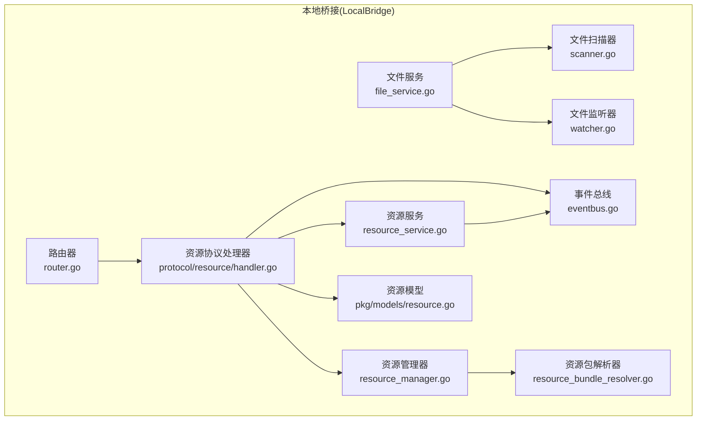
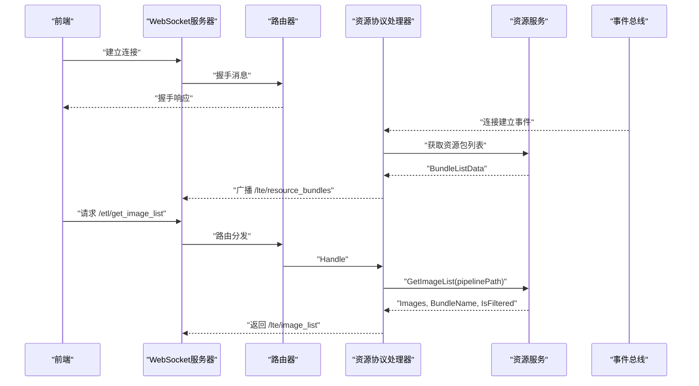
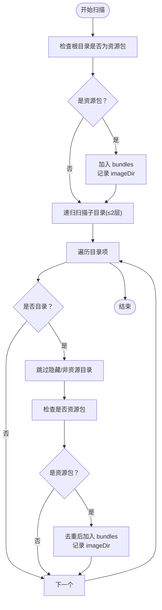
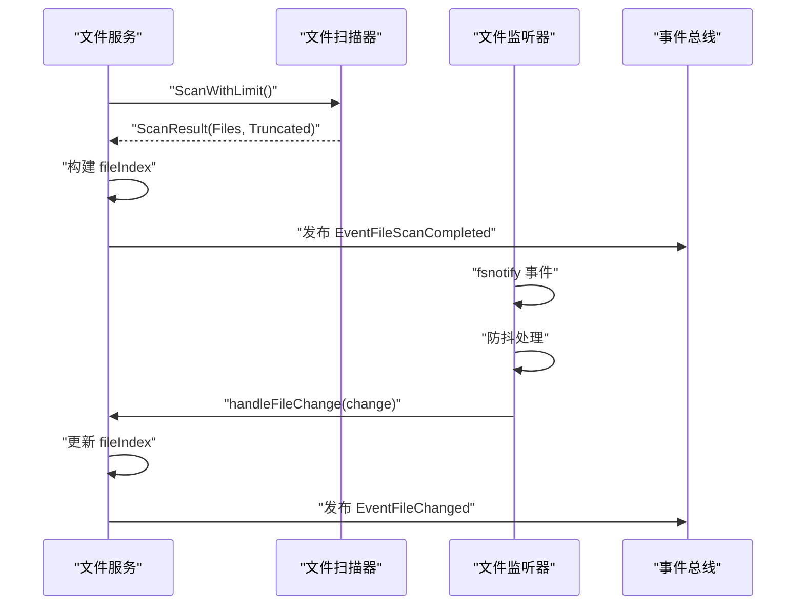
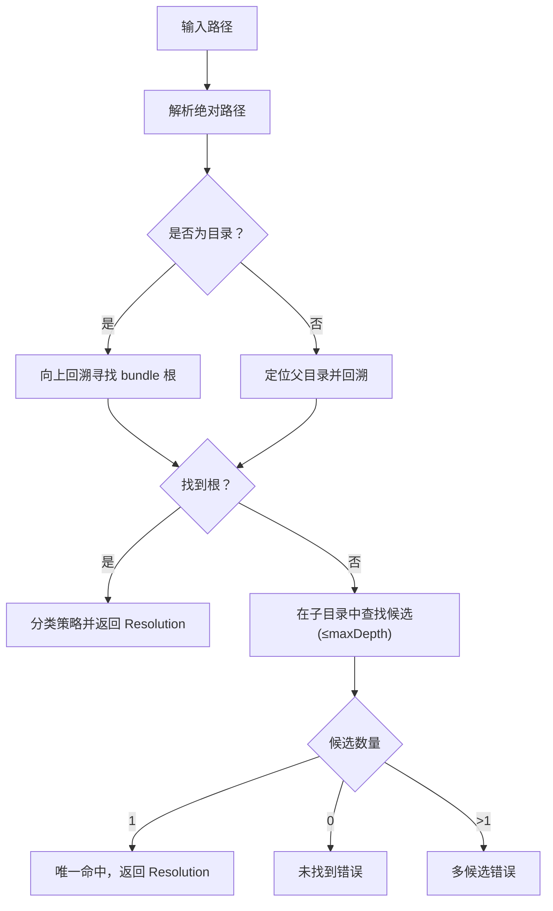
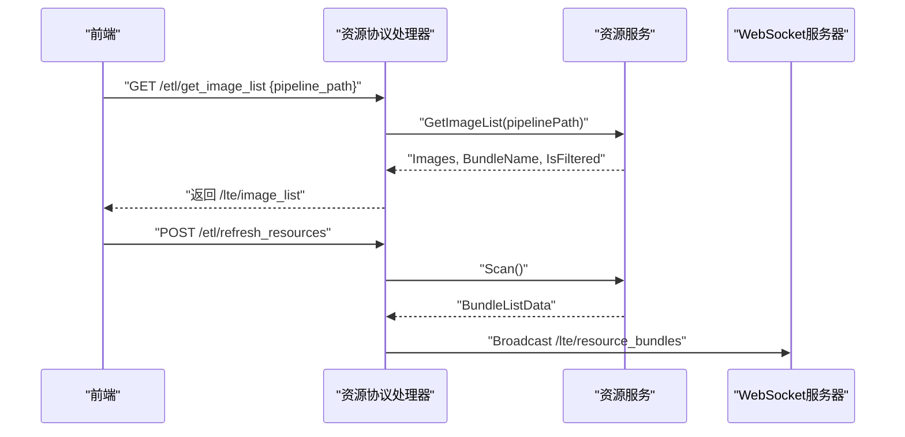
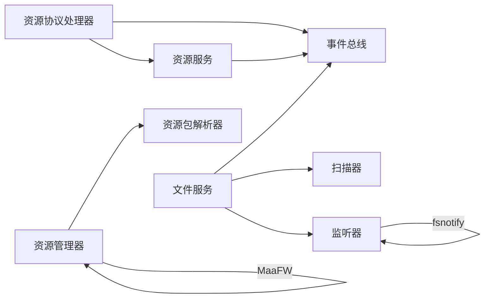

# 资源管理

<cite>
**本文引用的文件**
- [LocalBridge/internal/service/resource/resource_service.go](file://LocalBridge/internal/service/resource/resource_service.go)
- [LocalBridge/internal/service/file/scanner.go](file://LocalBridge/internal/service/file/scanner.go)
- [LocalBridge/internal/service/file/watcher.go](file://LocalBridge/internal/service/file/watcher.go)
- [LocalBridge/internal/service/file/file_service.go](file://LocalBridge/internal/service/file/file_service.go)
- [LocalBridge/internal/mfw/resource_manager.go](file://LocalBridge/internal/mfw/resource_manager.go)
- [LocalBridge/internal/mfw/resource_bundle_resolver.go](file://LocalBridge/internal/mfw/resource_bundle_resolver.go)
- [LocalBridge/internal/mfw/types.go](file://LocalBridge/internal/mfw/types.go)
- [LocalBridge/internal/protocol/resource/handler.go](file://LocalBridge/internal/protocol/resource/handler.go)
- [LocalBridge/internal/eventbus/eventbus.go](file://LocalBridge/internal/eventbus/eventbus.go)
- [LocalBridge/internal/router/router.go](file://LocalBridge/internal/router/router.go)
- [LocalBridge/internal/paths/paths.go](file://LocalBridge/internal/paths/paths.go)
- [LocalBridge/pkg/models/resource.go](file://LocalBridge/pkg/models/resource.go)
</cite>

## 目录
1. [简介](#简介)
2. [项目结构](#项目结构)
3. [核心组件](#核心组件)
4. [架构总览](#架构总览)
5. [详细组件分析](#详细组件分析)
6. [依赖分析](#依赖分析)
7. [性能考虑](#性能考虑)
8. [故障排查指南](#故障排查指南)
9. [结论](#结论)
10. [附录](#附录)

## 简介
本文件面向资源管理系统，聚焦以下主题：
- 本地资源扫描与索引机制
- 资源文件监控与热重载
- 自定义识别注册与资源路径解析
- 资源服务的架构设计与数据模型
- 资源缓存策略与性能优化
- 资源扩展与自定义资源类型的实现指导
- 资源备份、同步与版本管理最佳实践

## 项目结构
资源管理相关代码主要位于 LocalBridge 子模块，围绕“文件扫描/监控”和“资源包解析/加载”两条主线展开，并通过协议处理器与前端 WebSocket 广播联动。

图表来源
- [LocalBridge/internal/service/resource/resource_service.go:1-359](file://LocalBridge/internal/service/resource/resource_service.go#L1-L359)
- [LocalBridge/internal/service/file/file_service.go:1-406](file://LocalBridge/internal/service/file/file_service.go#L1-L406)
- [LocalBridge/internal/service/file/scanner.go:1-301](file://LocalBridge/internal/service/file/scanner.go#L1-L301)
- [LocalBridge/internal/service/file/watcher.go:1-261](file://LocalBridge/internal/service/file/watcher.go#L1-L261)
- [LocalBridge/internal/mfw/resource_manager.go:1-118](file://LocalBridge/internal/mfw/resource_manager.go#L1-L118)
- [LocalBridge/internal/mfw/resource_bundle_resolver.go:1-368](file://LocalBridge/internal/mfw/resource_bundle_resolver.go#L1-L368)
- [LocalBridge/internal/protocol/resource/handler.go:1-272](file://LocalBridge/internal/protocol/resource/handler.go#L1-L272)
- [LocalBridge/internal/eventbus/eventbus.go:1-83](file://LocalBridge/internal/eventbus/eventbus.go#L1-L83)
- [LocalBridge/internal/router/router.go:1-161](file://LocalBridge/internal/router/router.go#L1-L161)
- [LocalBridge/pkg/models/resource.go:1-67](file://LocalBridge/pkg/models/resource.go#L1-L67)

章节来源
- [LocalBridge/internal/service/resource/resource_service.go:1-359](file://LocalBridge/internal/service/resource/resource_service.go#L1-L359)
- [LocalBridge/internal/service/file/file_service.go:1-406](file://LocalBridge/internal/service/file/file_service.go#L1-L406)
- [LocalBridge/internal/service/file/scanner.go:1-301](file://LocalBridge/internal/service/file/scanner.go#L1-L301)
- [LocalBridge/internal/service/file/watcher.go:1-261](file://LocalBridge/internal/service/file/watcher.go#L1-L261)
- [LocalBridge/internal/mfw/resource_manager.go:1-118](file://LocalBridge/internal/mfw/resource_manager.go#L1-L118)
- [LocalBridge/internal/mfw/resource_bundle_resolver.go:1-368](file://LocalBridge/internal/mfw/resource_bundle_resolver.go#L1-L368)
- [LocalBridge/internal/protocol/resource/handler.go:1-272](file://LocalBridge/internal/protocol/resource/handler.go#L1-L272)
- [LocalBridge/internal/eventbus/eventbus.go:1-83](file://LocalBridge/internal/eventbus/eventbus.go#L1-L83)
- [LocalBridge/internal/router/router.go:1-161](file://LocalBridge/internal/router/router.go#L1-L161)
- [LocalBridge/pkg/models/resource.go:1-67](file://LocalBridge/pkg/models/resource.go#L1-L67)

## 核心组件
- 资源服务：负责扫描本地资源包、构建资源包索引、提供图片查询与列表能力、支持重载。
- 文件服务：负责文件扫描、索引构建、文件变更监听与去抖、写入忽略自身变更、提供安全读写。
- 资源包解析器：基于 MaaFramework 的资源包规则，解析 bundle 根目录、策略分类与候选集。
- 资源管理器：封装 MaaFramework 资源生命周期，提供加载/获取/卸载/全量卸载。
- 资源协议处理器：对接前端 WebSocket，提供图片获取、图片列表、刷新资源等接口，广播资源包列表。
- 事件总线：统一发布/订阅扫描完成、文件变更、连接建立等事件。
- 路由器：协议路由分发与握手校验。
- 资源模型：定义资源包、图片信息、请求/响应等数据结构。

章节来源
- [LocalBridge/internal/service/resource/resource_service.go:14-359](file://LocalBridge/internal/service/resource/resource_service.go#L14-L359)
- [LocalBridge/internal/service/file/file_service.go:19-406](file://LocalBridge/internal/service/file/file_service.go#L19-L406)
- [LocalBridge/internal/mfw/resource_bundle_resolver.go:131-368](file://LocalBridge/internal/mfw/resource_bundle_resolver.go#L131-L368)
- [LocalBridge/internal/mfw/resource_manager.go:11-118](file://LocalBridge/internal/mfw/resource_manager.go#L11-L118)
- [LocalBridge/internal/protocol/resource/handler.go:22-272](file://LocalBridge/internal/protocol/resource/handler.go#L22-L272)
- [LocalBridge/internal/eventbus/eventbus.go:7-83](file://LocalBridge/internal/eventbus/eventbus.go#L7-L83)
- [LocalBridge/internal/router/router.go:13-161](file://LocalBridge/internal/router/router.go#L13-L161)
- [LocalBridge/pkg/models/resource.go:3-67](file://LocalBridge/pkg/models/resource.go#L3-L67)

## 架构总览
资源管理采用“扫描/索引—监控—协议—广播”的分层架构：
- 扫描/索引层：文件服务扫描并索引文件；资源服务扫描资源包并维护 image 目录集合。
- 监控层：文件监听器基于 fsnotify 实现，结合防抖与忽略自身写入窗口，降低噪声。
- 协议层：资源协议处理器处理前端请求，调用资源服务与资源管理器，返回图片数据与资源包列表。
- 广播层：事件总线在扫描完成与连接建立时推送资源包列表至前端。

图表来源
- [LocalBridge/internal/protocol/resource/handler.go:107-137](file://LocalBridge/internal/protocol/resource/handler.go#L107-L137)
- [LocalBridge/internal/service/resource/resource_service.go:243-295](file://LocalBridge/internal/service/resource/resource_service.go#L243-L295)
- [LocalBridge/internal/eventbus/eventbus.go:74-83](file://LocalBridge/internal/eventbus/eventbus.go#L74-L83)
- [LocalBridge/internal/router/router.go:56-100](file://LocalBridge/internal/router/router.go#L56-L100)

## 详细组件分析

### 资源服务（资源包扫描与索引）
- 扫描策略
  - 初始扫描：若根目录本身符合资源包特征，则加入列表；随后递归扫描最多两层子目录，收集资源包与 image 目录。
  - 资源包判定：存在 pipeline、image、model 或 default_pipeline.json 任一即视为资源包。
  - 跳过目录：隐藏目录与常见开发/缓存目录被显式跳过。
- 索引与查询
  - 维护 bundles 与 imageDirs 的并发安全副本。
  - 提供 FindImage 按顺序在各 image 目录中查找，返回绝对路径与所属资源包名。
  - GetImageList 支持按 pipelinePath 定位所属资源包，返回该包内图片或全量图片。
- 重载
  - Reload 支持动态更新根目录并重新扫描，完成后发布扫描完成事件。

图表来源
- [LocalBridge/internal/service/resource/resource_service.go:48-119](file://LocalBridge/internal/service/resource/resource_service.go#L48-L119)

章节来源
- [LocalBridge/internal/service/resource/resource_service.go:34-68](file://LocalBridge/internal/service/resource/resource_service.go#L34-L68)
- [LocalBridge/internal/service/resource/resource_service.go:121-153](file://LocalBridge/internal/service/resource/resource_service.go#L121-L153)
- [LocalBridge/internal/service/resource/resource_service.go:175-193](file://LocalBridge/internal/service/resource/resource_service.go#L175-L193)
- [LocalBridge/internal/service/resource/resource_service.go:243-295](file://LocalBridge/internal/service/resource/resource_service.go#L243-L295)
- [LocalBridge/internal/service/resource/resource_service.go:336-358](file://LocalBridge/internal/service/resource/resource_service.go#L336-L358)

### 文件服务（扫描、索引与监控）
- 扫描与索引
  - 使用 Scanner 递归遍历，支持最大深度、最大文件数限制，过滤 .mpe.json 分离配置文件。
  - 构建文件索引 fileIndex，提供 GetFileList 并按相对路径排序。
- 监控与去抖
  - Watcher 基于 fsnotify，递归监听目录；新增目录自动加入监听。
  - 防抖：同一路径的多次事件合并为一次处理，减少频繁刷新。
  - 忽略自身写入：Save/Create 时记录最近写入时间，在窗口期内忽略对应文件变化事件。
- 安全读写
  - ReadFile 支持 JSONC 解析；CreateFile 校验文件名与冲突；SaveFile 支持保持字段顺序。
  - validatePath 确保路径在根目录范围内。

图表来源
- [LocalBridge/internal/service/file/file_service.go:64-95](file://LocalBridge/internal/service/file/file_service.go#L64-L95)
- [LocalBridge/internal/service/file/file_service.go:298-388](file://LocalBridge/internal/service/file/file_service.go#L298-L388)
- [LocalBridge/internal/service/file/watcher.go:94-191](file://LocalBridge/internal/service/file/watcher.go#L94-L191)
- [LocalBridge/internal/eventbus/eventbus.go:74-83](file://LocalBridge/internal/eventbus/eventbus.go#L74-L83)

章节来源
- [LocalBridge/internal/service/file/file_service.go:37-62](file://LocalBridge/internal/service/file/file_service.go#L37-L62)
- [LocalBridge/internal/service/file/file_service.go:104-120](file://LocalBridge/internal/service/file/file_service.go#L104-L120)
- [LocalBridge/internal/service/file/file_service.go:158-215](file://LocalBridge/internal/service/file/file_service.go#L158-L215)
- [LocalBridge/internal/service/file/file_service.go:237-296](file://LocalBridge/internal/service/file/file_service.go#L237-L296)
- [LocalBridge/internal/service/file/file_service.go:298-388](file://LocalBridge/internal/service/file/file_service.go#L298-L388)
- [LocalBridge/internal/service/file/watcher.go:43-92](file://LocalBridge/internal/service/file/watcher.go#L43-L92)
- [LocalBridge/internal/service/file/watcher.go:113-191](file://LocalBridge/internal/service/file/watcher.go#L113-L191)
- [LocalBridge/internal/service/file/watcher.go:204-261](file://LocalBridge/internal/service/file/watcher.go#L204-L261)

### 资源包解析与加载（MaaFramework）
- 资源包解析
  - ResolveResourceBundlePath：从任意路径出发，向上回溯到 bundle 根，或在子目录中唯一命中。
  - 策略分类：精确根、祖先路径（pipeline/image/model）、后代唯一等。
  - 错误诊断：空路径、不可读、多候选、未找到等。
- 资源加载
  - ResourceManager：封装 MaaFramework 资源对象生命周期，提供加载/获取/卸载/全量卸载。
  - 加载过程：准备路径、提交加载作业、等待并校验状态、获取哈希。

图表来源
- [LocalBridge/internal/mfw/resource_bundle_resolver.go:131-205](file://LocalBridge/internal/mfw/resource_bundle_resolver.go#L131-L205)
- [LocalBridge/internal/mfw/resource_bundle_resolver.go:258-306](file://LocalBridge/internal/mfw/resource_bundle_resolver.go#L258-L306)
- [LocalBridge/internal/mfw/resource_bundle_resolver.go:332-354](file://LocalBridge/internal/mfw/resource_bundle_resolver.go#L332-L354)

章节来源
- [LocalBridge/internal/mfw/resource_bundle_resolver.go:105-205](file://LocalBridge/internal/mfw/resource_bundle_resolver.go#L105-L205)
- [LocalBridge/internal/mfw/resource_manager.go:24-65](file://LocalBridge/internal/mfw/resource_manager.go#L24-L65)
- [LocalBridge/internal/mfw/types.go:56-63](file://LocalBridge/internal/mfw/types.go#L56-L63)

### 资源协议处理器（与前端交互）
- 路由前缀：/etl/get_image、/etl/get_images、/etl/get_image_list、/etl/refresh_resources。
- 功能：
  - 获取单张/批量图片：FindImage + 读取文件 + MIME + 尺寸 + Base64。
  - 获取图片列表：GetImageList + 过滤标记。
  - 刷新资源：触发资源服务 Scan 并广播 BundleListData。
- 广播：连接建立与扫描完成事件触发推送 /lte/resource_bundles。

图表来源
- [LocalBridge/internal/protocol/resource/handler.go:116-137](file://LocalBridge/internal/protocol/resource/handler.go#L116-L137)
- [LocalBridge/internal/protocol/resource/handler.go:107-114](file://LocalBridge/internal/protocol/resource/handler.go#L107-L114)
- [LocalBridge/internal/protocol/resource/handler.go:234-245](file://LocalBridge/internal/protocol/resource/handler.go#L234-L245)

章节来源
- [LocalBridge/internal/protocol/resource/handler.go:45-69](file://LocalBridge/internal/protocol/resource/handler.go#L45-L69)
- [LocalBridge/internal/protocol/resource/handler.go:116-182](file://LocalBridge/internal/protocol/resource/handler.go#L116-L182)
- [LocalBridge/internal/protocol/resource/handler.go:219-245](file://LocalBridge/internal/protocol/resource/handler.go#L219-L245)

### 数据模型
- 资源包：包含绝对/相对路径、名称、标志位（pipeline/image/model/default_pipeline）、image 目录。
- 图片信息：相对路径与所属资源包名。
- 请求/响应：单张/批量图片获取、图片列表获取、资源包列表广播。

章节来源
- [LocalBridge/pkg/models/resource.go:3-67](file://LocalBridge/pkg/models/resource.go#L3-L67)

## 依赖分析
- 组件耦合
  - 资源协议处理器依赖资源服务与事件总线；资源服务依赖事件总线与模型。
  - 文件服务依赖扫描器、监听器、事件总线与工具库；监听器依赖 fsnotify。
  - 资源管理器依赖资源包解析器与 MaaFramework。
- 外部依赖
  - fsnotify：跨平台文件系统事件监听。
  - MaaFramework Go 绑定：资源加载与任务执行。
- 循环依赖
  - 未见循环依赖；模块边界清晰。

图表来源
- [LocalBridge/internal/protocol/resource/handler.go:22-43](file://LocalBridge/internal/protocol/resource/handler.go#L22-L43)
- [LocalBridge/internal/service/resource/resource_service.go:14-31](file://LocalBridge/internal/service/resource/resource_service.go#L14-L31)
- [LocalBridge/internal/service/file/file_service.go:19-35](file://LocalBridge/internal/service/file/file_service.go#L19-L35)
- [LocalBridge/internal/mfw/resource_manager.go:11-22](file://LocalBridge/internal/mfw/resource_manager.go#L11-L22)

章节来源
- [LocalBridge/internal/protocol/resource/handler.go:1-272](file://LocalBridge/internal/protocol/resource/handler.go#L1-L272)
- [LocalBridge/internal/service/resource/resource_service.go:1-359](file://LocalBridge/internal/service/resource/resource_service.go#L1-L359)
- [LocalBridge/internal/service/file/file_service.go:1-406](file://LocalBridge/internal/service/file/file_service.go#L1-L406)
- [LocalBridge/internal/mfw/resource_manager.go:1-118](file://LocalBridge/internal/mfw/resource_manager.go#L1-L118)

## 性能考虑
- 扫描限制
  - 文件扫描器支持最大深度与最大文件数限制，避免大规模目录导致的性能问题。
- 监听与去抖
  - 监听器对同一路径事件进行防抖，显著降低高频写入场景下的处理压力。
  - 忽略自身写入窗口，避免编辑器保存文件引发的重复扫描。
- 查询优化
  - 资源服务在 image 目录较多时按顺序查找，建议在 pipelinePath 明确时启用过滤以减少枚举范围。
- 缓存策略
  - 控制器截图缓存：控制器管理器在截图时使用缓存图像，避免重复解码与传输。
  - 建议：前端可对图片 Base64 结果进行本地缓存，结合文件修改时间戳做失效控制。

章节来源
- [LocalBridge/internal/service/file/scanner.go:40-48](file://LocalBridge/internal/service/file/scanner.go#L40-L48)
- [LocalBridge/internal/service/file/scanner.go:64-147](file://LocalBridge/internal/service/file/scanner.go#L64-L147)
- [LocalBridge/internal/service/file/watcher.go:204-244](file://LocalBridge/internal/service/file/watcher.go#L204-L244)
- [LocalBridge/internal/service/file/file_service.go:302-318](file://LocalBridge/internal/service/file/file_service.go#L302-L318)
- [LocalBridge/internal/mfw/controller_manager.go:545-622](file://LocalBridge/internal/mfw/controller_manager.go#L545-L622)

## 故障排查指南
- 资源未显示
  - 检查资源包是否包含 pipeline、image、model 或 default_pipeline.json。
  - 确认根目录与资源包路径未被跳过（隐藏/缓存目录）。
  - 使用刷新资源接口触发重新扫描。
- 图片无法加载
  - 确认相对路径正确且存在于任一资源包的 image 目录。
  - 检查 MIME 类型与尺寸解析是否异常。
- 文件变更未生效
  - 若为自身写入，检查是否仍在忽略窗口期内。
  - 确认监听器已启动且未报错。
- 协议版本不匹配
  - 路由器会在握手阶段校验版本，需按后端要求更新前端版本。

章节来源
- [LocalBridge/internal/service/resource/resource_service.go:121-153](file://LocalBridge/internal/service/resource/resource_service.go#L121-L153)
- [LocalBridge/internal/protocol/resource/handler.go:139-182](file://LocalBridge/internal/protocol/resource/handler.go#L139-L182)
- [LocalBridge/internal/service/file/file_service.go:298-388](file://LocalBridge/internal/service/file/file_service.go#L298-L388)
- [LocalBridge/internal/router/router.go:114-161](file://LocalBridge/internal/router/router.go#L114-L161)

## 结论
该资源管理系统通过“扫描/索引—监控—协议—广播”的分层设计，实现了对本地资源包与图片的高效管理。配合防抖、忽略自身写入、扫描限制与控制器截图缓存等优化手段，系统在复杂工程环境下仍具备良好的稳定性与性能表现。未来可在资源包元数据增强、增量扫描与更细粒度的缓存策略方面进一步演进。

## 附录

### 自定义识别注册与资源路径解析
- 自定义识别
  - 资源包识别基于目录结构特征，可通过调整资源服务中的资源包判定逻辑扩展识别规则。
  - 文件节点识别基于 JSONC 内容解析，支持从节点顶层提取 anchor 引用，便于后续字段/模板关联。
- 路径解析
  - 使用资源包解析器提供的 ResolveResourceBundlePath，可从任意路径自动定位 bundle 根并返回策略描述，便于诊断与自动化处理。

章节来源
- [LocalBridge/internal/service/resource/resource_service.go:121-153](file://LocalBridge/internal/service/resource/resource_service.go#L121-L153)
- [LocalBridge/internal/service/file/scanner.go:212-254](file://LocalBridge/internal/service/file/scanner.go#L212-L254)
- [LocalBridge/internal/mfw/resource_bundle_resolver.go:131-205](file://LocalBridge/internal/mfw/resource_bundle_resolver.go#L131-L205)

### 资源扩展与自定义资源类型
- 扩展资源包结构
  - 在现有 pipeline/image/model/default_pipeline.json 基础上，可增加自定义目录或文件以承载特定资源类型。
- 扩展协议接口
  - 在资源协议处理器中新增路由前缀与处理逻辑，实现自定义资源的查询与推送。
- 扩展解析策略
  - 在资源包解析器中增加新的策略分类与候选集算法，以适配新的资源组织方式。

章节来源
- [LocalBridge/internal/protocol/resource/handler.go:45-69](file://LocalBridge/internal/protocol/resource/handler.go#L45-L69)
- [LocalBridge/internal/mfw/resource_bundle_resolver.go:51-66](file://LocalBridge/internal/mfw/resource_bundle_resolver.go#L51-L66)

### 资源备份、同步与版本管理最佳实践
- 备份
  - 建议定期导出资源包清单与图片列表，结合版本号生成快照。
- 同步
  - 使用文件服务的监控能力，结合事件总线在资源变更时触发增量同步。
- 版本管理
  - 为资源包引入版本文件或注释字段，配合资源包解析器的诊断输出进行追踪。
- 路径系统
  - 使用路径模块统一管理数据/配置/日志目录，确保不同运行模式（用户/开发/便携）下的一致性。

章节来源
- [LocalBridge/internal/paths/paths.go:39-114](file://LocalBridge/internal/paths/paths.go#L39-L114)
- [LocalBridge/internal/paths/paths.go:178-238](file://LocalBridge/internal/paths/paths.go#L178-L238)