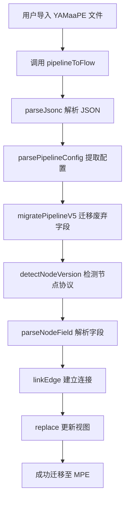
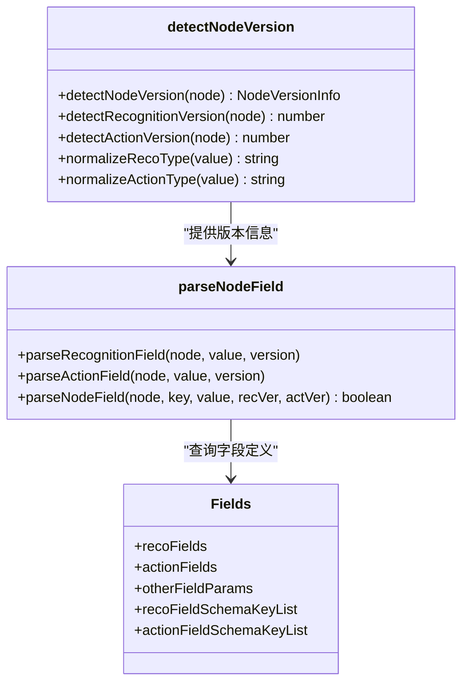
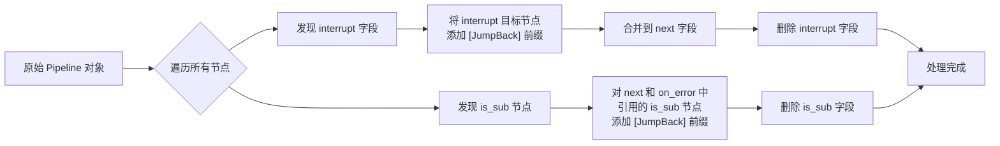
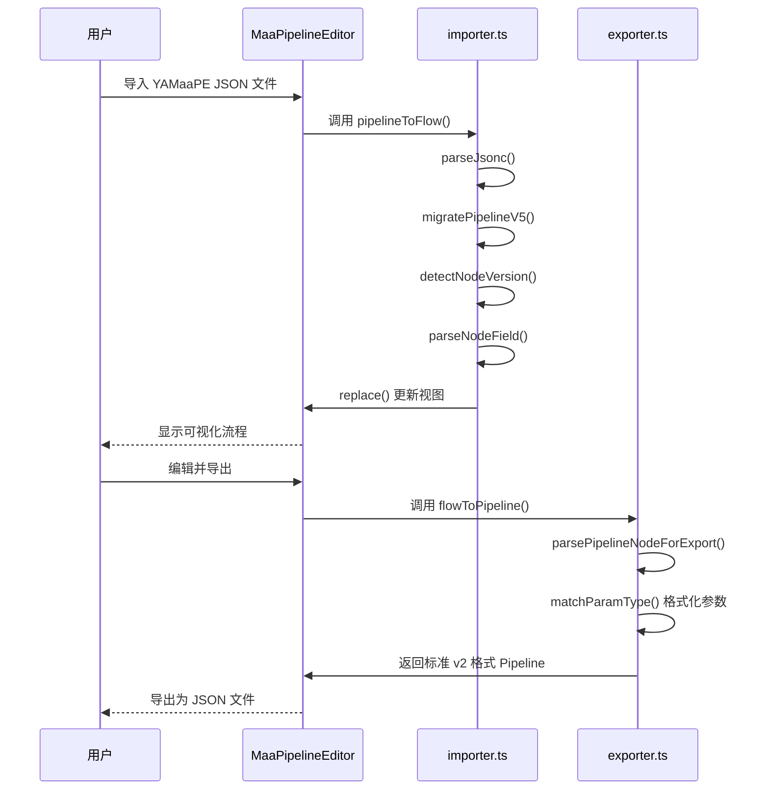

# 从 YAMaaPE 迁移

<cite>
**本文档引用文件**  
- [02.从 YAMaaPE 迁移.md](file://docsite/docs/01.指南/04.迁移/02.从 YAMaaPE 迁移.md)
- [01.导入已有文件.md](file://docsite/docs/01.指南/04.迁移/01.导入已有文件.md)
- [importer.ts](file://src/core/parser/importer.ts)
- [versionDetector.ts](file://src/core/parser/versionDetector.ts)
- [nodeParser.ts](file://src/core/parser/nodeParser.ts)
- [exporter.ts](file://src/core/parser/exporter.ts)
- [configParser.ts](file://src/core/parser/configParser.ts)
- [types.ts](file://src/core/parser/types.ts)
- [fields.ts](file://src/core/fields/index.ts)
</cite>

## 目录
1. [引言](#引言)
2. [迁移前提与兼容性说明](#迁移前提与兼容性说明)
3. [迁移步骤详解](#迁移步骤详解)
4. [核心机制解析](#核心机制解析)
5. [版本检测与字段解析](#版本检测与字段解析)
6. [废弃字段迁移处理](#废弃字段迁移处理)
7. [导入与导出流程](#导入与导出流程)
8. [最佳实践与注意事项](#最佳实践与注意事项)
9. [结论](#结论)

## 引言

MaaPipelineEditor（简称 MPE）是由其前身 YAMaaPE 重构而来的一款可视化 Pipeline 编辑器。YAMaaPE 基于 Vue3 与 VueFlow 开发，仅支持 Pipeline V1 协议，现已停止维护。MaaPipelineEditor 在继承 YAMaaPE 核心理念的基础上，进行了全面的技术升级与功能扩展，支持更先进的 v2 协议，并提供了完整的可视化编辑体验。

本指南旨在为从 YAMaaPE 迁移至 MaaPipelineEditor 的用户提供一份详尽的专项操作说明，确保迁移过程平滑、高效。

**Section sources**
- [02.从 YAMaaPE 迁移.md](file://docsite/docs/01.指南/04.迁移/02.从 YAMaaPE 迁移.md)
- [01.介绍.md](file://docsite/docs/01.指南/01.开始/01.介绍.md)

## 迁移前提与兼容性说明

MaaPipelineEditor 为了保证对旧有项目的兼容性，保留了对 YAMaaPE 特殊字段的识别与处理能力。然而，这种兼容性并非无条件的。

**关键前提**：在进行迁移之前，**必须**将 MaaFramework `v4.5.0` 版本之前的所有废弃字段手动更新为新版本的字段。MaaPipelineEditor 无法导入和解析 `v4.5.0` 之前的废弃字段。

此要求是迁移成功的基础。MaaPipelineEditor 基于 MaaFramework `v4.5.0` 及之后的协议构建，对于此版本之前的字段变更，系统不会提供自动转换。用户需要参考“导入已有文件”文档中的“导入要求”部分，完成旧字段的手动升级。

**重要提醒**：如果您的 YAMaaPE 项目文件无需进行任何修改，**则无需进行迁移**。直接使用原文件即可。强行迁移不仅没有必要，还可能引入不必要的兼容性风险。

**Section sources**
- [02.从 YAMaaPE 迁移.md](file://docsite/docs/01.指南/04.迁移/02.从 YAMaaPE 迁移.md)
- [01.导入已有文件.md](file://docsite/docs/01.指南/04.迁移/01.导入已有文件.md)

## 迁移步骤详解

从 YAMaaPE 迁移至 MaaPipelineEditor 是一个**一次性的适配操作**。成功迁移后，您即可享受 MaaPipelineEditor 提供的完整可视化编辑功能。具体步骤如下：

1.  **前置准备**：检查您的 YAMaaPE Pipeline 配置文件。如果文件中使用了 MaaFramework `v4.5.0` 之前的任何废弃字段，请参照官方文档，手动将这些字段更新为新版本的等效字段。
2.  **执行导入**：在 MaaPipelineEditor 中，使用“导入”功能，以 **v1 协议格式**将您的 YAMaaPE Pipeline 配置文件导入。
3.  **自动转换**：系统会自动检测并解析文件中的 YAMaaPE 专有配置字段，并将其转换为 MaaPipelineEditor 的标准字段。此过程包括对节点版本（v1/v2）的识别和对废弃字段的迁移处理。
4.  **后续使用**：导入并转换成功后，该 Pipeline 即成为 MaaPipelineEditor 的原生项目。此后，您可以使用 **v2 协议**对其进行正常的编辑、保存和导出操作。

**Section sources**
- [02.从 YAMaaPE 迁移.md](file://docsite/docs/01.指南/04.迁移/02.从 YAMaaPE 迁移.md)
- [importer.ts](file://src/core/parser/importer.ts)

## 核心机制解析

MaaPipelineEditor 的迁移能力依赖于其核心解析模块的协同工作。以下是实现迁移功能的关键组件及其交互流程。

**Diagram sources**
- [importer.ts](file://src/core/parser/importer.ts)
- [configParser.ts](file://src/core/parser/configParser.ts)
- [versionDetector.ts](file://src/core/parser/versionDetector.ts)
- [nodeParser.ts](file://src/core/parser/nodeParser.ts)

## 版本检测与字段解析

系统通过 `versionDetector.ts` 模块精确判断每个节点所使用的协议版本，这是实现无缝兼容的关键。

**Diagram sources**
- [versionDetector.ts](file://src/core/parser/versionDetector.ts)
- [nodeParser.ts](file://src/core/parser/nodeParser.ts)
- [fields.ts](file://src/core/fields/index.ts)

## 废弃字段迁移处理

对于 MaaFramework v5.1 版本中废弃的字段（如 `interrupt` 和 `is_sub`），MaaPipelineEditor 在导入时会自动执行迁移逻辑。

**Diagram sources**
- [importer.ts](file://src/core/parser/importer.ts#L31-L118)

## 导入与导出流程

MaaPipelineEditor 的导入和导出功能由 `importer.ts` 和 `exporter.ts` 两个核心模块分别处理，确保了数据的双向兼容。

**Diagram sources**
- [importer.ts](file://src/core/parser/importer.ts)
- [exporter.ts](file://src/core/parser/exporter.ts)

## 最佳实践与注意事项

- **评估必要性**：在开始迁移前，请务必评估迁移的必要性。如果您的旧文件无需修改，直接使用原文件是最佳选择。
- **遵循协议**：确保在导入前已完成所有废弃字段的更新，这是迁移成功的硬性要求。
- **理解一次性**：迁移操作是一次性的。成功导入后，项目即成为 MPE 的原生项目，后续应使用 MPE 的编辑功能进行维护。
- **利用扩展字段**：对于 v2 协议不支持的特殊字段，MaaPipelineEditor 提供了 `extras` 扩展字段功能，允许您以 JSON 格式进行配置，这些字段在导出时会被编译为节点的根字段。
- **备份原文件**：在执行任何迁移操作前，请务必备份您的原始 YAMaaPE 文件，以防万一。

**Section sources**
- [02.从 YAMaaPE 迁移.md](file://docsite/docs/01.指南/04.迁移/02.从 YAMaaPE 迁移.md)
- [01.导入已有文件.md](file://docsite/docs/01.指南/04.迁移/01.导入已有文件.md)
- [字段面板.md](file://docsite/docs/01.指南/02.核心概念/30.字段面板.md)

## 结论

从 YAMaaPE 迁移至 MaaPipelineEditor 是一个清晰、可控的过程。通过遵循本文档所述的步骤——即先手动更新废弃字段，再以 v1 协议导入——您可以顺利地将旧项目带入 MaaPipelineEditor 的现代化、可视化编辑环境中。迁移成功后，您将能够充分利用 v2 协议的强大功能和 MaaPipelineEditor 的丰富特性，提升开发效率。请始终牢记“若无必要，勿增迁移”的原则，避免对无需修改的项目进行不必要的操作。