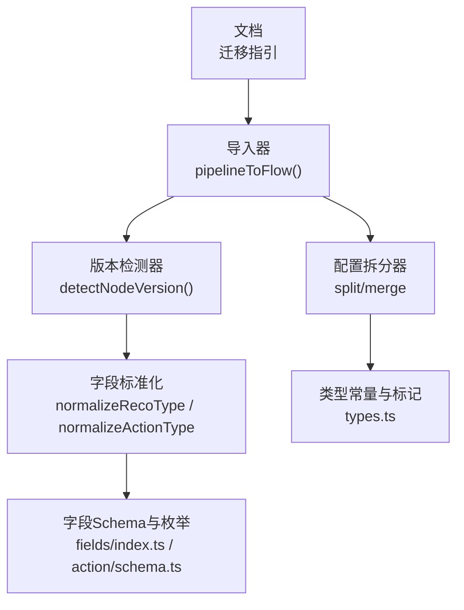
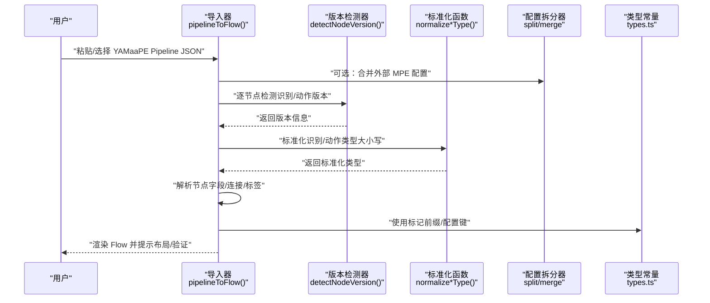
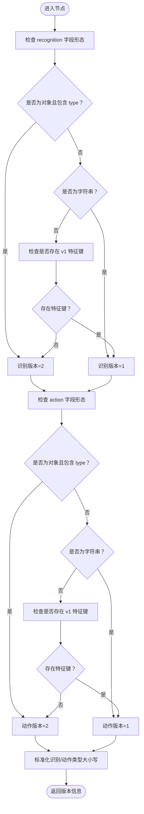
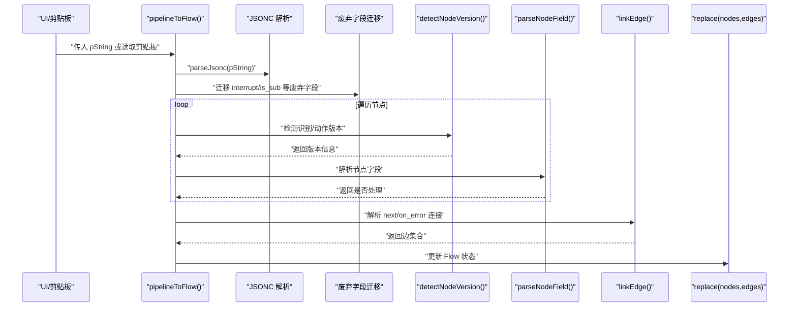
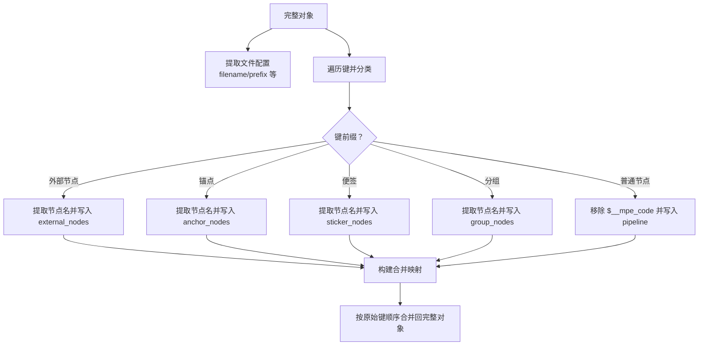
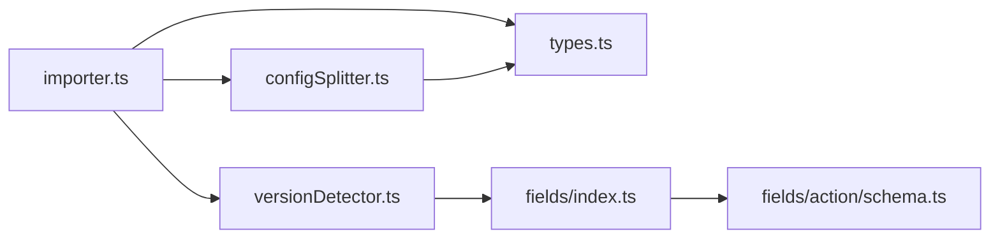

# 从YAMaaPE迁移

<cite>
**本文引用的文件**
- [从 YAMaaPE 迁移.md](file://docsite/docs/01.指南/90.迁移/02.从 YAMaaPE 迁移.md)
- [versionDetector.ts](file://src/core/parser/versionDetector.ts)
- [importer.ts](file://src/core/parser/importer.ts)
- [configSplitter.ts](file://src/core/parser/configSplitter.ts)
- [types.ts](file://src/core/parser/types.ts)
- [index.ts](file://src/core/fields/index.ts)
- [schema.ts](file://src/core/fields/action/schema.ts)
</cite>

## 目录
1. [简介](#简介)
2. [项目结构](#项目结构)
3. [核心组件](#核心组件)
4. [架构总览](#架构总览)
5. [详细组件分析](#详细组件分析)
6. [依赖分析](#依赖分析)
7. [性能考虑](#性能考虑)
8. [故障排查指南](#故障排查指南)
9. [结论](#结论)
10. [附录](#附录)

## 简介
本指南面向从 YAMaaPE 到 MaaPipelineEditor（MPE）的迁移场景，聚焦于以下关键目标：
- 深入理解 YAMaaPE 的结构特点与数据格式
- 对比 MPE 的结构与字段体系，明确差异点
- 解释自动版本检测机制：识别算法版本（v1/v2）与动作类型版本的识别流程
- 阐述字段标准化过程：识别类型与动作类型的大小写处理、废弃字段的映射与转换
- 解释配置拆分器的工作原理：如何将复杂 YAMaaPE 配置转换为 MPE 的结构化格式
- 提供完整的迁移步骤：备份准备、导入流程、字段映射、验证测试
- 给出常见迁移问题的解决方案与最佳实践建议

## 项目结构
本次迁移涉及的核心代码位于前端解析与导入模块，主要分布在以下路径：
- 文档与迁移指引：docsite/docs/01.指南/90.迁移/02.从 YAMaaPE 迁移.md
- 解析与导入：src/core/parser
- 字段定义与标准化：src/core/fields

图表来源
- [从 YAMaaPE 迁移.md:1-17](file://docsite/docs/01.指南/90.迁移/02.从 YAMaaPE 迁移.md#L1-L17)
- [importer.ts:155-507](file://src/core/parser/importer.ts#L155-L507)
- [versionDetector.ts:23-149](file://src/core/parser/versionDetector.ts#L23-L149)
- [configSplitter.ts:21-486](file://src/core/parser/configSplitter.ts#L21-L486)
- [types.ts:15-22](file://src/core/parser/types.ts#L15-L22)
- [index.ts:1-45](file://src/core/fields/index.ts#L1-L45)
- [schema.ts:1-299](file://src/core/fields/action/schema.ts#L1-L299)

章节来源
- [从 YAMaaPE 迁移.md:1-17](file://docsite/docs/01.指南/90.迁移/02.从 YAMaaPE 迁移.md#L1-L17)

## 核心组件
- 版本检测器：自动识别节点的识别算法版本（v1/v2）与动作类型版本（v1/v2），并提供类型标准化函数
- 导入器：负责将 YAMaaPE/Pipeline JSON 导入为 MPE 的 Flow 图，处理废弃字段迁移、节点解析、连接解析与布局
- 配置拆分器：支持“分离存储模式”，将包含配置的完整对象拆分为纯 Pipeline 与 MPE 配置，或按原键序合并回完整对象
- 字段定义与标准化：提供识别/动作字段的 Schema、键列表与大写值映射，统一大小写并校验类型合法性

章节来源
- [versionDetector.ts:23-149](file://src/core/parser/versionDetector.ts#L23-L149)
- [importer.ts:155-507](file://src/core/parser/importer.ts#L155-L507)
- [configSplitter.ts:21-486](file://src/core/parser/configSplitter.ts#L21-L486)
- [index.ts:1-45](file://src/core/fields/index.ts#L1-L45)

## 架构总览
下图展示了从 YAMaaPE 到 MPE 的迁移与导入流程，涵盖版本检测、字段标准化、配置拆分/合并与节点解析。

图表来源
- [importer.ts:155-507](file://src/core/parser/importer.ts#L155-L507)
- [versionDetector.ts:23-149](file://src/core/parser/versionDetector.ts#L23-L149)
- [configSplitter.ts:21-486](file://src/core/parser/configSplitter.ts#L21-L486)
- [types.ts:15-22](file://src/core/parser/types.ts#L15-L22)

## 详细组件分析

### 版本检测与字段标准化
- 识别/动作版本检测：根据节点是否存在对象型的 recognition/action 字段、是否存在 v1 特征键等规则，判定 v1 或 v2
- 类型标准化：对识别类型与动作类型执行大小写归一化，若不在预定义集合则抛错，确保类型一致性
- 字段键与枚举：通过字段定义生成参数键列表与大写值映射，用于检测与标准化

图表来源
- [versionDetector.ts:23-110](file://src/core/parser/versionDetector.ts#L23-L110)
- [index.ts:41-45](file://src/core/fields/index.ts#L41-L45)
- [schema.ts:1-299](file://src/core/fields/action/schema.ts#L1-L299)

章节来源
- [versionDetector.ts:23-149](file://src/core/parser/versionDetector.ts#L23-L149)
- [index.ts:1-45](file://src/core/fields/index.ts#L1-L45)
- [schema.ts:1-299](file://src/core/fields/action/schema.ts#L1-L299)

### 导入流程与废弃字段迁移
- 导入入口：pipelineToFlow 接收 Pipeline 字符串或外部 MPE 配置，解析 JSON（支持 JSONC）
- 外部配置合并：当提供 MPE 配置时，按原始键顺序合并，确保节点顺序与位置信息保留
- 废弃字段迁移：针对 v5.1 的 interrupt/is_sub 等字段进行迁移与兼容处理，统一到 next/jump_back 等新语义
- 节点解析：识别普通节点、外部节点、锚点、便签、分组节点；解析位置、端点方向、连接等
- 连接解析：解析 next/on_error，建立 Flow 边
- 布局与历史：根据是否包含位置信息决定是否自动布局；初始化编辑历史

图表来源
- [importer.ts:155-507](file://src/core/parser/importer.ts#L155-L507)
- [versionDetector.ts:23-110](file://src/core/parser/versionDetector.ts#L23-L110)

章节来源
- [importer.ts:155-507](file://src/core/parser/importer.ts#L155-L507)

### 配置拆分器与分离存储模式
- 拆分：将包含配置的完整对象拆分为纯 Pipeline 与 MPE 配置（文件名、节点位置、锚点/外部/便签/分组等）
- 合并：按原始键顺序将配置与 Pipeline 合并回完整对象，支持外部配置文件与内部标记键
- 标记与前缀：使用 $__mpe_code、$__mpe_config_、$__mpe_external_、$__mpe_anchor_、$__mpe_sticker_、$__mpe_group_ 等标记与前缀
- 文件名推导：提供配置文件名与 Pipeline 文件名之间的相互推导

图表来源
- [configSplitter.ts:21-486](file://src/core/parser/configSplitter.ts#L21-L486)
- [types.ts:15-22](file://src/core/parser/types.ts#L15-L22)

章节来源
- [configSplitter.ts:21-486](file://src/core/parser/configSplitter.ts#L21-L486)
- [types.ts:15-22](file://src/core/parser/types.ts#L15-L22)

### 字段面板与类型定义（参考）
- 字段面板：MPE 提供识别/动作/其他字段的可视化面板，配合字段工厂与 Schema 定义
- 类型枚举与键列表：通过 generateParamKeys/generateUpperValues 生成参数键与大写值映射，用于标准化与校验

章节来源
- [index.ts:1-45](file://src/core/fields/index.ts#L1-L45)
- [schema.ts:1-299](file://src/core/fields/action/schema.ts#L1-L299)

## 依赖分析
- 导入器依赖版本检测器与配置拆分器，以及类型常量与标记前缀
- 版本检测器依赖字段定义（参数键列表与大写值映射）
- 配置拆分器依赖类型常量与标记前缀，用于键识别与合并

图表来源
- [importer.ts:1-508](file://src/core/parser/importer.ts#L1-L508)
- [versionDetector.ts:1-149](file://src/core/parser/versionDetector.ts#L1-L149)
- [configSplitter.ts:1-486](file://src/core/parser/configSplitter.ts#L1-L486)
- [types.ts:1-107](file://src/core/parser/types.ts#L1-L107)
- [index.ts:1-45](file://src/core/fields/index.ts#L1-L45)
- [schema.ts:1-299](file://src/core/fields/action/schema.ts#L1-L299)

章节来源
- [importer.ts:1-508](file://src/core/parser/importer.ts#L1-L508)
- [versionDetector.ts:1-149](file://src/core/parser/versionDetector.ts#L1-L149)
- [configSplitter.ts:1-486](file://src/core/parser/configSplitter.ts#L1-L486)
- [types.ts:1-107](file://src/core/parser/types.ts#L1-L107)
- [index.ts:1-45](file://src/core/fields/index.ts#L1-L45)
- [schema.ts:1-299](file://src/core/fields/action/schema.ts#L1-L299)

## 性能考虑
- 导入阶段采用 JSONC 解析与键顺序遍历，避免不必要的对象深拷贝
- 版本检测与字段标准化为 O(k)（k 为节点字段数），整体复杂度受节点数量与字段数量线性影响
- 配置拆分/合并按键顺序进行，尽量减少二次扫描
- 建议在大规模 Pipeline 导入前清理冗余字段与注释，以降低解析负担

## 故障排查指南
- 导入失败弹窗：当解析异常或格式不正确时，导入器会弹出错误提示并记录控制台错误
- 版本不一致：若识别/动作字段仍使用 v1 形态（字符串），但混入 v2 特征键，可能导致版本误判
- 类型错误：标准化函数对未知类型抛错，需检查识别/动作类型是否在预定义集合中
- 位置信息缺失：若节点未包含位置信息，导入后将自动布局；如需固定布局，请使用分离存储模式并提供位置配置
- 废弃字段遗留：确保在导入前完成 interrupt/is_sub 等废弃字段的迁移

章节来源
- [importer.ts:498-507](file://src/core/parser/importer.ts#L498-L507)
- [versionDetector.ts:118-149](file://src/core/parser/versionDetector.ts#L118-L149)

## 结论
通过版本检测与字段标准化，MPE 能够自动适配 YAMaaPE 的配置风格；借助配置拆分器与导入器，可将复杂配置转换为结构化的 Flow 图。遵循本文提供的迁移步骤与最佳实践，可高效完成从 YAMaaPE 到 MPE 的迁移与验证。

## 附录

### 迁移步骤清单
- 准备阶段
  - 备份现有 YAMaaPE Pipeline 文件与关联资源
  - 检查并手动调整 MaaFramework 4.5 前的字段至 4.5+ 语义（如需）
- 导入阶段
  - 使用 v1 协议将 Pipeline 导入 MPE，系统会自动解析 YAMaaPE 相关配置字段并适配为新字段
  - 如需保留节点位置与样式，建议使用分离存储模式并导出/导入 MPE 配置
- 字段映射与验证
  - 核对识别/动作类型大小写是否符合标准化要求
  - 验证 next/on_error 连接是否正确，必要时手动修正
  - 检查废弃字段是否已迁移（如 interrupt/is_sub）
- 测试与发布
  - 在 MPE 中进行流程级调试，确认识别命中与动作执行
  - 导出最终版本并进行回归测试

章节来源
- [从 YAMaaPE 迁移.md:1-17](file://docsite/docs/01.指南/90.迁移/02.从 YAMaaPE 迁移.md#L1-L17)