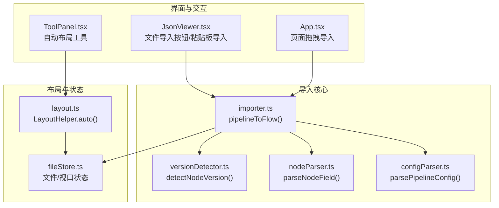
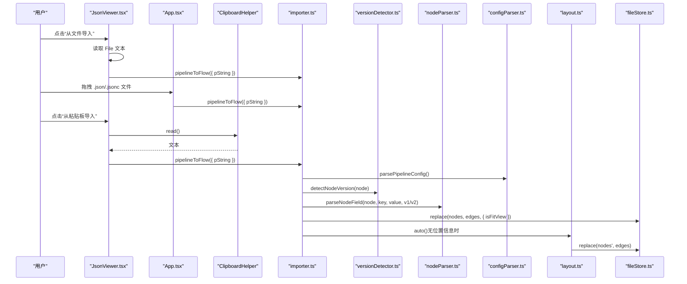
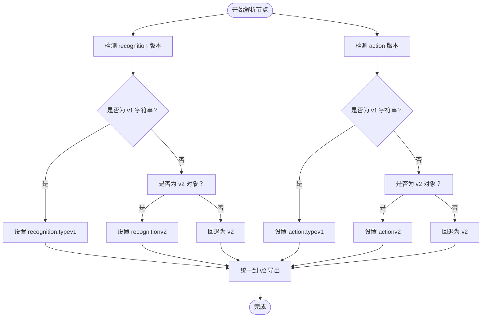
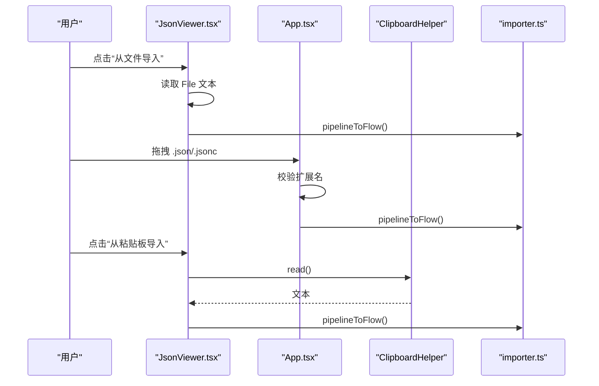
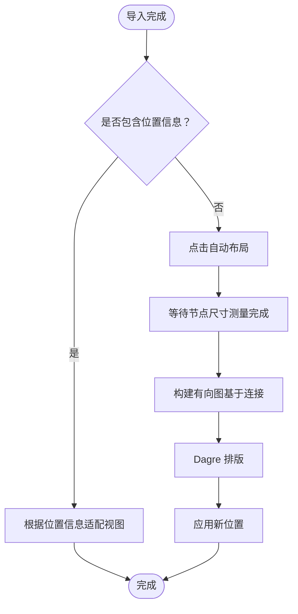
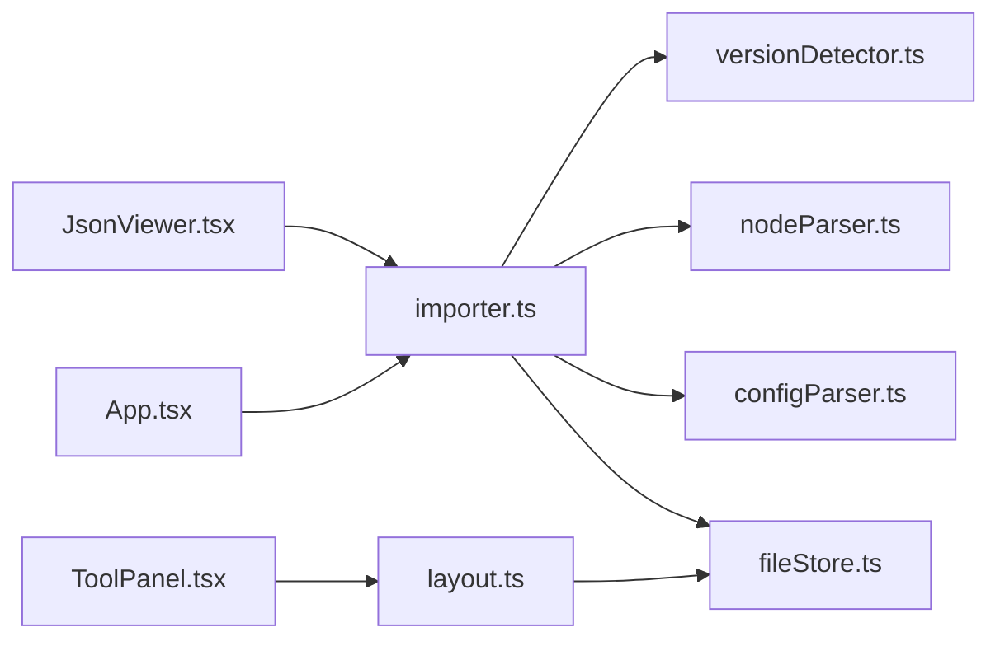

# 导入已有文件

<cite>
**本文引用的文件**
- [导入已有文件.md](file://docsite/docs/01.指南/04.迁移/01.导入已有文件.md)
- [App.tsx](file://src/App.tsx)
- [JsonViewer.tsx](file://src/components/panels/JsonViewer.tsx)
- [importer.ts](file://src/core/parser/importer.ts)
- [versionDetector.ts](file://src/core/parser/versionDetector.ts)
- [nodeParser.ts](file://src/core/parser/nodeParser.ts)
- [configParser.ts](file://src/core/parser/configParser.ts)
- [layout.ts](file://src/core/layout.ts)
- [ToolPanel.tsx](file://src/components/panels/ToolPanel.tsx)
- [clipboard.ts](file://src/utils/clipboard.ts)
- [fileStore.ts](file://src/stores/fileStore.ts)
</cite>

## 目录
1. [简介](#简介)
2. [项目结构](#项目结构)
3. [核心组件](#核心组件)
4. [架构总览](#架构总览)
5. [详细组件分析](#详细组件分析)
6. [依赖分析](#依赖分析)
7. [性能考虑](#性能考虑)
8. [故障排查指南](#故障排查指南)
9. [结论](#结论)
10. [附录](#附录)

## 简介
本篇文档围绕“导入已有文件”能力展开，系统说明：
- 支持的文件格式与结构要求（.json 与 .jsonc）
- MaaPipelineEditor 对 v1 与 v2 版本 Pipeline 协议的自动检测与统一转换机制
- 导入过程中对废弃字段（MaaFramework v4.5.0 之前）的处理策略
- 深层自定义字段（如 action.param 内的自定义参数）无法保留的限制及替代方案
- 三种导入方式：从剪贴板粘贴 JSON 内容、通过按钮选择文件、拖拽文件到页面，以及它们的等效性
- 导入后节点布局缺失问题、自动布局触发条件与基于连接关系的排布逻辑，以及局限性
- 非可视化编辑与可视化编辑在流程组织思路上的根本差异，以及推荐从头创建新流程的原因

## 项目结构
与“导入已有文件”直接相关的前端模块分布如下：
- 文档与引导：docsite/docs/01.指南/04.迁移/01.导入已有文件.md
- 导入入口与 UI：src/App.tsx、src/components/panels/JsonViewer.tsx
- 导入核心逻辑：src/core/parser/importer.ts
- 协议版本检测：src/core/parser/versionDetector.ts
- 节点字段解析：src/core/parser/nodeParser.ts
- 配置解析与标记识别：src/core/parser/configParser.ts
- 自动布局：src/core/layout.ts
- 工具栏与自动布局触发：src/components/panels/ToolPanel.tsx
- 剪贴板工具：src/utils/clipboard.ts
- 文件与视口状态：src/stores/fileStore.ts

图表来源
- [JsonViewer.tsx](file://src/components/panels/JsonViewer.tsx#L43-L162)
- [ToolPanel.tsx](file://src/components/panels/ToolPanel.tsx#L190-L313)
- [App.tsx](file://src/App.tsx#L90-L138)
- [importer.ts](file://src/core/parser/importer.ts#L125-L295)
- [versionDetector.ts](file://src/core/parser/versionDetector.ts#L1-L149)
- [nodeParser.ts](file://src/core/parser/nodeParser.ts#L146-L200)
- [configParser.ts](file://src/core/parser/configParser.ts#L42-L69)
- [layout.ts](file://src/core/layout.ts#L1-L103)
- [fileStore.ts](file://src/stores/fileStore.ts#L1-L255)

章节来源
- [导入已有文件.md](file://docsite/docs/01.指南/04.迁移/01.导入已有文件.md#L1-L174)
- [App.tsx](file://src/App.tsx#L90-L138)
- [JsonViewer.tsx](file://src/components/panels/JsonViewer.tsx#L43-L162)
- [importer.ts](file://src/core/parser/importer.ts#L125-L295)

## 核心组件
- 导入入口与 UI
  - 从文件导入：JsonViewer.tsx 提供“从文件导入”按钮，读取 File 并调用 pipelineToFlow
  - 从剪贴板导入：JsonViewer.tsx 提供“从粘贴板导入”按钮，读取剪贴板文本并调用 pipelineToFlow
  - 拖拽导入：App.tsx 监听页面 drop 事件，校验 .json/.jsonc 后调用 pipelineToFlow
- 导入核心
  - pipelineToFlow：解析 Pipeline、迁移废弃字段、解析节点与连接、更新 Flow 状态、初始化历史、自动布局
  - detectNodeVersion：检测节点的 recognition/action 版本（v1/v2）
  - parseNodeField：按版本解析识别/动作字段，未识别字段归入 extras
  - parsePipelineConfig：解析配置标记（兼容旧版本），提取 filename/prefix 等
- 自动布局
  - LayoutHelper.auto：基于连接关系使用 Dagre 进行全局自动布局
- 工具栏
  - ToolPanel.tsx 提供“自动布局”工具，仅在未选中节点时可用

章节来源
- [JsonViewer.tsx](file://src/components/panels/JsonViewer.tsx#L43-L162)
- [App.tsx](file://src/App.tsx#L90-L138)
- [importer.ts](file://src/core/parser/importer.ts#L125-L295)
- [versionDetector.ts](file://src/core/parser/versionDetector.ts#L1-L149)
- [nodeParser.ts](file://src/core/parser/nodeParser.ts#L146-L200)
- [configParser.ts](file://src/core/parser/configParser.ts#L42-L69)
- [layout.ts](file://src/core/layout.ts#L1-L103)
- [ToolPanel.tsx](file://src/components/panels/ToolPanel.tsx#L190-L313)

## 架构总览
导入流程的关键步骤与数据流如下：

图表来源
- [JsonViewer.tsx](file://src/components/panels/JsonViewer.tsx#L43-L162)
- [App.tsx](file://src/App.tsx#L90-L138)
- [clipboard.ts](file://src/utils/clipboard.ts#L25-L44)
- [importer.ts](file://src/core/parser/importer.ts#L125-L295)
- [versionDetector.ts](file://src/core/parser/versionDetector.ts#L1-L149)
- [nodeParser.ts](file://src/core/parser/nodeParser.ts#L146-L200)
- [configParser.ts](file://src/core/parser/configParser.ts#L42-L69)
- [layout.ts](file://src/core/layout.ts#L1-L103)
- [fileStore.ts](file://src/stores/fileStore.ts#L1-L255)

## 详细组件分析

### 支持的文件格式与结构要求
- 文件格式
  - 支持 .json 与 .jsonc（注释会被 jsonc-parser 解析）
- 结构要求
  - MPE 将“单个 .json/.jsonc 文件”视为“一个文件”，文件顶层应为一个对象，键为节点名，值为节点配置
  - 若存在配置标记键（如 $__mpe_config_* 或 __mpe_config_* 或 __yamaape_config_*），将被识别为配置区域
  - 顶层可包含标记字段（如 configMark 或 __mpe_code 或 __yamaape），用于携带位置信息或兼容配置

章节来源
- [导入已有文件.md](file://docsite/docs/01.指南/04.迁移/01.导入已有文件.md#L130-L174)
- [configParser.ts](file://src/core/parser/configParser.ts#L42-L69)

### 协议版本检测与统一转换
- 自动检测
  - 对每个节点分别检测 recognition/action 的版本：v1（字符串）或 v2（对象含 type）
- 统一转换
  - 导入后所有节点统一以 v2 格式导出
- 类型标准化
  - 识别/动作类型会进行大小写标准化与合法性校验，异常类型会抛错

图表来源
- [versionDetector.ts](file://src/core/parser/versionDetector.ts#L1-L149)
- [nodeParser.ts](file://src/core/parser/nodeParser.ts#L146-L200)

章节来源
- [导入已有文件.md](file://docsite/docs/01.指南/04.迁移/01.导入已有文件.md#L20-L40)
- [versionDetector.ts](file://src/core/parser/versionDetector.ts#L1-L149)
- [nodeParser.ts](file://src/core/parser/nodeParser.ts#L146-L200)

### 废弃字段处理策略
- MPE 基于 MaaFramework v4.5.0 协议构建，导入前旧字段（v4.5.0 之前）无法导入
- 迁移机制
  - 对 interrupt 字段进行迁移：将其合并到 next，并为子节点引用添加 JumpBack 前缀
  - 移除 is_sub 字段，确保引用一致性
- 建议
  - 导入前将旧字段调整为新字段，以保证兼容性

章节来源
- [importer.ts](file://src/core/parser/importer.ts#L28-L119)
- [导入已有文件.md](file://docsite/docs/01.指南/04.迁移/01.导入已有文件.md#L28-L40)

### 深层自定义字段保留限制与替代方案
- 限制
  - MPE 仅对节点根级字段生效的自定义字段保留到 extras；无法保留 action.param 内的深层自定义参数
- 替代方案
  - 使用根级 extras 字段承载少量说明
  - 更推荐使用独立说明节点放置在旁边，使其更显眼且便于维护

章节来源
- [导入已有文件.md](file://docsite/docs/01.指南/04.迁移/01.导入已有文件.md#L36-L83)
- [nodeParser.ts](file://src/core/parser/nodeParser.ts#L146-L200)

### 三种导入方式与等效性
- 从剪贴板导入
  - 复制 Pipeline 代码到剪贴板，点击“从粘贴板导入”按钮，内部读取剪贴板文本并调用 pipelineToFlow
- 从文件导入
  - 点击“从文件导入”按钮，选择 .json/.jsonc 文件，读取文本后调用 pipelineToFlow
- 拖拽导入
  - 将 .json/.jsonc 文件拖拽到页面任意位置，校验扩展名后读取文本并调用 pipelineToFlow
- 等效性
  - 三者最终均调用 pipelineToFlow，行为一致

图表来源
- [JsonViewer.tsx](file://src/components/panels/JsonViewer.tsx#L43-L162)
- [App.tsx](file://src/App.tsx#L90-L138)
- [clipboard.ts](file://src/utils/clipboard.ts#L25-L44)
- [importer.ts](file://src/core/parser/importer.ts#L125-L295)

章节来源
- [导入已有文件.md](file://docsite/docs/01.指南/04.迁移/01.导入已有文件.md#L131-L151)
- [JsonViewer.tsx](file://src/components/panels/JsonViewer.tsx#L43-L162)
- [App.tsx](file://src/App.tsx#L90-L138)
- [clipboard.ts](file://src/utils/clipboard.ts#L25-L44)

### 导入后节点布局缺失与自动布局
- 问题背景
  - 非 MPE 导出的文件通常不包含布局配置；初次导入时节点会渲染在视口中心
- 触发条件
  - 未选中任何节点时，点击右下角“自动布局”工具
- 排布逻辑
  - 基于连接关系（next/on_error）使用 Dagre 进行全局自动布局
- 局限性
  - 自动布局仅“理顺”连接关系，无法还原原始业务意图；复杂分支/合并、外部连接多时可能不够美观
- 建议
  - 导入后仍需手动优化布局，以获得更清晰的可读性与维护性

图表来源
- [importer.ts](file://src/core/parser/importer.ts#L269-L284)
- [layout.ts](file://src/core/layout.ts#L1-L103)
- [ToolPanel.tsx](file://src/components/panels/ToolPanel.tsx#L244-L251)

章节来源
- [导入已有文件.md](file://docsite/docs/01.指南/04.迁移/01.导入已有文件.md#L153-L174)
- [importer.ts](file://src/core/parser/importer.ts#L269-L284)
- [layout.ts](file://src/core/layout.ts#L1-L103)
- [ToolPanel.tsx](file://src/components/panels/ToolPanel.tsx#L244-L251)

### 非可视化编辑与可视化编辑的思路差异
- 思路差异
  - 非可视化编辑侧重“文本结构”与“next/jump_back/on_error”的线性/分支表达
  - 可视化编辑强调“节点间连接关系”的直观呈现与布局优化
- 影响
  - 自动布局无法完全还原业务意图，建议优先在 MPE 内从头创建新流程，以获得最佳可读性与维护性

章节来源
- [导入已有文件.md](file://docsite/docs/01.指南/04.迁移/01.导入已有文件.md#L153-L174)

## 依赖分析
- 组件耦合
  - JsonViewer.tsx 与 App.tsx 分别提供导入入口，共同依赖 importer.ts
  - importer.ts 依赖 versionDetector.ts、nodeParser.ts、configParser.ts、layout.ts、fileStore.ts
  - ToolPanel.tsx 依赖 layout.ts 与 fileStore.ts，提供自动布局触发
- 外部依赖
  - jsonc-parser 用于解析 .jsonc
  - @dagrejs/dagre 用于自动布局
  - antd 用于消息提示与 UI 组件

图表来源
- [JsonViewer.tsx](file://src/components/panels/JsonViewer.tsx#L43-L162)
- [App.tsx](file://src/App.tsx#L90-L138)
- [ToolPanel.tsx](file://src/components/panels/ToolPanel.tsx#L190-L313)
- [importer.ts](file://src/core/parser/importer.ts#L125-L295)
- [versionDetector.ts](file://src/core/parser/versionDetector.ts#L1-L149)
- [nodeParser.ts](file://src/core/parser/nodeParser.ts#L146-L200)
- [configParser.ts](file://src/core/parser/configParser.ts#L42-L69)
- [layout.ts](file://src/core/layout.ts#L1-L103)
- [fileStore.ts](file://src/stores/fileStore.ts#L1-L255)

章节来源
- [importer.ts](file://src/core/parser/importer.ts#L125-L295)
- [layout.ts](file://src/core/layout.ts#L1-L103)

## 性能考虑
- 自动布局
  - 布局计算在下一帧执行，等待节点尺寸测量完成后进行；复杂网络可能需要多次尝试
- 导入性能
  - 大型 Pipeline 导入时，解析与连接建立可能耗时较长；建议在导入后及时保存并进行必要的手动优化

[本节为通用性能建议，不直接分析具体文件]

## 故障排查指南
- 常见错误
  - 导入失败：检查文件格式是否为 .json 或 .jsonc，以及 Pipeline 结构是否符合顶层对象规范
  - 类型错误：识别/动作类型大小写不一致或不在预定义列表中，将触发类型校验错误
  - 旧字段不兼容：v4.5.0 之前的废弃字段需迁移为新字段
- 定位方法
  - 查看控制台错误信息
  - 确认配置标记键与标记字段是否存在且格式正确
  - 检查节点字段是否属于协议支持范围，深层自定义参数将被丢弃

章节来源
- [importer.ts](file://src/core/parser/importer.ts#L285-L294)
- [versionDetector.ts](file://src/core/parser/versionDetector.ts#L118-L149)
- [configParser.ts](file://src/core/parser/configParser.ts#L42-L69)
- [导入已有文件.md](file://docsite/docs/01.指南/04.迁移/01.导入已有文件.md#L28-L40)

## 结论
- MPE 支持 .json 与 .jsonc 的导入，并具备强大的协议版本检测与统一转换能力
- 导入流程中对废弃字段进行迁移，深层自定义字段无法保留，建议使用根级 extras 或独立说明节点
- 三种导入方式等效，可根据场景选择最便捷的方式
- 导入后节点布局缺失属预期行为，自动布局仅提供全局排布参考，复杂流程建议手动优化
- 尽管支持导入，仍推荐在 MPE 内从头创建新流程，以获得最佳可读性与维护性

[本节为总结性内容，不直接分析具体文件]

## 附录
- 示例链接
  - 示例 Pipeline（非可视化编辑 vs 可视化编辑）参见文档中的示例链接与截图
- 相关文件路径
  - 导入入口与 UI：JsonViewer.tsx、App.tsx
  - 导入核心：importer.ts、versionDetector.ts、nodeParser.ts、configParser.ts
  - 自动布局：layout.ts、ToolPanel.tsx
  - 剪贴板工具：clipboard.ts
  - 文件与视口状态：fileStore.ts

[本节为补充信息，不直接分析具体文件]