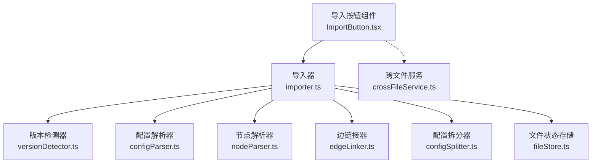
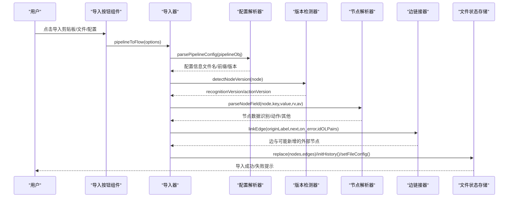
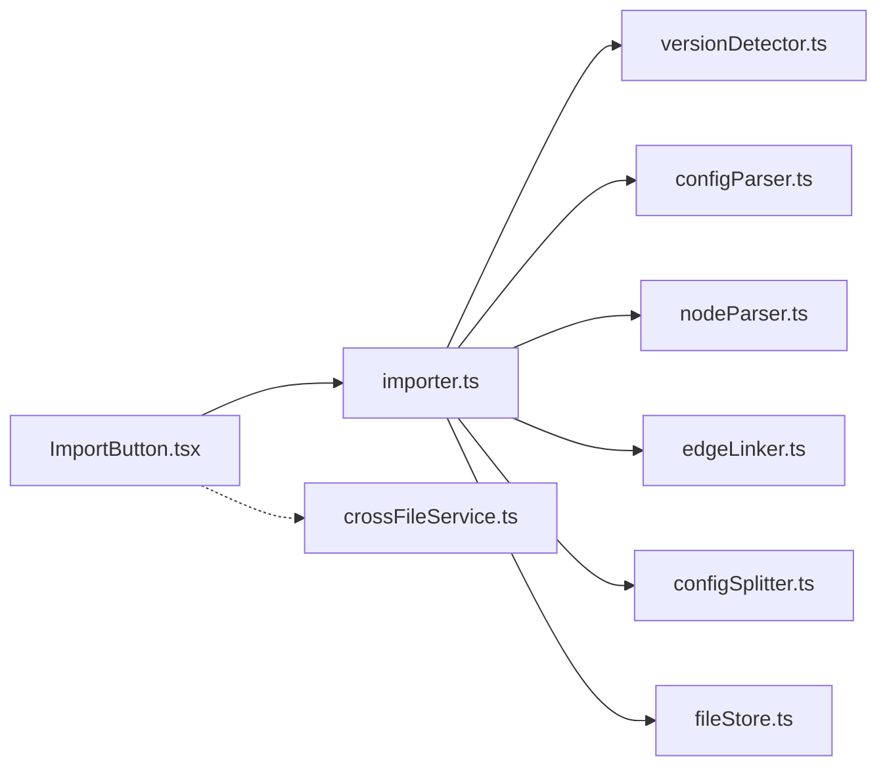

# 导入已有文件

<cite>
**本文引用的文件**
- [src/components/panels/toolbar/ImportButton.tsx](file://src/components/panels/toolbar/ImportButton.tsx)
- [src/core/parser/importer.ts](file://src/core/parser/importer.ts)
- [src/core/parser/versionDetector.ts](file://src/core/parser/versionDetector.ts)
- [src/core/parser/configParser.ts](file://src/core/parser/configParser.ts)
- [src/core/parser/configSplitter.ts](file://src/core/parser/configSplitter.ts)
- [src/core/parser/nodeParser.ts](file://src/core/parser/nodeParser.ts)
- [src/core/parser/edgeLinker.ts](file://src/core/parser/edgeLinker.ts)
- [src/stores/fileStore.ts](file://src/stores/fileStore.ts)
- [src/stores/crossFileService.ts](file://src/stores/crossFileService.ts)
</cite>

## 目录
1. [简介](#简介)
2. [项目结构](#项目结构)
3. [核心组件](#核心组件)
4. [架构总览](#架构总览)
5. [详细组件分析](#详细组件分析)
6. [依赖分析](#依赖分析)
7. [性能考虑](#性能考虑)
8. [故障排除指南](#故障排除指南)
9. [结论](#结论)
10. [附录](#附录)

## 简介
本指南面向希望将“已有文件”导入到 MaaPipelineEditor 的用户与开发者，系统讲解导入系统的整体架构与工作流程，涵盖文件格式识别、版本检测、数据解析、配置拆分与合并、错误处理与恢复机制，并提供导入前准备、导入后验证与常见问题排查的实操建议。

## 项目结构
导入能力由前端 UI 控件触发，经解析器模块完成格式识别、版本检测、数据转换与验证，再写入可视化画布与文件状态管理。关键路径如下：
- 前端入口：工具栏导入按钮组件
- 核心解析：导入器、版本检测器、配置解析器、节点解析器、边链接器、配置拆分器
- 状态与持久化：文件状态存储、跨文件服务

```mermaid
graph TB
UI["导入按钮组件<br/>ImportButton.tsx"] --> IMP["导入器<br/>importer.ts"]
IMP --> VD["版本检测器<br/>versionDetector.ts"]
IMP --> CP["配置解析器<br/>configParser.ts"]
IMP --> NP["节点解析器<br/>nodeParser.ts"]
IMP --> EL["边链接器<br/>edgeLinker.ts"]
IMP --> CS["配置拆分器<br/>configSplitter.ts"]
IMP --> FS["文件状态存储<br/>fileStore.ts"]
UI -.-> CF["跨文件服务<br/>crossFileService.ts"]
```

图表来源
- [src/components/panels/toolbar/ImportButton.tsx:1-235](file://src/components/panels/toolbar/ImportButton.tsx#L1-L235)
- [src/core/parser/importer.ts:155-507](file://src/core/parser/importer.ts#L155-L507)
- [src/core/parser/versionDetector.ts:23-149](file://src/core/parser/versionDetector.ts#L23-L149)
- [src/core/parser/configParser.ts:47-69](file://src/core/parser/configParser.ts#L47-L69)
- [src/core/parser/nodeParser.ts:322-372](file://src/core/parser/nodeParser.ts#L322-L372)
- [src/core/parser/edgeLinker.ts:91-162](file://src/core/parser/edgeLinker.ts#L91-L162)
- [src/core/parser/configSplitter.ts:21-118](file://src/core/parser/configSplitter.ts#L21-L118)
- [src/stores/fileStore.ts:527-778](file://src/stores/fileStore.ts#L527-L778)
- [src/stores/crossFileService.ts:115-148](file://src/stores/crossFileService.ts#L115-L148)

章节来源
- [src/components/panels/toolbar/ImportButton.tsx:1-235](file://src/components/panels/toolbar/ImportButton.tsx#L1-L235)
- [src/core/parser/importer.ts:155-507](file://src/core/parser/importer.ts#L155-L507)

## 核心组件
- 导入按钮组件：提供从剪贴板、文件导入 Pipeline 与配置的能力，并根据配置处理模式动态展示菜单项。
- 导入器：统一协调解析流程，包括键序保留、配置合并、废弃字段迁移、节点解析、边连接、布局与历史初始化。
- 版本检测器：识别节点的识别/动作字段版本（v1/v2），并进行类型标准化。
- 配置解析器：识别并提取配置键与标记对象，兼容新旧版本标记。
- 节点解析器：按协议版本将字段映射到节点数据结构，处理 v1 平铺参数与 v2 对象参数。
- 边链接器：解析 next/on_error 引用，支持外部节点/锚点/回跳等语义。
- 配置拆分器：将“混合配置+管道”拆分为“纯管道+分离配置”，或反向合并。
- 文件状态存储：负责导入后的内容写入、同步状态更新与保存确认。
- 跨文件服务：用于节点引用的文件级解析与前缀推断。

章节来源
- [src/components/panels/toolbar/ImportButton.tsx:19-235](file://src/components/panels/toolbar/ImportButton.tsx#L19-L235)
- [src/core/parser/importer.ts:155-507](file://src/core/parser/importer.ts#L155-L507)
- [src/core/parser/versionDetector.ts:23-149](file://src/core/parser/versionDetector.ts#L23-L149)
- [src/core/parser/configParser.ts:47-69](file://src/core/parser/configParser.ts#L47-L69)
- [src/core/parser/nodeParser.ts:322-372](file://src/core/parser/nodeParser.ts#L322-L372)
- [src/core/parser/edgeLinker.ts:91-162](file://src/core/parser/edgeLinker.ts#L91-L162)
- [src/core/parser/configSplitter.ts:21-118](file://src/core/parser/configSplitter.ts#L21-L118)
- [src/stores/fileStore.ts:527-778](file://src/stores/fileStore.ts#L527-L778)
- [src/stores/crossFileService.ts:115-148](file://src/stores/crossFileService.ts#L115-L148)

## 架构总览
导入流程从 UI 触发，进入导入器，解析配置、检测版本、迁移字段、解析节点与边，最后写入画布与文件状态。配置拆分器支持分离存储模式下的“先导入配置，再导入管道”的组合流程。

```mermaid
sequenceDiagram
participant U as "用户"
participant BTN as "导入按钮组件"
participant IMP as "导入器"
participant CP as "配置解析器"
participant VD as "版本检测器"
participant NP as "节点解析器"
participant EL as "边链接器"
participant FS as "文件状态存储"
U->>BTN : 点击导入剪贴板/文件/配置
BTN->>IMP : pipelineToFlow(options)
IMP->>CP : parsePipelineConfig(pipelineObj)
CP-->>IMP : 配置信息文件名/前缀/版本
IMP->>VD : detectNodeVersion(node)
VD-->>IMP : recognitionVersion/actionVersion
IMP->>NP : parseNodeField(node,key,value,rv,av)
NP-->>IMP : 节点数据识别/动作/其他
IMP->>EL : linkEdge(originLabel,next,on_error,idOLPairs)
EL-->>IMP : 边与可能新增的外部节点
IMP->>FS : replace(nodes,edges)/initHistory()/setFileConfig()
FS-->>U : 导入成功/失败提示
```

图表来源
- [src/components/panels/toolbar/ImportButton.tsx:29-129](file://src/components/panels/toolbar/ImportButton.tsx#L29-L129)
- [src/core/parser/importer.ts:155-507](file://src/core/parser/importer.ts#L155-L507)
- [src/core/parser/configParser.ts:47-69](file://src/core/parser/configParser.ts#L47-L69)
- [src/core/parser/versionDetector.ts:23-149](file://src/core/parser/versionDetector.ts#L23-L149)
- [src/core/parser/nodeParser.ts:322-372](file://src/core/parser/nodeParser.ts#L322-L372)
- [src/core/parser/edgeLinker.ts:91-162](file://src/core/parser/edgeLinker.ts#L91-L162)
- [src/stores/fileStore.ts:527-778](file://src/stores/fileStore.ts#L527-L778)

## 详细组件分析

### 导入按钮组件（UI 入口）
- 支持四种导入动作：剪贴板导入 Pipeline、文件导入 Pipeline、剪贴板导入配置、文件导入配置。
- 根据“配置处理模式”决定是否显示“导入配置”菜单项。
- 统一调用导入器与导出器，实现“先导入配置，再导入管道”的组合流程。

章节来源
- [src/components/panels/toolbar/ImportButton.tsx:19-235](file://src/components/panels/toolbar/ImportButton.tsx#L19-L235)

### 导入器（核心流程）
- 参数获取与空内容处理：支持从剪贴板读取或显式传入字符串；对空/全空格/null 进行兜底。
- 键序保留：使用 JSONC 解析器遍历对象属性，记录第一层键序，保证导入后顺序稳定。
- 配置合并：当存在外部 MPE 配置时，先合并再解析，确保位置、前缀等元信息生效。
- 配置解析：提取配置键与标记对象，兼容新旧版本标记。
- 废弃字段迁移：将 v5.1 的中断/子节点语义迁移到新的 JumpBack 语义，修正 next/on_error 引用。
- 节点解析：识别外部节点/锚点/普通节点，解析识别/动作/其他字段，处理位置与端点方向。
- 边连接：解析 next/on_error，支持字符串/对象两种引用形式，必要时创建外部/锚点节点。
- 布局与历史：若无位置信息则自动布局；初始化历史记录；更新文件名/前缀/节点顺序映射。
- 错误处理：捕获异常并弹窗提示，同时输出控制台错误日志。

章节来源
- [src/core/parser/importer.ts:155-507](file://src/core/parser/importer.ts#L155-L507)

### 版本检测器（协议版本识别）
- 识别规则：
  - recognition/action 字段为对象且包含 type → v2
  - recognition/action 字段为字符串 → v1
  - 若节点包含 v1 特征键（来自字段模式表）但未显式 type → v1
  - 默认返回 v2
- 类型标准化：对识别/动作类型进行大小写归一化与合法性校验，非法类型抛错。

章节来源
- [src/core/parser/versionDetector.ts:23-149](file://src/core/parser/versionDetector.ts#L23-L149)

### 配置解析器（配置键与标记）
- 识别配置键：兼容 $__mpe_config_、__mpe_config_、__yamaape_config_ 前缀。
- 识别标记字段：$__mpe_code、__mpe_code、__yamaape。
- 提取配置标记对象：优先使用 $__mpe_code，其次 __mpe_code/__yamaape。

章节来源
- [src/core/parser/configParser.ts:9-69](file://src/core/parser/configParser.ts#L9-L69)

### 节点解析器（字段映射与协议适配）
- v1 协议：识别/动作字段为字符串，参数平铺在节点对象上。
- v2 协议：识别/动作字段为对象，包含 type 与 param。
- 类型标准化：调用版本检测器进行类型规范化。
- 其他字段：按字段模式表映射到 others/extras。
- 导出时：根据配置决定是否导出默认识别/动作，以及是否导出位置标记。

章节来源
- [src/core/parser/nodeParser.ts:322-372](file://src/core/parser/nodeParser.ts#L322-L372)

### 边链接器（引用解析与外部节点创建）
- 支持字符串与对象两种引用形式：
  - 字符串：可带 [Anchor]/[JumpBack] 前缀
  - 对象：name/jump_back/anchor 属性
- 自动创建外部节点或锚点节点，生成带属性的边（含回跳/锚点标志）。

章节来源
- [src/core/parser/edgeLinker.ts:47-162](file://src/core/parser/edgeLinker.ts#L47-L162)

### 配置拆分器（分离存储模式）
- 拆分：将包含配置的完整对象拆分为“纯管道对象 + 分离配置对象”，提取文件名、节点位置、外部/锚点/便签/分组节点配置。
- 合并：将“纯管道对象 + 分离配置对象”合并为完整对象，保持键序稳定。
- 应用场景：先导入配置文件，再导入管道文件，实现分离存储模式下的协同导入。

章节来源
- [src/core/parser/configSplitter.ts:21-118](file://src/core/parser/configSplitter.ts#L21-L118)

### 文件状态存储（导入后写入与同步）
- 导入后写入画布：替换节点与边，初始化历史。
- 更新文件配置：设置文件名、前缀、节点顺序映射等。
- 保存流程：发送保存请求至本地服务，等待确认回调，更新同步时间与状态。

章节来源
- [src/stores/fileStore.ts:527-778](file://src/stores/fileStore.ts#L527-L778)

### 跨文件服务（节点引用解析）
- 用于解析外部文件节点引用，支持从标签推断前缀，去除前缀或保留完整标签，便于跨文件导航与引用。

章节来源
- [src/stores/crossFileService.ts:115-148](file://src/stores/crossFileService.ts#L115-L148)

## 依赖分析
导入系统内部模块耦合清晰，职责边界明确：
- UI 仅负责触发与参数传递，不参与解析细节。
- 导入器聚合所有解析器，形成稳定的解析管线。
- 版本检测器与节点解析器紧密协作，保证协议兼容。
- 边链接器独立处理引用与外部节点创建，避免与节点解析耦合。
- 配置拆分器与导入器配合，支撑分离存储模式。

```mermaid
graph LR
ImportButton["ImportButton.tsx"] --> importer["importer.ts"]
importer --> versionDetector["versionDetector.ts"]
importer --> configParser["configParser.ts"]
importer --> nodeParser["nodeParser.ts"]
importer --> edgeLinker["edgeLinker.ts"]
importer --> configSplitter["configSplitter.ts"]
importer --> fileStore["fileStore.ts"]
ImportButton -.-> crossFile["crossFileService.ts"]
```

图表来源
- [src/components/panels/toolbar/ImportButton.tsx:10-12](file://src/components/panels/toolbar/ImportButton.tsx#L10-L12)
- [src/core/parser/importer.ts:34-42](file://src/core/parser/importer.ts#L34-L42)
- [src/core/parser/versionDetector.ts:1-6](file://src/core/parser/versionDetector.ts#L1-L6)
- [src/core/parser/configParser.ts:1-3](file://src/core/parser/configParser.ts#L1-L3)
- [src/core/parser/nodeParser.ts:1-14](file://src/core/parser/nodeParser.ts#L1-L14)
- [src/core/parser/edgeLinker.ts:1-11](file://src/core/parser/edgeLinker.ts#L1-L11)
- [src/core/parser/configSplitter.ts:6-14](file://src/core/parser/configSplitter.ts#L6-L14)
- [src/stores/fileStore.ts:1-13](file://src/stores/fileStore.ts#L1-L13)
- [src/stores/crossFileService.ts:1-13](file://src/stores/crossFileService.ts#L1-L13)

## 性能考虑
- 键序保留：通过解析器遍历对象属性记录第一层键序，避免重复解析带来的开销。
- 懒创建外部节点：仅在引用缺失时创建外部/锚点节点，减少不必要的节点创建。
- 自动布局：仅在无位置信息时触发，避免重复布局计算。
- 配置合并：在导入器内一次性完成，减少多次序列化/反序列化成本。

## 故障排除指南
- 导入失败弹窗提示
  - 现象：导入后弹出错误提示，控制台打印错误堆栈。
  - 排查：检查输入格式是否为合法 JSON/JSONC；确认协议版本一致性；核对识别/动作类型是否在允许范围内。
  - 参考：导入器异常捕获与错误提示逻辑。
  
  章节来源
  - [src/core/parser/importer.ts:498-506](file://src/core/parser/importer.ts#L498-L506)

- 空内容或 null
  - 现象：粘贴板为空或仅含空格/null。
  - 处理：导入器会将其视为空对象，避免解析失败。
  
  章节来源
  - [src/core/parser/importer.ts:163-167](file://src/core/parser/importer.ts#L163-L167)

- 配置合并失败
  - 现象：导入配置后无法正确合并到管道。
  - 处理：确认配置文件为合法 JSON；检查配置文件名与前缀是否与管道一致；查看合并后的最终字符串是否可被解析。
  
  章节来源
  - [src/stores/fileStore.ts:532-548](file://src/stores/fileStore.ts#L532-L548)

- 位置信息缺失导致布局异常
  - 现象：节点重叠或布局不合理。
  - 处理：在导出配置时启用位置标记；或在导入后手动调整；再次导入时确保配置已合并。
  
  章节来源
  - [src/core/parser/importer.ts:494-496](file://src/core/parser/importer.ts#L494-L496)

- 引用解析异常（外部节点/锚点）
  - 现象：next/on_error 引用无法连接或创建了多余节点。
  - 处理：确认引用格式（字符串/对象）与前缀（[Anchor]/[JumpBack]）；检查目标节点是否存在或是否应创建外部节点。
  
  章节来源
  - [src/core/parser/edgeLinker.ts:47-81](file://src/core/parser/edgeLinker.ts#L47-L81)

- 类型不合法
  - 现象：识别/动作类型报错。
  - 处理：使用版本检测器提供的标准化函数，确保类型大小写与枚举值一致。
  
  章节来源
  - [src/core/parser/versionDetector.ts:118-148](file://src/core/parser/versionDetector.ts#L118-L148)

## 结论
导入系统通过“UI 触发 + 解析器管线 + 状态存储”的架构，实现了对多种输入源与协议版本的兼容处理。版本检测器与节点解析器确保不同协议版本的平滑迁移，配置拆分器支持分离存储模式下的灵活导入。结合完善的错误处理与恢复机制，用户可以高效地将既有文件安全地导入到编辑器中。

## 附录

### 导入前准备清单
- 准备好要导入的 Pipeline/配置文件（支持 JSON/JSONC）。
- 若采用分离存储模式，准备好对应的 .mpe.json 配置文件。
- 确认文件编码为 UTF-8，避免隐藏字符影响解析。
- 如需保留节点位置，请在导出时启用位置标记。

### 导入流程与验证步骤
- 步骤
  - 在工具栏点击“导入”，选择“从文件导入 Pipeline”或“从粘贴板导入 Pipeline”。
  - 若采用分离存储模式，先“从文件导入配置”，再“从文件导入 Pipeline”。
  - 导入完成后，检查画布节点、边连接与文件名/前缀是否正确。
- 验证
  - 使用“自动布局”确保节点分布合理。
  - 手动运行一次流程，确认 next/on_error 连接与外部节点/锚点行为符合预期。
  - 导出验证：切换到分离存储模式，导出配置与管道，确认二者可独立加载。

### 常见问题与对策
- 问题：导入后节点顺序错乱
  - 对策：确认导入时是否正确保留了键序；必要时重新导出并导入。
- 问题：识别/动作类型报错
  - 对策：使用标准化类型，避免大小写差异；检查类型是否在允许范围内。
- 问题：next/on_error 无法连接
  - 对策：检查引用格式与前缀；确认目标节点是否存在或是否应创建外部节点。