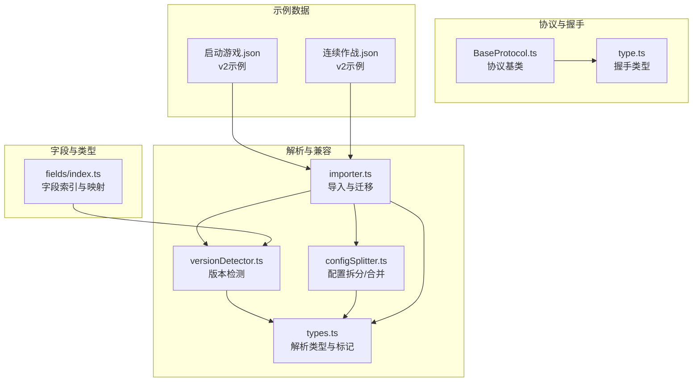
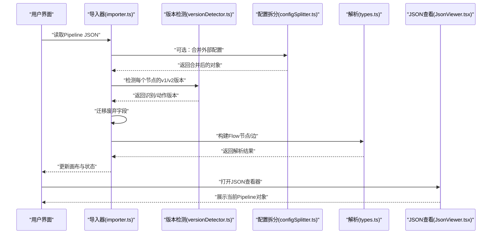
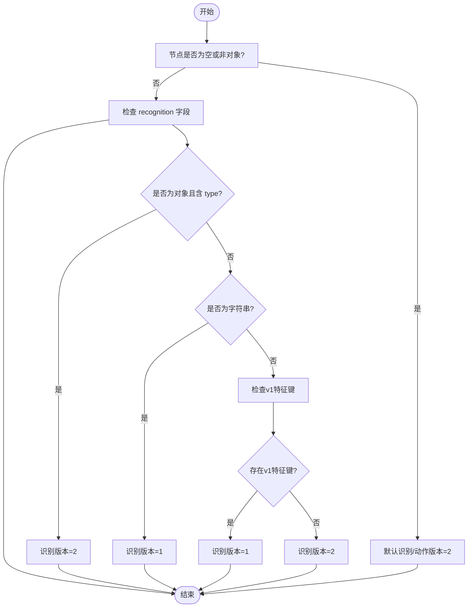
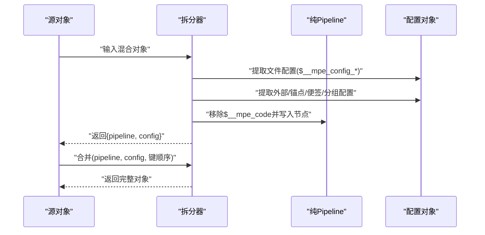
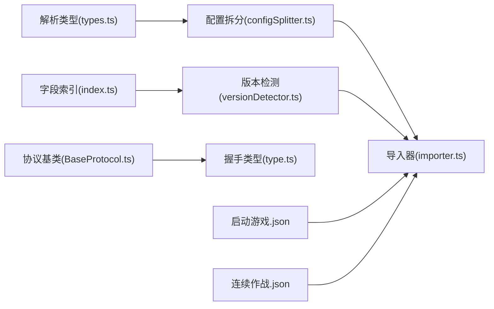

# 版本兼容性

<cite>
**本文引用的文件**
- [versionDetector.ts](file://src/core/parser/versionDetector.ts)
- [configSplitter.ts](file://src/core/parser/configSplitter.ts)
- [importer.ts](file://src/core/parser/importer.ts)
- [types.ts](file://src/core/parser/types.ts)
- [index.ts（字段索引）](file://src/core/fields/index.ts)
- [启动游戏.json](file://LocalBridge/test-json/base/pipeline/日常任务/启动游戏.json)
- [连续作战.json](file://LocalBridge/test-json/base/pipeline/开荒功能/连续作战.json)
- [BaseProtocol.ts](file://src/services/protocols/BaseProtocol.ts)
- [type.ts（协议类型）](file://src/services/type.ts)
- [JsonViewer.tsx](file://src/components/JsonViewer.tsx)
</cite>

## 目录
1. [简介](#简介)
2. [项目结构](#项目结构)
3. [核心组件](#核心组件)
4. [架构总览](#架构总览)
5. [详细组件分析](#详细组件分析)
6. [依赖分析](#依赖分析)
7. [性能考量](#性能考量)
8. [故障排查指南](#故障排查指南)
9. [结论](#结论)
10. [附录](#附录)

## 简介
本文件聚焦于 MaaPipelineEditor 的版本兼容性设计与实现，围绕 v1 与 v2 协议版本差异、版本检测算法、配置拆分器的兼容处理、混合版本场景策略、版本升级最佳实践以及测试与验证方法进行系统化说明。目标是帮助开发者与使用者在不破坏既有数据的前提下，平滑地完成从旧版到新版的迁移，并在复杂项目中安全共存多版本节点。

## 项目结构
与版本兼容性直接相关的核心代码位于前端解析器与字段定义模块：
- 解析与兼容：src/core/parser 下的版本检测、配置拆分、导入器等
- 字段与类型：src/core/fields 下的字段定义与类型生成
- 协议与握手：src/services/protocols 与 src/services/type 下的协议基类与握手类型
- 示例数据：LocalBridge/test-json 下的 v2 示例文件

图表来源
- [versionDetector.ts:1-149](file://src/core/parser/versionDetector.ts#L1-L149)
- [configSplitter.ts:1-486](file://src/core/parser/configSplitter.ts#L1-L486)
- [importer.ts:155-249](file://src/core/parser/importer.ts#L155-L249)
- [types.ts:1-107](file://src/core/parser/types.ts#L1-L107)
- [index.ts（字段索引）:1-45](file://src/core/fields/index.ts#L1-L45)
- [BaseProtocol.ts:1-39](file://src/services/protocols/BaseProtocol.ts#L1-L39)
- [type.ts（协议类型）:1-27](file://src/services/type.ts#L1-L27)
- [启动游戏.json:1-314](file://LocalBridge/test-json/base/pipeline/日常任务/启动游戏.json#L1-L314)
- [连续作战.json:1-118](file://LocalBridge/test-json/base/pipeline/开荒功能/连续作战.json#L1-L118)

章节来源
- [versionDetector.ts:1-149](file://src/core/parser/versionDetector.ts#L1-L149)
- [configSplitter.ts:1-486](file://src/core/parser/configSplitter.ts#L1-L486)
- [importer.ts:155-249](file://src/core/parser/importer.ts#L155-L249)
- [types.ts:1-107](file://src/core/parser/types.ts#L1-L107)
- [index.ts（字段索引）:1-45](file://src/core/fields/index.ts#L1-L45)
- [BaseProtocol.ts:1-39](file://src/services/protocols/BaseProtocol.ts#L1-L39)
- [type.ts（协议类型）:1-27](file://src/services/type.ts#L1-L27)
- [启动游戏.json:1-314](file://LocalBridge/test-json/base/pipeline/日常任务/启动游戏.json#L1-L314)
- [连续作战.json:1-118](file://LocalBridge/test-json/base/pipeline/开荒功能/连续作战.json#L1-L118)

## 核心组件
- 版本检测器：基于字段存在性与数据结构特征判断节点的 v1/v2 版本，输出识别与动作两部分的版本号。
- 配置拆分器：将包含配置信息的混合对象拆分为纯 Pipeline 与独立配置对象；并在导出时按原键顺序合并回完整对象。
- 导入器：负责解析、迁移废弃字段、构建 Flow 节点与连线，并在需要时合并外部配置。
- 字段与类型：提供识别/动作字段的键列表与大写值映射，支撑版本检测与类型标准化。
- 协议与握手：协议基类与握手类型定义，确保客户端与服务端对版本达成一致。

章节来源
- [versionDetector.ts:23-110](file://src/core/parser/versionDetector.ts#L23-L110)
- [configSplitter.ts:21-141](file://src/core/parser/configSplitter.ts#L21-L141)
- [importer.ts:155-249](file://src/core/parser/importer.ts#L155-L249)
- [index.ts（字段索引）:41-45](file://src/core/fields/index.ts#L41-L45)
- [BaseProtocol.ts:7-39](file://src/services/protocols/BaseProtocol.ts#L7-L39)
- [type.ts（协议类型）:8-18](file://src/services/type.ts#L8-L18)

## 架构总览
下图展示了从导入到渲染的关键流程，以及版本检测与配置拆分在其中的位置。

图表来源
- [importer.ts:155-249](file://src/core/parser/importer.ts#L155-L249)
- [versionDetector.ts:23-110](file://src/core/parser/versionDetector.ts#L23-L110)
- [configSplitter.ts:151-448](file://src/core/parser/configSplitter.ts#L151-L448)
- [types.ts:24-43](file://src/core/parser/types.ts#L24-L43)
- [JsonViewer.tsx:113-279](file://src/components/JsonViewer.tsx#L113-L279)

## 详细组件分析

### v1 与 v2 协议版本差异
- 数据结构变化
  - v1：识别与动作字段通常以字符串形式直接出现，例如 recognition 与 action 为字符串；其他参数键直接位于节点根级。
  - v2：识别与动作字段为对象结构，包含 type 与 param 两个子字段；同时引入统一的 $__mpe_code 配置标记与多种节点前缀（如外部节点、锚点、便签、分组）。
- 字段命名规范
  - v1：参数键直接暴露在节点对象上，如 timeout、pre_delay、post_delay、next、on_error 等。
  - v2：参数键仍存在，但识别/动作统一为对象结构；新增 focus、rate_limit、jump_back 等语义化字段。
- 类型定义
  - v1：类型为字符串，需通过映射表进行标准化。
  - v2：类型为字符串，但通过标准化函数进行大小写与枚举校验，提升一致性。
- 关键标识符
  - v2 引入 $__mpe_code、$__mpe_config_*、$__mpe_external_*、$__mpe_anchor_*、$__mpe_sticker_*、$__mpe_group_* 等前缀与标记，用于区分节点与配置。

示例参考
- v2 示例文件展示了识别/动作对象结构、$__mpe_code 位置、next/on_error/自定义 recognition/action 等字段用法。

章节来源
- [启动游戏.json:16-314](file://LocalBridge/test-json/base/pipeline/日常任务/启动游戏.json#L16-L314)
- [连续作战.json:16-118](file://LocalBridge/test-json/base/pipeline/开荒功能/连续作战.json#L16-L118)
- [types.ts:15-43](file://src/core/parser/types.ts#L15-L43)

### 版本检测算法实现原理
版本检测器通过以下策略判断节点版本：
- recognition 字段检测
  - 若 recognition 为对象且包含 type，则判定为 v2。
  - 若 recognition 为字符串，则判定为 v1。
  - 若不存在 recognition，检查节点键是否包含 v1 特征键（来自字段键列表），若有则按 v1 处理，否则默认 v2。
- action 字段检测
  - 逻辑与 recognition 类似，依据是否存在对象且包含 type 或字符串来判断。
- 类型标准化
  - 通过预定义的大写值映射，对识别算法类型与动作类型进行大小写归一化与合法性校验，异常时抛出错误。

图表来源
- [versionDetector.ts:23-71](file://src/core/parser/versionDetector.ts#L23-L71)

章节来源
- [versionDetector.ts:23-110](file://src/core/parser/versionDetector.ts#L23-L110)
- [index.ts（字段索引）:41-45](file://src/core/fields/index.ts#L41-L45)

### 配置拆分器的兼容性处理机制
配置拆分器负责将混合对象拆分为纯 Pipeline 与独立配置对象，并在导出时按原键顺序合并回完整对象：
- 拆分阶段
  - 提取 $__mpe_config_* 节点中的文件配置信息，填充到配置对象的 file_config。
  - 识别并提取外部节点、锚点节点、便签节点、分组节点的 $__mpe_code 信息，分别放入对应配置区域。
  - 普通节点：移除 $__mpe_code 后的节点数据写入纯 Pipeline。
  - 清理空对象，避免冗余配置。
- 合并阶段
  - 重建 $__mpe_config_* 节点，写入文件配置。
  - 将节点配置转换为 $__mpe_code，支持新旧两种包装格式。
  - 按原始键顺序输出，确保导出一致性。
  - 特殊节点（外部/锚点/便签/分组）按名称与文件名后缀规则映射回键名。

图表来源
- [configSplitter.ts:21-141](file://src/core/parser/configSplitter.ts#L21-L141)
- [configSplitter.ts:151-448](file://src/core/parser/configSplitter.ts#L151-L448)

章节来源
- [configSplitter.ts:21-141](file://src/core/parser/configSplitter.ts#L21-L141)
- [configSplitter.ts:151-448](file://src/core/parser/configSplitter.ts#L151-L448)
- [types.ts:15-21](file://src/core/parser/types.ts#L15-L21)

### 混合版本场景的处理策略
- 在同一项目中同时存在 v1 与 v2 节点时，版本检测器会逐节点判断其版本，从而在解析与渲染时采用相应的字段集与类型。
- 导入器在解析前先执行版本检测，再进行字段迁移与 Flow 构建，确保不同类型节点被正确处理。
- 配置拆分器在合并时尊重原始键顺序，避免因版本混杂导致的布局与连接错乱。

章节来源
- [importer.ts:155-249](file://src/core/parser/importer.ts#L155-L249)
- [versionDetector.ts:23-110](file://src/core/parser/versionDetector.ts#L23-L110)
- [configSplitter.ts:234-325](file://src/core/parser/configSplitter.ts#L234-L325)

### 版本升级最佳实践
- 渐进式迁移
  - 优先将新项目以 v2 结构编写，逐步将旧项目中的节点迁移到 v2 对象结构。
  - 使用 JSON 查看器对比迁移前后字段差异，确保识别/动作字段对象化、参数键规范化。
- 向后兼容性保证
  - 保留 v1 特征键检测逻辑，使旧节点在导入时仍能被识别与处理。
  - 协议握手类型中包含服务器版本与所需版本信息，便于客户端判断兼容性。
- 数据完整性验证
  - 导入后通过 JSON 查看器核对关键字段（如 recognition.type、action.type、next/on_error、jump_back 等）。
  - 对照示例文件（如启动游戏.json、连续作战.json）检查结构一致性。

章节来源
- [BaseProtocol.ts:7-39](file://src/services/protocols/BaseProtocol.ts#L7-L39)
- [type.ts（协议类型）:8-18](file://src/services/type.ts#L8-L18)
- [JsonViewer.tsx:113-279](file://src/components/JsonViewer.tsx#L113-L279)
- [启动游戏.json:16-314](file://LocalBridge/test-json/base/pipeline/日常任务/启动游戏.json#L16-L314)
- [连续作战.json:16-118](file://LocalBridge/test-json/base/pipeline/开荒功能/连续作战.json#L16-L118)

## 依赖分析
- 组件耦合
  - 版本检测依赖字段键列表与大写值映射，耦合度低、内聚性强。
  - 配置拆分器依赖解析类型常量（如 $__mpe_code、前缀等），并与导入器紧密协作。
  - 导入器在解析前调用拆分器与检测器，形成清晰的职责边界。
- 外部依赖
  - 协议层通过握手类型与服务端版本协商，确保运行时兼容性。
  - 示例数据文件为实际 v2 结构的参考样本，便于回归测试与对照。

图表来源
- [index.ts（字段索引）:41-45](file://src/core/fields/index.ts#L41-L45)
- [versionDetector.ts:1-149](file://src/core/parser/versionDetector.ts#L1-L149)
- [types.ts:15-21](file://src/core/parser/types.ts#L15-L21)
- [configSplitter.ts:1-486](file://src/core/parser/configSplitter.ts#L1-L486)
- [importer.ts:155-249](file://src/core/parser/importer.ts#L155-L249)
- [BaseProtocol.ts:1-39](file://src/services/protocols/BaseProtocol.ts#L1-L39)
- [type.ts（协议类型）:1-27](file://src/services/type.ts#L1-L27)
- [启动游戏.json:1-314](file://LocalBridge/test-json/base/pipeline/日常任务/启动游戏.json#L1-L314)
- [连续作战.json:1-118](file://LocalBridge/test-json/base/pipeline/开荒功能/连续作战.json#L1-L118)

章节来源
- [index.ts（字段索引）:1-45](file://src/core/fields/index.ts#L1-L45)
- [versionDetector.ts:1-149](file://src/core/parser/versionDetector.ts#L1-L149)
- [configSplitter.ts:1-486](file://src/core/parser/configSplitter.ts#L1-L486)
- [importer.ts:155-249](file://src/core/parser/importer.ts#L155-L249)
- [types.ts:1-107](file://src/core/parser/types.ts#L1-L107)
- [BaseProtocol.ts:1-39](file://src/services/protocols/BaseProtocol.ts#L1-L39)
- [type.ts（协议类型）:1-27](file://src/services/type.ts#L1-L27)
- [启动游戏.json:1-314](file://LocalBridge/test-json/base/pipeline/日常任务/启动游戏.json#L1-L314)
- [连续作战.json:1-118](file://LocalBridge/test-json/base/pipeline/开荒功能/连续作战.json#L1-L118)

## 性能考量
- 版本检测为 O(k)（k 为节点键数量），对大型项目影响有限。
- 配置拆分与合并按键遍历与映射，整体复杂度与对象规模线性相关。
- 建议在批量导入时复用原始键顺序，减少不必要的重排与二次解析成本。

## 故障排查指南
- 类型错误
  - 症状：标准化函数抛出“类型错误”异常。
  - 排查：确认 recognition.type 与 action.type 是否在预定义映射中，注意大小写与拼写。
- 字段缺失或结构异常
  - 症状：识别/动作字段为字符串但缺少 type，或对象结构不完整。
  - 排查：对照 v2 示例文件，确保字段对象化并包含 type 与 param。
- 导入后布局错乱
  - 症状：节点位置或连接关系异常。
  - 排查：确认配置拆分器合并时传入了正确的原始键顺序；检查 $__mpe_code 与节点键前缀是否正确。
- 协议不兼容
  - 症状：握手失败或版本不满足要求。
  - 排查：检查握手响应中的 required_version 与 server_version，确保客户端版本满足要求。

章节来源
- [versionDetector.ts:118-148](file://src/core/parser/versionDetector.ts#L118-L148)
- [configSplitter.ts:151-448](file://src/core/parser/configSplitter.ts#L151-L448)
- [type.ts（协议类型）:8-18](file://src/services/type.ts#L8-L18)

## 结论
MaaPipelineEditor 通过版本检测器、配置拆分器与导入器的协同，实现了对 v1 与 v2 的良好兼容。在混合版本场景下，系统能够逐节点判断并采用相应处理策略，配合协议握手与示例数据参考，可安全、可控地完成渐进式迁移与长期维护。

## 附录
- 测试与验证建议
  - 使用 JSON 查看器对比迁移前后字段结构，确保识别/动作对象化与参数键规范化。
  - 基于示例文件（启动游戏.json、连续作战.json）进行回归测试，覆盖关键字段与连接关系。
  - 在批量导入场景中记录并复用原始键顺序，验证导出一致性。

章节来源
- [JsonViewer.tsx:113-279](file://src/components/JsonViewer.tsx#L113-L279)
- [启动游戏.json:1-314](file://LocalBridge/test-json/base/pipeline/日常任务/启动游戏.json#L1-L314)
- [连续作战.json:1-118](file://LocalBridge/test-json/base/pipeline/开荒功能/连续作战.json#L1-L118)