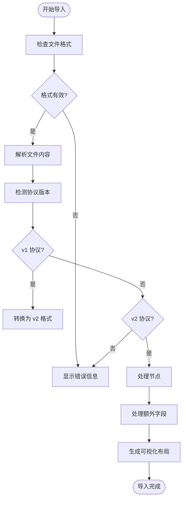
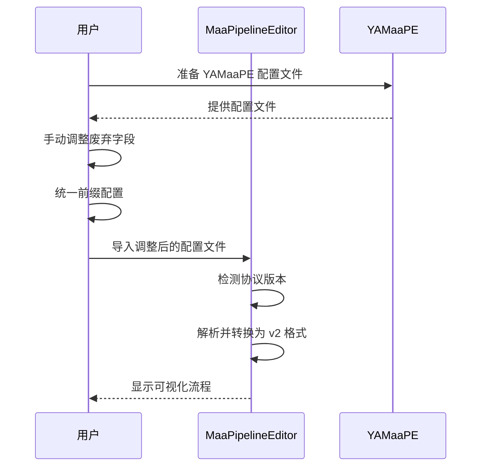

# 迁移指南

<cite>
**本文档引用的文件**  
- [importer.ts](file://src/core/parser/importer.ts)
- [configParser.ts](file://src/core/parser/configParser.ts)
- [types.ts](file://src/core/parser/types.ts)
- [versionDetector.ts](file://src/core/parser/versionDetector.ts)
- [nodeParser.ts](file://src/core/parser/nodeParser.ts)
- [fileStore.ts](file://src/stores/fileStore.ts)
- [FilePanel.tsx](file://src/components/panels/FilePanel.tsx)
- [01.导入已有文件.md](file://docsite/docs/01.指南/04.迁移/01.导入已有文件.md)
- [02.从 YAMaaPE 迁移.md](file://docsite/docs/01.指南/04.迁移/02.从 YAMaaPE 迁移.md)
</cite>

## 目录
1. [简介](#简介)
2. [导入已有文件](#导入已有文件)
3. [从 YAMaaPE 迁移](#从-yamaape-迁移)
4. [迁移验证与故障排除](#迁移验证与故障排除)

## 简介

MaaPipelineEditor（简称 MPE）是一款可视化流程编辑工具，旨在帮助用户更直观地构建和管理 MaaFramework 的自动化流程。本迁移指南旨在为用户提供详细的步骤和最佳实践，帮助用户将现有的 JSON 或 JSONC 格式的配置文件无缝迁移到 MPE 中。特别地，本指南将重点介绍如何从 YAMaaPE 迁移配置，并处理可能遇到的兼容性问题。

**重要提示**：虽然 MPE 支持导入现有项目，但建议仅使用 MPE 维护新建的 Pipeline 文件，以避免因非可视化与可视化思路差异导致的布局不佳或兼容性问题。MPE 以单个 `.json` 文件作为操作单位，如果您的旧文件无需更改，则无需整个项目适配 MPE。

## 导入已有文件

MaaPipelineEditor 支持直接导入大多数现有的 Pipeline 配置文件。用户可以通过多种方式将 `.json` 或 `.jsonc` 文件导入到 MPE 中，包括拖拽上传和文件选择。

### 支持的文件格式

MPE 支持以下两种文件格式：
- **.json**：标准的 JSON 文件格式。
- **.jsonc**：带有注释的 JSON 文件格式，常用于配置文件中添加说明。

### 导入方式

MPE 提供了三种便捷的导入方式，用户可以根据自己的使用习惯选择最方便的一种。

#### 1. 从粘贴板导入

1. 复制需要导入的 Pipeline 文件的全部代码内容（注意是文件内的代码，而不是文件本身）。
2. 在 MPE 界面右侧的 `Pipeline JSON` 面板中，点击 `从粘贴板导入` 按钮，即可将当前文件导入。

#### 2. 从文件导入

用户可以通过以下两种方式直接导入 `.json` 或 `.jsonc` 文件：

1. **点击按钮导入**：点击 MPE 右侧 `Pipeline JSON` 面板中的 `从文件导入` 按钮，然后选择需要导入的文件。
2. **拖拽导入**：直接将 `.json` 或 `.jsonc` 文件拖拽到 MPE 页面的任意位置，系统会自动识别并导入。

**提示**：MPE 会自动检测并兼容 v1 和 v2 两种 Pipeline 协议格式，三种导入方式功能完全一致，请根据使用场景选择最方便的方式。

### 导入后的可视化呈现

导入成功后，MPE 会将配置文件中的节点和连接关系以图形化的方式呈现出来。由于非 MPE 导出的文件不包含布局配置，MPE 无法得知在加载时应该将节点渲染在哪个位置，因此在初次导入时会直接将所有节点渲染在视口中心。

#### 自动布局

在加载成功后，用户可以在未选中任何节点的情况下点击右下角的自动布局工具，MPE 会根据节点之间的连接关系自动排版。需要注意的是，MPE 的自动布局仅在节点视角将连接“理顺”，并不知道用户的业务逻辑，因此用户需要自行将布局优化为期望的排布。



**Diagram sources**
- [importer.ts](file://src/core/parser/importer.ts#L125-L294)
- [versionDetector.ts](file://src/core/parser/versionDetector.ts#L23-L31)

**Section sources**
- [01.导入已有文件.md](file://docsite/docs/01.指南/04.迁移/01.导入已有文件.md)
- [importer.ts](file://src/core/parser/importer.ts#L125-L294)

### 潜在的兼容性问题处理

在导入过程中，可能会遇到一些兼容性问题，主要包括过时的字段和深层自定义字段。

#### 过时的字段

MPE 基于 MaaFramework `v4.5.0` 版本协议构建，因此在此之前的废弃字段无法导入。用户需要自行将旧字段调整为新字段后再导入。例如，`Key` 动作类型已在 `v4.5` 版本中废弃，推荐使用 `ClickKey` 替代。

#### 深层自定义字段

MPE 在协议支持的字段之外设置了 `extras` 字段，用于解析与配置协议外字段，但仅对节点的根字段生效。如果用户的 Pipeline 中含有深层自定义字段，这些字段在导入后可能会丢失。建议用户将自定义字段转移到根节点，或在初次导入时对比添加独立说明节点。

## 从 YAMaaPE 迁移

YAMaaPE 是 MaaPipelineEditor 的前身，MPE 保留了对 YAMaaPE 特殊字段的兼容性，但仍需进行一些手动调整以确保顺利迁移。

### 配置结构异同

YAMaaPE 和 MaaPipelineEditor 的配置结构基本相同，都基于 JSON 格式定义节点和连接关系。主要区别在于：
- **协议版本**：YAMaaPE 使用 v1 协议，而 MPE 默认使用 v2 协议。
- **字段命名**：部分字段名称在 v2 协议中有所变化，例如 `interrupt` 字段在 v2 中被合并到 `next` 字段中。

### 转换步骤与注意事项

#### 1. 手动调整字段

在导入前，用户需要将 MaaFramework `4.5` 之前的废弃字段手动调整为 `4.5` 之后的新字段。具体步骤如下：
1. 检查配置文件中是否存在废弃字段，如 `Key` 动作类型。
2. 将废弃字段替换为推荐的新字段，如将 `Key` 替换为 `ClickKey`。

#### 2. 统一前缀

MPE 提供了统一前缀功能，若用户的 Pipeline 中也使用了相似方案，可以按以下方式兼容配置：
1. 将所有前缀与其余部分的连接符改为 `_`。
2. 添加 `$__mpe_config_{文件名}` 节点，在节点下添加 `$__mpe_code` 字段，并在字段中添加 `"prefix": "{前缀}", "filename": "{文件名}"`。

例如，原有配置：
```json
{
  "统一前缀-节点1": {
    /* ... */
  },
  "统一前缀-节点2": {
    /* ... */
  }
}
```

调整后：
```json
{
  "$__mpe_config_文件1": {
    "$__mpe_code": {
      "prefix": "统一前缀",
      "filename": "文件1"
    }
  },
  "统一前缀_节点1": {
    /* ... */
  },
  "统一前缀_节点2": {
    /* ... */
  }
}
```

#### 3. 导入配置

完成上述调整后，用户可以使用 v1 协议将 Pipeline 导入 MPE 中，MPE 会自动解析 YAMaaPE 的相关配置字段并适配为新字段，此后使用 v2 导入即可。



**Diagram sources**
- [02.从 YAMaaPE 迁移.md](file://docsite/docs/01.指南/04.迁移/02.从 YAMaaPE 迁移.md)
- [importer.ts](file://src/core/parser/importer.ts#L31-L118)

**Section sources**
- [02.从 YAMaaPE 迁移.md](file://docsite/docs/01.指南/04.迁移/02.从 YAMaaPE 迁移.md)
- [importer.ts](file://src/core/parser/importer.ts#L31-L118)

## 迁移验证与故障排除

### 成功迁移的验证方法

为了确保迁移后的流程在 MaaFramework 中能正常运行，用户可以采取以下验证方法：
1. **检查节点连接**：确认所有节点的 `next` 和 `on_error` 连接关系正确无误。
2. **测试流程执行**：在 MaaFramework 中运行迁移后的流程，观察是否能够按预期执行。
3. **查看日志输出**：检查 MaaFramework 的日志输出，确保没有错误或警告信息。

### 常见迁移失败案例的诊断与修复建议

#### 1. 导入失败

**症状**：导入时提示“导入失败！请检查 pipeline 格式是否正确，或版本是否一致”。

**诊断**：
- 检查文件格式是否为有效的 JSON 或 JSONC。
- 确认文件中是否存在语法错误，如缺少逗号、括号不匹配等。

**修复建议**：
- 使用在线 JSON 验证工具检查文件格式。
- 确保所有废弃字段已正确替换为新字段。

#### 2. 节点丢失

**症状**：导入后发现某些节点未显示。

**诊断**：
- 检查节点名称是否重复。
- 确认节点是否被正确识别为有效节点。

**修复建议**：
- 确保每个节点的名称唯一。
- 检查节点的 `type` 字段是否正确。

#### 3. 连接关系错误

**症状**：节点之间的连接关系不符合预期。

**诊断**：
- 检查 `next` 和 `on_error` 字段的引用是否正确。
- 确认是否存在循环引用。

**修复建议**：
- 仔细核对每个节点的 `next` 和 `on_error` 字段。
- 使用 MPE 的自动布局功能重新排列节点，检查连接关系。

**Section sources**
- [importer.ts](file://src/core/parser/importer.ts#L286-L292)
- [errorStore.ts](file://src/stores/errorStore.ts#L3-L15)