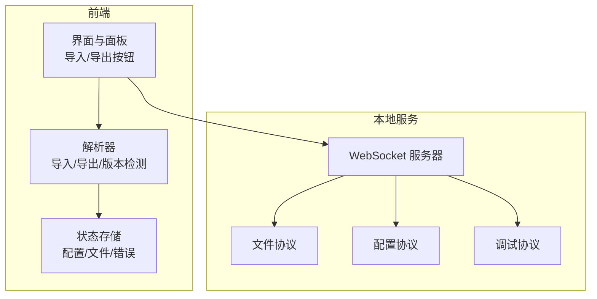
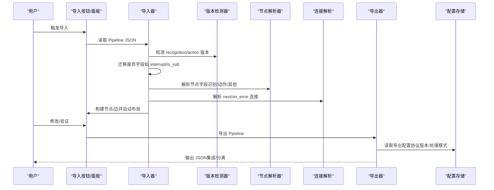
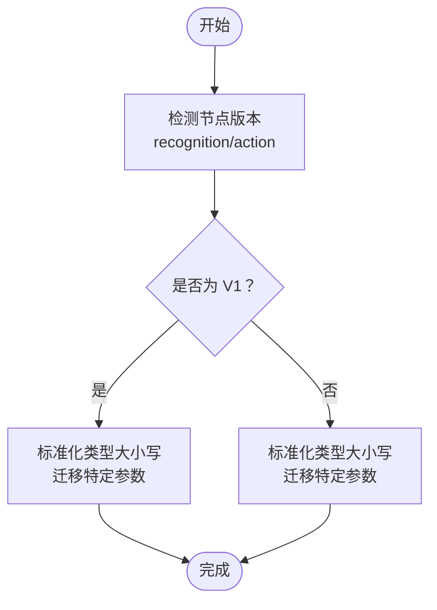
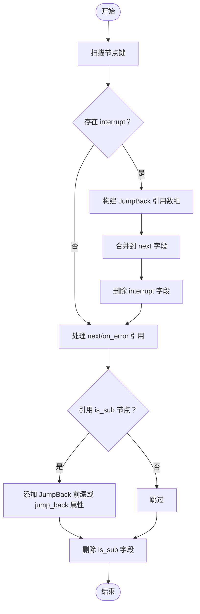
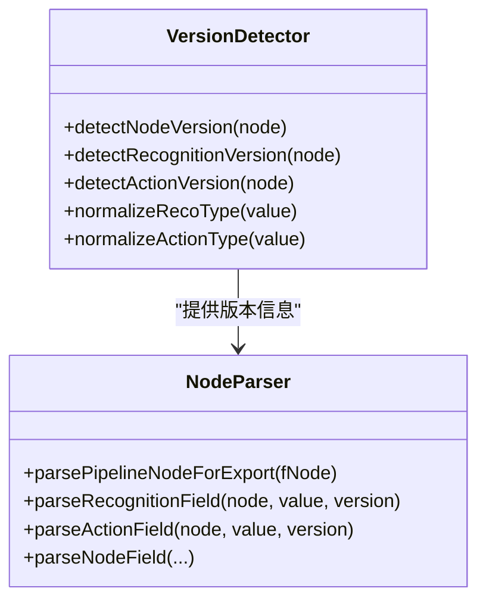
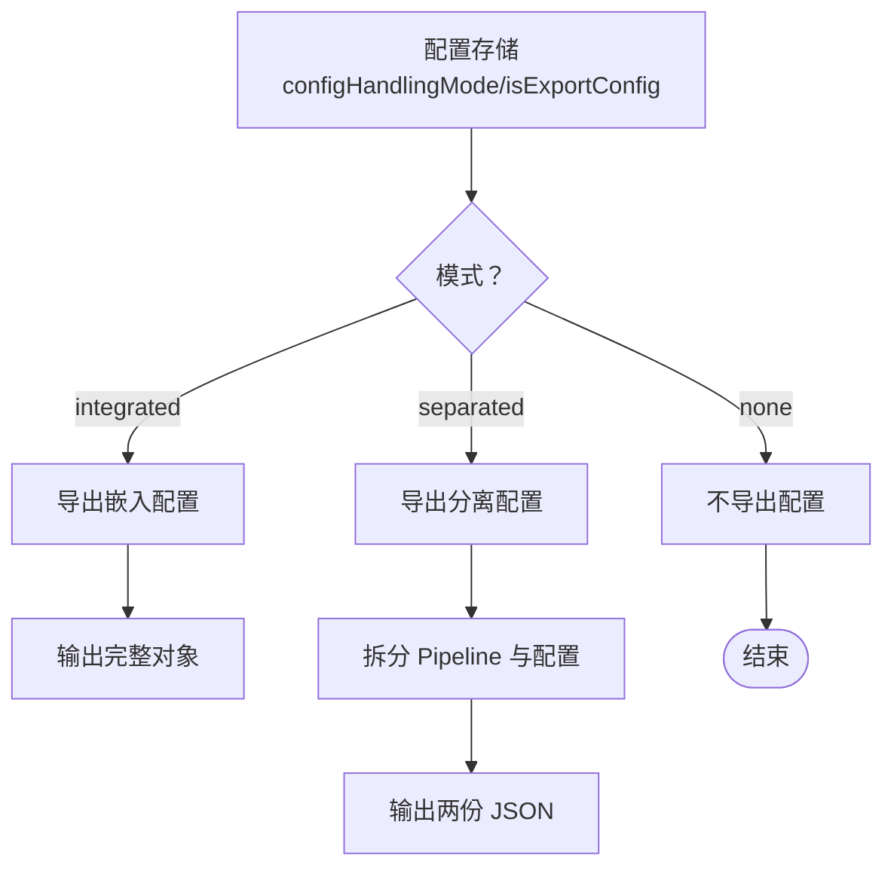
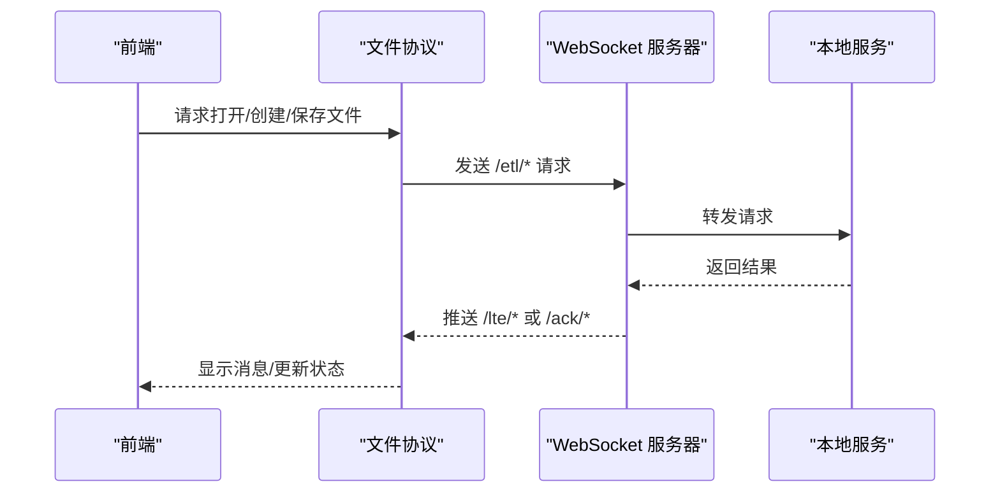
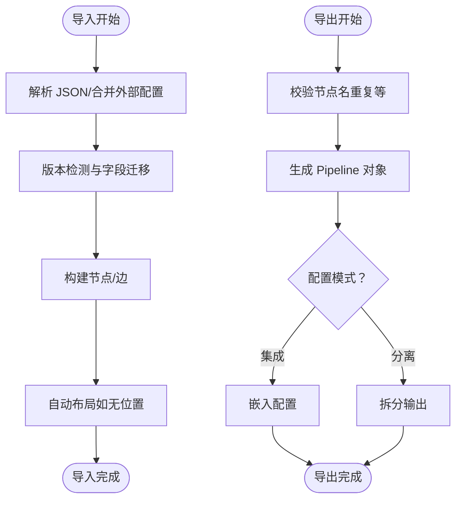
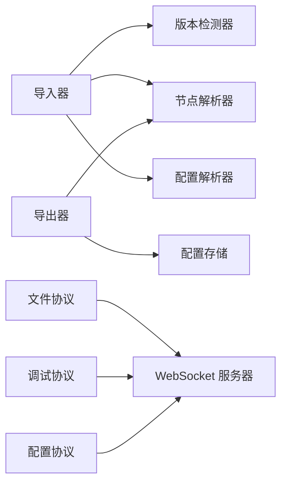

# 迁移指南

<cite>
**本文引用的文件**
- [迁移：从 YAMaaPE 迁移](file://docsite/docs/01.指南/90.迁移/02.从 YAMaaPE 迁移.md)
- [版本检测器](file://src/core/parser/versionDetector.ts)
- [导入器](file://src/core/parser/importer.ts)
- [导出器](file://src/core/parser/exporter.ts)
- [节点解析器](file://src/core/parser/nodeParser.ts)
- [配置解析器](file://src/core/parser/configParser.ts)
- [字段索引](file://src/core/fields/index.ts)
- [配置存储](file://src/stores/configStore.ts)
- [文件协议](file://src/services/protocols/FileProtocol.ts)
- [调试协议](file://src/services/protocols/DebugProtocol.ts)
- [配置协议](file://src/services/protocols/ConfigProtocol.ts)
- [边切片（冲突校验）](file://src/stores/flow/slices/edgeSlice.ts)
- [错误存储](file://src/stores/errorStore.ts)
- [本地服务初始化](file://src/services/server.ts)
- [Go 版本比较](file://LocalBridge/cmd/lb/main.go)
</cite>

## 目录
1. [简介](#简介)
2. [项目结构](#项目结构)
3. [核心组件](#核心组件)
4. [架构总览](#架构总览)
5. [详细组件分析](#详细组件分析)
6. [依赖分析](#依赖分析)
7. [性能考量](#性能考量)
8. [故障排查指南](#故障排查指南)
9. [结论](#结论)
10. [附录](#附录)

## 简介
本指南面向从 YAMaaPE 迁移到 MaaPipelineEditor（MPE）的用户，系统讲解迁移流程、版本差异、兼容性处理、数据转换、协议兼容、配置持久化方案、常见问题与回滚策略，以及自动化迁移工具的最佳实践。文档基于仓库内现有实现进行归纳总结，帮助你安全、可控地完成迁移。

## 项目结构
MPE 前端以 React + React Flow 为核心，采用“解析器 + 编译器”的架构：导入时解析 Pipeline JSON，构建流程图；导出时将流程图编译为 Pipeline V2（默认）或 V1 格式。本地服务通过 WebSocket 协议与前端交互，支持文件列表、内容、变更通知、保存确认等。

```mermaid
graph TB
subgraph "前端"
UI["界面与面板<br/>导入/导出按钮"]
Parser["解析器<br/>导入/导出/版本检测"]
Store["状态存储<br/>配置/文件/错误"]
end
subgraph "本地服务"
WS["WebSocket 服务器"]
FP["文件协议"]
CP["配置协议"]
DP["调试协议"]
end
UI --> Parser
Parser --> Store
UI --> WS
WS --> FP
WS --> CP
WS --> DP
```

图表来源
- [本地服务初始化:348-372](file://src/services/server.ts#L348-L372)
- [文件协议:44-68](file://src/services/protocols/FileProtocol.ts#L44-L68)
- [配置协议:72-98](file://src/services/protocols/ConfigProtocol.ts#L72-L98)
- [调试协议:77-120](file://src/services/protocols/DebugProtocol.ts#L77-L120)

章节来源
- [本地服务初始化:348-372](file://src/services/server.ts#L348-L372)
- [文件协议:44-68](file://src/services/protocols/FileProtocol.ts#L44-L68)
- [配置协议:72-98](file://src/services/protocols/ConfigProtocol.ts#L72-L98)
- [调试协议:77-120](file://src/services/protocols/DebugProtocol.ts#L77-L120)

## 核心组件
- 版本检测与标准化：自动识别节点的 recognition/action 字段版本，统一大小写与类型，保证兼容性。
- 导入器：解析 Pipeline JSON，迁移废弃字段（如 v5.1 的 interrupt/is_sub），构建节点、边与配置。
- 导出器：将流程图编译为 Pipeline JSON，支持 V1/V2 协议、分离/集成配置导出。
- 节点解析器：将 Flow 节点字段映射到 Pipeline 结构，处理识别/动作/其他参数及焦点字段。
- 配置解析器：识别并提取配置标记，兼容新旧版本标记字段。
- 字段索引：提供识别/动作/其他字段的 Schema 与键列表，支撑版本检测与参数匹配。
- 配置存储：集中管理导出行为（协议版本、是否导出默认识别/动作、配置处理模式等）。
- 协议层：文件/配置/调试协议通过 WebSocket 与本地服务通信，支持自动重载、保存确认等。

章节来源
- [版本检测器:23-110](file://src/core/parser/versionDetector.ts#L23-L110)
- [导入器:155-507](file://src/core/parser/importer.ts#L155-L507)
- [导出器:42-210](file://src/core/parser/exporter.ts#L42-L210)
- [节点解析器:21-147](file://src/core/parser/nodeParser.ts#L21-L147)
- [配置解析器:47-68](file://src/core/parser/configParser.ts#L47-L68)
- [字段索引:1-45](file://src/core/fields/index.ts#L1-L45)
- [配置存储:163-267](file://src/stores/configStore.ts#L163-L267)

## 架构总览
下图展示从旧项目导入到新编辑器的关键流程：版本检测、废弃字段迁移、节点/边构建、连接解析、自动布局与配置持久化。

```mermaid
sequenceDiagram
participant U as "用户"
participant UI as "导入按钮/面板"
participant IMP as "导入器"
participant DET as "版本检测器"
participant NP as "节点解析器"
participant EL as "连接解析"
participant EXP as "导出器"
participant CFG as "配置存储"
U->>UI : 触发导入
UI->>IMP : 读取 Pipeline JSON
IMP->>DET : 检测 recognition/action 版本
IMP->>IMP : 迁移废弃字段如 interrupt/is_sub
IMP->>NP : 解析节点字段识别/动作/其他
IMP->>EL : 解析 next/on_error 连接
IMP->>UI : 构建节点/边并自动布局
U->>UI : 修改/验证
UI->>EXP : 导出 Pipeline
EXP->>CFG : 读取导出配置协议版本/处理模式
EXP-->>U : 输出 JSON集成/分离
```

图表来源
- [导入器:155-507](file://src/core/parser/importer.ts#L155-L507)
- [版本检测器:23-110](file://src/core/parser/versionDetector.ts#L23-L110)
- [节点解析器:322-371](file://src/core/parser/nodeParser.ts#L322-L371)
- [导出器:42-210](file://src/core/parser/exporter.ts#L42-L210)
- [配置存储:163-267](file://src/stores/configStore.ts#L163-L267)

## 详细组件分析

### 从 YAMaaPE 迁移流程
- 旧项目无需整体适配 MPE，MPE 以单个 json 文件为操作单位；若旧文件无需改动，可直接导入使用。
- 仍保留 YAMaaPE 特殊字段兼容，但需将 MaaFramework 4.5 前的字段手动调整为 4.5 之后的字段。
- 使用 v1 协议导入后，MPE 会自动解析 YAMaaPE 的相关配置字段并适配为新字段，随后可用 v2 导入。

章节来源
- [迁移：从 YAMaaPE 迁移:10-16](file://docsite/docs/01.指南/90.迁移/02.从 YAMaaPE 迁移.md#L10-L16)

### 版本差异与兼容性处理
- 节点版本检测：识别 recognition/action 字段是否为字符串（V1）或对象（V2），并标准化类型大小写。
- 类型标准化：提供识别/动作类型的大小写归一化，若不在预定义集合则抛错，避免非法类型。
- 参数迁移：针对特定字段（如识别 method）进行数值迁移，确保与新协议一致。

```mermaid
flowchart TD
Start(["开始"]) --> Detect["检测节点版本<br/>recognition/action"]
Detect --> IsV1{"是否为 V1？"}
IsV1 --> |是| NormalizeV1["标准化类型大小写<br/>迁移特定参数"]
IsV1 --> |否| NormalizeV2["标准化类型大小写<br/>迁移特定参数"]
NormalizeV1 --> Done(["完成"])
NormalizeV2 --> Done
```

图表来源
- [版本检测器:23-110](file://src/core/parser/versionDetector.ts#L23-L110)
- [节点解析器:267-311](file://src/core/parser/nodeParser.ts#L267-L311)

章节来源
- [版本检测器:23-110](file://src/core/parser/versionDetector.ts#L23-L110)
- [节点解析器:267-311](file://src/core/parser/nodeParser.ts#L267-L311)

### 废弃字段迁移（v5.1）
- interrupt 字段：迁移到 next，并统一添加 JumpBack 前缀或 jump_back 属性。
- is_sub 子节点：在 next/on_error 引用中自动添加 JumpBack 前缀或 jump_back 属性。
- 迁移完成后删除 is_sub 字段，保持结构简洁与规范。

```mermaid
flowchart TD
S(["开始"]) --> Scan["扫描节点键"]
Scan --> HasInt{"存在 interrupt？"}
HasInt --> |是| Build["构建 JumpBack 引用数组"]
Build --> Merge["合并到 next 字段"]
Merge --> DelInt["删除 interrupt 字段"]
HasInt --> |否| Refs["处理 next/on_error 引用"]
DelInt --> Refs
Refs --> MarkSub{"引用 is_sub 节点？"}
MarkSub --> |是| AddPrefix["添加 JumpBack 前缀或 jump_back 属性"]
MarkSub --> |否| Next["跳过"]
AddPrefix --> Clean["删除 is_sub 字段"]
Next --> Clean
Clean --> E(["结束"])
```

图表来源
- [导入器:47-149](file://src/core/parser/importer.ts#L47-L149)

章节来源
- [导入器:47-149](file://src/core/parser/importer.ts#L47-L149)

### 协议版本兼容与混合导入
- V1/V2 协议混用：导入时自动检测节点版本，分别按 V1/V2 规则解析识别/动作字段。
- V1 平铺参数：当导出协议为 V1 时，识别/动作参数将平铺到节点根级。
- V2 对象结构：识别/动作以对象形式导出，包含 type 与 param。
- 本地服务版本比较：后端提供语义化版本比较工具，便于判断兼容性。

```mermaid
classDiagram
class VersionDetector {
+detectNodeVersion(node)
+detectRecognitionVersion(node)
+detectActionVersion(node)
+normalizeRecoType(value)
+normalizeActionType(value)
}
class NodeParser {
+parsePipelineNodeForExport(fNode)
+parseRecognitionField(node, value, version)
+parseActionField(node, value, version)
+parseNodeField(...)
}
VersionDetector --> NodeParser : "提供版本信息"
```

图表来源
- [版本检测器:23-149](file://src/core/parser/versionDetector.ts#L23-L149)
- [节点解析器:21-147](file://src/core/parser/nodeParser.ts#L21-L147)

章节来源
- [版本检测器:23-149](file://src/core/parser/versionDetector.ts#L23-L149)
- [节点解析器:21-147](file://src/core/parser/nodeParser.ts#L21-L147)
- [Go 版本比较:821-881](file://LocalBridge/cmd/lb/main.go#L821-L881)

### 配置持久化方案（集成 vs 分离）
- 集成方案：导出时将配置嵌入到 Pipeline 对象中，键名带有标记前缀，便于一次性保存。
- 分离方案：导出 Pipeline 与配置为两个独立 JSON，便于版本控制与团队协作。
- 配置处理模式：通过配置存储中的 configHandlingMode 控制导出行为，同时影响 isExportConfig 的同步。

```mermaid
flowchart TD
Cfg["配置存储<br/>configHandlingMode/isExportConfig"] --> Mode{"模式？"}
Mode --> |integrated| Int["导出嵌入配置"]
Mode --> |separated| Sep["导出分离配置"]
Mode --> |none| None["不导出配置"]
Int --> Out["输出完整对象"]
Sep --> Split["拆分 Pipeline 与配置"]
Split --> Out2["输出两份 JSON"]
None --> End(["结束"])
```

图表来源
- [配置存储:163-267](file://src/stores/configStore.ts#L163-L267)
- [导出器:184-210](file://src/core/parser/exporter.ts#L184-L210)
- [导出器:228-243](file://src/core/parser/exporter.ts#L228-L243)

章节来源
- [配置存储:163-267](file://src/stores/configStore.ts#L163-L267)
- [导出器:184-210](file://src/core/parser/exporter.ts#L184-L210)
- [导出器:228-243](file://src/core/parser/exporter.ts#L228-L243)

### 旧项目导入功能与自动排版
- 自动识别废弃字段：导入器扫描节点键，识别并迁移 interrupt/is_sub 等废弃字段。
- 智能迁移：将字符串引用统一为 JumpBack 前缀或对象形式的 jump_back 属性。
- 自动排版：若节点未包含位置信息，则执行自动布局；若包含位置信息则按原位显示。

章节来源
- [导入器:47-149](file://src/core/parser/importer.ts#L47-L149)
- [导入器:494-496](file://src/core/parser/importer.ts#L494-L496)

### 本地服务与文件同步
- 文件协议：负责文件列表、内容推送、变更通知、保存确认等，支持自动重载与手动确认。
- 保存确认机制：等待后端确认，超时自动失败，避免状态不一致。
- 配置协议：获取/重载后端配置，填充资源路径等信息。
- 调试协议：加载后端配置并自动填充资源路径，提升调试效率。

```mermaid
sequenceDiagram
participant FE as "前端"
participant FP as "文件协议"
participant WS as "WebSocket 服务器"
participant BE as "本地服务"
FE->>FP : 请求打开/创建/保存文件
FP->>WS : 发送 /etl/* 请求
WS->>BE : 转发请求
BE-->>WS : 返回结果
WS-->>FP : 推送 /lte/* 或 /ack/*
FP-->>FE : 显示消息/更新状态
```

图表来源
- [文件协议:364-417](file://src/services/protocols/FileProtocol.ts#L364-L417)
- [文件协议:237-315](file://src/services/protocols/FileProtocol.ts#L237-L315)
- [调试协议:88-120](file://src/services/protocols/DebugProtocol.ts#L88-L120)
- [配置协议:80-98](file://src/services/protocols/ConfigProtocol.ts#L80-L98)

章节来源
- [文件协议:364-417](file://src/services/protocols/FileProtocol.ts#L364-L417)
- [文件协议:237-315](file://src/services/protocols/FileProtocol.ts#L237-L315)
- [调试协议:88-120](file://src/services/protocols/DebugProtocol.ts#L88-L120)
- [配置协议:80-98](file://src/services/protocols/ConfigProtocol.ts#L80-L98)

### 导入/导出流程与错误处理
- 导入失败：弹窗提示并记录控制台错误，便于定位格式或版本问题。
- 导出失败：检查节点名重复等错误，阻断导出并提示修正。
- 边连接冲突：在添加边时进行冲突校验，避免 next 与 on_error 同向冲突。

```mermaid
flowchart TD
IStart(["导入开始"]) --> Parse["解析 JSON/合并外部配置"]
Parse --> Detect["版本检测与字段迁移"]
Detect --> Build["构建节点/边"]
Build --> Auto["自动布局如无位置"]
Auto --> IEnd(["导入完成"])
OStart(["导出开始"]) --> Validate["校验节点名重复等"]
Validate --> Export["生成 Pipeline 对象"]
Export --> ModeSel{"配置模式？"}
ModeSel --> |集成| Integrated["嵌入配置"]
ModeSel --> |分离| Separated["拆分输出"]
Integrated --> OEnd(["导出完成"])
Separated --> OEnd
```

图表来源
- [导入器:155-507](file://src/core/parser/importer.ts#L155-L507)
- [导出器:42-210](file://src/core/parser/exporter.ts#L42-L210)
- [边切片（冲突校验）:154-206](file://src/stores/flow/slices/edgeSlice.ts#L154-L206)

章节来源
- [导入器:155-507](file://src/core/parser/importer.ts#L155-L507)
- [导出器:42-210](file://src/core/parser/exporter.ts#L42-L210)
- [边切片（冲突校验）:154-206](file://src/stores/flow/slices/edgeSlice.ts#L154-L206)

## 依赖分析
- 组件耦合：导入器依赖版本检测器、节点解析器、配置解析器；导出器依赖节点解析器与配置存储；协议层与本地服务强耦合。
- 外部依赖：WebSocket 通信、JSONC 解析、Ant Design UI 组件库。
- 潜在循环依赖：当前文件组织以“解析器/协议/存储”分层，未发现明显循环依赖。

```mermaid
graph LR
IMP["导入器"] --> DET["版本检测器"]
IMP --> NP["节点解析器"]
IMP --> CFGP["配置解析器"]
EXP["导出器"] --> NP
EXP --> CS["配置存储"]
FP["文件协议"] --> WS["WebSocket 服务器"]
DP["调试协议"] --> WS
CP["配置协议"] --> WS
```

图表来源
- [导入器:1-50](file://src/core/parser/importer.ts#L1-L50)
- [导出器:1-36](file://src/core/parser/exporter.ts#L1-L36)
- [文件协议:44-68](file://src/services/protocols/FileProtocol.ts#L44-L68)
- [调试协议:77-120](file://src/services/protocols/DebugProtocol.ts#L77-L120)
- [配置协议:72-98](file://src/services/protocols/ConfigProtocol.ts#L72-L98)

章节来源
- [导入器:1-50](file://src/core/parser/importer.ts#L1-L50)
- [导出器:1-36](file://src/core/parser/exporter.ts#L1-L36)
- [文件协议:44-68](file://src/services/protocols/FileProtocol.ts#L44-L68)
- [调试协议:77-120](file://src/services/protocols/DebugProtocol.ts#L77-L120)
- [配置协议:72-98](file://src/services/protocols/ConfigProtocol.ts#L72-L98)

## 性能考量
- 导入阶段：使用 JSONC 解析与键顺序遍历，避免不必要的深拷贝；仅在需要时执行自动布局。
- 导出阶段：按顺序排序节点，减少键顺序不确定性；分离导出时先合并再拆分，避免重复序列化。
- 协议层：保存确认采用超时机制，避免长时间阻塞；文件变更通知支持批量处理与自动重载。

## 故障排查指南
- 导入失败：检查 Pipeline 格式与版本一致性，查看控制台错误信息。
- 导出失败：若提示节点名重复，修改重复名称后重试。
- 保存失败：确认本地服务连接正常，查看保存确认回调状态。
- 文件变更：若未自动重载，可在设置中开启自动重载或手动重新加载。

章节来源
- [导入器:498-506](file://src/core/parser/importer.ts#L498-L506)
- [导出器:44-55](file://src/core/parser/exporter.ts#L44-L55)
- [文件协议:567-594](file://src/services/protocols/FileProtocol.ts#L567-L594)
- [错误存储:1-38](file://src/stores/errorStore.ts#L1-L38)

## 结论
通过版本检测、废弃字段迁移、协议兼容与配置持久化方案，MPE 能够平滑承接 YAMaaPE 项目并过渡到 V2 协议。建议在迁移前完成字段规范化与备份，迁移后进行验证与回归测试，必要时采用分离配置以提升协作效率。

## 附录

### 迁移前准备
- 备份旧项目文件，确保可回滚。
- 手动调整 MaaFramework 4.5 前的字段为 4.5 之后的字段。
- 确认本地服务已就绪，WebSocket 端口可访问。

章节来源
- [迁移：从 YAMaaPE 迁移:10-16](file://docsite/docs/01.指南/90.迁移/02.从 YAMaaPE 迁移.md#L10-L16)
- [本地服务初始化:348-372](file://src/services/server.ts#L348-L372)

### 迁移流程清单
- 步骤 1：使用 V1 协议导入旧 Pipeline。
- 步骤 2：检查并修复类型大小写与参数迁移。
- 步骤 3：使用 V2 协议再次导入，确认结构正确。
- 步骤 4：选择集成/分离配置导出模式。
- 步骤 5：验证导出结果与本地服务同步。

章节来源
- [版本检测器:23-110](file://src/core/parser/versionDetector.ts#L23-L110)
- [导入器:155-507](file://src/core/parser/importer.ts#L155-L507)
- [导出器:42-210](file://src/core/parser/exporter.ts#L42-L210)

### 回滚策略
- 若导入后出现异常，可恢复备份文件并回退到 V1 协议。
- 保存失败时，检查本地服务状态与保存确认回调，必要时关闭自动重载以避免覆盖。

章节来源
- [文件协议:567-594](file://src/services/protocols/FileProtocol.ts#L567-L594)