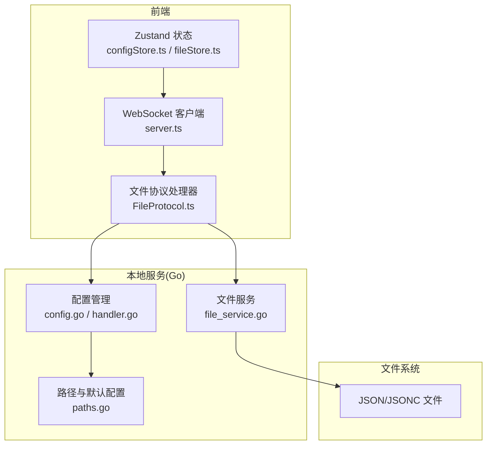
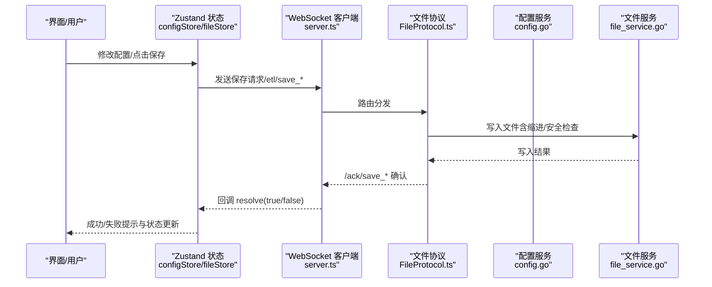
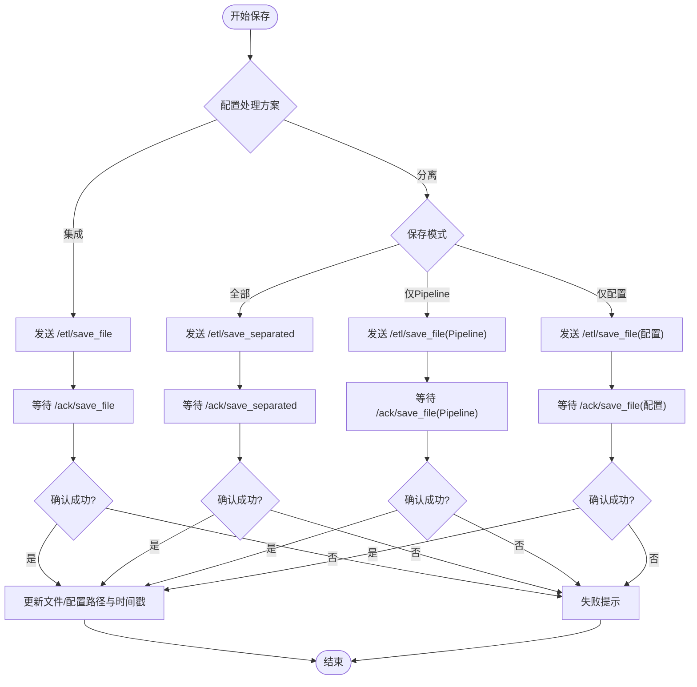
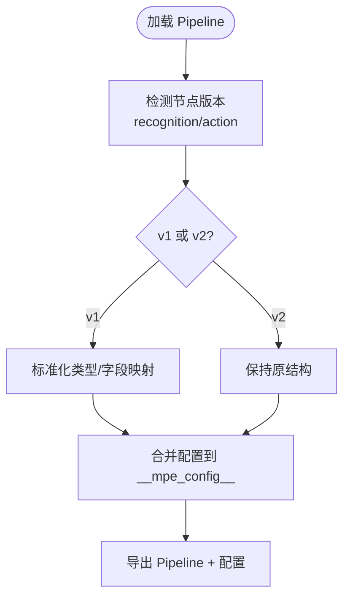
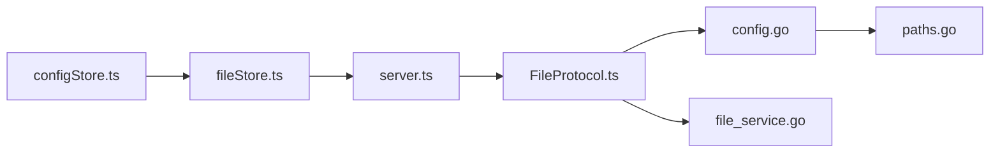

# 配置持久化

<cite>
**本文引用的文件**
- [configStore.ts](file://src/stores/configStore.ts)
- [fileStore.ts](file://src/stores/fileStore.ts)
- [server.ts](file://src/services/server.ts)
- [FileProtocol.ts](file://src/services/protocols/FileProtocol.ts)
- [configSplitter.ts](file://src/core/parser/configSplitter.ts)
- [versionDetector.ts](file://src/core/parser/versionDetector.ts)
- [config.go](file://LocalBridge/internal/config/config.go)
- [handler.go](file://LocalBridge/internal/protocol/config/handler.go)
- [paths.go](file://LocalBridge/internal/paths/paths.go)
- [file_service.go](file://LocalBridge/internal/service/file/file_service.go)
- [90.导入与导出.md](file://docsite/docs/01.指南/10.工作流面板/90.导入与导出.md)
</cite>

## 目录
1. [简介](#简介)
2. [项目结构](#项目结构)
3. [核心组件](#核心组件)
4. [架构总览](#架构总览)
5. [详细组件分析](#详细组件分析)
6. [依赖分析](#依赖分析)
7. [性能考虑](#性能考虑)
8. [故障排查指南](#故障排查指南)
9. [结论](#结论)
10. [附录](#附录)

## 简介
本文件围绕 MaaPipelineEditor（MPE）的“配置持久化”机制进行系统化说明，重点涵盖以下方面：
- 两种配置存储模式：集成方案与分离方案的差异、适用场景与配置方法
- 实现原理：前端 Zustand 状态管理、后端 Go 配置服务、文件系统持久化之间的协作
- 流程细节：配置加载与保存的完整链路，包括初始化检查、默认值设置、增量更新、冲突解决
- 版本管理：配置格式变更与向后兼容策略、迁移步骤
- 备份与恢复、验证与错误处理、性能优化最佳实践

## 项目结构
MPE 的配置持久化涉及三层协同：
- 前端（React + Zustand）：管理用户界面配置与文件状态，通过 WebSocket 与本地服务通信
- 本地服务（Go）：提供文件读写、配置管理、版本检测与兼容处理
- 文件系统：实际落盘，支持分离模式下的多文件组织

图示来源
- [configStore.ts](file://src/stores/configStore.ts)
- [fileStore.ts](file://src/stores/fileStore.ts)
- [server.ts](file://src/services/server.ts)
- [FileProtocol.ts](file://src/services/protocols/FileProtocol.ts)
- [config.go](file://LocalBridge/internal/config/config.go)
- [handler.go](file://LocalBridge/internal/protocol/config/handler.go)
- [paths.go](file://LocalBridge/internal/paths/paths.go)
- [file_service.go](file://LocalBridge/internal/service/file/file_service.go)

章节来源
- [configStore.ts](file://src/stores/configStore.ts)
- [fileStore.ts](file://src/stores/fileStore.ts)
- [server.ts](file://src/services/server.ts)
- [FileProtocol.ts](file://src/services/protocols/FileProtocol.ts)
- [config.go](file://LocalBridge/internal/config/config.go)
- [handler.go](file://LocalBridge/internal/protocol/config/handler.go)
- [paths.go](file://LocalBridge/internal/paths/paths.go)
- [file_service.go](file://LocalBridge/internal/service/file/file_service.go)

## 核心组件
- 前端配置中心（Zustand）
  - 统一管理界面配置、导出行为、缩进、主题、实时预览、文件自动重载等
  - 提供配置分类映射与替换逻辑，保证前后端一致性
- 文件仓库（Zustand）
  - 维护多文件状态、当前文件、节点顺序、视口位置、外部修改标记等
  - 负责保存流程：根据模式生成 Pipeline/Config 内容并通过协议发送
- WebSocket 与协议
  - 本地服务握手、路由注册、ACK 等机制
  - 文件协议处理保存确认、文件变更通知、自动重载
- 本地配置与文件服务（Go）
  - Viper 默认值与路径规范化、配置保存、安全检查
  - 文件读写、JSONC 解析、缩进控制、最近写入去抖

章节来源
- [configStore.ts](file://src/stores/configStore.ts)
- [fileStore.ts](file://src/stores/fileStore.ts)
- [server.ts](file://src/services/server.ts)
- [FileProtocol.ts](file://src/services/protocols/FileProtocol.ts)
- [config.go](file://LocalBridge/internal/config/config.go)
- [file_service.go](file://LocalBridge/internal/service/file/file_service.go)

## 架构总览
配置持久化采用“前端状态驱动 + 本地服务落盘”的双层设计：
- 前端负责“如何保存”（模式、缩进、增量），后端负责“保存到哪里”（路径、权限、安全）
- 通过 WebSocket 协议桥接，确保保存结果的可靠确认与文件变更的即时反馈

图示来源
- [server.ts](file://src/services/server.ts)
- [FileProtocol.ts](file://src/services/protocols/FileProtocol.ts)
- [config.go](file://LocalBridge/internal/config/config.go)
- [file_service.go](file://LocalBridge/internal/service/file/file_service.go)

## 详细组件分析

### 配置存储模式：集成方案 vs 分离方案
- 集成方案
  - 配置嵌入 Pipeline 文件的 __mpe_config__ 字段，导出为单一 JSON/JSONC 文件
  - 适合单文件分享、保持可视化信息完整
- 分离方案
  - Pipeline 与配置分别保存为不同文件：.mpe.json 与 .json/.jsonc
  - 适合版本控制、团队协作、保持 Pipeline 代码纯净
- 模式切换与导出选项
  - 前端配置项会同步影响导出行为与 UI 提示
  - 分离模式下，配置文件以 . 开头，便于隐藏与隔离

章节来源
- [90.导入与导出.md](file://docsite/docs/01.指南/10.工作流面板/90.导入与导出.md)
- [configStore.ts](file://src/stores/configStore.ts)
- [fileStore.ts](file://src/stores/fileStore.ts)

### 前端状态管理（Zustand）
- 配置分类与映射
  - 将配置按键归类到面板、Pipeline、通信、AI 等类别，便于导出与迁移
  - 提供 replaceConfig 与 setConfig，自动同步 configHandlingMode 与 isExportConfig
- 文件状态
  - 维护 files 数组、currentFile、节点顺序、视口位置、外部修改标记
  - 本地持久化：localStorage 缓存文件与配置，避免刷新丢失

章节来源
- [configStore.ts](file://src/stores/configStore.ts)
- [fileStore.ts](file://src/stores/fileStore.ts)

### 保存流程与确认机制
- 保存决策
  - 根据 configHandlingMode 决定走 “/etl/save_file” 或 “/etl/save_separated”
  - 支持仅保存 Pipeline 或仅保存配置的“单项保存”
- 确认与回滚
  - FileProtocol.waitForSaveAck 注册 Promise，等待 /ack/save_file 或 /ack/save_separated
  - 超时（默认 10 秒）自动失败，避免阻塞
  - 成功后更新文件路径、配置路径、最后同步时间，并忽略近期写入导致的文件变更通知

图示来源
- [fileStore.ts](file://src/stores/fileStore.ts)
- [FileProtocol.ts](file://src/services/protocols/FileProtocol.ts)

章节来源
- [fileStore.ts](file://src/stores/fileStore.ts)
- [FileProtocol.ts](file://src/services/protocols/FileProtocol.ts)

### 后端配置服务与文件系统
- 配置加载与默认值
  - Viper 设置默认值，必要时创建默认配置文件
  - 路径规范化：绝对化、存在性校验、日志目录处理
- 配置更新与保存
  - 通过 /etl/config/set 接收前端更新，合并后保存到文件
  - 保存成功后广播 /lte/config/data，携带最新配置与路径
- 文件读写与安全
  - JSONC 解析、缩进控制、最近写入去抖、错误封装
  - 防止自身写入触发文件变更事件，提升体验

章节来源
- [config.go](file://LocalBridge/internal/config/config.go)
- [handler.go](file://LocalBridge/internal/protocol/config/handler.go)
- [paths.go](file://LocalBridge/internal/paths/paths.go)
- [file_service.go](file://LocalBridge/internal/service/file/file_service.go)

### 配置版本管理与迁移
- 版本检测
  - 识别 recognition/action 字段版本，支持 v1/v2 差异
  - 类型标准化与错误抛出，保证字段一致性
- 配置拆分与合并
  - 分离模式下，将 __mpe_config__ 中的节点位置、连接等配置抽取为独立结构
  - 合并时保留原始键顺序，确保导出一致性
- 迁移策略
  - 通过版本检测与字段映射，将旧版字段迁移到新版结构
  - 保持向后兼容：旧版字段仍可读取，但导出时统一到新格式

图示来源
- [versionDetector.ts](file://src/core/parser/versionDetector.ts)
- [configSplitter.ts](file://src/core/parser/configSplitter.ts)

章节来源
- [versionDetector.ts](file://src/core/parser/versionDetector.ts)
- [configSplitter.ts](file://src/core/parser/configSplitter.ts)

### 配置加载与初始化
- 前端
  - 启动时从 localStorage 恢复文件与配置，确保体验连续性
  - 若无本地缓存，使用默认值初始化
- 后端
  - EnsureConfigFile 确保默认配置文件存在，避免首次启动失败
  - Load 读取并解析配置，normalize 规范化路径

章节来源
- [fileStore.ts](file://src/stores/fileStore.ts)
- [paths.go](file://LocalBridge/internal/paths/paths.go)
- [config.go](file://LocalBridge/internal/config/config.go)

### 冲突解决与自动重载
- 文件变更通知
  - 本地服务推送 /lte/file_changed，前端 FileProtocol 统一处理
- 自动重载策略
  - 若启用 fileAutoReload，则直接请求重新加载
  - 否则弹窗提示，支持“稍后处理/自动重载/重新加载”三选
- 最近写入去抖
  - 保存完成后短暂忽略文件变更通知，避免循环触发

章节来源
- [FileProtocol.ts](file://src/services/protocols/FileProtocol.ts)
- [file_service.go](file://LocalBridge/internal/service/file/file_service.go)

### 配置验证与错误处理
- 前端
  - 保存超时自动失败，避免 UI 卡死
  - 本地存储配额不足时给出明确提示
- 后端
  - JSONC 解析失败、文件写入失败均封装为错误模型
  - 配置更新失败返回具体错误码与消息
- 安全检查
  - 根目录安全检查：高/中/低风险提示与建议

章节来源
- [FileProtocol.ts](file://src/services/protocols/FileProtocol.ts)
- [file_service.go](file://LocalBridge/internal/service/file/file_service.go)
- [config.go](file://LocalBridge/internal/config/config.go)

## 依赖分析
- 前端依赖
  - configStore 与 fileStore 互相配合，前者决定“如何保存”，后者决定“保存什么”
  - server.ts 作为 WebSocket 客户端，集中注册协议路由
  - FileProtocol 作为文件相关消息的中枢处理器
- 后端依赖
  - config.go 依赖 viper、paths、eventbus、logger
  - file_service.go 依赖 utils（JSONC）、watcher（文件监听）

图示来源
- [configStore.ts](file://src/stores/configStore.ts)
- [fileStore.ts](file://src/stores/fileStore.ts)
- [server.ts](file://src/services/server.ts)
- [FileProtocol.ts](file://src/services/protocols/FileProtocol.ts)
- [config.go](file://LocalBridge/internal/config/config.go)
- [file_service.go](file://LocalBridge/internal/service/file/file_service.go)
- [paths.go](file://LocalBridge/internal/paths/paths.go)

章节来源
- [configStore.ts](file://src/stores/configStore.ts)
- [fileStore.ts](file://src/stores/fileStore.ts)
- [server.ts](file://src/services/server.ts)
- [FileProtocol.ts](file://src/services/protocols/FileProtocol.ts)
- [config.go](file://LocalBridge/internal/config/config.go)
- [file_service.go](file://LocalBridge/internal/service/file/file_service.go)
- [paths.go](file://LocalBridge/internal/paths/paths.go)

## 性能考虑
- 保存确认超时：默认 10 秒，避免长时间阻塞
- 最近写入去抖：保存后短暂忽略变更通知，降低 UI 抖动
- 缩进控制：通过配置项统一缩进，减少文件体积与 diff
- 自动重载：在 fileAutoReload 开启时减少交互成本
- 路径规范化：提前绝对化与存在性检查，避免运行期异常

## 故障排查指南
- 无法连接本地服务
  - 检查端口占用与服务状态，确认握手协议版本一致
- 保存失败
  - 查看 /ack/* 确认是否超时或后端返回错误
  - 检查文件权限与磁盘空间
- 配置未生效
  - 部分配置需重启服务才生效，参考后端返回消息
- 文件被外部修改
  - 启用自动重载或手动重新加载
  - 若出现循环提示，检查文件监听与去抖逻辑

章节来源
- [server.ts](file://src/services/server.ts)
- [FileProtocol.ts](file://src/services/protocols/FileProtocol.ts)
- [file_service.go](file://LocalBridge/internal/service/file/file_service.go)

## 结论
MPE 的配置持久化通过“前端状态 + 本地服务 + 文件系统”的分层设计，实现了灵活的保存模式、可靠的确认机制与完善的错误处理。集成与分离两种模式满足不同场景需求；版本检测与迁移保障了向前兼容；自动重载与去抖提升了用户体验。遵循本文的配置方法、迁移步骤与最佳实践，可在复杂工程中稳定地管理配置。

## 附录

### 配置迁移步骤（从旧版本到新版本）
- 使用版本检测识别 v1/v2 字段结构
- 通过字段映射与标准化，将旧字段迁移到新格式
- 导出时统一到新结构，保留键顺序与节点配置
- 如需保留旧格式兼容，可在导入时做反向映射

章节来源
- [versionDetector.ts](file://src/core/parser/versionDetector.ts)
- [configSplitter.ts](file://src/core/parser/configSplitter.ts)

### 配置备份与恢复策略
- 前端：定期导出 Pipeline + 配置（分离模式更易备份）
- 后端：默认配置文件路径可通过接口查询，定期复制
- 文件系统：分离模式下，.mpe.json 与 .json/.jsonc 可独立备份

章节来源
- [90.导入与导出.md](file://docsite/docs/01.指南/10.工作流面板/90.导入与导出.md)
- [config.go](file://LocalBridge/internal/config/config.go)