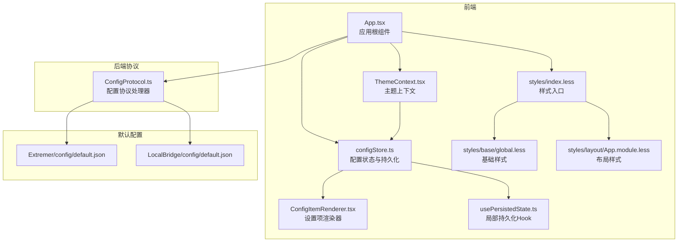
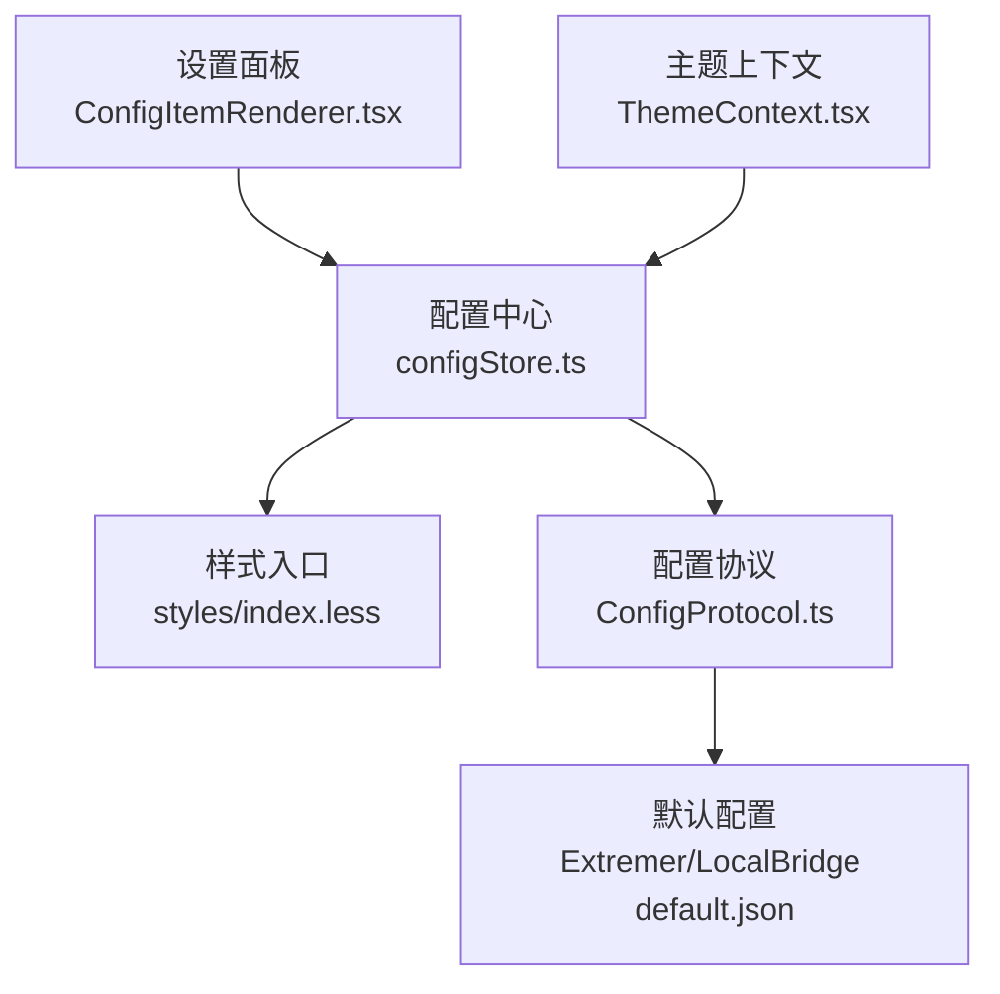
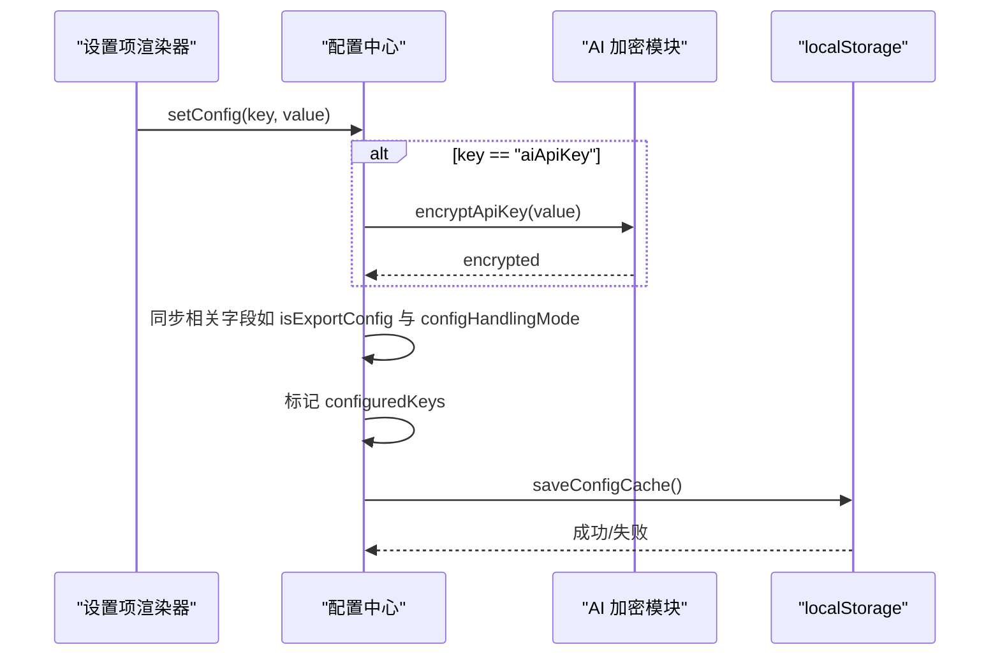
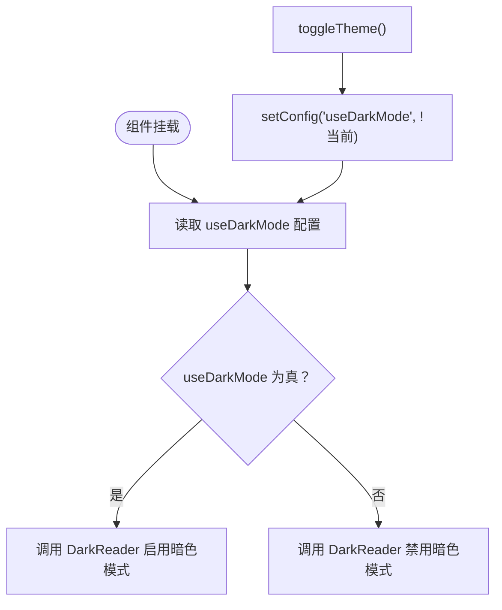
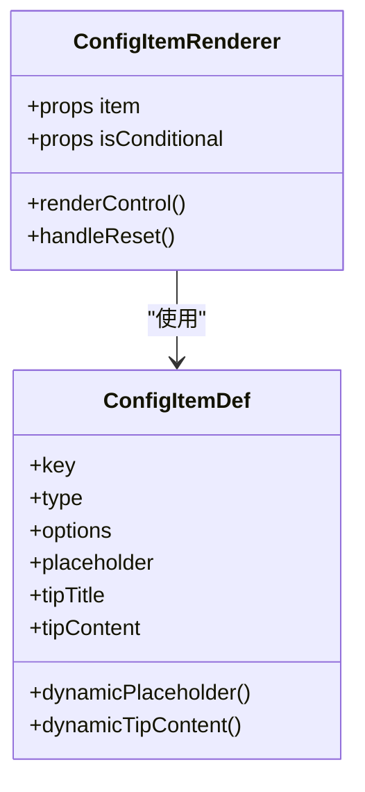
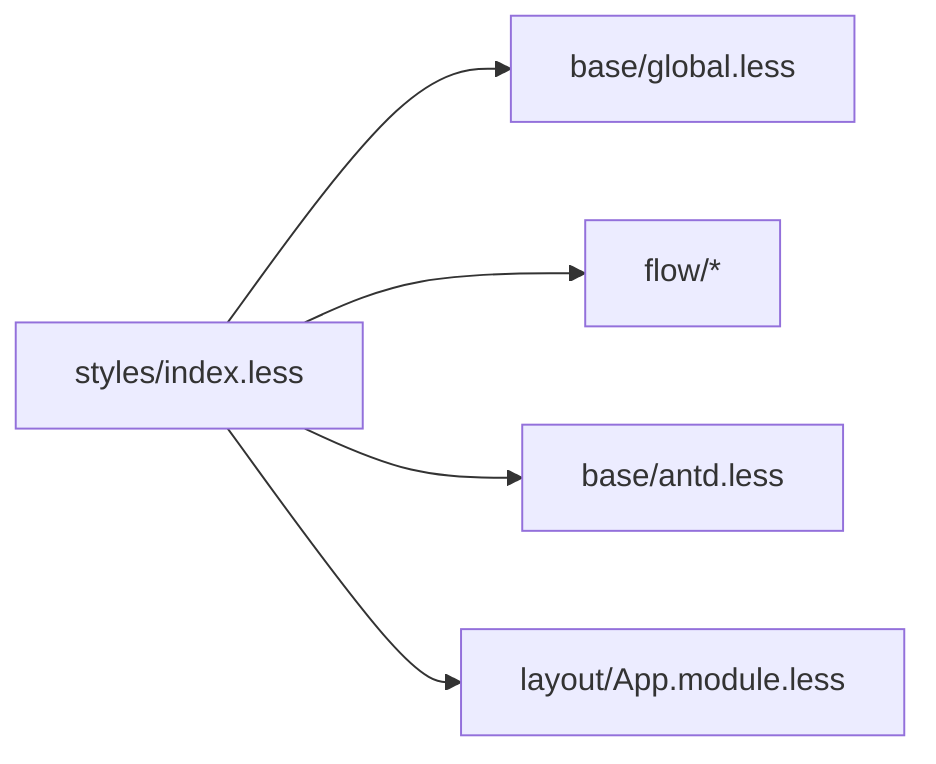
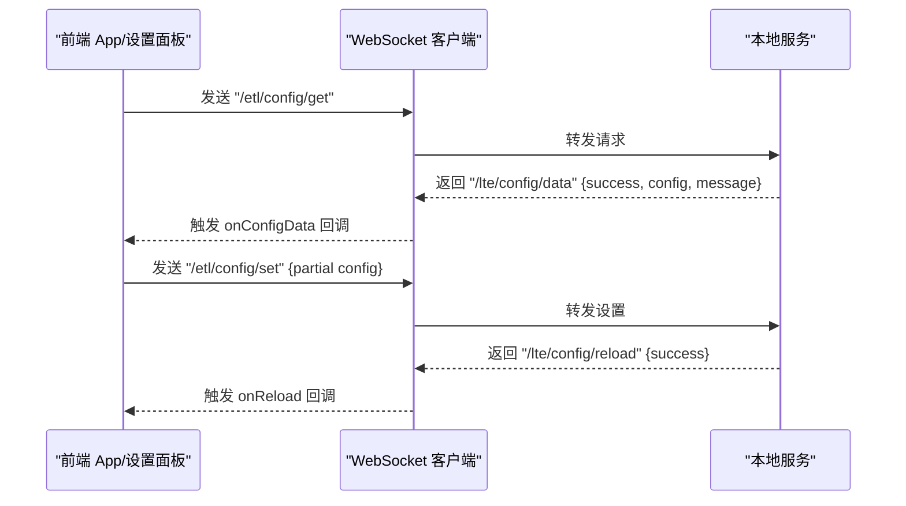
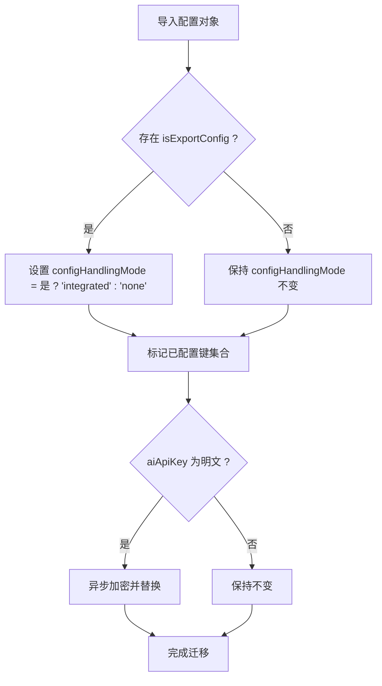
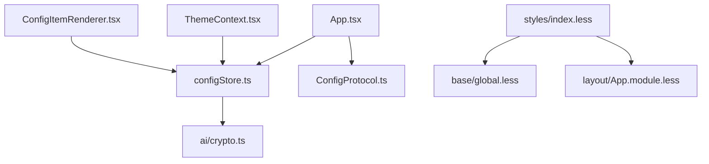
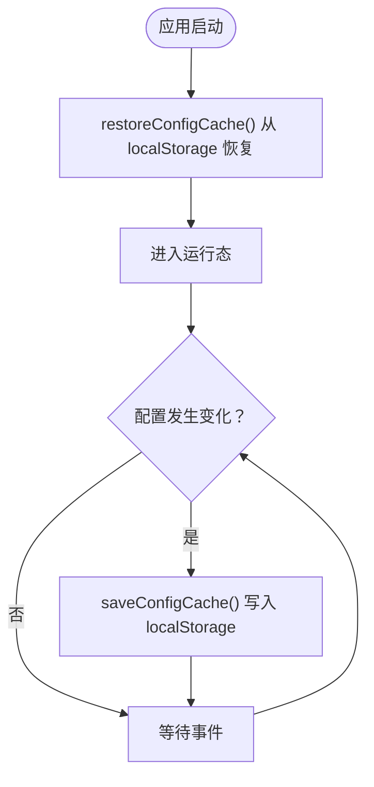

# 配置与主题

<cite>
**本文引用的文件**
- [Extremer/config/default.json](file://Extremer/config/default.json)
- [LocalBridge/config/default.json](file://LocalBridge/config/default.json)
- [src/stores/configStore.ts](file://src/stores/configStore.ts)
- [src/contexts/ThemeContext.tsx](file://src/contexts/ThemeContext.tsx)
- [src/utils/ai/crypto.ts](file://src/utils/ai/crypto.ts)
- [src/services/protocols/ConfigProtocol.ts](file://src/services/protocols/ConfigProtocol.ts)
- [src/styles/index.less](file://src/styles/index.less)
- [src/styles/base/global.less](file://src/styles/base/global.less)
- [src/styles/layout/App.module.less](file://src/styles/layout/App.module.less)
- [src/components/panels/settings/ConfigItemRenderer.tsx](file://src/components/panels/settings/ConfigItemRenderer.tsx)
- [src/hooks/usePersistedState.ts](file://src/hooks/usePersistedState.ts)
- [src/App.tsx](file://src/App.tsx)
</cite>

## 目录
1. [引言](#引言)
2. [项目结构](#项目结构)
3. [核心组件](#核心组件)
4. [架构总览](#架构总览)
5. [详细组件分析](#详细组件分析)
6. [依赖关系分析](#依赖关系分析)
7. [性能考量](#性能考量)
8. [故障排查指南](#故障排查指南)
9. [结论](#结论)
10. [附录](#附录)

## 引言
本文件聚焦于“配置与主题”系统，围绕以下目标展开：
- 应用配置系统的设计与存储机制
- 主题与样式定制的实现原理
- 用户偏好设置的管理与持久化
- 配置缓存与同步的优化策略
- 样式系统的架构与模块化设计
- 主题扩展与自定义样式的实现指导
- 配置迁移与版本兼容性处理

## 项目结构
该系统横跨前端 Zustand Store、React 上下文、Ant Design 渲染器、Less 样式体系以及后端 WebSocket 协议层。整体采用“配置中心 + 视图渲染 + 样式模块”的分层组织方式。

**图表来源**
- [src/App.tsx:136-597](file://src/App.tsx#L136-L597)
- [src/contexts/ThemeContext.tsx:1-68](file://src/contexts/ThemeContext.tsx#L1-L68)
- [src/stores/configStore.ts:1-440](file://src/stores/configStore.ts#L1-L440)
- [src/components/panels/settings/ConfigItemRenderer.tsx:1-281](file://src/components/panels/settings/ConfigItemRenderer.tsx#L1-L281)
- [src/styles/index.less:1-30](file://src/styles/index.less#L1-L30)
- [src/styles/base/global.less:1-155](file://src/styles/base/global.less#L1-L155)
- [src/styles/layout/App.module.less:1-32](file://src/styles/layout/App.module.less#L1-L32)
- [src/hooks/usePersistedState.ts:1-37](file://src/hooks/usePersistedState.ts#L1-L37)
- [src/services/protocols/ConfigProtocol.ts:1-197](file://src/services/protocols/ConfigProtocol.ts#L1-L197)
- [Extremer/config/default.json:1-34](file://Extremer/config/default.json#L1-L34)
- [LocalBridge/config/default.json:1-29](file://LocalBridge/config/default.json#L1-L29)

**章节来源**
- [src/App.tsx:136-597](file://src/App.tsx#L136-L597)
- [src/styles/index.less:1-30](file://src/styles/index.less#L1-L30)

## 核心组件
- 配置中心（Zustand Store）
  - 提供统一配置对象、批量替换、重置、已配置追踪、状态位管理
  - 支持配置缓存到 localStorage 的持久化与恢复
  - 内置敏感配置（如 AI Key）加密存储
- 主题上下文（React Context + DarkReader）
  - 将“深色模式”偏好与暗色引擎联动，提供切换与设置能力
- 设置项渲染器（Ant Design 控件）
  - 基于配置定义动态渲染开关、下拉、数值、文本、滑条等控件
- 样式入口与模块化
  - Less 入口聚合基础、全局、流程与 Antd 样式
  - 布局与面板采用模块化样式文件，便于扩展与覆盖
- 后端配置协议
  - 通过 WebSocket 路由获取/设置/重载后端配置，并广播更新

**章节来源**
- [src/stores/configStore.ts:1-440](file://src/stores/configStore.ts#L1-L440)
- [src/contexts/ThemeContext.tsx:1-68](file://src/contexts/ThemeContext.tsx#L1-L68)
- [src/components/panels/settings/ConfigItemRenderer.tsx:1-281](file://src/components/panels/settings/ConfigItemRenderer.tsx#L1-L281)
- [src/styles/index.less:1-30](file://src/styles/index.less#L1-L30)
- [src/services/protocols/ConfigProtocol.ts:1-197](file://src/services/protocols/ConfigProtocol.ts#L1-L197)

## 架构总览
配置与主题系统以“配置中心”为核心，贯穿“渲染层（设置面板）”、“主题层（深色模式）”、“样式层（Less 模块化）”，并通过“后端协议层”实现与本地服务的配置同步。

**图表来源**
- [src/components/panels/settings/ConfigItemRenderer.tsx:1-281](file://src/components/panels/settings/ConfigItemRenderer.tsx#L1-L281)
- [src/stores/configStore.ts:1-440](file://src/stores/configStore.ts#L1-L440)
- [src/contexts/ThemeContext.tsx:1-68](file://src/contexts/ThemeContext.tsx#L1-L68)
- [src/styles/index.less:1-30](file://src/styles/index.less#L1-L30)
- [src/services/protocols/ConfigProtocol.ts:1-197](file://src/services/protocols/ConfigProtocol.ts#L1-L197)
- [Extremer/config/default.json:1-34](file://Extremer/config/default.json#L1-L34)
- [LocalBridge/config/default.json:1-29](file://LocalBridge/config/default.json#L1-L29)

## 详细组件分析

### 配置中心与持久化（Zustand）
- 设计要点
  - 配置分类映射：将配置项归类到导出、节点、连接、画布、组件、本地服务、AI、管理等维度，便于筛选与导出
  - 默认值与类型安全：集中定义默认值与类型，保证初始一致性
  - 已配置追踪：记录用户实际修改过的键集合，用于“恢复默认”与导出过滤
  - 敏感信息加密：AI Key 在写入时自动加密，解密仅在需要时进行
  - 配置迁移：从旧字段（如 isExportConfig）迁移到新字段（configHandlingMode），并兼容明文 Key
  - 缓存与同步：订阅配置变化，自动保存到 localStorage；应用启动时恢复
- 关键行为序列

**图表来源**
- [src/components/panels/settings/ConfigItemRenderer.tsx:1-281](file://src/components/panels/settings/ConfigItemRenderer.tsx#L1-L281)
- [src/stores/configStore.ts:270-440](file://src/stores/configStore.ts#L270-L440)
- [src/utils/ai/crypto.ts:1-120](file://src/utils/ai/crypto.ts#L1-L120)

**章节来源**
- [src/stores/configStore.ts:118-440](file://src/stores/configStore.ts#L118-L440)
- [src/utils/ai/crypto.ts:1-120](file://src/utils/ai/crypto.ts#L1-L120)

### 主题与暗色引擎集成
- 设计要点
  - 通过 React Context 暴露 isDark、toggleTheme、setTheme
  - 与 DarkReader 引擎联动：启用/禁用暗色模式，并设置亮度、对比度、色差等参数
  - 与配置中心联动：主题偏好来自 useDarkMode 配置项
- 流程图

**图表来源**
- [src/contexts/ThemeContext.tsx:22-56](file://src/contexts/ThemeContext.tsx#L22-L56)
- [src/stores/configStore.ts:270-311](file://src/stores/configStore.ts#L270-L311)

**章节来源**
- [src/contexts/ThemeContext.tsx:1-68](file://src/contexts/ThemeContext.tsx#L1-L68)
- [src/stores/configStore.ts:270-311](file://src/stores/configStore.ts#L270-L311)

### 设置项渲染器（动态控件）
- 设计要点
  - 支持多种控件类型：开关、下拉、数值、输入、多行文本、密码、滑条、按钮（含自定义）
  - 动态占位符与提示内容：根据当前配置动态计算
  - 修改标记：当值不同于默认值时显示修改标记，并提供“恢复默认”
  - 自定义渲染：通过自定义渲染器扩展复杂控件
- 类图（简化）

**图表来源**
- [src/components/panels/settings/ConfigItemRenderer.tsx:17-281](file://src/components/panels/settings/ConfigItemRenderer.tsx#L17-L281)

**章节来源**
- [src/components/panels/settings/ConfigItemRenderer.tsx:1-281](file://src/components/panels/settings/ConfigItemRenderer.tsx#L1-L281)

### 样式系统与模块化
- 设计要点
  - 样式入口聚合基础、全局、流程与 Antd 样式
  - 基础样式提供通用工具类与 Antd 覆盖
  - 布局样式采用模块化命名空间，隔离不同区域
  - 与主题上下文配合，实现深色模式下的颜色变量适配
- 结构示意

**图表来源**
- [src/styles/index.less:1-30](file://src/styles/index.less#L1-L30)
- [src/styles/base/global.less:1-155](file://src/styles/base/global.less#L1-L155)
- [src/styles/layout/App.module.less:1-32](file://src/styles/layout/App.module.less#L1-L32)

**章节来源**
- [src/styles/index.less:1-30](file://src/styles/index.less#L1-L30)
- [src/styles/base/global.less:1-155](file://src/styles/base/global.less#L1-L155)
- [src/styles/layout/App.module.less:1-32](file://src/styles/layout/App.module.less#L1-L32)

### 后端配置协议与同步
- 设计要点
  - 定义后端配置数据结构与响应体
  - 通过 WebSocket 路由：/etl/config/get、/etl/config/set、/etl/config/reload
  - 提供配置数据回调与重载回调注册机制
  - 错误提示与成功反馈
- 交互序列

**图表来源**
- [src/services/protocols/ConfigProtocol.ts:60-197](file://src/services/protocols/ConfigProtocol.ts#L60-L197)

**章节来源**
- [src/services/protocols/ConfigProtocol.ts:1-197](file://src/services/protocols/ConfigProtocol.ts#L1-L197)

### 配置迁移与版本兼容
- 设计要点
  - 从 isExportConfig 迁移到 configHandlingMode，并保持双向同步
  - 自动识别并迁移明文 AI Key 至加密格式
  - 导入配置时批量标记 configuredKeys，避免误判“未配置”
- 流程图

**图表来源**
- [src/stores/configStore.ts:312-366](file://src/stores/configStore.ts#L312-L366)
- [src/utils/ai/crypto.ts:116-120](file://src/utils/ai/crypto.ts#L116-L120)

**章节来源**
- [src/stores/configStore.ts:312-366](file://src/stores/configStore.ts#L312-L366)
- [src/utils/ai/crypto.ts:116-120](file://src/utils/ai/crypto.ts#L116-L120)

## 依赖关系分析
- 组件耦合
  - App.tsx 作为根组件，订阅配置变化并触发缓存保存
  - ThemeContext 依赖配置中心中的 useDarkMode
  - 设置项渲染器依赖配置中心的 configs 与 setConfig
  - 样式入口依赖基础与布局模块
  - ConfigProtocol 依赖 WebSocket 服务器与后端约定的数据结构
- 外部依赖
  - DarkReader：深色模式引擎
  - Ant Design：控件与样式基线
  - Web Crypto API：AI Key 加密

**图表来源**
- [src/App.tsx:366-379](file://src/App.tsx#L366-L379)
- [src/contexts/ThemeContext.tsx:22-56](file://src/contexts/ThemeContext.tsx#L22-L56)
- [src/components/panels/settings/ConfigItemRenderer.tsx:24-55](file://src/components/panels/settings/ConfigItemRenderer.tsx#L24-L55)
- [src/styles/index.less:1-30](file://src/styles/index.less#L1-L30)
- [src/stores/configStore.ts:270-311](file://src/stores/configStore.ts#L270-L311)
- [src/utils/ai/crypto.ts:1-120](file://src/utils/ai/crypto.ts#L1-L120)

**章节来源**
- [src/App.tsx:366-379](file://src/App.tsx#L366-L379)
- [src/contexts/ThemeContext.tsx:22-56](file://src/contexts/ThemeContext.tsx#L22-L56)
- [src/components/panels/settings/ConfigItemRenderer.tsx:24-55](file://src/components/panels/settings/ConfigItemRenderer.tsx#L24-L55)
- [src/styles/index.less:1-30](file://src/styles/index.less#L1-L30)
- [src/stores/configStore.ts:270-311](file://src/stores/configStore.ts#L270-L311)
- [src/utils/ai/crypto.ts:1-120](file://src/utils/ai/crypto.ts#L1-L120)

## 性能考量
- 配置订阅与缓存
  - 使用 subscribe 精准捕获配置变化，避免全量重渲染
  - 缓存保存采用节流式触发，减少频繁 IO
- 渲染优化
  - 设置项渲染器使用 memo 包装，降低无效重渲染
  - 控件按需渲染，动态占位与提示内容通过 useMemo 计算
- 样式加载
  - Less 模块化拆分，按需引入，避免全局污染
  - Antd 覆盖通过 :global 限定作用域，减少样式冲突
- 暗色引擎
  - 仅在 useDarkMode 变化时切换 DarkReader，避免无谓计算

[本节为通用性能建议，不直接分析具体文件]

## 故障排查指南
- 配置无法持久化
  - 检查 localStorage 是否可用，确认 saveConfigCache() 是否抛错
  - 确认 App.tsx 中的订阅是否生效
- AI Key 无法保存或解密失败
  - 检查加密前缀与格式，确认 PBKDF2 参数与 IV 长度
  - 若解密失败，返回空值属预期，避免泄露密文
- 深色模式不生效
  - 确认 useDarkMode 配置项与 DarkReader 调用链路
  - 检查样式入口是否正确引入基础与布局样式
- 后端配置不同步
  - 检查 WebSocket 路由是否正确注册与发送
  - 确认后端返回的 success 与 message 字段

**章节来源**
- [src/App.tsx:366-379](file://src/App.tsx#L366-L379)
- [src/stores/configStore.ts:417-440](file://src/stores/configStore.ts#L417-L440)
- [src/utils/ai/crypto.ts:64-102](file://src/utils/ai/crypto.ts#L64-L102)
- [src/contexts/ThemeContext.tsx:26-37](file://src/contexts/ThemeContext.tsx#L26-L37)
- [src/services/protocols/ConfigProtocol.ts:80-122](file://src/services/protocols/ConfigProtocol.ts#L80-L122)

## 结论
本系统通过“配置中心 + 渲染器 + 主题上下文 + 样式模块 + 后端协议”的协同，实现了：
- 结构清晰的配置模型与强类型的默认值
- 高效的持久化与缓存同步策略
- 安全的敏感信息加密与迁移兼容
- 可扩展的主题与样式体系
- 与本地服务的配置同步与反馈

## 附录

### 配置缓存与同步流程（补充）

**图表来源**
- [src/stores/configStore.ts:417-440](file://src/stores/configStore.ts#L417-L440)
- [src/App.tsx:366-379](file://src/App.tsx#L366-L379)

### 主题扩展与自定义样式指导
- 主题扩展
  - 在 ThemeContext 中调整 DarkReader 参数或引入其他主题引擎
  - 通过配置中心新增主题相关键值，驱动 UI 变化
- 自定义样式
  - 在 styles/base/global.less 中添加或覆盖通用类
  - 在对应模块（如 layout、panels）使用模块化 less 文件进行局部覆盖
  - 通过 Antd 的 ConfigProvider 或 CSS 变量进行主题色系定制

**章节来源**
- [src/contexts/ThemeContext.tsx:22-56](file://src/contexts/ThemeContext.tsx#L22-L56)
- [src/styles/base/global.less:1-155](file://src/styles/base/global.less#L1-L155)
- [src/styles/layout/App.module.less:1-32](file://src/styles/layout/App.module.less#L1-L32)