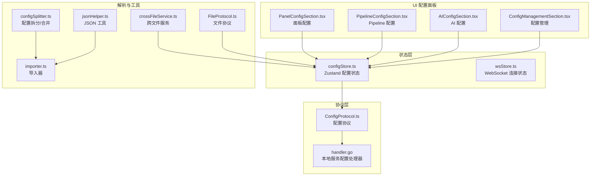
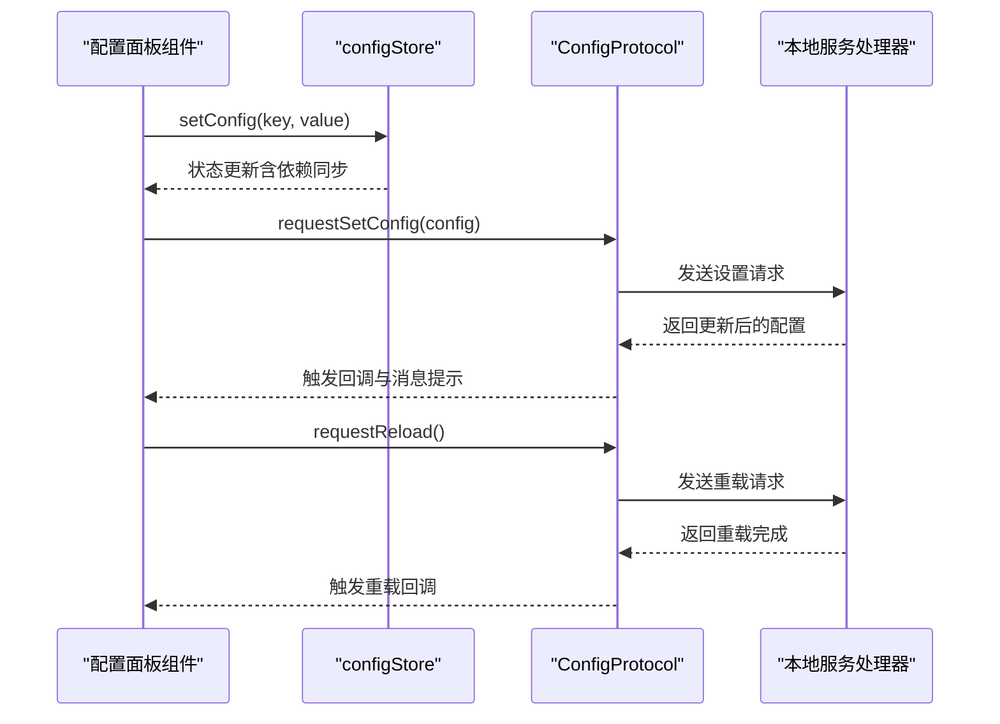
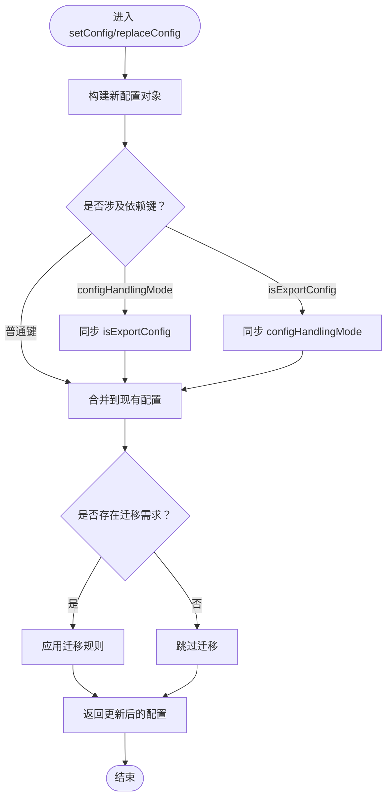
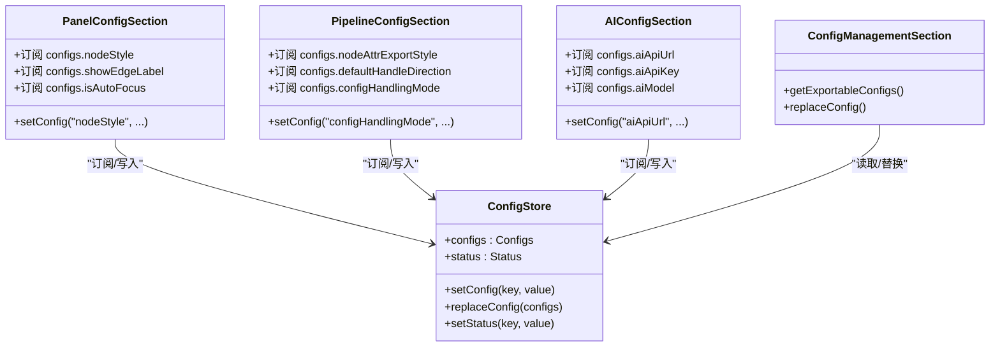
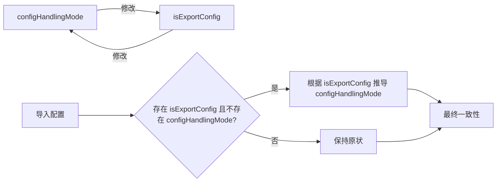
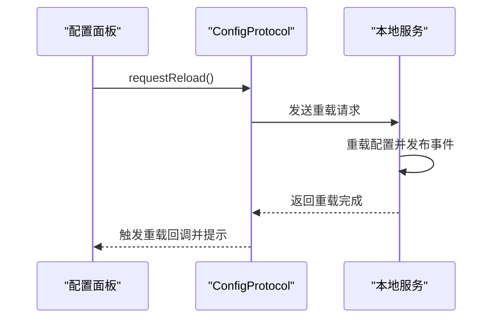
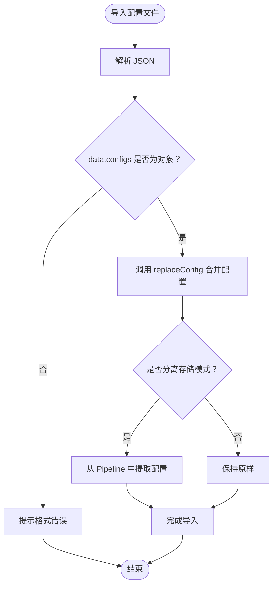
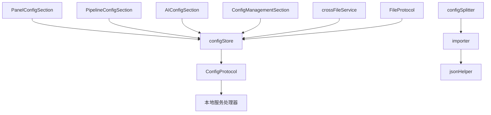

# 前端配置系统

<cite>
**本文档引用的文件**
- [configStore.ts](file://src/stores/configStore.ts)
- [PanelConfigSection.tsx](file://src/components/panels/config/PanelConfigSection.tsx)
- [PipelineConfigSection.tsx](file://src/components/panels/config/PipelineConfigSection.tsx)
- [AIConfigSection.tsx](file://src/components/panels/config/AIConfigSection.tsx)
- [ConfigManagementSection.tsx](file://src/components/panels/config/ConfigManagementSection.tsx)
- [BackendConfigModal.tsx](file://src/components/modals/BackendConfigModal.tsx)
- [ConfigProtocol.ts](file://src/services/protocols/ConfigProtocol.ts)
- [handler.go](file://LocalBridge/internal/protocol/config/handler.go)
- [crossFileService.ts](file://src/services/crossFileService.ts)
- [FileProtocol.ts](file://src/services/protocols/FileProtocol.ts)
- [configSplitter.ts](file://src/core/parser/configSplitter.ts)
- [importer.ts](file://src/core/parser/importer.ts)
- [jsonHelper.ts](file://src/utils/jsonHelper.ts)
</cite>

## 目录
1. [简介](#简介)
2. [项目结构](#项目结构)
3. [核心组件](#核心组件)
4. [架构总览](#架构总览)
5. [详细组件分析](#详细组件分析)
6. [依赖关系分析](#依赖关系分析)
7. [性能考虑](#性能考虑)
8. [故障排除指南](#故障排除指南)
9. [结论](#结论)
10. [附录](#附录)

## 简介
本文件全面解析 MaaPipelineEditor 前端配置系统，基于 Zustand 状态管理实现，涵盖配置分类（面板、Pipeline、通信、AI）、配置项定义与默认值、setConfig 与 replaceConfig 方法的工作机制、配置项间的依赖关系与同步（如 isExportConfig 与 configHandlingMode 的双向绑定）、配置持久化与热重载、配置验证与迁移策略，以及新增配置项的最佳实践。

## 项目结构
前端配置系统主要分布在以下模块：
- 状态存储：Zustand store（配置状态与UI状态）
- 配置面板：四个配置分组的可视化组件
- 协议层：与本地服务通信的配置协议
- 解析器：配置拆分与合并、导入导出逻辑
- 工具：JSON 辅助、跨文件服务等

**图表来源**
- [configStore.ts:163-267](file://src/stores/configStore.ts#L163-L267)
- [PanelConfigSection.tsx:1-456](file://src/components/panels/config/PanelConfigSection.tsx#L1-L456)
- [PipelineConfigSection.tsx:1-274](file://src/components/panels/config/PipelineConfigSection.tsx#L1-L274)
- [AIConfigSection.tsx:1-148](file://src/components/panels/config/AIConfigSection.tsx#L1-L148)
- [ConfigManagementSection.tsx:1-138](file://src/components/panels/config/ConfigManagementSection.tsx#L1-L138)
- [ConfigProtocol.ts:72-122](file://src/services/protocols/ConfigProtocol.ts#L72-L122)
- [handler.go:26-47](file://LocalBridge/internal/protocol/config/handler.go#L26-L47)
- [configSplitter.ts:1-50](file://src/core/parser/configSplitter.ts#L1-L50)
- [importer.ts:197-249](file://src/core/parser/importer.ts#L197-L249)
- [jsonHelper.ts:1-28](file://src/utils/jsonHelper.ts#L1-L28)
- [crossFileService.ts:1-565](file://src/services/crossFileService.ts#L1-L565)
- [FileProtocol.ts:440-487](file://src/services/protocols/FileProtocol.ts#L440-L487)

**章节来源**
- [configStore.ts:1-268](file://src/stores/configStore.ts#L1-L268)
- [PanelConfigSection.tsx:1-456](file://src/components/panels/config/PanelConfigSection.tsx#L1-L456)
- [PipelineConfigSection.tsx:1-274](file://src/components/panels/config/PipelineConfigSection.tsx#L1-L274)
- [AIConfigSection.tsx:1-148](file://src/components/panels/config/AIConfigSection.tsx#L1-L148)
- [ConfigManagementSection.tsx:1-138](file://src/components/panels/config/ConfigManagementSection.tsx#L1-L138)

## 核心组件
- 配置分类与映射：通过 configCategoryMap 将配置项归类到 panel、pipeline、communication、ai 四个类别，用于导出过滤与管理。
- 配置状态结构：包含 configs（配置项集合）与 status（UI状态）两部分，提供 setConfig 与 replaceConfig 方法。
- 默认值：在 configs 初始化中统一设置，确保首次使用的一致性体验。
- 依赖同步：setConfig 与 replaceConfig 内部实现了关键配置项的双向绑定，如 configHandlingMode 与 isExportConfig。

**章节来源**
- [configStore.ts:17-62](file://src/stores/configStore.ts#L17-L62)
- [configStore.ts:95-161](file://src/stores/configStore.ts#L95-L161)
- [configStore.ts:165-211](file://src/stores/configStore.ts#L165-L211)
- [configStore.ts:212-254](file://src/stores/configStore.ts#L212-L254)

## 架构总览
配置系统采用“状态驱动 + 协议通信 + 解析工具”的分层设计：
- 状态层：Zustand store 维护配置与UI状态，提供 setConfig/replaceConfig 等方法。
- 视图层：各配置面板组件订阅 store，通过 setConfig 修改配置。
- 协议层：ConfigProtocol 与本地服务 handler.go 交互，支持获取、设置与重载配置。
- 解析层：configSplitter 与 importer 支持分离/集成导出与导入时的配置合并与迁移。

**图表来源**
- [PanelConfigSection.tsx:47](file://src/components/panels/config/PanelConfigSection.tsx#L47)
- [PipelineConfigSection.tsx:33](file://src/components/panels/config/PipelineConfigSection.tsx#L33)
- [AIConfigSection.tsx:15](file://src/components/panels/config/AIConfigSection.tsx#L15)
- [ConfigProtocol.ts:72-122](file://src/services/protocols/ConfigProtocol.ts#L72-L122)
- [handler.go:71-171](file://LocalBridge/internal/protocol/config/handler.go#L71-L171)

## 详细组件分析

### 配置存储与状态管理
- 配置分类映射：configCategoryMap 将每个配置项归属到 panel/pipeline/communication/ai，用于 getExportableConfigs 过滤导出。
- 配置项类型与默认值：在 configs 初始化中集中定义，包含布尔、数值、字符串、枚举等类型，确保类型安全与一致性。
- setConfig 工作原理：
  - 创建新配置对象，更新指定键值。
  - 若修改的是 configHandlingMode，则同步更新 isExportConfig（非 none 则为 true，否则为 false）。
  - 若修改的是 isExportConfig，则同步更新 configHandlingMode（true 为 integrated，false 为 none）。
- replaceConfig 工作原理：
  - 仅接受已知配置项，过滤掉未知键。
  - 合并新旧配置，优先使用新值。
  - 迁移逻辑：若存在旧字段 isExportConfig 且不存在 configHandlingMode，则根据 isExportConfig 推导 configHandlingMode。
  - 最终保证 configHandlingMode 与 isExportConfig 的一致性。

**图表来源**
- [configStore.ts:212-254](file://src/stores/configStore.ts#L212-L254)

**章节来源**
- [configStore.ts:24-62](file://src/stores/configStore.ts#L24-L62)
- [configStore.ts:95-161](file://src/stores/configStore.ts#L95-L161)
- [configStore.ts:165-211](file://src/stores/configStore.ts#L165-L211)
- [configStore.ts:212-254](file://src/stores/configStore.ts#L212-L254)

### 配置面板组件
- 面板配置（PanelConfigSection）：管理节点样式、边标签、自动聚焦、磁吸对齐、不透明度、画布背景、面板模式、内嵌缩放、模板图片显示、实时画面预览等。
- Pipeline 配置（PipelineConfigSection）：管理节点属性导出形式、默认端点方向、导出默认识别/动作、Pipeline 导出版本、字段校验开关、JSON 缩进、配置处理方案（集成/分离/不导出）。
- AI 配置（AIConfigSection）：管理 AI 服务的 API URL、API Key、模型名称，并提供连接测试。
- 配置管理（ConfigManagementSection）：提供配置导出/导入功能，支持自定义模板同步。

**图表来源**
- [PanelConfigSection.tsx:10-47](file://src/components/panels/config/PanelConfigSection.tsx#L10-L47)
- [PipelineConfigSection.tsx:13-34](file://src/components/panels/config/PipelineConfigSection.tsx#L13-L34)
- [AIConfigSection.tsx:11-15](file://src/components/panels/config/AIConfigSection.tsx#L11-L15)
- [ConfigManagementSection.tsx:15-25](file://src/components/panels/config/ConfigManagementSection.tsx#L15-L25)
- [configStore.ts:145-161](file://src/stores/configStore.ts#L145-L161)

**章节来源**
- [PanelConfigSection.tsx:1-456](file://src/components/panels/config/PanelConfigSection.tsx#L1-L456)
- [PipelineConfigSection.tsx:1-274](file://src/components/panels/config/PipelineConfigSection.tsx#L1-L274)
- [AIConfigSection.tsx:1-148](file://src/components/panels/config/AIConfigSection.tsx#L1-L148)
- [ConfigManagementSection.tsx:1-138](file://src/components/panels/config/ConfigManagementSection.tsx#L1-L138)

### 配置依赖关系与同步机制
- isExportConfig 与 configHandlingMode 的双向绑定：
  - 修改 configHandlingMode 时，isExportConfig 自动跟随（非 none 为 true）。
  - 修改 isExportConfig 时，configHandlingMode 自动跟随（true 为 integrated，false 为 none）。
- 迁移逻辑：
  - replaceConfig 会检测旧字段 isExportConfig 并自动推导 configHandlingMode。
  - 最终保证两者一致性，避免配置冲突。

**图表来源**
- [configStore.ts:216-221](file://src/stores/configStore.ts#L216-L221)
- [configStore.ts:236-250](file://src/stores/configStore.ts#L236-L250)

**章节来源**
- [configStore.ts:212-254](file://src/stores/configStore.ts#L212-L254)

### 配置持久化与热重载
- 本地持久化：
  - 配置通过 setConfig/replaceConfig 更新后，立即反映在内存状态中。
  - 导出/导入功能支持将配置与自定义模板打包为 JSON 文件，便于备份与分享。
- 热重载机制：
  - 通过 ConfigProtocol.requestReload() 发送重载请求到本地服务。
  - 本地服务处理器接收请求后发布重载事件，完成配置重载。
  - UI 层监听重载回调，提示用户并更新状态。

**图表来源**
- [BackendConfigModal.tsx:184-201](file://src/components/modals/BackendConfigModal.tsx#L184-L201)
- [ConfigProtocol.ts:104-122](file://src/services/protocols/ConfigProtocol.ts#L104-L122)
- [handler.go:173-204](file://LocalBridge/internal/protocol/config/handler.go#L173-L204)

**章节来源**
- [ConfigManagementSection.tsx:27-102](file://src/components/panels/config/ConfigManagementSection.tsx#L27-L102)
- [BackendConfigModal.tsx:83-133](file://src/components/modals/BackendConfigModal.tsx#L83-L133)
- [ConfigProtocol.ts:72-122](file://src/services/protocols/ConfigProtocol.ts#L72-L122)
- [handler.go:26-47](file://LocalBridge/internal/protocol/config/handler.go#L26-L47)

### 配置验证与迁移
- 导入验证：
  - ConfigManagementSection 在导入时检查 data.configs 是否为对象，避免格式错误导致异常。
- 解析与迁移：
  - importer.ts 在导入 Pipeline 时解析配置并执行迁移（如 migratePipelineV5）。
  - configSplitter.ts 支持分离存储模式，将配置从 Pipeline 对象中提取到独立的 .mpe.json 文件。
- JSON 工具：
  - jsonHelper.ts 提供对象判断、字符串转 JSON、JSON 转字符串等辅助方法，保障配置序列化/反序列化安全。

**图表来源**
- [ConfigManagementSection.tsx:60-102](file://src/components/panels/config/ConfigManagementSection.tsx#L60-L102)
- [importer.ts:197-249](file://src/core/parser/importer.ts#L197-L249)
- [configSplitter.ts:21-50](file://src/core/parser/configSplitter.ts#L21-L50)
- [jsonHelper.ts:1-28](file://src/utils/jsonHelper.ts#L1-L28)

**章节来源**
- [ConfigManagementSection.tsx:60-102](file://src/components/panels/config/ConfigManagementSection.tsx#L60-L102)
- [importer.ts:197-249](file://src/core/parser/importer.ts#L197-L249)
- [configSplitter.ts:1-50](file://src/core/parser/configSplitter.ts#L1-L50)
- [jsonHelper.ts:1-28](file://src/utils/jsonHelper.ts#L1-L28)

### 跨文件与自动重载
- 跨文件搜索与导航：
  - crossFileService.ts 提供跨文件节点搜索、跳转与自动完成，支持启用/禁用跨文件搜索。
- 文件自动重载：
  - FileProtocol.ts 在检测到文件变更时，根据配置决定自动重载或弹窗提示，提升开发效率。

**章节来源**
- [crossFileService.ts:68-199](file://src/services/crossFileService.ts#L68-L199)
- [FileProtocol.ts:440-487](file://src/services/protocols/FileProtocol.ts#L440-L487)

## 依赖关系分析
- 组件与 store 的耦合：
  - 配置面板组件通过 useConfigStore 订阅状态，通过 setConfig/replaceConfig 写入，保持低耦合高内聚。
- 协议与本地服务：
  - ConfigProtocol 作为 UI 与本地服务的桥梁，封装了请求与响应处理，避免 UI 直接依赖底层实现。
- 解析器与工具：
  - configSplitter 与 importer 依赖 jsonHelper，确保配置拆分与导入的健壮性。

**图表来源**
- [PanelConfigSection.tsx:7](file://src/components/panels/config/PanelConfigSection.tsx#L7)
- [PipelineConfigSection.tsx:7](file://src/components/panels/config/PipelineConfigSection.tsx#L7)
- [AIConfigSection.tsx:7](file://src/components/panels/config/AIConfigSection.tsx#L7)
- [ConfigManagementSection.tsx:11](file://src/components/panels/config/ConfigManagementSection.tsx#L11)
- [configStore.ts:163-267](file://src/stores/configStore.ts#L163-L267)
- [ConfigProtocol.ts:72-122](file://src/services/protocols/ConfigProtocol.ts#L72-L122)
- [handler.go:26-47](file://LocalBridge/internal/protocol/config/handler.go#L26-L47)
- [configSplitter.ts:1-50](file://src/core/parser/configSplitter.ts#L1-L50)
- [importer.ts:197-249](file://src/core/parser/importer.ts#L197-L249)
- [jsonHelper.ts:1-28](file://src/utils/jsonHelper.ts#L1-L28)
- [crossFileService.ts:1-565](file://src/services/crossFileService.ts#L1-L565)
- [FileProtocol.ts:440-487](file://src/services/protocols/FileProtocol.ts#L440-L487)

**章节来源**
- [configStore.ts:163-267](file://src/stores/configStore.ts#L163-L267)
- [ConfigProtocol.ts:72-122](file://src/services/protocols/ConfigProtocol.ts#L72-L122)
- [handler.go:26-47](file://LocalBridge/internal/protocol/config/handler.go#L26-L47)
- [configSplitter.ts:1-50](file://src/core/parser/configSplitter.ts#L1-L50)
- [importer.ts:197-249](file://src/core/parser/importer.ts#L197-L249)
- [jsonHelper.ts:1-28](file://src/utils/jsonHelper.ts#L1-L28)
- [crossFileService.ts:1-565](file://src/services/crossFileService.ts#L1-L565)
- [FileProtocol.ts:440-487](file://src/services/protocols/FileProtocol.ts#L440-L487)

## 性能考虑
- 状态粒度：Zustand 通过细粒度订阅减少不必要的重渲染，面板组件仅订阅所需配置项。
- 导出缩进：Pipeline 配置中的 jsonIndent 控制导出 JSON 的缩进，合理设置可平衡可读性与文件体积。
- 自动重载：FileProtocol 的自动重载与弹窗提示避免频繁手动刷新，提升开发效率。
- 磁吸对齐与边标签：在节点较多时适当关闭边标签与磁吸对齐可降低渲染压力。

## 故障排除指南
- 导入配置失败：
  - 检查导入文件是否为合法 JSON，且包含 data.configs 对象。
  - 使用 replaceConfig 合并配置，未知键会被忽略。
- 热重载无效：
  - 确认已连接本地服务，发送重载请求后等待回调。
  - 若本地服务端口或配置变更需重启服务方可生效。
- 跨文件搜索异常：
  - 确认已连接本地服务，或在未连接状态下仅搜索当前文件。
- AI 配置测试失败：
  - 检查 API URL、API Key、模型名称是否正确，注意浏览器 CORS 限制。

**章节来源**
- [ConfigManagementSection.tsx:60-102](file://src/components/panels/config/ConfigManagementSection.tsx#L60-L102)
- [BackendConfigModal.tsx:83-133](file://src/components/modals/BackendConfigModal.tsx#L83-L133)
- [crossFileService.ts:68-199](file://src/services/crossFileService.ts#L68-L199)
- [AIConfigSection.tsx:120-142](file://src/components/panels/config/AIConfigSection.tsx#L120-L142)

## 结论
MaaPipelineEditor 的前端配置系统以 Zustand 为核心，结合可视化配置面板、协议通信与解析工具，形成了完整的配置生命周期管理。通过严格的配置分类、依赖同步与迁移机制，确保配置的一致性与可维护性；通过热重载与自动重载优化开发体验；通过导出/导入与模板同步实现配置共享与备份。该体系为扩展新配置项提供了清晰的范式与最佳实践。

## 附录

### 新增配置项最佳实践
- 定义类型与默认值：在 configStore.ts 的 configs 初始化中添加新键及其默认值。
- 添加 UI 控件：在对应配置面板组件中添加输入控件，并通过 setConfig 写入。
- 配置分类：在 configCategoryMap 中标注新配置项所属类别，以便导出过滤。
- 依赖同步：如需与其他配置项联动，修改 setConfig/replaceConfig 中的同步逻辑。
- 导入兼容：如涉及旧版本迁移，可在 replaceConfig 中添加迁移规则。
- 验证与提示：在导入时进行格式校验，必要时提供用户提示。

**章节来源**
- [configStore.ts:24-62](file://src/stores/configStore.ts#L24-L62)
- [configStore.ts:165-211](file://src/stores/configStore.ts#L165-L211)
- [configStore.ts:212-254](file://src/stores/configStore.ts#L212-L254)
- [PanelConfigSection.tsx:10-47](file://src/components/panels/config/PanelConfigSection.tsx#L10-L47)
- [PipelineConfigSection.tsx:13-34](file://src/components/panels/config/PipelineConfigSection.tsx#L13-L34)
- [AIConfigSection.tsx:11-15](file://src/components/panels/config/AIConfigSection.tsx#L11-L15)