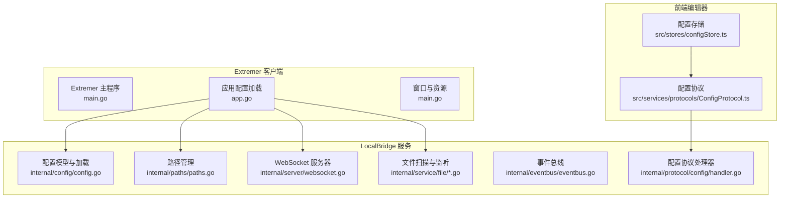
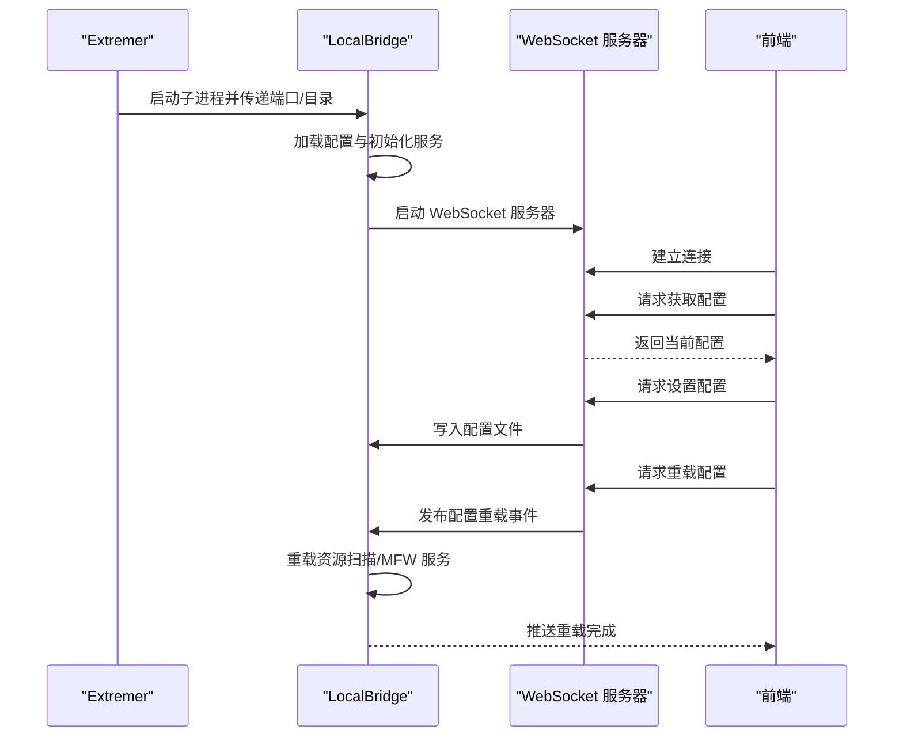
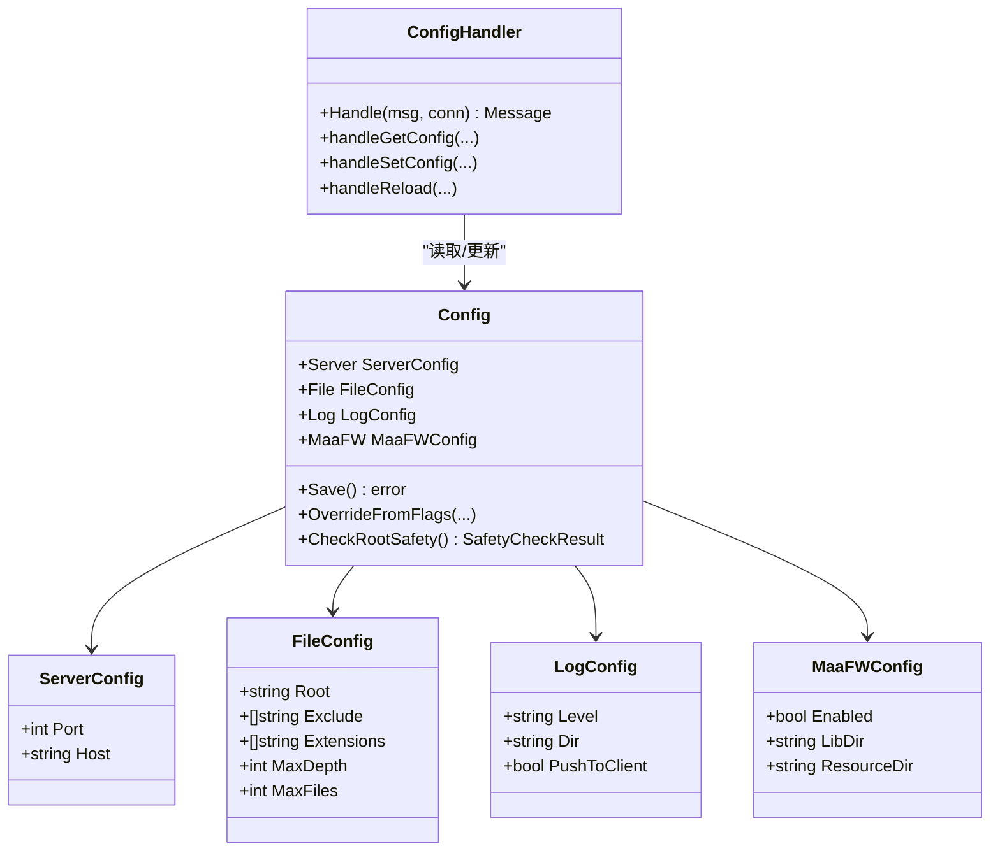
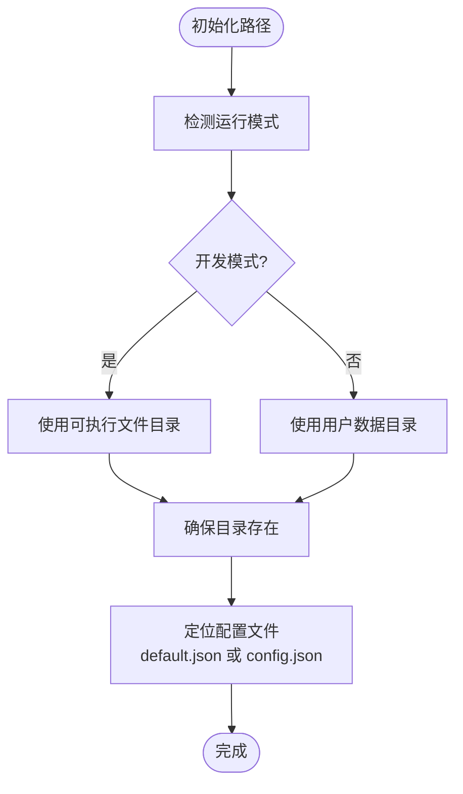
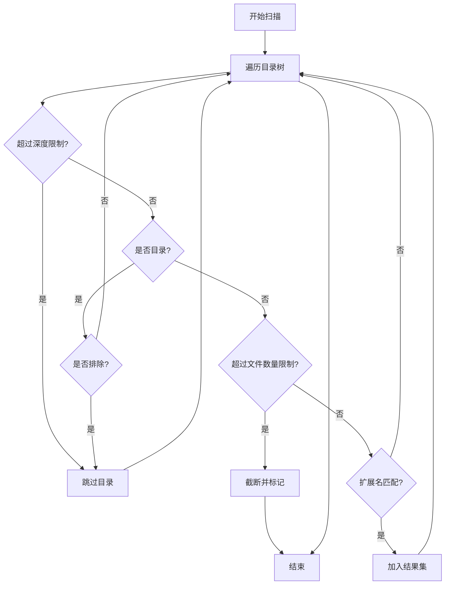
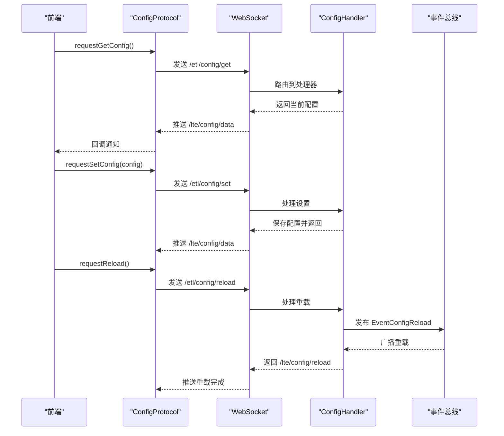
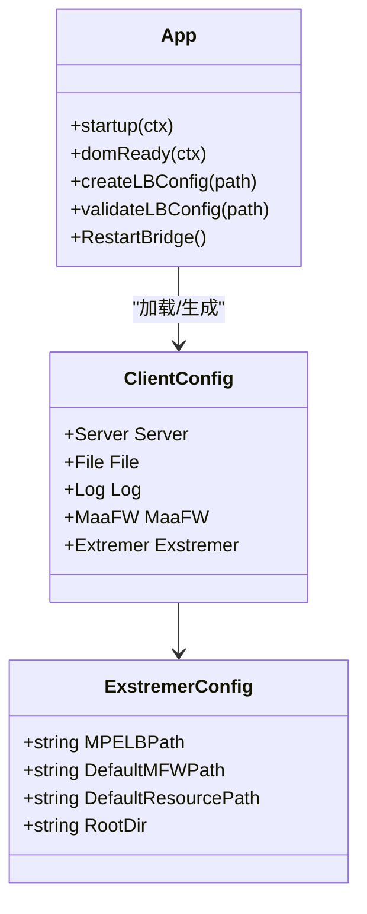
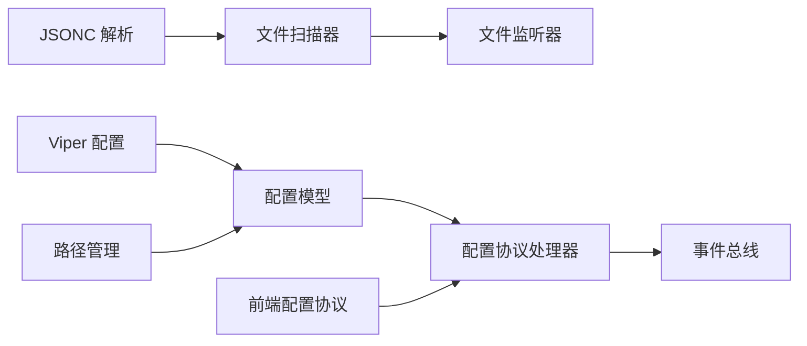

# 后端配置管理

<cite>
**本文档引用的文件**
- [LocalBridge 配置默认文件](file://LocalBridge/config/default.json)
- [Extremer 应用配置默认文件](file://Extremer/config/default.json)
- [LocalBridge 配置模型与加载](file://LocalBridge/internal/config/config.go)
- [LocalBridge 路径管理](file://LocalBridge/internal/paths/paths.go)
- [LocalBridge 文件扫描器](file://LocalBridge/internal/service/file/scanner.go)
- [LocalBridge 文件监听器](file://LocalBridge/internal/service/file/watcher.go)
- [LocalBridge 配置协议处理器](file://LocalBridge/internal/protocol/config/handler.go)
- [LocalBridge 事件总线](file://LocalBridge/internal/eventbus/eventbus.go)
- [LocalBridge JSONC 解析工具](file://LocalBridge/internal/utils/jsonc.go)
- [Extremer 应用主程序](file://Extremer/main.go)
- [Extremer 应用配置加载](file://Extremer/app.go)
- [前端配置存储](file://src/stores/configStore.ts)
- [前端配置协议](file://src/services/protocols/ConfigProtocol.ts)
</cite>

## 目录
1. [引言](#引言)
2. [项目结构](#项目结构)
3. [核心组件](#核心组件)
4. [架构总览](#架构总览)
5. [详细组件分析](#详细组件分析)
6. [依赖关系分析](#依赖关系分析)
7. [性能考量](#性能考量)
8. [故障排查指南](#故障排查指南)
9. [结论](#结论)
10. [附录](#附录)

## 引言
本文件面向 MaaPipelineEditor 的后端配置管理系统，重点围绕 LocalBridge 服务与 Extremer 桌面应用的配置管理展开，涵盖以下主题：
- LocalBridge 服务的配置结构与加载机制（WebSocket 端口、文件扫描、日志、MaaFramework）
- Extremer 桌面应用的配置管理（应用启动参数、窗口设置、资源路径）
- 配置文件的加载优先级与合并策略（默认配置、用户配置、命令行覆盖）
- 配置的动态更新与热重载机制
- 配置格式规范与验证规则（JSON/JSONC）
- 配置安全性与性能优化建议

## 项目结构
本项目采用前后端分离的模块化设计：
- LocalBridge：后端服务，负责文件扫描、资源管理、WebSocket 通信与配置管理
- Extremer：桌面客户端，负责窗口管理、资源路径解析、子进程管理与前端连接
- 前端：基于 React/Zustand 的可视化编辑器，通过 WebSocket 与 LocalBridge 通信

**图表来源**
- [Extremer 主程序:1-90](file://Extremer/main.go#L1-L90)
- [Extremer 应用配置加载:1-620](file://Extremer/app.go#L1-L620)
- [LocalBridge 配置模型与加载:1-339](file://LocalBridge/internal/config/config.go#L1-L339)
- [LocalBridge 路径管理:1-238](file://LocalBridge/internal/paths/paths.go#L1-L238)
- [LocalBridge 文件扫描与监听:1-250](file://LocalBridge/internal/service/file/scanner.go#L1-L250)
- [LocalBridge 事件总线:1-83](file://LocalBridge/internal/eventbus/eventbus.go#L1-L83)
- [前端配置存储:1-268](file://src/stores/configStore.ts#L1-L268)
- [前端配置协议:1-197](file://src/services/protocols/ConfigProtocol.ts#L1-L197)

**章节来源**
- [Extremer 主程序:1-90](file://Extremer/main.go#L1-L90)
- [Extremer 应用配置加载:1-620](file://Extremer/app.go#L1-L620)
- [LocalBridge 配置模型与加载:1-339](file://LocalBridge/internal/config/config.go#L1-L339)
- [LocalBridge 路径管理:1-238](file://LocalBridge/internal/paths/paths.go#L1-L238)
- [LocalBridge 文件扫描与监听:1-250](file://LocalBridge/internal/service/file/scanner.go#L1-L250)
- [LocalBridge 事件总线:1-83](file://LocalBridge/internal/eventbus/eventbus.go#L1-L83)
- [前端配置存储:1-268](file://src/stores/configStore.ts#L1-L268)
- [前端配置协议:1-197](file://src/services/protocols/ConfigProtocol.ts#L1-L197)

## 核心组件
- 配置模型与加载：定义了服务器、文件、日志、MaaFramework 四类配置，并通过 Viper 实现默认值、文件读取与命令行覆盖。
- 路径管理：支持开发模式、便携模式、用户模式三种运行模式，自动创建并维护配置与日志目录。
- 文件扫描与监听：提供受控的文件扫描（深度、数量限制）与文件系统事件监听（防抖），支持 JSONC 解析。
- 配置协议处理器：提供 /etl/config/* 路由，支持获取、设置与内部重载配置。
- 事件总线：统一发布/订阅事件，支撑配置重载的跨服务同步。
- Extremer 客户端：负责窗口设置、资源路径解析、子进程启动与 LocalBridge 配置生成。

**章节来源**
- [LocalBridge 配置模型与加载:1-339](file://LocalBridge/internal/config/config.go#L1-L339)
- [LocalBridge 路径管理:1-238](file://LocalBridge/internal/paths/paths.go#L1-L238)
- [LocalBridge 文件扫描与监听:1-250](file://LocalBridge/internal/service/file/scanner.go#L1-L250)
- [LocalBridge 配置协议处理器:1-237](file://LocalBridge/internal/protocol/config/handler.go#L1-L237)
- [LocalBridge 事件总线:1-83](file://LocalBridge/internal/eventbus/eventbus.go#L1-L83)
- [Extremer 应用配置加载:1-620](file://Extremer/app.go#L1-L620)

## 架构总览
后端配置管理的关键流程如下：
- Extremer 在启动时根据运行模式选择配置文件，生成 LocalBridge 的配置文件，并启动 LocalBridge 子进程。
- LocalBridge 启动后加载配置，初始化日志、文件服务、MFW 服务与 WebSocket 服务器。
- 前端通过 WebSocket 与 LocalBridge 通信，使用 ConfigProtocol 获取/设置配置并触发重载。
- 配置重载通过事件总线广播，资源扫描与 MFW 服务按需重载。

**图表来源**
- [Extremer 应用配置加载:180-304](file://Extremer/app.go#L180-L304)
- [LocalBridge 配置协议处理器:173-204](file://LocalBridge/internal/protocol/config/handler.go#L173-L204)
- [LocalBridge 事件总线:74-82](file://LocalBridge/internal/eventbus/eventbus.go#L74-L82)
- [前端配置协议:128-161](file://src/services/protocols/ConfigProtocol.ts#L128-L161)

**章节来源**
- [Extremer 应用配置加载:180-304](file://Extremer/app.go#L180-L304)
- [LocalBridge 配置协议处理器:173-204](file://LocalBridge/internal/protocol/config/handler.go#L173-L204)
- [LocalBridge 事件总线:74-82](file://LocalBridge/internal/eventbus/eventbus.go#L74-L82)
- [前端配置协议:128-161](file://src/services/protocols/ConfigProtocol.ts#L128-L161)

## 详细组件分析

### LocalBridge 配置结构与加载
- 配置模型
  - 服务器：host、port
  - 文件：root、exclude、extensions、max_depth、max_files
  - 日志：level、dir、push_to_client
  - MaaFramework：enabled、lib_dir、resource_dir
- 默认值与优先级
  - 默认值通过 Viper 设置；若未找到配置文件，则自动创建默认配置文件。
  - 命令行参数可覆盖配置：--root、--log-dir、--log-level、--port。
  - 路径规范化：相对路径转换为绝对路径，并校验目录存在性。
- 安全检查
  - 根目录安全检查：检测是否位于高风险系统目录、驱动器根目录或用户主目录，给出风险等级与建议。
- 动态更新
  - 通过 /etl/config/set 接收前端更新，保存到文件并返回最新配置。
  - 通过 /etl/config/reload 触发内部重载事件，事件总线广播给各服务。

**图表来源**
- [LocalBridge 配置模型与加载:13-48](file://LocalBridge/internal/config/config.go#L13-L48)
- [LocalBridge 配置协议处理器:12-18](file://LocalBridge/internal/protocol/config/handler.go#L12-L18)

**章节来源**
- [LocalBridge 配置模型与加载:1-339](file://LocalBridge/internal/config/config.go#L1-L339)
- [LocalBridge 配置协议处理器:1-237](file://LocalBridge/internal/protocol/config/handler.go#L1-L237)

### 路径管理与运行模式
- 运行模式
  - 本地模式：使用系统用户数据目录
  - 开发模式：可执行文件同目录存在 config 目录时启用
  - 便携模式：用户显式指定，使用可执行文件同目录
- 目录创建
  - 自动创建配置目录与日志目录，确保服务正常运行。
- 配置文件定位
  - 开发模式优先查找 default.json；否则使用 config.json。

**图表来源**
- [LocalBridge 路径管理:72-170](file://LocalBridge/internal/paths/paths.go#L72-L170)

**章节来源**
- [LocalBridge 路径管理:1-238](file://LocalBridge/internal/paths/paths.go#L1-L238)

### 文件扫描与监听
- 扫描器
  - 支持深度与文件数量限制，避免大规模扫描导致性能问题。
  - 排除列表与扩展名过滤，支持 JSONC 解析。
- 监听器
  - 基于 fsnotify 的文件系统事件监听，支持创建、修改、删除、重命名。
  - 防抖机制减少频繁变更带来的抖动。

**图表来源**
- [LocalBridge 文件扫描器:58-147](file://LocalBridge/internal/service/file/scanner.go#L58-L147)

**章节来源**
- [LocalBridge 文件扫描器:1-250](file://LocalBridge/internal/service/file/scanner.go#L1-L250)
- [LocalBridge 文件监听器:1-258](file://LocalBridge/internal/service/file/watcher.go#L1-L258)
- [LocalBridge JSONC 解析工具:1-30](file://LocalBridge/internal/utils/jsonc.go#L1-L30)

### 配置协议与热重载
- 路由
  - /etl/config/get：获取当前配置
  - /etl/config/set：设置配置并保存
  - /etl/config/reload：触发内部重载事件
- 前端交互
  - 前端通过 ConfigProtocol 与后端通信，接收配置数据推送与重载响应。
- 事件总线
  - 发布 EventConfigReload 事件，资源扫描与 MFW 服务按需重载。

**图表来源**
- [前端配置协议:128-161](file://src/services/protocols/ConfigProtocol.ts#L128-L161)
- [LocalBridge 配置协议处理器:25-47](file://LocalBridge/internal/protocol/config/handler.go#L25-L47)
- [LocalBridge 事件总线:74-82](file://LocalBridge/internal/eventbus/eventbus.go#L74-L82)

**章节来源**
- [前端配置协议:1-197](file://src/services/protocols/ConfigProtocol.ts#L1-L197)
- [LocalBridge 配置协议处理器:1-237](file://LocalBridge/internal/protocol/config/handler.go#L1-L237)
- [LocalBridge 事件总线:1-83](file://LocalBridge/internal/eventbus/eventbus.go#L1-L83)

### Extremer 桌面应用配置管理
- 启动参数与窗口设置
  - 窗口标题、尺寸、最小尺寸、初始状态（最大化）、背景色等在 main.go 中配置。
- 资源路径与运行模式
  - 根据运行模式（开发/生产）决定可执行文件目录与资源路径。
  - 默认 MaaFramework 与资源路径在配置文件中定义，支持相对路径解析。
- LocalBridge 配置生成
  - 启动时根据 Extremer 配置生成 LocalBridge 的 config.json，包含 server、file、log、maafw 等字段。
  - 若配置路径无效，自动回退到默认路径。

**图表来源**
- [Extremer 应用配置加载:21-49](file://Extremer/app.go#L21-L49)
- [Extremer 应用配置加载:353-413](file://Extremer/app.go#L353-L413)

**章节来源**
- [Extremer 主程序:1-90](file://Extremer/main.go#L1-L90)
- [Extremer 应用配置加载:1-620](file://Extremer/app.go#L1-L620)

## 依赖关系分析
- 配置加载依赖 Viper 提供的默认值与文件读取能力。
- 路径管理依赖运行时 OS 信息，确保跨平台兼容。
- 文件扫描依赖 JSONC 解析库，提升配置文件可读性。
- 事件总线提供松耦合的跨服务通信，支撑配置重载。
- 前端通过 WebSocket 与后端协议交互，实现配置的实时更新。

**图表来源**
- [LocalBridge 配置模型与加载:103-123](file://LocalBridge/internal/config/config.go#L103-L123)
- [LocalBridge JSONC 解析工具:1-30](file://LocalBridge/internal/utils/jsonc.go#L1-L30)
- [LocalBridge 文件扫描与监听:1-250](file://LocalBridge/internal/service/file/scanner.go#L1-L250)
- [LocalBridge 配置协议处理器:1-237](file://LocalBridge/internal/protocol/config/handler.go#L1-L237)
- [LocalBridge 事件总线:1-83](file://LocalBridge/internal/eventbus/eventbus.go#L1-L83)
- [前端配置协议:1-197](file://src/services/protocols/ConfigProtocol.ts#L1-L197)

**章节来源**
- [LocalBridge 配置模型与加载:1-339](file://LocalBridge/internal/config/config.go#L1-L339)
- [LocalBridge JSONC 解析工具:1-30](file://LocalBridge/internal/utils/jsonc.go#L1-L30)
- [LocalBridge 文件扫描与监听:1-250](file://LocalBridge/internal/service/file/scanner.go#L1-L250)
- [LocalBridge 配置协议处理器:1-237](file://LocalBridge/internal/protocol/config/handler.go#L1-L237)
- [LocalBridge 事件总线:1-83](file://LocalBridge/internal/eventbus/eventbus.go#L1-L83)
- [前端配置协议:1-197](file://src/services/protocols/ConfigProtocol.ts#L1-L197)

## 性能考量
- 文件扫描限制
  - 通过 max_depth 与 max_files 控制扫描规模，避免大规模目录导致性能问题。
- 监听防抖
  - 文件监听器采用 300ms 防抖，降低频繁变更引发的抖动与重复处理。
- 日志推送
  - 可选的日志推送至客户端，便于调试但可能增加网络负载。
- 资源路径有效性
  - 启动时验证 MaaFramework 路径，避免无效路径导致初始化失败与资源浪费。

[本节为通用性能指导，无需特定文件引用]

## 故障排查指南
- 配置文件加载失败
  - 检查配置文件路径与权限，确认默认配置是否正确创建。
  - 参考路径管理模块的目录创建逻辑。
- 根目录安全警告
  - 若出现高风险目录警告，调整扫描根目录为具体项目目录。
- MaaFramework 初始化失败
  - 检查 lib_dir 与 resource_dir 是否有效，必要时通过命令行工具设置。
- WebSocket 连接异常
  - 确认端口分配与防火墙设置，查看前端日志与后端日志推送情况。
- 配置重载未生效
  - 确认事件总线是否正确发布 EventConfigReload，检查资源扫描与 MFW 服务的重载逻辑。

**章节来源**
- [LocalBridge 路径管理:178-190](file://LocalBridge/internal/paths/paths.go#L178-L190)
- [LocalBridge 配置模型与加载:223-296](file://LocalBridge/internal/config/config.go#L223-L296)
- [Extremer 应用配置加载:580-597](file://Extremer/app.go#L580-L597)
- [前端配置协议:128-161](file://src/services/protocols/ConfigProtocol.ts#L128-L161)

## 结论
本配置管理系统通过清晰的配置模型、灵活的路径管理与严格的运行模式控制，实现了 LocalBridge 服务的稳定运行与可维护性。配合 Extremer 的资源路径解析与子进程管理，以及前端的实时配置交互，形成了完整的后端配置管理闭环。通过限制扫描规模、防抖监听与事件总线重载机制，系统在保证功能完整性的同时兼顾了性能与用户体验。

[本节为总结性内容，无需特定文件引用]

## 附录

### 配置文件格式规范与验证规则
- JSON/JSONC 支持
  - 支持行注释、块注释与尾随逗号，使用 JSONC 解析工具进行标准化处理。
- 必填项与默认值
  - 服务器：port、host（默认 9066、localhost）
  - 文件：exclude、extensions（默认常见忽略目录与 .json/.jsonc）、max_depth、max_files
  - 日志：level、push_to_client（默认 INFO、true）
  - MaaFramework：enabled、lib_dir、resource_dir
- 路径规范
  - 支持相对路径，启动时自动转换为绝对路径并校验存在性。
- 前端配置映射
  - 前端配置存储中包含通信相关选项（wsPort、wsAutoConnect、fileAutoReload、enableCrossFileSearch），用于控制前端行为与后端交互。

**章节来源**
- [LocalBridge 配置默认文件:1-29](file://LocalBridge/config/default.json#L1-L29)
- [Extremer 应用配置默认文件:1-34](file://Extremer/config/default.json#L1-L34)
- [LocalBridge JSONC 解析工具:9-23](file://LocalBridge/internal/utils/jsonc.go#L9-L23)
- [前端配置存储:94-144](file://src/stores/configStore.ts#L94-L144)