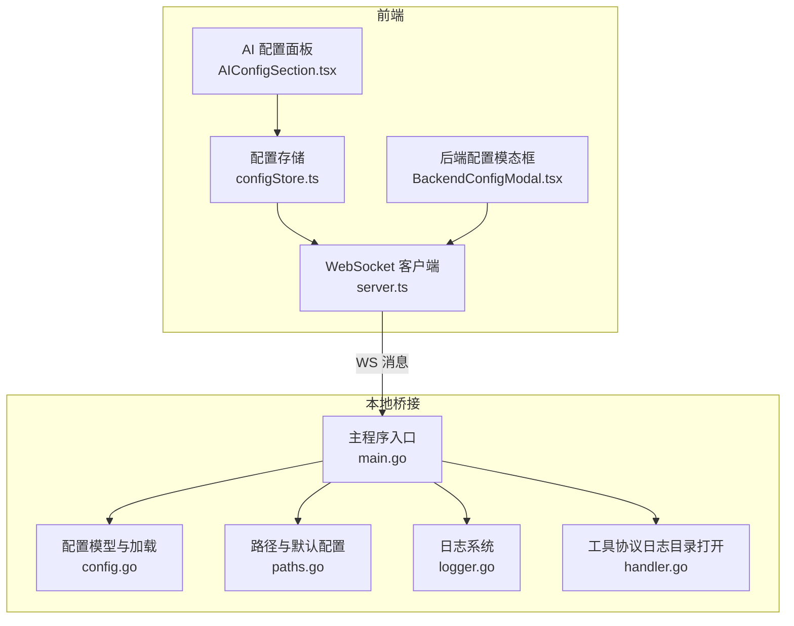
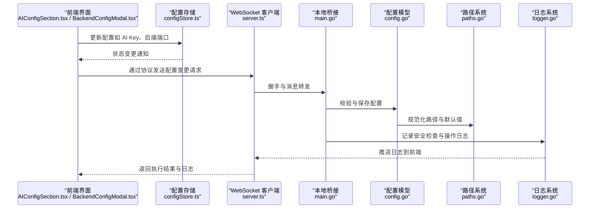
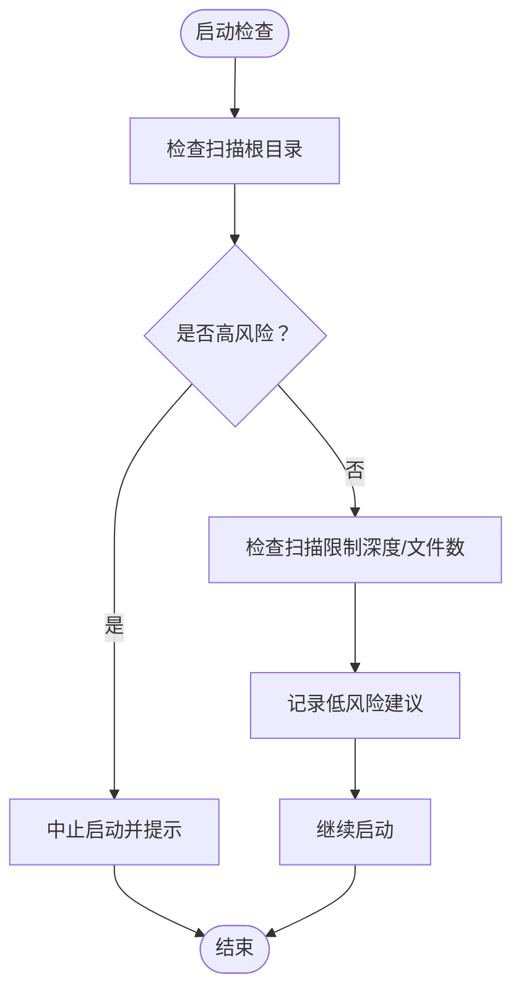
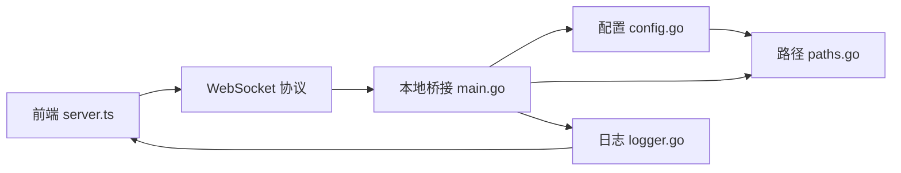

# 配置安全与权限

<cite>
**本文引用的文件**
- [Extremer 配置 default.json](file://Extremer/config/default.json)
- [LocalBridge 配置 default.json](file://LocalBridge/config/default.json)
- [AI 配置面板 AIConfigSection.tsx](file://src/components/panels/config/AIConfigSection.tsx)
- [后端配置模态框 BackendConfigModal.tsx](file://src/components/modals/BackendConfigModal.tsx)
- [配置存储 configStore.ts](file://src/stores/configStore.ts)
- [本地桥接配置 config.go](file://LocalBridge/internal/config/config.go)
- [本地桥接路径 paths.go](file://LocalBridge/internal/paths/paths.go)
- [本地桥接主程序 main.go](file://LocalBridge/cmd/lb/main.go)
- [本地桥接日志 logger.go](file://LocalBridge/internal/logger/logger.go)
- [本地桥接工具协议 handler.go](file://LocalBridge/internal/protocol/utility/handler.go)
- [前端 WebSocket 服务 server.ts](file://src/services/server.ts)
</cite>

## 目录
1. [简介](#简介)
2. [项目结构](#项目结构)
3. [核心组件](#核心组件)
4. [架构总览](#架构总览)
5. [详细组件分析](#详细组件分析)
6. [依赖分析](#依赖分析)
7. [性能考虑](#性能考虑)
8. [故障排查指南](#故障排查指南)
9. [结论](#结论)
10. [附录](#附录)

## 简介
本文件聚焦于 MaaPipelineEditor 的配置安全与权限管理，围绕以下目标展开：
- 敏感配置信息保护：API 密钥、认证令牌等敏感数据的存储与传输安全
- 配置访问权限控制：用户权限分级、配置修改的权限验证
- 配置文件加密与解密：本地配置的加密存储与网络传输安全保障
- 配置注入攻击防护与安全审计：异常行为检测与审计日志
- 最佳实践：最小权限原则、定期安全审查、异常访问检测
- 应急响应：配置泄露后的处置流程与数据恢复策略

## 项目结构
本项目采用前后端分离架构，前端通过 WebSocket 与本地桥接服务交互；本地桥接服务负责加载与持久化配置、执行安全检查与日志管理。

**图表来源**
- [前端 WebSocket 服务 server.ts:20-331](file://src/services/server.ts#L20-L331)
- [配置存储 configStore.ts:95-267](file://src/stores/configStore.ts#L95-L267)
- [AI 配置面板 AIConfigSection.tsx:37-77](file://src/components/panels/config/AIConfigSection.tsx#L37-L77)
- [后端配置模态框 BackendConfigModal.tsx:60-163](file://src/components/modals/BackendConfigModal.tsx#L60-L163)
- [本地桥接主程序 main.go:206-279](file://LocalBridge/cmd/lb/main.go#L206-L279)
- [本地桥接配置 config.go:42-212](file://LocalBridge/internal/config/config.go#L42-L212)
- [本地桥接路径 paths.go:151-176](file://LocalBridge/internal/paths/paths.go#L151-L176)
- [本地桥接日志 logger.go:42-100](file://LocalBridge/internal/logger/logger.go#L42-L100)
- [本地桥接工具协议 handler.go:609-634](file://LocalBridge/internal/protocol/utility/handler.go#L609-L634)

**章节来源**
- [前端 WebSocket 服务 server.ts:20-331](file://src/services/server.ts#L20-L331)
- [本地桥接主程序 main.go:206-279](file://LocalBridge/cmd/lb/main.go#L206-L279)

## 核心组件
- 配置存储与分类：前端使用 zustand 存储配置，并按“面板/流水线/通信/AI”分类，便于导出与权限控制
- 本地桥接配置模型：定义 server、file、log、maafw 等配置项，支持默认值、路径规范化与安全检查
- 路径与默认配置：根据运行模式选择用户数据目录或便携模式，确保配置文件与日志目录存在
- 日志系统：支持控制台与文件双通道，具备历史日志缓存与过期清理
- WebSocket 通信：前端通过本地 WS 与本地桥接交互，握手阶段进行协议版本校验

**章节来源**
- [配置存储 configStore.ts:17-62](file://src/stores/configStore.ts#L17-L62)
- [本地桥接配置 config.go:13-48](file://LocalBridge/internal/config/config.go#L13-L48)
- [本地桥接路径 paths.go:151-176](file://LocalBridge/internal/paths/paths.go#L151-L176)
- [本地桥接日志 logger.go:42-100](file://LocalBridge/internal/logger/logger.go#L42-L100)
- [前端 WebSocket 服务 server.ts:20-65](file://src/services/server.ts#L20-L65)

## 架构总览
下图展示配置安全与权限的关键交互路径：前端配置变更经由协议层下发至本地桥接，本地桥接执行安全检查与持久化，日志系统记录审计信息。

**图表来源**
- [AI 配置面板 AIConfigSection.tsx:37-77](file://src/components/panels/config/AIConfigSection.tsx#L37-L77)
- [后端配置模态框 BackendConfigModal.tsx:60-163](file://src/components/modals/BackendConfigModal.tsx#L60-L163)
- [配置存储 configStore.ts:95-267](file://src/stores/configStore.ts#L95-L267)
- [前端 WebSocket 服务 server.ts:28-65](file://src/services/server.ts#L28-L65)
- [本地桥接主程序 main.go:206-279](file://LocalBridge/cmd/lb/main.go#L206-L279)
- [本地桥接配置 config.go:103-123](file://LocalBridge/internal/config/config.go#L103-L123)
- [本地桥接日志 logger.go:164-201](file://LocalBridge/internal/logger/logger.go#L164-L201)

## 详细组件分析

### 敏感配置保护机制（API Key、认证令牌）
- 明文存储风险：前端 AI 配置面板明确提示 API Key 以明文存储在浏览器本地（LocalStorage），并建议避免在公共设备使用
- 传输安全：前端通过本地 WebSocket 与本地桥接通信，避免跨域与中间人攻击；若需调用外部 API，应使用支持 CORS 的中转服务
- 建议增强：
  - 在前端引入加密存储（如浏览器内置加密存储或第三方库），对敏感字段进行加解密
  - 在本地桥接侧增加最小权限原则：仅允许必要的配置项被修改，其他敏感项禁止直接写入
  - 引入配置签名与完整性校验，防止篡改

**章节来源**
- [AI 配置面板 AIConfigSection.tsx:37-42](file://src/components/panels/config/AIConfigSection.tsx#L37-L42)

### 配置访问权限控制
- 用户权限分级：当前代码未实现用户角色与权限分级；建议引入基于角色的访问控制（RBAC），区分普通用户与管理员
- 配置修改权限验证：在本地桥接层增加权限校验逻辑，仅授权用户可修改 server、log、maafw 等关键配置
- 最小权限原则：默认仅开放必要配置项，其他敏感项隐藏或只读

**章节来源**
- [本地桥接主程序 main.go:206-279](file://LocalBridge/cmd/lb/main.go#L206-L279)
- [本地桥接配置 config.go:196-224](file://LocalBridge/internal/config/config.go#L196-L224)

### 配置文件加密与解密
- 本地配置存储：默认配置文件位于用户数据目录或便携目录，使用 JSON 格式存储
- 加密建议：
  - 采用对称加密算法（如 AES-GCM）对敏感字段进行加密存储
  - 引入密钥管理：使用操作系统提供的密钥库（如 Windows DPAPI、macOS Keychain、Linux Secret-tool）
  - 在读取时解密，写入时加密，避免明文落盘
- 传输安全：本地 WS 通信无需额外 TLS，但若扩展到远程服务，必须启用 TLS 并校验证书链

**章节来源**
- [本地桥接路径 paths.go:151-176](file://LocalBridge/internal/paths/paths.go#L151-L176)
- [本地桥接配置 config.go:196-212](file://LocalBridge/internal/config/config.go#L196-L212)

### 配置注入攻击防护与安全审计
- 安全检查：本地桥接在启动时对扫描根目录进行安全检查，识别高风险目录与无限制扫描配置，并给出建议
- 审计日志：日志系统支持控制台与文件双通道，记录模块、级别与消息；可通过推送钩子将日志推送到前端
- 建议增强：
  - 对配置变更增加审计日志：记录操作者、时间、变更前/后值
  - 引入异常检测：对频繁变更、越权访问、高风险目录扫描进行告警
  - 历史回滚：提供配置快照与一键回滚能力

**图表来源**
- [本地桥接主程序 main.go:222-254](file://LocalBridge/cmd/lb/main.go#L222-L254)
- [本地桥接配置 config.go:234-296](file://LocalBridge/internal/config/config.go#L234-L296)

**章节来源**
- [本地桥接主程序 main.go:222-254](file://LocalBridge/cmd/lb/main.go#L222-L254)
- [本地桥接配置 config.go:234-296](file://LocalBridge/internal/config/config.go#L234-L296)
- [本地桥接日志 logger.go:107-134](file://LocalBridge/internal/logger/logger.go#L107-L134)

### 配置导出与导入安全
- 导出策略：前端提供按类别的配置导出，敏感项（如 AI Key）可选择排除
- 导入策略：导入时进行白名单校验，仅接受受信任字段，拒绝未知键

**章节来源**
- [配置存储 configStore.ts:64-77](file://src/stores/configStore.ts#L64-L77)

## 依赖分析
- 前端依赖本地桥接服务：通过 WebSocket 协议进行配置读写与日志拉取
- 本地桥接依赖 Viper 进行配置解析与默认值设置，依赖路径系统保证配置文件位置正确
- 日志系统作为横切关注点，贯穿启动、安全检查与运行期操作

**图表来源**
- [前端 WebSocket 服务 server.ts:20-331](file://src/services/server.ts#L20-L331)
- [本地桥接主程序 main.go:206-279](file://LocalBridge/cmd/lb/main.go#L206-L279)
- [本地桥接配置 config.go:53-95](file://LocalBridge/internal/config/config.go#L53-L95)
- [本地桥接路径 paths.go:151-176](file://LocalBridge/internal/paths/paths.go#L151-L176)
- [本地桥接日志 logger.go:42-100](file://LocalBridge/internal/logger/logger.go#L42-L100)

**章节来源**
- [前端 WebSocket 服务 server.ts:20-331](file://src/services/server.ts#L20-L331)
- [本地桥接主程序 main.go:206-279](file://LocalBridge/cmd/lb/main.go#L206-L279)

## 性能考虑
- 日志缓冲：前端日志缓存限制为固定大小，避免内存膨胀
- 文件扫描限制：本地桥接默认限制扫描深度与文件数量，降低资源消耗
- 启动检查：在启动阶段完成安全检查，避免运行期出现性能问题

**章节来源**
- [本地桥接日志 logger.go:35-40](file://LocalBridge/internal/logger/logger.go#L35-L40)
- [本地桥接配置 config.go:108-112](file://LocalBridge/internal/config/config.go#L108-L112)
- [本地桥接主程序 main.go:222-254](file://LocalBridge/cmd/lb/main.go#L222-L254)

## 故障排查指南
- 连接失败：检查本地服务是否启动、端口是否占用、协议版本是否匹配
- 配置无法保存：确认配置文件路径与权限，检查路径规范化与默认值设置
- 日志不可见：确认日志目录存在且可写，检查推送开关与历史日志缓存
- 安全警告：根据高/中/低风险提示调整扫描范围与限制

**章节来源**
- [前端 WebSocket 服务 server.ts:104-251](file://src/services/server.ts#L104-L251)
- [本地桥接主程序 main.go:206-279](file://LocalBridge/cmd/lb/main.go#L206-L279)
- [本地桥接日志 logger.go:65-100](file://LocalBridge/internal/logger/logger.go#L65-L100)
- [本地桥接工具协议 handler.go:609-634](file://LocalBridge/internal/protocol/utility/handler.go#L609-L634)

## 结论
当前实现提供了基础的配置加载、安全检查与日志记录能力，但在敏感配置保护、权限控制与加密存储方面仍有改进空间。建议尽快引入加密存储、权限分级与审计日志，以满足生产环境的安全要求。

## 附录
- 最佳实践清单
  - 最小权限原则：仅开放必要配置项，敏感项默认隐藏
  - 定期安全审查：对配置文件与日志目录进行权限与完整性检查
  - 异常访问检测：对越权与高频变更进行告警
  - 数据备份与回滚：提供配置快照与一键回滚
- 应急响应流程
  - 发现泄露：立即撤销受影响的密钥，阻断相关服务
  - 评估影响：统计受影响的配置与服务范围
  - 修复加固：启用加密存储与权限控制，完善审计日志
  - 恢复验证：验证配置正确性与服务可用性
  - 总结改进：修订流程与培训，防止再次发生