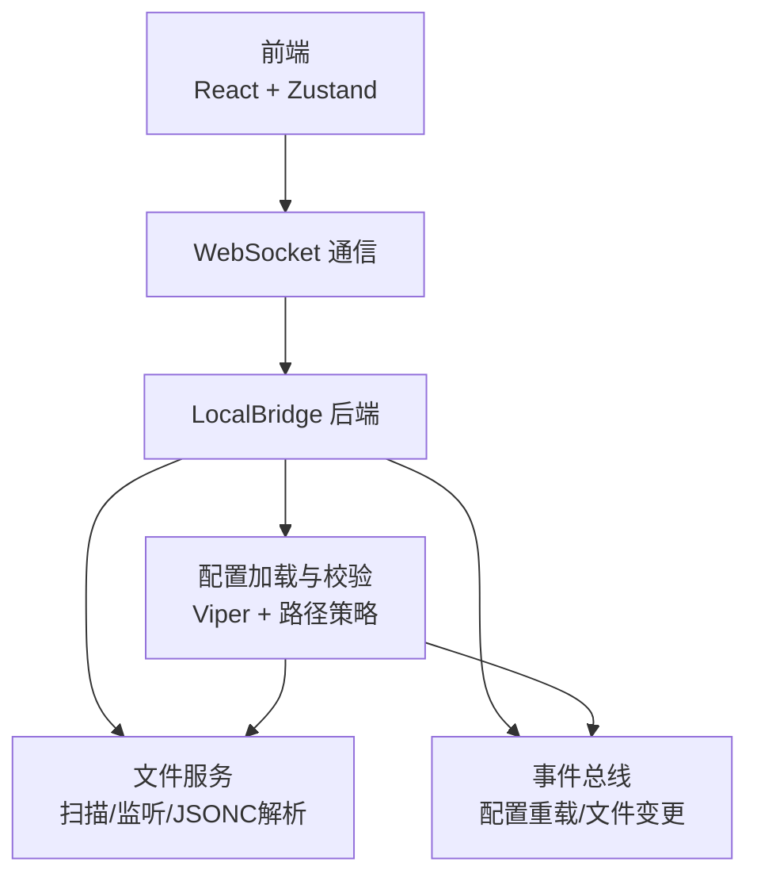
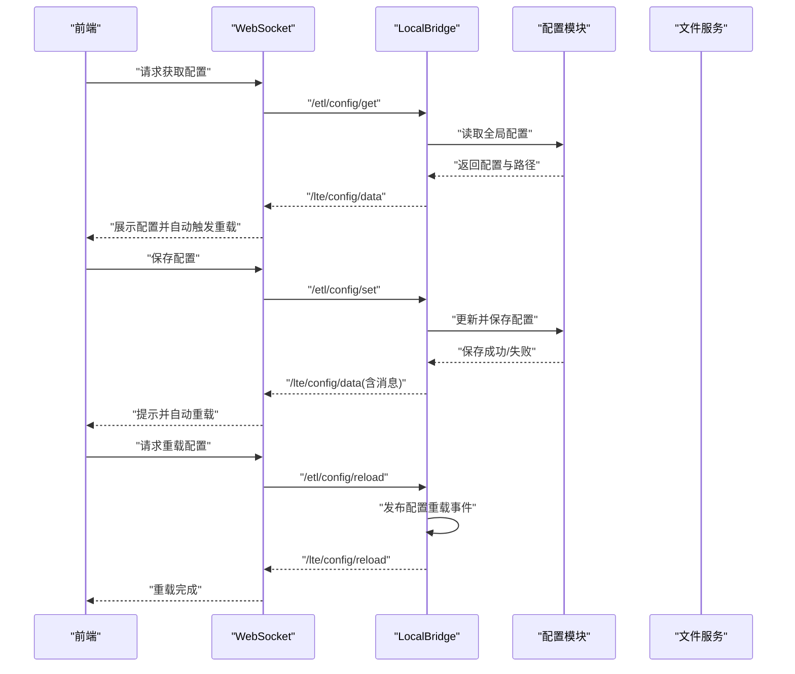
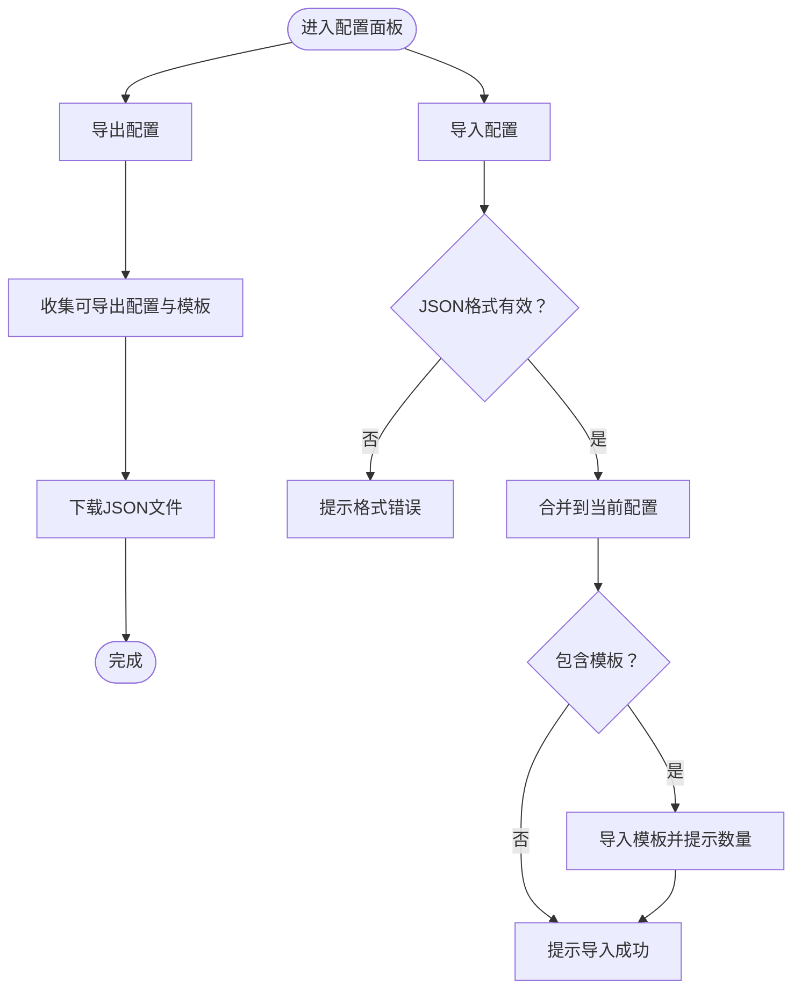
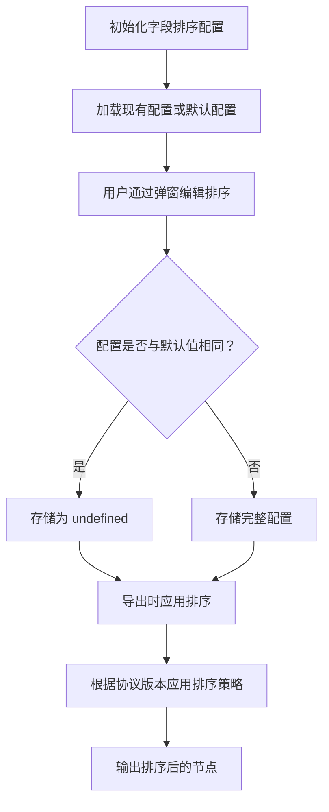
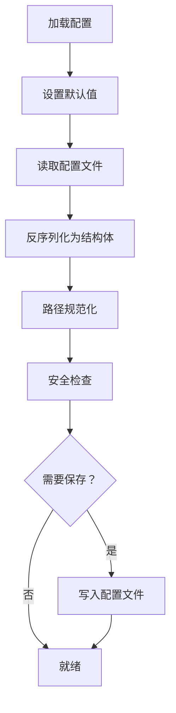
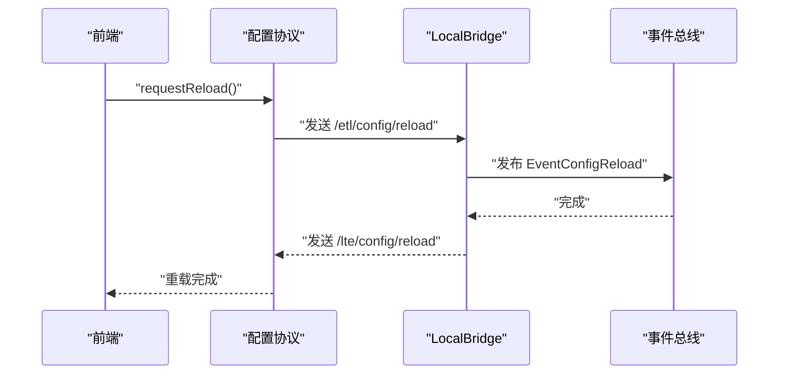
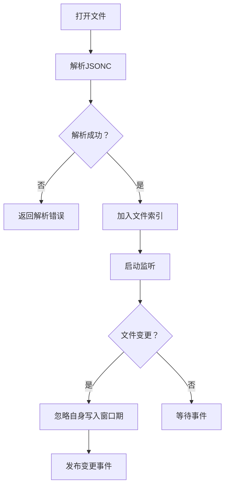
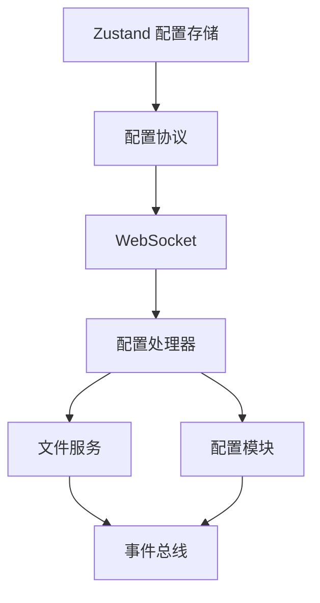

# 配置管理

<cite>
**本文引用的文件**
- [Extremer 配置默认值](file://Extremer/config/default.json)
- [LocalBridge 配置默认值](file://LocalBridge/config/default.json)
- [前端配置存储](file://src/stores/configStore.ts)
- [后端配置模型与协议](file://src/services/protocols/ConfigProtocol.ts)
- [后端配置处理器](file://LocalBridge/internal/protocol/config/handler.go)
- [后端配置加载与校验](file://LocalBridge/internal/config/config.go)
- [后端路径与配置文件管理](file://LocalBridge/internal/paths/paths.go)
- [后端文件服务与JSONC解析](file://LocalBridge/internal/service/file/file_service.go)
- [前端配置面板：本地服务](file://src/components/panels/config/LocalServiceSection.tsx)
- [前端配置面板：配置管理](file://src/components/panels/config/ConfigManagementSection.tsx)
- [前端配置面板：Pipeline 配置](file://src/components/panels/config/PipelineConfigSection.tsx)
- [后端配置弹窗](file://src/components/modals/BackendConfigModal.tsx)
- [前端文件存储与本地持久化](file://src/stores/fileStore.ts)
- [前端JSON助手](file://src/utils/jsonHelper.ts)
- [后端路由与握手](file://LocalBridge/internal/router/router.go)
- [后端JSONC解析工具](file://LocalBridge/internal/utils/jsonc.go)
- [字段排序配置类型定义](file://src/core/sorting/types.ts)
- [字段排序默认配置](file://src/core/sorting/defaults.ts)
- [字段排序应用逻辑](file://src/core/sorting/applySort.ts)
- [字段排序配置弹窗](file://src/components/modals/FieldSortModal.tsx)
- [字段排序索引导出](file://src/core/sorting/index.ts)
- [导出器](file://src/core/parser/exporter.ts)
</cite>

## 更新摘要
**所做更改**
- 新增字段排序配置章节，详细介绍字段排序系统的存储和管理机制
- 更新配置存储结构，添加 fieldSortConfig 字段支持
- 新增字段排序配置的导出/导入处理逻辑
- 扩展配置面板功能，增加字段排序配置入口
- 完善配置分类映射，将字段排序配置纳入可导出配置范围
- 更新导出器逻辑，集成字段排序配置的应用

## 目录
1. [简介](#简介)
2. [项目结构](#项目结构)
3. [核心组件](#核心组件)
4. [架构总览](#架构总览)
5. [详细组件分析](#详细组件分析)
6. [依赖关系分析](#依赖关系分析)
7. [性能考量](#性能考量)
8. [故障排查指南](#故障排查指南)
9. [结论](#结论)
10. [附录](#附录)

## 简介
本文件系统性梳理 MaaPipelineEditor 的配置管理系统，涵盖前端配置（应用设置、用户偏好、主题与快捷键）、后端配置（LocalBridge 服务、MaaFramework 集成、文件系统）、配置文件结构与格式（JSON/JSONC、环境变量与继承）、配置加载与验证（默认值、类型检查、冲突处理）、热重载与持久化、迁移与备份恢复，以及优化与安全最佳实践。

**更新** 本次更新特别增加了字段排序配置的存储和管理功能，用户可以通过图形界面自定义导出时的字段排序顺序，并将这些偏好设置持久化到配置文件中。该功能包含完整的字段排序配置类型定义、默认配置、配置弹窗和应用逻辑，为用户提供高度个性化的导出体验。

## 项目结构
配置管理涉及三层：
- 前端层：React + Zustand 状态管理，提供配置面板与交互。
- 通信层：WebSocket 协议，前后端通过统一路由交换配置数据。
- 后端层：Go 实现的 LocalBridge，负责配置加载、校验、持久化与事件分发。

**图表来源**
- [前端配置存储:173-281](file://src/stores/configStore.ts#L173-L281)
- [后端配置模型与协议:46-70](file://src/services/protocols/ConfigProtocol.ts#L46-L70)
- [后端配置加载与校验:54-95](file://LocalBridge/internal/config/config.go#L54-L95)
- [后端文件服务与JSONC解析:122-156](file://LocalBridge/internal/service/file/file_service.go#L122-L156)

**章节来源**
- [前端配置存储:1-281](file://src/stores/configStore.ts#L1-L281)
- [后端配置模型与协议:1-197](file://src/services/protocols/ConfigProtocol.ts#L1-L197)
- [后端配置加载与校验:1-339](file://LocalBridge/internal/config/config.go#L1-L339)
- [后端路径与配置文件管理:1-238](file://LocalBridge/internal/paths/paths.go#L1-L238)
- [后端文件服务与JSONC解析:1-360](file://LocalBridge/internal/service/file/file_service.go#L1-L360)

## 核心组件
- 前端配置存储（Zustand）
  - 管理编辑器 UI/行为偏好、面板布局、实时预览、跨文件搜索、AI 配置、WS 端口与自动连接等。
  - **新增** 字段排序配置：fieldSortConfig 字段用于存储用户的自定义字段排序偏好。
  - 提供配置导出/导入、分类映射与迁移逻辑（如 isExportConfig 与 configHandlingMode 的双向同步）。
- 后端配置（Viper）
  - 默认值设定、配置文件读取、路径规范化、命令行覆盖、安全检查（根目录风险评估）。
  - 支持保存配置到文件、设置 MaaFramework 目录并持久化。
- 通信协议（WebSocket）
  - 统一路由：/etl/config/get、/etl/config/set、/etl/config/reload；响应路由：/lte/config/data、/lte/config/reload。
  - 前端通过协议处理器订阅配置变更与重载结果。
- 文件服务（JSONC）
  - 支持带注释 JSON（JSONC），解析与校验，保存时按缩进格式化，监听文件变更并发布事件。
- 配置面板与弹窗
  - 本地服务配置面板、配置管理面板、后端配置弹窗、**新增** 字段排序配置弹窗，支持刷新、保存、重启服务与自动重载。
- **新增** 字段排序系统
  - 提供完整的字段排序配置管理，包括类型定义、默认配置、应用逻辑和用户界面。

**章节来源**
- [前端配置存储:1-281](file://src/stores/configStore.ts#L1-L281)
- [后端配置加载与校验:54-224](file://LocalBridge/internal/config/config.go#L54-L224)
- [后端配置处理器:26-171](file://LocalBridge/internal/protocol/config/handler.go#L26-L171)
- [后端文件服务与JSONC解析:122-201](file://LocalBridge/internal/service/file/file_service.go#L122-L201)
- [后端JSONC解析工具:1-30](file://LocalBridge/internal/utils/jsonc.go#L1-L30)
- [前端配置面板：本地服务:1-144](file://src/components/panels/config/LocalServiceSection.tsx#L1-L144)
- [前端配置面板：配置管理:1-138](file://src/components/panels/config/ConfigManagementSection.tsx#L1-L138)
- [前端配置面板：Pipeline 配置:1-296](file://src/components/panels/config/PipelineConfigSection.tsx#L1-L296)
- [后端配置弹窗:1-473](file://src/components/modals/BackendConfigModal.tsx#L1-L473)
- [字段排序配置类型定义:1-28](file://src/core/sorting/types.ts#L1-L28)
- [字段排序默认配置:1-152](file://src/core/sorting/defaults.ts#L1-L152)
- [字段排序应用逻辑:1-314](file://src/core/sorting/applySort.ts#L1-L314)
- [字段排序配置弹窗:1-362](file://src/components/modals/FieldSortModal.tsx#L1-L362)

## 架构总览
前后端通过 WebSocket 协议进行配置交互，后端使用 Viper 管理配置文件，结合路径策略与安全检查，确保配置合法与可追溯；文件服务负责扫描、监听与 JSONC 解析，保障配置变更的及时反馈。

**图表来源**
- [后端配置处理器:26-204](file://LocalBridge/internal/protocol/config/handler.go#L26-L204)
- [后端配置模型与协议:60-161](file://src/services/protocols/ConfigProtocol.ts#L60-L161)
- [后端配置加载与校验:196-224](file://LocalBridge/internal/config/config.go#L196-L224)

## 详细组件分析

### 前端配置系统
- 配置分类与映射
  - 分类：面板、Pipeline、通信、AI。
  - 映射用于筛选可导出配置与分类展示。
  - **更新** 字段排序配置已纳入可导出配置范围。
- 配置项与默认值
  - 包括实时预览、边标签、聚焦透明度、节点样式、导出协议版本、WS 端口、自动连接、跨文件搜索、AI API 等。
  - **新增** fieldSortConfig 字段，用于存储字段排序配置。
- 导出/导入
  - 导出包含版本、时间戳、可导出配置与自定义模板；导入时进行格式校验并合并。
  - **更新** 字段排序配置包含在导出/导入范围内。
- 状态同步
  - 如 isExportConfig 与 configHandlingMode 的双向联动，保证配置一致性。

**图表来源**
- [前端配置面板：配置管理:27-102](file://src/components/panels/config/ConfigManagementSection.tsx#L27-L102)
- [前端配置存储:64-77](file://src/stores/configStore.ts#L64-L77)

**章节来源**
- [前端配置存储:18-281](file://src/stores/configStore.ts#L18-L281)
- [前端配置面板：配置管理:1-138](file://src/components/panels/config/ConfigManagementSection.tsx#L1-L138)

### 字段排序配置系统
- 配置结构与类型
  - FieldSortConfig 类型定义包含五个主要字段组：mainTaskFields、recognitionParamFields、actionParamFields、swipeFields、freezeParamFields。
  - 每个字段组对应不同类型的字段排序需求。
- 默认配置
  - 提供完整的默认排序顺序，基于字段的实际用途和使用频率设计。
  - 包含特殊任务字段、识别参数、动作参数、滑动参数和冻结参数的默认顺序。
- 配置弹窗
  - 提供拖拽式界面让用户自定义字段排序。
  - 支持重置为默认值、重置单个面板等功能。
  - 自动检测配置是否与默认值相同，相同则存储为 undefined 以节省空间。
- 应用逻辑
  - 在导出时根据配置对节点字段进行重新排序。
  - 支持 v1 和 v2 协议版本的不同排序策略。
  - 保持 MPE 特色字段在末尾的特性。

**图表来源**
- [字段排序配置类型定义:6-17](file://src/core/sorting/types.ts#L6-L17)
- [字段排序默认配置:122-130](file://src/core/sorting/defaults.ts#L122-L130)
- [字段排序配置弹窗:158-184](file://src/components/modals/FieldSortModal.tsx#L158-L184)

**章节来源**
- [字段排序配置类型定义:1-28](file://src/core/sorting/types.ts#L1-L28)
- [字段排序默认配置:1-152](file://src/core/sorting/defaults.ts#L1-L152)
- [字段排序应用逻辑:1-314](file://src/core/sorting/applySort.ts#L1-L314)
- [字段排序配置弹窗:1-362](file://src/components/modals/FieldSortModal.tsx#L1-L362)

### 后端配置管理
- 配置结构
  - server、file、log、maafw 四大块，包含端口、主机、根目录、排除/扩展、日志级别/目录/推送、MaaFramework 启用与目录等。
- 加载与默认值
  - 使用 Viper 设置默认值，支持从指定路径读取配置文件，若不存在则创建默认配置。
- 路径规范化与安全检查
  - 绝对化相对路径，校验根目录存在性；提供高风险目录检测与建议。
- 保存与覆盖
  - 保存为格式化 JSON；支持命令行参数覆盖（根目录、日志目录、日志级别、端口）。
- 安全检查
  - 高风险目录（系统目录、驱动器根、用户主目录）与扫描限制（深度/文件数）评估，给出风险等级与建议。

**图表来源**
- [后端配置加载与校验:54-123](file://LocalBridge/internal/config/config.go#L54-L123)
- [后端路径与配置文件管理:193-237](file://LocalBridge/internal/paths/paths.go#L193-L237)

**章节来源**
- [后端配置加载与校验:1-339](file://LocalBridge/internal/config/config.go#L1-L339)
- [后端路径与配置文件管理:1-238](file://LocalBridge/internal/paths/paths.go#L1-L238)

### 通信协议与热重载
- 协议路由
  - 前端：/etl/config/get、/etl/config/set、/etl/config/reload。
  - 后端：/lte/config/data、/lte/config/reload。
- 热重载
  - 后端处理 /etl/config/reload 后发布配置重载事件；前端收到后自动刷新并提示。
- 握手与版本校验
  - 路由器处理版本握手，确保前后端协议一致。

**图表来源**
- [后端配置处理器:173-204](file://LocalBridge/internal/protocol/config/handler.go#L173-L204)
- [后端路由与握手:107-133](file://LocalBridge/internal/router/router.go#L107-L133)
- [后端配置模型与协议:150-161](file://src/services/protocols/ConfigProtocol.ts#L150-L161)

**章节来源**
- [后端配置处理器:1-237](file://LocalBridge/internal/protocol/config/handler.go#L1-L237)
- [后端路由与握手:1-151](file://LocalBridge/internal/router/router.go#L1-L151)
- [后端配置模型与协议:1-197](file://src/services/protocols/ConfigProtocol.ts#L1-L197)

### 文件系统与JSONC配置
- JSONC 支持
  - 使用 JSONC 解析器标准化并解析，支持行/块注释与尾随逗号。
- 文件服务
  - 扫描、索引、监听文件变更；忽略自身写入的短暂窗口；发布文件变更事件。
- 保存与读取
  - 保存时按缩进格式化；读取时解析 JSONC 并进行路径安全校验。

**图表来源**
- [后端文件服务与JSONC解析:122-201](file://LocalBridge/internal/service/file/file_service.go#L122-L201)
- [后端JSONC解析工具:9-29](file://LocalBridge/internal/utils/jsonc.go#L9-L29)

**章节来源**
- [后端文件服务与JSONC解析:1-360](file://LocalBridge/internal/service/file/file_service.go#L1-L360)
- [后端JSONC解析工具:1-30](file://LocalBridge/internal/utils/jsonc.go#L1-L30)

### 配置面板与交互
- 本地服务配置面板
  - 打开后端配置、设置 WS 端口、自动连接、自动重载变更文件。
- 后端配置弹窗
  - 展示并编辑 server/file/log/maafw 配置，保存后自动触发重载，支持重启服务。
- 配置管理面板
  - 导出/导入配置与自定义模板，支持缩进控制与批量提示。
- **新增** 字段排序配置面板
  - 提供专门的字段排序配置入口，支持拖拽式排序编辑。
  - 集成默认值重置和单面板重置功能。

**章节来源**
- [前端配置面板：本地服务:1-144](file://src/components/panels/config/LocalServiceSection.tsx#L1-L144)
- [后端配置弹窗:1-473](file://src/components/modals/BackendConfigModal.tsx#L1-L473)
- [前端配置面板：配置管理:1-138](file://src/components/panels/config/ConfigManagementSection.tsx#L1-L138)
- [前端配置面板：Pipeline 配置:1-296](file://src/components/panels/config/PipelineConfigSection.tsx#L1-L296)

### 导出器与字段排序集成
- 导出流程
  - 导出器在生成最终 Pipeline 对象时应用字段排序配置。
  - 支持两种协议版本（v1/v2）的不同排序策略。
- 排序应用
  - 使用 applyFieldSort 函数对每个节点应用自定义排序。
  - 保持 MPE 特色字段始终位于节点末尾。
- 配置处理
  - 字段排序配置作为可选配置参与导出流程。
  - 支持集成导出和分离导出两种模式。

**章节来源**
- [导出器:1-262](file://src/core/parser/exporter.ts#L1-L262)
- [字段排序应用逻辑:275-314](file://src/core/sorting/applySort.ts#L275-L314)

## 依赖关系分析
- 前端依赖
  - Zustand 管理配置状态；Ant Design 提供表单与交互；WebSocket 协议封装。
  - **新增** @dnd-kit 用于拖拽排序功能。
- 后端依赖
  - Viper 管理配置；hujson 解析 JSONC；事件总线分发配置与文件事件。
- 耦合与内聚
  - 前后端通过协议解耦；后端配置模块与文件服务模块通过事件总线松耦合。

**图表来源**
- [前端配置存储:173-281](file://src/stores/configStore.ts#L173-L281)
- [后端配置处理器:26-47](file://LocalBridge/internal/protocol/config/handler.go#L26-L47)
- [后端配置加载与校验:54-95](file://LocalBridge/internal/config/config.go#L54-L95)
- [后端文件服务与JSONC解析:19-62](file://LocalBridge/internal/service/file/file_service.go#L19-L62)

**章节来源**
- [前端配置存储:1-281](file://src/stores/configStore.ts#L1-L281)
- [后端配置处理器:1-237](file://LocalBridge/internal/protocol/config/handler.go#L1-L237)
- [后端配置加载与校验:1-339](file://LocalBridge/internal/config/config.go#L1-L339)
- [后端文件服务与JSONC解析:1-360](file://LocalBridge/internal/service/file/file_service.go#L1-L360)

## 性能考量
- 扫描限制
  - 后端提供 max_depth 与 max_files 限制，避免大规模扫描导致性能问题。
- 监听与去抖
  - 文件服务忽略自身写入窗口期，减少重复事件与二次处理。
- 序列化与缩进
  - 保存时按配置缩进序列化，兼顾可读性与体积。
- 前端状态粒度
  - 使用分类映射与选择性导出，降低不必要的状态同步成本。
- **新增** 字段排序配置优化
  - 当配置与默认值相同时存储为 undefined，减少配置文件大小。
  - 拖拽排序操作在前端完成，不影响后端性能。
- 导出性能
  - 字段排序应用在导出阶段进行，对大数据集影响有限。
  - 使用高效的对象遍历和字段复制算法。

## 故障排查指南
- 配置加载失败
  - 检查配置文件路径与权限；确认默认配置是否已创建；查看日志目录与推送开关。
- 路径安全告警
  - 若根目录位于高风险目录或驱动器根，遵循建议调整为具体项目目录。
- 端口/根目录变更未生效
  - 部分配置（如端口、根目录）需重启服务；保存后自动重载，必要时手动重启。
- 文件被外部修改
  - 前端弹窗提示并提供"自动重载"选项；可在配置中开启自动重载以减少人工干预。
- JSONC 解析错误
  - 确认注释与尾随逗号语法；使用 JSONC 解析工具先行校验。
- **新增** 字段排序配置问题
  - 如果字段排序配置不生效，检查配置是否正确保存且未被重置为默认值。
  - 确认导出协议版本与排序配置兼容。
  - 验证字段名称是否存在于对应的字段列表中。

**章节来源**
- [后端配置加载与校验:234-296](file://LocalBridge/internal/config/config.go#L234-L296)
- [后端配置处理器:173-204](file://LocalBridge/internal/protocol/config/handler.go#L173-L204)
- [后端文件服务与JSONC解析:253-343](file://LocalBridge/internal/service/file/file_service.go#L253-L343)
- [前端文件存储与本地持久化:489-514](file://src/stores/fileStore.ts#L489-L514)

## 结论
本配置管理系统通过前后端清晰的职责划分与协议约束，实现了灵活的配置管理、安全的路径校验、稳定的文件变更感知与便捷的热重载能力。前端提供直观的配置面板与导出/导入能力，后端以 Viper 与事件总线为核心，确保配置的可维护性与可观测性。

**更新** 新增的字段排序配置功能进一步增强了系统的灵活性，用户可以根据个人偏好定制导出时的字段排序，提升了用户体验和配置的个性化程度。该功能通过完整的类型系统、默认配置和用户界面，为用户提供了一个强大而易用的字段排序解决方案。

## 附录

### 配置文件结构与格式
- JSON 配置
  - server、file、log、maafw 四大块，字段与含义参见后端配置模型。
  - **更新** 新增 fieldSortConfig 字段，用于存储字段排序配置。
- JSONC 支持
  - 行注释、块注释、尾随逗号，提升可读性与易用性。
- 环境变量与继承
  - 后端支持命令行参数覆盖配置文件；前端提供默认值与迁移逻辑，避免缺失项导致异常。
- 默认值与校验
  - 后端设置默认值并进行路径规范化与安全检查；前端进行类型与范围校验。
  - **新增** 字段排序配置提供完整的默认值集合。

**章节来源**
- [后端配置模型与协议:8-30](file://src/services/protocols/ConfigProtocol.ts#L8-L30)
- [后端配置加载与校验:103-123](file://LocalBridge/internal/config/config.go#L103-L123)
- [后端JSONC解析工具:9-29](file://LocalBridge/internal/utils/jsonc.go#L9-L29)
- [前端配置存储:173-281](file://src/stores/configStore.ts#L173-L281)
- [字段排序默认配置:122-130](file://src/core/sorting/defaults.ts#L122-L130)

### 热重载与持久化
- 热重载
  - 保存配置后自动触发重载；后端发布事件，前端接收并刷新。
- 持久化
  - 后端保存为格式化 JSON；前端本地持久化用户配置与文件缓存；文件服务监听变更并发布事件。
  - **更新** 字段排序配置采用智能存储策略：与默认值相同的配置存储为 undefined。

**章节来源**
- [后端配置处理器:173-204](file://LocalBridge/internal/protocol/config/handler.go#L173-L204)
- [前端文件存储与本地持久化:227-268](file://src/stores/fileStore.ts#L227-L268)
- [后端文件服务与JSONC解析:158-201](file://LocalBridge/internal/service/file/file_service.go#L158-L201)
- [字段排序配置弹窗:167-173](file://src/components/modals/FieldSortModal.tsx#L167-L173)

### 迁移与备份恢复
- 导出/导入
  - 前端支持导出包含版本、时间戳、配置与模板的 JSON；导入时进行格式校验并合并。
  - **更新** 字段排序配置包含在导出/导入范围内，确保用户偏好得到完整保存。
- 备份建议
  - 定期导出配置与模板；关注路径与安全检查结果；在高风险目录变更前做好备份。
  - **新增** 建议定期备份字段排序配置，特别是经过深度定制的排序设置。

**章节来源**
- [前端配置面板：配置管理:27-102](file://src/components/panels/config/ConfigManagementSection.tsx#L27-L102)
- [后端路径与配置文件管理:193-237](file://LocalBridge/internal/paths/paths.go#L193-L237)

### 最佳实践
- 安全
  - 避免将根目录设为系统目录或驱动器根；合理设置扫描深度与文件数量上限。
- 可靠性
  - 保存后及时重载；对端口与根目录变更保留重启服务的步骤。
- 可维护性
  - 使用 JSONC 提升可读性；导出配置作为快照；定期清理无效模板。
  - **新增** 建议定期审查和优化字段排序配置，保持配置的简洁性和有效性。
- **新增** 字段排序配置最佳实践
  - 根据工作流程习惯定制排序，提高导出文件的可读性。
  - 避免过度复杂的排序规则，保持配置的实用性。
  - 在团队协作中统一字段排序标准，确保导出文件的一致性。
- **新增** 导出性能优化
  - 对于大型 Pipeline 文件，建议使用 v2 协议版本以获得更好的排序性能。
  - 合理设置 JSON 缩进，平衡可读性与文件大小。