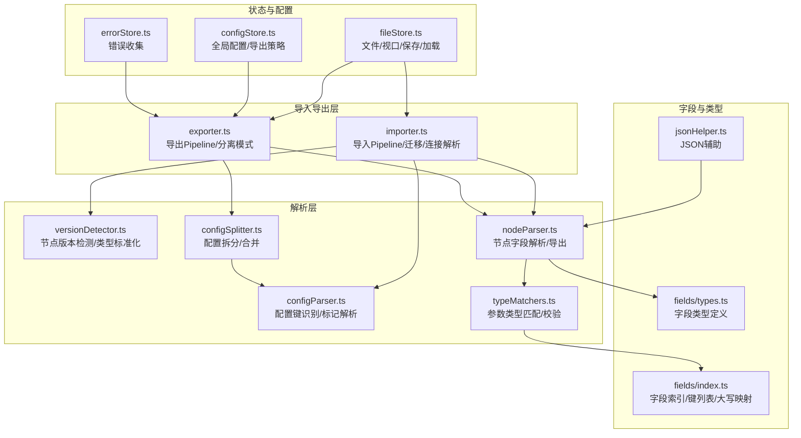
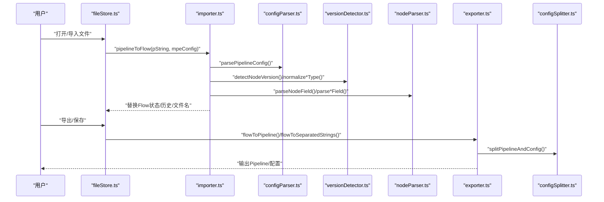
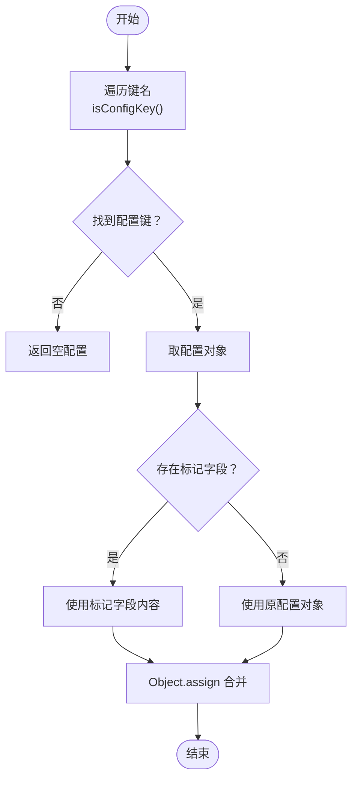
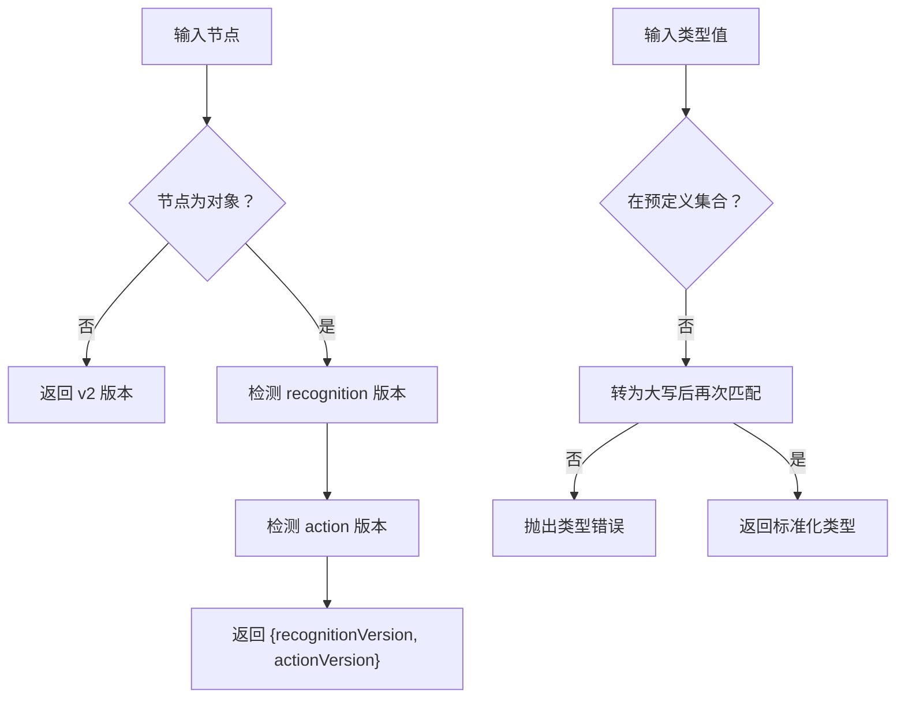
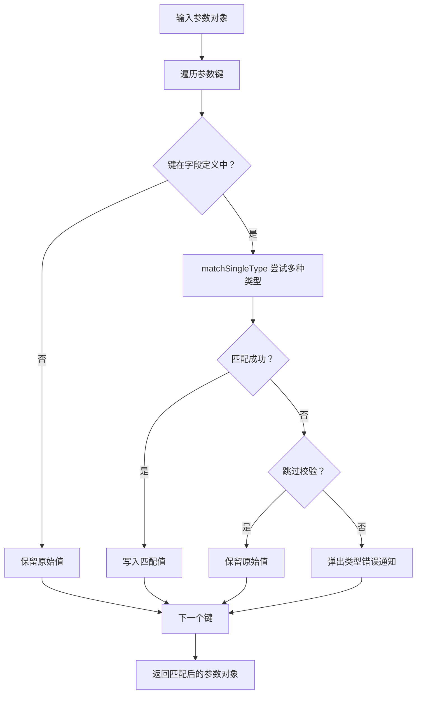
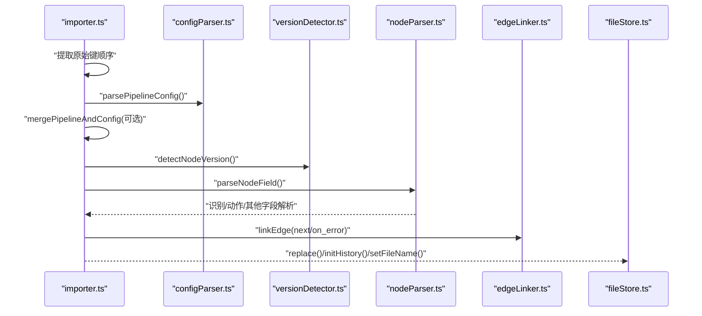
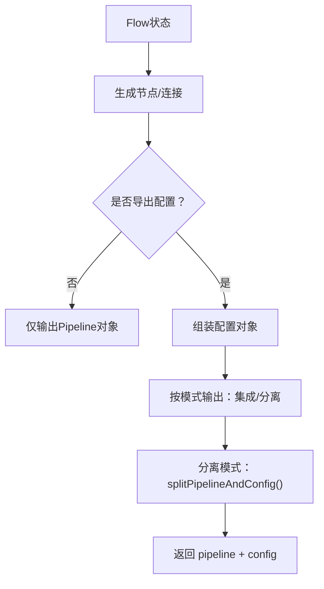
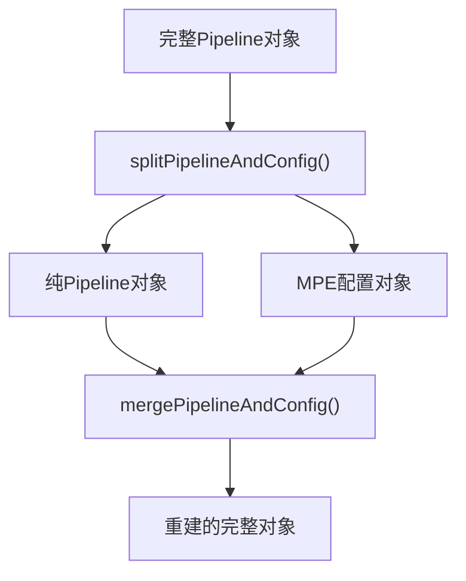
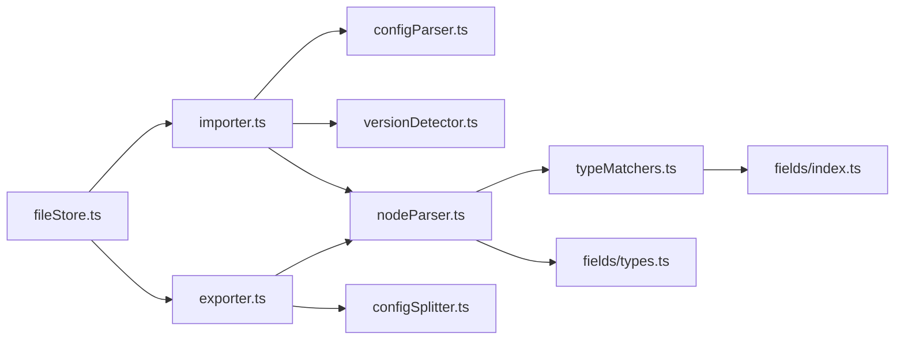

# 配置验证与迁移

<cite>
**本文引用的文件**
- [configParser.ts](file://src/core/parser/configParser.ts)
- [versionDetector.ts](file://src/core/parser/versionDetector.ts)
- [configSplitter.ts](file://src/core/parser/configSplitter.ts)
- [importer.ts](file://src/core/parser/importer.ts)
- [exporter.ts](file://src/core/parser/exporter.ts)
- [nodeParser.ts](file://src/core/parser/nodeParser.ts)
- [typeMatchers.ts](file://src/core/parser/typeMatchers.ts)
- [index.ts](file://src/core/fields/index.ts)
- [types.ts](file://src/core/fields/types.ts)
- [configStore.ts](file://src/stores/configStore.ts)
- [errorStore.ts](file://src/stores/errorStore.ts)
- [fileStore.ts](file://src/stores/fileStore.ts)
- [jsonHelper.ts](file://src/utils/jsonHelper.ts)
</cite>

## 目录
1. [简介](#简介)
2. [项目结构](#项目结构)
3. [核心组件](#核心组件)
4. [架构总览](#架构总览)
5. [详细组件分析](#详细组件分析)
6. [依赖分析](#依赖分析)
7. [性能考量](#性能考量)
8. [故障排查指南](#故障排查指南)
9. [结论](#结论)
10. [附录](#附录)

## 简介
本文件系统性梳理 MaaPipelineEditor 的“配置验证与迁移”体系，覆盖以下主题：
- 配置验证机制：类型检查、范围与取值校验、依赖关系检查、协议版本兼容
- 配置迁移系统：版本检测、向后兼容处理、废弃字段迁移、协议升级
- 配置分割与合并：分离存储模式下的拆分与整合策略
- 冲突检测与解决：节点名冲突、字段冲突、导出/导入顺序一致性
- 诊断与修复：常见错误定位、修复步骤、最佳实践
- 备份与回滚：本地持久化、分离模式下的文件组织、失败回滚策略

## 项目结构
围绕配置验证与迁移的关键模块分布如下：
- 核心解析层：配置提取、版本检测、节点字段解析、类型匹配
- 导入/导出层：Pipeline 与配置的双向转换、分离模式导出
- 配置与状态层：全局配置、文件级配置、错误收集
- 工具与类型：字段类型定义、JSON 辅助工具

图表来源
- [configParser.ts:1-69](file://src/core/parser/configParser.ts#L1-L69)
- [versionDetector.ts:1-149](file://src/core/parser/versionDetector.ts#L1-L149)
- [configSplitter.ts:1-486](file://src/core/parser/configSplitter.ts#L1-L486)
- [importer.ts:1-508](file://src/core/parser/importer.ts#L1-L508)
- [exporter.ts:1-244](file://src/core/parser/exporter.ts#L1-L244)
- [nodeParser.ts:1-372](file://src/core/parser/nodeParser.ts#L1-L372)
- [typeMatchers.ts:1-340](file://src/core/parser/typeMatchers.ts#L1-L340)
- [index.ts:1-45](file://src/core/fields/index.ts#L1-L45)
- [types.ts:1-34](file://src/core/fields/types.ts#L1-L34)
- [configStore.ts:1-268](file://src/stores/configStore.ts#L1-L268)
- [errorStore.ts:1-39](file://src/stores/errorStore.ts#L1-L39)
- [fileStore.ts:1-800](file://src/stores/fileStore.ts#L1-L800)
- [jsonHelper.ts:1-28](file://src/utils/jsonHelper.ts#L1-L28)

章节来源
- [configParser.ts:1-69](file://src/core/parser/configParser.ts#L1-L69)
- [versionDetector.ts:1-149](file://src/core/parser/versionDetector.ts#L1-L149)
- [configSplitter.ts:1-486](file://src/core/parser/configSplitter.ts#L1-L486)
- [importer.ts:1-508](file://src/core/parser/importer.ts#L1-L508)
- [exporter.ts:1-244](file://src/core/parser/exporter.ts#L1-L244)
- [nodeParser.ts:1-372](file://src/core/parser/nodeParser.ts#L1-L372)
- [typeMatchers.ts:1-340](file://src/core/parser/typeMatchers.ts#L1-L340)
- [index.ts:1-45](file://src/core/fields/index.ts#L1-L45)
- [types.ts:1-34](file://src/core/fields/types.ts#L1-L34)
- [configStore.ts:1-268](file://src/stores/configStore.ts#L1-L268)
- [errorStore.ts:1-39](file://src/stores/errorStore.ts#L1-L39)
- [fileStore.ts:1-800](file://src/stores/fileStore.ts#L1-L800)
- [jsonHelper.ts:1-28](file://src/utils/jsonHelper.ts#L1-L28)

## 核心组件
- 配置键识别与标记解析：从 Pipeline 对象中识别配置键、兼容新旧标记，抽取配置对象
- 版本检测与类型标准化：检测 recognition/action 字段版本，标准化类型大小写，迁移废弃字段
- 节点字段解析：根据版本解析识别/动作参数，处理 v1 平铺参数与 v2 结构化参数
- 参数类型匹配：将输入参数按字段类型定义进行严格转换，支持跳过校验
- 配置拆分与合并：分离存储模式下，将配置从 Pipeline 中抽取并重建
- 导入/导出管线：导入时合并外部配置、迁移旧字段、建立连接；导出时按配置处理模式输出
- 错误与状态：节点名重复等错误收集；文件/视口/保存/加载状态管理

章节来源
- [configParser.ts:1-69](file://src/core/parser/configParser.ts#L1-L69)
- [versionDetector.ts:1-149](file://src/core/parser/versionDetector.ts#L1-L149)
- [nodeParser.ts:1-372](file://src/core/parser/nodeParser.ts#L1-L372)
- [typeMatchers.ts:1-340](file://src/core/parser/typeMatchers.ts#L1-L340)
- [configSplitter.ts:1-486](file://src/core/parser/configSplitter.ts#L1-L486)
- [importer.ts:1-508](file://src/core/parser/importer.ts#L1-L508)
- [exporter.ts:1-244](file://src/core/parser/exporter.ts#L1-L244)
- [errorStore.ts:1-39](file://src/stores/errorStore.ts#L1-L39)
- [fileStore.ts:1-800](file://src/stores/fileStore.ts#L1-L800)

## 架构总览
配置验证与迁移贯穿导入/导出两条主线：
- 导入链路：读取 Pipeline 字符串 → 合并外部配置 → 解析配置键 → 版本检测 → 字段解析 → 建立连接 → 更新文件状态
- 导出链路：读取 Flow 状态 → 生成节点/连接 → 按配置处理模式输出 → 分离模式时拆分为 Pipeline 与配置

图表来源
- [importer.ts:155-507](file://src/core/parser/importer.ts#L155-L507)
- [exporter.ts:42-244](file://src/core/parser/exporter.ts#L42-L244)
- [configParser.ts:47-68](file://src/core/parser/configParser.ts#L47-L68)
- [versionDetector.ts:23-148](file://src/core/parser/versionDetector.ts#L23-L148)
- [nodeParser.ts:322-371](file://src/core/parser/nodeParser.ts#L322-L371)
- [configSplitter.ts:21-141](file://src/core/parser/configSplitter.ts#L21-L141)
- [fileStore.ts:517-603](file://src/stores/fileStore.ts#L517-L603)

## 详细组件分析

### 配置键识别与标记解析
- 功能要点
  - 识别配置键前缀（兼容 $__mpe_config_、__mpe_config_、__yamaape_config_）
  - 识别标记字段（configMark、__mpe_code、__yamaape），抽取配置对象
  - 解析 Pipeline 配置，兼容旧版标记字段
- 关键实现
  - isConfigKey：判断是否为配置键
  - isMark：判断是否为标记字段
  - getConfigMark：兼容新旧标记
  - parsePipelineConfig：抽取配置对象并合并

图表来源
- [configParser.ts:9-68](file://src/core/parser/configParser.ts#L9-L68)

章节来源
- [configParser.ts:1-69](file://src/core/parser/configParser.ts#L1-L69)

### 版本检测与类型标准化
- 功能要点
  - 检测单个节点的 recognition/action 版本（v1 字符串 vs v2 对象）
  - 标准化识别/动作类型大小写，不在预定义集合时报错
  - 迁移废弃字段（如 v5.1 的 interrupt/is_sub）
- 关键实现
  - detectNodeVersion/detectRecognitionVersion/detectActionVersion
  - normalizeRecoType/normalizeActionType
  - migratePipelineV5：处理 interrupt、is_sub、next/on_error 引用

图表来源
- [versionDetector.ts:23-148](file://src/core/parser/versionDetector.ts#L23-L148)

章节来源
- [versionDetector.ts:1-149](file://src/core/parser/versionDetector.ts#L1-L149)
- [importer.ts:47-149](file://src/core/parser/importer.ts#L47-L149)

### 节点字段解析与类型匹配
- 功能要点
  - 根据版本解析 recognition/action 字段
  - v1：平铺参数键；v2：结构化 param 对象
  - 类型匹配：按字段类型定义进行强校验，支持跳过校验
- 关键实现
  - parseNodeField：路由到识别/动作/其他字段解析
  - parseRecognitionField/parseActionField：版本分支与迁移
  - matchParamType：多类型尝试匹配，失败时根据配置决定报错或保留

图表来源
- [nodeParser.ts:322-371](file://src/core/parser/nodeParser.ts#L322-L371)
- [typeMatchers.ts:292-339](file://src/core/parser/typeMatchers.ts#L292-L339)

章节来源
- [nodeParser.ts:1-372](file://src/core/parser/nodeParser.ts#L1-L372)
- [typeMatchers.ts:1-340](file://src/core/parser/typeMatchers.ts#L1-L340)
- [index.ts:1-45](file://src/core/fields/index.ts#L1-L45)
- [types.ts:1-34](file://src/core/fields/types.ts#L1-L34)

### 导入流程（含迁移与连接解析）
- 步骤
  - 读取字符串/剪贴板内容，必要时去除空包装
  - 合并外部配置（分离模式下的 .mpe.json）
  - 解析配置键，抽取文件名/前缀等元信息
  - 迁移废弃字段（interrupt/is_sub 等）
  - 逐节点解析：识别/动作/其他字段，建立 next/on_error 连接
  - 更新文件状态（文件名、前缀、节点顺序映射）
  - 自动布局（若未包含位置信息）
- 关键点
  - 保持原始键顺序，确保导出顺序稳定
  - 便签/分组/锚点/外部节点的特殊处理
  - 位置信息与端点方向的保存/恢复

图表来源
- [importer.ts:155-507](file://src/core/parser/importer.ts#L155-L507)
- [configParser.ts:47-68](file://src/core/parser/configParser.ts#L47-L68)
- [versionDetector.ts:23-110](file://src/core/parser/versionDetector.ts#L23-L110)
- [nodeParser.ts:322-371](file://src/core/parser/nodeParser.ts#L322-L371)

章节来源
- [importer.ts:1-508](file://src/core/parser/importer.ts#L1-L508)

### 导出流程（含分离模式）
- 步骤
  - 读取 Flow 状态，按顺序排序节点
  - 生成节点/连接，按配置处理模式决定是否导出配置
  - 分离模式：调用 splitPipelineAndConfig 拆分为 Pipeline 与配置两部分
  - 视口信息规范化（取整）
- 关键点
  - configHandlingMode 控制是否导出配置
  - isExportConfig 与 configHandlingMode 的联动
  - 节点属性导出形式（对象/前缀）

图表来源
- [exporter.ts:42-244](file://src/core/parser/exporter.ts#L42-L244)
- [configSplitter.ts:151-448](file://src/core/parser/configSplitter.ts#L151-L448)

章节来源
- [exporter.ts:1-244](file://src/core/parser/exporter.ts#L1-L244)
- [configSplitter.ts:1-486](file://src/core/parser/configSplitter.ts#L1-L486)

### 配置拆分与合并
- 拆分策略
  - 从完整对象中抽取 $__mpe_config_* 节点，构建 file_config
  - 识别外部节点/锚点/便签/分组节点，抽取位置与样式信息
  - 普通节点：抽取 $__mpe_code 中的位置与端点方向
  - 清理空对象，避免冗余
- 合并策略
  - 以文件名为后缀，重建 $__mpe_config_<文件名> 节点
  - 将节点配置转换为 $__mpe_code，按原始键顺序插入
  - 特殊节点（外部/锚点/便签/分组）按命名规则重建
- 文件名推导
  - getConfigFileName：将 .json/.jsonc 转换为 .mpe.json
  - getPipelineFileNameFromConfig：从配置文件名反推 Pipeline 文件名

图表来源
- [configSplitter.ts:21-141](file://src/core/parser/configSplitter.ts#L21-L141)
- [configSplitter.ts:151-448](file://src/core/parser/configSplitter.ts#L151-L448)
- [configSplitter.ts:471-485](file://src/core/parser/configSplitter.ts#L471-L485)

章节来源
- [configSplitter.ts:1-486](file://src/core/parser/configSplitter.ts#L1-L486)

### 冲突检测与解决
- 节点名冲突
  - 导出前检查重复节点名，阻止导出并提示
  - 导入时预检测文件名重复，给出警告
- 字段冲突
  - 类型匹配失败时，根据配置决定报错或保留
  - 跳过校验仅在明确开启时生效
- 顺序与布局
  - 保持原始键顺序，避免导出顺序漂移
  - 未包含位置信息时自动布局

章节来源
- [exporter.ts:44-55](file://src/core/parser/exporter.ts#L44-L55)
- [fileStore.ts:334-361](file://src/stores/fileStore.ts#L334-L361)
- [typeMatchers.ts:324-335](file://src/core/parser/typeMatchers.ts#L324-L335)

### 验证与迁移最佳实践
- 验证
  - 在开发阶段启用严格校验，发布前可考虑开启“跳过字段验证”
  - 使用统一的字段类型定义，避免自定义非法键
- 迁移
  - 优先使用版本检测自动迁移
  - 对于废弃字段，遵循迁移规则（如 interrupt → next+jump_back）
- 分离模式
  - 采用固定命名规则（文件名后缀）保证可逆性
  - 保存/加载时注意配置文件路径生成与校验

章节来源
- [configStore.ts:163-267](file://src/stores/configStore.ts#L163-L267)
- [importer.ts:47-149](file://src/core/parser/importer.ts#L47-L149)
- [configSplitter.ts:471-485](file://src/core/parser/configSplitter.ts#L471-L485)

## 依赖分析
- 组件耦合
  - importer 依赖 configParser、versionDetector、nodeParser、configSplitter
  - exporter 依赖 configSplitter、nodeParser、configStore、errorStore
  - fileStore 串联导入/导出与状态管理
- 外部依赖
  - jsonc-parser：JSONC 解析与键顺序提取
  - antd：通知与模态框
  - zustand：状态管理

图表来源
- [importer.ts:1-508](file://src/core/parser/importer.ts#L1-L508)
- [exporter.ts:1-244](file://src/core/parser/exporter.ts#L1-L244)
- [fileStore.ts:1-800](file://src/stores/fileStore.ts#L1-L800)
- [nodeParser.ts:1-372](file://src/core/parser/nodeParser.ts#L1-L372)
- [typeMatchers.ts:1-340](file://src/core/parser/typeMatchers.ts#L1-L340)
- [index.ts:1-45](file://src/core/fields/index.ts#L1-L45)
- [types.ts:1-34](file://src/core/fields/types.ts#L1-L34)

章节来源
- [importer.ts:1-508](file://src/core/parser/importer.ts#L1-L508)
- [exporter.ts:1-244](file://src/core/parser/exporter.ts#L1-L244)
- [fileStore.ts:1-800](file://src/stores/fileStore.ts#L1-L800)

## 性能考量
- 解析复杂度
  - 版本检测与字段解析为 O(N)（N 为节点数），类型匹配为 O(N×M)（M 为参数数）
  - 键顺序提取与拆分/合并为 O(K)（K 为键数）
- 优化建议
  - 大文件导入时，优先启用键顺序提取，减少二次遍历
  - 跳过校验仅在受控场景使用，避免隐藏潜在问题
  - 分离模式下，仅保存变更部分，降低 IO 压力

[本节为通用指导，无需列出具体文件来源]

## 故障排查指南
- 导入失败
  - 检查 Pipeline 格式与版本一致性
  - 查看控制台错误，确认是否为类型错误或连接引用异常
  - 若使用分离模式，确认 .mpe.json 路径与内容正确
- 导出失败
  - 检查是否存在重复节点名
  - 确认字段类型与协议版本匹配
- 类型错误
  - 根据通知提示定位参数键，核对类型定义
  - 如确需保留原始值，可在配置中开启“跳过字段验证”
- 自动布局
  - 若未包含位置信息，导入后会自动布局；可手动调整后重新导出以固定顺序

章节来源
- [importer.ts:498-507](file://src/core/parser/importer.ts#L498-L507)
- [exporter.ts:201-209](file://src/core/parser/exporter.ts#L201-L209)
- [typeMatchers.ts:324-335](file://src/core/parser/typeMatchers.ts#L324-L335)
- [errorStore.ts:13-15](file://src/stores/errorStore.ts#L13-L15)

## 结论
本系统通过“配置键识别—版本检测—字段解析—类型匹配—拆分合并”的完整链路，实现了对 Pipeline 配置的严格验证与平滑迁移。结合分离存储模式与严格的错误检测，既保证了向后兼容与可维护性，也为用户提供了清晰的诊断与修复路径。

[本节为总结性内容，无需列出具体文件来源]

## 附录

### 配置备份与恢复最佳实践
- 本地持久化
  - 使用 fileStore 的本地保存/加载，将文件与配置序列化到 localStorage
  - 注意浏览器存储配额限制，必要时清理或减少文件数量
- 分离模式
  - 采用固定命名规则（.mpe.json）与目录组织，便于版本管理
  - 保存时区分 pipeline/config 的 ACK 路径，确保一致性
- 回滚策略
  - 成功保存后更新 lastSyncTime；失败则保持原状态
  - 分离模式下分别保存 pipeline 与 config，任一部分失败可单独回滚

章节来源
- [fileStore.ts:227-268](file://src/stores/fileStore.ts#L227-L268)
- [fileStore.ts:700-778](file://src/stores/fileStore.ts#L700-L778)