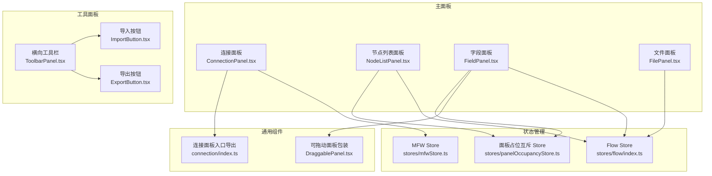
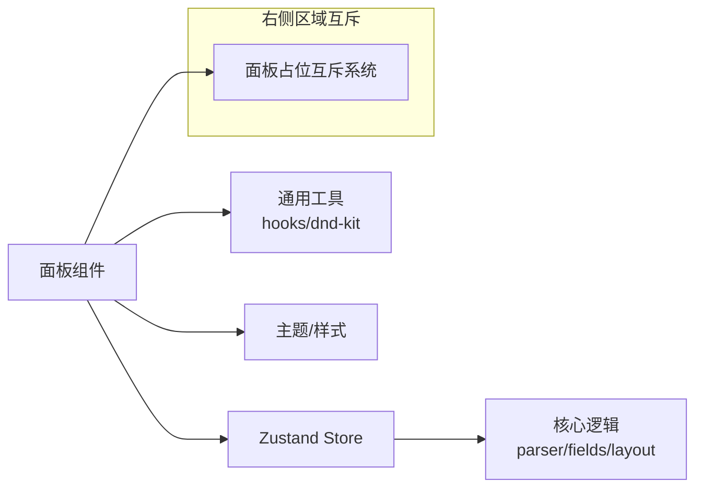
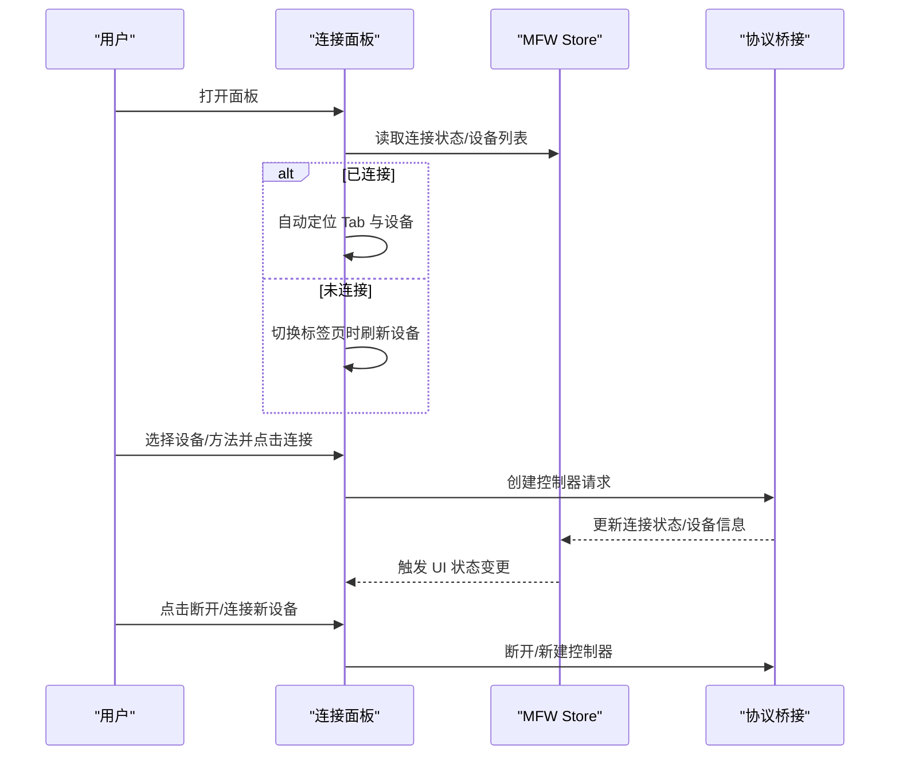
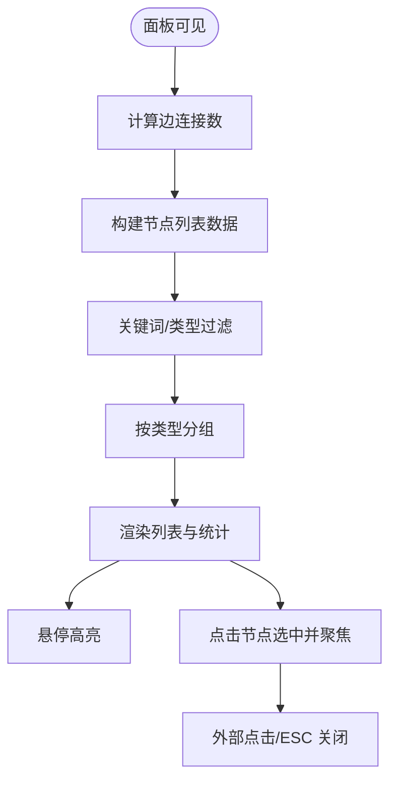
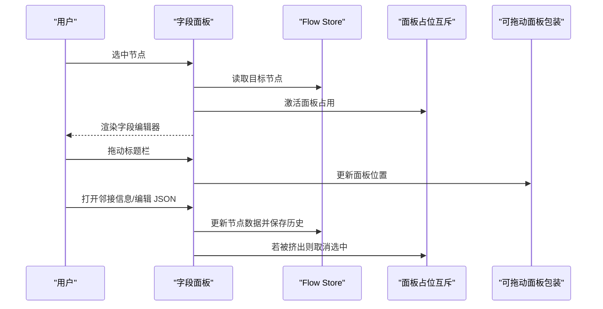
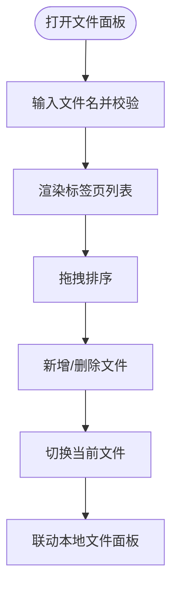
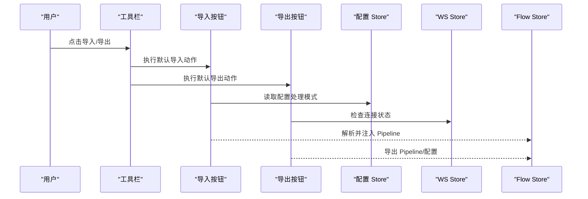
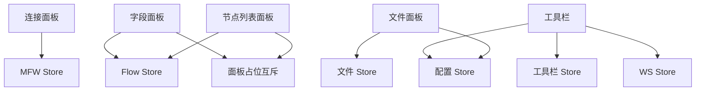

# 主要面板

<cite>
**本文引用的文件**
- [ConnectionPanel.tsx](file://src/components/panels/main/ConnectionPanel.tsx)
- [NodeListPanel.tsx](file://src/components/panels/main/node-list/NodeListPanel.tsx)
- [FieldPanel.tsx](file://src/components/panels/main/FieldPanel.tsx)
- [FilePanel.tsx](file://src/components/panels/main/FilePanel.tsx)
- [ToolbarPanel.tsx](file://src/components/panels/main/ToolbarPanel.tsx)
- [DraggablePanel.tsx](file://src/components/panels/common/DraggablePanel.tsx)
- [index.ts（连接面板入口）](file://src/components/panels/main/connection/index.ts)
- [types.ts（节点列表类型）](file://src/components/panels/main/node-list/types.ts)
- [index.ts（Flow Store）](file://src/stores/flow/index.ts)
- [mfwStore.ts](file://src/stores/mfwStore.ts)
- [panelOccupancyStore.ts](file://src/stores/panelOccupancyStore.ts)
- [ImportButton.tsx](file://src/components/panels/toolbar/ImportButton.tsx)
- [ExportButton.tsx](file://src/components/panels/toolbar/ExportButton.tsx)
</cite>

## 目录
1. [简介](#简介)
2. [项目结构](#项目结构)
3. [核心组件](#核心组件)
4. [架构总览](#架构总览)
5. [详细组件分析](#详细组件分析)
6. [依赖分析](#依赖分析)
7. [性能考虑](#性能考虑)
8. [故障排查指南](#故障排查指南)
9. [结论](#结论)
10. [附录](#附录)

## 简介
本文件聚焦“主要面板系统”的技术实现，覆盖以下核心面板：
- 连接面板：设备发现、连接配置与状态管理
- 节点列表面板：节点浏览、筛选、分组与定位
- 字段面板：节点字段编辑、邻接信息、可拖拽/内联布局
- 文件面板：多文件标签页、拖拽排序、本地文件联动
- 工具面板（横向工具栏）：导入、导出、JSON 预览等快捷入口

文档将深入解析各面板的数据流、状态同步机制、布局与交互模式，并提供扩展与优化建议。

## 项目结构
主要面板位于前端 src/components/panels 目录，按“主面板/工具面板/通用组件”分层组织；状态管理由多个 zustand store 提供，包括 Flow Store、MFW Store、面板占位互斥系统等。

图表来源
- [ConnectionPanel.tsx:1-954](file://src/components/panels/main/ConnectionPanel.tsx#L1-L954)
- [NodeListPanel.tsx:1-426](file://src/components/panels/main/node-list/NodeListPanel.tsx#L1-L426)
- [FieldPanel.tsx:1-491](file://src/components/panels/main/FieldPanel.tsx#L1-L491)
- [FilePanel.tsx:1-165](file://src/components/panels/main/FilePanel.tsx#L1-L165)
- [ToolbarPanel.tsx:1-22](file://src/components/panels/main/ToolbarPanel.tsx#L1-L22)
- [DraggablePanel.tsx:1-178](file://src/components/panels/common/DraggablePanel.tsx#L1-L178)
- [index.ts（连接面板入口）:1-10](file://src/components/panels/main/connection/index.ts#L1-L10)
- [index.ts（Flow Store）:1-124](file://src/stores/flow/index.ts#L1-L124)
- [mfwStore.ts:1-195](file://src/stores/mfwStore.ts#L1-L195)
- [panelOccupancyStore.ts:1-136](file://src/stores/panelOccupancyStore.ts#L1-L136)

章节来源
- [ConnectionPanel.tsx:1-954](file://src/components/panels/main/ConnectionPanel.tsx#L1-L954)
- [NodeListPanel.tsx:1-426](file://src/components/panels/main/node-list/NodeListPanel.tsx#L1-L426)
- [FieldPanel.tsx:1-491](file://src/components/panels/main/FieldPanel.tsx#L1-L491)
- [FilePanel.tsx:1-165](file://src/components/panels/main/FilePanel.tsx#L1-L165)
- [ToolbarPanel.tsx:1-22](file://src/components/panels/main/ToolbarPanel.tsx#L1-L22)
- [DraggablePanel.tsx:1-178](file://src/components/panels/common/DraggablePanel.tsx#L1-L178)
- [index.ts（连接面板入口）:1-10](file://src/components/panels/main/connection/index.ts#L1-L10)
- [index.ts（Flow Store）:1-124](file://src/stores/flow/index.ts#L1-L124)
- [mfwStore.ts:1-195](file://src/stores/mfwStore.ts#L1-L195)
- [panelOccupancyStore.ts:1-136](file://src/stores/panelOccupancyStore.ts#L1-L136)

## 核心组件
- 连接面板：跨平台设备连接（ADB、Win32、PlayCover、Gamepad、WlRoots、macOS），设备列表刷新、连接/断开控制、方法选择与持久化
- 节点列表面板：节点搜索、类型筛选、分组折叠、高亮与定位、点击外部关闭、键盘 ESC 关闭
- 字段面板：节点字段编辑器、邻接信息、错误边界与修复、可拖拽/内联布局、进度遮罩
- 文件面板：文件名校验、标签页可拖拽排序、新增/删除、与本地文件面板联动
- 工具面板：导入/导出/JSON 预览，支持默认动作记忆与条件菜单项

章节来源
- [ConnectionPanel.tsx:1-954](file://src/components/panels/main/ConnectionPanel.tsx#L1-L954)
- [NodeListPanel.tsx:1-426](file://src/components/panels/main/node-list/NodeListPanel.tsx#L1-L426)
- [FieldPanel.tsx:1-491](file://src/components/panels/main/FieldPanel.tsx#L1-L491)
- [FilePanel.tsx:1-165](file://src/components/panels/main/FilePanel.tsx#L1-L165)
- [ToolbarPanel.tsx:1-22](file://src/components/panels/main/ToolbarPanel.tsx#L1-L22)

## 架构总览
面板系统采用“组件 + Store + 互斥系统”的分层架构：
- 组件负责 UI 行为与交互
- Store 提供全局状态（Flow、MFW、面板占位）
- 互斥系统保障右侧区域面板的互斥占用与被动面板的协同

图表来源
- [index.ts（Flow Store）:1-124](file://src/stores/flow/index.ts#L1-L124)
- [mfwStore.ts:1-195](file://src/stores/mfwStore.ts#L1-L195)
- [panelOccupancyStore.ts:1-136](file://src/stores/panelOccupancyStore.ts#L1-L136)

## 详细组件分析

### 连接面板（ConnectionPanel）
- 功能要点
  - 平台检测与可用标签页动态生成
  - 设备列表刷新与持久化参数（ADB 路径/地址、PlayCover 地址/UUID、Gamepad 类型/句柄、WlRoots Socket、macOS PID/方法）
  - 方法选择（截图/输入）默认策略与手动模式差异
  - 连接/断开控制、连接新设备的切换流程
  - 连接状态徽章与错误提示
- 数据流与状态同步
  - 读取 MFW Store 的连接状态、设备列表与错误信息
  - 通过协议桥接发起设备创建/断开请求
  - 首次打开时根据已连接设备自动定位 Tab 与选中项
- 交互模式
  - 切换标签页时懒加载并刷新设备列表
  - 手动模式禁用部分方法（如 RawByNetcat）
  - 支持“连接新设备”与“断开连接”的条件按钮

图表来源
- [ConnectionPanel.tsx:1-954](file://src/components/panels/main/ConnectionPanel.tsx#L1-L954)
- [mfwStore.ts:1-195](file://src/stores/mfwStore.ts#L1-L195)

章节来源
- [ConnectionPanel.tsx:1-954](file://src/components/panels/main/ConnectionPanel.tsx#L1-L954)
- [index.ts（连接面板入口）:1-10](file://src/components/panels/main/connection/index.ts#L1-L10)
- [mfwStore.ts:1-195](file://src/stores/mfwStore.ts#L1-L195)

### 节点列表面板（NodeListPanel）
- 功能要点
  - 节点关键词与类型筛选
  - 按节点类型分组与展开/折叠
  - 边连接数统计（入/出）
  - 点击节点选中并聚焦视图
  - 点击外部区域与 ESC 关闭
  - 响应式定位（锚点元素 + 窗口尺寸监听）
- 数据流与状态同步
  - 从 Flow Store 读取 nodes/edges 实时计算边连接数
  - 通过 Flow Store 更新节点选中状态与视图中心
- 交互模式
  - 悬停高亮、点击定位、键盘 ESC 关闭
  - 外部点击关闭（排除 Ant Design 弹出层）

图表来源
- [NodeListPanel.tsx:1-426](file://src/components/panels/main/node-list/NodeListPanel.tsx#L1-L426)
- [types.ts（节点列表类型）:1-64](file://src/components/panels/main/node-list/types.ts#L1-L64)
- [index.ts（Flow Store）:1-124](file://src/stores/flow/index.ts#L1-L124)

章节来源
- [NodeListPanel.tsx:1-426](file://src/components/panels/main/node-list/NodeListPanel.tsx#L1-L426)
- [types.ts（节点列表类型）:1-64](file://src/components/panels/main/node-list/types.ts#L1-L64)
- [index.ts（Flow Store）:1-124](file://src/stores/flow/index.ts#L1-L124)

### 字段面板（FieldPanel）
- 功能要点
  - 节点字段编辑器（Pipeline/External/Anchor/Sticker/Group）
  - 邻接信息 Tab 展示
  - 错误边界与节点修复（验证/修复/历史记录）
  - 布局模式：内联/可拖拽/固定
  - 进度遮罩与加载态
- 数据流与状态同步
  - 从 Flow Store 读取目标节点与更新节点
  - 通过面板占位互斥系统协调右侧区域占用
  - JSON 编辑器 Modal 保存节点数据并记录历史
- 交互模式
  - 拖拽面板标题栏移动位置并持久化
  - 被其他面板“挤出”时自动取消选中

图表来源
- [FieldPanel.tsx:1-491](file://src/components/panels/main/FieldPanel.tsx#L1-L491)
- [DraggablePanel.tsx:1-178](file://src/components/panels/common/DraggablePanel.tsx#L1-L178)
- [panelOccupancyStore.ts:1-136](file://src/stores/panelOccupancyStore.ts#L1-L136)
- [index.ts（Flow Store）:1-124](file://src/stores/flow/index.ts#L1-L124)

章节来源
- [FieldPanel.tsx:1-491](file://src/components/panels/main/FieldPanel.tsx#L1-L491)
- [DraggablePanel.tsx:1-178](file://src/components/panels/common/DraggablePanel.tsx#L1-L178)
- [panelOccupancyStore.ts:1-136](file://src/stores/panelOccupancyStore.ts#L1-L136)
- [index.ts（Flow Store）:1-124](file://src/stores/flow/index.ts#L1-L124)

### 文件面板（FilePanel）
- 功能要点
  - 文件名输入与校验（状态提示）
  - 多文件标签页、可拖拽排序
  - 新增/删除文件、切换当前文件
  - 与本地文件面板联动（显示/隐藏）
- 数据流与状态同步
  - 读取/写入文件列表与当前文件名
  - 通过配置 Store 控制本地文件面板显隐
  - DnD Kit 实现标签页拖拽排序

图表来源
- [FilePanel.tsx:1-165](file://src/components/panels/main/FilePanel.tsx#L1-L165)

章节来源
- [FilePanel.tsx:1-165](file://src/components/panels/main/FilePanel.tsx#L1-L165)

### 工具面板（横向工具栏）
- 功能要点
  - 导入：粘贴板/文件，支持 Pipeline 与配置（分离模式）
  - 导出：粘贴板/文件/本地保存/部分导出/分离导出
  - JSON 预览：快捷查看
  - 默认动作记忆与条件菜单项
- 数据流与状态同步
  - 通过工具栏 Store 记忆默认导入/导出动作
  - 与配置 Store、文件 Store、WebSocket Store 协同决定菜单项可用性

图表来源
- [ToolbarPanel.tsx:1-22](file://src/components/panels/main/ToolbarPanel.tsx#L1-L22)
- [ImportButton.tsx:1-276](file://src/components/panels/toolbar/ImportButton.tsx#L1-L276)
- [ExportButton.tsx:1-362](file://src/components/panels/toolbar/ExportButton.tsx#L1-L362)

章节来源
- [ToolbarPanel.tsx:1-22](file://src/components/panels/main/ToolbarPanel.tsx#L1-L22)
- [ImportButton.tsx:1-276](file://src/components/panels/toolbar/ImportButton.tsx#L1-L276)
- [ExportButton.tsx:1-362](file://src/components/panels/toolbar/ExportButton.tsx#L1-L362)

## 依赖分析
- 组件耦合
  - 连接面板强依赖 MFW Store 与协议桥接
  - 字段面板依赖 Flow Store 与面板占位互斥系统
  - 节点列表面板依赖 Flow Store 的节点/边数据
  - 文件面板依赖文件 Store 与配置 Store
  - 工具面板依赖工具栏 Store、配置 Store、文件 Store、WS Store
- 外部依赖
  - DnD Kit：文件面板标签页拖拽排序
  - Ant Design：UI 组件与图标
  - Zustand：轻量状态管理

图表来源
- [mfwStore.ts:1-195](file://src/stores/mfwStore.ts#L1-L195)
- [index.ts（Flow Store）:1-124](file://src/stores/flow/index.ts#L1-L124)
- [panelOccupancyStore.ts:1-136](file://src/stores/panelOccupancyStore.ts#L1-L136)
- [ImportButton.tsx:1-276](file://src/components/panels/toolbar/ImportButton.tsx#L1-L276)
- [ExportButton.tsx:1-362](file://src/components/panels/toolbar/ExportButton.tsx#L1-L362)

章节来源
- [mfwStore.ts:1-195](file://src/stores/mfwStore.ts#L1-L195)
- [index.ts（Flow Store）:1-124](file://src/stores/flow/index.ts#L1-L124)
- [panelOccupancyStore.ts:1-136](file://src/stores/panelOccupancyStore.ts#L1-L136)
- [ImportButton.tsx:1-276](file://src/components/panels/toolbar/ImportButton.tsx#L1-L276)
- [ExportButton.tsx:1-362](file://src/components/panels/toolbar/ExportButton.tsx#L1-L362)

## 性能考虑
- 渲染优化
  - 使用 memo 包装面板组件，避免不必要的重渲染
  - 节点列表面板对过滤/分组结果进行 useMemo 缓存
  - 字段面板在编辑器渲染失败时使用错误边界减少崩溃影响
- 交互优化
  - 文件面板标签页拖拽使用 DnD Kit 的排序策略，降低 DOM 操作成本
  - 连接面板按需刷新设备列表（首次打开或切换标签页）
- 状态优化
  - 面板占位互斥系统避免右侧区域同时渲染多个主动面板
  - Flow Store 将视图、选择、历史、节点、边、图等切片组合，减少无关订阅

## 故障排查指南
- 连接面板
  - 现象：连接按钮不可用
  - 排查：确认已选择设备/方法，检查连接状态与错误信息
  - 参考：连接面板的状态判断与可用性检查
- 字段面板
  - 现象：编辑器渲染失败
  - 排查：使用错误边界提供的“尝试修复节点”功能
  - 参考：字段面板的错误边界与节点修复流程
- 节点列表面板
  - 现象：点击外部不关闭
  - 排查：确认未在 Ant Design 弹出层内点击；检查事件监听与锚点元素
- 文件面板
  - 现象：文件名校验失败
  - 排查：检查文件名合法性与状态提示

章节来源
- [ConnectionPanel.tsx:1-954](file://src/components/panels/main/ConnectionPanel.tsx#L1-L954)
- [FieldPanel.tsx:1-491](file://src/components/panels/main/FieldPanel.tsx#L1-L491)
- [NodeListPanel.tsx:1-426](file://src/components/panels/main/node-list/NodeListPanel.tsx#L1-L426)
- [FilePanel.tsx:1-165](file://src/components/panels/main/FilePanel.tsx#L1-L165)

## 结论
主要面板系统通过清晰的职责划分与状态解耦，实现了设备连接、节点管理、字段编辑与文件操作的高效协作。面板占位互斥系统保证了右侧区域的稳定体验，而工具面板提供了便捷的导入/导出能力。建议在扩展新面板时遵循现有模式：明确 Store 依赖、使用互斥系统、提供错误边界与性能优化。

## 附录
- 开发与扩展建议
  - 新增面板：在 panelOccupancyStore 中注册面板描述符，选择合适的反应形态（close/hide/offset）
  - 状态管理：优先使用现有 Store，避免重复造轮子；必要时拆分 slice 或新增 slice
  - 交互优化：对高频计算使用 useMemo/useCallback，对复杂列表使用虚拟化（如后续需求）
  - 可访问性：为按钮与表单控件提供 aria-label 与键盘导航支持
- 用户体验最佳实践
  - 保持操作反馈即时（加载遮罩、进度提示）
  - 提供撤销/重做与历史记录（现有 Flow Store 已具备历史切片）
  - 在面板切换时保留必要的上下文（如上次选中的节点）