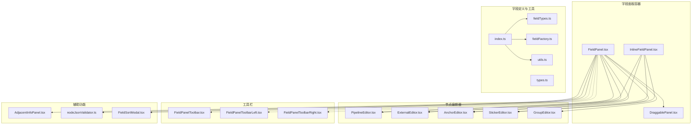
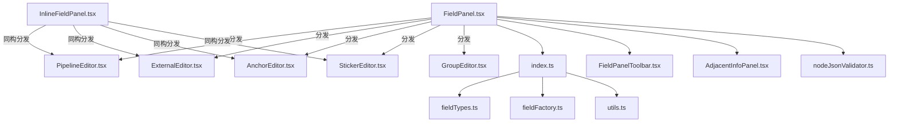
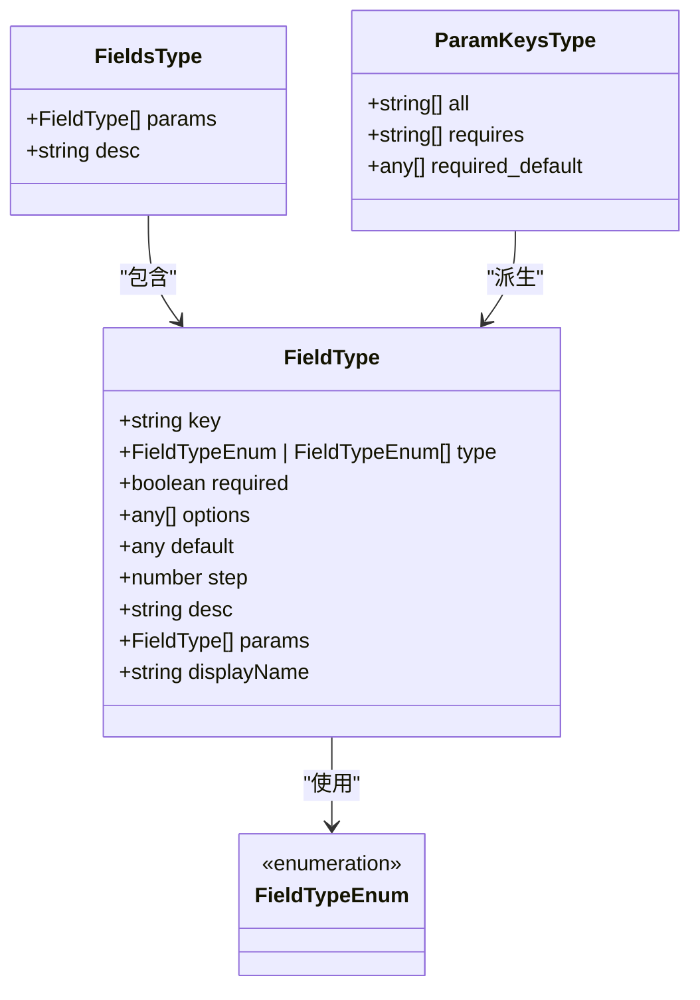
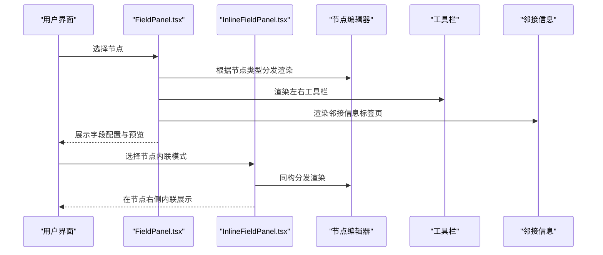
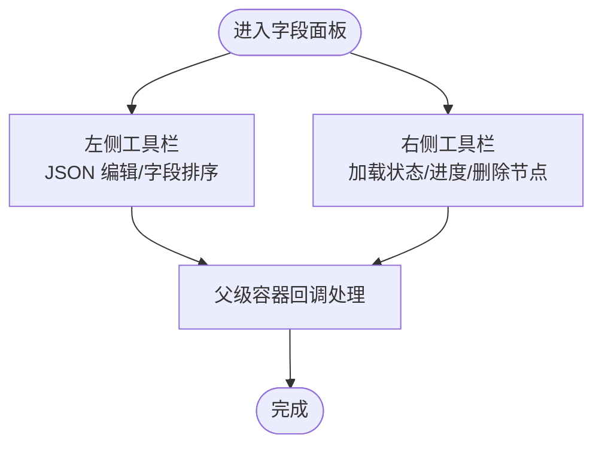
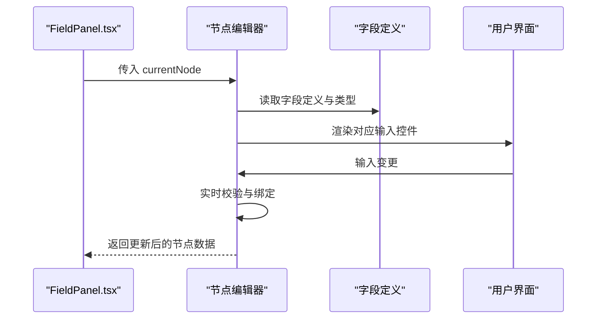
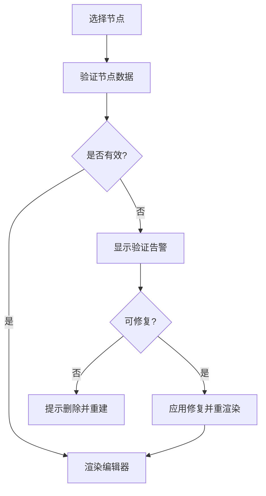
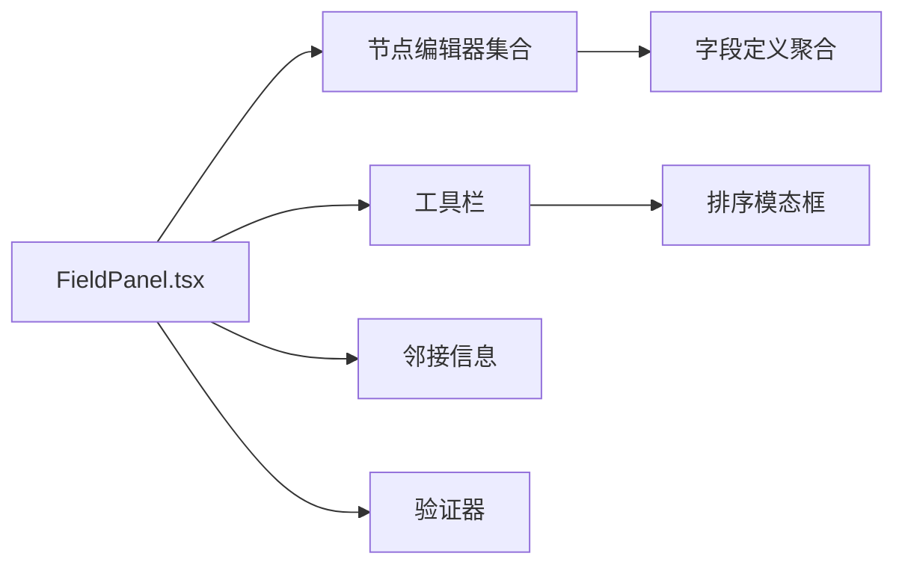

# 字段面板

<cite>
**本文引用的文件**
- [FieldPanel.tsx](file://src/components/panels/main/FieldPanel.tsx)
- [InlineFieldPanel.tsx](file://src/components/panels/main/InlineFieldPanel.tsx)
- [fieldFactory.ts](file://src/core/fields/fieldFactory.ts)
- [fieldTypes.ts](file://src/core/fields/fieldTypes.ts)
- [types.ts](file://src/core/fields/types.ts)
- [utils.ts](file://src/core/fields/utils.ts)
- [index.ts](file://src/core/fields/index.ts)
- [FieldPanelToolbar.tsx](file://src/components/panels/field/tools/FieldPanelToolbar.tsx)
- [FieldPanelToolbarLeft.tsx](file://src/components/panels/field/tools/FieldPanelToolbarLeft.tsx)
- [FieldPanelToolbarRight.tsx](file://src/components/panels/field/tools/FieldPanelToolbarRight.tsx)
- [PipelineEditor.tsx](file://src/components/panels/node-editors/PipelineEditor.tsx)
- [ExternalEditor.tsx](file://src/components/panels/node-editors/ExternalEditor.tsx)
- [AnchorEditor.tsx](file://src/components/panels/node-editors/AnchorEditor.tsx)
- [StickerEditor.tsx](file://src/components/panels/node-editors/StickerEditor.tsx)
- [GroupEditor.tsx](file://src/components/panels/node-editors/GroupEditor.tsx)
- [nodeJsonValidator.ts](file://src/utils/node/nodeJsonValidator.ts)
- [FieldSortModal.tsx](file://src/components/modals/FieldSortModal.tsx)
- [AdjacentInfoPanel.tsx](file://src/components/panels/main/AdjacentInfoPanel.tsx)
- [DraggablePanel.tsx](file://src/components/panels/common/DraggablePanel.tsx)
- [NodeTypeEnum.tsx](file://src/components/flow/nodes/NodeTypeEnum.tsx)
</cite>

## 目录
1. [引言](#引言)
2. [项目结构](#项目结构)
3. [核心组件](#核心组件)
4. [架构总览](#架构总览)
5. [详细组件分析](#详细组件分析)
6. [依赖关系分析](#依赖关系分析)
7. [性能考虑](#性能考虑)
8. [故障排查指南](#故障排查指南)
9. [结论](#结论)
10. [附录](#附录)

## 引言
本文件聚焦“字段面板”的技术实现，系统性阐述字段编辑器的架构设计、不同字段类型的渲染与验证、字段面板与节点编辑器的联动机制、字段工具栏的功能与使用模式，并提供扩展开发与自定义字段类型的实践指导。文档同时覆盖数据绑定、实时预览、错误处理与性能优化等关键技术细节。

## 项目结构
字段面板位于主界面右侧面板区域，支持三种呈现模式：固定侧边栏、可拖拽侧边栏、内嵌于节点旁的内联模式。其核心由以下模块组成：
- 面板容器：负责布局、状态管理、加载遮罩、验证告警、标签页切换、与节点编辑器的组合渲染。
- 节点编辑器：按节点类型分发到对应的编辑器组件（Pipeline/External/Anchor/Sticker/Group）。
- 字段定义体系：统一的字段类型、字段工厂、参数键生成与大写映射工具。
- 工具栏：左侧（JSON 编辑入口、字段排序等）、右侧（加载状态、进度反馈、删除节点）。
- 邻接信息面板：展示当前节点的邻接关系与上下文信息。
- 错误边界与修复：对节点编辑器进行错误捕获与自动修复。

图表来源
- [FieldPanel.tsx:103-491](file://src/components/panels/main/FieldPanel.tsx#L103-L491)
- [InlineFieldPanel.tsx:32-234](file://src/components/panels/main/InlineFieldPanel.tsx#L32-L234)
- [fieldTypes.ts:1-27](file://src/core/fields/fieldTypes.ts#L1-L27)
- [fieldFactory.ts:1-16](file://src/core/fields/fieldFactory.ts#L1-L16)
- [utils.ts:1-41](file://src/core/fields/utils.ts#L1-L41)
- [index.ts:1-46](file://src/core/fields/index.ts#L1-L46)
- [FieldPanelToolbar.tsx:1-200](file://src/components/panels/field/tools/FieldPanelToolbar.tsx)
- [FieldPanelToolbarLeft.tsx:1-200](file://src/components/panels/field/tools/FieldPanelToolbarLeft.tsx)
- [FieldPanelToolbarRight.tsx:1-200](file://src/components/panels/field/tools/FieldPanelToolbarRight.tsx)
- [AdjacentInfoPanel.tsx:1-200](file://src/components/panels/main/AdjacentInfoPanel.tsx)
- [nodeJsonValidator.ts:1-200](file://src/utils/node/nodeJsonValidator.ts)
- [FieldSortModal.tsx:1-200](file://src/components/modals/FieldSortModal.tsx)
- [DraggablePanel.tsx:1-200](file://src/components/panels/common/DraggablePanel.tsx)

章节来源
- [FieldPanel.tsx:103-491](file://src/components/panels/main/FieldPanel.tsx#L103-L491)
- [InlineFieldPanel.tsx:32-234](file://src/components/panels/main/InlineFieldPanel.tsx#L32-L234)
- [index.ts:1-46](file://src/core/fields/index.ts#L1-L46)

## 核心组件
- 字段面板容器（FieldPanel.tsx）
  - 管理面板激活/失活、占位系统、加载遮罩、验证告警、标签页切换、JSON 编辑弹窗。
  - 根据节点类型分发到对应编辑器；内置错误边界，渲染失败时提示修复。
  - 提供右侧工具栏控制加载状态、进度反馈、删除节点；左侧工具栏提供 JSON 编辑入口。
- 内联字段面板（InlineFieldPanel.tsx）
  - 在节点右侧内联渲染，跟随节点拖动实时更新位置；拖动时隐藏以避免干扰。
  - 支持相同编辑器分发逻辑与 JSON 编辑能力。
- 字段定义与工厂（fieldTypes.ts、fieldFactory.ts、types.ts、utils.ts、index.ts）
  - 统一字段类型枚举与字段描述结构；提供 createField/createFields 简化定义；生成参数键集合与大写映射。
- 工具栏（FieldPanelToolbar.tsx、FieldPanelToolbarLeft.tsx、FieldPanelToolbarRight.tsx）
  - 左侧：打开 JSON 编辑器、字段排序等入口。
  - 右侧：显示加载阶段与详情、触发删除节点操作。
- 邻接信息面板（AdjacentInfoPanel.tsx）
  - 展示当前节点的邻接关系与上下文信息，辅助字段配置决策。
- 节点编辑器（PipelineEditor.tsx、ExternalEditor.tsx、AnchorEditor.tsx、StickerEditor.tsx、GroupEditor.tsx）
  - 按节点类型渲染字段配置表单，负责字段的渲染、验证、绑定与实时预览。

章节来源
- [FieldPanel.tsx:103-491](file://src/components/panels/main/FieldPanel.tsx#L103-L491)
- [InlineFieldPanel.tsx:32-234](file://src/components/panels/main/InlineFieldPanel.tsx#L32-L234)
- [fieldTypes.ts:1-27](file://src/core/fields/fieldTypes.ts#L1-L27)
- [fieldFactory.ts:1-16](file://src/core/fields/fieldFactory.ts#L1-L16)
- [types.ts:1-34](file://src/core/fields/types.ts#L1-L34)
- [utils.ts:1-41](file://src/core/fields/utils.ts#L1-L41)
- [index.ts:1-46](file://src/core/fields/index.ts#L1-L46)
- [FieldPanelToolbar.tsx:1-200](file://src/components/panels/field/tools/FieldPanelToolbar.tsx)
- [FieldPanelToolbarLeft.tsx:1-200](file://src/components/panels/field/tools/FieldPanelToolbarLeft.tsx)
- [FieldPanelToolbarRight.tsx:1-200](file://src/components/panels/field/tools/FieldPanelToolbarRight.tsx)
- [AdjacentInfoPanel.tsx:1-200](file://src/components/panels/main/AdjacentInfoPanel.tsx)
- [PipelineEditor.tsx:1-200](file://src/components/panels/node-editors/PipelineEditor.tsx)
- [ExternalEditor.tsx:1-200](file://src/components/panels/node-editors/ExternalEditor.tsx)
- [AnchorEditor.tsx:1-200](file://src/components/panels/node-editors/AnchorEditor.tsx)
- [StickerEditor.tsx:1-200](file://src/components/panels/node-editors/StickerEditor.tsx)
- [GroupEditor.tsx:1-200](file://src/components/panels/node-editors/GroupEditor.tsx)

## 架构总览
字段面板采用“容器 + 分发 + 定义 + 工具”四层架构：
- 容器层：FieldPanel/InlineFieldPanel 负责面板生命周期、布局、状态与错误处理。
- 分发层：根据节点类型将渲染请求分发至对应编辑器。
- 定义层：统一的字段类型与工厂，提供参数键生成、大小写映射等工具。
- 工具层：工具栏、邻接信息、JSON 编辑器、排序模态框等辅助功能。

图表来源
- [FieldPanel.tsx:236-288](file://src/components/panels/main/FieldPanel.tsx#L236-L288)
- [InlineFieldPanel.tsx:118-141](file://src/components/panels/main/InlineFieldPanel.tsx#L118-L141)
- [index.ts:1-46](file://src/core/fields/index.ts#L1-L46)
- [FieldPanelToolbar.tsx:1-200](file://src/components/panels/field/tools/FieldPanelToolbar.tsx)
- [AdjacentInfoPanel.tsx:1-200](file://src/components/panels/main/AdjacentInfoPanel.tsx)
- [nodeJsonValidator.ts:1-200](file://src/utils/node/nodeJsonValidator.ts)

## 详细组件分析

### 字段定义与工厂
字段定义通过统一的类型系统与工厂方法实现：
- 字段类型枚举（fieldTypes.ts）：涵盖基础类型、列表类型、数组类型、图片路径类型等，满足识别、动作、其他场景的字段需求。
- 字段类型定义（types.ts）：定义 FieldType/FieldsType/ParamKeysType 结构，支持必填、选项、默认值、步长、描述、子参数列表、显示名等元信息。
- 字段工厂（fieldFactory.ts）：提供 createField/createFields 简化字段声明。
- 工具函数（utils.ts）：generateParamKeys 生成参数键集合（全部、必填、必填默认值）；generateUpperValues 生成字段键的大写映射，便于大小写不敏感匹配。
- 导出聚合（index.ts）：导出字段定义、工厂、工具与参数键映射，供上层使用。

图表来源
- [types.ts:6-33](file://src/core/fields/types.ts#L6-L33)
- [fieldTypes.ts:4-26](file://src/core/fields/fieldTypes.ts#L4-L26)

章节来源
- [fieldTypes.ts:1-27](file://src/core/fields/fieldTypes.ts#L1-L27)
- [types.ts:1-34](file://src/core/fields/types.ts#L1-L34)
- [fieldFactory.ts:1-16](file://src/core/fields/fieldFactory.ts#L1-L16)
- [utils.ts:1-41](file://src/core/fields/utils.ts#L1-L41)
- [index.ts:1-46](file://src/core/fields/index.ts#L1-L46)

### 字段面板容器与内联面板
- FieldPanel.tsx
  - 状态管理：面板激活/失活、加载遮罩、进度阶段与详情、验证告警、活动标签页、JSON 编辑弹窗开关。
  - 面板模式：根据配置决定固定/可拖拽/内联模式；可拖拽模式使用 DraggablePanel 包裹。
  - 内容渲染：根据节点类型分发到对应编辑器；若节点数据损坏则提示修复；支持邻接信息标签页。
  - 错误边界：EditorErrorBoundary 捕获渲染异常，提供修复按钮。
  - 工具栏：左侧 JSON 编辑入口；右侧加载状态、进度反馈、删除节点。
- InlineFieldPanel.tsx
  - 位置计算：基于节点实时位置与宽度，计算面板在节点右侧的位置；支持缩放比例。
  - 拖动屏蔽：拖动节点时隐藏内联面板，避免交互冲突。
  - 同构逻辑：与固定面板相同的编辑器分发与 JSON 编辑能力。

图表来源
- [FieldPanel.tsx:207-345](file://src/components/panels/main/FieldPanel.tsx#L207-L345)
- [InlineFieldPanel.tsx:118-141](file://src/components/panels/main/InlineFieldPanel.tsx#L118-L141)
- [FieldPanelToolbar.tsx:1-200](file://src/components/panels/field/tools/FieldPanelToolbar.tsx)
- [AdjacentInfoPanel.tsx:1-200](file://src/components/panels/main/AdjacentInfoPanel.tsx)

章节来源
- [FieldPanel.tsx:103-491](file://src/components/panels/main/FieldPanel.tsx#L103-L491)
- [InlineFieldPanel.tsx:32-234](file://src/components/panels/main/InlineFieldPanel.tsx#L32-L234)

### 字段工具栏
- 左侧工具栏（FieldPanelToolbarLeft.tsx）
  - 功能：打开节点 JSON 编辑器、字段排序入口（FieldSortModal）等。
  - 行为：接收 currentNode 作为上下文，调用父级回调执行具体操作。
- 右侧工具栏（FieldPanelToolbarRight.tsx）
  - 功能：接收 onLoadingChange/onProgressChange 回调，用于显示加载阶段与详情；提供删除节点能力。
- 工具栏聚合（FieldPanelToolbar.tsx）
  - 将左右工具栏组合，形成统一的面板头部区域。

图表来源
- [FieldPanelToolbarLeft.tsx:1-200](file://src/components/panels/field/tools/FieldPanelToolbarLeft.tsx)
- [FieldPanelToolbarRight.tsx:1-200](file://src/components/panels/field/tools/FieldPanelToolbarRight.tsx)
- [FieldPanelToolbar.tsx:1-200](file://src/components/panels/field/tools/FieldPanelToolbar.tsx)

章节来源
- [FieldPanelToolbar.tsx:1-200](file://src/components/panels/field/tools/FieldPanelToolbar.tsx)
- [FieldPanelToolbarLeft.tsx:1-200](file://src/components/panels/field/tools/FieldPanelToolbarLeft.tsx)
- [FieldPanelToolbarRight.tsx:1-200](file://src/components/panels/field/tools/FieldPanelToolbarRight.tsx)

### 节点编辑器与字段渲染
- PipelineEditor.tsx、ExternalEditor.tsx、AnchorEditor.tsx、StickerEditor.tsx、GroupEditor.tsx
  - 按节点类型渲染字段配置表单，负责字段的渲染、验证、绑定与实时预览。
  - 与字段定义体系配合，依据 FieldTypeEnum 选择合适的输入控件（文本、数值、布尔、列表、图片路径等）。
  - 支持子参数列表（params）的结构化渲染，满足复杂字段（如 focus）的配置需求。

图表来源
- [FieldPanel.tsx:236-288](file://src/components/panels/main/FieldPanel.tsx#L236-L288)
- [PipelineEditor.tsx:1-200](file://src/components/panels/node-editors/PipelineEditor.tsx)
- [ExternalEditor.tsx:1-200](file://src/components/panels/node-editors/ExternalEditor.tsx)
- [AnchorEditor.tsx:1-200](file://src/components/panels/node-editors/AnchorEditor.tsx)
- [StickerEditor.tsx:1-200](file://src/components/panels/node-editors/StickerEditor.tsx)
- [GroupEditor.tsx:1-200](file://src/components/panels/node-editors/GroupEditor.tsx)

章节来源
- [FieldPanel.tsx:236-288](file://src/components/panels/main/FieldPanel.tsx#L236-L288)
- [PipelineEditor.tsx:1-200](file://src/components/panels/node-editors/PipelineEditor.tsx)
- [ExternalEditor.tsx:1-200](file://src/components/panels/node-editors/ExternalEditor.tsx)
- [AnchorEditor.tsx:1-200](file://src/components/panels/node-editors/AnchorEditor.tsx)
- [StickerEditor.tsx:1-200](file://src/components/panels/node-editors/StickerEditor.tsx)
- [GroupEditor.tsx:1-200](file://src/components/panels/node-editors/GroupEditor.tsx)

### 字段验证与修复
- nodeJsonValidator.ts
  - 对节点数据进行验证与修复，返回 repaired 与 error 信息。
  - FieldPanel/InlineFieldPanel 在渲染前调用验证，若节点数据损坏则提示修复；若可修复则应用修复结果。
- 错误边界（EditorErrorBoundary）
  - 捕获节点编辑器渲染异常，提供“尝试修复”按钮，点击后重新渲染修复后的节点。

图表来源
- [FieldPanel.tsx:177-204](file://src/components/panels/main/FieldPanel.tsx#L177-L204)
- [InlineFieldPanel.tsx:118-141](file://src/components/panels/main/InlineFieldPanel.tsx#L118-L141)
- [nodeJsonValidator.ts:1-200](file://src/utils/node/nodeJsonValidator.ts)

章节来源
- [FieldPanel.tsx:177-204](file://src/components/panels/main/FieldPanel.tsx#L177-L204)
- [InlineFieldPanel.tsx:118-141](file://src/components/panels/main/InlineFieldPanel.tsx#L118-L141)
- [nodeJsonValidator.ts:1-200](file://src/utils/node/nodeJsonValidator.ts)

### 字段工具栏与字段排序
- FieldSortModal.tsx
  - 提供字段排序能力，允许用户调整字段顺序，提升配置效率。
- 工具栏集成
  - FieldPanelToolbarLeft.tsx 中提供打开排序模态框的入口，结合节点上下文进行排序操作。

章节来源
- [FieldSortModal.tsx:1-200](file://src/components/modals/FieldSortModal.tsx)
- [FieldPanelToolbarLeft.tsx:1-200](file://src/components/panels/field/tools/FieldPanelToolbarLeft.tsx)

## 依赖关系分析
- 容器与编辑器
  - FieldPanel/InlineFieldPanel 依赖各节点编辑器组件，通过节点类型枚举（NodeTypeEnum）进行分发。
- 字段定义与工厂
  - index.ts 聚合导出字段定义、工厂与工具，供编辑器与面板使用。
- 工具栏与辅助功能
  - 工具栏组件与邻接信息面板、JSON 编辑器、排序模态框共同构成字段面板的完整工具链。
- 错误处理
  - 面板容器与错误边界协同，确保渲染异常可被感知与修复。

图表来源
- [FieldPanel.tsx:103-491](file://src/components/panels/main/FieldPanel.tsx#L103-L491)
- [index.ts:1-46](file://src/core/fields/index.ts#L1-L46)
- [FieldPanelToolbar.tsx:1-200](file://src/components/panels/field/tools/FieldPanelToolbar.tsx)
- [AdjacentInfoPanel.tsx:1-200](file://src/components/panels/main/AdjacentInfoPanel.tsx)
- [nodeJsonValidator.ts:1-200](file://src/utils/node/nodeJsonValidator.ts)
- [FieldSortModal.tsx:1-200](file://src/components/modals/FieldSortModal.tsx)

章节来源
- [FieldPanel.tsx:103-491](file://src/components/panels/main/FieldPanel.tsx#L103-L491)
- [index.ts:1-46](file://src/core/fields/index.ts#L1-L46)

## 性能考虑
- 内联面板拖动屏蔽：在节点拖动过程中隐藏内联面板，减少不必要的重绘与事件处理。
- 加载遮罩与进度反馈：通过 onLoadingChange/onProgressChange 控制遮罩与进度文字，避免阻塞用户操作。
- 错误边界与最小化重渲染：错误边界隔离渲染异常，仅局部重渲染；面板容器使用 useMemo/memo 降低重渲染成本。
- 参数键与映射缓存：通过 generateParamKeys/generateUpperValues 生成的映射在初始化时计算，后续使用 O(1) 查找。

## 故障排查指南
- 节点数据损坏
  - 现象：面板显示“节点数据损坏”告警。
  - 处理：点击“应用修复”，面板会调用验证器修复并重渲染；若不可修复，建议删除节点并重新创建。
- 渲染失败
  - 现象：编辑器区域出现“节点编辑器渲染失败”告警。
  - 处理：点击“尝试修复”按钮，面板会重新渲染修复后的节点；若仍失败，请检查节点数据结构完整性。
- 验证告警频繁出现
  - 原因：节点数据不符合字段定义或缺失必填项。
  - 处理：根据告警信息补充或修正字段值；必要时使用 JSON 编辑器直接修改。

章节来源
- [FieldPanel.tsx:177-204](file://src/components/panels/main/FieldPanel.tsx#L177-L204)
- [FieldPanel.tsx:40-100](file://src/components/panels/main/FieldPanel.tsx#L40-L100)
- [nodeJsonValidator.ts:1-200](file://src/utils/node/nodeJsonValidator.ts)

## 结论
字段面板通过清晰的分层架构与完善的工具链，实现了对多节点类型的统一字段配置体验。字段定义体系提供了强一致的类型约束与便捷的工厂方法；面板容器与内联面板分别适配不同的交互场景；工具栏与邻接信息进一步提升了配置效率与可维护性。结合验证与修复机制，系统在保证正确性的同时兼顾了易用性与稳定性。

## 附录

### 字段类型与渲染策略
- 基础类型：整数、浮点、布尔、字符串等，通常映射到基础输入控件。
- 列表类型：整数列表、双精度列表、字符串列表、对象列表等，映射到可增删改的列表控件。
- 数组类型：二维数组、位置数组等，映射到结构化输入或坐标输入。
- 图片路径类型：提供图片选择器与路径校验。
- 子参数列表：通过 params 支持结构化字段（如 focus），实现分组与层级配置。

章节来源
- [fieldTypes.ts:1-27](file://src/core/fields/fieldTypes.ts#L1-L27)
- [types.ts:6-24](file://src/core/fields/types.ts#L6-L24)

### 扩展开发与自定义字段类型
- 新增字段类型
  - 在 fieldTypes.ts 中扩展 FieldTypeEnum。
  - 在对应字段集合（识别/动作/其他）中新增字段定义，使用 createField/createFields。
  - 若涉及复杂结构，可在 FieldType.params 中定义子参数列表。
- 自定义渲染控件
  - 在节点编辑器中根据字段类型选择对应的输入控件，实现自定义渲染与校验。
  - 保持与字段定义的一致性，确保参数键与默认值映射正确。
- 验证与修复
  - 在 nodeJsonValidator.ts 中完善验证规则，确保新增字段符合预期。
  - 对于可修复场景，提供合理的修复策略与回退方案。

章节来源
- [fieldTypes.ts:1-27](file://src/core/fields/fieldTypes.ts#L1-L27)
- [fieldFactory.ts:1-16](file://src/core/fields/fieldFactory.ts#L1-L16)
- [utils.ts:1-41](file://src/core/fields/utils.ts#L1-L41)
- [nodeJsonValidator.ts:1-200](file://src/utils/node/nodeJsonValidator.ts)