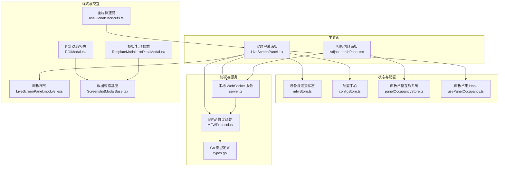
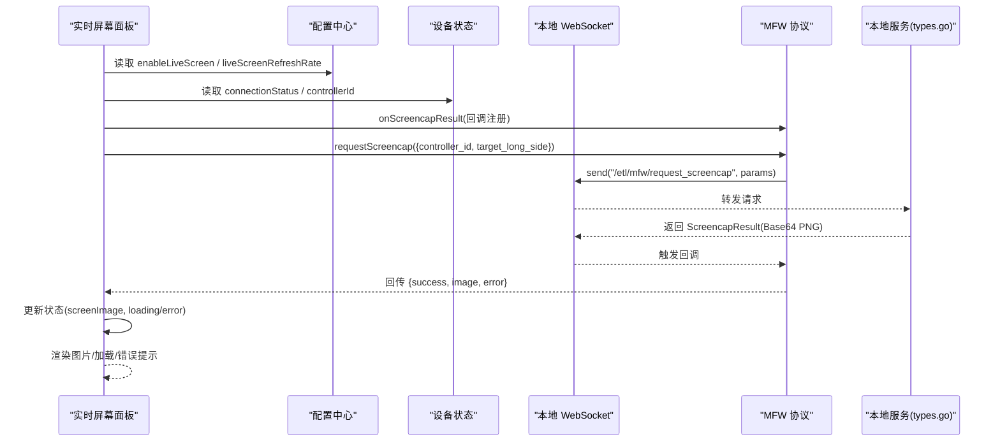
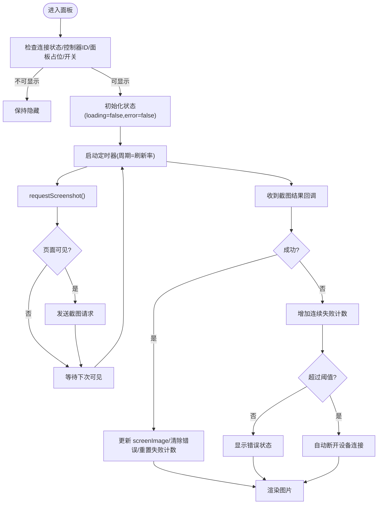
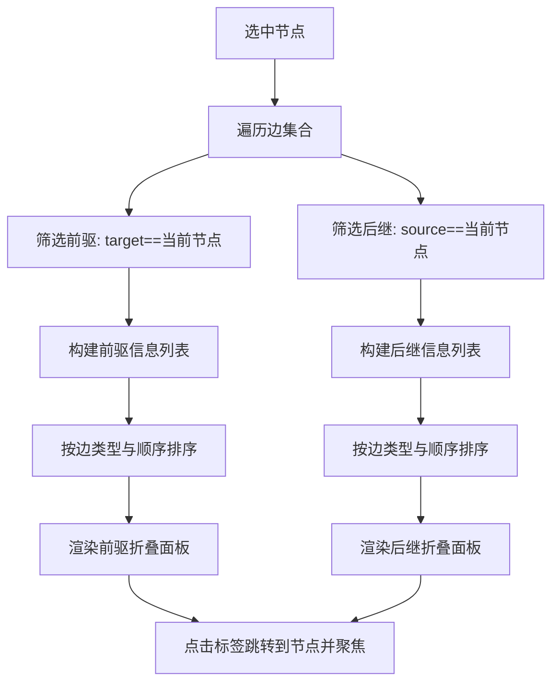
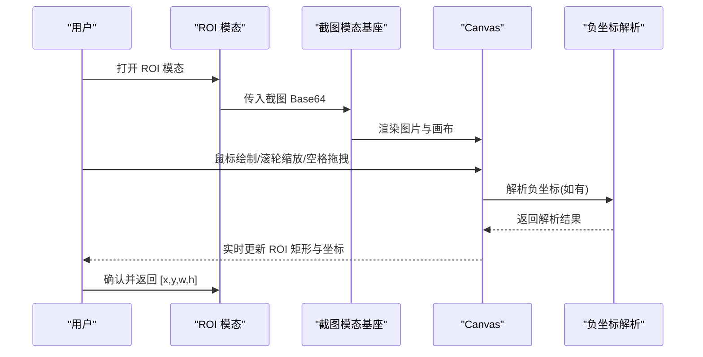
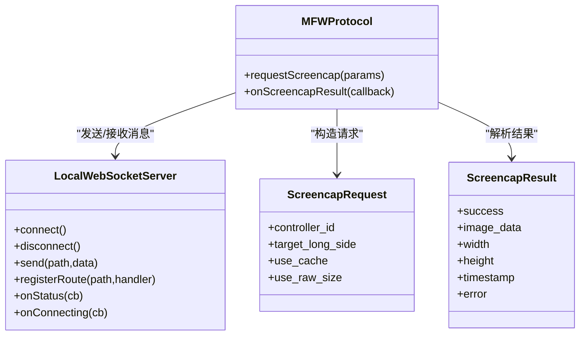
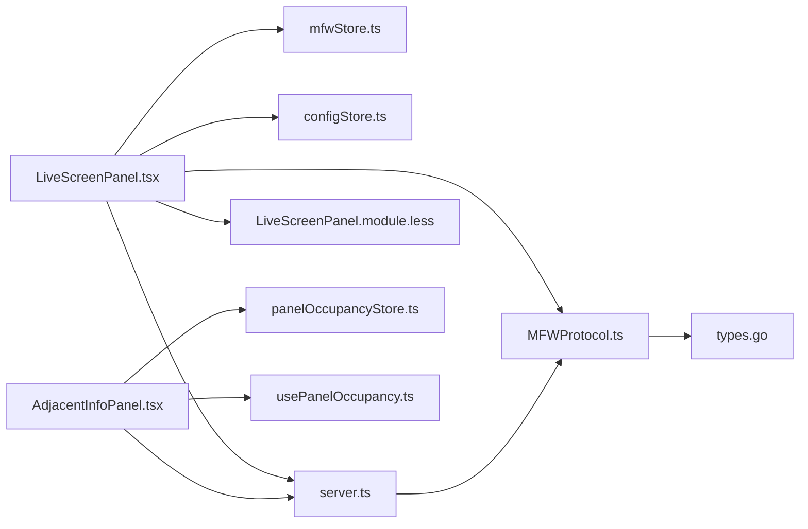

# 实时屏幕面板

<cite>
**本文引用的文件**
- [LiveScreenPanel.tsx](file://src/components/panels/main/LiveScreenPanel.tsx)
- [AdjacentInfoPanel.tsx](file://src/components/panels/main/AdjacentInfoPanel.tsx)
- [mfwStore.ts](file://src/stores/mfwStore.ts)
- [configStore.ts](file://src/stores/configStore.ts)
- [server.ts](file://src/services/server.ts)
- [MFWProtocol.ts](file://src/services/protocols/MFWProtocol.ts)
- [LiveScreenPanel.module.less](file://src/styles/panels/LiveScreenPanel.module.less)
- [panelOccupancyStore.ts](file://src/stores/panelOccupancyStore.ts)
- [usePanelOccupancy.ts](file://src/hooks/usePanelOccupancy.ts)
- [ScreenshotModalBase.tsx](file://src/components/modals/ScreenshotModalBase.tsx)
- [ROIModal.tsx](file://src/components/modals/ROIModal.tsx)
- [TemplateModal.tsx](file://src/components/modals/TemplateModal.tsx)
- [DeltaModal.tsx](file://src/components/modals/DeltaModal.tsx)
- [useGlobalShortcuts.ts](file://src/hooks/useGlobalShortcuts.ts)
- [types.go](file://LocalBridge/internal/mfw/types.go)
</cite>

## 目录
1. [引言](#引言)
2. [项目结构](#项目结构)
3. [核心组件](#核心组件)
4. [架构总览](#架构总览)
5. [详细组件分析](#详细组件分析)
6. [依赖分析](#依赖分析)
7. [性能考虑](#性能考虑)
8. [故障排查指南](#故障排查指南)
9. [结论](#结论)
10. [附录](#附录)

## 引言
本文件面向“实时屏幕面板”的技术实现，系统性解析以下主题：
- 屏幕捕获与实时预览：如何通过协议层发起截图请求、接收结果并渲染到面板。
- 相邻信息展示：基于工作流节点拓扑，呈现前驱/后继节点及其连接类型与顺序。
- 屏幕缩放、裁剪与标注：结合截图模态与画布工具，支持缩放、平移、ROI 选取与标注绘制。
- 实时屏幕与设备控制的集成：连接状态、控制器 ID、截图参数与错误处理。
- 性能优化与内存管理：节流、去抖、页面可见性感知、失败阈值与自动断连。
- 扩展开发与自定义显示模式：如何在现有协议与存储基础上扩展新的显示/交互模式。
- 用户体验优化与交互设计最佳实践：可见性反馈、即时反应、简化交互。

## 项目结构
实时屏幕面板位于主面板集合中，配合设备连接状态、配置中心与样式模块协同工作。相邻信息面板作为辅助信息面板，与工作流节点选择联动展示。

**图表来源**
- [LiveScreenPanel.tsx:15-156](file://src/components/panels/main/LiveScreenPanel.tsx#L15-L156)
- [AdjacentInfoPanel.tsx:43-344](file://src/components/panels/main/AdjacentInfoPanel.tsx#L43-L344)
- [mfwStore.ts:100-195](file://src/stores/mfwStore.ts#L100-L195)
- [configStore.ts:118-177](file://src/stores/configStore.ts#L118-L177)
- [server.ts:22-388](file://src/services/server.ts#L22-L388)
- [MFWProtocol.ts:577-628](file://src/services/protocols/MFWProtocol.ts#L577-L628)
- [LiveScreenPanel.module.less:1-89](file://src/styles/panels/LiveScreenPanel.module.less#L1-L89)
- [panelOccupancyStore.ts:32-135](file://src/stores/panelOccupancyStore.ts#L32-L135)
- [usePanelOccupancy.ts:48-60](file://src/hooks/usePanelOccupancy.ts#L48-L60)
- [ScreenshotModalBase.tsx:249-364](file://src/components/modals/ScreenshotModalBase.tsx#L249-L364)
- [ROIModal.tsx:1-537](file://src/components/modals/ROIModal.tsx#L1-L537)
- [TemplateModal.tsx:563-603](file://src/components/modals/TemplateModal.tsx#L563-L603)
- [DeltaModal.tsx:131-180](file://src/components/modals/DeltaModal.tsx#L131-L180)
- [useGlobalShortcuts.ts:156-169](file://src/hooks/useGlobalShortcuts.ts#L156-L169)
- [types.go:77-98](file://LocalBridge/internal/mfw/types.go#L77-L98)

**章节来源**
- [LiveScreenPanel.tsx:15-156](file://src/components/panels/main/LiveScreenPanel.tsx#L15-L156)
- [AdjacentInfoPanel.tsx:43-344](file://src/components/panels/main/AdjacentInfoPanel.tsx#L43-L344)
- [mfwStore.ts:100-195](file://src/stores/mfwStore.ts#L100-L195)
- [configStore.ts:118-177](file://src/stores/configStore.ts#L118-L177)
- [server.ts:22-388](file://src/services/server.ts#L22-L388)
- [MFWProtocol.ts:577-628](file://src/services/protocols/MFWProtocol.ts#L577-L628)
- [LiveScreenPanel.module.less:1-89](file://src/styles/panels/LiveScreenPanel.module.less#L1-L89)
- [panelOccupancyStore.ts:32-135](file://src/stores/panelOccupancyStore.ts#L32-L135)
- [usePanelOccupancy.ts:48-60](file://src/hooks/usePanelOccupancy.ts#L48-L60)
- [ScreenshotModalBase.tsx:249-364](file://src/components/modals/ScreenshotModalBase.tsx#L249-L364)
- [ROIModal.tsx:1-537](file://src/components/modals/ROIModal.tsx#L1-L537)
- [TemplateModal.tsx:563-603](file://src/components/modals/TemplateModal.tsx#L563-L603)
- [DeltaModal.tsx:131-180](file://src/components/modals/DeltaModal.tsx#L131-L180)
- [useGlobalShortcuts.ts:156-169](file://src/hooks/useGlobalShortcuts.ts#L156-L169)
- [types.go:77-98](file://LocalBridge/internal/mfw/types.go#L77-L98)

## 核心组件
- 实时屏幕面板：负责截图请求、结果监听、状态管理与 UI 渲染。
- 相邻信息面板：基于工作流拓扑计算并展示前驱/后继节点，支持跳转聚焦。
- 设备与连接状态：统一维护连接状态、控制器 ID、设备信息与错误。
- 配置中心：提供实时画面开关与刷新频率等可调参数。
- 协议与服务：封装 WebSocket 通信、版本握手、截图请求与结果回调。
- 样式与交互：面板布局、可见性切换、缩放/平移/标注工具与快捷键。

**章节来源**
- [LiveScreenPanel.tsx:15-156](file://src/components/panels/main/LiveScreenPanel.tsx#L15-L156)
- [AdjacentInfoPanel.tsx:43-344](file://src/components/panels/main/AdjacentInfoPanel.tsx#L43-L344)
- [mfwStore.ts:100-195](file://src/stores/mfwStore.ts#L100-L195)
- [configStore.ts:118-177](file://src/stores/configStore.ts#L118-L177)
- [server.ts:22-388](file://src/services/server.ts#L22-L388)
- [MFWProtocol.ts:577-628](file://src/services/protocols/MFWProtocol.ts#L577-L628)
- [LiveScreenPanel.module.less:1-89](file://src/styles/panels/LiveScreenPanel.module.less#L1-L89)

## 架构总览
实时屏幕面板通过 MFW 协议向本地服务发送截图请求，接收 Base64 图像数据并在面板中渲染。面板受连接状态、配置与面板占位互斥系统共同控制，具备失败阈值与自动断连保护。

**图表来源**
- [LiveScreenPanel.tsx:50-108](file://src/components/panels/main/LiveScreenPanel.tsx#L50-L108)
- [MFWProtocol.ts:577-595](file://src/services/protocols/MFWProtocol.ts#L577-L595)
- [server.ts:290-304](file://src/services/server.ts#L290-L304)
- [types.go:77-98](file://LocalBridge/internal/mfw/types.go#L77-L98)

## 详细组件分析

### 实时屏幕面板（LiveScreenPanel）
- 关键职责
  - 监听截图结果回调，更新屏幕图像与状态。
  - 周期性请求截图，受刷新率与页面可见性影响。
  - 失败计数与阈值控制，超过阈值自动断开设备连接。
  - 与面板占位系统协作，确保可见性与互斥。
- 数据流与状态
  - 输入：连接状态、控制器 ID、配置开关与刷新率。
  - 输出：屏幕图像、加载状态、错误状态。
  - 内部状态：请求中标志、连续失败计数。
- 性能与可靠性
  - 使用防抖与请求中标志避免并发请求。
  - 页面不可见时暂停请求，降低资源消耗。
  - 失败阈值与自动断连减少无效重试。
- 样式与交互
  - 采用绝对定位与可见性切换动画。
  - 支持加载态、错误态与图片态的条件渲染。

**图表来源**
- [LiveScreenPanel.tsx:44-108](file://src/components/panels/main/LiveScreenPanel.tsx#L44-L108)
- [LiveScreenPanel.module.less:19-28](file://src/styles/panels/LiveScreenPanel.module.less#L19-L28)

**章节来源**
- [LiveScreenPanel.tsx:15-156](file://src/components/panels/main/LiveScreenPanel.tsx#L15-L156)
- [LiveScreenPanel.module.less:1-89](file://src/styles/panels/LiveScreenPanel.module.less#L1-L89)
- [mfwStore.ts:100-195](file://src/stores/mfwStore.ts#L100-L195)
- [configStore.ts:118-177](file://src/stores/configStore.ts#L118-L177)
- [usePanelOccupancy.ts:48-60](file://src/hooks/usePanelOccupancy.ts#L48-L60)

### 相邻信息面板（AdjacentInfoPanel）
- 功能概述
  - 基于当前选中节点，遍历边集合，提取前驱与后继节点信息。
  - 按边类型（next/on_error）与顺序进行分组与排序。
  - 支持点击节点跳转到工作流视图并聚焦。
- 数据模型
  - 前驱/后继信息结构包含节点 ID、标签、类型、边类型、顺序与回跳标记。
- 渲染策略
  - 使用折叠面板分别展示前驱与后继，无连接时显示空状态。
  - 节点标签带颜色区分类型，点击可选中并聚焦。

**图表来源**
- [AdjacentInfoPanel.tsx:48-108](file://src/components/panels/main/AdjacentInfoPanel.tsx#L48-L108)
- [AdjacentInfoPanel.tsx:171-314](file://src/components/panels/main/AdjacentInfoPanel.tsx#L171-L314)

**章节来源**
- [AdjacentInfoPanel.tsx:43-344](file://src/components/panels/main/AdjacentInfoPanel.tsx#L43-L344)

### 截图与标注工具链
- 截图模态基座
  - 提供缩放、平移、重置与提示信息，支持滚轮缩放与空格/中键拖拽。
- ROI 选取
  - 支持输入与绘制 ROI，自动解析负坐标并可视化。
- 模板/标注
  - 提供画笔工具与遮罩画布，支持拖拽与滚轮事件拦截。
- 快捷键
  - 全局撤销/重做与删除键重定向，避免与输入框冲突。

**图表来源**
- [ScreenshotModalBase.tsx:249-364](file://src/components/modals/ScreenshotModalBase.tsx#L249-L364)
- [ROIModal.tsx:1-537](file://src/components/modals/ROIModal.tsx#L1-L537)
- [TemplateModal.tsx:563-603](file://src/components/modals/TemplateModal.tsx#L563-L603)
- [DeltaModal.tsx:131-180](file://src/components/modals/DeltaModal.tsx#L131-L180)

**章节来源**
- [ScreenshotModalBase.tsx:249-364](file://src/components/modals/ScreenshotModalBase.tsx#L249-L364)
- [ROIModal.tsx:1-537](file://src/components/modals/ROIModal.tsx#L1-L537)
- [TemplateModal.tsx:563-603](file://src/components/modals/TemplateModal.tsx#L563-L603)
- [DeltaModal.tsx:131-180](file://src/components/modals/DeltaModal.tsx#L131-L180)

### 协议与服务集成
- WebSocket 连接与握手
  - 版本校验失败时主动断开并提示。
  - 连接超时、错误与关闭均有明确反馈。
- 截图请求与结果
  - 前端通过 MFWProtocol 发送请求，后端返回 Base64 PNG 与尺寸信息。
  - 前端回调中更新 UI 状态并渲染图片。

**图表来源**
- [server.ts:22-388](file://src/services/server.ts#L22-L388)
- [MFWProtocol.ts:577-628](file://src/services/protocols/MFWProtocol.ts#L577-L628)
- [types.go:77-98](file://LocalBridge/internal/mfw/types.go#L77-L98)

**章节来源**
- [server.ts:22-388](file://src/services/server.ts#L22-L388)
- [MFWProtocol.ts:577-628](file://src/services/protocols/MFWProtocol.ts#L577-L628)
- [types.go:77-98](file://LocalBridge/internal/mfw/types.go#L77-L98)

## 依赖分析
- 组件耦合
  - 实时屏幕面板依赖设备状态、配置中心、协议封装与面板占位系统。
  - 相邻信息面板依赖工作流存储与节点位置计算。
- 外部依赖
  - 本地 WebSocket 服务与后端协议版本一致性。
  - 图像渲染依赖浏览器 Canvas 与图片解码。
- 潜在循环依赖
  - 通过协议封装与服务层隔离，避免 UI 与后端直接耦合。

**图表来源**
- [LiveScreenPanel.tsx:7-10](file://src/components/panels/main/LiveScreenPanel.tsx#L7-L10)
- [AdjacentInfoPanel.tsx:7-14](file://src/components/panels/main/AdjacentInfoPanel.tsx#L7-L14)
- [mfwStore.ts:100-127](file://src/stores/mfwStore.ts#L100-L127)
- [configStore.ts:118-177](file://src/stores/configStore.ts#L118-L177)
- [server.ts:345-387](file://src/services/server.ts#L345-L387)
- [MFWProtocol.ts:577-595](file://src/services/protocols/MFWProtocol.ts#L577-L595)
- [panelOccupancyStore.ts:32-135](file://src/stores/panelOccupancyStore.ts#L32-L135)
- [usePanelOccupancy.ts:48-60](file://src/hooks/usePanelOccupancy.ts#L48-L60)
- [types.go:77-98](file://LocalBridge/internal/mfw/types.go#L77-L98)

**章节来源**
- [LiveScreenPanel.tsx:7-10](file://src/components/panels/main/LiveScreenPanel.tsx#L7-L10)
- [AdjacentInfoPanel.tsx:7-14](file://src/components/panels/main/AdjacentInfoPanel.tsx#L7-L14)
- [mfwStore.ts:100-127](file://src/stores/mfwStore.ts#L100-L127)
- [configStore.ts:118-177](file://src/stores/configStore.ts#L118-L177)
- [server.ts:345-387](file://src/services/server.ts#L345-L387)
- [MFWProtocol.ts:577-595](file://src/services/protocols/MFWProtocol.ts#L577-L595)
- [panelOccupancyStore.ts:32-135](file://src/stores/panelOccupancyStore.ts#L32-L135)
- [usePanelOccupancy.ts:48-60](file://src/hooks/usePanelOccupancy.ts#L48-L60)
- [types.go:77-98](file://LocalBridge/internal/mfw/types.go#L77-L98)

## 性能考虑
- 请求节流与并发控制
  - 使用请求中标志与定时器，避免重复请求与高并发。
- 页面可见性感知
  - 页面隐藏时暂停截图请求，降低 CPU/GPU 与网络压力。
- 失败阈值与自动断连
  - 连续失败达到阈值后自动断开，防止无效重试与资源浪费。
- 渲染优化
  - 图片容器使用 object-fit 与阴影，避免过度重排。
  - 缩放/平移通过 CSS transform 实现，减少 DOM 变更。
- 存储与缓存
  - 截图结果以 Base64 传递，避免额外中间层；建议在后端实现缓存与压缩策略（需后端配合）。

[本节为通用性能讨论，无需特定文件引用]

## 故障排查指南
- 连接失败/超时
  - 检查本地服务是否启动、端口是否正确、协议版本是否匹配。
  - 查看连接状态回调与错误提示，确认握手失败原因。
- 截图异常
  - 确认控制器 ID 是否有效、连接状态是否为已连接。
  - 观察连续失败计数，超过阈值会自动断开。
- 面板不可见
  - 检查面板占位互斥系统是否被其他面板抢占。
  - 确认配置开关与刷新率设置合理。
- 交互问题
  - 若滚轮缩放无效，检查模态是否拦截了滚轮事件。
  - 快捷键冲突时，确认当前焦点元素与模态状态。

**章节来源**
- [server.ts:108-270](file://src/services/server.ts#L108-L270)
- [LiveScreenPanel.tsx:50-108](file://src/components/panels/main/LiveScreenPanel.tsx#L50-L108)
- [panelOccupancyStore.ts:100-135](file://src/stores/panelOccupancyStore.ts#L100-L135)
- [ScreenshotModalBase.tsx:249-364](file://src/components/modals/ScreenshotModalBase.tsx#L249-L364)
- [useGlobalShortcuts.ts:156-169](file://src/hooks/useGlobalShortcuts.ts#L156-L169)

## 结论
实时屏幕面板通过清晰的状态管理、可靠的协议封装与稳健的错误处理，实现了稳定的设备画面预览。相邻信息面板进一步增强了工作流上下文感知。结合截图与标注工具链，用户可在同一界面完成画面观测、ROI 选取与标注绘制。建议在后续迭代中引入后端缓存与压缩、更细粒度的失败恢复策略以及更丰富的自定义显示模式。

[本节为总结性内容，无需特定文件引用]

## 附录

### 扩展开发与自定义显示模式
- 新增显示模式
  - 在配置中心新增模式开关与参数键，驱动面板渲染分支。
  - 在协议层扩展请求参数与结果字段，确保前后端一致。
- 新增交互工具
  - 在截图模态基座中扩展工具栏按钮与事件处理器。
  - 通过工具状态与画布渲染逻辑实现新的标注/测量能力。
- 最佳实践
  - 保持 UI 与业务逻辑分离，使用 Hook 抽象复用逻辑。
  - 对外暴露稳定接口，对内采用渐进增强策略。

[本节为通用指导，无需特定文件引用]

### 用户体验优化与交互设计最佳实践
- 即时反应
  - 操作后立即反馈（加载/错误/成功），避免无提示等待。
- 简化交互
  - 将高频操作置于内容中（如缩放/平移按钮），减少用户移动距离。
- 意义感
  - 明确目标与路径，为每个操作提供清晰的结果预期。
- 生长性
  - 随用户能力提升逐步开放高级功能，避免一次性堆叠复杂工具。

[本节为通用指导，无需特定文件引用]