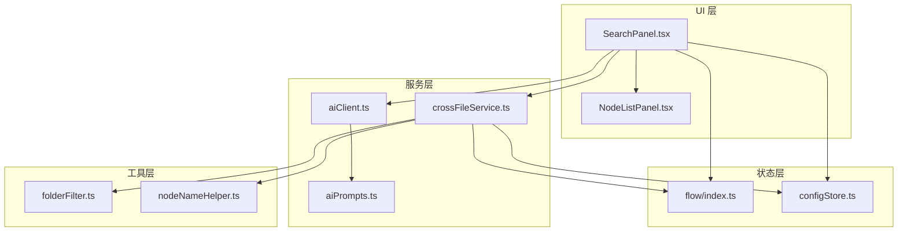
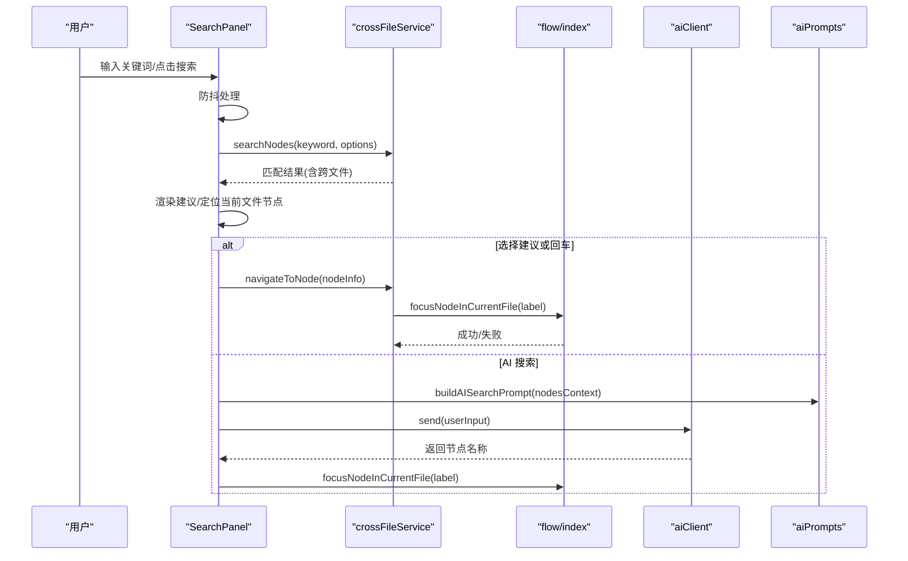
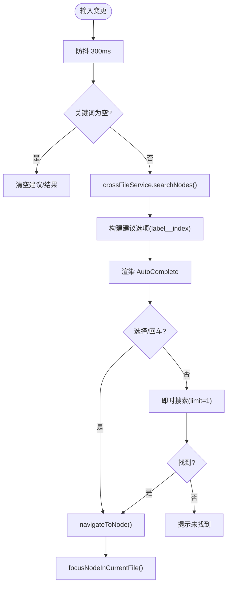
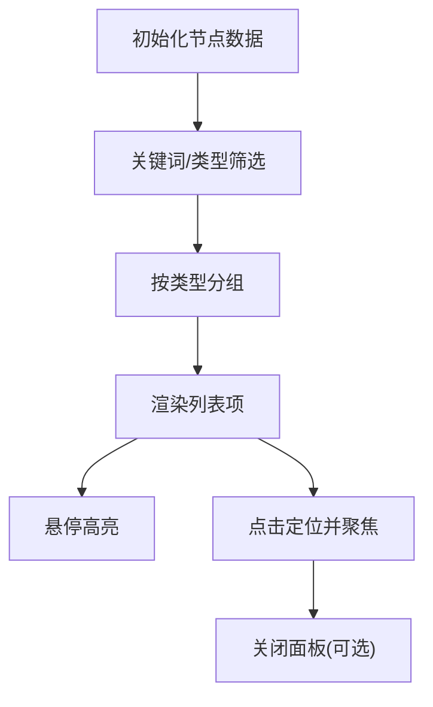
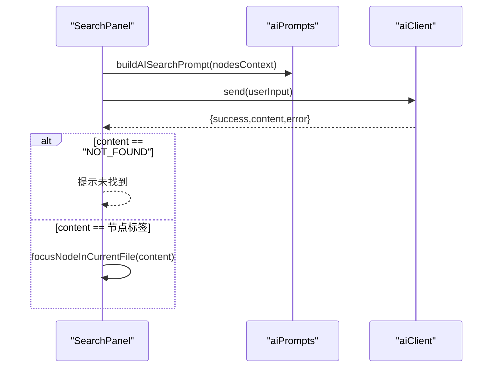
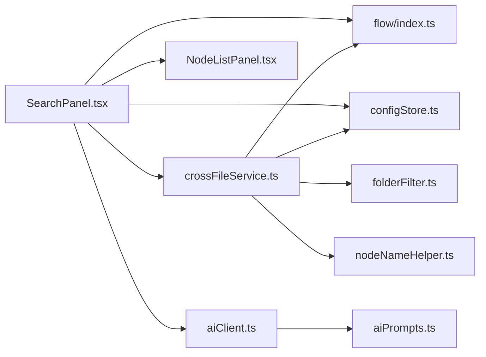

# 搜索面板

<cite>
**本文档引用的文件**
- [SearchPanel.tsx](file://src/components/panels/main/SearchPanel.tsx)
- [crossFileService.ts](file://src/services/crossFileService.ts)
- [flow/index.ts](file://src/stores/flow/index.ts)
- [configStore.ts](file://src/stores/configStore.ts)
- [NodeListPanel.tsx](file://src/components/panels/main/node-list/NodeListPanel.tsx)
- [NodeListItem.tsx](file://src/components/panels/main/node-list/NodeListItem.tsx)
- [aiPrompts.ts](file://src/utils/ai/aiPrompts.ts)
- [aiClient.ts](file://src/utils/ai/aiClient.ts)
- [folderFilter.ts](file://src/utils/file/folderFilter.ts)
- [nodeNameHelper.ts](file://src/utils/node/nodeNameHelper.ts)
</cite>

## 目录
1. [简介](#简介)
2. [项目结构](#项目结构)
3. [核心组件](#核心组件)
4. [架构总览](#架构总览)
5. [详细组件分析](#详细组件分析)
6. [依赖关系分析](#依赖关系分析)
7. [性能考量](#性能考量)
8. [故障排查指南](#故障排查指南)
9. [结论](#结论)
10. [附录](#附录)

## 简介
本文件面向“搜索面板”的技术实现与使用，覆盖以下主题：
- 全局搜索、节点查找、快速定位的实现机制
- 搜索算法、匹配策略、结果排序的技术实现
- 搜索面板与工作流数据的索引与查询机制
- 搜索体验优化与性能提升策略
- 搜索功能扩展与自定义搜索规则的开发指导
- 搜索面板的用户体验设计与交互优化方案

## 项目结构
搜索面板位于主面板区域，围绕“搜索输入 + 结果建议 + 跨文件跳转 + AI 智能搜索 + 节点列表”四个核心能力组织：
- UI 层：SearchPanel.tsx 提供输入、建议、按钮与交互
- 数据层：crossFileService.ts 提供跨文件节点索引、搜索与跳转
- 状态层：flow/index.ts 提供节点选择与视图聚焦
- 配置层：configStore.ts 提供跨文件搜索开关与过滤器
- AI 层：aiPrompts.ts 与 aiClient.ts 提供智能搜索提示词与对话
- 工具层：folderFilter.ts、nodeNameHelper.ts 提供路径过滤与节点名处理



图表来源
- [SearchPanel.tsx:1-437](file://src/components/panels/main/SearchPanel.tsx#L1-L437)
- [crossFileService.ts:1-740](file://src/services/crossFileService.ts#L1-L740)
- [flow/index.ts:1-124](file://src/stores/flow/index.ts#L1-L124)
- [configStore.ts:1-440](file://src/stores/configStore.ts#L1-L440)
- [NodeListPanel.tsx:1-426](file://src/components/panels/main/node-list/NodeListPanel.tsx#L1-L426)
- [aiPrompts.ts:1-445](file://src/utils/ai/aiPrompts.ts#L1-L445)
- [aiClient.ts:1-520](file://src/utils/ai/aiClient.ts#L1-L520)
- [folderFilter.ts:1-45](file://src/utils/file/folderFilter.ts#L1-L45)
- [nodeNameHelper.ts:1-44](file://src/utils/node/nodeNameHelper.ts#L1-L44)

章节来源
- [SearchPanel.tsx:1-437](file://src/components/panels/main/SearchPanel.tsx#L1-L437)
- [crossFileService.ts:1-740](file://src/services/crossFileService.ts#L1-L740)
- [flow/index.ts:1-124](file://src/stores/flow/index.ts#L1-L124)
- [configStore.ts:1-440](file://src/stores/configStore.ts#L1-L440)
- [NodeListPanel.tsx:1-426](file://src/components/panels/main/node-list/NodeListPanel.tsx#L1-L426)
- [aiPrompts.ts:1-445](file://src/utils/ai/aiPrompts.ts#L1-L445)
- [aiClient.ts:1-520](file://src/utils/ai/aiClient.ts#L1-L520)
- [folderFilter.ts:1-45](file://src/utils/file/folderFilter.ts#L1-L45)
- [nodeNameHelper.ts:1-44](file://src/utils/node/nodeNameHelper.ts#L1-L44)

## 核心组件
- 搜索面板 SearchPanel：负责输入、防抖搜索、结果建议、跨文件跳转、AI 搜索、节点列表入口
- 跨文件服务 crossFileService：负责节点索引、模糊匹配、排序、跨文件跳转、自动完成
- 节点列表面板 NodeListPanel：提供节点清单、筛选、分组与快速定位
- AI 客户端与提示词：构建系统提示词，调用统一 AI Provider，返回节点名称
- 配置与工具：跨文件搜索开关、文件夹过滤、节点名前缀处理

章节来源
- [SearchPanel.tsx:28-437](file://src/components/panels/main/SearchPanel.tsx#L28-L437)
- [crossFileService.ts:48-740](file://src/services/crossFileService.ts#L48-L740)
- [NodeListPanel.tsx:46-426](file://src/components/panels/main/node-list/NodeListPanel.tsx#L46-L426)
- [aiPrompts.ts:416-433](file://src/utils/ai/aiPrompts.ts#L416-L433)
- [aiClient.ts:45-520](file://src/utils/ai/aiClient.ts#L45-L520)
- [configStore.ts:118-239](file://src/stores/configStore.ts#L118-L239)
- [folderFilter.ts:16-45](file://src/utils/file/folderFilter.ts#L16-L45)
- [nodeNameHelper.ts:14-44](file://src/utils/node/nodeNameHelper.ts#L14-L44)

## 架构总览
搜索面板采用“UI 触发 + 服务计算 + 状态联动 + AI 辅助”的分层架构：
- UI 层：输入框、自动完成、按钮、节点列表弹层
- 服务层：跨文件节点索引、搜索与跳转、自动完成选项
- 状态层：节点选择、视图聚焦、文件切换
- AI 层：系统提示词构建、请求发送、响应解析
- 工具层：路径过滤、节点名处理、配置读取



图表来源
- [SearchPanel.tsx:66-92](file://src/components/panels/main/SearchPanel.tsx#L66-L92)
- [SearchPanel.tsx:134-148](file://src/components/panels/main/SearchPanel.tsx#L134-L148)
- [SearchPanel.tsx:196-279](file://src/components/panels/main/SearchPanel.tsx#L196-L279)
- [crossFileService.ts:214-275](file://src/services/crossFileService.ts#L214-L275)
- [crossFileService.ts:330-364](file://src/services/crossFileService.ts#L330-L364)
- [flow/index.ts:418-448](file://src/stores/flow/index.ts#L418-L448)
- [aiPrompts.ts:416-433](file://src/utils/ai/aiPrompts.ts#L416-L433)
- [aiClient.ts:203-282](file://src/utils/ai/aiClient.ts#L203-L282)

## 详细组件分析

### 搜索面板 SearchPanel
- 防抖搜索：使用防抖函数对输入进行节流，降低跨文件搜索压力
- 结果建议：将跨文件搜索结果映射为 AutoComplete 选项，显示节点名与文件路径
- 跨文件跳转：优先在当前文件定位，否则通过服务层切换文件并定位
- AI 智能搜索：构建节点上下文提示词，调用统一 AI 客户端，返回节点名称并定位
- 节点列表：通过门户化弹层展示节点清单，支持关键词与类型筛选、分组展开



图表来源
- [SearchPanel.tsx:66-92](file://src/components/panels/main/SearchPanel.tsx#L66-L92)
- [SearchPanel.tsx:74-90](file://src/components/panels/main/SearchPanel.tsx#L74-L90)
- [SearchPanel.tsx:134-148](file://src/components/panels/main/SearchPanel.tsx#L134-L148)
- [SearchPanel.tsx:95-131](file://src/components/panels/main/SearchPanel.tsx#L95-L131)

章节来源
- [SearchPanel.tsx:28-437](file://src/components/panels/main/SearchPanel.tsx#L28-L437)

### 跨文件服务 crossFileService
- 节点索引：聚合本地文件与前端已加载文件的节点，支持文件夹过滤
- 搜索匹配：模糊匹配节点标签与完整节点名，支持类型过滤与跨文件开关
- 排序策略：当前文件优先、完全匹配优先、前缀匹配优先
- 跳转机制：当前文件直接定位；已加载文件切换后定位；未加载文件通过后端加载并轮询定位
- 自动完成：提供带前缀的完整节点名与描述信息

```mermaid
classDiagram
class CrossFileService {
+getAllNodes() CrossFileNodeInfo[]
+searchNodes(keyword, options) CrossFileNodeInfo[]
+navigateToNode(nodeInfo) Promise~boolean~
+navigateToNodeByName(name, options) Promise
+navigateToNodeByFileAndLabel(path, label) Promise~boolean~
+getAutoCompleteOptions(exclude) Array
+parseNodeName(fullName) {prefix,label}|null
+getFullNodeName(label, filePath?) string|null
-focusNodeInCurrentFile(label) boolean
-loadAndNavigate(filePath, nodeLabel) Promise~boolean~
}
class CrossFileNodeInfo {
+string label
+string fullName
+NodeTypeEnum nodeType
+string filePath
+string relativePath
+boolean isCurrentFile
+boolean isLoaded
+string prefix
}
CrossFileService --> CrossFileNodeInfo : "返回"
```

图表来源
- [crossFileService.ts:48-740](file://src/services/crossFileService.ts#L48-L740)
- [crossFileService.ts:26-43](file://src/services/crossFileService.ts#L26-L43)

章节来源
- [crossFileService.ts:61-206](file://src/services/crossFileService.ts#L61-L206)
- [crossFileService.ts:214-275](file://src/services/crossFileService.ts#L214-L275)
- [crossFileService.ts:330-526](file://src/services/crossFileService.ts#L330-L526)
- [crossFileService.ts:590-619](file://src/services/crossFileService.ts#L590-L619)
- [crossFileService.ts:532-559](file://src/services/crossFileService.ts#L532-L559)
- [crossFileService.ts:566-584](file://src/services/crossFileService.ts#L566-L584)

### 节点列表面板 NodeListPanel
- 筛选与分组：支持关键词与节点类型筛选，按节点类型分组并可展开/折叠
- 交互：点击节点项选中并聚焦视图；悬停高亮；ESC 关闭；点击外部区域关闭
- 统计：显示节点总数与各类型数量



图表来源
- [NodeListPanel.tsx:128-209](file://src/components/panels/main/node-list/NodeListPanel.tsx#L128-L209)
- [NodeListPanel.tsx:225-250](file://src/components/panels/main/node-list/NodeListPanel.tsx#L225-L250)
- [NodeListPanel.tsx:318-330](file://src/components/panels/main/node-list/NodeListPanel.tsx#L318-L330)

章节来源
- [NodeListPanel.tsx:46-426](file://src/components/panels/main/node-list/NodeListPanel.tsx#L46-L426)
- [NodeListItem.tsx:22-109](file://src/components/panels/main/node-list/NodeListItem.tsx#L22-L109)

### AI 搜索与提示词
- 提示词构建：基于节点上下文（标签、类型、识别/动作参数等）生成系统提示词
- AI 客户端：统一 Provider、代理转发、重试与错误格式化、历史记录
- 返回约定：仅返回节点标签；未找到返回特殊标记；异常捕获并提示



图表来源
- [SearchPanel.tsx:225-279](file://src/components/panels/main/SearchPanel.tsx#L225-L279)
- [aiPrompts.ts:416-433](file://src/utils/ai/aiPrompts.ts#L416-L433)
- [aiClient.ts:203-282](file://src/utils/ai/aiClient.ts#L203-L282)

章节来源
- [aiPrompts.ts:416-433](file://src/utils/ai/aiPrompts.ts#L416-L433)
- [aiClient.ts:45-520](file://src/utils/ai/aiClient.ts#L45-L520)
- [SearchPanel.tsx:225-279](file://src/components/panels/main/SearchPanel.tsx#L225-L279)

### 配置与工具
- 跨文件搜索开关：来自配置中心，决定是否启用跨文件搜索与文件夹过滤
- 文件夹过滤：支持多分隔符、路径归一化、前缀匹配
- 节点名处理：统一带/去前缀的节点名拼接与拆分

章节来源
- [configStore.ts:118-239](file://src/stores/configStore.ts#L118-L239)
- [folderFilter.ts:16-45](file://src/utils/file/folderFilter.ts#L16-L45)
- [nodeNameHelper.ts:14-44](file://src/utils/node/nodeNameHelper.ts#L14-L44)

## 依赖关系分析
- SearchPanel 依赖 crossFileService（搜索与跳转）、flow/index（节点选择与视图聚焦）、configStore（跨文件开关）、NodeListPanel（节点列表）
- crossFileService 依赖 flow/index（当前文件节点查询）、configStore（跨文件开关与过滤器）、localFileStore（本地文件节点）、fileStore（已加载文件）
- AI 搜索依赖 aiPrompts（提示词）与 aiClient（统一客户端）
- 工具层为跨文件服务提供路径过滤与节点名处理



图表来源
- [SearchPanel.tsx:10-25](file://src/components/panels/main/SearchPanel.tsx#L10-L25)
- [crossFileService.ts:6-17](file://src/services/crossFileService.ts#L6-L17)
- [flow/index.ts:1-16](file://src/stores/flow/index.ts#L1-L16)
- [configStore.ts:1-17](file://src/stores/configStore.ts#L1-L17)
- [NodeListPanel.tsx:10-23](file://src/components/panels/main/node-list/NodeListPanel.tsx#L10-L23)
- [aiClient.ts:6-17](file://src/utils/ai/aiClient.ts#L6-L17)
- [aiPrompts.ts:6](file://src/utils/ai/aiPrompts.ts#L6)
- [folderFilter.ts:1-21](file://src/utils/file/folderFilter.ts#L1-L21)
- [nodeNameHelper.ts:6-18](file://src/utils/node/nodeNameHelper.ts#L6-L18)

章节来源
- [SearchPanel.tsx:10-25](file://src/components/panels/main/SearchPanel.tsx#L10-L25)
- [crossFileService.ts:6-17](file://src/services/crossFileService.ts#L6-L17)
- [flow/index.ts:1-16](file://src/stores/flow/index.ts#L1-L16)
- [configStore.ts:1-17](file://src/stores/configStore.ts#L1-L17)
- [NodeListPanel.tsx:10-23](file://src/components/panels/main/node-list/NodeListPanel.tsx#L10-L23)
- [aiClient.ts:6-17](file://src/utils/ai/aiClient.ts#L6-L17)
- [aiPrompts.ts:6](file://src/utils/ai/aiPrompts.ts#L6)
- [folderFilter.ts:1-21](file://src/utils/file/folderFilter.ts#L1-L21)
- [nodeNameHelper.ts:6-18](file://src/utils/node/nodeNameHelper.ts#L6-L18)

## 性能考量
- 防抖优化：输入防抖 300ms，显著降低跨文件搜索频率
- 结果限制：默认限制返回数量，避免 UI 压力
- 排序优先级：当前文件优先、完全匹配优先、前缀匹配优先，提高命中率与反馈速度
- 轮询等待：跨文件加载后轮询等待节点出现，避免立即失败
- 路径过滤：通过文件夹过滤减少索引规模
- 视图聚焦：仅在定位成功时更新视图，避免无效渲染

章节来源
- [SearchPanel.tsx:66-92](file://src/components/panels/main/SearchPanel.tsx#L66-L92)
- [crossFileService.ts:214-275](file://src/services/crossFileService.ts#L214-L275)
- [crossFileService.ts:453-526](file://src/services/crossFileService.ts#L453-L526)
- [folderFilter.ts:16-45](file://src/utils/file/folderFilter.ts#L16-L45)

## 故障排查指南
- 跨文件搜索无结果
  - 检查跨文件搜索开关与文件夹过滤配置
  - 确认 LocalBridge 连接状态与本地文件扫描
- 跳转失败
  - 检查目标文件是否已加载；未加载则通过后端加载并等待
  - 确认节点标签是否存在
- AI 搜索异常
  - 检查 AI 配置（URL、Key、模型、温度）
  - 若为 CORS 问题，启用 LocalBridge 代理或调整跨域设置
- 节点列表为空
  - 检查当前文件是否包含节点
  - 确认筛选条件是否过于严格

章节来源
- [configStore.ts:118-239](file://src/stores/configStore.ts#L118-L239)
- [crossFileService.ts:52-54](file://src/services/crossFileService.ts#L52-L54)
- [crossFileService.ts:453-526](file://src/services/crossFileService.ts#L453-L526)
- [aiClient.ts:113-133](file://src/utils/ai/aiClient.ts#L113-L133)

## 结论
搜索面板通过“防抖 + 模糊匹配 + 排序优先级 + 跨文件跳转 + AI 辅助 + 节点列表”的组合，实现了高效、直观、可扩展的节点检索体验。其分层架构清晰、依赖关系明确，便于进一步扩展与优化。

## 附录

### 搜索算法与匹配策略
- 匹配对象：节点标签与完整节点名（含前缀）
- 匹配方式：大小写无关的包含匹配与前缀匹配
- 排序规则：当前文件优先 > 完全匹配优先 > 前缀匹配优先 > 其他
- 限制：支持类型过滤与结果数量限制

章节来源
- [crossFileService.ts:247-275](file://src/services/crossFileService.ts#L247-L275)

### 跨文件跳转机制
- 当前文件：直接定位
- 已加载文件：切换文件后定位
- 未加载文件：通过后端加载并轮询等待节点出现

章节来源
- [crossFileService.ts:330-364](file://src/services/crossFileService.ts#L330-L364)
- [crossFileService.ts:453-526](file://src/services/crossFileService.ts#L453-L526)

### AI 搜索提示词与返回约定
- 系统提示词：强调仅返回节点标签，未找到返回特定标记
- 返回处理：解析返回内容，定位当前文件节点

章节来源
- [aiPrompts.ts:416-433](file://src/utils/ai/aiPrompts.ts#L416-L433)
- [SearchPanel.tsx:265-272](file://src/components/panels/main/SearchPanel.tsx#L265-L272)

### 用户体验与交互优化
- 输入建议：自动完成下拉，显示文件路径
- 快速定位：回车直达首个结果
- 节点列表：右侧悬浮面板，支持筛选与分组
- 焦点管理：失焦自动收起建议，避免遮挡

章节来源
- [SearchPanel.tsx:332-432](file://src/components/panels/main/SearchPanel.tsx#L332-L432)
- [NodeListPanel.tsx:347-421](file://src/components/panels/main/node-list/NodeListPanel.tsx#L347-L421)

### 扩展开发与自定义规则
- 新增匹配维度：在搜索函数中增加新的匹配字段（如动作类型、识别类型）
- 自定义排序：调整排序优先级逻辑以适配业务场景
- 自定义过滤：在搜索前增加类型或属性过滤
- 自定义提示词：在提示词模板中加入领域知识，提升 AI 搜索准确性
- 自定义跳转：扩展 navigateToNode 支持更多目标定位方式

章节来源
- [crossFileService.ts:214-275](file://src/services/crossFileService.ts#L214-L275)
- [aiPrompts.ts:416-433](file://src/utils/ai/aiPrompts.ts#L416-L433)
- [SearchPanel.tsx:134-148](file://src/components/panels/main/SearchPanel.tsx#L134-L148)