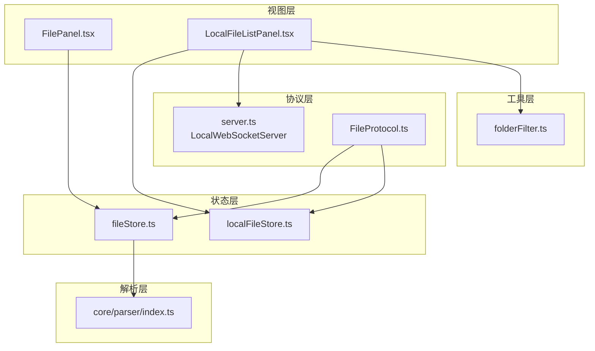
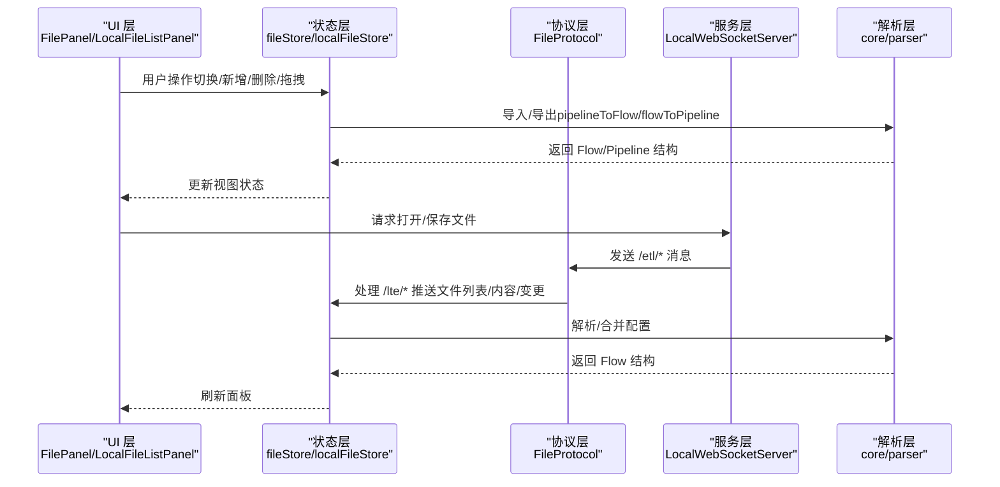
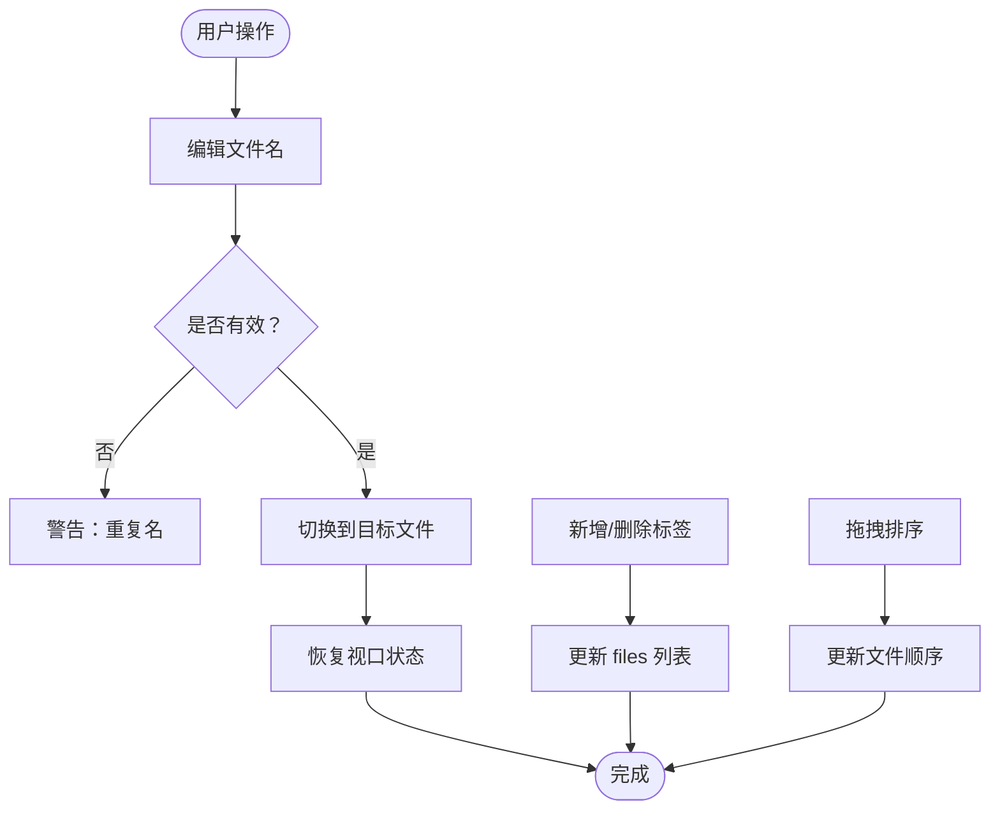
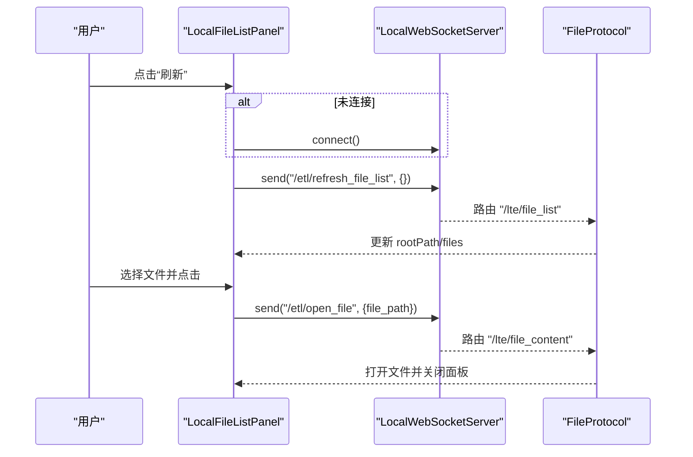
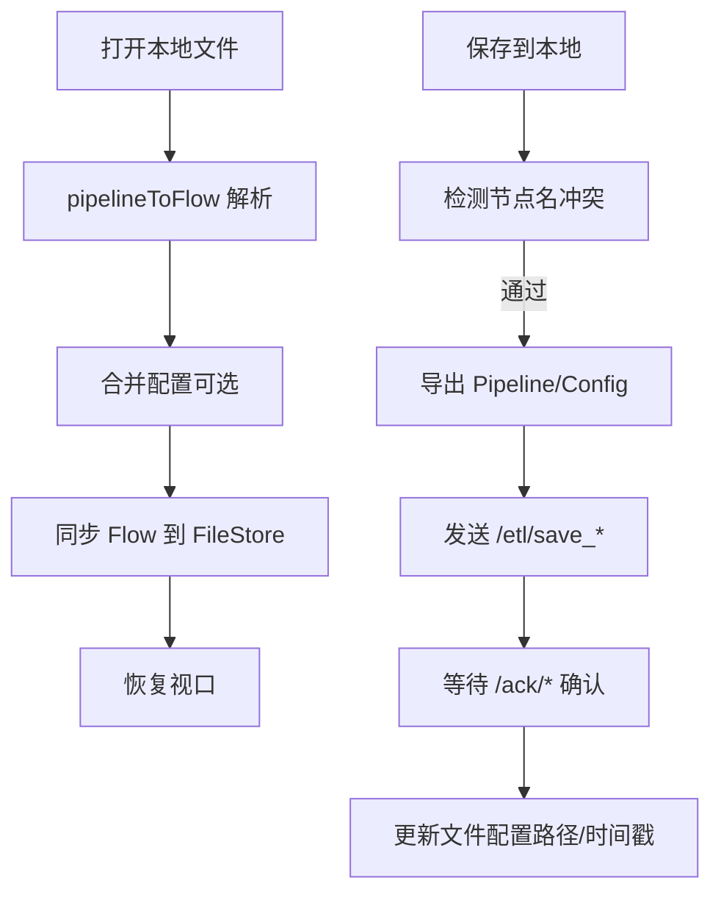
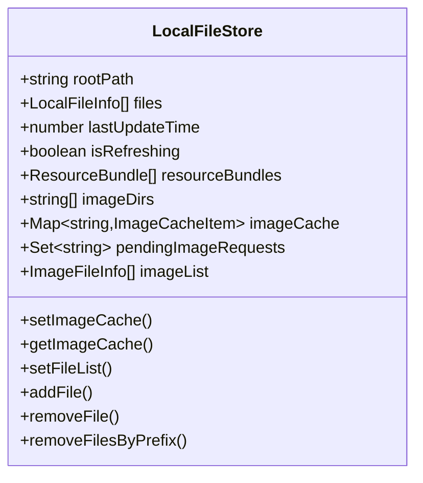
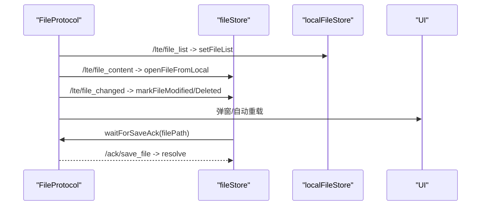
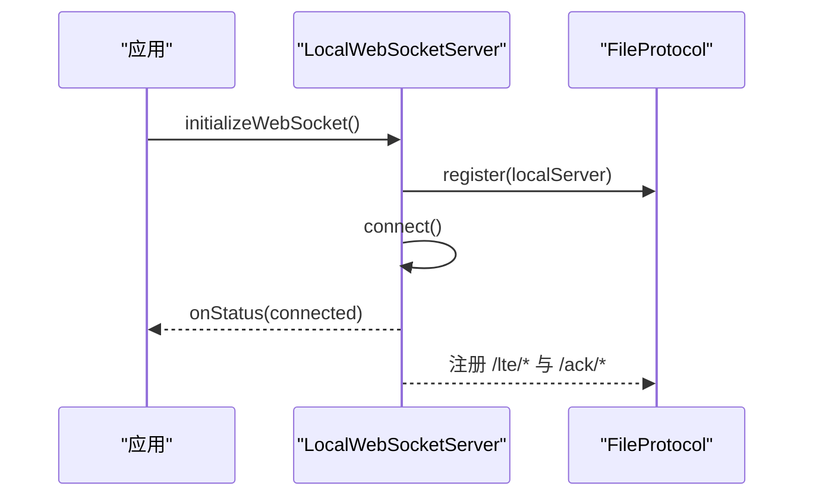
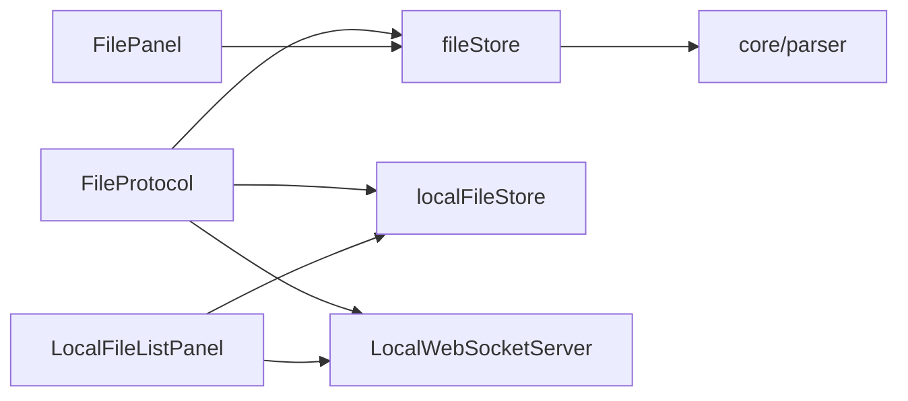
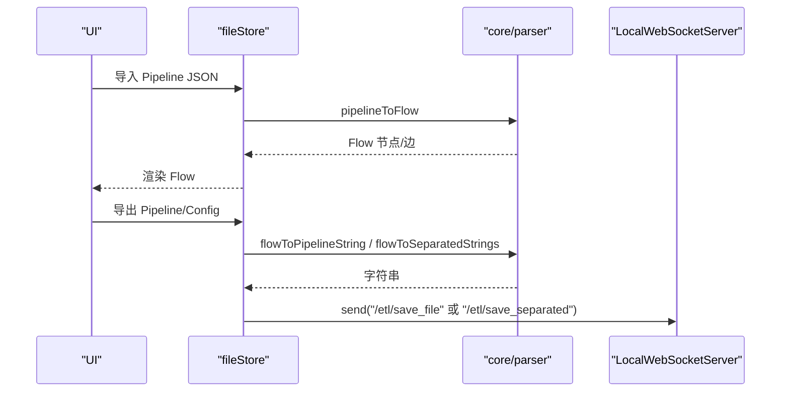

# 文件面板

<cite>
**本文档引用的文件**
- [FilePanel.tsx](file://src/components/panels/main/FilePanel.tsx)
- [LocalFileListPanel.tsx](file://src/components/panels/main/LocalFileListPanel.tsx)
- [fileStore.ts](file://src/stores/fileStore.ts)
- [localFileStore.ts](file://src/stores/localFileStore.ts)
- [FileProtocol.ts](file://src/services/protocols/FileProtocol.ts)
- [server.ts](file://src/services/server.ts)
- [folderFilter.ts](file://src/utils/file/folderFilter.ts)
- [index.ts](file://src/core/parser/index.ts)
</cite>

## 目录
1. [简介](#简介)
2. [项目结构](#项目结构)
3. [核心组件](#核心组件)
4. [架构总览](#架构总览)
5. [详细组件分析](#详细组件分析)
6. [依赖分析](#依赖分析)
7. [性能考虑](#性能考虑)
8. [故障排查指南](#故障排查指南)
9. [结论](#结论)
10. [附录](#附录)

## 简介
本文件面板是 MaaPipelineEditor 的核心文件管理界面，负责：
- 多文件标签页管理与拖拽排序
- 本地文件列表浏览、搜索与一键打开
- 与解析器系统的双向数据流转（Pipeline ↔ Flow）
- 与本地服务的 WebSocket 协议交互（打开/保存/监听文件变更）
- 安全校验与错误处理（重复文件名、节点名冲突、保存确认等）

## 项目结构
文件面板相关代码主要分布在以下模块：
- 视图层：FilePanel（多标签页）、LocalFileListPanel（本地文件列表）
- 状态层：fileStore（文件集合与当前文件）、localFileStore（本地文件缓存）
- 协议层：FileProtocol（WebSocket 文件协议）、server.ts（WebSocket 服务封装）
- 解析层：core/parser（Pipeline/Flow 互转、配置合并/拆分）
- 工具层：folderFilter（文件夹过滤规则解析与匹配）

**图表来源**
- [FilePanel.tsx:1-165](file://src/components/panels/main/FilePanel.tsx#L1-L165)
- [LocalFileListPanel.tsx:1-174](file://src/components/panels/main/LocalFileListPanel.tsx#L1-L174)
- [fileStore.ts:1-933](file://src/stores/fileStore.ts#L1-L933)
- [localFileStore.ts:1-339](file://src/stores/localFileStore.ts#L1-L339)
- [FileProtocol.ts:1-581](file://src/services/protocols/FileProtocol.ts#L1-L581)
- [server.ts:1-388](file://src/services/server.ts#L1-L388)
- [index.ts:1-85](file://src/core/parser/index.ts#L1-L85)
- [folderFilter.ts:1-46](file://src/utils/file/folderFilter.ts#L1-L46)

**章节来源**
- [FilePanel.tsx:1-165](file://src/components/panels/main/FilePanel.tsx#L1-L165)
- [LocalFileListPanel.tsx:1-174](file://src/components/panels/main/LocalFileListPanel.tsx#L1-L174)
- [fileStore.ts:1-933](file://src/stores/fileStore.ts#L1-L933)
- [localFileStore.ts:1-339](file://src/stores/localFileStore.ts#L1-L339)
- [FileProtocol.ts:1-581](file://src/services/protocols/FileProtocol.ts#L1-L581)
- [server.ts:1-388](file://src/services/server.ts#L1-L388)
- [index.ts:1-85](file://src/core/parser/index.ts#L1-L85)
- [folderFilter.ts:1-46](file://src/utils/file/folderFilter.ts#L1-L46)

## 核心组件
- 文件标签页容器：支持文件名编辑、新增/删除标签、拖拽排序
- 本地文件列表面板：展示本地文件树、搜索过滤、刷新、打开文件
- 文件状态管理：多文件集合、当前文件、视口状态、配置缓存
- 本地文件缓存：根路径、文件列表、资源包、图片缓存与列表
- 文件协议：文件列表推送、内容推送、变更通知、保存确认
- WebSocket 服务：连接管理、路由注册、消息发送、状态监听
- 解析器：Pipeline/Flow 互转、分离/合并配置、导出/导入

**章节来源**
- [FilePanel.tsx:48-165](file://src/components/panels/main/FilePanel.tsx#L48-L165)
- [LocalFileListPanel.tsx:21-174](file://src/components/panels/main/LocalFileListPanel.tsx#L21-L174)
- [fileStore.ts:345-571](file://src/stores/fileStore.ts#L345-L571)
- [localFileStore.ts:125-339](file://src/stores/localFileStore.ts#L125-L339)
- [FileProtocol.ts:16-68](file://src/services/protocols/FileProtocol.ts#L16-L68)
- [server.ts:22-343](file://src/services/server.ts#L22-L343)
- [index.ts:19-46](file://src/core/parser/index.ts#L19-L46)

## 架构总览
文件面板通过 Zustand Store 管理状态，通过 WebSocket 与本地服务通信，借助解析器完成 Pipeline 与 Flow 的双向转换。

**图表来源**
- [FilePanel.tsx:48-165](file://src/components/panels/main/FilePanel.tsx#L48-L165)
- [LocalFileListPanel.tsx:67-81](file://src/components/panels/main/LocalFileListPanel.tsx#L67-L81)
- [fileStore.ts:573-661](file://src/stores/fileStore.ts#L573-L661)
- [FileProtocol.ts:44-68](file://src/services/protocols/FileProtocol.ts#L44-L68)
- [server.ts:290-304](file://src/services/server.ts#L290-L304)
- [index.ts:19-26](file://src/core/parser/index.ts#L19-L26)

## 详细组件分析

### 文件标签页组件（FilePanel）
- 功能要点
  - 文件名输入与合法性校验（重复名提示）
  - 标签页切换与视口状态恢复
  - 新增/删除标签与拖拽排序
  - 与“本地文件”面板联动（打开本地文件）
- 关键交互
  - 输入框变更触发文件名更新与有效性检查
  - 标签页 onEdit 回调触发 add/remove
  - DndKit 拖拽结束后更新 files 顺序

**图表来源**
- [FilePanel.tsx:74-104](file://src/components/panels/main/FilePanel.tsx#L74-L104)
- [fileStore.ts:430-496](file://src/stores/fileStore.ts#L430-L496)
- [fileStore.ts:538-549](file://src/stores/fileStore.ts#L538-L549)

**章节来源**
- [FilePanel.tsx:48-165](file://src/components/panels/main/FilePanel.tsx#L48-L165)
- [fileStore.ts:380-408](file://src/stores/fileStore.ts#L380-L408)
- [fileStore.ts:430-496](file://src/stores/fileStore.ts#L430-L496)
- [fileStore.ts:538-549](file://src/stores/fileStore.ts#L538-L549)

### 本地文件列表面板（LocalFileListPanel）
- 功能要点
  - 展示本地文件根路径与总数
  - 文件夹过滤与关键词搜索
  - 刷新文件列表（/etl/refresh_file_list）
  - 点击打开文件（/etl/open_file）
- 关键流程
  - 连接状态判断与消息提示
  - 过滤逻辑：先按文件夹过滤，再按关键词二次过滤
  - 打开文件后关闭面板

**图表来源**
- [LocalFileListPanel.tsx:52-81](file://src/components/panels/main/LocalFileListPanel.tsx#L52-L81)
- [FileProtocol.ts:78-103](file://src/services/protocols/FileProtocol.ts#L78-L103)
- [FileProtocol.ts:109-141](file://src/services/protocols/FileProtocol.ts#L109-L141)

**章节来源**
- [LocalFileListPanel.tsx:21-174](file://src/components/panels/main/LocalFileListPanel.tsx#L21-L174)
- [folderFilter.ts:34-45](file://src/utils/file/folderFilter.ts#L34-L45)
- [server.ts:290-304](file://src/services/server.ts#L290-L304)

### 文件状态管理（fileStore）
- 职责
  - 维护 files 数组与 currentFile
  - 文件名更新、配置更新、切换文件
  - 本地存储（localStorage）与配置缓存
  - 从本地打开/保存到本地（含分离/集成模式）
  - 外部修改检测与重载
- 关键能力
  - pipelineToFlow/flowToPipelineString/flowToSeparatedStrings
  - 保存前节点名冲突检测
  - 保存确认机制（waitForSaveAck）

**图表来源**
- [fileStore.ts:573-661](file://src/stores/fileStore.ts#L573-L661)
- [fileStore.ts:663-847](file://src/stores/fileStore.ts#L663-L847)
- [index.ts:19-26](file://src/core/parser/index.ts#L19-L26)

**章节来源**
- [fileStore.ts:345-571](file://src/stores/fileStore.ts#L345-L571)
- [fileStore.ts:663-847](file://src/stores/fileStore.ts#L663-L847)
- [index.ts:19-46](file://src/core/parser/index.ts#L19-L46)

### 本地文件缓存（localFileStore）
- 职责
  - 存储从本地服务推送的文件列表
  - 资源包信息、图片缓存与图片列表
  - 增量更新（添加/删除/按前缀批量删除）
- 使用场景
  - LocalFileListPanel 渲染文件列表
  - 资源包与图片预览功能

**图表来源**
- [localFileStore.ts:125-339](file://src/stores/localFileStore.ts#L125-L339)

**章节来源**
- [localFileStore.ts:125-339](file://src/stores/localFileStore.ts#L125-L339)

### 文件协议（FileProtocol）
- 职责
  - 注册 /lte/* 推送路由与 /ack/* 确认路由
  - 处理文件列表、内容、变更推送
  - 保存确认等待与超时处理
  - 文件变更通知（创建/修改/删除/重命名）
- 交互要点
  - 自动重载开关与手动确认弹窗
  - 分离/集成保存模式下的不同 ACK 路径

**图表来源**
- [FileProtocol.ts:44-68](file://src/services/protocols/FileProtocol.ts#L44-L68)
- [FileProtocol.ts:78-141](file://src/services/protocols/FileProtocol.ts#L78-L141)
- [FileProtocol.ts:147-231](file://src/services/protocols/FileProtocol.ts#L147-L231)
- [FileProtocol.ts:237-289](file://src/services/protocols/FileProtocol.ts#L237-L289)
- [FileProtocol.ts:541-568](file://src/services/protocols/FileProtocol.ts#L541-L568)

**章节来源**
- [FileProtocol.ts:16-68](file://src/services/protocols/FileProtocol.ts#L16-L68)
- [FileProtocol.ts:78-231](file://src/services/protocols/FileProtocol.ts#L78-L231)
- [FileProtocol.ts:237-289](file://src/services/protocols/FileProtocol.ts#L237-L289)
- [FileProtocol.ts:541-568](file://src/services/protocols/FileProtocol.ts#L541-L568)

### WebSocket 服务（LocalWebSocketServer）
- 职责
  - 连接管理、握手、路由注册
  - 系统级路由（握手响应）
  - 发送消息、状态监听、超时处理
- 与协议层协作
  - 初始化时注册各协议（FileProtocol、MFWProtocol 等）

**图表来源**
- [server.ts:361-387](file://src/services/server.ts#L361-L387)
- [server.ts:109-255](file://src/services/server.ts#L109-L255)

**章节来源**
- [server.ts:22-343](file://src/services/server.ts#L22-L343)
- [server.ts:361-387](file://src/services/server.ts#L361-L387)

## 依赖分析
- 组件耦合
  - FilePanel 依赖 fileStore（文件名、切换、拖拽）
  - LocalFileListPanel 依赖 localFileStore（文件列表）与 server（发送请求）
- 状态耦合
  - fileStore 与 core/parser 互转，与 server 协议交互
  - localFileStore 仅作为本地文件缓存，不持久化
- 协议耦合
  - FileProtocol 依赖 fileStore 与 localFileStore，并通过 server 发送消息
- 错误与安全
  - 重复文件名、节点名冲突、保存确认超时、连接超时与版本不匹配

**图表来源**
- [FilePanel.tsx:18-86](file://src/components/panels/main/FilePanel.tsx#L18-L86)
- [LocalFileListPanel.tsx:10-16](file://src/components/panels/main/LocalFileListPanel.tsx#L10-L16)
- [fileStore.ts:19-21](file://src/stores/fileStore.ts#L19-L21)
- [FileProtocol.ts:5-10](file://src/services/protocols/FileProtocol.ts#L5-L10)
- [server.ts:345-355](file://src/services/server.ts#L345-L355)

**章节来源**
- [FilePanel.tsx:18-86](file://src/components/panels/main/FilePanel.tsx#L18-L86)
- [LocalFileListPanel.tsx:10-16](file://src/components/panels/main/LocalFileListPanel.tsx#L10-L16)
- [fileStore.ts:19-21](file://src/stores/fileStore.ts#L19-L21)
- [FileProtocol.ts:5-10](file://src/services/protocols/FileProtocol.ts#L5-L10)
- [server.ts:345-355](file://src/services/server.ts#L345-L355)

## 性能考虑
- 渲染优化
  - FilePanel 使用 memo 包装可减少重渲染
  - 本地文件列表采用 useMemo 过滤，避免每次渲染都计算
- 状态更新
  - fileStore 在切换文件时仅同步必要字段，减少不必要的状态扩散
- 网络与确认
  - 保存采用等待 ACK 的异步确认，避免 UI 与后端状态不一致
- 缓存策略
  - localFileStore 不持久化，始终从后端拉取最新列表，保证一致性
- 搜索与过滤
  - folderFilter 对路径标准化与大小写无关，提升匹配效率

[本节为通用性能建议，无需特定文件引用]

## 故障排查指南
- 无法连接本地服务
  - 检查端口与服务状态，查看连接超时与错误提示
  - 确认协议版本匹配，避免握手失败
- 保存失败或未生效
  - 检查是否存在重复节点名，保存前会阻断
  - 等待 /ack/* 确认，超时会返回失败
- 文件被外部修改
  - 自动重载或弹窗确认，确认后会重新加载
  - 若为目录重命名/删除，会标记已打开文件为已删除
- 本地存储空间不足
  - 本地缓存失败时会提示清理或减少文件数量

**章节来源**
- [server.ts:131-163](file://src/services/server.ts#L131-L163)
- [server.ts:186-254](file://src/services/server.ts#L186-L254)
- [FileProtocol.ts:237-289](file://src/services/protocols/FileProtocol.ts#L237-L289)
- [fileStore.ts:688-699](file://src/stores/fileStore.ts#L688-L699)
- [fileStore.ts:260-272](file://src/stores/fileStore.ts#L260-L272)

## 结论
文件面板通过清晰的分层设计实现了文件管理的完整闭环：UI 交互 → 状态管理 → 协议通信 → 解析转换。其具备完善的错误处理与安全校验机制，并通过 WebSocket 保障与本地服务的实时一致性。扩展方面，可通过协议与解析器接口接入更多文件类型与自定义流程。

[本节为总结性内容，无需特定文件引用]

## 附录

### 文件导入/导出流程（序列化/反序列化）

**图表来源**
- [fileStore.ts:573-661](file://src/stores/fileStore.ts#L573-L661)
- [fileStore.ts:663-847](file://src/stores/fileStore.ts#L663-L847)
- [index.ts:19-26](file://src/core/parser/index.ts#L19-L26)

### 配置管理与本地文件列表
- 配置项
  - 文件自动重载开关
  - 分离/集成保存模式
  - JSON 缩进设置
- 本地文件列表
  - 文件夹过滤规则（支持逗号、分号、中文分号与换行分隔）
  - 相对路径匹配，大小写无关

**章节来源**
- [FileProtocol.ts:414-469](file://src/services/protocols/FileProtocol.ts#L414-L469)
- [fileStore.ts:768-770](file://src/stores/fileStore.ts#L768-L770)
- [folderFilter.ts:16-45](file://src/utils/file/folderFilter.ts#L16-L45)

### 安全验证与错误处理清单
- 文件名唯一性校验（setFileName）
- 节点名重复检测（保存前）
- 保存确认超时（10 秒）
- 连接超时与版本不匹配提示
- 本地存储配额不足告警

**章节来源**
- [fileStore.ts:380-408](file://src/stores/fileStore.ts#L380-L408)
- [fileStore.ts:688-699](file://src/stores/fileStore.ts#L688-L699)
- [FileProtocol.ts:541-568](file://src/services/protocols/FileProtocol.ts#L541-L568)
- [server.ts:131-163](file://src/services/server.ts#L131-L163)

### 开发扩展与自定义文件类型指南
- 扩展步骤
  - 在协议层增加新的 /etl/* 请求与 /lte/* 推送路由
  - 在 fileStore 中新增对应的状态更新与保存逻辑
  - 在 UI 中添加按钮或菜单项触发相应流程
- 自定义文件类型
  - 通过 core/parser 的导出/导入接口扩展格式
  - 在 LocalFileListPanel 中增加类型筛选与图标
  - 在 folderFilter 中完善路径匹配规则

[本节为通用开发指导，无需特定文件引用]