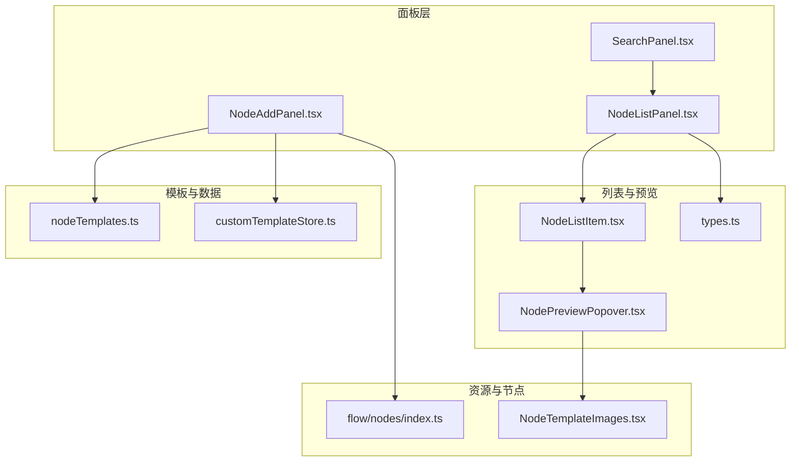
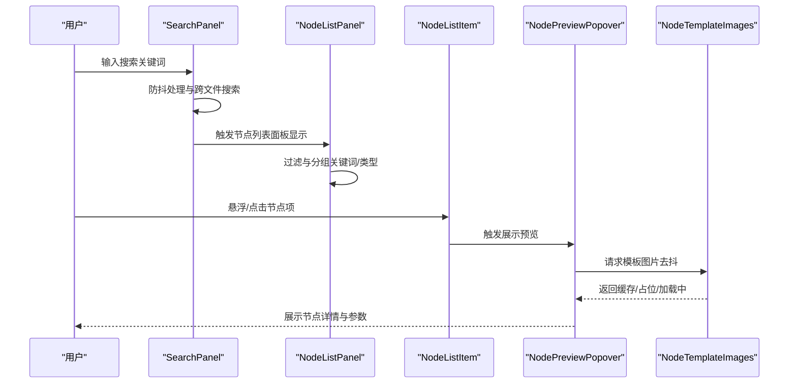
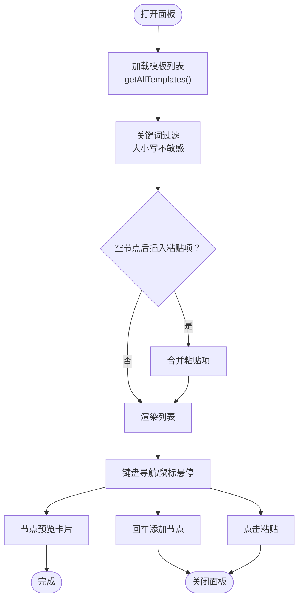
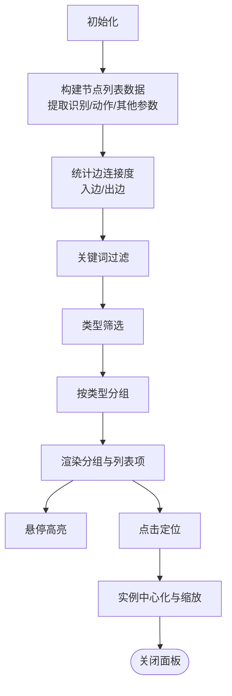
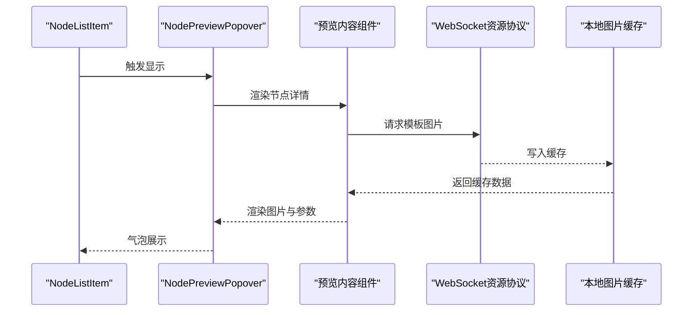
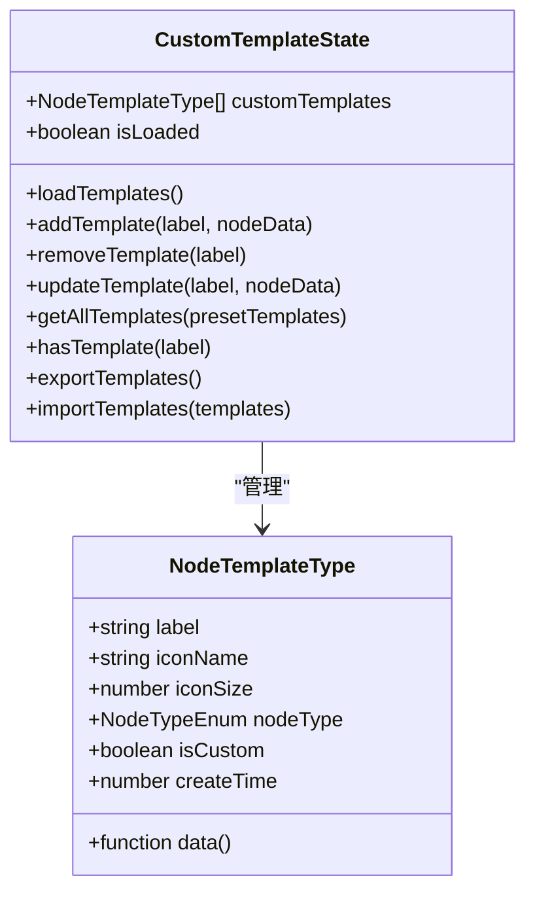
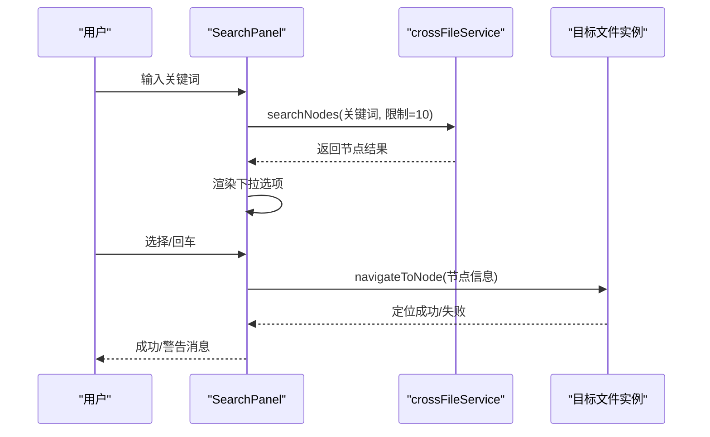
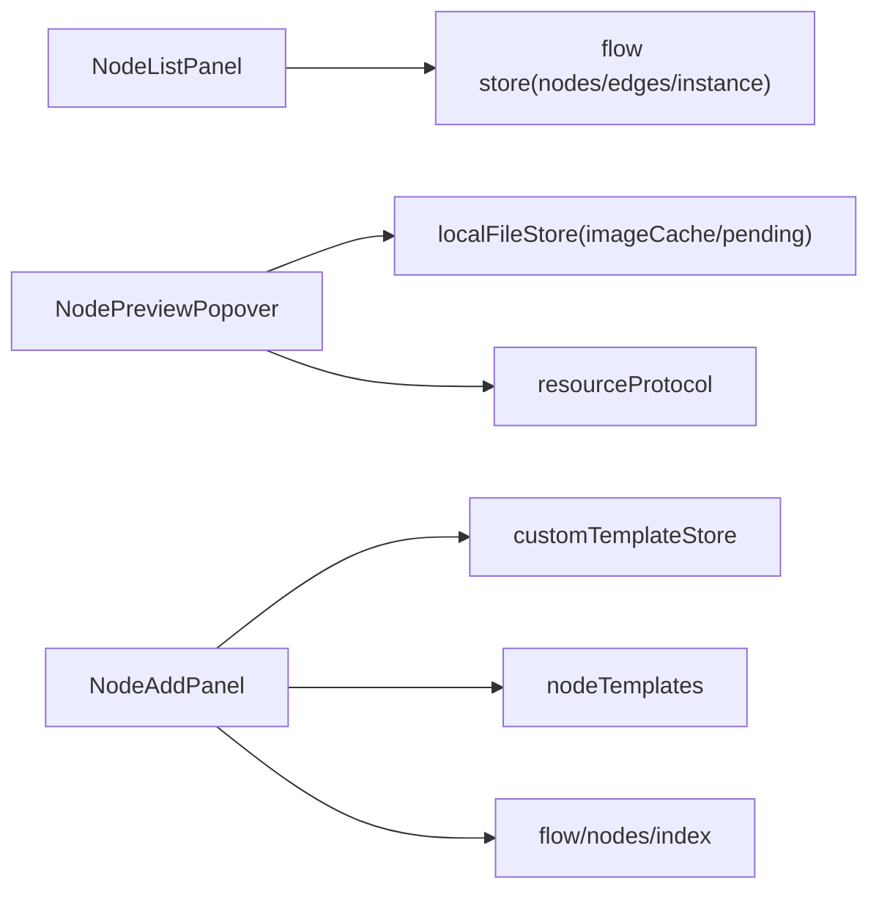

# 节点列表面板

<cite>
**本文档引用的文件**
- [NodeAddPanel.tsx](file://src/components/panels/main/NodeAddPanel.tsx)
- [SearchPanel.tsx](file://src/components/panels/main/SearchPanel.tsx)
- [NodeListPanel.tsx](file://src/components/panels/main/node-list/NodeListPanel.tsx)
- [NodePreviewPopover.tsx](file://src/components/panels/main/node-list/NodePreviewPopover.tsx)
- [NodeListItem.tsx](file://src/components/panels/main/node-list/NodeListItem.tsx)
- [types.ts](file://src/components/panels/main/node-list/types.ts)
- [nodeTemplates.ts](file://src/data/nodeTemplates.ts)
- [customTemplateStore.ts](file://src/stores/customTemplateStore.ts)
- [NodeTemplateImages.tsx](file://src/components/flow/nodes/components/NodeTemplateImages.tsx)
- [index.ts](file://src/components/flow/nodes/index.ts)
</cite>

## 目录
1. [简介](#简介)
2. [项目结构](#项目结构)
3. [核心组件](#核心组件)
4. [架构总览](#架构总览)
5. [详细组件分析](#详细组件分析)
6. [依赖关系分析](#依赖关系分析)
7. [性能考量](#性能考量)
8. [故障排查指南](#故障排查指南)
9. [结论](#结论)
10. [附录](#附录)

## 简介
本文件系统性梳理“节点列表面板”的设计与实现，覆盖以下关键主题：
- 节点分类展示：按节点类型分组、展开/折叠、统计信息
- 搜索过滤：关键词过滤、类型筛选、跨文件搜索与AI辅助搜索
- 预览功能：节点列表项悬浮预览、模板图片预览、参数摘要
- 模板管理：内置模板、自定义模板、持久化存储、导入导出
- 动态加载与缓存：模板图片懒加载、请求去抖、WebSocket资源协议
- 排序与分组：节点列表分组策略、边连接度统计、交互定位
- 交互体验：键盘导航、遮罩点击关闭、面板定位与动画
- 性能优化与扩展：虚拟滚动建议、缓存命中率提升、模板数量限制
- 自定义节点集成：模板保存、节点上下文构建、扩展系统对接

## 项目结构
节点列表相关代码主要分布在以下模块：
- 面板入口与交互：NodeAddPanel（节点添加面板）、SearchPanel（搜索面板）
- 列表与预览：NodeListPanel（节点列表面板）、NodeListItem（列表项）、NodePreviewPopover（预览气泡）
- 数据与模板：nodeTemplates（内置模板）、customTemplateStore（自定义模板存储）
- 资源与图片：NodeTemplateImages（模板图片展示）、WebSocket资源协议
- 节点类型注册：flow/nodes/index（节点类型映射）

**图表来源**
- [SearchPanel.tsx:424-431](file://src/components/panels/main/SearchPanel.tsx#L424-L431)
- [NodeAddPanel.tsx:8-14](file://src/components/panels/main/NodeAddPanel.tsx#L8-L14)
- [NodeListPanel.tsx:17-23](file://src/components/panels/main/node-list/NodeListPanel.tsx#L17-L23)
- [NodeListItem.tsx](file://src/components/panels/main/node-list/NodeListItem.tsx#L8)
- [NodePreviewPopover.tsx:17-19](file://src/components/panels/main/node-list/NodePreviewPopover.tsx#L17-L19)
- [nodeTemplates.ts:1-11](file://src/data/nodeTemplates.ts#L1-L11)
- [customTemplateStore.ts:24-43](file://src/stores/customTemplateStore.ts#L24-L43)
- [NodeTemplateImages.tsx:1-10](file://src/components/flow/nodes/components/NodeTemplateImages.tsx#L1-L10)
- [index.ts:8-14](file://src/components/flow/nodes/index.ts#L8-L14)

**章节来源**
- [SearchPanel.tsx:424-431](file://src/components/panels/main/SearchPanel.tsx#L424-L431)
- [NodeAddPanel.tsx:8-14](file://src/components/panels/main/NodeAddPanel.tsx#L8-L14)
- [NodeListPanel.tsx:17-23](file://src/components/panels/main/node-list/NodeListPanel.tsx#L17-L23)

## 核心组件
- 节点添加面板（NodeAddPanel）：提供模板列表、搜索、键盘导航、粘贴板集成、模板删除、节点预览。
- 节点列表面板（NodeListPanel）：按类型分组展示节点、关键词与类型过滤、统计信息、展开/折叠、点击定位。
- 节点预览气泡（NodePreviewPopover）：悬浮预览节点详情，含识别/动作类型、参数摘要、模板图片。
- 列表项组件（NodeListItem）：承载单个节点项的渲染与交互。
- 模板系统：内置模板（nodeTemplates）与自定义模板（customTemplateStore），支持持久化、导入导出、数量限制。
- 资源图片：NodeTemplateImages 与 NodePreviewPopover 结合 WebSocket 资源协议实现模板图片的懒加载与缓存。

**章节来源**
- [NodeAddPanel.tsx:277-708](file://src/components/panels/main/NodeAddPanel.tsx#L277-L708)
- [NodeListPanel.tsx:46-426](file://src/components/panels/main/node-list/NodeListPanel.tsx#L46-L426)
- [NodePreviewPopover.tsx:279-311](file://src/components/panels/main/node-list/NodePreviewPopover.tsx#L279-L311)
- [NodeListItem.tsx:22-109](file://src/components/panels/main/node-list/NodeListItem.tsx#L22-L109)
- [nodeTemplates.ts:13-107](file://src/data/nodeTemplates.ts#L13-L107)
- [customTemplateStore.ts:45-327](file://src/stores/customTemplateStore.ts#L45-L327)
- [NodeTemplateImages.tsx:21-88](file://src/components/flow/nodes/components/NodeTemplateImages.tsx#L21-L88)

## 架构总览
节点列表面板围绕“数据—展示—交互—资源”的闭环组织：
- 数据层：flow store 提供节点与边集合；模板通过 nodeTemplates 与 customTemplateStore 管理。
- 展示层：NodeListPanel 负责分组与过滤；NodeListItem 渲染单项；NodePreviewPopover 提供悬浮预览。
- 交互层：键盘导航、点击定位、遮罩关闭、面板定位与动画。
- 资源层：NodeTemplateImages 与 NodePreviewPopover 通过 resourceProtocol 请求图片，结合本地缓存与 pending 队列。

**图表来源**
- [SearchPanel.tsx:66-92](file://src/components/panels/main/SearchPanel.tsx#L66-L92)
- [NodeListPanel.tsx:162-182](file://src/components/panels/main/node-list/NodeListPanel.tsx#L162-L182)
- [NodeListItem.tsx:64-105](file://src/components/panels/main/node-list/NodeListItem.tsx#L64-L105)
- [NodePreviewPopover.tsx:279-311](file://src/components/panels/main/node-list/NodePreviewPopover.tsx#L279-L311)
- [NodeTemplateImages.tsx:40-64](file://src/components/flow/nodes/components/NodeTemplateImages.tsx#L40-L64)

## 详细组件分析

### 节点添加面板（NodeAddPanel）
- 模板聚合：通过 getAllTemplates 合并内置模板与自定义模板，保证固定顺序（空节点、外部、锚点、便签、分组、自定义、其他预设）。
- 搜索过滤：基于关键词进行大小写不敏感匹配，支持粘贴板项在“空节点”后插入。
- 键盘导航：上下箭头切换、回车确认、ESC 关闭；自动滚动到可视区域。
- 预览渲染：根据节点类型与参数生成预览卡片，支持识别/动作/其他参数摘要。
- 交互细节：遮罩层点击关闭；右键可重新打开至新位置；面板位置根据鼠标与容器宽度自动适配左右布局。

**图表来源**
- [NodeAddPanel.tsx:308-343](file://src/components/panels/main/NodeAddPanel.tsx#L308-L343)
- [NodeAddPanel.tsx:409-444](file://src/components/panels/main/NodeAddPanel.tsx#L409-L444)
- [NodeAddPanel.tsx:535-553](file://src/components/panels/main/NodeAddPanel.tsx#L535-L553)

**章节来源**
- [NodeAddPanel.tsx:277-708](file://src/components/panels/main/NodeAddPanel.tsx#L277-L708)
- [customTemplateStore.ts:212-265](file://src/stores/customTemplateStore.ts#L212-L265)

### 节点列表面板（NodeListPanel）
- 分组与展开：按 NodeTypeEnum 分组，初始展开全部类型；点击分组头部切换展开状态。
- 过滤策略：关键词同时匹配 label、识别类型、动作类型；类型下拉筛选。
- 边连接度统计：遍历边集计算每个节点的入边/出边数量，用于列表项右侧展示。
- 点击定位：选中目标节点并调用实例中心化与缩放，聚焦到节点可视区域。
- 外部点击关闭：监听文档级鼠标事件，排除 antd 弹出层，点击面板外部或锚点以外区域关闭。
- 统计信息：显示总数与各类型数量，便于快速概览。

**图表来源**
- [NodeListPanel.tsx:128-159](file://src/components/panels/main/node-list/NodeListPanel.tsx#L128-L159)
- [NodeListPanel.tsx:106-125](file://src/components/panels/main/node-list/NodeListPanel.tsx#L106-L125)
- [NodeListPanel.tsx:162-182](file://src/components/panels/main/node-list/NodeListPanel.tsx#L162-L182)
- [NodeListPanel.tsx:185-209](file://src/components/panels/main/node-list/NodeListPanel.tsx#L185-L209)
- [NodeListPanel.tsx:225-250](file://src/components/panels/main/node-list/NodeListPanel.tsx#L225-L250)

**章节来源**
- [NodeListPanel.tsx:46-426](file://src/components/panels/main/node-list/NodeListPanel.tsx#L46-L426)
- [types.ts:10-49](file://src/components/panels/main/node-list/types.ts#L10-L49)

### 节点预览气泡（NodePreviewPopover）
- 预览内容：根据节点类型渲染不同样式；Pipeline 节点展示识别/动作/其他参数摘要，并限制参数展示数量。
- 模板图片：通过 resourceProtocol 请求模板图片，结合本地 imageCache 与 pendingImageRequests 实现缓存与占位。
- 交互行为：鼠标进入延时触发，离开快速收起；固定最大宽度，支持溢出调整。

**图表来源**
- [NodePreviewPopover.tsx:279-311](file://src/components/panels/main/node-list/NodePreviewPopover.tsx#L279-L311)
- [NodePreviewPopover.tsx:44-274](file://src/components/panels/main/node-list/NodePreviewPopover.tsx#L44-L274)
- [NodeTemplateImages.tsx:40-64](file://src/components/flow/nodes/components/NodeTemplateImages.tsx#L40-L64)

**章节来源**
- [NodePreviewPopover.tsx:279-311](file://src/components/panels/main/node-list/NodePreviewPopover.tsx#L279-L311)
- [NodeTemplateImages.tsx:21-88](file://src/components/flow/nodes/components/NodeTemplateImages.tsx#L21-L88)

### 模板管理与动态加载
- 内置模板：nodeTemplates 定义基础模板，包含图标、类型与默认数据工厂。
- 自定义模板：customTemplateStore 提供持久化存储、版本校验、数量限制、导入导出、增删改查。
- 动态加载：getAllTemplates 按固定顺序合并内置与自定义模板；NodeAddPanel 使用 useMemo 缓存渲染项。
- 缓存策略：模板数据序列化/反序列化，localStorage 存储；加载失败自动清理并提示。

**图表来源**
- [nodeTemplates.ts:3-11](file://src/data/nodeTemplates.ts#L3-L11)
- [customTemplateStore.ts:24-43](file://src/stores/customTemplateStore.ts#L24-L43)

**章节来源**
- [nodeTemplates.ts:13-107](file://src/data/nodeTemplates.ts#L13-L107)
- [customTemplateStore.ts:45-327](file://src/stores/customTemplateStore.ts#L45-L327)

### 搜索与跨文件定位
- 搜索面板：支持普通搜索与AI搜索；普通搜索使用 crossFileService 的 searchNodes，返回节点列表并渲染 AutoComplete。
- 跨文件跳转：navigateToNode 支持跳转到其他文件并定位节点；loadAndNavigate 提供超时与错误处理。
- AI搜索：构建节点上下文，发送给 AIClient，解析响应并定位节点。

**图表来源**
- [SearchPanel.tsx:66-92](file://src/components/panels/main/SearchPanel.tsx#L66-L92)
- [SearchPanel.tsx:134-148](file://src/components/panels/main/SearchPanel.tsx#L134-L148)
- [SearchPanel.tsx:225-279](file://src/components/panels/main/SearchPanel.tsx#L225-L279)

**章节来源**
- [SearchPanel.tsx:28-437](file://src/components/panels/main/SearchPanel.tsx#L28-L437)

## 依赖关系分析
- 组件耦合：NodeListPanel 依赖 flow store 的 nodes/edges/instance；NodePreviewPopover 依赖本地文件缓存与资源协议；NodeAddPanel 依赖模板存储与剪贴板。
- 外部依赖：Ant Design 组件（Select/Input/AutoComplete/Popover）、ahooks 防抖、WebSocket 资源协议。
- 节点类型注册：flow/nodes/index 提供节点类型映射，确保 React Flow 正确渲染。

**图表来源**
- [NodeListPanel.tsx:48-50](file://src/components/panels/main/node-list/NodeListPanel.tsx#L48-L50)
- [NodePreviewPopover.tsx:8-11](file://src/components/panels/main/node-list/NodePreviewPopover.tsx#L8-L11)
- [NodeAddPanel.tsx:11-14](file://src/components/panels/main/NodeAddPanel.tsx#L11-L14)
- [index.ts:8-14](file://src/components/flow/nodes/index.ts#L8-L14)

**章节来源**
- [NodeListPanel.tsx:46-103](file://src/components/panels/main/node-list/NodeListPanel.tsx#L46-L103)
- [NodePreviewPopover.tsx:44-83](file://src/components/panels/main/node-list/NodePreviewPopover.tsx#L44-L83)
- [NodeAddPanel.tsx:277-311](file://src/components/panels/main/NodeAddPanel.tsx#L277-L311)
- [index.ts:8-14](file://src/components/flow/nodes/index.ts#L8-L14)

## 性能考量
- 渲染优化
  - 使用 useMemo 缓存模板列表与渲染项，减少不必要的重渲染。
  - 列表项使用 memo 包装，预览内容组件也采用 memo，避免重复渲染。
- 搜索与过滤
  - 搜索使用防抖（300ms），降低频繁查询带来的性能压力。
  - 过滤逻辑在内存中进行，建议在节点规模较大时考虑虚拟滚动。
- 图片加载
  - NodeTemplateImages 与 NodePreviewPopover 对模板图片请求进行去抖与缓存，避免重复请求。
  - pendingImageRequests 队列防止重复发起相同资源请求。
- 存储与模板
  - 自定义模板数量限制（默认50），防止过度膨胀影响加载速度。
  - 版本校验与失败回滚，保障数据一致性与性能稳定。

**章节来源**
- [NodeAddPanel.tsx:308-343](file://src/components/panels/main/NodeAddPanel.tsx#L308-L343)
- [NodeListPanel.tsx:162-182](file://src/components/panels/main/node-list/NodeListPanel.tsx#L162-L182)
- [NodeTemplateImages.tsx:12-16](file://src/components/flow/nodes/components/NodeTemplateImages.tsx#L12-L16)
- [customTemplateStore.ts:20-22](file://src/stores/customTemplateStore.ts#L20-L22)

## 故障排查指南
- 模板加载失败
  - 现象：自定义模板未显示或报错。
  - 排查：检查 localStorage 中存储版本号与当前版本是否一致；若不一致会自动清空并提示。
  - 处理：尝试重新保存模板或手动导入备份。
- 图片无法显示
  - 现象：模板图片占位或加载中状态持续。
  - 排查：确认 WebSocket 连接状态；检查 pendingImageRequests 是否存在重复请求；查看 imageCache 是否命中。
  - 处理：刷新页面重试；检查资源路径有效性。
- 节点定位失败
  - 现象：点击节点列表项无反应或定位异常。
  - 排查：确认 flow store 中 nodes/edges/instance 是否就绪；检查节点 ID 是否正确。
  - 处理：等待实例初始化完成；重新选择节点。
- 搜索无结果
  - 现象：输入关键词无下拉或跳转失败。
  - 排查：确认 crossFileService 的启用状态与文件扫描范围；检查节点标签是否包含关键词。
  - 处理：缩小关键词范围；开启跨文件搜索。

**章节来源**
- [customTemplateStore.ts:50-94](file://src/stores/customTemplateStore.ts#L50-L94)
- [NodeTemplateImages.tsx:40-64](file://src/components/flow/nodes/components/NodeTemplateImages.tsx#L40-L64)
- [NodeListPanel.tsx:225-250](file://src/components/panels/main/node-list/NodeListPanel.tsx#L225-L250)
- [SearchPanel.tsx:66-92](file://src/components/panels/main/SearchPanel.tsx#L66-L92)

## 结论
节点列表面板通过清晰的数据—展示—交互—资源链路，实现了高效、直观的节点浏览与操作体验。内置与自定义模板体系完善，配合搜索与预览能力，显著提升了编辑效率。未来可在大规模节点场景引入虚拟滚动与更细粒度的缓存策略，进一步优化性能与稳定性。

## 附录

### 节点类型与图标映射
- Pipeline：通用流水线节点，展示识别/动作/其他参数。
- External：外部引用节点，表示对外部节点的引用。
- Anchor：锚点节点，用于流程重定向。
- Sticker：便签贴纸，用于注释与说明。
- Group：分组框，用于节点分组管理。

**章节来源**
- [types.ts:54-63](file://src/components/panels/main/node-list/types.ts#L54-L63)

### 节点模板保存与扩展
- 保存为模板：通过上下文菜单保存 Pipeline 节点为模板，进入 NodeAddPanel 的模板列表。
- 自定义模板：支持命名、数量限制与版本管理，便于团队共享与复用。
- 扩展集成：结合扩展系统（自定义识别/动作），在模板中注入自定义字段，实现复杂业务逻辑的可视化配置。

**章节来源**
- [NodeAddPanel.tsx:389-406](file://src/components/panels/main/NodeAddPanel.tsx#L389-L406)
- [customTemplateStore.ts:96-170](file://src/stores/customTemplateStore.ts#L96-L170)
- [index.ts:8-14](file://src/components/flow/nodes/index.ts#L8-L14)